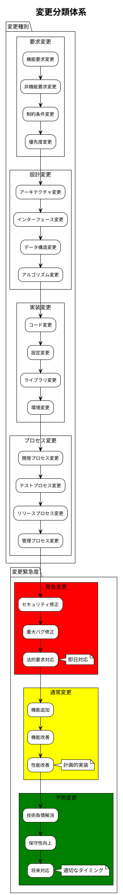
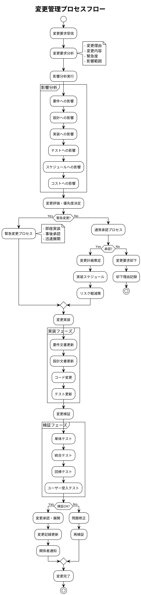
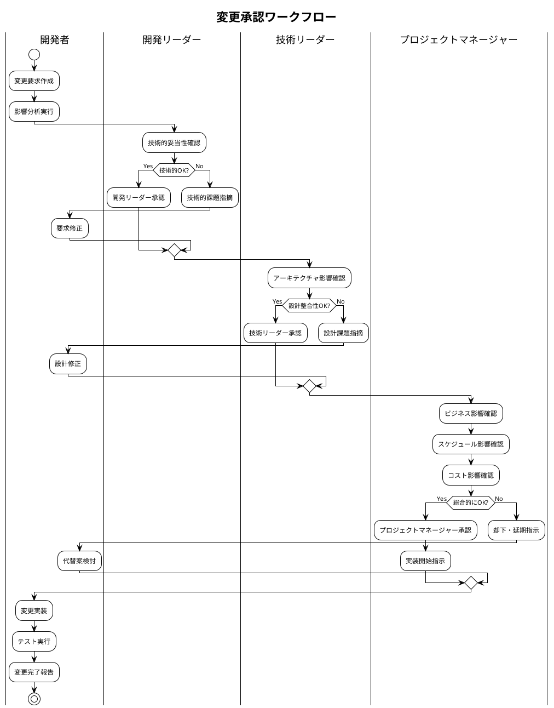

# 変更管理計画書 - Zoom Video Mover

## 文書概要
**プロジェクト名**: Zoom Video Mover  
**作成日**: 2025-08-02  
  
**バージョン**: 1.0  

## 変更管理概要

### 変更管理の目的
1. **品質保証**: 変更による品質低下の防止
2. **影響制御**: 変更の影響範囲を適切に管理
3. **透明性確保**: 変更内容・理由の明確化
4. **承認統制**: 適切な権限者による変更承認

### 変更管理原則
- **統制された変更**: すべての変更は管理プロセスを経る
- **影響分析**: 変更前に影響範囲を詳細分析
- **段階的実装**: リスクを最小化する段階的展開
- **文書化**: 変更内容・理由・影響の完全記録

## 変更分類体系

### 変更カテゴリ



### 変更影響度レベル

| 影響度 | 定義 | 例 | 承認者 | 実装期間 |
|--------|------|----|---------|---------| 
| **Critical** | システム全体に影響 | アーキテクチャ変更 | プロジェクトマネージャー | 1-4週間 |
| **High** | 複数コンポーネントに影響 | API仕様変更 | 技術リーダー | 3-10日 |
| **Medium** | 単一コンポーネントに影響 | 機能追加 | 開発リーダー | 1-3日 |
| **Low** | 局所的影響のみ | バグ修正、文書更新 | 開発者 | 即日-1日 |

## 変更管理プロセス

### 標準変更管理フロー



### 緊急変更プロセス

```plantuml
@startuml
!theme plain
title 緊急変更プロセス

start

:緊急事態発生;

:緊急度判定;

if (生産停止レベル?) then (Yes)
  :即座対応開始;
  :関係者緊急召集;
  
  parallel
    :緊急修正実装;
  parallel also
    :影響範囲調査;
  parallel also
    :ステークホルダー通知;
  end parallel
  
  :緊急修正展開;
  :正常稼働確認;
  
  :事後分析・承認;
  :正式変更手続き;
  :再発防止策;
  
else (No)
  :通常変更プロセス;
endif

:変更完了記録;

stop

@enduml
```

## 変更要求管理

### 変更要求テンプレート

```markdown
# 変更要求書

## 基本情報
- **要求ID**: CR-YYYY-MM-DD-XXX
- **要求日**: YYYY-MM-DD
- **要求者**: [名前/役職]
- **緊急度**: [Critical/High/Medium/Low]
- **変更種別**: [要求/設計/実装/プロセス]

## 変更内容
### 現状
[現在の状況・問題点]

### 要求される変更
[具体的な変更内容]

### 変更理由
[変更が必要な理由・背景]

### 期待される効果
[変更による期待効果]

## 影響分析
### 技術的影響
- **影響コンポーネント**: [列挙]
- **破壊的変更**: [Yes/No]
- **互換性影響**: [詳細]

### プロジェクト影響
- **スケジュール影響**: [日数]
- **コスト影響**: [工数]
- **品質影響**: [リスク]

### ステークホルダー影響
- **ユーザー影響**: [詳細]
- **運用影響**: [詳細]
- **保守影響**: [詳細]

## 実装計画
### 実装アプローチ
[実装方針・手順]

### 必要リソース
[人員・時間・ツール]

### リスク・軽減策
[想定リスクと対策]

## 承認
- **品質基準適合**: [ ] 確認済 / [ ] 却下
- **ポリシー準拠**: [ ] 確認済 / [ ] 却下  
- **システム**: [ ] 承認 / [ ] 却下
- **承認日**: ___________
```

### 変更要求データベース

```rust
/// 変更要求管理システム
pub struct ChangeRequestManager {
    request_database: Arc<ChangeRequestDatabase>,
    impact_analyzer: Arc<ImpactAnalyzer>,
    approval_workflow: Arc<ApprovalWorkflow>,
}

impl ChangeRequestManager {
    /// 新規変更要求登録
    pub async fn submit_change_request(
        &self,
        request: ChangeRequest
    ) -> Result<ChangeRequestId, ChangeManagementError> {
        // 1. 要求内容検証
        self.validate_change_request(&request)?;
        
        // 2. 影響分析実行
        let impact_analysis = self.impact_analyzer.analyze_impact(&request).await?;
        
        // 3. 優先度・緊急度判定
        let priority = self.determine_priority(&request, &impact_analysis);
        
        // 4. 承認ワークフロー開始
        let approval_process = self.approval_workflow.start_approval(
            &request,
            &impact_analysis,
            priority
        ).await?;
        
        // 5. データベース登録
        let request_id = self.request_database.store_request(
            request,
            impact_analysis,
            approval_process
        ).await?;
        
        Ok(request_id)
    }
    
    /// 変更影響分析
    pub async fn analyze_change_impact(
        &self,
        request: &ChangeRequest
    ) -> ChangeImpactAnalysis {
        let mut analysis = ChangeImpactAnalysis::new();
        
        // 1. 要件への影響分析
        analysis.requirements_impact = self.analyze_requirements_impact(request).await;
        
        // 2. アーキテクチャへの影響
        analysis.architecture_impact = self.analyze_architecture_impact(request).await;
        
        // 3. 実装への影響
        analysis.implementation_impact = self.analyze_implementation_impact(request).await;
        
        // 4. テストへの影響
        analysis.testing_impact = self.analyze_testing_impact(request).await;
        
        // 5. スケジュール・コスト影響
        analysis.schedule_impact = self.analyze_schedule_impact(request).await;
        analysis.cost_impact = self.analyze_cost_impact(request).await;
        
        // 6. 総合リスク評価
        analysis.overall_risk = self.calculate_overall_risk(&analysis);
        
        analysis
    }
}

/// 変更要求データ構造
#[derive(Debug, Clone, Serialize, Deserialize)]
pub struct ChangeRequest {
    pub id: Option<ChangeRequestId>,
    pub title: String,
    pub description: String,
    pub requester: Stakeholder,
    pub change_type: ChangeType,
    pub urgency: UrgencyLevel,
    pub current_situation: String,
    pub requested_change: String,
    pub change_reason: String,
    pub expected_benefits: Vec<String>,
    pub created_at: chrono::DateTime<chrono::Utc>,
    pub target_completion: Option<chrono::DateTime<chrono::Utc>>,
}

#[derive(Debug, Clone, Serialize, Deserialize)]
pub enum ChangeType {
    RequirementChange,
    DesignChange,
    ImplementationChange,
    ProcessChange,
    ConfigurationChange,
    DocumentationChange,
}

#[derive(Debug, Clone, Serialize, Deserialize)]
pub enum UrgencyLevel {
    Critical,    // 即座対応
    High,        // 24時間以内
    Medium,      // 1週間以内
    Low,         // 次回リリース
}
```

## 変更承認プロセス

### 承認権限マトリックス

| 変更影響度 | 開発者 | 開発リーダー | 技術リーダー | プロジェクトマネージャー |
|------------|--------|-------------|-------------|------------------------|
| **Low** | 実行可能 | 承認必要 | 通知 | 通知 |
| **Medium** | 提案のみ | 実行可能 | 承認必要 | 通知 |
| **High** | 提案のみ | 提案のみ | 実行可能 | 承認必要 |
| **Critical** | 提案のみ | 提案のみ | 提案のみ | 承認・実行 |

### 承認基準

#### 技術的承認基準
1. **技術的実現可能性**: 既存技術で実装可能
2. **アーキテクチャ整合性**: システム設計思想に合致
3. **性能影響**: 性能要件を満たす
4. **セキュリティ影響**: セキュリティ要件を損なわない
5. **保守性**: 長期的な保守性を考慮

#### ビジネス承認基準
1. **ビジネス価値**: 明確なビジネス価値がある
2. **コスト効果**: 投資対効果が妥当
3. **リスク許容**: リスクが許容範囲内
4. **戦略整合**: プロジェクト戦略に合致
5. **ユーザー影響**: ユーザーに悪影響を与えない

### 承認ワークフロー



## 変更実装管理

### 変更実装計画テンプレート

```markdown
# 変更実装計画書

## 基本情報
- **変更要求ID**: CR-YYYY-MM-DD-XXX
- **実装担当者**: [名前]
- **実装期間**: [開始日] - [完了予定日]
- **影響度**: [Critical/High/Medium/Low]

## 実装内容
### 変更対象
- **ファイル**: [変更ファイル一覧]
- **データベース**: [スキーマ変更]
- **設定**: [設定変更項目]
- **文書**: [更新対象文書]

### 実装手順
1. [ステップ1]
2. [ステップ2]
3. [ステップ3]

### 実装チェックリスト
- [ ] 要件文書更新
- [ ] 設計文書更新
- [ ] コード実装
- [ ] 単体テスト作成
- [ ] 統合テスト更新
- [ ] 回帰テスト実行
- [ ] パフォーマンステスト
- [ ] セキュリティテスト
- [ ] 文書更新
- [ ] 変更記録更新

## 品質保証
### テスト計画
[テスト項目・手順]

### 受入基準
[品質基準・性能基準]

### ロールバック計画
[問題発生時の戻し手順]

## リスク管理
### 想定リスク
[実装時の想定リスク]

### 軽減策
[リスク軽減手順]

### 緊急時対応
[問題発生時の対応手順]
```

### 変更トラッキング

```rust
/// 変更実装追跡システム
pub struct ChangeImplementationTracker {
    implementation_database: Arc<ImplementationDatabase>,
    progress_monitor: Arc<ProgressMonitor>,
    quality_checker: Arc<QualityChecker>,
}

impl ChangeImplementationTracker {
    /// 変更実装進捗追跡
    pub async fn track_implementation_progress(
        &self,
        change_request_id: &ChangeRequestId
    ) -> ImplementationProgress {
        let implementation = self.implementation_database
            .get_implementation(change_request_id).await;
        
        let mut progress = ImplementationProgress::new();
        
        // 1. 実装完了率計算
        progress.completion_percentage = self.calculate_completion_percentage(&implementation).await;
        
        // 2. 品質メトリクス収集
        progress.quality_metrics = self.quality_checker
            .check_implementation_quality(&implementation).await;
        
        // 3. スケジュール進捗
        progress.schedule_status = self.progress_monitor
            .check_schedule_status(&implementation).await;
        
        // 4. リスク状況
        progress.risk_status = self.assess_implementation_risks(&implementation).await;
        
        progress
    }
    
    /// 変更完了検証
    pub async fn verify_change_completion(
        &self,
        change_request_id: &ChangeRequestId
    ) -> ChangeCompletionVerification {
        let mut verification = ChangeCompletionVerification::new();
        
        // 1. 実装完了確認
        verification.implementation_complete = self.verify_implementation_complete(change_request_id).await;
        
        // 2. テスト完了確認
        verification.testing_complete = self.verify_testing_complete(change_request_id).await;
        
        // 3. 文書更新確認
        verification.documentation_updated = self.verify_documentation_updated(change_request_id).await;
        
        // 4. 品質基準達成確認
        verification.quality_criteria_met = self.verify_quality_criteria(change_request_id).await;
        
        // 5. 総合完了判定
        verification.overall_completion = 
            verification.implementation_complete &&
            verification.testing_complete &&
            verification.documentation_updated &&
            verification.quality_criteria_met;
        
        verification
    }
}
```

## 変更履歴管理

### 変更ログ形式

```json
{
  "changeId": "CR-2025-08-02-001",
  "timestamp": "2025-08-02T10:30:00Z",
  "changeType": "RequirementChange",
  "urgency": "Medium",
  "title": "会議別フォルダ機能追加",
  "description": "ダウンロードファイルを会議別に整理する機能追加",
  "requester": {
    "name": "ユーザー代表",
    "role": "ステークホルダー"
  },
  "impact": {
    "level": "Medium",
    "affectedComponents": ["download_engine", "file_manager", "ui"],
    "estimatedEffort": "2 days",
    "riskLevel": "Low"
  },
  "implementation": {
    "startDate": "2025-08-02",
    "completionDate": "2025-08-04",
    "actualEffort": "1.5 days",
    "implementer": "開発者A"
  },
  "verification": {
    "testsPassed": true,
    "codeReviewCompleted": true,
    "documentationUpdated": true,
    "qualityCriteriaMet": true
  },
  "approval": {
    "approver": "プロジェクトマネージャー",
    "approvalDate": "2025-08-02T11:00:00Z",
    "comments": "ユーザビリティ向上に有効"
  }
}
```

### 変更履歴レポート

```rust
/// 変更履歴レポート生成
pub struct ChangeHistoryReporter {
    change_log_database: Arc<ChangeLogDatabase>,
    metrics_calculator: Arc<MetricsCalculator>,
}

impl ChangeHistoryReporter {
    /// 期間別変更レポート生成
    pub async fn generate_period_report(
        &self,
        start_date: chrono::DateTime<chrono::Utc>,
        end_date: chrono::DateTime<chrono::Utc>
    ) -> ChangeHistoryReport {
        let changes = self.change_log_database
            .get_changes_in_period(start_date, end_date).await;
        
        let mut report = ChangeHistoryReport::new();
        
        // 1. 変更統計
        report.total_changes = changes.len();
        report.changes_by_type = self.group_changes_by_type(&changes);
        report.changes_by_urgency = self.group_changes_by_urgency(&changes);
        
        // 2. 実装効率メトリクス
        report.average_implementation_time = self.calculate_average_implementation_time(&changes);
        report.on_time_delivery_rate = self.calculate_on_time_rate(&changes);
        
        // 3. 品質メトリクス
        report.defect_rate = self.calculate_change_defect_rate(&changes);
        report.rework_rate = self.calculate_rework_rate(&changes);
        
        // 4. トレンド分析
        report.change_frequency_trend = self.analyze_change_frequency_trend(&changes);
        report.complexity_trend = self.analyze_complexity_trend(&changes);
        
        report
    }
}
```

---

**承認**:  
**品質基準適合**: [ ] 確認済  
**ポリシー準拠**: [ ] 確認済  
**承認日**: ___________