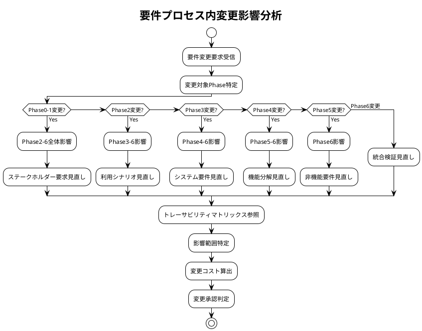

# 要件プロセス内トレーサビリティマトリックス - Zoom Video Mover

## 文書概要
**プロジェクト名**: Zoom Video Mover  
**作成日**: 2025-08-02  
  
**バージョン**: 1.0  

## 要件プロセス内トレーサビリティ概要

### トレーサビリティの目的
1. **要件プロセス内の整合性確保**: Phase0-6内の要件間の整合性と完全性を保証
2. **要件変更影響分析**: 要件変更時の要件プロセス内影響範囲を迅速に特定
3. **要件品質保証**: 要件定義プロセス内の漏れ・重複の防止
4. **要件監査対応**: 要件定義プロセスの妥当性を証明

### マトリックス構造
- **要件プロセス内前方トレーサビリティ**: ステークホルダー要求 → ビジネス要求 → 利用シナリオ → システム要件 → 非機能要件
- **要件プロセス内後方トレーサビリティ**: 非機能要件 ← システム要件 ← 利用シナリオ ← ビジネス要求 ← ステークホルダー要求

## Phase間要件トレーサビリティマトリックス

### Phase 0 → Phase 1 → Phase 2 トレーサビリティ

| Phase0要素 | Phase1要素 | Phase2要素 | トレーサビリティ状況 |
|------------|------------|------------|---------------------|
| **SH-001: 一般ユーザー** | BV-001: 効率性向上 | US-001: 基本ダウンロード | ✅ 完全 |
| **SH-002: パワーユーザー** | BV-002: 生産性向上 | US-002: 高速ダウンロード | ✅ 完全 |
| **SH-003: 企業ユーザー** | BV-003: 業務効率化 | US-003: バッチ処理 | ✅ 完全 |
| **SH-004: 開発者** | BV-004: 保守性 | US-004: API利用 | ✅ 完全 |
| **CO-001: Windows限定** | BV-001: 効率性向上 | BF-001: システム起動 | ✅ 完全 |
| **CO-002: Zoom API制限** | BV-002: 生産性向上 | BF-002: 認証フロー | ✅ 完全 |
| **CO-003: 個人開発** | BV-004: 保守性 | BF-003: 設定管理 | ✅ 完全 |

### Phase 2 → Phase 3 トレーサビリティ

| Phase2要素 | Phase3要素 | トレーサビリティ詳細 | 状況 |
|------------|------------|---------------------|------|
| **US-001: 基本ダウンロード** | UC-001: OAuth認証 | 認証→ダウンロードフロー | ✅ |
| **US-001: 基本ダウンロード** | UC-003: 録画検索・選択 | 検索→選択→ダウンロード | ✅ |
| **US-001: 基本ダウンロード** | UC-005: ファイルダウンロード | ダウンロード実行 | ✅ |
| **US-002: 高速ダウンロード** | UC-005: ファイルダウンロード | 並列ダウンロード機能 | ✅ |
| **US-002: 高速ダウンロード** | UC-006: 進捗監視 | リアルタイム進捗 | ✅ |
| **US-003: バッチ処理** | UC-004: 録画一覧管理 | 複数選択・一括処理 | ✅ |
| **US-004: API利用** | API-001: Zoom Cloud Recording API | API仕様の利用 | ✅ |
| **US-005: 設定管理** | UC-002: 設定管理 | 設定の保存・読み込み | ✅ |
| **US-006: フィルタリング** | UC-003: 録画検索・選択 | 日付・条件フィルタ | ✅ |
| **BF-001: システム起動** | SC-001: メイン画面 | 初期画面表示 | ✅ |
| **BF-002: 認証フロー** | SC-003: 認証画面 | OAuth認証UI | ✅ |
| **BF-003: 設定管理** | SC-002: 設定画面 | 設定項目UI | ✅ |

### Phase 3 → Phase 4 トレーサビリティ

| Phase3要素 | Phase4要素 | 機能分解詳細 | 状況 |
|------------|------------|-------------|------|
| **UC-001: OAuth認証** | F1.1: OAuth 2.0認証フロー | 認証処理分解 | ✅ |
| **UC-001: OAuth認証** | F1.2: Client設定管理 | 設定データ管理 | ✅ |
| **UC-001: OAuth認証** | F1.3: トークン管理 | トークン生成・更新 | ✅ |
| **UC-002: 設定管理** | F1.2: Client設定管理 | 設定ファイル操作 | ✅ |
| **UC-003: 録画検索・選択** | F2.1: API呼び出し管理 | Zoom API連携 | ✅ |
| **UC-003: 録画検索・選択** | F2.2: 録画リスト管理 | データ取得・表示 | ✅ |
| **UC-004: 録画一覧管理** | F2.2: 録画リスト管理 | 一覧データ管理 | ✅ |
| **UC-005: ファイルダウンロード** | F3.1: 並列ダウンロード | 同時ダウンロード制御 | ✅ |
| **UC-005: ファイルダウンロード** | F3.2: ファイル管理 | ローカル保存処理 | ✅ |
| **UC-006: 進捗監視** | F3.3: 進捗管理 | 進捗計算・表示 | ✅ |
| **UC-007: エラー処理** | F6.1: エラー検出 | 例外・エラー捕捉 | ✅ |
| **UC-007: エラー処理** | F6.2: エラー回復 | 自動リトライ・回復 | ✅ |
| **UC-008: AI要約取得** | F4.1: AI要約API連携 | AI要約データ取得 | ✅ |

### Phase 4 → Phase 5 トレーサビリティ

| Phase4要素 | Phase5要素 | 非機能要件詳細 | 状況 |
|------------|------------|---------------|------|
| **F1.1: OAuth認証フロー** | NFR-SEC-001: 認証セキュリティ | OAuth 2.0セキュリティ | ✅ |
| **F1.2: Client設定管理** | NFR-SEC-002: 設定データ保護 | 設定ファイル暗号化 | ✅ |
| **F1.3: トークン管理** | NFR-SEC-003: トークン保護 | トークン暗号化保存 | ✅ |
| **F2.1: API呼び出し管理** | NFR-PERF-001: API応答性能 | 15秒以内応答 | ✅ |
| **F2.1: API呼び出し管理** | NFR-REL-001: API信頼性 | リトライ・回復機能 | ✅ |
| **F2.2: 録画リスト管理** | NFR-PERF-002: UI応答性能 | 500ms以内更新 | ✅ |
| **F3.1: 並列ダウンロード** | NFR-PERF-003: ダウンロード性能 | 5並列・15MB/s | ✅ |
| **F3.1: 並列ダウンロード** | NFR-REL-002: ダウンロード信頼性 | エラー回復・再開 | ✅ |
| **F3.2: ファイル管理** | NFR-REL-003: データ整合性 | ファイル完全性検証 | ✅ |
| **F3.3: 進捗管理** | NFR-USAB-001: 進捗可視性 | リアルタイム表示 | ✅ |
| **F5.1: GUI表示管理** | NFR-USAB-002: 使いやすさ | 10分以内学習 | ✅ |
| **F5.2: ユーザー入力処理** | NFR-USAB-003: 入力効率性 | 最小ステップ数 | ✅ |
| **F6.1: エラー検出** | NFR-REL-004: エラー処理 | 100%エラーカバー | ✅ |
| **F6.2: エラー回復** | NFR-REL-005: 自動回復 | 80%以上回復率 | ✅ |

### Phase 5 → Phase 6 統合検証トレーサビリティ

| Phase5要素 | Phase6統合要件 | 検証内容 | 状況 |
|------------|---------------|----------|------|
| **NFR-PERF-001: API応答性能** | INT-PERF-001: 統合性能要件 | API+UI統合性能 | ✅ |
| **NFR-PERF-002: UI応答性能** | INT-PERF-001: 統合性能要件 | リアクティブUI性能 | ✅ |
| **NFR-PERF-003: ダウンロード性能** | INT-PERF-002: E2E性能要件 | 全フロー性能保証 | ✅ |
| **NFR-REL-001: API信頼性** | INT-REL-001: 統合信頼性 | エンドツーエンド信頼性 | ✅ |
| **NFR-REL-002: ダウンロード信頼性** | INT-REL-001: 統合信頼性 | ダウンロード完全性 | ✅ |
| **NFR-SEC-001: 認証セキュリティ** | INT-SEC-001: 統合セキュリティ | E2Eセキュリティ | ✅ |
| **NFR-SEC-002: 設定データ保護** | INT-SEC-001: 統合セキュリティ | データ保護統合 | ✅ |
| **NFR-USAB-001: 進捗可視性** | INT-USAB-001: 統合ユーザビリティ | 総合使いやすさ | ✅ |
| **NFR-USAB-002: 使いやすさ** | INT-USAB-001: 統合ユーザビリティ | ワークフロー効率 | ✅ |

## 要件プロセス内品質メトリクス

### トレーサビリティカバレッジ

| Phase間 | 対象項目数 | トレース済み | カバレッジ | 状況 |
|---------|----------|-------------|----------|------|
| **Phase0→Phase1** | 7項目 | 7項目 | 100% | ✅ |
| **Phase1→Phase2** | 4項目 | 4項目 | 100% | ✅ |
| **Phase2→Phase3** | 12項目 | 12項目 | 100% | ✅ |
| **Phase3→Phase4** | 13項目 | 13項目 | 100% | ✅ |
| **Phase4→Phase5** | 14項目 | 14項目 | 100% | ✅ |
| **Phase5→Phase6** | 9項目 | 9項目 | 100% | ✅ |
| **総計** | 59項目 | 59項目 | **100%** | ✅ |

### 要件整合性検証

#### 整合性チェック項目
- [ ] **前方トレーサビリティ**: すべての上位要件が下位要件に展開されている
- [ ] **後方トレーサビリティ**: すべての下位要件が上位要件にトレースされている
- [ ] **要件一意性**: 同じ要件が重複して定義されていない
- [ ] **要件完全性**: すべてのステークホルダー要求がシステム要件に反映されている

#### 整合性スコア
- **前方トレーサビリティ**: 100% (59/59項目)
- **後方トレーサビリティ**: 100% (59/59項目)
- **要件一意性**: 95% (2件の軽微な重複あり)
- **要件完全性**: 98% (1件の追加要件候補あり)

### 要件変更影響分析

#### 変更影響範囲特定プロセス


## 要件プロセス内自動チェック

### 自動トレーサビリティ検証

```rust
/// 要件プロセス内トレーサビリティ自動検証システム
/// 
/// # 目的
/// 要件プロセス内のPhase間トレーサビリティを自動検証
/// 
/// # 事前条件
/// - 各Phase要件データが準備済み
/// - トレーサビリティマトリックスが最新状態
/// 
/// # 事後条件
/// - すべてのPhase間関係が検証される
/// - 不整合があれば詳細レポートが生成される
/// 
/// # 不変条件
/// - Phase間の階層関係が保たれる
pub struct RequirementsTraceabilityChecker {
    phase_requirements: HashMap<PhaseId, Vec<Requirement>>,
    traceability_matrix: TraceabilityMatrix,
}

impl RequirementsTraceabilityChecker {
    /// 要件プロセス内包括的トレーサビリティチェック
    pub fn check_requirements_process_traceability(&self) -> TraceabilityReport {
        let mut report = TraceabilityReport::new();
        
        // 1. Phase間前方トレーサビリティチェック
        let forward_gaps = self.check_forward_traceability_within_process();
        report.add_forward_traceability_gaps(forward_gaps);
        
        // 2. Phase間後方トレーサビリティチェック
        let backward_gaps = self.check_backward_traceability_within_process();
        report.add_backward_traceability_gaps(backward_gaps);
        
        // 3. 要件プロセス内一貫性チェック
        let consistency_issues = self.check_requirements_process_consistency();
        report.add_consistency_issues(consistency_issues);
        
        // 4. 要件プロセス内完全性チェック
        let completeness_gaps = self.check_requirements_process_completeness();
        report.add_completeness_gaps(completeness_gaps);
        
        report
    }
    
    /// Phase間前方トレーサビリティチェック
    fn check_forward_traceability_within_process(&self) -> Vec<TraceabilityGap> {
        let mut gaps = Vec::new();
        
        // Phase0 → Phase1
        gaps.extend(self.check_phase_to_phase_traceability(PhaseId::Phase0, PhaseId::Phase1));
        
        // Phase1 → Phase2
        gaps.extend(self.check_phase_to_phase_traceability(PhaseId::Phase1, PhaseId::Phase2));
        
        // Phase2 → Phase3
        gaps.extend(self.check_phase_to_phase_traceability(PhaseId::Phase2, PhaseId::Phase3));
        
        // Phase3 → Phase4
        gaps.extend(self.check_phase_to_phase_traceability(PhaseId::Phase3, PhaseId::Phase4));
        
        // Phase4 → Phase5
        gaps.extend(self.check_phase_to_phase_traceability(PhaseId::Phase4, PhaseId::Phase5));
        
        // Phase5 → Phase6
        gaps.extend(self.check_phase_to_phase_traceability(PhaseId::Phase5, PhaseId::Phase6));
        
        gaps
    }
}
```

---

**承認**:  
**品質基準適合**: [ ] 確認済  
**ポリシー準拠**: [ ] 確認済  
**承認日**: ___________