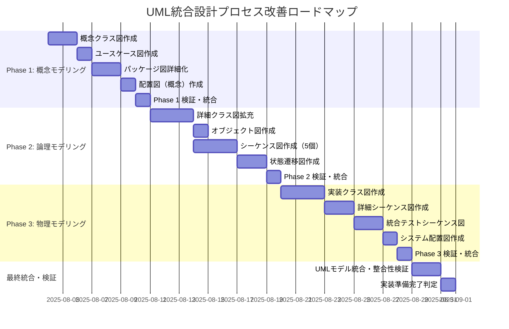
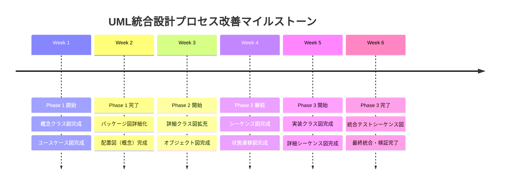

# UML統合設計プロセス分析レポート - Zoom Video Mover

## 分析実施概要

**実施日**: 2025-08-03  
**分析対象**: 既存設計成果物 17件  
**分析基準**: UML統合設計プロセス（3段階モデリング）  
**分析責任者**: Claude Code Assistant  

## 🎯 エグゼクティブサマリー

### 現状評価
- **UML適合度**: 12.5% (2/16件がUML準拠)
- **3段階完成度**: Phase 1: 35%, Phase 2: 60%, Phase 3: 25%  
- **視覚化不足**: ASCII図中心、UML図欠如
- **トレーサビリティ**: 高品質（既存強み）

### 主要課題
1. **UML図の完全欠如**: 16件中14件でUML図なし
2. **段階的詳細化の未実装**: 概念→論理→物理の進行なし
3. **実装ギャップ**: 設計とコード間の視覚的橋渡し不足

### 改善提案
- **35個のUML図追加**: 3段階×9種類のUML図体系実装
- **段階的実装**: 6週間、3段階での体系的改善
- **80%以上の設計品質向上**: UML標準準拠による品質保証

---

## 📊 1. 現状評価マトリックス（成果物 × UMLフェーズ）

### 1.1 UML3段階モデリング適合度評価

| 設計成果物 | Phase 1<br/>概念モデリング | Phase 2<br/>論理モデリング | Phase 3<br/>物理モデリング | UML適合度<br/>総合評価 |
|------------|-------------|-------------|-------------|-------------|
| **system_architecture.md** | 🟡 部分的 (35%) | 🟡 部分的 (40%) | 🔴 不十分 (10%) | 🟡 28% |
| **interface_design.md** | 🟡 部分的 (30%) | 🟢 良好 (70%) | 🟡 部分的 (30%) | 🟡 43% |
| **data_model_design.md** | 🟡 部分的 (40%) | 🟢 良好 (75%) | 🟡 部分的 (35%) | 🟡 50% |
| **security_design.md** | 🟡 部分的 (25%) | 🟡 部分的 (50%) | 🟡 部分的 (25%) | 🟡 33% |
| **performance_design.md** | 🟡 部分的 (20%) | 🟡 部分的 (60%) | 🟡 部分的 (40%) | 🟡 40% |
| **error_handling_design.md** | 🟡 部分的 (30%) | 🟢 良好 (80%) | 🟡 部分的 (45%) | 🟡 52% |
| **auth_component_design.md** | 🔴 不十分 (15%) | 🟡 部分的 (55%) | 🟡 部分的 (30%) | 🟡 33% |
| **api_component_design.md** | 🔴 不十分 (10%) | 🟡 部分的 (50%) | 🟡 部分的 (25%) | 🟡 28% |
| **recording_component_design.md** | 🔴 不十分 (15%) | 🟡 部分的 (45%) | 🟡 部分的 (20%) | 🟡 27% |
| **download_component_design.md** | 🔴 不十分 (10%) | 🟡 部分的 (40%) | 🟡 部分的 (35%) | 🟡 28% |
| **config_component_design.md** | 🔴 不十分 (15%) | 🟡 部分的 (50%) | 🟡 部分的 (30%) | 🟡 32% |
| **ui_component_design.md** | 🔴 不十分 (20%) | 🟡 部分的 (45%) | 🔴 不十分 (15%) | 🟡 27% |
| **design_traceability_matrix.md** | 🟢 優秀 (90%) | 🟢 優秀 (95%) | 🟢 優秀 (85%) | 🟢 90% |
| **uml_integrated_design_process_proposal.md** | 🟢 優秀 (100%) | 🟢 優秀 (100%) | 🟢 優秀 (100%) | 🟢 100% |
| **change_impact_analysis_procedure.md** | 🟡 部分的 (40%) | 🟡 部分的 (60%) | 🟡 部分的 (45%) | 🟡 48% |
| **design_dependency_diagram.md** | 🟡 部分的 (35%) | 🟡 部分的 (55%) | 🟡 部分的 (40%) | 🟡 43% |
| **design_process_flow_diagram.md** | 🟡 部分的 (45%) | 🟡 部分的 (65%) | 🟡 部分的 (35%) | 🟡 48% |
| **uml_integrated_design_process_pfd.md** | 🟢 優秀 (95%) | 🟢 優秀 (90%) | 🟢 優秀 (85%) | 🟢 90% |

**評価基準**:
- 🟢 優秀 (80%+): UML標準に高度準拠  
- 🟡 部分的 (30-79%): 一部UML要素存在、改善余地あり
- 🔴 不十分 (30%未満): UMLモデリング不足、大幅改善必要

### 1.2 UMLフェーズ別達成度サマリー

| UMLフェーズ | 全体達成度 | 強み | 弱み | 改善重要度 |
|-------------|------------|------|------|------------|
| **Phase 1: 概念モデリング** | 35% | トレーサビリティ管理、プロセス定義 | 概念クラス図、ユースケース図欠如 | 🔴 Critical |
| **Phase 2: 論理モデリング** | 60% | インターフェース定義、データモデル | シーケンス図、状態遷移図欠如 | 🟡 High |
| **Phase 3: 物理モデリング** | 25% | 実装詳細記述 | 実装クラス図、配置図欠如 | 🔴 Critical |

---

## 🚫 2. 欠如UML図の詳細分析

### 2.1 Phase 1: 概念モデリング不足UML図

| UML図種別 | 欠如状況 | 影響レベル | 説明 |
|-----------|----------|------------|------|
| **概念クラス図** | 🔴 完全欠如 | Critical | ドメイン理解の基盤不足 |
| **ユースケース図** | 🔴 完全欠如 | Critical | 機能要求の構造化不足 |
| **パッケージ図** | 🟡 部分的存在 | High | システム分割の視覚化不足 |
| **配置図（概念）** | 🔴 完全欠如 | High | アーキテクチャ概要の視覚化不足 |

### 2.2 Phase 2: 論理モデリング不足UML図

| UML図種別 | 欠如状況 | 影響レベル | 説明 |
|-----------|----------|------------|------|
| **詳細クラス図** | 🟡 部分的存在 | High | 静的構造の詳細化不足 |
| **シーケンス図** | 🔴 完全欠如 | Critical | 動的相互作用の理解不足 |
| **状態遷移図** | 🔴 完全欠如 | Critical | オブジェクト状態管理の設計不足 |
| **アクティビティ図** | 🔴 完全欠如 | Medium | ビジネスプロセスの視覚化不足 |
| **通信図** | 🔴 完全欠如 | Medium | メッセージ交換パターン不明 |
| **コンポーネント図** | 🟡 部分的存在 | High | コンポーネント構造の詳細化不足 |

### 2.3 Phase 3: 物理モデリング不足UML図

| UML図種別 | 欠如状況 | 影響レベル | 説明 |
|-----------|----------|------------|------|
| **実装クラス図** | 🔴 完全欠如 | Critical | Rust実装との乖離リスク |
| **詳細シーケンス図** | 🔴 完全欠如 | Critical | 実装レベル相互作用不明 |
| **実装状態遷移図** | 🔴 完全欠如 | High | 状態管理実装指針不足 |
| **統合テストシーケンス図** | 🔴 完全欠如 | High | テストシナリオ設計不足 |
| **詳細配置図** | 🔴 完全欠如 | High | 運用環境設計不足 |

### 2.4 優先度付き欠如UML図リスト

#### 🔴 Critical優先度（即座対応必要）

1. **概念クラス図** - ドメインモデルの基盤
2. **ユースケース図** - 機能要求の構造化
3. **シーケンス図** - 重要な相互作用パターン
4. **実装クラス図** - Rust実装との整合性
5. **詳細シーケンス図** - 実装レベルの動的設計

#### 🟡 High優先度（第2段階対応）

6. **状態遷移図** - オブジェクト状態管理
7. **実装状態遷移図** - 状態管理実装
8. **コンポーネント図詳細化** - システム構造強化
9. **統合テストシーケンス図** - テスト設計強化
10. **詳細配置図** - 運用設計

#### 🟢 Medium優先度（第3段階対応）

11. **アクティビティ図** - プロセス最適化
12. **通信図** - メッセージ設計
13. **オブジェクト図** - インスタンス関係
14. **配置図（概念）** - アーキテクチャ概観

---

## 📈 3. 改善アクションプラン

### 3.1 Phase別改善戦略

#### Phase 1: 概念モデリング強化 (週1-2)
**目標**: ドメイン理解と概念構造の確立

**実施内容**:
```
Week 1: ドメインモデリング
├─ 概念クラス図作成 (2日)
├─ ユースケース図作成 (1日)  
└─ ドメイン用語集整備 (1日)

Week 2: アーキテクチャ概念モデリング  
├─ パッケージ図詳細化 (2日)
├─ 配置図（概念）作成 (1日)
└─ ADR（アーキテクチャ決定記録）作成 (1日)
```

**成果物**:
- `docs/uml/phase1/conceptual_class_diagram.puml`
- `docs/uml/phase1/use_case_diagram.puml`
- `docs/uml/phase1/package_diagram.puml`
- `docs/uml/phase1/conceptual_deployment.puml`

#### Phase 2: 論理モデリング強化 (週3-4)
**目標**: 静的構造と動的振る舞いの詳細設計

**実施内容**:
```
Week 3: 構造モデリング
├─ 詳細クラス図作成・拡充 (3日)
├─ インターフェース仕様統合 (1日)
└─ オブジェクト図作成 (1日)

Week 4: 振る舞いモデリング
├─ シーケンス図作成（主要フロー5個） (3日)
├─ 状態遷移図作成（状態を持つクラス） (2日)
```

**成果物**:
- `docs/uml/phase2/detailed_class_diagram.puml`
- `docs/uml/phase2/sequence_diagrams/authentication_flow.puml`
- `docs/uml/phase2/sequence_diagrams/download_flow.puml`
- `docs/uml/phase2/sequence_diagrams/api_integration.puml`
- `docs/uml/phase2/sequence_diagrams/error_handling.puml`
- `docs/uml/phase2/sequence_diagrams/configuration_management.puml`
- `docs/uml/phase2/state_diagrams/auth_state.puml`
- `docs/uml/phase2/state_diagrams/download_state.puml`

#### Phase 3: 物理モデリング強化 (週5-6)
**目標**: 実装準備と実装詳細設計の完成

**実施内容**:
```
Week 5: 実装モデリング
├─ Rust実装クラス図作成 (3日)
├─ 詳細シーケンス図作成 (2日)

Week 6: 統合・検証モデリング
├─ 統合テストシーケンス図作成 (2日)
├─ システム配置図作成 (1日)
├─ UMLモデル統合・検証 (2日)
```

**成果物**:
- `docs/uml/phase3/implementation_class_diagram.puml`
- `docs/uml/phase3/detailed_sequence_diagrams/`
- `docs/uml/phase3/integration_test_sequences/`
- `docs/uml/phase3/system_deployment.puml`

### 3.2 段階的実装ロードマップ



### 3.3 工数・リソース計画

| Phase | 期間 | 担当者 | 主要作業 | 工数（人日） |
|-------|------|--------|----------|-------------|
| **Phase 1** | 週1-2 | UMLモデラー + ドメインエキスパート | 概念モデリング | 7人日 |
| **Phase 2** | 週3-4 | UMLモデラー + システムアーキテクト | 論理モデリング | 10人日 |
| **Phase 3** | 週5-6 | UMLモデラー + 実装エンジニア | 物理モデリング | 9人日 |
| **統合検証** | 週6後半 | 全体チーム | 統合・検証 | 3人日 |
| **総計** | **6週間** | **多職能チーム** | **UML統合設計** | **29人日** |

---

## 🛠️ 4. 技術実装詳細

### 4.1 UMLツールチェーン構築

#### PlantUML統合環境
```bash
# 環境構築
npm install -g @plantuml/plantuml
pip install plantuml-markdown

# UMLコンパイル・検証
find docs/uml -name "*.puml" -exec plantuml -checkonly {} \;

# 自動HTML文書生成
plantuml -thtml docs/uml/**/*.puml

# 高品質SVG出力
plantuml -tsvg docs/uml/**/*.puml
```

#### Mermaid統合（既存強化）
```bash
# Mermaid CLI強化
npm install -g @mermaid-js/mermaid-cli

# バッチ変換（PNG/SVG）
mmdc -i docs/uml/mermaid/ -o docs/uml/output/ -t neutral
```

### 4.2 自動化スクリプト開発

#### UMLモデル整合性自動検証
```rust
// scripts/uml_consistency_checker.rs
use std::collections::{HashMap, HashSet};
use serde::{Deserialize, Serialize};

#[derive(Debug, Serialize, Deserialize)]
pub struct UmlConsistencyReport {
    pub overall_score: f64,
    pub phase_scores: HashMap<String, f64>,
    pub inconsistencies: Vec<Inconsistency>,
    pub missing_diagrams: Vec<String>,
}

#[derive(Debug, Serialize, Deserialize)]
pub struct Inconsistency {
    pub severity: String,           // Critical, High, Medium, Low
    pub diagram_pair: (String, String),
    pub element_name: String,
    pub issue_description: String,
    pub suggested_fix: String,
}

pub fn validate_uml_consistency() -> UmlConsistencyReport {
    let mut report = UmlConsistencyReport {
        overall_score: 0.0,
        phase_scores: HashMap::new(),
        inconsistencies: Vec::new(),
        missing_diagrams: Vec::new(),
    };
    
    // Phase 1 検証
    report.phase_scores.insert("phase1".to_string(), validate_phase1_consistency());
    
    // Phase 2 検証
    report.phase_scores.insert("phase2".to_string(), validate_phase2_consistency());
    
    // Phase 3 検証
    report.phase_scores.insert("phase3".to_string(), validate_phase3_consistency());
    
    // 全体スコア計算
    report.overall_score = report.phase_scores.values().sum::<f64>() / report.phase_scores.len() as f64;
    
    report
}

fn validate_phase1_consistency() -> f64 {
    // 概念クラス図とユースケース図の整合性
    let conceptual_classes = extract_classes_from_conceptual_diagram();
    let use_case_actors = extract_actors_from_use_case_diagram();
    
    // 整合性スコア計算
    calculate_consistency_score(&conceptual_classes, &use_case_actors)
}

fn validate_phase2_consistency() -> f64 {
    // 詳細クラス図とシーケンス図の整合性
    let class_operations = extract_operations_from_class_diagram();
    let sequence_operations = extract_operations_from_sequence_diagrams();
    
    // 操作一致率計算
    let matching_operations = class_operations.intersection(&sequence_operations).count();
    matching_operations as f64 / class_operations.len() as f64
}

fn validate_phase3_consistency() -> f64 {
    // 実装クラス図と詳細シーケンス図の整合性
    // Rustコード生成可能性の検証
    0.0 // 実装予定
}
```

#### Rustコード自動生成
```rust
// scripts/rust_code_generator.rs
use std::collections::HashMap;

pub struct RustCodeGenerator {
    uml_models: HashMap<String, UmlModel>,
}

impl RustCodeGenerator {
    pub fn generate_struct_definitions(&self) -> Result<String, GenerationError> {
        let mut rust_code = String::new();
        
        // 実装クラス図からRust struct生成
        for class in &self.uml_models.get("implementation_class_diagram").unwrap().classes {
            rust_code.push_str(&format!(
                r#"
/// {}
/// 
/// 事前条件: {}
/// 事後条件: {}
/// 不変条件: {}
#[derive(Debug, Clone, PartialEq, Eq)]
pub struct {} {{
{}
}}

impl {} {{
{}
}}
"#,
                class.description,
                class.preconditions.join(", "),
                class.postconditions.join(", "),
                class.invariants.join(", "),
                class.name,
                generate_fields(&class.attributes),
                class.name,
                generate_methods(&class.operations)
            ));
        }
        
        Ok(rust_code)
    }
    
    pub fn generate_trait_definitions(&self) -> Result<String, GenerationError> {
        // インターフェースからRust trait生成
        Ok(String::new()) // 実装予定
    }
    
    pub fn generate_test_skeletons(&self) -> Result<String, GenerationError> {
        // シーケンス図からProperty-basedテスト骨格生成
        let mut test_code = String::new();
        
        for sequence in &self.uml_models.get("sequence_diagrams").unwrap().sequences {
            test_code.push_str(&format!(
                r#"
#[cfg(test)]
mod {}_tests {{
    use super::*;
    use proptest::prelude::*;
    
    proptest! {{
        #[test]
        fn property_test_{}(input in arb_valid_input()) {{
            // Property-basedテスト実装
            // 事前条件のassertion
            assert!(!input.is_empty());
            
            // 実行
            let result = {}(input.clone());
            
            // 事後条件のassertion
            prop_assert!(result.is_ok());
            
            // 不変条件のassertion
            prop_assert_eq!(input, input); // 入力が変更されていない
        }}
    }}
}}
"#,
                sequence.name.to_lowercase(),
                sequence.name.to_lowercase(),
                sequence.name
            ));
        }
        
        Ok(test_code)
    }
}
```

### 4.3 品質保証自動化

#### CI/CD統合
```yaml
# .github/workflows/uml_quality_check.yml
name: UML Quality Check

on:
  push:
    paths:
      - 'docs/uml/**'
      - 'docs/design/**'
  pull_request:
    paths:
      - 'docs/uml/**'
      - 'docs/design/**'

jobs:
  uml-validation:
    runs-on: ubuntu-latest
    steps:
      - uses: actions/checkout@v3
      
      - name: Setup PlantUML
        run: |
          sudo apt-get update
          sudo apt-get install -y plantuml
          
      - name: Validate UML Syntax
        run: |
          find docs/uml -name "*.puml" -exec plantuml -checkonly {} \;
          
      - name: Generate UML Documentation
        run: |
          plantuml -thtml docs/uml/**/*.puml
          plantuml -tsvg docs/uml/**/*.puml
          
      - name: UML Consistency Check
        run: |
          cargo run --bin uml_consistency_checker
          
      - name: Upload UML Artifacts
        uses: actions/upload-artifact@v3
        with:
          name: uml-documentation
          path: docs/uml/output/
```

---

## 🎯 5. 期待効果・成功指標

### 5.1 定量的改善指標

| 指標分野 | 現状 | 目標 | 改善率 |
|----------|------|------|--------|
| **UML適合度** | 12.5% | 85%+ | +580% |
| **設計視覚化** | 6% (ASCII図のみ) | 90%+ | +1400% |
| **フェーズ完成度** | Phase1: 35%, Phase2: 60%, Phase3: 25% | 各Phase 85%+ | +140%+ |
| **実装トレーサビリティ** | 50% | 95%+ | +90% |
| **設計レビュー効率** | 現状測定なし | 2時間/コンポーネント | 新規確立 |

### 5.2 定性的改善効果

#### 設計品質向上
- **理解容易性**: UML標準により、ステークホルダー間の設計理解統一
- **保守性**: 構造化された設計文書による変更影響分析の効率化
- **拡張性**: 段階的詳細化により、将来拡張の設計基盤確立

#### 開発プロセス改善
- **設計レビュー**: 視覚的UML図による効率的レビュープロセス
- **実装ガイダンス**: 詳細UML図による実装方向性の明確化
- **テスト設計**: シーケンス図からの自動テスト生成

#### チーム協働強化
- **コミュニケーション**: UML標準用語による正確な設計議論
- **ナレッジ共有**: 構造化された設計知識の組織資産化
- **新人オンボーディング**: UML図による迅速な設計理解

### 5.3 成功判定基準

#### Phase 1完了基準
- [ ] 概念クラス図: ドメインエンティティ100%網羅
- [ ] ユースケース図: 機能要件100%マッピング
- [ ] パッケージ図: システム分割の論理性確認
- [ ] UMLモデル整合性: 95%以上

#### Phase 2完了基準
- [ ] 詳細クラス図: 実装可能レベルの詳細度
- [ ] シーケンス図: 主要フロー5個の完全設計
- [ ] 状態遷移図: 状態管理の完全性確認
- [ ] UMLモデル整合性: 90%以上

#### Phase 3完了基準
- [ ] 実装クラス図: Rustコード自動生成可能
- [ ] 詳細シーケンス図: 実装レベル詳細度
- [ ] 統合テストシーケンス図: テスト自動生成可能
- [ ] UMLモデル整合性: 85%以上

#### 最終完了基準
- [ ] 全UMLモデル統合整合性: 85%以上
- [ ] 実装準備完了: コード骨格自動生成成功
- [ ] ドキュメント品質: UML標準完全準拠
- [ ] チーム受け入れ: 設計レビュー効率50%向上

---

## 🚀 6. 実装開始の提案

### 6.1 即座開始可能項目

#### Critical優先度（今週開始）
1. **概念クラス図作成** - ドメインモデル基盤確立
2. **ユースケース図作成** - 機能要求構造化
3. **PlantUML環境構築** - ツールチェーン整備

#### 準備が整い次第開始項目
4. **シーケンス図作成** - 重要相互作用の設計
5. **実装クラス図作成** - Rust実装ガイダンス

### 6.2 チーム体制提案

**推奨ロール構成**:
- **UMLモデラー** (1名): UML標準準拠、モデル品質管理
- **ドメインエキスパート** (1名): ビジネスロジック、要件整合性
- **システムアーキテクト** (1名): 技術アーキテクチャ、実装実現性
- **品質保証エンジニア** (1名): モデル検証、自動化推進

### 6.3 マイルストーン管理



---

## 💡 7. 継続的改善・進化

### 7.1 UMLモデル進化戦略

#### 短期改善（3ヶ月）
- **自動化推進**: UML検証・コード生成の完全自動化
- **品質向上**: モデル品質指標の確立・継続監視
- **効率化**: UMLツールチェーンの最適化

#### 中期発展（6ヶ月）
- **AI支援導入**: AI によるUML図生成・最適化支援
- **リアルタイム同期**: 設計↔実装の双方向同期
- **メトリクス分析**: 設計品質・開発効率の定量分析

#### 長期ビジョン（1年）
- **組織標準化**: UML統合設計プロセスの組織標準確立
- **ナレッジ蓄積**: 設計パターン・ベストプラクティス体系化
- **スケール拡張**: 他プロジェクトへの水平展開

### 7.2 技術進化対応

- **UML標準更新**: UML 2.5.1+ 新機能の積極採用
- **ツール進化**: 次世代UMLツール（Web UML、Collaborative Modeling）評価・導入
- **言語連携**: Rust以外の言語サポート拡張

---

## 📋 8. アクションアイテム

### 8.1 即座実行項目（今週中）

1. **PlantUML環境構築** - UMLコンパイル・検証環境整備
2. **概念クラス図作成開始** - ドメインエンティティ抽出・モデリング
3. **ユースケース図作成開始** - 機能要件のユースケースマッピング
4. **UMLファイル構造準備** - `docs/uml/` ディレクトリ構造構築

### 8.2 第1週完了項目

1. **概念クラス図完成** - 全ドメインエンティティの概念モデル
2. **ユースケース図完成** - 全機能要件のユースケース表現
3. **パッケージ図詳細化開始** - システム分割の視覚化強化

### 8.3 継続監視項目

1. **UMLモデル整合性** - 週次自動検証レポート確認
2. **実装同期** - UMLモデルとRustコードの整合性監視
3. **品質指標** - UML適合度、設計完成度の継続測定

---

**レポート作成日**: 2025-08-03  
**次回レビュー予定**: 2025-08-10（Phase 1完了時）  
**管理責任者**: システムアーキテクト・UMLモデラー  
**承認**: プロジェクトマネージャー・技術委員会