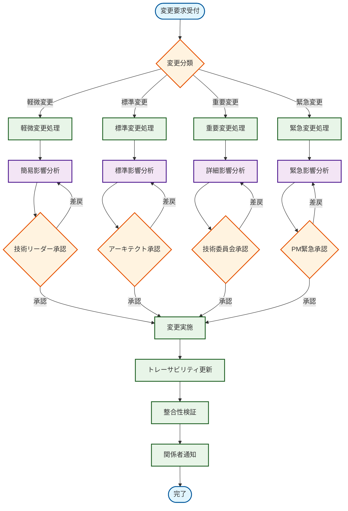

# 変更影響分析手順 - Zoom Video Mover

## 概要

**目的**: 設計変更時の影響範囲を体系的に分析し、リスクを最小化  
**適用範囲**: すべての設計文書変更・新規追加・削除  
**実施責任**: システムアーキテクト・技術リーダー  
**承認権限**: 技術委員会・プロジェクトマネージャー  

## 変更影響分析フローチャート

### 1. 全体フロー



## 変更分類基準

### 2. 変更分類マトリックス

| 変更種別 | 影響範囲 | 影響度 | 緊急度 | 承認レベル | 分析深度 |
|----------|----------|--------|--------|------------|----------|
| **軽微変更** | 単一文書内 | Low | 通常 | 技術リーダー | 簡易分析 |
| **標準変更** | 複数文書・同層 | Medium | 通常 | システムアーキテクト | 標準分析 |
| **重要変更** | 複数レイヤー | High/Critical | 通常 | 技術委員会 | 詳細分析 |
| **緊急変更** | 任意 | 任意 | 緊急 | プロジェクトマネージャー | 緊急分析 |

#### 変更分類判定フロー
```rust
/// 変更分類の自動判定
#[derive(Debug, PartialEq)]
pub enum ChangeClassification {
    Minor,    // 軽微変更
    Standard, // 標準変更  
    Major,    // 重要変更
    Emergency // 緊急変更
}

pub fn classify_change(change_request: &ChangeRequest) -> ChangeClassification {
    // 緊急度チェック（最優先）
    if change_request.urgency == Urgency::Emergency {
        return ChangeClassification::Emergency;
    }
    
    // 影響範囲・影響度による分類
    match (change_request.scope, change_request.impact_level) {
        (Scope::SingleDocument, ImpactLevel::Low) => ChangeClassification::Minor,
        (Scope::MultipleDocuments, ImpactLevel::Medium) => ChangeClassification::Standard,
        (Scope::MultipleDocuments, ImpactLevel::High) => ChangeClassification::Standard,
        (Scope::CrossLayer, _) => ChangeClassification::Major,
        (_, ImpactLevel::Critical) => ChangeClassification::Major,
        _ => ChangeClassification::Standard,
    }
}
```

## 影響分析手順詳細

### 3. 軽微変更処理（Minor Change）

#### 対象例
- タイポ修正・文書整形
- コメント追加・説明文改善
- 内部実装詳細の調整（外部IFに影響なし）

#### 分析手順
```
Step 1: 変更内容確認 (5分)
├─ 変更差分の特定
├─ 外部影響の有無確認
└─ 文書内整合性確認

Step 2: 簡易影響チェック (10分)  
├─ 同一文書内の関連セクション確認
├─ 用語・定義の一貫性確認
└─ リンク・参照の有効性確認

Step 3: 承認・実施 (5分)
├─ 技術リーダー承認
├─ 変更実施
└─ 関係者通知
```

**成果物**: 軽微変更報告書（1ページ）

### 4. 標準変更処理（Standard Change）

#### 対象例
- API仕様の変更（後方互換性あり）
- データ構造の拡張
- 新機能の追加（既存機能に影響なし）
- 性能要件の調整

#### 分析手順
```
Step 1: 詳細変更分析 (30分)
├─ 変更要件の詳細分析
├─ 依存関係マトリックス確認
├─ 直接影響文書の特定
└─ 間接影響文書の特定

Step 2: 影響評価 (45分)
├─ インターフェース影響分析
├─ データモデル影響分析  
├─ 性能・セキュリティ影響分析
├─ Property-basedテスト影響分析
└─ 実装・テスト影響分析

Step 3: リスク評価 (30分)
├─ 変更リスクの特定・評価
├─ 軽減策の策定
├─ 回避策の検討
└─ 受容基準の設定

Step 4: 変更計画策定 (45分)
├─ 変更作業計画
├─ 実施スケジュール
├─ リソース配分
└─ 品質保証計画

Step 5: 承認・実施
├─ システムアーキテクト承認
├─ 変更実施
├─ トレーサビリティ更新
└─ 整合性検証
```

**成果物**: 
- 標準変更影響分析書（3-5ページ）
- 変更作業計画書
- リスク評価書

### 5. 重要変更処理（Major Change）

#### 対象例
- アーキテクチャの根本的変更
- 破壊的API変更
- セキュリティ方式の変更
- 複数レイヤーにまたがる大規模変更

#### 分析手順
```
Step 1: 包括的変更分析 (2時間)
├─ ステークホルダー要求分析
├─ ビジネス影響分析
├─ 技術的実現可能性分析
├─ 全レイヤー影響分析
└─ 代替案検討

Step 2: 詳細影響評価 (3時間)
├─ 要件レイヤー影響分析
├─ システム設計レイヤー影響分析
├─ コンポーネント設計レイヤー影響分析
├─ 実装レイヤー影響分析
├─ テストレイヤー影響分析
└─ 運用・保守影響分析

Step 3: 包括的リスク評価 (2時間)
├─ 技術リスク評価
├─ スケジュールリスク評価
├─ 品質リスク評価
├─ コストリスク評価
├─ リスク軽減策
└─ コンティンジェンシープラン

Step 4: 詳細変更計画 (3時間)
├─ フェーズ別実施計画
├─ 詳細スケジュール
├─ リソース計画
├─ 品質保証計画
├─ リスク管理計画
└─ コミュニケーション計画

Step 5: 多段階承認
├─ 技術委員会プレゼンテーション
├─ ステークホルダーレビュー
├─ 最終承認
└─ 実施開始
```

**成果物**:
- 重要変更影響分析書（10-20ページ）
- 詳細変更計画書
- 包括的リスク評価書
- ステークホルダー承認記録

### 6. 緊急変更処理（Emergency Change）

#### 対象例
- セキュリティ脆弱性対応
- 本番環境クリティカル障害対応
- 法規制対応

#### 分析手順
```
Step 1: 緊急度評価 (15分)
├─ 緊急性の確認・検証
├─ ビジネス影響度評価
├─ 対応期限の設定
└─ エスカレーション判断

Step 2: 迅速影響分析 (30分)
├─ 最小限の影響範囲特定
├─ クリティカルパス分析
├─ 回避不可能な影響の特定
└─ 暫定対策の検討

Step 3: 緊急承認プロセス (15分)
├─ プロジェクトマネージャー緊急承認
├─ 関係者への緊急通知
├─ 実施権限の委譲
└─ 事後フォローアップ計画

Step 4: 緊急実施 (変動)
├─ 最小限の変更実施
├─ リアルタイム影響監視
├─ 問題発生時の即座対応
└─ 事後検証準備

Step 5: 事後評価・正式対応
├─ 緊急対応の効果検証
├─ 残存課題の特定
├─ 正式変更計画の策定
└─ 改善策の実装
```

**成果物**:
- 緊急変更実施報告書
- 事後評価レポート
- 正式変更提案書

## 影響分析チェックリスト

### 7. システム設計レイヤー影響チェック

#### アーキテクチャ影響
- [ ] **レイヤー構造**: レイヤー間の責任分離への影響
- [ ] **コンポーネント境界**: コンポーネント分割への影響  
- [ ] **技術スタック**: 使用技術・フレームワークへの影響
- [ ] **デプロイメント**: デプロイ方式・環境への影響
- [ ] **拡張性**: 将来拡張への影響
- [ ] **保守性**: 保守・運用への影響

#### インターフェース影響
- [ ] **API仕様**: REST API仕様への影響
- [ ] **データ交換**: データ形式・プロトコルへの影響
- [ ] **エラー処理**: エラー応答・ハンドリングへの影響
- [ ] **非同期通信**: 非同期処理・イベントへの影響
- [ ] **認証・認可**: セキュリティ機能への影響
- [ ] **後方互換性**: 既存クライアントへの影響

#### データモデル影響
- [ ] **ドメインエンティティ**: ビジネスオブジェクトへの影響
- [ ] **バリューオブジェクト**: 値オブジェクトへの影響
- [ ] **DTO**: データ転送オブジェクトへの影響
- [ ] **永続化**: データ永続化方式への影響
- [ ] **バリデーション**: データ検証ルールへの影響
- [ ] **シリアライゼーション**: データ変換への影響

### 8. コンポーネント設計レイヤー影響チェック

#### コンポーネント間影響
- [ ] **認証コンポーネント**: OAuth・トークン管理への影響
- [ ] **API統合コンポーネント**: Zoom API連携への影響  
- [ ] **録画管理コンポーネント**: メタデータ管理への影響
- [ ] **ダウンロードコンポーネント**: 並列処理・進捗管理への影響
- [ ] **設定管理コンポーネント**: 設定永続化・暗号化への影響
- [ ] **UI制御コンポーネント**: ユーザーインターフェースへの影響

#### 横断的関心事影響
- [ ] **セキュリティ**: 暗号化・認証・認可への影響
- [ ] **性能**: 応答時間・スループット・リソース使用量への影響
- [ ] **エラー処理**: 例外処理・回復処理・ログ出力への影響
- [ ] **ログ・監視**: ログ出力・メトリクス収集への影響
- [ ] **設定管理**: 設定値・環境依存処理への影響
- [ ] **テスト**: 単体・統合・Property-basedテストへの影響

### 9. 実装・テストレイヤー影響チェック

#### 実装影響
- [ ] **Rustコード**: 既存実装コードへの影響
- [ ] **依存関係**: Cargoクレート・ライブラリへの影響
- [ ] **ビルド設定**: Cargo.toml・build.rsへの影響
- [ ] **並行処理**: tokio・async/await処理への影響
- [ ] **メモリ管理**: ライフタイム・所有権への影響
- [ ] **エラー処理**: Result型・Error型への影響

#### テスト影響
- [ ] **単体テスト**: 関数・メソッドテストへの影響
- [ ] **統合テスト**: コンポーネント間テストへの影響
- [ ] **Property-basedテスト**: 1000+ケース自動検証への影響
- [ ] **性能テスト**: ベンチマーク・負荷テストへの影響
- [ ] **セキュリティテスト**: 脆弱性検証への影響
- [ ] **E2Eテスト**: エンドツーエンドテストへの影響

## リスク評価マトリックス

### 10. リスク評価基準

| リスク種別 | 評価観点 | 低リスク | 中リスク | 高リスク | 対応方針 |
|------------|----------|----------|----------|----------|----------|
| **技術リスク** | 実装難易度・技術的実現可能性 | 既知技術 | 一部新技術 | 未知技術 | 技術検証・PoC |
| **スケジュールリスク** | 実装期間・依存関係 | 1-2日 | 1週間 | 2週間以上 | スケジュール調整 |
| **品質リスク** | バグ混入・品質劣化可能性 | 限定的 | 中程度 | 全体的 | 品質保証強化 |
| **互換性リスク** | 既存機能・外部システムへの影響 | 影響なし | 軽微影響 | 重大影響 | 互換性維持策 |
| **性能リスク** | 性能劣化・リソース増加 | 影響なし | 軽微劣化 | 重大劣化 | 性能最適化 |
| **セキュリティリスク** | セキュリティ低下・脆弱性 | 影響なし | 軽微低下 | 重大低下 | セキュリティ強化 |

### 11. リスク軽減策テンプレート

#### 技術リスク軽減策
```markdown
## 技術リスク軽減策

### リスク内容
[具体的な技術リスクの記述]

### 軽減策
1. **技術検証**: [PoC・技術調査内容]
2. **代替技術**: [バックアッププラン]  
3. **専門家相談**: [技術専門家・コミュニティ活用]
4. **段階実装**: [段階的実装アプローチ]

### 監視指標
- [技術リスク監視のKPI]

### エスカレーション基準
- [どの状況でエスカレーションするか]
```

#### スケジュールリスク軽減策
```markdown
## スケジュールリスク軽減策

### リスク内容
[具体的なスケジュールリスクの記述]

### 軽減策
1. **バッファ時間**: [余裕期間の設定]
2. **並行作業**: [並行実施可能な作業の特定]
3. **優先順位調整**: [機能優先度の見直し]
4. **リソース追加**: [追加リソースの確保]

### 監視指標
- [進捗監視のKPI]

### エスカレーション基準
- [遅延時の対応基準]
```

## 自動化ツール・チェック

### 12. 影響分析自動化

#### 依存関係自動検出
```rust
/// 設計文書間の依存関係自動検出
pub fn detect_dependencies() -> DependencyGraph {
    let mut graph = DependencyGraph::new();
    
    for document in scan_design_documents() {
        let references = extract_references(&document);
        for reference in references {
            graph.add_edge(document.id, reference.target_id, reference.relationship);
        }
    }
    
    graph
}

/// 変更影響の自動計算
pub fn calculate_change_impact(
    changed_document: DocumentId,
    change_type: ChangeType
) -> ImpactAnalysis {
    let graph = detect_dependencies();
    let direct_impacts = graph.get_direct_dependents(changed_document);
    let indirect_impacts = graph.get_indirect_dependents(changed_document, 3);
    
    ImpactAnalysis {
        changed_document,
        change_type,
        direct_impacts,
        indirect_impacts,
        risk_level: calculate_risk_level(&direct_impacts, &indirect_impacts),
        estimated_effort: estimate_change_effort(&direct_impacts, &indirect_impacts),
    }
}
```

#### 整合性自動検証
```rust
/// 設計文書間整合性の自動検証
#[cfg(test)]
mod consistency_tests {
    use super::*;
    
    #[test]
    fn test_design_consistency() {
        let documents = load_all_design_documents();
        let consistency_report = verify_consistency(&documents);
        
        assert!(consistency_report.overall_score > 0.90);
        assert!(consistency_report.critical_issues.is_empty());
    }
    
    #[test]
    fn test_interface_compatibility() {
        let interfaces = extract_all_interfaces();
        let compatibility_report = verify_interface_compatibility(&interfaces);
        
        assert!(compatibility_report.incompatible_changes.is_empty());
    }
}
```

### 13. 継続的監視・改善

#### 変更影響メトリクス
```rust
/// 変更影響分析の精度測定
pub struct ImpactAnalysisMetrics {
    pub accuracy_rate: f64,        // 影響予測精度
    pub completeness_rate: f64,    // 影響範囲網羅率  
    pub analysis_time: Duration,   // 分析時間
    pub false_positive_rate: f64,  // 誤検出率
    pub false_negative_rate: f64,  // 見逃し率
}

/// メトリクス収集・分析
pub fn collect_impact_metrics() -> ImpactAnalysisMetrics {
    // 過去の変更実績と予測の比較
    // 分析時間の測定
    // 精度向上のための改善点特定
}
```

#### 改善プロセス
- **週次レビュー**: 影響分析の精度・効率性評価
- **月次改善**: プロセス・ツールの最適化
- **四半期評価**: 変更管理プロセス全体の見直し

---

**作成日**: 2025-08-03  
**管理責任者**: システムアーキテクト  
**次回更新**: プロセス改善時  
**レビュー周期**: 月次（第2金曜日）