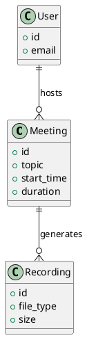
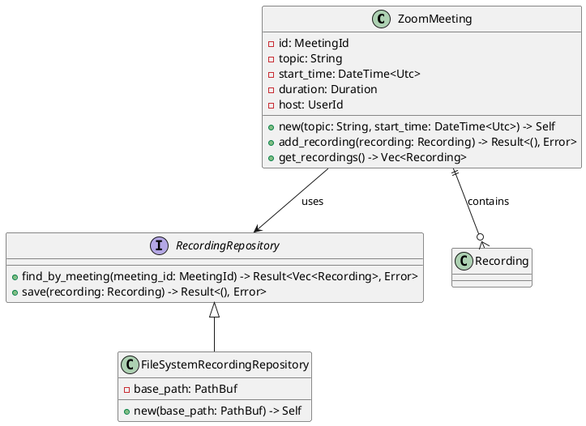
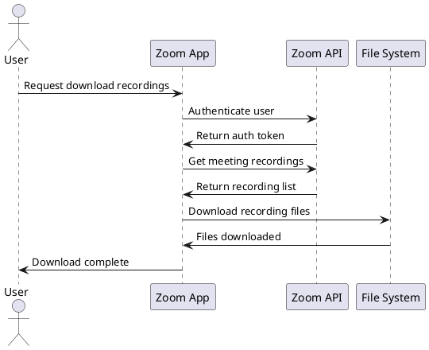
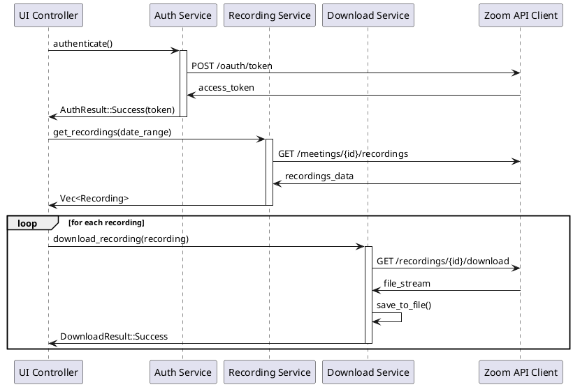
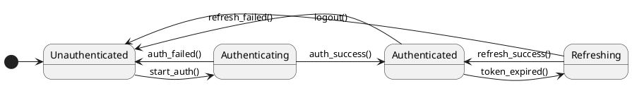
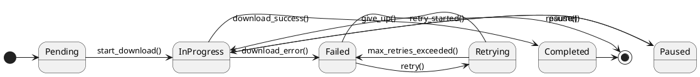

# UML統合設計プロセス提案 - Zoom Video Mover

## 提案概要

**目的**: UMLモデリング（クラス図・状態遷移図・シーケンス図）を統合した構造化設計プロセスの構築  
**背景**: 現在の文書中心設計から視覚的モデリング中心設計への発展  
**効果**: 設計品質向上・コミュニケーション改善・実装効率化・保守性向上  

## 現在の設計プロセス分析

### 現行プロセスの課題
1. **視覚化不足**: 文書中心で構造・振る舞いの可視化が限定的
2. **動的側面不足**: システムの動的振る舞い・状態変化の表現不足
3. **実装ギャップ**: 設計書からコード実装までのギャップ
4. **コミュニケーション**: ステークホルダー間での理解共有の困難

### 現行プロセス強み
1. **トレーサビリティ**: 要件から実装までの完全な追跡可能性
2. **品質管理**: 段階的品質ゲート・検証プロセス
3. **文書体系**: 包括的な設計文書群
4. **並行処理**: Phase 3でのコンポーネント並行設計

## UML統合新設計プロセス提案

### 基本方針
- **既存プロセス活用**: 現行のPhase構造・品質ゲートを維持
- **UMLモデリング統合**: 各Phaseに適切なUML図を組み込み
- **段階的詳細化**: 概念→論理→物理の段階的モデリング
- **ツール統合**: PlantUML・Mermaid等での自動化・版管理

## 新設計プロセス構造

### Phase 1: コンセプチュアルモデリング（概念設計）

#### 1.1 ドメインモデリング
**目的**: ビジネスドメインの概念構造理解
**UML図**: 
- **概念クラス図**: ドメインエンティティ・関係性
- **ユースケース図**: 機能要求の構造化

**作業内容**:
```
1. ドメイン分析・エンティティ抽出
2. 概念クラス図作成（属性なし、関係性中心）
3. ユースケース図作成（アクター・機能関係）
4. ドメイン用語集作成
```

**成果物**:
- 📊 概念クラス図（Conceptual Class Diagram）
- 📊 ユースケース図（Use Case Diagram）
- 📄 ドメイン用語集

#### 1.2 アーキテクチャモデリング
**目的**: システム全体構造の概念設計
**UML図**:
- **パッケージ図**: システム分割・モジュール構造
- **配置図**: 物理的アーキテクチャ概要

**作業内容**:
```
1. システム分割・レイヤー設計
2. パッケージ図作成（高レベル構造）
3. 配置図作成（デプロイメント概要）
4. アーキテクチャ決定記録（ADR）作成
```

**成果物**:
- 📊 パッケージ図（Package Diagram）
- 📊 配置図（Deployment Diagram - 概念）
- 📄 アーキテクチャ決定記録（ADR）

### Phase 2: ロジカルモデリング（論理設計）

#### 2.1 構造モデリング
**目的**: システムの静的構造詳細設計
**UML図**:
- **詳細クラス図**: 属性・メソッド・関係性詳細
- **オブジェクト図**: 実行時インスタンス関係

**作業内容**:
```
1. クラス設計（属性・メソッド定義）
2. 関係性設計（関連・依存・継承・実現）
3. インターフェース設計
4. パターン適用（GoF・アーキテクチャパターン）
```

**成果物**:
- 📊 詳細クラス図（Detailed Class Diagram）
- 📊 オブジェクト図（Object Diagram）
- 📄 インターフェース仕様書

#### 2.2 振る舞いモデリング
**目的**: システムの動的振る舞い設計
**UML図**:
- **シーケンス図**: オブジェクト間相互作用
- **状態遷移図**: オブジェクト状態・遷移
- **アクティビティ図**: ビジネスプロセス・ワークフロー

**作業内容**:
```
1. 主要ユースケースのシーケンス図作成
2. 状態を持つオブジェクトの状態遷移図作成
3. 複雑なビジネスロジックのアクティビティ図作成
4. 例外・エラーフローの設計
```

**成果物**:
- 📊 シーケンス図（Sequence Diagram）
- 📊 状態遷移図（State Transition Diagram）
- 📊 アクティビティ図（Activity Diagram）

#### 2.3 インターフェースモデリング
**目的**: システム間・コンポーネント間インターフェース設計
**UML図**:
- **通信図**: オブジェクト間通信パターン
- **コンポーネント図**: コンポーネント構造・依存関係

**作業内容**:
```
1. 外部システム連携インターフェース設計
2. 内部コンポーネント間インターフェース設計
3. 通信プロトコル・データ形式設計
4. API仕様詳細化
```

**成果物**:
- 📊 通信図（Communication Diagram）
- 📊 コンポーネント図（Component Diagram）
- 📄 API仕様書（OpenAPI）

### Phase 3: フィジカルモデリング（物理設計）

#### 3.1 実装モデリング
**目的**: 実装技術を考慮した詳細設計
**UML図**:
- **実装クラス図**: Rust言語仕様対応
- **詳細配置図**: 実際のデプロイメント環境

**作業内容**:
```
1. Rust言語特性を考慮したクラス設計
2. ライフタイム・所有権モデリング
3. 非同期処理（async/await）設計
4. エラー処理（Result型）設計
```

**成果物**:
- 📊 実装クラス図（Implementation Class Diagram）
- 📊 詳細配置図（Detailed Deployment Diagram）
- 📄 Rust実装ガイドライン

#### 3.2 動的実装モデリング
**目的**: 実行時動作の詳細設計
**UML図**:
- **詳細シーケンス図**: メソッド呼び出し・ライフタイム
- **実装状態遷移図**: 具体的状態・イベント

**作業内容**:
```
1. 詳細メソッド呼び出しシーケンス設計
2. 非同期処理フローの詳細設計
3. エラー処理・回復処理の詳細設計
4. 性能・リソース考慮設計
```

**成果物**:
- 📊 詳細シーケンス図（Detailed Sequence Diagram）
- 📊 実装状態遷移図（Implementation State Diagram）
- 📄 性能設計書

#### 3.3 統合・検証モデリング
**目的**: システム統合・テスト観点の設計
**UML図**:
- **統合テストシーケンス図**: テストシナリオ
- **システム配置図**: 最終デプロイメント

**作業内容**:
```
1. 統合テストシナリオ設計
2. システム全体の配置・運用設計
3. モニタリング・ログ設計
4. 災害復旧・バックアップ設計
```

**成果物**:
- 📊 統合テストシーケンス図
- 📊 システム配置図（System Deployment）
- 📄 運用設計書

## UML図別適用ガイドライン

### クラス図設計ガイドライン

#### 概念クラス図（Phase 1.1）


#### 詳細クラス図（Phase 2.1）


#### 実装クラス図（Phase 3.1）
```plantuml
@startuml ImplementationClassDiagram
' Rust言語仕様対応
class ZoomMeeting {
  - id: MeetingId
  - topic: String
  - start_time: DateTime<Utc>
  - duration: Duration
  - host: UserId
  - recordings: Vec<Recording>
  + new(topic: String, start_time: DateTime<Utc>) -> Self
  + add_recording(&mut self, recording: Recording) -> Result<(), MeetingError>
  + get_recordings(&self) -> &[Recording]
}

' Rust特有のライフタイム・所有権表現
trait RecordingRepository {
  type Error: std::error::Error
  async fn find_by_meeting<'a>(&'a self, meeting_id: &'a MeetingId) 
    -> Result<Vec<Recording>, Self::Error>
  async fn save<'a>(&'a mut self, recording: Recording) 
    -> Result<(), Self::Error>
}

struct FileSystemRecordingRepository {
  base_path: PathBuf
  // async runtime handle
  rt: tokio::runtime::Handle
}
@enduml
```

### シーケンス図設計ガイドライン

#### 概念シーケンス図（Phase 2.2）


#### 詳細シーケンス図（Phase 3.2）


### 状態遷移図設計ガイドライン

#### 認証状態遷移図（Phase 2.2）


#### ダウンロード状態遷移図（Phase 3.2）


## ツール・技術統合

### UMLツール選定
1. **PlantUML**: テキストベースUML・版管理対応
2. **Mermaid**: Markdown統合・GitHub表示対応
3. **Rust向け**: structopt/clap for CLI・serde for serialization

### 版管理・CI/CD統合
```yaml
# .github/workflows/uml-validation.yml
name: UML Validation
on: [push, pull_request]
jobs:
  validate-uml:
    runs-on: ubuntu-latest
    steps:
    - uses: actions/checkout@v2
    - name: Generate UML diagrams
      run: |
        plantuml -checkonly docs/**/*.puml
        # UML図の整合性チェック
    - name: Validate model consistency
      run: |
        # クラス図とシーケンス図の整合性検証
        python scripts/validate_uml_consistency.py
```

### 自動化・生成
```rust
// UMLからRustコード生成例
#[derive(Debug, Clone, PartialEq)]
pub struct Meeting {
    pub id: MeetingId,
    pub topic: String,
    pub start_time: DateTime<Utc>,
    pub duration: Duration,
    pub recordings: Vec<Recording>,
}

impl Meeting {
    pub fn new(topic: String, start_time: DateTime<Utc>) -> Self {
        Self {
            id: MeetingId::new(),
            topic,
            start_time,
            duration: Duration::hours(1), // default
            recordings: Vec::new(),
        }
    }
    
    pub fn add_recording(&mut self, recording: Recording) -> Result<(), MeetingError> {
        // UMLシーケンス図に基づく実装
        if self.recordings.len() >= MAX_RECORDINGS {
            return Err(MeetingError::TooManyRecordings);
        }
        self.recordings.push(recording);
        Ok(())
    }
}
```

## 新プロセスの利点

### 設計品質向上
- **視覚化**: 複雑な構造・振る舞いの直感的理解
- **一貫性**: UML標準による設計の統一性
- **検証可能性**: モデル間整合性の自動検証

### コミュニケーション改善
- **共通言語**: UMLによるステークホルダー間共通理解
- **段階的詳細化**: レベル別の適切な詳細度
- **視覚的レビュー**: 図による効率的設計レビュー

### 実装効率化
- **設計→コードギャップ削減**: 詳細モデルから直接実装
- **自動生成**: UMLからのコード骨格自動生成
- **変更追跡**: モデル変更の実装への自動反映

### 保守性向上
- **設計文書の生きた状態**: コードとモデルの同期
- **変更影響分析**: モデルレベルでの影響範囲特定
- **リファクタリング支援**: 構造変更の視覚的検討

## 実装ロードマップ

### Phase 1: 基盤整備（2週間）
```
Week 1-2:
- UMLツール環境構築（PlantUML・Mermaid）
- 既存設計のUMLモデル化（概念レベル）
- チーム向けUMLモデリング研修
- ツール・プロセス標準化
```

### Phase 2: パイロット実装（2週間）
```
Week 3-4:
- 認証コンポーネントでのUML統合設計実践
- クラス図・シーケンス図・状態遷移図作成
- 設計→実装フローの検証
- 問題点洗い出し・改善
```

### Phase 3: 全面展開（4週間）
```
Week 5-8:
- 全コンポーネントでのUML統合設計
- 自動生成・検証スクリプト構築
- CI/CD統合・品質ゲート強化
- 最終検証・プロセス確立
```

## まとめ

UML統合設計プロセスにより、Zoom Video Moverプロジェクトの設計品質・開発効率・保守性が大幅に向上します。既存の優れたトレーサビリティ・品質管理プロセスを活かしつつ、視覚的モデリングの力を統合することで、より堅牢で理解しやすいソフトウェア設計を実現できます。

---

**提案日**: 2025-08-03  
**提案者**: Claude Code Assistant  
**承認待ち**: システムアーキテクト・技術リーダー  
**実装開始予定**: 承認後即座