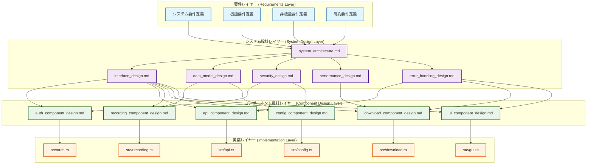
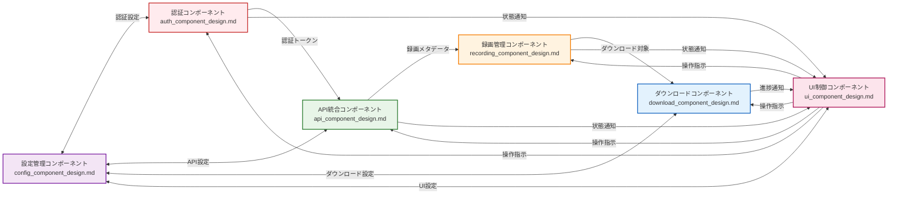
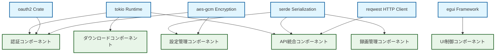

# 設計文書依存関係図 - Zoom Video Mover

## 概要

**目的**: 設計文書間の依存関係の可視化と影響範囲の明確化  
**更新頻度**: 設計文書追加・変更時即座更新  
**管理責任**: システムアーキテクト  
**活用用途**: 変更影響分析・設計整合性確認・新規メンバーのオンボーディング  

## 全体依存関係図

### 1. 階層別依存関係 (Top-Down)



### 2. コンポーネント間相互依存関係



## 詳細依存関係分析

### 3. システム設計文書間の詳細依存関係

| 依存元文書 | 依存先文書 | 依存関係ID | 依存内容 | 依存強度 |
|------------|------------|------------|----------|----------|
| **system_architecture.md** | interface_design.md | SYS-IF-001 | コンポーネント間IFアーキテクチャ | 🔴 Critical |
| **system_architecture.md** | data_model_design.md | SYS-DM-001 | データアーキテクチャ | 🟡 High |
| **system_architecture.md** | security_design.md | SYS-SEC-001 | セキュリティアーキテクチャ | 🔴 Critical |
| **system_architecture.md** | performance_design.md | SYS-PERF-001 | 性能アーキテクチャ | 🟡 High |
| **system_architecture.md** | error_handling_design.md | SYS-ERR-001 | エラー処理アーキテクチャ | 🟡 High |
| **interface_design.md** | data_model_design.md | IF-DM-001 | DTO・データ転送形式 | 🟡 High |
| **interface_design.md** | error_handling_design.md | IF-ERR-001 | エラー応答形式 | 🟡 High |
| **security_design.md** | data_model_design.md | SEC-DM-001 | 暗号化データ構造 | 🟡 High |

### 4. コンポーネント設計文書間の詳細依存関係

| コンポーネント | 依存先文書 | 依存関係ID | 依存内容 | 影響レベル |
|----------------|------------|------------|----------|------------|
| **auth_component_design.md** | interface_design.md | AUTH-IF-001~003 | 認証API仕様 | 🔴 Critical |
| **auth_component_design.md** | security_design.md | AUTH-SEC-001~002 | OAuth・暗号化仕様 | 🔴 Critical |
| **auth_component_design.md** | config_component_design.md | AUTH-CFG-001 | 認証設定仕様 | 🟡 High |
| **api_component_design.md** | interface_design.md | API-IF-001~004 | ZoomAPI仕様 | 🔴 Critical |
| **api_component_design.md** | error_handling_design.md | API-ERR-001~002 | レート制限エラー | 🟡 High |
| **api_component_design.md** | auth_component_design.md | API-AUTH-001 | 認証トークン利用 | 🔴 Critical |
| **recording_component_design.md** | data_model_design.md | REC-DM-001~003 | 録画エンティティ | 🔴 Critical |
| **recording_component_design.md** | api_component_design.md | REC-API-001 |録画メタデータ取得 | 🟡 High |
| **download_component_design.md** | performance_design.md | DL-PERF-001~003 | 並列ダウンロード | 🔴 Critical |
| **download_component_design.md** | recording_component_design.md | DL-REC-001 | ダウンロード対象 | 🟡 High |
| **config_component_design.md** | security_design.md | CFG-SEC-001 | 設定暗号化 | 🟡 High |
| **ui_component_design.md** | interface_design.md | UI-IF-001~002 | UI-サービス間IF | 🟡 High |
| **ui_component_design.md** | error_handling_design.md | UI-ERR-001 | エラー表示 | 🟡 High |

## 影響度分析マトリックス

### 5. 変更時影響範囲（High Impact Changes）

| 変更対象文書 | 直接影響文書数 | 間接影響文書数 | 総影響文書数 | 影響度ランク |
|--------------|----------------|----------------|--------------|--------------|
| **system_architecture.md** | 5 | 6 | 11 | 🔴 Critical |
| **interface_design.md** | 6 | 3 | 9 | 🔴 Critical |
| **security_design.md** | 2 | 4 | 6 | 🟡 High |
| **auth_component_design.md** | 1 | 4 | 5 | 🟡 High |
| **api_component_design.md** | 2 | 3 | 5 | 🟡 High |
| **data_model_design.md** | 2 | 3 | 5 | 🟡 High |
| **performance_design.md** | 1 | 3 | 4 | 🟢 Medium |
| **error_handling_design.md** | 3 | 1 | 4 | 🟢 Medium |
| **recording_component_design.md** | 1 | 2 | 3 | 🟢 Medium |
| **download_component_design.md** | 0 | 2 | 2 | 🟢 Low |
| **config_component_design.md** | 0 | 5 | 5 | 🟢 Low |
| **ui_component_design.md** | 0 | 0 | 0 | 🟢 Low |

### 6. 循環依存検出結果

**検出結果**: 循環依存なし ✅

**検証済み関係**:
- config_component ↔ auth_component: 一方向依存のみ（設定→認証）
- config_component ↔ api_component: 一方向依存のみ（設定→API）  
- ui_component → services: 一方向依存のみ（UI→サービス）
- services → ui_component: イベント通知のみ（非循環）

## 依存関係パターン分析

### 7. 設計パターン別依存関係

#### レイヤードアーキテクチャパターン
```
Presentation Layer (UI) 
    ↓ (制御依存)
Application Layer (Services)
    ↓ (データ依存)  
Infrastructure Layer (Repository/Client)
```

**依存方向**: 上位レイヤー → 下位レイヤー（一方向）  
**依存強度**: Medium（レイヤー内結合は低、レイヤー間結合は適度）

#### Repository パターン
```
Service Layer
    ↓ (インターフェース依存)
Repository Interface  
    ↑ (実装依存)
Concrete Repository
```

**依存方向**: Service → Interface ← Implementation  
**依存強度**: Low（疎結合）

#### Observer パターン
```
Subject (Services)
    → (通知依存)
Observer (UI Components)
```

**依存方向**: Subject → Observer（一方向）  
**依存強度**: Low（イベント通知のみ）

### 8. 技術的依存関係

#### Rust技術スタック依存


## 変更影響分析アルゴリズム

### 9. 影響範囲計算アルゴリズム

#### 直接影響計算
```rust
/// 直接影響を受ける文書の特定
fn calculate_direct_impact(changed_document: &str) -> Vec<Document> {
    let dependency_matrix = load_dependency_matrix();
    dependency_matrix
        .get_dependencies(changed_document)
        .iter()
        .map(|dep| dep.target_document)
        .collect()
}
```

#### 間接影響計算（再帰的）
```rust
/// 間接影響を受ける文書の特定（深さ制限付き）
fn calculate_indirect_impact(
    changed_document: &str, 
    max_depth: usize
) -> Vec<Document> {
    let mut impacted = HashSet::new();
    let mut queue = VecDeque::new();
    
    queue.push_back((changed_document, 0));
    
    while let Some((doc, depth)) = queue.pop_front() {
        if depth >= max_depth { continue; }
        
        for dependent in calculate_direct_impact(doc) {
            if !impacted.contains(&dependent) {
                impacted.insert(dependent.clone());
                queue.push_back((dependent, depth + 1));
            }
        }
    }
    
    impacted.into_iter().collect()
}
```

#### 影響度スコア計算
```rust
/// 影響度スコアの計算
fn calculate_impact_score(impact_analysis: &ImpactAnalysis) -> ImpactScore {
    let direct_weight = 1.0;
    let indirect_weight = 0.6;
    let critical_multiplier = 2.0;
    let high_multiplier = 1.5;
    
    let direct_score = impact_analysis.direct_impacts.len() as f64 * direct_weight;
    let indirect_score = impact_analysis.indirect_impacts.len() as f64 * indirect_weight;
    
    let criticality_multiplier = match impact_analysis.max_criticality {
        Criticality::Critical => critical_multiplier,
        Criticality::High => high_multiplier,
        _ => 1.0,
    };
    
    ImpactScore {
        total_score: (direct_score + indirect_score) * criticality_multiplier,
        direct_score,
        indirect_score,
        criticality_multiplier,
    }
}
```

### 10. 自動化チェックツール

#### 依存関係整合性チェック
```bash
# 依存関係の循環検出
cargo test dependency_cycle_detection

# 依存関係の整合性確認  
cargo test dependency_consistency_check

# 影響範囲分析の正確性検証
cargo test impact_analysis_accuracy
```

#### 継続的依存関係監視
```rust
/// 設計文書変更時の自動影響分析
#[cfg(test)]
mod dependency_tests {
    use super::*;
    
    #[test]
    fn test_dependency_graph_consistency() {
        let graph = DependencyGraph::load();
        assert!(graph.is_acyclic());
        assert!(graph.all_references_valid());
    }
    
    #[test] 
    fn test_impact_analysis_completeness() {
        for document in all_design_documents() {
            let impact = calculate_total_impact(&document);
            assert!(impact.completeness_score() > 0.95);
        }
    }
}
```

## 継続的改善プロセス

### 11. 依存関係品質向上

#### 月次依存関係レビュー
- **複雑度分析**: 依存関係の複雑さ評価
- **結合度分析**: コンポーネント間結合の適切性
- **凝集度分析**: コンポーネント内凝集の強度

#### 四半期アーキテクチャ評価
- **依存関係最適化**: 不要な依存関係の除去
- **アーキテクチャリファクタリング**: 設計改善の提案
- **新技術導入**: 依存関係への影響評価

---

**作成日**: 2025-08-03  
**管理責任者**: システムアーキテクト  
**次回更新**: 設計文書変更時即座  
**レビュー周期**: 月次（第1金曜日）