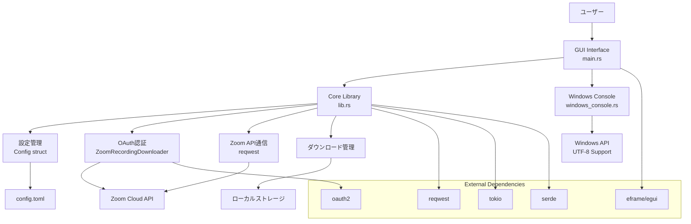
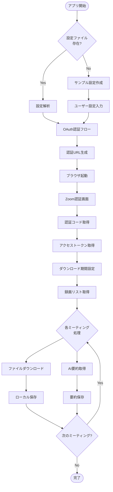
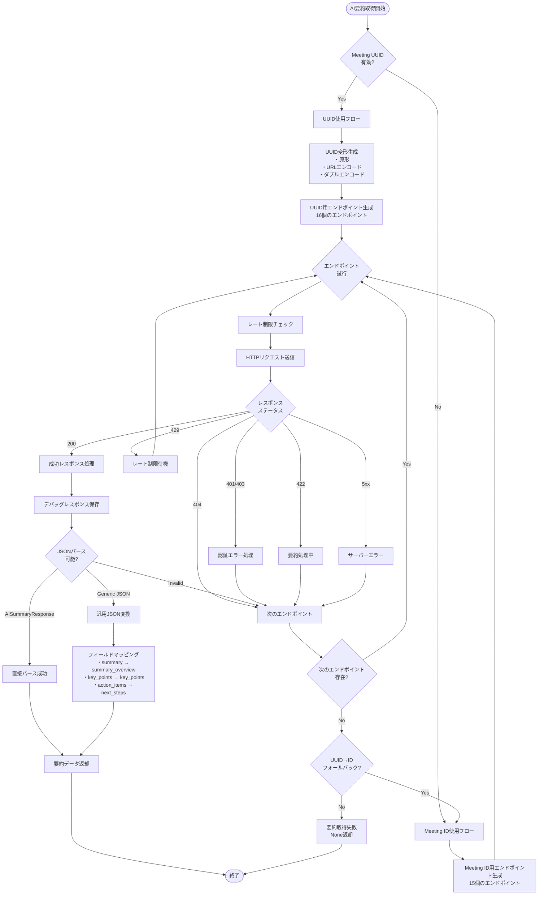
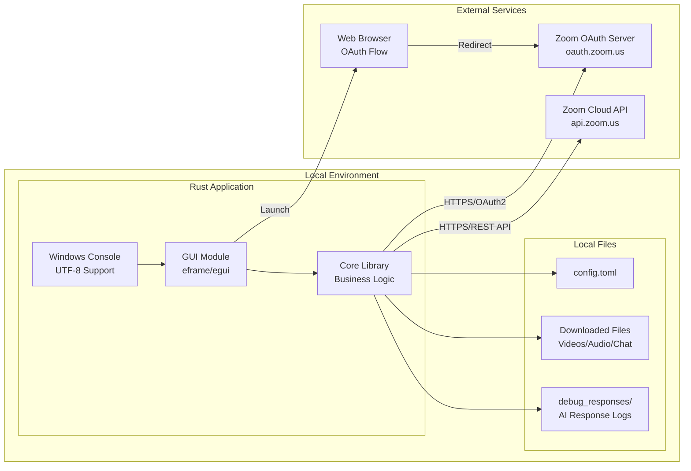
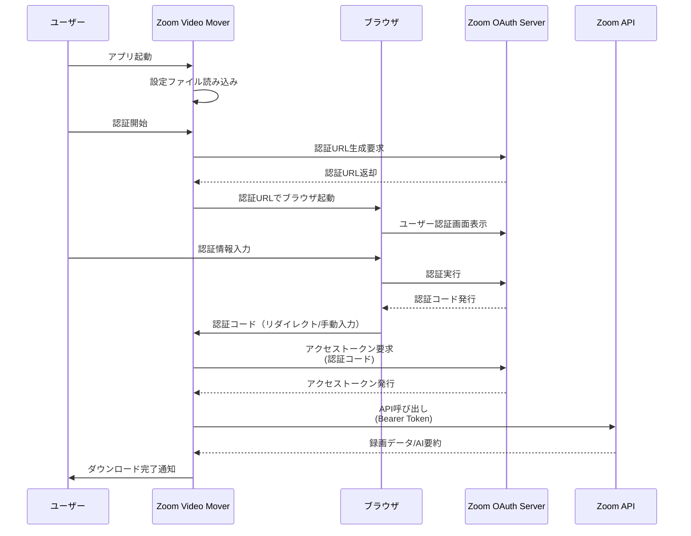
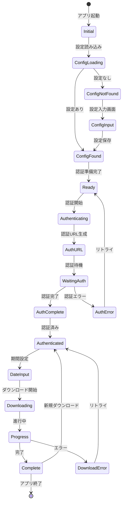
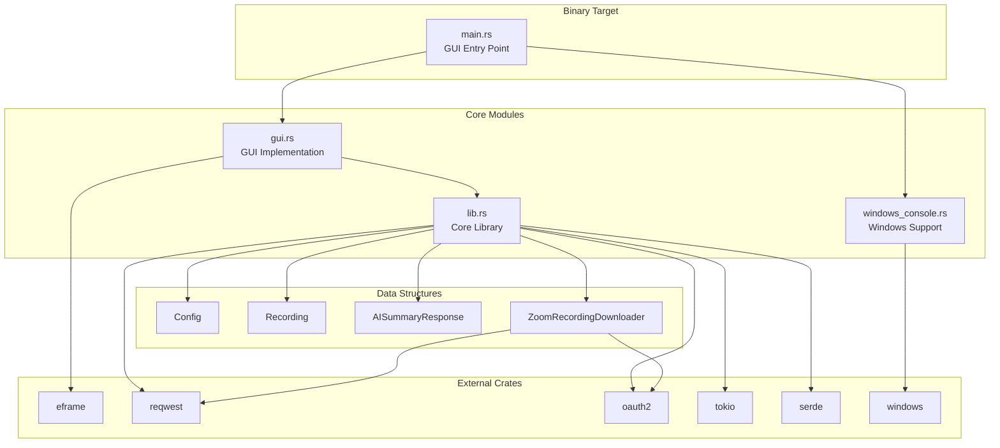

# システムアーキテクチャ設計 - Zoom Video Mover

**文書情報**:
- バージョン: v1.1
- 作成日: 2025-08-09  
- 最終更新: 2025-08-09
- 作成者: 開発チーム
- レビュー状況: ドラフト
- レビュー期限: 2025-08-16

**関連文書**:
- [設計ポリシー](../../policies/universal/design_policy.md)
- [セキュリティポリシー](../../policies/universal/security_policy.md)
- [API仕様書](./api_specifications.md)

## 1. アーキテクチャ決定記録 (ADR)

### ADR-001: GUI フレームワーク選択
**決定**: egui フレームワークの採用  
**理由**: 
- Rustネイティブ・高パフォーマンス
- クロスプラットフォーム対応
- 軽量・依存関係最小
- リアルタイム更新・プログレス表示に最適

**代替案検討**: 
- Tauri: Web技術だが重い
- gtk-rs: Linux依存が強い
- 検討結果: eguiが最適解

### ADR-002: 非同期ランタイム選択
**決定**: tokio ランタイムの採用  
**理由**:
- Rustエコシステムのデファクト標準
- HTTP通信・並行ダウンロードに最適
- 豊富なライブラリサポート
- パフォーマンス・安定性実績

## 2. システムアーキテクチャ設計

## 1. システムアーキテクチャ図



## 2. データフロー図



## 2.1 AI要約取得の詳細フロー



## 3. システム構成図



## 4. OAuth認証フロー図



## 5. GUI状態遷移図



## 6. コンポーネント依存関係図



## 7. ファイル構造とモジュール関係

```
zoom_video_mover/
├── src/
│   ├── main.rs          # GUI アプリケーションエントリーポイント
│   ├── lib.rs           # コアライブラリ
│   │   ├── Config       # 設定管理
│   │   ├── Recording    # 録画データ構造
│   │   ├── AISummary    # AI要約データ構造
│   │   └── ZoomDownloader # API通信・ダウンロード
│   ├── gui.rs           # GUI実装
│   │   ├── ZoomDownloaderApp # メインアプリ状態
│   │   ├── AppMessage   # 非同期メッセージング
│   │   └── UI Rendering # 各セクション描画
│   └── windows_console.rs # Windows固有処理
│       ├── Console Encoding # UTF-8設定
│       └── Japanese Output  # 日本語出力サポート
├── config.toml          # OAuth設定
├── debug_responses/     # AI要約レスポンスログ
└── Cargo.toml          # 依存関係・ビルド設定
```

## 7.1 AI要約データ構造の詳細

```rust
// 主要なAI要約レスポンス構造
pub struct AISummaryResponse {
    // 基本情報
    pub meeting_uuid: String,
    pub meeting_id: String,
    pub summary_title: String,
    
    // タイムスタンプ
    pub summary_start_time: String,
    pub summary_end_time: String,
    pub summary_created_time: String,
    pub summary_last_modified_time: String,
    
    // 要約コンテンツ
    pub summary_overview: String,      // 概要
    pub summary_content: String,       // 詳細内容（Markdown）
    pub summary_keyword: Vec<String>,  // キーワード
    
    // 構造化データ
    pub summary_details: Vec<SummaryDetail>,
    pub topic_summaries: Vec<TopicSummary>,
    pub detailed_sections: Vec<DetailedSection>,
    pub next_steps: Vec<String>,
    
    // 代替フィールド（Zoom APIの変動対応）
    pub summary: String,               // alias for summary_overview
    pub key_points: Vec<String>,       // alias for important points
    pub action_items: Vec<String>,     // alias for next_steps
}

// 支援構造体
pub struct SummaryDetail {
    pub label: String,
    pub summary: String,
}

pub struct TopicSummary {
    pub topic_title: String,
    pub topic_content: String,
}

pub struct DetailedSection {
    pub section_title: String,
    pub section_content: String,
}

// 汎用フォーマット対応
pub struct GenericAISummary {
    #[serde(flatten)]
    pub data: serde_json::Map<String, serde_json::Value>,
}
```