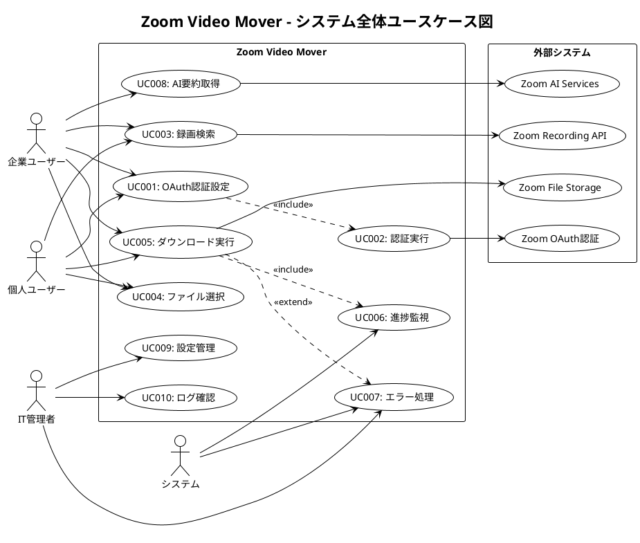
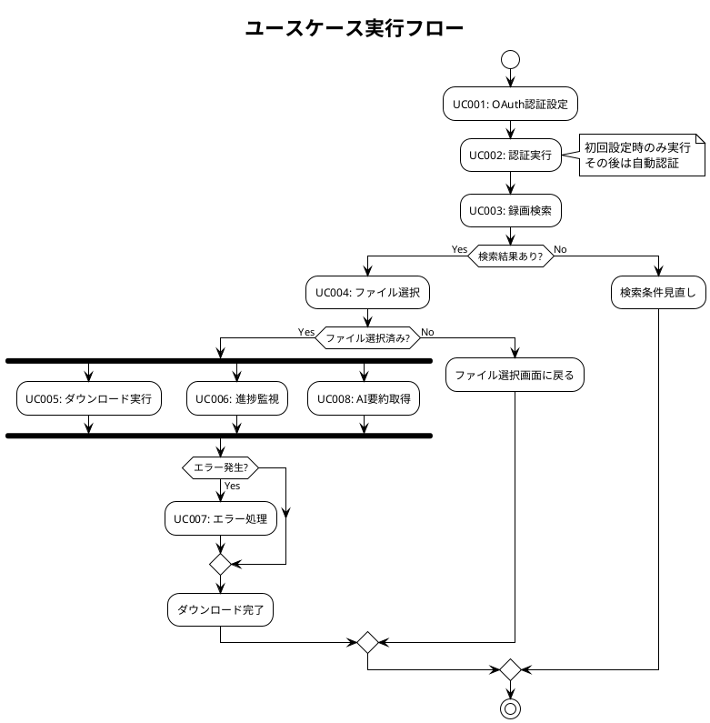

# ユースケース仕様書 - Zoom Video Mover

## 文書概要
**プロジェクト名**: Zoom Video Mover  
**作成日**: 2025-08-02  
  
**バージョン**: 1.0  

## ユースケース図

### システム全体ユースケース図



## 主要ユースケース詳細仕様

### UC001: OAuth認証設定

#### 基本情報
- **ユースケースID**: UC001
- **ユースケース名**: OAuth認証設定
- **主アクター**: 企業ユーザー、個人ユーザー
- **ステークホルダー**: システム管理者
- **事前条件**: アプリケーションが起動されている
- **成功条件**: OAuth設定が正常に保存される
- **失敗条件**: 設定が無効または保存に失敗する

#### 基本フロー
1. ユーザーがアプリケーションを初回起動する
2. システムが設定ファイルの存在を確認する
3. システムが設定画面を表示する
4. ユーザーがClient IDを入力する
5. ユーザーがClient Secretを入力する
6. ユーザーがRedirect URIを入力する（オプション）
7. ユーザーが「保存」ボタンをクリックする
8. システムが入力値を検証する
9. システムが設定をTOMLファイルに保存する
10. システムが保存成功メッセージを表示する

#### 代替フロー
**A1: 設定ファイルが既に存在する場合**
- 3a. システムが既存設定を読み込み、フィールドに表示する
- 3b. ユーザーが設定を修正する
- 3c. 基本フロー7に続く

**A2: 入力値が無効な場合**
- 8a. システムがエラーメッセージを表示する
- 8b. ユーザーが入力値を修正する
- 8c. 基本フロー7に戻る

#### 例外フロー
**E1: ファイル書き込み権限がない場合**
- 9a. システムが権限エラーを表示する
- 9b. ユーザーが管理者権限で実行する
- 9c. ユースケース終了

#### UI要件
- Client ID入力フィールド（必須、文字列検証）
- Client Secret入力フィールド（必須、マスク表示）
- Redirect URI入力フィールド（オプション、URL形式検証）
- 保存ボタン、キャンセルボタン
- エラーメッセージ表示エリア

### UC002: 認証実行

#### 基本情報
- **ユースケースID**: UC002
- **ユースケース名**: OAuth認証実行
- **主アクター**: システム（自動実行）
- **ステークホルダー**: エンドユーザー
- **事前条件**: OAuth設定が完了している
- **成功条件**: アクセストークンが取得・保存される
- **失敗条件**: 認証が失敗またはタイムアウトする

#### 基本フロー
1. システムが保存済みOAuth設定を読み込む
2. システムが認証URLを生成する
3. システムがデフォルトブラウザで認証URLを開く
4. ユーザーがブラウザでZoomにログインする
5. ユーザーがアプリケーション認可を許可する
6. Zoomが認証コードをRedirect URIに送信する
7. システムが認証コードを受信する
8. システムがアクセストークンを要求する
9. Zoomがアクセストークンとリフレッシュトークンを返却する
10. システムがトークンを暗号化して保存する
11. システムが認証完了を通知する

#### 代替フロー
**A1: 既存トークンが有効な場合**
- 1a. システムが既存トークンの有効性を確認する
- 1b. トークンが有効な場合、認証成功として処理終了

**A2: トークンが期限切れの場合**
- 1a. システムがリフレッシュトークンを使用して更新を試行する
- 1b. 更新成功時は基本フロー11に続く
- 1c. 更新失敗時は基本フロー2に続く

#### 例外フロー
**E1: ユーザーが認可を拒否した場合**
- 5a. Zoomが認可拒否エラーを返却する
- 5b. システムがエラーメッセージを表示する
- 5c. ユースケース終了

**E2: ネットワークエラーが発生した場合**
- 8a. システムがネットワークエラーを検出する
- 8b. システムがリトライを3回実行する
- 8c. 全て失敗した場合、エラー表示して終了

### UC003: 録画検索

#### 基本情報
- **ユースケースID**: UC003
- **ユースケース名**: 録画検索・一覧表示
- **主アクター**: 企業ユーザー、個人ユーザー
- **ステークホルダー**: IT管理者
- **事前条件**: OAuth認証が完了している
- **成功条件**: 録画リストが取得・表示される
- **失敗条件**: API呼び出しが失敗する

#### 基本フロー
1. ユーザーが「録画検索」タブを選択する
2. システムが検索条件入力フォームを表示する
3. ユーザーが検索期間（開始日・終了日）を設定する
4. ユーザーがファイル種別フィルタを設定する（オプション）
5. ユーザーが「検索実行」ボタンをクリックする
6. システムがZoom Recording APIを呼び出す
7. システムがAPI レスポンスを解析する
8. システムが録画データをページネーション処理する
9. システムが会議別の階層構造で録画リストを表示する
10. ユーザーが録画リスト内容を確認する

#### 代替フロー
**A1: 大量の録画が存在する場合**
- 8a. システムが段階的データ取得を実行する
- 8b. システムが「さらに読み込み」ボタンを表示する
- 8c. ユーザーがボタンクリックで追加データを取得

**A2: 検索結果が0件の場合**
- 9a. システムが「該当する録画が見つかりません」を表示する
- 9b. システムが検索条件の見直しを提案する

#### UI要件
- 日付範囲選択（カレンダーUI）
- ファイル種別チェックボックス（動画・音声・チャット・トランスクリプト）
- 会議名フィルタ（部分一致検索）
- 録画リスト表示（ツリー構造、チェックボックス付き）
- ページネーション制御

### UC004: ファイル選択

#### 基本情報
- **ユースケースID**: UC004
- **ユースケース名**: ダウンロード対象ファイル選択
- **主アクター**: 企業ユーザー、個人ユーザー
- **ステークホルダー**: なし
- **事前条件**: 録画リストが表示されている
- **成功条件**: ダウンロード対象ファイルが選択される
- **失敗条件**: 選択操作がエラーで中断される

#### 基本フロー
1. ユーザーが録画リストを確認する
2. ユーザーが会議単位のチェックボックスを操作する
3. システムが選択状態を子要素（ファイル）に反映する
4. システムが選択ファイルの統計情報を表示する
5. ユーザーが個別ファイルの選択状態を調整する
6. システムが親要素（会議）の選択状態を更新する
7. ユーザーが「ダウンロード開始」ボタンをクリックする
8. システムが選択されたファイル一覧を確認する

#### UI要件
- 階層チェックボックス（会議 > ファイル）
- 全選択・全解除ボタン
- 選択統計表示（ファイル数・総容量・推定時間）
- ファイル詳細情報（名前・サイズ・形式・作成日時）
- プレビュー機能（可能な場合）

### UC005: ダウンロード実行

#### 基本情報
- **ユースケースID**: UC005
- **ユースケース名**: 並列ダウンロード実行
- **主アクター**: システム（自動実行）
- **ステークホルダー**: エンドユーザー
- **事前条件**: ダウンロード対象ファイルが選択されている
- **成功条件**: 全ファイルが正常にダウンロードされる
- **失敗条件**: ダウンロードが中断またはファイル破損する

#### 基本フロー
1. システムがダウンロードセッションを作成する
2. システムが出力ディレクトリの存在・権限を確認する
3. システムが会議別フォルダを作成する
4. システムがダウンロードタスクを並列実行する
5. システムが各ファイルをストリーミングダウンロードする
6. システムがファイル整合性をチェックする
7. システムがファイル名をサニタイズして保存する
8. システムが進捗情報をリアルタイム更新する
9. システムが全タスク完了を確認する
10. システムがダウンロード完了を通知する

#### 代替フロー
**A1: ダウンロード中にエラーが発生した場合**
- 5a. システムがエラーを検出・分類する
- 5b. 一時的エラーの場合、自動リトライを実行する
- 5c. 恒久的エラーの場合、該当タスクを失敗扱いにして継続

**A2: ユーザーがダウンロードを一時停止した場合**
- 8a. システムが実行中タスクを安全に停止する
- 8b. システムが進捗状態を保存する
- 8c. ユーザーが再開時、中断点から継続する

### UC006: 進捗監視

#### 基本情報
- **ユースケースID**: UC006
- **ユースケース名**: ダウンロード進捗監視・制御
- **主アクター**: システム（自動実行）
- **ステークホルダー**: エンドユーザー
- **事前条件**: ダウンロードが実行されている
- **成功条件**: 正確な進捗情報が表示される
- **失敗条件**: 進捗表示が停止または不正確になる

#### 基本フロー
1. システムが進捗監視を開始する
2. システムが全体進捗を計算する（ファイル数・データ量）
3. システムが個別タスク進捗を収集する
4. システムが転送速度・残り時間を推定する
5. システムが進捗バーとテキスト情報を更新する
6. システムが完了・エラーファイルの統計を表示する
7. システムが500ms間隔で情報を更新する
8. ダウンロード完了時、最終レポートを表示する

#### UI要件
- 全体進捗バー（パーセント表示）
- ファイル別進捗リスト
- 転送速度・残り時間表示
- 完了・エラー・待機中の統計
- 一時停止・再開・キャンセルボタン

### UC007: エラー処理

#### 基本情報
- **ユースケースID**: UC007
- **ユースケース名**: エラー検出・分類・回復処理
- **主アクター**: システム（自動実行）
- **ステークホルダー**: IT管理者、エンドユーザー
- **事前条件**: システム実行中にエラーが発生
- **成功条件**: エラーが適切に処理され、ユーザーに通知される
- **失敗条件**: エラーが検出されずシステムが異常状態になる

#### エラー分類・対応
| エラー種別 | 検出方法 | 対応策 | ユーザー通知 |
|------------|----------|--------|-------------|
| **ネットワークエラー** | HTTP タイムアウト | 自動リトライ（最大3回） | 進捗バーでリトライ表示 |
| **認証エラー** | HTTP 401/403 | トークン更新→再認証促進 | 認証画面への誘導 |
| **API制限エラー** | HTTP 429 | 待機後自動再開 | 待機時間と理由の表示 |
| **ファイル破損** | ハッシュ値不一致 | 該当ファイル再ダウンロード | エラーファイル一覧表示 |
| **ディスク容量不足** | 書き込みエラー | ダウンロード一時停止 | 容量不足警告・対策提案 |
| **権限エラー** | ファイル作成失敗 | 出力先変更促進 | 権限エラー説明・解決方法 |

### UC008: AI要約取得

#### 基本情報
- **ユースケースID**: UC008
- **ユースケース名**: Zoom AI要約データ取得・構造化
- **主アクター**: 企業ユーザー
- **ステークホルダー**: 個人ユーザー
- **事前条件**: 会議にAI要約が生成されている
- **成功条件**: AI要約がJSON形式で保存される
- **失敗条件**: AI要約の取得または解析に失敗する

#### 基本フロー
1. システムが会議のAI要約対応状況を確認する
2. システムがZoom AI APIを呼び出す
3. システムがAI要約レスポンスを受信する
4. システムが要約データを構造化する
5. システムがキーポイント・アクションアイテムを抽出する
6. システムがJSON形式で保存する
7. システムが要約取得完了を通知する

#### データ構造
```json
{
  "meetingId": "会議ID",
  "topic": "会議名",
  "summary": "全体要約テキスト",
  "keyPoints": ["重要ポイント1", "重要ポイント2"],
  "actionItems": [
    {
      "description": "アクション内容",
      "assignee": "担当者",
      "dueDate": "期限"
    }
  ],
  "participants": ["参加者一覧"],
  "createdAt": "生成日時"
}
```

## ユースケース間の関係

### 実行順序・依存関係



### 拡張ポイント・包含関係

- **UC005（ダウンロード実行）** は **UC006（進捗監視）** を包含する
- **UC007（エラー処理）** は全ユースケースから拡張される
- **UC008（AI要約取得）** は **UC005（ダウンロード実行）** と並行実行

## 非機能要件とユースケースの関係

### 性能要件
- **UC005**: 同時ダウンロード数5ファイル以内
- **UC006**: 進捗更新間隔500ms
- **UC003**: API呼び出し レート制限遵守

### 信頼性要件  
- **UC007**: 自動リトライ機能（最大3回）
- **UC005**: ファイル整合性チェック必須
- **UC002**: トークン自動更新機能

### 使用性要件
- **UC001**: 初回設定は5分以内で完了
- **UC004**: ファイル選択は直感的な階層表示
- **UC006**: 進捗状況の明確な可視化

---

**承認**:  
**品質基準適合**: [ ] 確認済  
**ポリシー準拠**: [ ] 確認済  
**承認日**: ___________