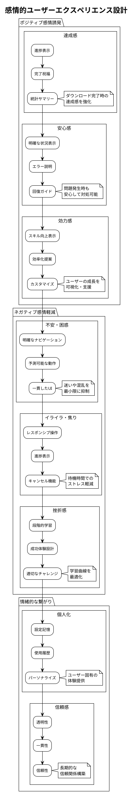

# ユーザビリティ要件定義書 - Zoom Video Mover

## 文書概要
**プロジェクト名**: Zoom Video Mover  
**作成日**: 2025-08-02  
  
**バージョン**: 1.0  

## ユーザビリティ要件カテゴリ

### 1. 学習しやすさ要件（Learnability）

#### 1.1 初回利用者の学習曲線

| 学習段階 | 目標達成時間 | 成功率目標 | 測定方法 |
|----------|-------------|-----------|----------|
| **初期設定完了** | 5分以内 | 90% | タスク完了時間測定 |
| **初回ダウンロード** | 2分以内 | 85% | 操作手順計測 |
| **基本機能理解** | 10分以内 | 95% | 機能発見率測定 |
| **効率的利用** | 30分以内 | 80% | 操作最適化度 |

#### 1.2 学習支援機能

```plantuml
@startuml
!theme plain
title 学習支援システム設計

package "オンボーディング" {
  usecase "初回起動ウィザード" as wizard
  usecase "段階的機能紹介" as intro
  usecase "実践的チュートリアル" as tutorial
  
  wizard : 3分で基本設定完了
  intro : 1機能ずつ丁寧な説明
  tutorial : 実際のファイルでの練習
}

package "継続的学習支援" {
  usecase "コンテキストヘルプ" as contexthelp
  usecase "ツールチップ" as tooltips
  usecase "プログレッシブ開示" as progressive
  
  contexthelp : 状況に応じたヘルプ表示
  tooltips : UI要素の簡潔な説明
  progressive : 必要な機能のみ表示
}

package "エラー回復支援" {
  usecase "建設的エラーメッセージ" as errormsg
  usecase "修正手順ガイド" as errorguide
  usecase "自動回復提案" as autorecovery
  
  errormsg : 何が問題かを明確に説明
  errorguide : 具体的な解決手順
  autorecovery : 自動修正オプション提供
}

actor "初心者ユーザー" as novice
actor "経験者ユーザー" as expert

novice --> wizard
novice --> tutorial
novice --> errormsg

expert --> contexthelp
expert --> progressive
expert --> autorecovery

@enduml
```

#### 1.3 認知負荷軽減設計

```rust
/// 認知負荷軽減のための段階的情報表示
/// 
/// # ユーザビリティ原則
/// - 情報の段階的開示
/// - 認知負荷の分散
/// - 視覚的階層の明確化
/// 
/// # 事前条件
/// - ユーザーの経験レベルが判定済み
/// 
/// # 事後条件
/// - 適切な情報量が表示される
/// - ユーザーが圧倒されない
/// 
/// # 不変条件
/// - 重要な情報が隠されない
pub struct CognitiveLoadManager {
    user_experience_level: UserExperienceLevel,
    interface_complexity: InterfaceComplexity,
    progressive_disclosure: Arc<ProgressiveDisclosure>,
}

impl CognitiveLoadManager {
    /// 経験レベル別情報表示制御
    pub fn adjust_interface_complexity(
        &mut self,
        user_actions: &[UserAction],
        session_duration: Duration
    ) -> InterfaceAdjustment {
        // 1. ユーザー行動分析
        let proficiency_score = self.calculate_proficiency_score(user_actions, session_duration);
        
        // 2. 経験レベル更新
        self.user_experience_level = match proficiency_score {
            score if score >= 80 => UserExperienceLevel::Expert,
            score if score >= 60 => UserExperienceLevel::Intermediate,
            score if score >= 40 => UserExperienceLevel::Beginner,
            _ => UserExperienceLevel::Novice,
        };
        
        // 3. インターフェース複雑度調整
        let target_complexity = match self.user_experience_level {
            UserExperienceLevel::Novice => InterfaceComplexity::Minimal,
            UserExperienceLevel::Beginner => InterfaceComplexity::Basic,
            UserExperienceLevel::Intermediate => InterfaceComplexity::Standard,
            UserExperienceLevel::Expert => InterfaceComplexity::Advanced,
        };
        
        // 4. UI要素表示制御
        InterfaceAdjustment {
            show_advanced_options: matches!(self.user_experience_level, 
                UserExperienceLevel::Intermediate | UserExperienceLevel::Expert),
            show_tooltips: matches!(self.user_experience_level, 
                UserExperienceLevel::Novice | UserExperienceLevel::Beginner),
            show_shortcuts: matches!(self.user_experience_level, UserExperienceLevel::Expert),
            group_related_functions: matches!(self.user_experience_level, 
                UserExperienceLevel::Novice | UserExperienceLevel::Beginner),
            max_visible_options: match self.user_experience_level {
                UserExperienceLevel::Novice => 3,
                UserExperienceLevel::Beginner => 5,
                UserExperienceLevel::Intermediate => 8,
                UserExperienceLevel::Expert => 12,
            },
        }
    }
    
    /// ユーザー習熟度スコア計算
    fn calculate_proficiency_score(
        &self,
        user_actions: &[UserAction],
        session_duration: Duration
    ) -> u32 {
        let mut score = 0u32;
        
        // タスク完了効率
        let successful_tasks = user_actions.iter()
            .filter(|action| action.result == ActionResult::Success)
            .count();
        let task_efficiency = (successful_tasks as f64 / user_actions.len() as f64) * 30.0;
        score += task_efficiency as u32;
        
        // 操作速度
        let avg_action_time = session_duration.as_secs() as f64 / user_actions.len() as f64;
        let speed_score = if avg_action_time < 5.0 { 25 } else if avg_action_time < 10.0 { 15 } else { 5 };
        score += speed_score;
        
        // 機能発見率
        let unique_features_used = user_actions.iter()
            .map(|action| &action.feature_id)
            .collect::<std::collections::HashSet<_>>()
            .len();
        let feature_discovery_score = std::cmp::min(unique_features_used * 5, 25);
        score += feature_discovery_score as u32;
        
        // エラー回復能力
        let error_recovery_rate = user_actions.iter()
            .filter(|action| action.recovered_from_error)
            .count() as f64 / user_actions.len() as f64;
        score += (error_recovery_rate * 20.0) as u32;
        
        std::cmp::min(score, 100)
    }
}

/// プログレッシブ・ディスクロージャー実装
pub struct ProgressiveDisclosure {
    disclosure_rules: Vec<DisclosureRule>,
}

impl ProgressiveDisclosure {
    /// 段階的機能開示
    pub fn determine_visible_features(
        &self,
        user_context: &UserContext,
        current_task: &Task
    ) -> Vec<FeatureVisibility> {
        let mut visible_features = Vec::new();
        
        // 1. 基本機能（常に表示）
        visible_features.extend(self.get_core_features());
        
        // 2. タスク関連機能
        visible_features.extend(self.get_task_related_features(current_task));
        
        // 3. 経験レベル対応機能
        if user_context.experience_level >= UserExperienceLevel::Intermediate {
            visible_features.extend(self.get_intermediate_features());
        }
        
        if user_context.experience_level >= UserExperienceLevel::Expert {
            visible_features.extend(self.get_advanced_features());
        }
        
        // 4. 使用頻度による動的表示
        visible_features.extend(
            self.get_frequently_used_features(&user_context.usage_history)
        );
        
        visible_features
    }
    
    fn get_core_features(&self) -> Vec<FeatureVisibility> {
        vec![
            FeatureVisibility::new("search", true, 1),
            FeatureVisibility::new("download", true, 2),
            FeatureVisibility::new("settings", true, 3),
        ]
    }
}
```

### 2. 効率性要件（Efficiency）

#### 2.1 タスク完了効率

| タスク種別 | 初心者目標時間 | 熟練者目標時間 | 操作ステップ数 |
|------------|---------------|---------------|---------------|
| **OAuth設定** | 3分 | 1分 | 5ステップ以内 |
| **録画検索** | 30秒 | 10秒 | 3ステップ以内 |
| **ファイル選択** | 1分 | 20秒 | 2ステップ以内 |
| **ダウンロード開始** | 15秒 | 5秒 | 1ステップ |
| **設定変更** | 2分 | 30秒 | 4ステップ以内 |

#### 2.2 操作効率化機能

```plantuml
@startuml
!theme plain
title 操作効率化機能設計

package "一括操作" {
  usecase "全選択・全解除" as selectall
  usecase "フィルタ選択" as filterselect
  usecase "条件保存・再利用" as savefilter
  
  selectall : 1クリックで全操作
  filterselect : 条件に基づく自動選択
  savefilter : 頻用条件の保存
}

package "キーボードショートカット" {
  usecase "Ctrl+A: 全選択" as ctrla
  usecase "Ctrl+D: ダウンロード" as ctrld
  usecase "Ctrl+F: 検索" as ctrlf
  usecase "F5: 更新" as f5
  
  note right of ctrla
    標準的なショートカット
    学習コスト最小化
  end note
}

package "スマート機能" {
  usecase "自動フィルタ推薦" as autorecommend
  usecase "最近使用項目" as recent
  usecase "ワンクリック再実行" as oneclick
  
  autorecommend : 使用パターン学習
  recent : 履歴ベース提案
  oneclick : 前回操作の再実行
}

package "カスタマイゼーション" {
  usecase "デフォルト設定" as defaults
  usecase "お気に入り設定" as favorites
  usecase "ワークフロー保存" as workflow
  
  defaults : ユーザー環境に最適化
  favorites : 頻用設定の保存
  workflow : 操作手順の自動化
}

actor "効率重視ユーザー" as poweruser

poweruser --> selectall
poweruser --> ctrla
poweruser --> autorecommend
poweruser --> defaults

@enduml
```

#### 2.3 効率性測定・最適化

```rust
/// ユーザー操作効率性の測定・最適化
/// 
/// # 効率性指標
/// - タスク完了時間
/// - 操作ステップ数
/// - エラー発生率
/// - 学習曲線の傾き
/// 
/// # 事前条件
/// - ユーザー操作が追跡されている
/// 
/// # 事後条件
/// - 効率性が測定・分析される
/// - 改善提案が生成される
/// 
/// # 不変条件
/// - 測定がユーザー体験を阻害しない
pub struct EfficiencyAnalyzer {
    operation_tracker: Arc<OperationTracker>,
    efficiency_metrics: Arc<Mutex<EfficiencyMetrics>>,
    optimization_engine: Arc<OptimizationEngine>,
}

impl EfficiencyAnalyzer {
    /// タスク効率性分析
    pub async fn analyze_task_efficiency(
        &self,
        task_id: &str,
        user_operations: &[UserOperation]
    ) -> EfficiencyAnalysis {
        let start_time = user_operations.first().unwrap().timestamp;
        let end_time = user_operations.last().unwrap().timestamp;
        let total_duration = end_time - start_time;
        
        // 1. 基本効率性指標計算
        let step_count = user_operations.len();
        let error_count = user_operations.iter()
            .filter(|op| op.result == OperationResult::Error)
            .count();
        let backtrack_count = self.count_backtrack_operations(user_operations);
        
        // 2. 理想的な操作パスとの比較
        let optimal_path = self.optimization_engine.calculate_optimal_path(task_id);
        let efficiency_ratio = optimal_path.step_count as f64 / step_count as f64;
        
        // 3. 改善機会の特定
        let improvement_opportunities = self.identify_improvement_opportunities(
            user_operations,
            &optimal_path
        );
        
        EfficiencyAnalysis {
            task_id: task_id.to_string(),
            completion_time: total_duration,
            step_count,
            error_count,
            backtrack_count,
            efficiency_ratio,
            improvement_opportunities,
            efficiency_score: self.calculate_efficiency_score(
                efficiency_ratio,
                error_count,
                backtrack_count
            ),
        }
    }
    
    /// 改善提案生成
    pub fn generate_efficiency_improvements(
        &self,
        analysis: &EfficiencyAnalysis
    ) -> Vec<EfficiencyImprovement> {
        let mut improvements = Vec::new();
        
        // 1. ショートカット提案
        if analysis.step_count > 5 {
            improvements.push(EfficiencyImprovement {
                improvement_type: ImprovementType::Shortcut,
                description: "キーボードショートカットを使用して操作を短縮できます".to_string(),
                potential_time_saving: Duration::from_secs(10),
                implementation_difficulty: Difficulty::Easy,
            });
        }
        
        // 2. 一括操作提案
        if analysis.step_count > 3 && analysis.task_id.contains("select") {
            improvements.push(EfficiencyImprovement {
                improvement_type: ImprovementType::BatchOperation,
                description: "全選択機能を使用して複数項目を一度に操作できます".to_string(),
                potential_time_saving: Duration::from_secs(15),
                implementation_difficulty: Difficulty::Easy,
            });
        }
        
        // 3. 設定最適化提案
        if analysis.error_count > 0 {
            improvements.push(EfficiencyImprovement {
                improvement_type: ImprovementType::Configuration,
                description: "デフォルト設定を調整してエラーを予防できます".to_string(),
                potential_time_saving: Duration::from_secs(30),
                implementation_difficulty: Difficulty::Medium,
            });
        }
        
        // 4. ワークフロー自動化提案
        if analysis.efficiency_ratio < 0.5 {
            improvements.push(EfficiencyImprovement {
                improvement_type: ImprovementType::Automation,
                description: "このタスクをワークフローとして保存して自動化できます".to_string(),
                potential_time_saving: Duration::from_secs(60),
                implementation_difficulty: Difficulty::Hard,
            });
        }
        
        improvements
    }
    
    /// バックトラック操作カウント
    fn count_backtrack_operations(&self, operations: &[UserOperation]) -> usize {
        let mut backtrack_count = 0;
        let mut operation_stack = Vec::new();
        
        for operation in operations {
            if let Some(last_op) = operation_stack.last() {
                // 前の操作を取り消すような操作を検出
                if self.is_backtrack_operation(last_op, operation) {
                    backtrack_count += 1;
                }
            }
            operation_stack.push(operation.clone());
        }
        
        backtrack_count
    }
    
    /// 効率性スコア計算（0-100）
    fn calculate_efficiency_score(
        &self,
        efficiency_ratio: f64,
        error_count: usize,
        backtrack_count: usize
    ) -> u32 {
        let base_score = (efficiency_ratio * 100.0) as u32;
        let error_penalty = error_count as u32 * 10;
        let backtrack_penalty = backtrack_count as u32 * 5;
        
        base_score.saturating_sub(error_penalty + backtrack_penalty)
    }
}
```

### 3. 満足度要件（Satisfaction）

#### 3.1 ユーザー満足度目標

| 満足度指標 | 目標値 | 測定方法 | 測定頻度 |
|------------|--------|----------|----------|
| **総合満足度** | 4.2/5.0以上 | ユーザー評価 | 使用後調査 |
| **使いやすさ** | 4.0/5.0以上 | SUS スコア | 月次調査 |
| **機能充足度** | 4.3/5.0以上 | 機能評価 | 機能追加時 |
| **推奨意向** | NPS 40以上 | NPS調査 | 四半期調査 |
| **継続使用意向** | 85%以上 | 継続意向調査 | 半年毎 |

#### 3.2 感情的UX設計



#### 3.3 満足度向上機能実装

```rust
/// ユーザー満足度向上システム
/// 
/// # 満足度要素
/// - 感情的な反応の最適化
/// - 個人化された体験
/// - 達成感の強化
/// 
/// # 事前条件
/// - ユーザー行動が追跡されている
/// 
/// # 事後条件
/// - ユーザー満足度が向上する
/// - ポジティブな感情が誘発される
/// 
/// # 不変条件
/// - ユーザーの自律性が尊重される
pub struct SatisfactionEnhancer {
    emotional_feedback: Arc<EmotionalFeedback>,
    personalization: Arc<PersonalizationEngine>,
    achievement_system: Arc<AchievementSystem>,
}

impl SatisfactionEnhancer {
    /// 達成感誘発システム
    pub async fn trigger_achievement_feedback(
        &self,
        completed_task: &CompletedTask,
        user_context: &UserContext
    ) -> Result<AchievementFeedback, SatisfactionError> {
        // 1. 達成度分析
        let achievement_analysis = self.analyze_achievement(completed_task, user_context).await?;
        
        // 2. 適切なフィードバック選択
        let feedback_type = match achievement_analysis.significance {
            AchievementSignificance::Major => FeedbackType::Celebration,
            AchievementSignificance::Notable => FeedbackType::Congratulation,
            AchievementSignificance::Minor => FeedbackType::Acknowledgment,
            AchievementSignificance::Routine => FeedbackType::Silent,
        };
        
        // 3. パーソナライズされたメッセージ生成
        let message = self.generate_personalized_message(
            completed_task,
            &achievement_analysis,
            user_context
        ).await?;
        
        // 4. 視覚的・聴覚的フィードバック
        let visual_feedback = self.create_visual_feedback(&feedback_type).await?;
        
        Ok(AchievementFeedback {
            feedback_type,
            message,
            visual_feedback,
            achievement_analysis,
        })
    }
    
    /// パーソナライズされたメッセージ生成
    async fn generate_personalized_message(
        &self,
        task: &CompletedTask,
        analysis: &AchievementAnalysis,
        user_context: &UserContext
    ) -> Result<String, SatisfactionError> {
        let base_messages = match task.task_type {
            TaskType::Download => vec![
                "ダウンロードが完了しました！",
                "ファイルの保存が完了しました",
                "録画データの取得に成功しました",
            ],
            TaskType::Configuration => vec![
                "設定が保存されました",
                "構成の更新が完了しました",
                "設定変更が反映されました",
            ],
            TaskType::Search => vec![
                "検索が完了しました",
                "録画の検索に成功しました",
                "データの取得が完了しました",
            ],
        };
        
        let mut message = base_messages[rand::random::<usize>() % base_messages.len()].to_string();
        
        // パーソナライゼーション要素追加
        if analysis.is_improvement {
            message += &format!(" 前回より{}効率的に完了できました！", 
                if analysis.improvement_percentage > 20 { "大幅に" } else { "" });
        }
        
        if analysis.is_milestone {
            message += &format!(" これで{}回目の成功です。", user_context.total_successful_tasks);
        }
        
        if analysis.efficiency_score > 80 {
            message += " とても効率的な操作でした！";
        }
        
        Ok(message)
    }
    
    /// 進捗可視化・モチベーション維持
    pub async fn update_progress_visualization(
        &self,
        user_context: &UserContext,
        current_session: &Session
    ) -> ProgressVisualization {
        // 1. セッション進捗計算
        let session_progress = self.calculate_session_progress(current_session);
        
        // 2. 長期的成長可視化
        let growth_metrics = self.calculate_growth_metrics(user_context).await;
        
        // 3. 次の目標設定
        let next_goals = self.suggest_next_goals(user_context, &growth_metrics).await;
        
        ProgressVisualization {
            session_progress,
            growth_metrics,
            next_goals,
            encouragement_message: self.generate_encouragement_message(
                &session_progress,
                &growth_metrics
            ),
        }
    }
    
    /// ユーザー成長メトリクス計算
    async fn calculate_growth_metrics(&self, user_context: &UserContext) -> GrowthMetrics {
        let usage_history = &user_context.usage_history;
        
        // 効率性の向上
        let efficiency_trend = self.calculate_efficiency_trend(usage_history);
        
        // 機能習得度
        let feature_mastery = self.calculate_feature_mastery(usage_history);
        
        // エラー削減度
        let error_reduction = self.calculate_error_reduction(usage_history);
        
        GrowthMetrics {
            efficiency_improvement: efficiency_trend,
            feature_mastery_level: feature_mastery,
            error_reduction_rate: error_reduction,
            skill_level: self.determine_skill_level(&efficiency_trend, &feature_mastery),
        }
    }
}

/// 達成分析結果
#[derive(Debug, Clone)]
pub struct AchievementAnalysis {
    pub significance: AchievementSignificance,
    pub is_improvement: bool,
    pub improvement_percentage: f64,
    pub is_milestone: bool,
    pub efficiency_score: u32,
    pub new_skills_acquired: Vec<String>,
}

#[derive(Debug, Clone)]
pub enum AchievementSignificance {
    Major,    // 初回成功、大幅改善、困難タスク完了
    Notable,  // 顕著な改善、新機能習得
    Minor,    // 小さな改善、継続的利用
    Routine,  // 通常の操作
}

/// 感情的フィードバックシステム
pub struct EmotionalFeedback {
    feedback_patterns: HashMap<EmotionalState, FeedbackPattern>,
}

impl EmotionalFeedback {
    /// 感情状態検出・適応
    pub fn detect_emotional_state(&self, user_behavior: &UserBehavior) -> EmotionalState {
        // 操作パターンから感情状態を推定
        match user_behavior {
            UserBehavior { rapid_clicks: true, error_rate: high, .. } if high > &0.3 => {
                EmotionalState::Frustrated
            },
            UserBehavior { hesitation_time: long, help_seeking: true, .. } if long > &Duration::from_secs(10) => {
                EmotionalState::Confused
            },
            UserBehavior { task_completion_rate: high, efficiency_score: good, .. } 
                if high > &0.9 && good > &80 => {
                EmotionalState::Confident
            },
            _ => EmotionalState::Neutral,
        }
    }
    
    /// 感情状態に応じたUI調整
    pub fn adapt_interface_to_emotion(&self, emotional_state: &EmotionalState) -> InterfaceAdaptation {
        match emotional_state {
            EmotionalState::Frustrated => InterfaceAdaptation {
                show_calming_colors: true,
                increase_help_visibility: true,
                reduce_complexity: true,
                offer_alternative_paths: true,
            },
            EmotionalState::Confused => InterfaceAdaptation {
                highlight_next_steps: true,
                show_contextual_help: true,
                simplify_options: true,
                provide_examples: true,
            },
            EmotionalState::Confident => InterfaceAdaptation {
                show_advanced_features: true,
                enable_shortcuts: true,
                reduce_confirmations: true,
                suggest_efficiency_improvements: true,
            },
            EmotionalState::Neutral => InterfaceAdaptation::default(),
        }
    }
}
```

### 4. エラー許容性要件（Error Tolerance）

#### 4.1 エラー予防設計

| エラー種別 | 予防策 | 検出方法 | 回復支援 |
|------------|--------|----------|----------|
| **入力エラー** | リアルタイム検証 | 形式チェック | 修正提案 |
| **操作ミス** | 確認ダイアログ | 操作パターン分析 | 取り消し機能 |
| **設定エラー** | デフォルト値提供 | 一貫性チェック | 自動修正 |
| **選択ミス** | 視覚的フィードバック | 選択確認 | 選択解除 |

#### 4.2 エラー回復支援システム

```rust
/// エラー許容性・回復支援システム
/// 
/// # エラー処理原則
/// - エラーの予防
/// - 早期検出
/// - 建設的な回復支援
/// 
/// # 事前条件
/// - エラー検出システムが稼働中
/// 
/// # 事後条件
/// - エラーが適切に処理される
/// - ユーザーが回復できる
/// 
/// # 不変条件
/// - データの整合性が保たれる
pub struct ErrorToleranceSystem {
    error_predictor: Arc<ErrorPredictor>,
    recovery_assistant: Arc<RecoveryAssistant>,
    undo_manager: Arc<UndoManager>,
}

impl ErrorToleranceSystem {
    /// プロアクティブエラー予防
    pub async fn prevent_potential_errors(
        &self,
        user_input: &UserInput,
        current_context: &ApplicationContext
    ) -> ErrorPreventionResult {
        // 1. エラー発生可能性予測
        let error_risks = self.error_predictor.analyze_risks(user_input, current_context).await;
        
        let mut prevention_actions = Vec::new();
        
        for risk in error_risks {
            match risk.risk_type {
                RiskType::InvalidInput => {
                    // リアルタイム入力検証
                    if let Some(correction) = self.suggest_input_correction(&risk).await {
                        prevention_actions.push(PreventionAction::InputCorrection(correction));
                    }
                },
                RiskType::IncompatibleOperation => {
                    // 操作制限・警告
                    prevention_actions.push(PreventionAction::OperationWarning {
                        message: "この操作は現在の状況では推奨されません".to_string(),
                        alternative: self.suggest_alternative_operation(&risk).await,
                    });
                },
                RiskType::DataLoss => {
                    // 自動バックアップ・確認
                    prevention_actions.push(PreventionAction::ConfirmationRequired {
                        message: "この操作により設定が変更されます。続行しますか？".to_string(),
                        backup_offer: true,
                    });
                },
            }
        }
        
        ErrorPreventionResult {
            risks_detected: error_risks.len(),
            prevention_actions,
            overall_risk_level: self.calculate_overall_risk(&error_risks),
        }
    }
    
    /// 建設的エラーメッセージ生成
    pub fn generate_constructive_error_message(
        &self,
        error: &ApplicationError,
        user_context: &UserContext
    ) -> ConstructiveErrorMessage {
        let base_explanation = match &error.error_type {
            ErrorType::Network => "インターネット接続に問題があります",
            ErrorType::Authentication => "認証情報に問題があります",
            ErrorType::FileSystem => "ファイル操作に問題があります",
            ErrorType::Configuration => "設定に問題があります",
        };
        
        // ユーザーの技術レベルに応じた説明調整
        let detailed_explanation = match user_context.technical_level {
            TechnicalLevel::Beginner => self.generate_beginner_explanation(error),
            TechnicalLevel::Intermediate => self.generate_intermediate_explanation(error),
            TechnicalLevel::Advanced => self.generate_technical_explanation(error),
        };
        
        // 具体的な解決手順生成
        let recovery_steps = self.generate_recovery_steps(error, user_context);
        
        // 代替案提案
        let alternatives = self.suggest_alternatives(error, user_context);
        
        ConstructiveErrorMessage {
            title: "問題が発生しました".to_string(),
            explanation: format!("{}\n\n{}", base_explanation, detailed_explanation),
            recovery_steps,
            alternatives,
            prevent_recurrence: self.generate_prevention_tips(error),
            support_options: self.get_support_options(error),
        }
    }
    
    /// インテリジェント回復支援
    pub async fn provide_intelligent_recovery(
        &self,
        error: &ApplicationError,
        user_context: &UserContext
    ) -> RecoveryAssistance {
        // 1. 自動回復可能性判定
        let auto_recovery_options = self.identify_auto_recovery_options(error).await;
        
        // 2. ユーザー支援回復オプション
        let assisted_recovery_options = self.identify_assisted_recovery_options(error, user_context).await;
        
        // 3. 学習ベース推奨
        let recommended_approach = self.recommend_recovery_approach(
            error,
            user_context,
            &auto_recovery_options,
            &assisted_recovery_options
        ).await;
        
        RecoveryAssistance {
            auto_recovery_options,
            assisted_recovery_options,
            recommended_approach,
            confidence_level: self.calculate_recovery_confidence(error, user_context),
            estimated_recovery_time: self.estimate_recovery_time(error, &recommended_approach),
        }
    }
    
    /// 包括的Undo/Redoシステム
    pub async fn provide_undo_capability(
        &self,
        operation: &CompletedOperation
    ) -> UndoCapability {
        match operation.operation_type {
            OperationType::Configuration => {
                // 設定変更のUndo
                UndoCapability::Available {
                    description: "設定変更を取り消す".to_string(),
                    undo_action: UndoAction::RestoreConfiguration {
                        previous_config: operation.previous_state.clone(),
                    },
                }
            },
            OperationType::FileSelection => {
                // ファイル選択のUndo
                UndoCapability::Available {
                    description: "ファイル選択を取り消す".to_string(),
                    undo_action: UndoAction::RestoreSelection {
                        previous_selection: operation.previous_state.clone(),
                    },
                }
            },
            OperationType::Download => {
                // ダウンロードは通常Undo不可（データが既に作成済み）
                UndoCapability::NotAvailable {
                    reason: "ダウンロード済みファイルは手動で削除してください".to_string(),
                    alternative_actions: vec![
                        "ダウンロードフォルダを開く".to_string(),
                        "ファイルリストを表示".to_string(),
                    ],
                }
            },
        }
    }
}
```

### 5. アクセシビリティ要件

#### 5.1 WCAG 2.1準拠

| WCAG原則 | 準拠レベル | 実装要件 | 検証方法 |
|----------|------------|----------|----------|
| **知覚可能** | AA | 色覚・視覚対応 | カラーコントラスト測定 |
| **操作可能** | AA | キーボード操作 | Tab順序確認 |
| **理解可能** | AA | 明確な言語・構造 | 読みやすさ分析 |
| **堅牢** | A | 支援技術対応 | スクリーンリーダー確認 |

#### 5.2 支援技術対応

```rust
/// アクセシビリティ支援システム
/// 
/// # アクセシビリティ原則
/// - 知覚可能性の確保
/// - 操作可能性の提供
/// - 理解可能性の向上
/// - 堅牢性の実現
/// 
/// # 事前条件
/// - アクセシビリティ設定が読み込み済み
/// 
/// # 事後条件
/// - 支援技術が適切に動作する
/// - すべてのユーザーが操作可能
/// 
/// # 不変条件
/// - アクセシビリティが機能を阻害しない
pub struct AccessibilityManager {
    screen_reader_support: Arc<ScreenReaderSupport>,
    keyboard_navigation: Arc<KeyboardNavigationManager>,
    visual_accessibility: Arc<VisualAccessibilityManager>,
}

impl AccessibilityManager {
    /// スクリーンリーダー対応
    pub fn setup_screen_reader_support(&self) -> Result<(), AccessibilityError> {
        // 1. ARIA ラベル設定
        self.screen_reader_support.configure_aria_labels(&[
            ("main-search-button", "録画を検索"),
            ("file-list", "ダウンロード可能なファイル一覧"),
            ("download-progress", "ダウンロード進捗"),
            ("settings-panel", "アプリケーション設定"),
        ])?;
        
        // 2. ライブリージョン設定
        self.screen_reader_support.setup_live_regions(&[
            ("status-updates", AriaLive::Polite),
            ("error-messages", AriaLive::Assertive),
            ("download-completion", AriaLive::Polite),
        ])?;
        
        // 3. 動的コンテンツ通知
        self.screen_reader_support.enable_dynamic_announcements()?;
        
        Ok(())
    }
    
    /// キーボードナビゲーション設定
    pub fn configure_keyboard_navigation(&self) -> Result<(), AccessibilityError> {
        let navigation_map = vec![
            // メインナビゲーション
            (KeyCombination::Tab, NavigationAction::NextElement),
            (KeyCombination::ShiftTab, NavigationAction::PreviousElement),
            (KeyCombination::Enter, NavigationAction::Activate),
            (KeyCombination::Space, NavigationAction::Toggle),
            (KeyCombination::Escape, NavigationAction::Cancel),
            
            // 機能ショートカット
            (KeyCombination::CtrlS, NavigationAction::Save),
            (KeyCombination::CtrlF, NavigationAction::Search),
            (KeyCombination::CtrlD, NavigationAction::Download),
            (KeyCombination::F1, NavigationAction::Help),
            
            // リスト操作
            (KeyCombination::ArrowUp, NavigationAction::PreviousItem),
            (KeyCombination::ArrowDown, NavigationAction::NextItem),
            (KeyCombination::Home, NavigationAction::FirstItem),
            (KeyCombination::End, NavigationAction::LastItem),
            (KeyCombination::CtrlA, NavigationAction::SelectAll),
        ];
        
        self.keyboard_navigation.register_navigation_map(navigation_map)?;
        
        // フォーカス表示設定
        self.keyboard_navigation.configure_focus_indicators(&FocusIndicatorConfig {
            color: "#0066CC".to_string(),
            width: 2,
            style: FocusStyle::Outline,
            high_contrast_mode: true,
        })?;
        
        Ok(())
    }
    
    /// 視覚的アクセシビリティ設定
    pub fn configure_visual_accessibility(
        &self,
        user_preferences: &AccessibilityPreferences
    ) -> Result<(), AccessibilityError> {
        // 1. カラーコントラスト調整
        if user_preferences.high_contrast {
            self.visual_accessibility.apply_high_contrast_theme()?;
        }
        
        // 2. フォントサイズ調整
        let font_scale = match user_preferences.font_size_preference {
            FontSizePreference::Small => 0.9,
            FontSizePreference::Normal => 1.0,
            FontSizePreference::Large => 1.2,
            FontSizePreference::ExtraLarge => 1.5,
        };
        self.visual_accessibility.apply_font_scaling(font_scale)?;
        
        // 3. 色覚対応
        if let Some(color_vision_type) = &user_preferences.color_vision_adjustment {
            self.visual_accessibility.apply_color_vision_filter(color_vision_type)?;
        }
        
        // 4. アニメーション調整
        if user_preferences.reduce_motion {
            self.visual_accessibility.disable_animations()?;
        }
        
        Ok(())
    }
    
    /// アクセシビリティ自動テスト
    pub async fn run_accessibility_audit(&self) -> AccessibilityAuditReport {
        let mut report = AccessibilityAuditReport::new();
        
        // 1. カラーコントラスト検査
        let contrast_results = self.audit_color_contrast().await;
        report.add_contrast_results(contrast_results);
        
        // 2. キーボード操作検査
        let keyboard_results = self.audit_keyboard_accessibility().await;
        report.add_keyboard_results(keyboard_results);
        
        // 3. スクリーンリーダー対応検査
        let screen_reader_results = self.audit_screen_reader_support().await;
        report.add_screen_reader_results(screen_reader_results);
        
        // 4. フォーカス管理検査
        let focus_results = self.audit_focus_management().await;
        report.add_focus_results(focus_results);
        
        report
    }
}

/// アクセシビリティ設定
#[derive(Debug, Clone)]
pub struct AccessibilityPreferences {
    pub high_contrast: bool,
    pub font_size_preference: FontSizePreference,
    pub color_vision_adjustment: Option<ColorVisionType>,
    pub reduce_motion: bool,
    pub screen_reader_enabled: bool,
    pub keyboard_only_navigation: bool,
}

#[derive(Debug, Clone)]
pub enum FontSizePreference {
    Small,
    Normal,
    Large,
    ExtraLarge,
}

#[derive(Debug, Clone)]
pub enum ColorVisionType {
    Protanopia,     // 赤色盲
    Deuteranopia,   // 緑色盲
    Tritanopia,     // 青色盲
    Monochromacy,   // 全色盲
}
```

---

**承認**:  
**品質基準適合**: [ ] 確認済  
**ポリシー準拠**: [ ] 確認済  
**承認日**: ___________