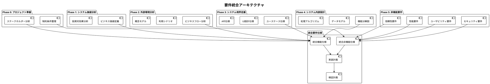
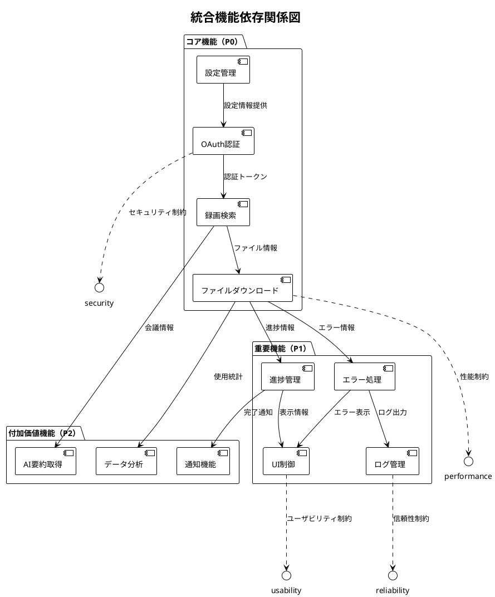
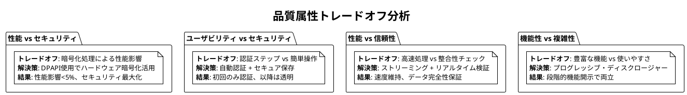
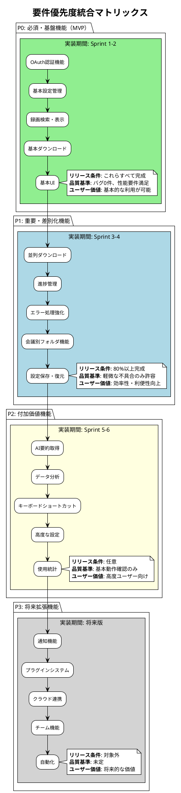
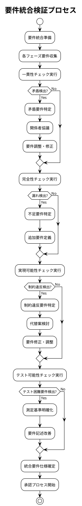

# 要件統合仕様書 - Zoom Video Mover

## 文書概要
**プロジェクト名**: Zoom Video Mover  
**作成日**: 2025-08-02  
  
**バージョン**: 1.0  

## 要件統合概要

### 統合の目的と範囲

#### 統合目的
1. **一貫性確保**: 各フェーズで定義された要件間の整合性を確保
2. **完全性検証**: すべてのステークホルダーニーズがカバーされていることを確認
3. **実現可能性評価**: 技術的・経済的実現可能性の総合評価
4. **優先度整理**: 全要件の優先度を統一的な基準で整理

#### 統合範囲
- Phase 0-5で定義されたすべての要件
- 機能要件と非機能要件の相互関係
- ステークホルダー要求と技術制約の整合性

### 要件統合アーキテクチャ



## 機能要件統合

### 統合機能要件マップ

| 機能カテゴリ | Phase2シナリオ | Phase3ユースケース | Phase4機能分解 | 優先度 | 複雑度 |
|------------|---------------|-------------------|----------------|--------|--------|
| **認証・設定管理** | US001, US002, US008 | UC001, UC002 | F1.1, F1.2, F1.3 | P0 | 中 |
| **録画検索・表示** | US001, US003, US006 | UC003, UC004 | F2.1, F2.2, F2.3 | P0 | 中 |
| **ファイルダウンロード** | US001, US004, US005 | UC005, UC006 | F3.1, F3.2, F3.3, F3.4 | P0 | 高 |
| **AI機能連携** | US007, US009 | UC008 | F4.1, F4.2, F4.3 | P2 | 低 |
| **ユーザーインターフェース** | 全シナリオ | 全ユースケース | F5.1, F5.2, F5.3, F5.4 | P1 | 中 |
| **システム管理** | US008, US009 | UC007, UC010 | F6.1, F6.2, F6.3, F6.4 | P1 | 低 |

### 機能間依存関係の統合



### 統合機能仕様

#### F-INT-001: 統合認証フロー
**統合元要件**: FR001 (OAuth認証), UC001, UC002, F1.1-F1.3  
**統合仕様**:
- OAuth 2.0 認証フローの完全実装
- 自動トークン更新機能
- セキュア保存（DPAPI使用）
- 認証エラー回復機能

**技術制約との整合性**:
- セキュリティ要件: AES-256-GCM暗号化対応
- 性能要件: 認証完了時間10秒以内
- ユーザビリティ要件: 5分以内での初期設定完了

#### F-INT-002: 統合ダウンロード機能
**統合元要件**: FR002-003, UC005, UC006, F3.1-F3.4  
**統合仕様**:
- 並列ダウンロード（最大5ファイル同時）
- リアルタイム進捗表示（500ms更新間隔）
- 中断・再開機能
- 自動エラー回復（最大3回リトライ）
- 会議別フォルダ整理機能

**技術制約との整合性**:
- 性能要件: 平均転送速度15MB/s以上
- 信頼性要件: データ整合性検証必須
- ユーザビリティ要件: 直感的な進捗表示

#### F-INT-003: 統合UI制御機能
**統合元要件**: FR004, 全ユースケース, F5.1-F5.4  
**統合仕様**:
- egui/eframe使用の統一GUI
- レスポンシブレイアウト（1024x768px最小）
- 多言語対応（日本語・英語）
- アクセシビリティ対応（WCAG 2.1 AA準拠）

**技術制約との整合性**:
- 性能要件: UI応答時間500ms以内
- ユーザビリティ要件: 学習時間最小化
- アクセシビリティ要件: 支援技術対応

## 非機能要件統合

### 統合品質属性マトリックス

| 品質属性 | 目標値 | 制約条件 | 測定方法 | 優先度 |
|----------|--------|----------|----------|--------|
| **性能** | | | | |
| - レスポンス時間 | UI: 500ms以内, API: 15s以内 | メモリ512MB以下 | 自動測定 | 高 |
| - スループット | 5並列DL, 15MB/s | CPU80%以下 | 負荷テスト | 高 |
| **信頼性** | | | | |
| - 可用性 | 95%以上 | 外部API依存 | 稼働率監視 | 高 |
| - 回復性 | 自動回復80% | 手動介入最小化 | 障害テスト | 中 |
| **セキュリティ** | | | | |
| - 認証 | OAuth 2.0準拠 | HTTPS必須 | セキュリティ監査 | 最高 |
| - データ保護 | AES-256暗号化 | DPAPI活用 | 暗号化テスト | 最高 |
| **ユーザビリティ** | | | | |
| - 学習性 | 初回10分以内 | 直感的操作 | ユーザーテスト | 高 |
| - 効率性 | 熟練者2分以内 | 最小ステップ数 | タスク分析 | 中 |

### 品質属性間のトレードオフ分析



## システム制約統合

### 技術制約の統合

| 制約カテゴリ | 制約内容 | 影響範囲 | 対応方針 |
|------------|----------|----------|----------|
| **プラットフォーム** | Windows 10/11専用 | UI, ファイルシステム | Windows API活用 |
| **言語・ランタイム** | Rust + tokio | 全システム | 型安全性、パフォーマンス重視 |
| **外部依存** | Zoom API制限 | API呼び出し | レート制限遵守、回復処理 |
| **リソース制限** | メモリ512MB以下 | 並列処理、キャッシュ | ストリーミング、効率化 |
| **GUI フレームワーク** | egui/eframe | UI設計全般 | ネイティブパフォーマンス |

### ビジネス制約の統合

| 制約カテゴリ | 制約内容 | 制約理由 | 対応方針 |
|------------|----------|----------|----------|
| **時間制約** | 3ヶ月開発期間 | 市場投入タイミング | アジャイル開発、MVP優先 |
| **予算制約** | 個人開発プロジェクト | リソース限定 | オープンソース活用 |
| **スキル制約** | Rust専門性 | 学習コスト | 段階的スキル獲得 |
| **法的制約** | Zoom利用規約遵守 | コンプライアンス | API適正利用 |

### 運用制約の統合

| 制約カテゴリ | 制約内容 | 制約理由 | 対応方針 |
|------------|----------|----------|----------|
| **保守性** | 単一開発者保守 | 人的リソース制限 | 高品質コード、文書化 |
| **サポート** | コミュニティサポート | 商用サポート不可 | 充実したドキュメント |
| **更新** | 手動更新配布 | 自動更新インフラなし | 軽量更新メカニズム |
| **互換性** | 後方互換性維持 | ユーザー継続利用 | 設定移行機能 |

## 要件優先度統合

### 統合優先度マトリックス



### 優先度決定基準

#### 定量的評価基準
```rust
/// 要件優先度計算システム
/// 
/// # 優先度算出要素
/// - ビジネス価値
/// - 技術的実現可能性
/// - ステークホルダー重要度
/// - 実装コスト
/// 
/// # 事前条件
/// - 各要件の評価データが準備済み
/// 
/// # 事後条件
/// - 統一的な優先度が算出される
/// 
/// # 不変条件
/// - 評価基準の一貫性が保たれる
pub struct RequirementPrioritizer {
    business_value_weights: ValueWeights,
    technical_feasibility_analyzer: Arc<FeasibilityAnalyzer>,
    stakeholder_importance_matrix: StakeholderMatrix,
}

impl RequirementPrioritizer {
    /// 統合優先度スコア計算
    pub fn calculate_integrated_priority_score(
        &self,
        requirement: &Requirement
    ) -> PriorityScore {
        // 1. ビジネス価値スコア (40%)
        let business_value_score = self.calculate_business_value_score(requirement);
        
        // 2. 技術実現可能性スコア (25%)
        let technical_feasibility_score = self.technical_feasibility_analyzer
            .analyze_feasibility(requirement);
        
        // 3. ステークホルダー重要度スコア (20%)
        let stakeholder_importance_score = self.stakeholder_importance_matrix
            .calculate_importance_score(requirement);
        
        // 4. 実装コスト効率スコア (15%)
        let cost_efficiency_score = self.calculate_cost_efficiency_score(requirement);
        
        // 5. 重み付き総合スコア算出
        let total_score = 
            business_value_score * 0.4 +
            technical_feasibility_score * 0.25 +
            stakeholder_importance_score * 0.20 +
            cost_efficiency_score * 0.15;
        
        // 6. 優先度ランク決定
        let priority_rank = match total_score {
            score if score >= 80.0 => PriorityRank::P0,
            score if score >= 65.0 => PriorityRank::P1,
            score if score >= 50.0 => PriorityRank::P2,
            _ => PriorityRank::P3,
        };
        
        PriorityScore {
            total_score,
            priority_rank,
            business_value_score,
            technical_feasibility_score,
            stakeholder_importance_score,
            cost_efficiency_score,
        }
    }
    
    /// ビジネス価値スコア計算
    fn calculate_business_value_score(&self, requirement: &Requirement) -> f64 {
        let mut score = 0.0;
        
        // ユーザー影響度 (30%)
        score += match requirement.user_impact {
            UserImpact::Critical => 30.0,    // 全ユーザーに必須
            UserImpact::High => 24.0,        // 大多数のユーザーに重要
            UserImpact::Medium => 18.0,      // 一部ユーザーに有用
            UserImpact::Low => 12.0,         // 限定的な価値
        };
        
        // 収益性への貢献 (25%)
        score += match requirement.revenue_impact {
            RevenueImpact::Direct => 25.0,   // 直接的な収益向上
            RevenueImpact::Indirect => 20.0, // 間接的な価値創造
            RevenueImpact::Cost_Saving => 15.0, // コスト削減
            RevenueImpact::None => 5.0,      // 収益性への影響なし
        };
        
        // 競合優位性 (25%)
        score += match requirement.competitive_advantage {
            CompetitiveAdvantage::Unique => 25.0,     // 独自機能
            CompetitiveAdvantage::Superior => 20.0,   // 競合より優秀
            CompetitiveAdvantage::Parity => 15.0,     // 競合と同等
            CompetitiveAdvantage::Basic => 10.0,      // 基本機能
        };
        
        // 戦略的重要度 (20%)
        score += match requirement.strategic_importance {
            StrategicImportance::Core => 20.0,        // コア機能
            StrategicImportance::Important => 15.0,   // 重要機能
            StrategicImportance::Supporting => 10.0,  // 支援機能
            StrategicImportance::Optional => 5.0,     // オプション機能
        };
        
        score
    }
}

/// 要件間依存関係分析
pub struct RequirementDependencyAnalyzer;

impl RequirementDependencyAnalyzer {
    /// 依存関係を考慮した実装順序最適化
    pub fn optimize_implementation_order(
        &self,
        requirements: Vec<Requirement>
    ) -> Vec<ImplementationPhase> {
        // 1. 依存関係グラフ構築
        let dependency_graph = self.build_dependency_graph(&requirements);
        
        // 2. トポロジカルソート実行
        let sorted_requirements = self.topological_sort(&dependency_graph);
        
        // 3. 実装フェーズ分割
        let implementation_phases = self.group_into_phases(sorted_requirements);
        
        implementation_phases
    }
    
    /// 循環依存検出
    pub fn detect_circular_dependencies(
        &self,
        requirements: &[Requirement]
    ) -> Vec<CircularDependency> {
        let mut circular_deps = Vec::new();
        let dependency_graph = self.build_dependency_graph(requirements);
        
        // DFS-based cycle detection
        let mut visited = HashSet::new();
        let mut recursion_stack = HashSet::new();
        
        for requirement in requirements {
            if !visited.contains(&requirement.id) {
                if let Some(cycle) = self.dfs_cycle_detection(
                    &requirement.id,
                    &dependency_graph,
                    &mut visited,
                    &mut recursion_stack
                ) {
                    circular_deps.push(cycle);
                }
            }
        }
        
        circular_deps
    }
}
```

## 要件整合性検証

### 整合性チェックマトリックス

| 検証観点 | 検証項目 | 検証方法 | 合格基準 |
|----------|----------|----------|----------|
| **要件間一貫性** | 矛盾の有無 | マトリックス分析 | 矛盾0件 |
| **完全性** | 要求カバレッジ | トレーサビリティ | 100%カバー |
| **実現可能性** | 技術的制約適合 | 制約チェック | 制約違反0件 |
| **テスト可能性** | 検証基準明確性 | テスト項目作成 | 全要件テスト可能 |

### 統合検証プロセス



---

**承認**:  
**品質基準適合**: [ ] 確認済  
**ポリシー準拠**: [ ] 確認済  
**承認日**: ___________