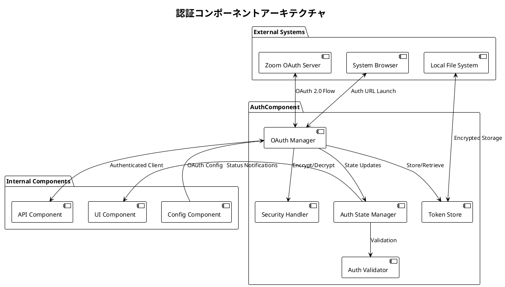

# 認証コンポーネント基本設計 - アーキテクチャ設計

## 文書概要
**文書ID**: ARCH-AUTH-001  
**コンポーネント名**: 認証コンポーネント（AuthComponent）  
**作成日**: 2025-08-03  
**作成者**: 認証アーキテクト  
**レビューア**: システムアーキテクト  
**バージョン**: 1.0  

## アーキテクチャ概要

### 設計目標
- **セキュリティファースト**: 認証情報の完全な保護
- **自動化**: トークンライフサイクルの自動管理
- **拡張性**: 将来的な認証方式拡張への対応
- **信頼性**: ネットワーク障害・エラーからの自動回復

### アーキテクチャ原則
1. **責任分離**: 認証・保存・暗号化の明確な分離
2. **非同期処理**: ブロッキングしない認証処理
3. **暗号化徹底**: 全機密情報の暗号化保存
4. **状態管理**: 認証状態の集中管理・通知

## コンポーネントアーキテクチャ

### 全体構成図



### モジュール構成

#### 1. OAuth Manager
**責任**: OAuth 2.0認証フローの制御・実行

```rust
pub struct OAuthManager {
    client: reqwest::Client,
    config: Arc<OAuthConfig>,
    security_handler: Arc<dyn SecurityHandler>,
    token_store: Arc<dyn TokenStorage>,
    state_manager: Arc<AuthStateManager>,
}

impl OAuthManager {
    /// 初回認証実行
    pub async fn authenticate(&self) -> Result<AccessToken, AuthError>;
    
    /// トークン更新
    pub async fn refresh_token(&self, refresh_token: &str) -> Result<AccessToken, AuthError>;
    
    /// 認証URL生成
    pub fn generate_auth_url(&self) -> String;
    
    /// 認証コード処理
    pub async fn process_auth_code(&self, code: &str) -> Result<AccessToken, AuthError>;
}
```

#### 2. Token Store
**責任**: トークンの永続化・取得管理

```rust
pub struct TokenStore {
    storage_path: PathBuf,
    security_handler: Arc<dyn SecurityHandler>,
}

impl TokenStorage for TokenStore {
    /// 暗号化トークン保存
    async fn store_token(&self, token: &AccessToken) -> Result<(), StorageError>;
    
    /// 暗号化トークン取得
    async fn retrieve_token(&self) -> Result<Option<AccessToken>, StorageError>;
    
    /// トークン削除
    async fn delete_token(&self) -> Result<(), StorageError>;
    
    /// トークン存在確認
    async fn token_exists(&self) -> bool;
}
```

#### 3. Security Handler
**責任**: 暗号化・復号化・セキュリティ処理

```rust
pub struct SecurityHandler {
    encryption_key: Arc<EncryptionKey>,
    algorithm: EncryptionAlgorithm, // AES-256-GCM
}

impl SecurityHandler {
    /// データ暗号化
    pub fn encrypt(&self, data: &[u8]) -> Result<Vec<u8>, SecurityError>;
    
    /// データ復号化
    pub fn decrypt(&self, encrypted_data: &[u8]) -> Result<Vec<u8>, SecurityError>;
    
    /// 暗号化キー生成
    pub fn generate_key() -> EncryptionKey;
    
    /// 暗号化キー保存
    pub fn store_key(&self, key: &EncryptionKey) -> Result<(), SecurityError>;
}
```

#### 4. Auth State Manager
**責任**: 認証状態の管理・通知

```rust
pub struct AuthStateManager {
    current_state: Arc<Mutex<AuthState>>,
    observers: Vec<Arc<dyn AuthStateObserver>>,
}

impl AuthStateManager {
    /// 認証状態更新
    pub fn update_state(&self, new_state: AuthState);
    
    /// 現在状態取得
    pub fn get_current_state(&self) -> AuthState;
    
    /// 状態監視者登録
    pub fn add_observer(&mut self, observer: Arc<dyn AuthStateObserver>);
    
    /// 状態変更通知
    fn notify_observers(&self, state: &AuthState);
}

#[derive(Debug, Clone)]
pub enum AuthState {
    NotAuthenticated,
    Authenticating,
    Authenticated { expires_at: DateTime<Utc> },
    TokenExpired,
    AuthenticationFailed { error: AuthError },
}
```

#### 5. Auth Validator
**責任**: 認証状態・トークンの検証

```rust
pub struct AuthValidator {
    client: reqwest::Client,
}

impl AuthValidator {
    /// トークン有効性検証
    pub async fn validate_token(&self, token: &AccessToken) -> bool;
    
    /// トークン期限確認
    pub fn is_token_expired(&self, token: &AccessToken) -> bool;
    
    /// トークン更新必要性判定
    pub fn needs_refresh(&self, token: &AccessToken) -> bool;
    
    /// 認証設定検証
    pub fn validate_config(&self, config: &OAuthConfig) -> Result<(), ValidationError>;
}
```

## データフロー設計

### 初回認証フロー

```
1. OAuth Manager → System Browser: 認証URL起動
2. User → Zoom OAuth Server: 認証・承認
3. Zoom OAuth Server → OAuth Manager: 認証コード
4. OAuth Manager → Zoom OAuth Server: トークン要求
5. Zoom OAuth Server → OAuth Manager: アクセストークン・リフレッシュトークン
6. OAuth Manager → Security Handler: トークン暗号化
7. Security Handler → Token Store: 暗号化トークン保存
8. OAuth Manager → Auth State Manager: 認証完了状態更新
9. Auth State Manager → UI Component: 状態変更通知
```

### トークン更新フロー

```
1. Auth Validator → Token Store: 保存トークン取得
2. Token Store → Security Handler: 暗号化トークン復号化
3. Auth Validator → OAuth Manager: 更新必要性通知
4. OAuth Manager → Zoom OAuth Server: リフレッシュトークンで更新要求
5. Zoom OAuth Server → OAuth Manager: 新しいアクセストークン
6. OAuth Manager → Security Handler: 新トークン暗号化
7. Security Handler → Token Store: 暗号化トークン保存
8. OAuth Manager → Auth State Manager: 更新完了状態更新
```

## セキュリティアーキテクチャ

### 暗号化方式
- **アルゴリズム**: AES-256-GCM
- **キー管理**: ローカル環境生成・保存
- **対象データ**: Client Secret、アクセストークン、リフレッシュトークン

### 通信セキュリティ
- **プロトコル**: HTTPS（TLS 1.3以上）
- **証明書検証**: 厳格な証明書チェーン検証
- **タイムアウト**: 適切なタイムアウト設定

### データ保護
- **ローカル保存**: 暗号化ファイルのみ
- **メモリ保護**: 機密情報のゼロ化
- **ログ保護**: 機密情報の非出力

## エラー処理アーキテクチャ

### エラー分類

```rust
#[derive(Debug, thiserror::Error)]
pub enum AuthError {
    #[error("OAuth configuration error: {0}")]
    ConfigurationError(String),
    
    #[error("Network error: {0}")]
    NetworkError(#[from] reqwest::Error),
    
    #[error("Token expired")]
    TokenExpired,
    
    #[error("Invalid token: {0}")]
    InvalidToken(String),
    
    #[error("Storage error: {0}")]
    StorageError(#[from] StorageError),
    
    #[error("Security error: {0}")]
    SecurityError(#[from] SecurityError),
    
    #[error("Validation error: {0}")]
    ValidationError(#[from] ValidationError),
}
```

### エラー処理戦略
1. **自動リトライ**: ネットワークエラーの自動再試行（最大3回）
2. **エラー通知**: 適切な分類でのエラー通知
3. **状態回復**: エラーからの自動状態回復
4. **ログ記録**: 詳細なエラー情報記録（機密情報除く）

## 性能設計

### 非同期処理
- **全操作非同期**: ブロッキング操作なし
- **タイムアウト設定**: 適切なタイムアウト値
- **並行制御**: 複数認証リクエストの制御

### キャッシュ戦略
- **トークンキャッシュ**: メモリ内一時保存
- **設定キャッシュ**: OAuth設定の一時保存
- **状態キャッシュ**: 認証状態の高速アクセス

### リソース管理
- **接続プール**: HTTP接続の再利用
- **メモリ効率**: 不要データの適切な解放
- **ファイルハンドル**: 適切なファイル操作

## テスト戦略

### 単体テスト
- **モジュール独立**: 各モジュールの独立テスト
- **モック使用**: 外部依存のモック化
- **エラーケース**: 全エラーパターンのテスト

### 統合テスト
- **OAuth フロー**: 実際のOAuthサーバーとの統合
- **暗号化統合**: 暗号化・復号化の統合テスト
- **状態遷移**: 認証状態遷移の統合テスト

### Property-basedテスト
- **暗号化可逆性**: encrypt → decrypt の恒等性
- **状態一貫性**: 状態遷移の一貫性
- **データ整合性**: 保存・取得データの整合性

## 運用考慮事項

### ログ・監視
- **操作ログ**: 認証操作の記録（機密情報除く）
- **エラーログ**: 詳細なエラー情報
- **メトリクス**: 認証成功率・レスポンス時間

### 保守性
- **設定変更**: OAuth設定の動的変更対応
- **バージョン管理**: トークン形式のバージョン管理
- **移行対応**: 認証方式変更時の移行機能

---

**承認**:  
認証アーキテクト: [ ] 承認  
システムアーキテクト: [ ] 承認  
**承認日**: ___________