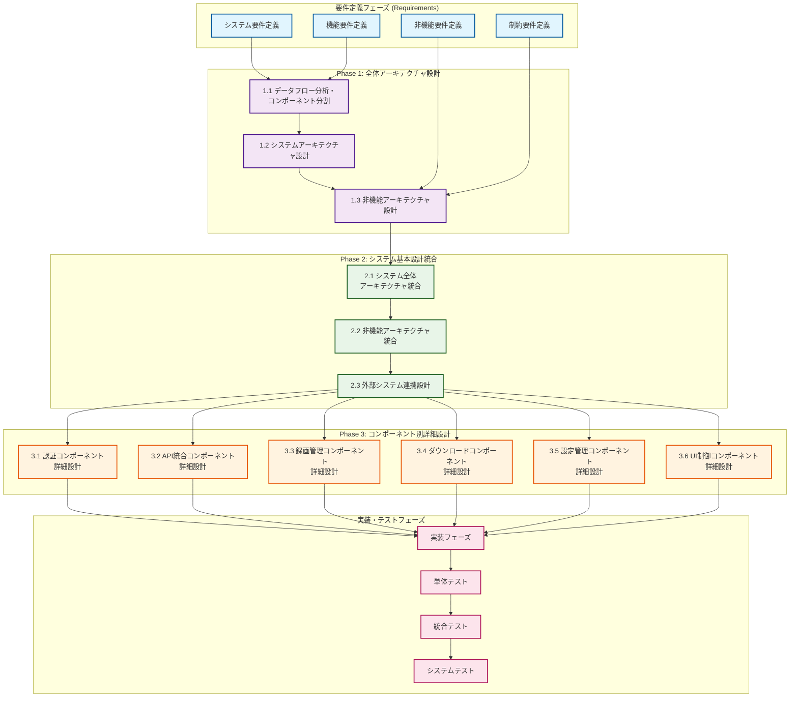
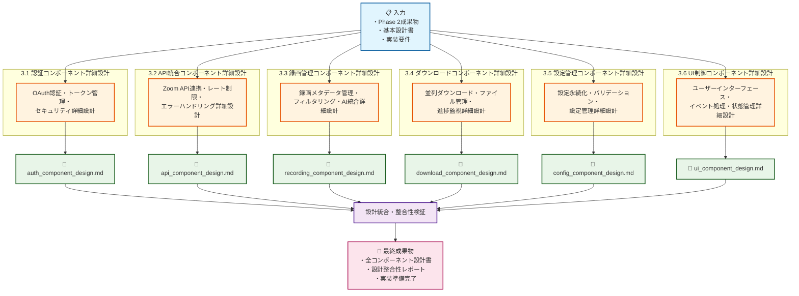
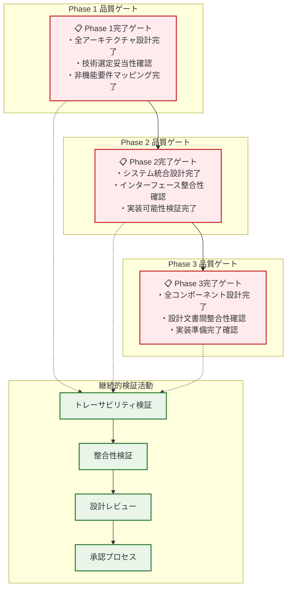
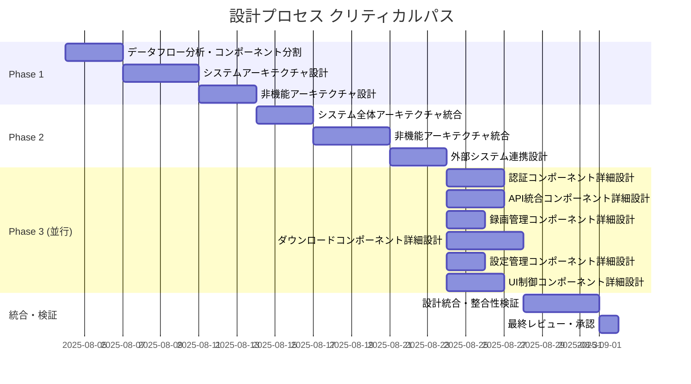

# 設計プロセスフロー図（PFD） - Zoom Video Mover

## 概要

**目的**: 設計プロセスと成果物の対応関係を可視化  
**対象**: V字モデルに基づく設計プロセス全体  
**更新頻度**: 設計プロセス変更時  
**活用用途**: プロセス管理・品質保証・進捗管理・新規メンバー教育  

## 全体設計プロセスフロー図

### 1. V字モデル対応設計プロセス全体図

## Phase別詳細プロセスフロー

### 2. Phase 1: 全体アーキテクチャ設計フロー

```mermaid
graph TD
    %% 入力
    INPUT_P1[📋 入力<br/>・システム要件<br/>・非機能要件<br/>・制約条件]
    
    %% Phase 1.1
    subgraph "1.1 データフロー分析・コンポーネント分割"
        P1_1_ACT1[データフロー概念モデル分析]
        P1_1_ACT2[コンポーネント境界特定]
        P1_1_ACT3[コンポーネント責任定義]
        P1_1_ACT4[コンポーネント間関係設計]
        
        P1_1_ACT1 --> P1_1_ACT2
        P1_1_ACT2 --> P1_1_ACT3
        P1_1_ACT3 --> P1_1_ACT4
    end
    
    %% Phase 1.1 成果物
    P1_1_OUT[📄 成果物<br/>・コンポーネント分割図<br/>・コンポーネント責任定義書<br/>・コンポーネント間関係図<br/>・データフロー図]
    
    %% Phase 1.2
    subgraph "1.2 システムアーキテクチャ設計"
        P1_2_ACT1[レイヤードアーキテクチャ適用]
        P1_2_ACT2[技術スタック選定]
        P1_2_ACT3[デプロイメントアーキテクチャ設計]
        P1_2_ACT4[セキュリティアーキテクチャ設計]
        
        P1_2_ACT1 --> P1_2_ACT2
        P1_2_ACT2 --> P1_2_ACT3
        P1_2_ACT3 --> P1_2_ACT4
    end
    
    %% Phase 1.2 成果物
    P1_2_OUT[📄 成果物<br/>・システムアーキテクチャ図<br/>・技術スタック選定書<br/>・デプロイメント設計書<br/>・セキュリティ設計書]
    
    %% Phase 1.3
    subgraph "1.3 非機能アーキテクチャ設計"
        P1_3_ACT1[性能アーキテクチャ設計]
        P1_3_ACT2[信頼性アーキテクチャ設計]
        P1_3_ACT3[セキュリティアーキテクチャ詳細]
        P1_3_ACT4[運用アーキテクチャ設計]
        
        P1_3_ACT1 --> P1_3_ACT2
        P1_3_ACT2 --> P1_3_ACT3
        P1_3_ACT3 --> P1_3_ACT4
    end
    
    %% Phase 1.3 成果物
    P1_3_OUT[📄 成果物<br/>・性能設計書<br/>・信頼性設計書<br/>・セキュリティ設計書<br/>・運用設計書]
    
    %% 流れ
    INPUT_P1 --> P1_1_ACT1
    P1_1_ACT4 --> P1_1_OUT
    P1_1_OUT --> P1_2_ACT1
    P1_2_ACT4 --> P1_2_OUT
    P1_2_OUT --> P1_3_ACT1
    P1_3_ACT4 --> P1_3_OUT
    
    %% スタイル
    classDef inputClass fill:#e1f5fe,stroke:#01579b,stroke-width:2px
    classDef outputClass fill:#e8f5e8,stroke:#1b5e20,stroke-width:2px
    classDef activityClass fill:#fff3e0,stroke:#e65100,stroke-width:2px
    
    class INPUT_P1 inputClass
    class P1_1_OUT,P1_2_OUT,P1_3_OUT outputClass
    class P1_1_ACT1,P1_1_ACT2,P1_1_ACT3,P1_1_ACT4,P1_2_ACT1,P1_2_ACT2,P1_2_ACT3,P1_2_ACT4,P1_3_ACT1,P1_3_ACT2,P1_3_ACT3,P1_3_ACT4 activityClass
```

### 3. Phase 2: システム基本設計統合フロー

```mermaid
graph TD
    %% 入力
    INPUT_P2[📋 入力<br/>・Phase 1成果物<br/>・コンポーネント分割結果<br/>・非機能要件]
    
    %% Phase 2.1
    subgraph "2.1 システム全体アーキテクチャ統合"
        P2_1_ACT1[システム全体構成設計]
        P2_1_ACT2[レイヤー間関係定義]
        P2_1_ACT3[技術統合方針策定]
        
        P2_1_ACT1 --> P2_1_ACT2
        P2_1_ACT2 --> P2_1_ACT3
    end
    
    %% Phase 2.1 成果物
    P2_1_OUT[📄 成果物<br/>system_architecture.md<br/>・システム全体アーキテクチャ<br/>・コンポーネント統合構成<br/>・技術スタック統一]
    
    %% Phase 2.2
    subgraph "2.2 非機能アーキテクチャ統合"
        P2_2_ACT1[性能設計統合]
        P2_2_ACT2[セキュリティ設計統合]
        P2_2_ACT3[エラー処理設計統合]
        
        P2_2_ACT1 --> P2_2_ACT2
        P2_2_ACT2 --> P2_2_ACT3
    end
    
    %% Phase 2.2 成果物
    P2_2_OUT[📄 成果物<br/>・performance_design.md<br/>・security_design.md<br/>・error_handling_design.md]
    
    %% Phase 2.3
    subgraph "2.3 外部システム連携設計"
        P2_3_ACT1[インターフェース設計]
        P2_3_ACT2[データモデル設計]
        P2_3_ACT3[通信プロトコル設計]
        
        P2_3_ACT1 --> P2_3_ACT2
        P2_3_ACT2 --> P2_3_ACT3
    end
    
    %% Phase 2.3 成果物
    P2_3_OUT[📄 成果物<br/>・interface_design.md<br/>・data_model_design.md]
    
    %% 流れ
    INPUT_P2 --> P2_1_ACT1
    P2_1_ACT3 --> P2_1_OUT
    P2_1_OUT --> P2_2_ACT1
    P2_2_ACT3 --> P2_2_OUT
    P2_2_OUT --> P2_3_ACT1
    P2_3_ACT3 --> P2_3_OUT
    
    %% スタイル
    classDef inputClass fill:#e1f5fe,stroke:#01579b,stroke-width:2px
    classDef outputClass fill:#e8f5e8,stroke:#1b5e20,stroke-width:2px
    classDef activityClass fill:#fff3e0,stroke:#e65100,stroke-width:2px
    
    class INPUT_P2 inputClass
    class P2_1_OUT,P2_2_OUT,P2_3_OUT outputClass
    class P2_1_ACT1,P2_1_ACT2,P2_1_ACT3,P2_2_ACT1,P2_2_ACT2,P2_2_ACT3,P2_3_ACT1,P2_3_ACT2,P2_3_ACT3 activityClass
```

### 4. Phase 3: コンポーネント別詳細設計フロー

## プロセス・成果物対応マトリックス

### 5. 詳細対応関係テーブル

| Phase | プロセス | 主要活動 | 入力成果物 | 出力成果物 | ファイル名 | 工数目安 |
|-------|----------|----------|------------|------------|------------|----------|
| **P1.1** | データフロー分析・コンポーネント分割 | ・データフロー分析 ・境界特定 ・責任定義 | ・システム要件 ・機能要件 | ・コンポーネント分割図 ・責任定義書 ・関係図 ・データフロー図 | (理論成果物) | 2-3日 |
| **P1.2** | システムアーキテクチャ設計 | ・レイヤード適用 ・技術選定 ・デプロイ設計 | ・P1.1成果物 ・非機能要件 | ・システムアーキテクチャ図 ・技術選定書 ・デプロイ設計書 | (理論成果物) | 3-4日 |
| **P1.3** | 非機能アーキテクチャ設計 | ・性能設計 ・信頼性設計 ・運用設計 | ・P1.2成果物 ・技術制約 | ・性能設計書 ・信頼性設計書 ・運用設計書 | (理論成果物) | 2-3日 |
| **P2.1** | システム全体アーキテクチャ統合 | ・全体構成統合 ・レイヤー統合 ・技術統合 | ・P1全成果物 | ・システム全体設計書 | `system_architecture.md` | 2-3日 |
| **P2.2** | 非機能アーキテクチャ統合 | ・性能統合 ・セキュリティ統合 ・エラー処理統合 | ・P2.1成果物 ・非機能要件 | ・性能設計書 ・セキュリティ設計書 ・エラー処理設計書 | `performance_design.md` `security_design.md` `error_handling_design.md` | 3-4日 |
| **P2.3** | 外部システム連携設計 | ・IF設計 ・データモデル設計 ・通信設計 | ・P2.2成果物 | ・インターフェース設計書 ・データモデル設計書 | `interface_design.md` `data_model_design.md` | 2-3日 |
| **P3.1** | 認証コンポーネント詳細設計 | ・OAuth詳細 ・トークン管理 ・セキュリティ詳細 | ・P2全成果物 | ・認証コンポーネント設計書 | `auth_component_design.md` | 2-3日 |
| **P3.2** | API統合コンポーネント詳細設計 | ・API連携詳細 ・レート制限 ・エラー処理 | ・P2全成果物 | ・API統合コンポーネント設計書 | `api_component_design.md` | 2-3日 |
| **P3.3** | 録画管理コンポーネント詳細設計 | ・メタデータ管理 ・フィルタリング ・AI統合 | ・P2全成果物 | ・録画管理コンポーネント設計書 | `recording_component_design.md` | 2日 |
| **P3.4** | ダウンロードコンポーネント詳細設計 | ・並列ダウンロード ・ファイル管理 ・進捗監視 | ・P2全成果物 | ・ダウンロードコンポーネント設計書 | `download_component_design.md` | 3-4日 |
| **P3.5** | 設定管理コンポーネント詳細設計 | ・永続化設計 ・バリデーション ・設定管理 | ・P2全成果物 | ・設定管理コンポーネント設計書 | `config_component_design.md` | 1-2日 |
| **P3.6** | UI制御コンポーネント詳細設計 | ・UI設計 ・イベント処理 ・状態管理 | ・P2全成果物 | ・UI制御コンポーネント設計書 | `ui_component_design.md` | 2-3日 |

### 6. 品質ゲート・検証ポイント

## 工数・スケジュール管理

### 7. Phase別工数見積もり

| Phase | 期間 | 担当者 | 並行度 | 主要成果物数 | 工数（人日） |
|-------|------|--------|--------|--------------|-------------|
| **Phase 1** | 1-2週間 | システムアーキテクト | 順次実行 | 理論成果物12個 | 7-10人日 |
| **Phase 2** | 1-2週間 | システムアーキテクト + 専門家 | 一部並行 | 統合成果物6個 | 9-13人日 |
| **Phase 3** | 2-3週間 | コンポーネント設計者6名 | 完全並行 | コンポーネント設計書6個 | 12-17人日 |
| **統合・検証** | 3-5日 | 全体チーム | 協調作業 | 検証レポート | 3-5人日 |
| **総計** | **4-6週間** | **多職能チーム** | **段階的並行** | **統合成果物12個** | **31-45人日** |

### 8. クリティカルパス分析

### 9. リソース配分最適化

```mermaid
graph TD
    %% リソース定義
    subgraph "リソースプール"
        SA[システムアーキテクト]
        TL[技術リーダー]
        SE[セキュリティエンジニア]
        PE[性能エンジニア]
        AUTH_D[認証設計者]
        API_D[API設計者]
        DOM_D[ドメイン設計者]
        ENG_D[エンジン設計者]
        CFG_D[設定設計者]
        UI_D[UI設計者]
    end
    
    %% Phase別アサインメント
    subgraph "Phase 1 アサインメント"
        SA --> P1_WORK[全体アーキテクチャ設計]
        TL --> P1_WORK
        SE --> P1_SECURITY[セキュリティアーキテクチャ]
        PE --> P1_PERF[性能アーキテクチャ]
    end
    
    subgraph "Phase 2 アサインメント"
        SA --> P2_WORK[システム統合設計]
        TL --> P2_WORK
        SE --> P2_SECURITY[セキュリティ統合]
        PE --> P2_PERF[性能統合]
    end
    
    subgraph "Phase 3 アサインメント (並行)"
        AUTH_D --> P3_AUTH[認証コンポーネント]
        API_D --> P3_API[API統合コンポーネント]
        DOM_D --> P3_REC[録画管理コンポーネント]
        ENG_D --> P3_DL[ダウンロードコンポーネント]
        CFG_D --> P3_CFG[設定管理コンポーネント]
        UI_D --> P3_UI[UI制御コンポーネント]
    end
    
    %% スタイル
    classDef resourceClass fill:#e1f5fe,stroke:#01579b,stroke-width:2px
    classDef workClass fill:#fff3e0,stroke:#e65100,stroke-width:2px
    classDef specialClass fill:#f3e5f5,stroke:#4a148c,stroke-width:2px
    
    class SA,TL,SE,PE,AUTH_D,API_D,DOM_D,ENG_D,CFG_D,UI_D resourceClass
    class P1_WORK,P2_WORK workClass
    class P1_SECURITY,P1_PERF,P2_SECURITY,P2_PERF,P3_AUTH,P3_API,P3_REC,P3_DL,P3_CFG,P3_UI specialClass
```

## 継続的改善・最適化

### 10. プロセス改善ポイント

#### 効率化機会
- **Phase 1-2統合**: 理論設計と実装設計の統合による工数削減
- **並行度向上**: Phase 3でのより積極的な並行作業
- **テンプレート活用**: 設計文書テンプレートの標準化
- **自動化促進**: 整合性チェック・トレーサビリティ管理の自動化

#### 品質向上機会
- **早期検証**: Phase間での中間検証強化
- **レビュー最適化**: 設計レビューの効率化・品質向上
- **トレーサビリティ強化**: リアルタイム依存関係管理
- **Property-basedテスト統合**: 設計段階でのテスト戦略統合

---

**作成日**: 2025-08-03  
**管理責任者**: システムアーキテクト  
**次回更新**: プロセス変更時  
**活用目的**: プロセス管理・進捗監視・品質保証・教育研修