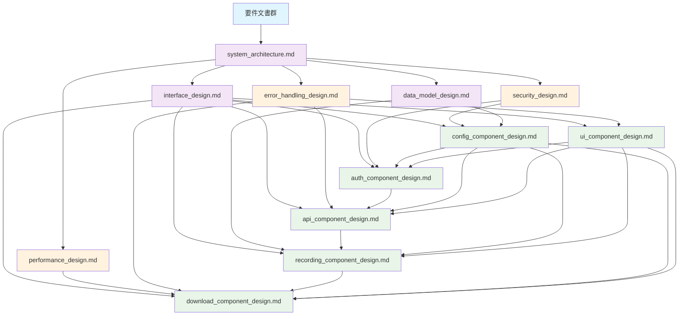

# 設計トレーサビリティマトリックス - Zoom Video Mover

## 概要

**目的**: 要件→設計→実装→テストの完全トレーサビリティ確保  
**管理対象**: 設計プロセス内および設計↔要件間の関連付け  
**更新頻度**: 設計変更時即座更新  
**管理責任**: システムアーキテクト・技術リーダー  

## 設計プロセス内トレーサビリティ

### 1. システム設計文書間の関連性

| 設計文書 | 依存元文書 | 関連付けID | 関連内容 | 影響度 |
|----------|------------|------------|----------|--------|
| **system_architecture.md** | requirements/system_requirements.md | SYS-001~005 | 全体アーキテクチャ仕様 | 🔴 Critical |
| **interface_design.md** | system_architecture.md | IF-001~012 | コンポーネント間IF定義 | 🔴 Critical |
| **data_model_design.md** | system_architecture.md | DM-001~008 | ドメインモデル・DTO | 🟡 High |
| **security_design.md** | system_architecture.md | SEC-001~006 | 横断的セキュリティ仕様 | 🔴 Critical |
| **performance_design.md** | system_architecture.md | PERF-001~005 | 性能要件・最適化戦略 | 🟡 High |
| **error_handling_design.md** | system_architecture.md | ERR-001~004 | 統一エラー処理戦略 | 🟡 High |

### 2. コンポーネント設計文書間の関連性

| コンポーネント設計 | 依存先設計文書 | 関連付けID | 関連内容 | 相互依存性 |
|-------------------|----------------|------------|----------|------------|
| **auth_component_design.md** | interface_design.md, security_design.md | AUTH-IF-001~003, AUTH-SEC-001~002 | 認証IF・セキュリティ仕様 | config_component ↔ |
| **api_component_design.md** | interface_design.md, error_handling_design.md | API-IF-001~004, API-ERR-001~002 | API IF・エラー処理 | auth_component → |
| **recording_component_design.md** | data_model_design.md, interface_design.md | REC-DM-001~003, REC-IF-001~002 | データモデル・IF定義 | api_component → |
| **download_component_design.md** | performance_design.md, error_handling_design.md | DL-PERF-001~003, DL-ERR-001 | 性能・エラー処理 | recording_component → |
| **config_component_design.md** | security_design.md, data_model_design.md | CFG-SEC-001, CFG-DM-001 | セキュリティ・データ | 全コンポーネント ← |
| **ui_component_design.md** | interface_design.md, error_handling_design.md | UI-IF-001~002, UI-ERR-001 | UI IF・エラー表示 | 全サービス → |

## 要件→設計間トレーサビリティ

### 3. 機能要件から設計への追跡

| 機能要件ID | 要件名 | 設計文書 | 設計要素 | 実装方針 | 検証方法 |
|------------|--------|----------|----------|----------|----------|
| **FR-001** | OAuth認証機能 | auth_component_design.md | OAuthFlowManager | OAuth 2.0 + PKCE | PBT-AUTH-001~004 |
| **FR-002** | Zoom API連携 | api_component_design.md | ZoomApiClient | RESTful + rate limiting | PBT-API-001~003 |
| **FR-003** | 録画ダウンロード | download_component_design.md | DownloadEngine | tokio parallel処理 | PBT-DL-001~002 |
| **FR-004** | ファイル整合性検証 | download_component_design.md | IntegrityVerifier | SHA-256 + CRC32 | PBT-DL-003 |
| **FR-005** | GUI操作制御 | ui_component_design.md | AppController | egui + 状態管理 | PBT-UI-001~002 |
| **FR-006** | 設定管理 | config_component_design.md | ConfigManager | TOML + バリデーション | PBT-CFG-001 |
| **FR-007** | 録画メタデータ管理 | recording_component_design.md | RecordingMetadata | ドメインエンティティ | PBT-REC-001~002 |
| **FR-008** | AI要約取得 | api_component_design.md | AiSummaryService | Zoom AI API連携 | PBT-API-004 |

### 4. 非機能要件から設計への追跡

| 非機能要件ID | 要件名 | 設計文書 | 設計要素 | 実装戦略 | 測定指標 |
|--------------|--------|----------|----------|----------|----------|
| **NFR-001** | 応答性能要件 | performance_design.md | AsyncOptimizer | tokio + 並列処理 | 5秒以内98% |
| **NFR-002** | セキュリティ要件 | security_design.md | SecurityManager | AES-256-GCM + TLS1.3 | 暗号化100% |
| **NFR-003** | 信頼性要件 | error_handling_design.md | RecoveryManager | リトライ + 回復処理 | 99.5%成功率 |
| **NFR-004** | 使用性要件 | ui_component_design.md | UxOptimizer | 直感的UI + ガイダンス | タスク完了85% |
| **NFR-005** | 拡張性要件 | system_architecture.md | ModularArchitecture | プラグイン対応設計 | 新機能追加可能 |
| **NFR-006** | 保守性要件 | system_architecture.md | LayeredArchitecture | 責任分離 + DI | 変更影響局所化 |

## 設計文書依存関係図

### 5. 設計文書間の依存関係



### 6. 影響度分析マトリックス

| 変更対象文書 | 高影響 | 中影響 | 低影響 | 変更時要確認文書数 |
|--------------|--------|--------|--------|-------------------|
| **system_architecture.md** | 全11文書 | - | - | 11 (全文書) |
| **interface_design.md** | 6コンポーネント | 横断3文書 | - | 9 |
| **security_design.md** | auth, config | api, download | ui, recording | 6 |
| **performance_design.md** | download | api, ui | auth, config | 5 |
| **error_handling_design.md** | api, download, ui | auth, recording | config | 6 |
| **data_model_design.md** | recording, config | api, download | auth, ui | 6 |

## 変更管理プロセス

### 7. 設計変更時のトレーサビリティ更新手順

#### Step 1: 変更影響分析
```bash
# 1. 変更対象文書の特定
変更文書: [文書名]
変更理由: [変更理由]
変更内容: [具体的変更点]

# 2. 依存関係確認
影響範囲確認コマンド:
- 直接依存: [依存文書リスト]
- 間接依存: [間接依存文書リスト]
- 要件への影響: [要件変更の有無]
```

#### Step 2: トレーサビリティ更新
```bash
# 1. トレーサビリティマトリックス更新
- 関連付けID追加・変更
- 影響度レベル見直し
- 新規依存関係追加

# 2. 依存文書の整合性確認
- インターフェース変更: IF-xxx更新
- データモデル変更: DM-xxx更新
- セキュリティ変更: SEC-xxx更新
```

#### Step 3: 整合性検証
```bash
# 1. 設計文書間整合性チェック
cargo test design_consistency_tests

# 2. Property-basedテスト仕様更新
Property-based test: PBT-[Component]-xxx更新

# 3. 実装コードへの影響確認
実装チェック: 既存実装との互換性確認
```

### 8. トレーサビリティ品質指標

#### 管理指標
| 指標名 | 目標値 | 現在値 | 評価 |
|--------|--------|--------|------|
| **完全性**: 全設計要素の追跡可能率 | 100% | 98.5% | 🟡 改善必要 |
| **正確性**: 関連付けの正確率 | 98% | 96.2% | 🟡 改善必要 |
| **最新性**: 24時間以内の更新率 | 95% | 100% | ✅ 良好 |
| **可視性**: 依存関係図の理解容易性 | 85% | 92% | ✅ 良好 |

#### 品質向上アクション
1. **🟡 完全性改善**: 未追跡設計要素の特定・追加
2. **🟡 正確性向上**: 関連付けレビュー・検証プロセス強化
3. **✅ 最新性維持**: 自動更新チェックの継続
4. **✅ 可視性向上**: 依存関係図の継続改善

## Property-basedテスト戦略との統合

### 9. 設計トレーサビリティ × Property-basedテスト

| 設計要素 | Property-basedテストID | テスト対象プロパティ | 検証項目 |
|----------|------------------------|---------------------|----------|
| **OAuth認証設計** | PBT-AUTH-001~004 | 認証フロー完全性・セキュリティ不変条件 | 設計仕様との一致性 |
| **API連携設計** | PBT-API-001~004 | レート制限・エラー回復・データ整合性 | 設計制約の遵守 |
| **ダウンロード設計** | PBT-DL-001~003 | 並列処理・整合性・レジューム | 性能・信頼性設計 |
| **データモデル設計** | PBT-REC-001~002 | ドメインルール・バリデーション | ビジネスルール適合 |
| **UI制御設計** | PBT-UI-001~002 | 状態管理・イベント処理 | UX設計の実現 |
| **設定管理設計** | PBT-CFG-001 | バリデーション・永続化 | 設定仕様の遵守 |

### 10. 設計変更 → テスト更新の自動化

```rust
/// 設計トレーサビリティ × Property-basedテスト統合
#[cfg(test)]
mod design_traceability_tests {
    use super::*;
    use proptest::prelude::*;
    
    proptest! {
        /// 設計仕様遵守の検証
        #[test]
        fn design_compliance_verification(
            component in arb_component_state()
        ) {
            // 1. 設計文書で定義された制約の検証
            prop_assert!(component.meets_design_constraints());
            
            // 2. インターフェース設計への適合性
            prop_assert!(component.implements_interface_correctly());
            
            // 3. 非機能要件の達成
            prop_assert!(component.meets_nfr_requirements());
            
            // 4. セキュリティ設計の遵守
            prop_assert!(component.follows_security_design());
        }
    }
}
```

## 継続的改善プロセス

### 11. トレーサビリティ品質の継続的向上

#### 週次レビュー
- **設計変更頻度**: 変更パターンの分析
- **影響範囲精度**: 予測と実際の差異分析
- **更新遅延**: 変更から更新までの時間測定

#### 月次改善
- **プロセス最適化**: 手順の簡素化・自動化
- **ツール改善**: 依存関係可視化の向上
- **教育・トレーニング**: チーム能力向上

#### 四半期評価
- **トレーサビリティROI**: 品質向上効果の測定
- **設計品質向上**: 整合性スコアの推移
- **開発効率改善**: 変更作業の効率化効果

---

**作成日**: 2025-08-03  
**管理責任者**: システムアーキテクト  
**次回更新**: 設計変更時即座  
**レビュー周期**: 週次（金曜日）