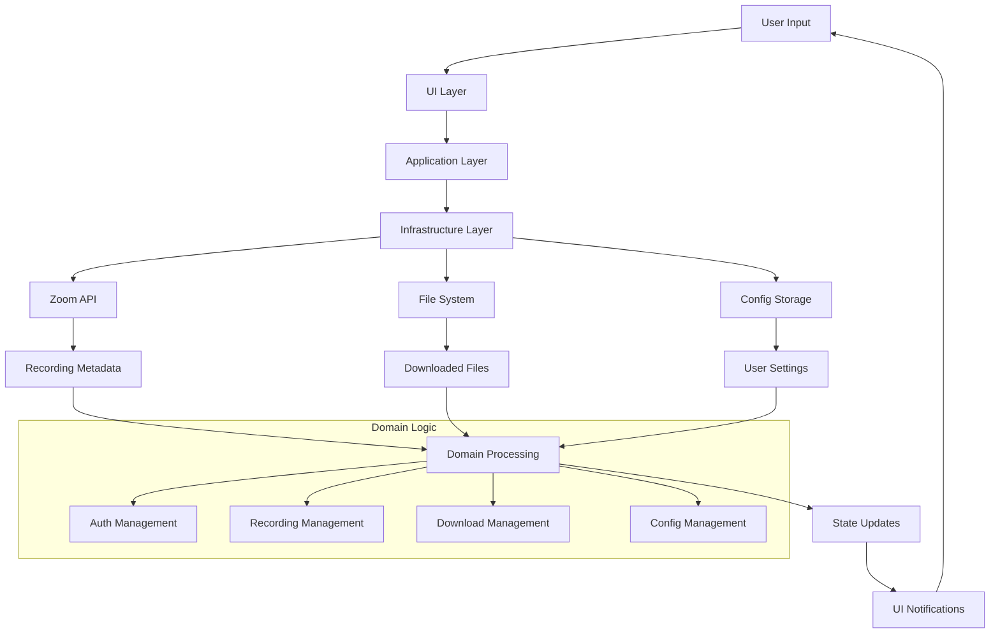

# システムアーキテクチャ設計書 - Zoom Video Mover

## 文書概要
**文書ID**: ARCH-SYS-001  
**プロジェクト名**: Zoom Video Mover  
**作成日**: 2025-08-03  
**作成者**: システムアーキテクト  
**レビューア**: 技術リーダー  
**バージョン**: 1.0  

## アーキテクチャ概要

### システム全体アーキテクチャ

#### レイヤードアーキテクチャ構成
```
┌─────────────────────────────────────────────────────────────────┐
│                    Presentation Layer                           │
│  ┌─────────────────┐  ┌─────────────────┐  ┌─────────────────┐  │
│  │   egui/eframe   │  │   Windows       │  │   Platform      │  │
│  │   GUI Control   │  │   Native APIs   │  │   Abstraction   │  │
│  │   Components    │  │   (File Dialog) │  │   Layer         │  │
│  └─────────────────┘  └─────────────────┘  └─────────────────┘  │
├─────────────────────────────────────────────────────────────────┤
│                   Application Layer                             │
│  ┌─────────────────┐  ┌─────────────────┐  ┌─────────────────┐  │
│  │   Core Domain   │  │   Workflow      │  │   Event/State   │  │
│  │   Business      │  │   Orchestrator  │  │   Management    │  │
│  │   Logic         │  │   Services      │  │   Hub           │  │
│  └─────────────────┘  └─────────────────┘  └─────────────────┘  │
├─────────────────────────────────────────────────────────────────┤
│                  Infrastructure Layer                           │
│  ┌─────────────┐ ┌─────────────┐ ┌─────────────┐ ┌─────────────┐ │
│  │   OAuth     │ │   HTTP      │ │   File      │ │   Config    │ │
│  │   Client    │ │   Client    │ │   System    │ │   Storage   │ │
│  │   (reqwest) │ │  (Zoom API) │ │   Manager   │ │   (TOML)    │ │
│  └─────────────┘ └─────────────┘ └─────────────┘ └─────────────┘ │
└─────────────────────────────────────────────────────────────────┘
```

### システム全体データフロー

#### 主要データフロー経路


## コンポーネントアーキテクチャ

### コンポーネント分割戦略

#### 1. データフローベース分割
**分割原則**: データの流れと変換責任に基づく
```
User Input → Auth → API → Recording → Download → File Storage
     ↓         ↓      ↓       ↓         ↓         ↓
   UI Control → OAuth → JSON → Metadata → Binary → Local Files
```

#### 2. 技術境界ベース分割
**分割原則**: 技術スタック・外部依存の境界に基づく
```
GUI (egui) | Business Logic (Rust) | External Systems (Zoom API, File System)
```

#### 3. 責任境界ベース分割
**分割原則**: 単一責任の原則に基づく
```
Authentication | API Integration | Data Management | Download Engine | UI Control | Configuration
```

### コンポーネント構成図

```
┌─────────────────────────────────────────────────────────────────┐
│                     UI Control Component                        │
│  ┌─────────────┐  ┌─────────────┐  ┌─────────────────────────┐  │
│  │   Main GUI  │  │ Config GUI  │  │   Progress/Status GUI   │  │
│  │  (Tabbed)   │  │  (Settings) │  │  (Real-time Updates)   │  │
│  └─────────────┘  └─────────────┘  └─────────────────────────┘  │
└─────────────────────────────────────────────────────────────────┘
           │                    │                           │
           ▼                    ▼                           ▼
┌─────────────────┐  ┌─────────────────┐  ┌─────────────────────────┐
│   Auth          │  │   Config        │  │   Recording             │
│   Component     │  │   Component     │  │   Component             │
│ ┌─────────────┐ │  │ ┌─────────────┐ │  │ ┌─────────────────────┐ │
│ │OAuth Client │ │  │ │TOML Manager │ │  │ │ Metadata Manager    │ │
│ │Token Store  │ │  │ │Validation   │ │  │ │ Filter Engine       │ │
│ │Crypto Utils │ │  │ │Backup       │ │  │ │ AI Summary Client   │ │
│ └─────────────┘ │  │ └─────────────┘ │  │ └─────────────────────┘ │
└─────────────────┘  └─────────────────┘  └─────────────────────────┘
           │                    │                           │
           ▼                    ▼                           ▼
┌─────────────────────────────────────────────────────────────────┐
│                    API Integration Component                     │
│  ┌─────────────┐  ┌─────────────────┐  ┌─────────────────────┐  │
│  │HTTP Client  │  │  Rate Limiter   │  │   Error Handler     │  │
│  │(reqwest)    │  │  (10req/sec)    │  │  (Retry Strategy)   │  │
│  └─────────────┘  └─────────────────┘  └─────────────────────┘  │
└─────────────────────────────────────────────────────────────────┘
           │
           ▼
┌─────────────────────────────────────────────────────────────────┐
│                 Download Execution Component                     │
│  ┌─────────────┐  ┌─────────────────┐  ┌─────────────────────┐  │
│  │ Parallel    │  │  Progress       │  │   File Manager      │  │
│  │ Download    │  │  Monitor        │  │  (Hash Verify)      │  │
│  │ Engine      │  │  (Real-time)    │  │  (Resume Support)   │  │
│  └─────────────┘  └─────────────────┘  └─────────────────────┘  │
└─────────────────────────────────────────────────────────────────┘
```

### コンポーネント責任マトリックス

| コンポーネント | 主要責任 | 副次責任 | 依存先 | 提供先 |
|---------------|----------|----------|---------|--------|
| **UI Control** | GUI表示・イベント処理・状態管理 | ユーザー体験・アクセシビリティ | All Components | User |
| **Auth** | OAuth認証・トークン管理・暗号化 | セキュリティ保証・認証状態管理 | Config, HTTP | API, UI |
| **API Integration** | Zoom API通信・レート制限・エラー処理 | API効率化・信頼性保証 | Auth | Recording |
| **Recording** | メタデータ管理・フィルタリング・AI統合 | データ品質保証・検索効率 | API, Config | Download, UI |
| **Download** | 並列ダウンロード・進捗監視・ファイル管理 | ダウンロード効率・完全性保証 | Recording, Config | UI, File System |
| **Config** | 設定管理・永続化・バリデーション | 設定品質保証・データ整合性 | File System | All Components |

## 技術アーキテクチャ

### 技術スタック詳細

#### コア技術スタック
```toml
[dependencies]
# GUI Framework
eframe = "0.22"           # Cross-platform GUI framework
egui = "0.22"            # Immediate mode GUI library

# Async Runtime
tokio = { version = "1.0", features = ["full"] }

# HTTP Client & OAuth
reqwest = { version = "0.11", features = ["json", "native-tls"] }
oauth2 = "4.0"           # OAuth 2.0 client implementation
url = "2.0"              # URL parsing and manipulation

# Serialization
serde = { version = "1.0", features = ["derive"] }
serde_json = "1.0"       # JSON serialization
toml = "0.7"             # TOML configuration format

# Cryptography
aes-gcm = "0.10"         # AES-GCM encryption
argon2 = "0.5"           # Password hashing
ring = "0.16"            # Cryptographic primitives

# Error Handling
thiserror = "1.0"        # Custom error types
anyhow = "1.0"           # Error context and chaining

# Logging
log = "0.4"              # Logging facade
env_logger = "0.10"      # Environment-based logger

# File System
walkdir = "2.0"          # Directory traversal
tempfile = "3.0"         # Temporary file management

# Windows Platform
[target.'cfg(windows)'.dependencies]
winapi = { version = "0.3", features = ["winuser", "shellapi", "commdlg"] }
windows = { version = "0.48", features = ["Win32_UI_Shell", "Win32_System_Console"] }
```

#### アーキテクチャパターン実装

##### 1. Repository Pattern (データアクセス抽象化)
```rust
/// データアクセスの抽象化
#[async_trait]
pub trait RecordingRepository {
    async fn get_recordings(&self, criteria: SearchCriteria) -> Result<Vec<Recording>>;
    async fn save_metadata(&self, recording: &Recording) -> Result<()>;
}

/// Zoom API実装
pub struct ZoomApiRepository {
    client: ApiClient,
    rate_limiter: RateLimiter,
}

/// ローカルキャッシュ実装  
pub struct LocalCacheRepository {
    cache_dir: PathBuf,
    serializer: JsonSerializer,
}
```

##### 2. Observer Pattern (状態通知)
```rust
/// 状態変更通知システム
pub trait StateObserver {
    fn on_auth_state_changed(&self, state: AuthState);
    fn on_download_progress(&self, progress: DownloadProgress);
    fn on_error_occurred(&self, error: AppError);
}

pub struct StateManager {
    observers: Vec<Box<dyn StateObserver>>,
    current_state: AppState,
}

impl StateManager {
    pub fn register_observer(&mut self, observer: Box<dyn StateObserver>) {
        self.observers.push(observer);
    }
    
    pub fn notify_auth_changed(&self, state: AuthState) {
        for observer in &self.observers {
            observer.on_auth_state_changed(state.clone());
        }
    }
}
```

##### 3. Command Pattern (操作抽象化)
```rust
/// 操作の抽象化とキューイング
#[async_trait]
pub trait Command {
    async fn execute(&self) -> Result<()>;
    async fn undo(&self) -> Result<()>;
    fn can_undo(&self) -> bool;
}

pub struct DownloadCommand {
    recording_id: String,
    output_path: PathBuf,
    downloader: Arc<DownloadEngine>,
}

pub struct CommandQueue {
    pending: VecDeque<Box<dyn Command>>,
    executing: Option<Box<dyn Command>>,
    completed: Vec<Box<dyn Command>>,
}
```

### 並行性・非同期アーキテクチャ

#### 非同期処理戦略
```rust
/// アプリケーション全体の非同期ランタイム設計
pub struct AsyncRuntime {
    /// メインUIスレッド（egui）
    ui_runtime: tokio::runtime::Handle,
    
    /// ネットワークI/O専用スレッドプール
    network_pool: tokio::runtime::Handle,
    
    /// ファイルI/O専用スレッドプール  
    file_pool: tokio::runtime::Handle,
    
    /// CPU集約的処理専用スレッドプール
    compute_pool: tokio::runtime::Handle,
}

/// 並列ダウンロード制御
pub struct ParallelDownloadController {
    /// 同時ダウンロード数制限
    semaphore: tokio::sync::Semaphore,
    
    /// 進捗集約チャンネル
    progress_tx: tokio::sync::broadcast::Sender<DownloadProgress>,
    
    /// キャンセレーショントークン
    cancel_token: tokio_util::sync::CancellationToken,
}
```

#### スレッドモデル
```
┌─────────────────┐    ┌─────────────────┐    ┌─────────────────┐
│   Main Thread   │    │  Network Pool   │    │   File Pool     │
│   (egui GUI)    │    │  (HTTP Client)  │    │ (File I/O)      │
│                 │    │                 │    │                 │
│ Event Loop      │◄──►│ API Requests    │◄──►│ File Operations │
│ State Updates   │    │ OAuth Flow      │    │ Download Write  │
│ UI Rendering    │    │ Rate Limiting   │    │ Config Save     │
└─────────────────┘    └─────────────────┘    └─────────────────┘
         │                       │                       │
         ▼                       ▼                       ▼
┌─────────────────┐    ┌─────────────────┐    ┌─────────────────┐
│  Compute Pool   │    │   Background    │    │   Error Pool    │
│ (CPU Intensive) │    │     Tasks       │    │ (Error Retry)   │
│                 │    │                 │    │                 │
│ Hash Calculation│    │ Periodic Sync   │    │ Retry Logic     │
│ Data Processing │    │ Cache Cleanup   │    │ Error Recovery  │
│ Compression     │    │ Health Check    │    │ Logging         │
└─────────────────┘    └─────────────────┘    └─────────────────┘
```

## セキュリティアーキテクチャ

### セキュリティレイヤー設計

#### 1. 認証・認可アーキテクチャ
```
┌─────────────────────────────────────────────────────────────────┐
│                   Security Architecture                         │
├─────────────────────────────────────────────────────────────────┤
│  Authentication Layer                                           │
│  ┌─────────────┐  ┌─────────────┐  ┌─────────────────────────┐  │
│  │   OAuth     │  │   Token     │  │     Credential          │  │
│  │  Client     │  │  Storage    │  │     Encryption          │  │
│  │  (PKCE)     │  │  (Secure)   │  │   (AES-256-GCM)         │  │
│  └─────────────┘  └─────────────┘  └─────────────────────────┘  │
├─────────────────────────────────────────────────────────────────┤
│  Transport Security Layer                                       │
│  ┌─────────────┐  ┌─────────────┐  ┌─────────────────────────┐  │
│  │    HTTPS    │  │ Certificate │  │      Request           │  │
│  │   (TLS 1.3) │  │ Validation  │  │    Signing             │  │
│  │  Mandatory  │  │   (Strict)  │  │   (HMAC-SHA256)        │  │
│  └─────────────┘  └─────────────┘  └─────────────────────────┘  │
├─────────────────────────────────────────────────────────────────┤
│  Data Protection Layer                                          │
│  ┌─────────────┐  ┌─────────────┐  ┌─────────────────────────┐  │
│  │  Local Data │  │    Memory   │  │        Log              │  │
│  │ Encryption  │  │ Protection  │  │    Sanitization         │  │
│  │(File-level) │  │(Secure Mem) │  │  (No Secrets)           │  │
│  └─────────────┘  └─────────────┘  └─────────────────────────┘  │
└─────────────────────────────────────────────────────────────────┘
```

#### 2. 暗号化戦略
```rust
/// セキュアストレージ実装
pub struct SecureStorage {
    /// ファイル暗号化キー (AES-256-GCM)
    encryption_key: Key,
    
    /// メモリ保護領域
    secure_memory: SecureMemory,
    
    /// 暗号化コンテキスト
    cipher: Aes256Gcm,
}

impl SecureStorage {
    /// トークンの暗号化保存
    pub fn store_token(&self, token: &AccessToken) -> Result<()> {
        // 1. ランダムnonce生成
        let nonce = Nonce::from_random();
        
        // 2. トークンシリアライゼーション
        let plaintext = serde_json::to_vec(token)?;
        
        // 3. AES-GCM暗号化
        let ciphertext = self.cipher.encrypt(&nonce, plaintext.as_ref())?;
        
        // 4. nonce + ciphertext の形式で保存
        let data = [nonce.as_slice(), &ciphertext].concat();
        self.write_encrypted_file(&data)?;
        
        // 5. メモリクリア
        secure_zero(&mut plaintext);
        
        Ok(())
    }
}
```

### 脅威モデル・対策

#### 識別された脅威と対策
| 脅威分類 | 具体的脅威 | 対策 | 実装方法 |
|----------|------------|------|----------|
| **認証情報漏洩** | アクセストークン盗取 | 暗号化保存・メモリ保護 | AES-256-GCM + SecureMemory |
| **通信傍受** | MITM攻撃・盗聴 | HTTPS強制・証明書検証 | TLS 1.3 + Certificate Pinning |
| **不正アクセス** | API乱用・レート超過 | レート制限・監視 | Token Bucket + Monitoring |
| **ファイル改ざん** | 設定ファイル書き換え | ファイル整合性検証 | HMAC-SHA256 チェックサム |
| **メモリ攻撃** | メモリダンプ・デバッガ | セキュアメモリ・ゼロ化 | Windows VirtualLock + Clear |
| **ログ漏洩** | 機密情報ログ出力 | ログサニタイゼーション | Redaction Filter |

## 性能アーキテクチャ

### 性能最適化戦略

#### 1. 非同期処理最適化
```rust
/// 高性能非同期ダウンロードエンジン
pub struct HighPerformanceDownloader {
    /// 並列度制御（CPU × 2）
    concurrency_limit: usize,
    
    /// チャンクサイズ最適化（1MB）
    chunk_size: usize,
    
    /// バッファプール（メモリ再利用）
    buffer_pool: ObjectPool<Vec<u8>>,
    
    /// 進捗集約バッチング（100ms間隔）
    progress_batcher: ProgressBatcher,
}

impl HighPerformanceDownloader {
    /// 最適化されたダウンロード実行
    pub async fn download_optimized(&self, urls: Vec<Url>) -> Result<()> {
        // 1. 並列度制限セマフォ
        let semaphore = Arc::new(Semaphore::new(self.concurrency_limit));
        
        // 2. 並列ダウンロードタスク生成
        let tasks: Vec<_> = urls.into_iter().map(|url| {
            let sem = semaphore.clone();
            let pool = self.buffer_pool.clone();
            
            tokio::spawn(async move {
                let _permit = sem.acquire().await?;
                self.download_single_optimized(url, pool).await
            })
        }).collect();
        
        // 3. 全タスク完了待機
        for task in tasks {
            task.await??;
        }
        
        Ok(())
    }
}
```

#### 2. メモリ管理最適化
```rust
/// メモリ効率最適化
pub struct MemoryOptimizedManager {
    /// オブジェクトプール（メモリ再利用）
    buffer_pool: ObjectPool<Vec<u8>>,
    
    /// ストリーミングバッファ（固定サイズ）
    streaming_buffers: ArrayQueue<Vec<u8>>,
    
    /// メモリ監視（使用量制限）
    memory_monitor: MemoryMonitor,
}

impl MemoryOptimizedManager {
    /// ストリーミングダウンロード（低メモリ使用）
    pub async fn stream_download(&self, url: Url, path: PathBuf) -> Result<()> {
        // 1. バッファをプールから取得
        let mut buffer = self.buffer_pool.get();
        
        // 2. ストリーミング読み書き
        let mut response = reqwest::get(url).await?.bytes_stream();
        let mut file = tokio::fs::File::create(path).await?;
        
        while let Some(chunk) = response.next().await {
            let chunk = chunk?;
            
            // 3. メモリ使用量監視
            self.memory_monitor.check_limits()?;
            
            // 4. 直接書き込み（メモリ蓄積なし）
            file.write_all(&chunk).await?;
        }
        
        // 5. バッファをプールに返却
        self.buffer_pool.return_buffer(buffer);
        
        Ok(())
    }
}
```

### 性能監視・プロファイリング

#### 性能メトリクス収集
```rust
/// 性能監視システム
pub struct PerformanceMonitor {
    /// CPU使用率監視
    cpu_monitor: CpuMonitor,
    
    /// メモリ使用量監視
    memory_monitor: MemoryMonitor,
    
    /// ネットワーク性能監視
    network_monitor: NetworkMonitor,
    
    /// ダウンロード性能監視
    download_monitor: DownloadMonitor,
}

#[derive(Debug, Serialize)]
pub struct PerformanceMetrics {
    /// CPU使用率 (%)
    cpu_usage: f64,
    
    /// メモリ使用量 (MB)
    memory_usage: u64,
    
    /// ダウンロード速度 (Mbps)
    download_speed: f64,
    
    /// 並列ダウンロード数
    active_downloads: usize,
    
    /// エラー率 (%)
    error_rate: f64,
    
    /// 平均応答時間 (ms)
    avg_response_time: u64,
}
```

## 運用アーキテクチャ

### ログ・監視システム

#### 構造化ログアーキテクチャ
```rust
/// 構造化ログシステム
pub struct StructuredLogger {
    /// ログレベルフィルタ
    level_filter: LevelFilter,
    
    /// ログ出力先設定
    appenders: Vec<Box<dyn LogAppender>>,
    
    /// ログサニタイザ（機密情報除去）
    sanitizer: LogSanitizer,
}

/// ログエントリ構造
#[derive(Debug, Serialize)]
pub struct LogEntry {
    /// タイムスタンプ (ISO 8601)
    timestamp: DateTime<Utc>,
    
    /// ログレベル
    level: LogLevel,
    
    /// コンポーネント名
    component: String,
    
    /// 操作種別
    operation: String,
    
    /// メッセージ
    message: String,
    
    /// 構造化フィールド
    #[serde(flatten)]
    fields: HashMap<String, Value>,
    
    /// トレースID（分散トレース用）
    trace_id: Option<String>,
}
```

### エラー処理・回復アーキテクチャ

#### 階層化エラー処理
```rust
/// 階層化エラー処理システム
#[derive(Debug, thiserror::Error)]
pub enum AppError {
    /// ネットワークエラー（回復可能）
    #[error("Network error: {source}")]
    Network {
        #[from]
        source: NetworkError,
        retry_count: usize,
        backoff_delay: Duration,
    },
    
    /// 認証エラー（再認証必要）
    #[error("Authentication error: {source}")]
    Authentication {
        #[from]
        source: AuthError,
        requires_reauth: bool,
    },
    
    /// ファイルシステムエラー（回復不可能）
    #[error("File system error: {source}")]
    FileSystem {
        #[from]
        source: std::io::Error,
        path: PathBuf,
    },
    
    /// 設定エラー（ユーザー介入必要）
    #[error("Configuration error: {message}")]
    Configuration {
        message: String,
        invalid_field: String,
        suggested_value: Option<String>,
    },
}

/// エラー回復戦略
pub struct ErrorRecoveryStrategy {
    /// リトライ戦略
    retry_strategies: HashMap<ErrorType, RetryStrategy>,
    
    /// 回復アクション
    recovery_actions: HashMap<ErrorType, RecoveryAction>,
    
    /// エスカレーション戦略
    escalation_rules: Vec<EscalationRule>,
}
```

## アーキテクチャ検証・テスト戦略

### アーキテクチャテスト
```rust
/// アーキテクチャ適合性テスト
#[cfg(test)]
mod architecture_tests {
    use super::*;
    
    #[test]
    fn test_layered_architecture_compliance() {
        // 1. プレゼンテーション層はアプリケーション層のみ依存
        assert_layer_dependency("presentation", &["application"]);
        
        // 2. アプリケーション層はインフラ層のみ依存
        assert_layer_dependency("application", &["infrastructure"]);
        
        // 3. インフラ層は外部依存のみ
        assert_layer_dependency("infrastructure", &["external"]);
        
        // 4. 循環依存がないことを確認
        assert_no_circular_dependencies();
    }
    
    #[test]
    fn test_component_isolation() {
        // 各コンポーネントの単一責任を確認
        for component in COMPONENTS {
            assert_single_responsibility(component);
            assert_high_cohesion(component);
            assert_loose_coupling(component);
        }
    }
}
```

## V字モデル対応・トレーサビリティ

### システムテスト対応
| アーキテクチャ要素 | 対応システムテスト | 検証観点 |
|-------------------|-------------------|----------|
| **レイヤード構造** | ST-ARCH-001 | 層分離・依存関係適合性 |
| **コンポーネント分割** | ST-COMP-001 | 責任分離・結合度 |
| **非同期処理** | ST-ASYNC-001 | 並行性・性能・デッドロック |
| **セキュリティ** | ST-SEC-001 | 暗号化・認証・通信保護 |
| **エラー処理** | ST-ERROR-001 | エラー伝播・回復・ログ |
| **性能** | ST-PERF-001 | スループット・レスポンス・リソース |

### 要件トレーサビリティ
| システム要件 | アーキテクチャ設計 | 実装方針 |
|--------------|-------------------|----------|
| **FR001: OAuth認証** | Auth Component + OAuth Client | rust-oauth2 + secure storage |
| **FR002: API連携** | API Integration + Rate Limiter | reqwest + semaphore |
| **FR003: ダウンロード** | Download Engine + Parallel Control | tokio + async streams |
| **FR004: ファイル管理** | File Manager + Integrity Check | std::fs + hash verification |
| **FR005: GUI操作** | UI Controller + Event System | egui + observer pattern |
| **NFR001: 性能** | Async Architecture + Optimization | tokio + buffer pooling |
| **NFR002: セキュリティ** | Security Layers + Encryption | AES-GCM + TLS 1.3 |
| **NFR003: 信頼性** | Error Recovery + Monitoring | structured error + retry |

---

**承認**:  
システムアーキテクト: [ ] 承認  
技術リーダー: [ ] 承認  
**承認日**: ___________