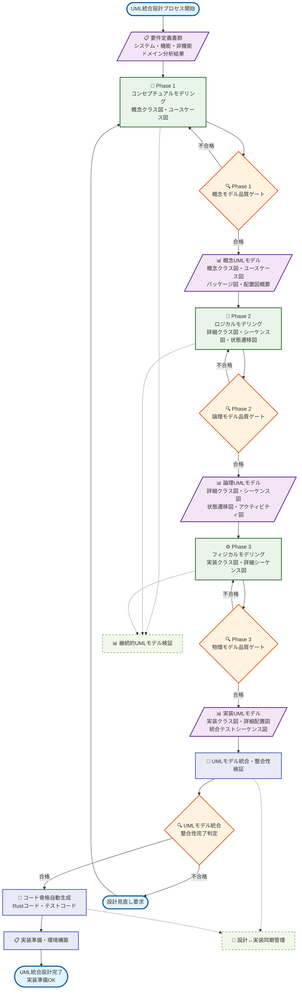
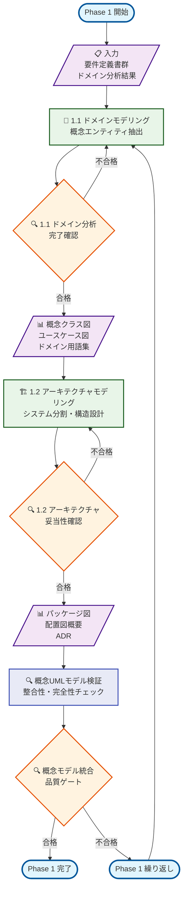

# UML統合設計プロセスフロー図（PFD） - Zoom Video Mover

## PFD基本情報

**プロセス名**: UML統合設計プロセス  
**プロセス目的**: 構造化UMLモデリングによる高品質ソフトウェア設計  
**プロセス範囲**: 要件定義完了 → 実装準備完了（UMLモデル統合）  
**プロセス責任者**: システムアーキテクト・UMLモデラー  
**最終更新**: 2025-08-03  

### 入力（Input）
- ✅ システム要件定義書
- ✅ 機能要件定義書  
- ✅ 非機能要件定義書
- ✅ ドメイン分析結果

### 出力（Output）
- 📊 UMLモデル群（9種類のUML図）
- 📄 設計文書群（UMLと連携）
- 📋 実装準備完了判定
- 🔧 自動生成コード骨格

### 制御（Control）
- 🔍 UMLモデル品質基準
- 📋 モデル間整合性要件
- 🔄 設計↔実装同期要件

### リソース（Resource）
- 👥 UMLモデラー・システムアーキテクト・技術リーダー
- ⏱️ 5-7週間、38-52人日
- 🛠️ PlantUML・Mermaid・UML検証ツール

## Level 0: UML統合設計プロセス全体フロー



## Level 1: Phase別詳細プロセスフロー

### Phase 1: コンセプチュアルモデリング詳細フロー



### Phase 2: ロジカルモデリング詳細フロー

```mermaid
flowchart TD
    %% 開始・入力
    START_P2([Phase 2 開始])
    INPUT_P2[/📊 Phase 1 UMLモデル<br/>概念クラス図・ユースケース図<br/>パッケージ図・配置図概要/]
    
    %% 2.1 構造モデリング
    P2_1_PROCESS[🔧 2.1 構造モデリング<br/>詳細クラス図・オブジェクト図]
    P2_1_CHECK{🔍 2.1 構造モデル<br/>品質確認}
    P2_1_OUTPUT[/📊 詳細クラス図<br/>オブジェクト図<br/>インターフェース仕様/]
    
    %% 2.2 振る舞いモデリング
    P2_2_PROCESS[🎭 2.2 振る舞いモデリング<br/>シーケンス図・状態遷移図]
    P2_2_CHECK{🔍 2.2 振る舞いモデル<br/>品質確認}
    P2_2_OUTPUT[/📊 シーケンス図<br/>状態遷移図<br/>アクティビティ図/]
    
    %% 2.3 インターフェースモデリング
    P2_3_PROCESS[🔌 2.3 インターフェースモデリング<br/>通信図・コンポーネント図]
    P2_3_CHECK{🔍 2.3 インターフェース<br/>品質確認}
    P2_3_OUTPUT[/📊 通信図<br/>コンポーネント図<br/>API仕様書/]
    
    %% UMLモデル論理検証
    P2_VALIDATION[🔍 論理UMLモデル検証<br/>モデル間整合性チェック]
    P2_INTEGRATION_CHECK{🔍 論理モデル統合<br/>品質ゲート}
    
    %% 終了
    P2_END([Phase 2 完了])
    P2_REWORK([Phase 2 繰り返し])
    
    %% 流れ
    START_P2 --> INPUT_P2
    INPUT_P2 --> P2_1_PROCESS
    P2_1_PROCESS --> P2_1_CHECK
    P2_1_CHECK -->|合格| P2_1_OUTPUT
    P2_1_CHECK -->|不合格| P2_1_PROCESS
    P2_1_OUTPUT --> P2_2_PROCESS
    
    P2_2_PROCESS --> P2_2_CHECK
    P2_2_CHECK -->|合格| P2_2_OUTPUT
    P2_2_CHECK -->|不合格| P2_2_PROCESS
    P2_2_OUTPUT --> P2_3_PROCESS
    
    P2_3_PROCESS --> P2_3_CHECK
    P2_3_CHECK -->|合格| P2_3_OUTPUT
    P2_3_CHECK -->|不合格| P2_3_PROCESS
    P2_3_OUTPUT --> P2_VALIDATION
    
    P2_VALIDATION --> P2_INTEGRATION_CHECK
    P2_INTEGRATION_CHECK -->|合格| P2_END
    P2_INTEGRATION_CHECK -->|不合格| P2_REWORK
    P2_REWORK --> P2_1_PROCESS
    
    %% スタイル定義
    classDef startEnd fill:#e1f5fe,stroke:#01579b,stroke-width:3px
    classDef input fill:#f3e5f5,stroke:#4a148c,stroke-width:2px
    classDef process fill:#e8f5e8,stroke:#1b5e20,stroke-width:2px
    classDef decision fill:#fff3e0,stroke:#e65100,stroke-width:2px
    classDef output fill:#fce4ec,stroke:#ad1457,stroke-width:2px
    classDef validation fill:#e8eaf6,stroke:#3f51b5,stroke-width:2px
    
    class START_P2,P2_END,P2_REWORK startEnd
    class INPUT_P2,P2_1_OUTPUT,P2_2_OUTPUT,P2_3_OUTPUT input
    class P2_1_PROCESS,P2_2_PROCESS,P2_3_PROCESS process
    class P2_1_CHECK,P2_2_CHECK,P2_3_CHECK,P2_INTEGRATION_CHECK decision
    class P2_VALIDATION validation
```



### Phase 3: フィジカルモデリング詳細フロー

```mermaid
flowchart TD
    %% 開始・入力
    START_P3([Phase 3 開始])
    INPUT_P3[/📊 Phase 2 UMLモデル<br/>詳細クラス図・シーケンス図<br/>状態遷移図・コンポーネント図/]
    
    %% 3.1 実装モデリング
    P3_1_PROCESS[⚙️ 3.1 実装モデリング<br/>Rust実装クラス図・詳細配置図]
    P3_1_CHECK{🔍 3.1 実装モデル<br/>技術適合性確認}
    P3_1_OUTPUT[/📊 実装クラス図<br/>詳細配置図<br/>Rust実装ガイドライン/]
    
    %% 3.2 動的実装モデリング
    P3_2_PROCESS[🎬 3.2 動的実装モデリング<br/>詳細シーケンス図・実装状態遷移図]
    P3_2_CHECK{🔍 3.2 動的モデル<br/>実装可能性確認}
    P3_2_OUTPUT[/📊 詳細シーケンス図<br/>実装状態遷移図<br/>性能設計書/]
    
    %% 3.3 統合・検証モデリング
    P3_3_PROCESS[🧪 3.3 統合・検証モデリング<br/>テストシーケンス図・システム配置図]
    P3_3_CHECK{🔍 3.3 統合モデル<br/>テスト可能性確認}
    P3_3_OUTPUT[/📊 統合テストシーケンス図<br/>システム配置図<br/>運用設計書/]
    
    %% UMLモデル物理検証
    P3_VALIDATION[🔍 実装UMLモデル検証<br/>実装準備完了確認]
    P3_INTEGRATION_CHECK{🔍 実装モデル統合<br/>最終品質ゲート}
    
    %% 終了
    P3_END([Phase 3 完了])
    P3_REWORK([Phase 3 繰り返し])
    
    %% 流れ
    START_P3 --> INPUT_P3
    INPUT_P3 --> P3_1_PROCESS
    P3_1_PROCESS --> P3_1_CHECK
    P3_1_CHECK -->|合格| P3_1_OUTPUT
    P3_1_CHECK -->|不合格| P3_1_PROCESS
    P3_1_OUTPUT --> P3_2_PROCESS
    
    P3_2_PROCESS --> P3_2_CHECK
    P3_2_CHECK -->|合格| P3_2_OUTPUT
    P3_2_CHECK -->|不合格| P3_2_PROCESS
    P3_2_OUTPUT --> P3_3_PROCESS
    
    P3_3_PROCESS --> P3_3_CHECK
    P3_3_CHECK -->|合格| P3_3_OUTPUT
    P3_3_CHECK -->|不合格| P3_3_PROCESS
    P3_3_OUTPUT --> P3_VALIDATION
    
    P3_VALIDATION --> P3_INTEGRATION_CHECK
    P3_INTEGRATION_CHECK -->|合格| P3_END
    P3_INTEGRATION_CHECK -->|不合格| P3_REWORK
    P3_REWORK --> P3_1_PROCESS
    
    %% スタイル定義
    classDef startEnd fill:#e1f5fe,stroke:#01579b,stroke-width:3px
    classDef input fill:#f3e5f5,stroke:#4a148c,stroke-width:2px
    classDef process fill:#e8f5e8,stroke:#1b5e20,stroke-width:2px
    classDef decision fill:#fff3e0,stroke:#e65100,stroke-width:2px
    classDef output fill:#fce4ec,stroke:#ad1457,stroke-width:2px
    classDef validation fill:#e8eaf6,stroke:#3f51b5,stroke-width:2px
    
    class START_P3,P3_END,P3_REWORK startEnd
    class INPUT_P3,P3_1_OUTPUT,P3_2_OUTPUT,P3_3_OUTPUT input
    class P3_1_PROCESS,P3_2_PROCESS,P3_3_PROCESS process
    class P3_1_CHECK,P3_2_CHECK,P3_3_CHECK,P3_INTEGRATION_CHECK decision
    class P3_VALIDATION validation
```



## UML成果物・品質管理マトリックス

### UML図別成果物対応表

| Phase | UML図種別 | 目的 | 成果物ファイル | 品質指標 | 工数目安 |
|-------|-----------|------|---------------|----------|----------|
| **P1.1** | 概念クラス図 | ドメイン理解 | `conceptual_class_diagram.puml` | 完全性95%+ | 1-2日 |
| **P1.1** | ユースケース図 | 機能要求構造化 | `use_case_diagram.puml` | 網羅性100% | 1日 |
| **P1.2** | パッケージ図 | システム分割 | `package_diagram.puml` | 結合度<0.3 | 1日 |
| **P1.2** | 配置図（概念） | アーキテクチャ概要 | `conceptual_deployment.puml` | 実現可能性確認 | 1日 |
| **P2.1** | 詳細クラス図 | 静的構造詳細 | `detailed_class_diagram.puml` | 設計原則遵守 | 2-3日 |
| **P2.1** | オブジェクト図 | インスタンス関係 | `object_diagram.puml` | 整合性100% | 1日 |
| **P2.2** | シーケンス図 | 動的相互作用 | `sequence_diagrams/*.puml` | ユースケース網羅 | 2-3日 |
| **P2.2** | 状態遷移図 | オブジェクト状態 | `state_diagrams/*.puml` | 状態完全性 | 1-2日 |
| **P2.2** | アクティビティ図 | ビジネスプロセス | `activity_diagrams/*.puml` | 論理正確性 | 1日 |
| **P2.3** | 通信図 | 通信パターン | `communication_diagrams/*.puml` | メッセージ整合性 | 1日 |
| **P2.3** | コンポーネント図 | コンポーネント構造 | `component_diagram.puml` | 依存関係明確化 | 2日 |
| **P3.1** | 実装クラス図 | Rust実装詳細 | `implementation_class_diagram.puml` | コンパイル可能性 | 3-4日 |
| **P3.2** | 詳細シーケンス図 | 実装相互作用 | `detailed_sequence_diagrams/*.puml` | 実装追跡可能性 | 2-3日 |
| **P3.2** | 実装状態遷移図 | 具体的状態管理 | `implementation_state_diagrams/*.puml` | 実装可能性 | 1-2日 |
| **P3.3** | 統合テストシーケンス図 | テストシナリオ | `integration_test_sequences/*.puml` | テスト網羅性 | 2日 |
| **P3.3** | システム配置図 | 最終デプロイ | `system_deployment.puml` | 運用実現性 | 1日 |

### UMLモデル品質評価基準

#### モデル完全性（Completeness）
- [x] 全機能要件がUMLモデルで表現されている
- [x] 全非機能要件が適切なUML図で考慮されている  
- [x] 例外・エラー処理がモデルに含まれている
- [x] システム境界・インターフェースが明確

#### モデル整合性（Consistency）
- [x] UML図間の要素名・概念が一致している
- [x] クラス図とシーケンス図の操作が整合している
- [x] 状態遷移図とクラス図の状態属性が一致している
- [x] モデルと要件の追跡可能性が確保されている

#### モデル正確性（Correctness）
- [x] UML記法が標準に準拠している
- [x] ドメインルール・ビジネスロジックが正確
- [x] 技術制約・実装制約が適切に反映されている
- [x] 性能・セキュリティ要件が考慮されている

#### モデル実用性（Practicality）
- [x] 実装チームが理解・活用できる詳細度
- [x] 自動コード生成・検証に適している
- [x] 保守・変更時の更新が容易
- [x] ステークホルダー間のコミュニケーションに有効

## 自動化・ツール統合

### PlantUML自動生成・検証
```bash
# UMLコンパイル・検証
plantuml -checkonly docs/uml/**/*.puml

# 自動HTML生成
plantuml -thtml docs/uml/**/*.puml

# SVG出力（高品質）
plantuml -tsvg docs/uml/**/*.puml
```

### UMLモデル整合性自動検証
```python
# scripts/validate_uml_consistency.py
def validate_class_sequence_consistency():
    """クラス図とシーケンス図の整合性検証"""
    class_operations = extract_operations_from_class_diagrams()
    sequence_operations = extract_operations_from_sequence_diagrams()
    
    inconsistencies = []
    for op in sequence_operations:
        if op not in class_operations:
            inconsistencies.append(f"Missing operation in class diagram: {op}")
    
    return inconsistencies

def validate_state_class_consistency():
    """状態遷移図とクラス図の整合性検証"""
    # 状態属性の一致確認
    pass
```

### Rustコード自動生成
```rust
// scripts/generate_rust_from_uml.rs
use std::collections::HashMap;

pub struct UmlToRustGenerator {
    class_diagrams: HashMap<String, ClassDiagram>,
    sequence_diagrams: HashMap<String, SequenceDiagram>,
}

impl UmlToRustGenerator {
    pub fn generate_struct_definitions(&self) -> String {
        // クラス図からRust struct定義生成
    }
    
    pub fn generate_trait_definitions(&self) -> String {
        // インターフェースからRust trait定義生成
    }
    
    pub fn generate_test_skeletons(&self) -> String {
        // シーケンス図からテストコード骨格生成
    }
}
```

## 継続的改善・最適化

### モデリング品質向上
- **週次UMLレビュー**: モデル品質・整合性の定期確認
- **月次プロセス改善**: ツール・手法の最適化
- **四半期効果測定**: 設計品質・開発効率の向上測定

### ツール・技術進化対応
- **新UMLツール評価**: より効率的なモデリングツール導入
- **AI支援モデリング**: AI による UMLモデル生成・検証支援
- **リアルタイム同期**: 設計とコードのリアルタイム同期

---

**作成日**: 2025-08-03  
**管理責任者**: UMLモデラー・システムアーキテクト  
**次回更新**: プロセス実装・改善時  
**活用目的**: UML統合設計プロセス管理・品質保証・チーム教育