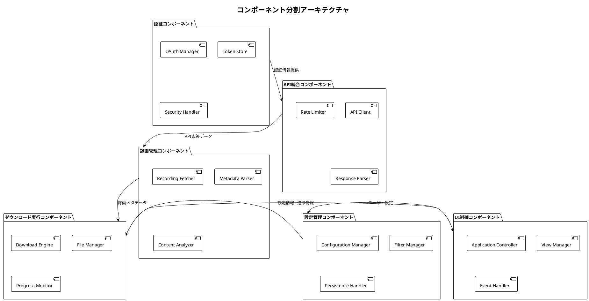

# コンポーネントベース開発プロセス - Zoom Video Mover

## 文書概要
**プロジェクト名**: Zoom Video Mover  
**作成日**: 2025-08-03  
  
**バージョン**: 1.0  

## コンポーネントベース開発プロセス概要

### 基本方針
データフロー概念モデルに基づいてシステムをコンポーネントに分割し、各コンポーネントに対してV字モデルの要件定義→設計→実装→テストを適用する。全体システムはコンポーネント間の関係性に基づいた統合プロセスで構築する。

### プロセス構造
```
全体要件定義
    ↓
データフロー分析・コンポーネント分割
    ↓
┌─────────────────────────────────────────┐
│         各コンポーネント並行開発         │
├─────────────────────────────────────────┤
│ コンポーネントA │ コンポーネントB │ ... │
│ 要件→設計→実装→テスト │ 要件→設計→実装→テスト │ ... │
└─────────────────────────────────────────┘
    ↓
コンポーネント間統合
    ↓
システム全体テスト・受入テスト
```

## データフロー概念モデルに基づくコンポーネント分割

### コンポーネント分割原則

#### 1. データフロー境界による分割
- **入力境界**: 外部システムからのデータ取得点
- **処理境界**: データ変換・加工の責任範囲
- **出力境界**: 外部システム・ユーザーへの出力点
- **状態境界**: データ永続化・キャッシュの管理範囲

#### 2. 責任分離による分割
- **単一責任原則**: 各コンポーネントは1つの明確な責任を持つ
- **依存関係最小化**: コンポーネント間の依存を最小限に抑制
- **疎結合原則**: インターフェース経由での疎結合な関係
- **高凝集原則**: 関連する機能を1つのコンポーネントに集約

#### 3. 技術境界による分割
- **UI層**: ユーザーインターフェース・プレゼンテーション
- **アプリケーション層**: ビジネスロジック・ワークフロー制御
- **ドメイン層**: ドメインモデル・ビジネスルール
- **インフラ層**: 外部システム連携・データ永続化

### コンポーネント分割結果

#### Core Components（6個の主要コンポーネント）



## コンポーネント詳細定義

### 1. 認証コンポーネント（AuthComponent）

#### 責任範囲
- OAuth 2.0認証フローの実行
- アクセストークンのライフサイクル管理
- セキュリティ情報の暗号化・復号化

#### インターフェース定義
```rust
pub trait AuthenticationService {
    async fn authenticate(&self, config: &OAuthConfig) -> Result<AccessToken, AuthError>;
    async fn refresh_token(&self, refresh_token: &str) -> Result<AccessToken, AuthError>;
    async fn validate_token(&self, token: &AccessToken) -> bool;
    async fn revoke_token(&self, token: &AccessToken) -> Result<(), AuthError>;
}

pub trait TokenStorage {
    async fn store_token(&self, token: &AccessToken) -> Result<(), StorageError>;
    async fn retrieve_token(&self) -> Result<Option<AccessToken>, StorageError>;
    async fn delete_token(&self) -> Result<(), StorageError>;
}
```

#### データフロー
```
外部: Zoom OAuth Server → OAuth Manager → Token Store → 内部: 他コンポーネント
```

### 2. API統合コンポーネント（ApiComponent）

#### 責任範囲
- Zoom Cloud API呼び出しの実行
- APIレート制限の管理
- APIレスポンスの解析・エラーハンドリング

#### インターフェース定義
```rust
pub trait ZoomApiClient {
    async fn get_recordings(&self, params: &RecordingQuery) -> Result<RecordingList, ApiError>;
    async fn get_meeting_details(&self, meeting_id: &str) -> Result<Meeting, ApiError>;
    async fn get_ai_summary(&self, meeting_id: &str) -> Result<AISummary, ApiError>;
    async fn check_api_status(&self) -> Result<ApiStatus, ApiError>;
}

pub trait RateLimiter {
    async fn acquire_permit(&self) -> Result<(), RateLimitError>;
    fn get_current_usage(&self) -> RateLimitStatus;
    fn get_reset_time(&self) -> DateTime<Utc>;
}
```

#### データフロー
```
内部: 認証コンポーネント → API Client → 外部: Zoom Cloud API → Response Parser → 内部: 録画管理コンポーネント
```

### 3. 録画管理コンポーネント（RecordingComponent）

#### 責任範囲
- 録画メタデータの取得・解析
- 録画コンテンツの分類・フィルタリング
- AI要約データの統合管理

#### インターフェース定義
```rust
pub trait RecordingService {
    async fn fetch_recordings(&self, filter: &RecordingFilter) -> Result<Vec<Recording>, RecordingError>;
    async fn parse_recording_metadata(&self, raw_data: &str) -> Result<Recording, ParseError>;
    async fn apply_filters(&self, recordings: Vec<Recording>, filter: &RecordingFilter) -> Vec<Recording>;
    async fn enrich_with_ai_summary(&self, recording: &mut Recording) -> Result<(), RecordingError>;
}

pub trait ContentAnalyzer {
    fn analyze_file_types(&self, recording: &Recording) -> Vec<FileType>;
    fn estimate_download_size(&self, recording: &Recording) -> u64;
    fn validate_content_availability(&self, recording: &Recording) -> bool;
}
```

#### データフロー
```
内部: API統合コンポーネント → Recording Fetcher → Metadata Parser → Content Analyzer → 内部: ダウンロード実行コンポーネント
```

### 4. ダウンロード実行コンポーネント（DownloadComponent）

#### 責任範囲
- 並列ダウンロードの実行制御
- ファイルの完全性検証・保存
- ダウンロード進捗の監視・通知

#### インターフェース定義
```rust
pub trait DownloadService {
    async fn start_download_session(&self, recordings: Vec<Recording>) -> Result<SessionId, DownloadError>;
    async fn pause_session(&self, session_id: &SessionId) -> Result<(), DownloadError>;
    async fn resume_session(&self, session_id: &SessionId) -> Result<(), DownloadError>;
    async fn cancel_session(&self, session_id: &SessionId) -> Result<(), DownloadError>;
}

pub trait FileManager {
    async fn create_directory_structure(&self, recording: &Recording) -> Result<PathBuf, FileError>;
    async fn save_file(&self, file_data: &[u8], path: &Path) -> Result<(), FileError>;
    async fn verify_file_integrity(&self, path: &Path, expected_hash: &str) -> Result<bool, FileError>;
    async fn cleanup_failed_downloads(&self) -> Result<(), FileError>;
}

pub trait ProgressMonitor {
    fn start_monitoring(&self, session_id: &SessionId);
    fn update_progress(&self, task_id: &TaskId, progress: DownloadProgress);
    fn get_session_progress(&self, session_id: &SessionId) -> SessionProgress;
    fn stop_monitoring(&self, session_id: &SessionId);
}
```

#### データフロー
```
内部: 録画管理コンポーネント → Download Engine → 外部: Zoom Recording Storage → File Manager → 外部: ローカルストレージ
内部: Download Engine → Progress Monitor → 内部: UI制御コンポーネント
```

### 5. 設定管理コンポーネント（ConfigComponent）

#### 責任範囲
- アプリケーション設定の永続化・管理
- フィルタ条件の設定・適用
- ユーザー設定のバリデーション

#### インターフェース定義
```rust
pub trait ConfigurationService {
    async fn load_config(&self) -> Result<ApplicationConfig, ConfigError>;
    async fn save_config(&self, config: &ApplicationConfig) -> Result<(), ConfigError>;
    async fn validate_config(&self, config: &ApplicationConfig) -> Result<(), ValidationError>;
    async fn get_default_config(&self) -> ApplicationConfig;
}

pub trait FilterService {
    fn create_filter(&self, criteria: &FilterCriteria) -> RecordingFilter;
    fn apply_date_filter(&self, recordings: Vec<Recording>, date_range: &DateRange) -> Vec<Recording>;
    fn apply_file_type_filter(&self, recordings: Vec<Recording>, file_types: &[FileType]) -> Vec<Recording>;
    fn apply_custom_filter(&self, recordings: Vec<Recording>, pattern: &str) -> Vec<Recording>;
}
```

#### データフロー
```
内部: UI制御コンポーネント → Configuration Manager → 外部: 設定ファイル
内部: Filter Manager → 内部: 録画管理コンポーネント
```

### 6. UI制御コンポーネント（UIComponent）

#### 責任範囲
- ユーザーインターフェースの制御・イベント処理
- アプリケーション状態の管理・同期
- ユーザー操作の他コンポーネントへの委譲

#### インターフェース定義
```rust
pub trait ApplicationController {
    fn initialize(&mut self) -> Result<(), InitError>;
    fn handle_user_action(&mut self, action: UserAction) -> Result<(), ActionError>;
    fn update_application_state(&mut self, state_change: StateChange);
    fn shutdown(&mut self) -> Result<(), ShutdownError>;
}

pub trait ViewManager {
    fn render_configuration_view(&self, config: &ApplicationConfig);
    fn render_recording_list(&self, recordings: &[Recording]);
    fn render_progress_view(&self, progress: &SessionProgress);
    fn render_error_dialog(&self, error: &AppError);
}

pub trait EventHandler {
    fn on_config_change(&self, config: &ApplicationConfig);
    fn on_download_start(&self, session_id: &SessionId);
    fn on_progress_update(&self, progress: &DownloadProgress);
    fn on_download_complete(&self, session_id: &SessionId);
    fn on_error_occurred(&self, error: &AppError);
}
```

#### データフロー
```
外部: ユーザー入力 → Application Controller → 内部: 各コンポーネント
内部: 各コンポーネント → View Manager → 外部: 画面表示
```

## コンポーネントベースV字モデル開発プロセス

### Phase 1: 全体要件分析・コンポーネント分割

#### 1.1 全体要件分析
- **入力**: システム要件、ユーザー要件、非機能要件
- **作業**: データフロー分析、責任分離分析、技術制約分析
- **成果物**: 要件分析レポート、データフロー図、制約一覧

#### 1.2 コンポーネント分割設計
- **入力**: データフロー図、責任分離結果
- **作業**: コンポーネント境界定義、インターフェース設計、依存関係分析
- **成果物**: コンポーネント分割図、インターフェース仕様、依存関係図

#### 1.3 統合戦略策定
- **入力**: コンポーネント分割結果、非機能要件
- **作業**: 統合順序決定、統合テスト戦略、リスク分析
- **成果物**: 統合計画、統合テスト計画、リスク対応計画

### Phase 2: コンポーネント別並行開発

#### 2.1 各コンポーネントでのV字モデル適用

```
コンポーネント要件定義 ←────────→ コンポーネント受入テスト
        │                              ↑
コンポーネント基本設計 ←────────→ コンポーネント統合テスト
        │                              ↑
コンポーネント詳細設計 ←────────→ コンポーネント単体テスト
        │                              ↑
コンポーネント実装 ─────────────→ 基盤品質保証戦略（Property-basedテスト）
```

#### 2.2 コンポーネント別開発フェーズ

##### 認証コンポーネント開発
- **要件定義**: OAuth 2.0フロー、セキュリティ要件、トークン管理要件
- **基本設計**: 認証アーキテクチャ、セキュリティ方式、エラーハンドリング
- **詳細設計**: OAuth実装詳細、暗号化方式、ストレージ設計
- **実装**: Rust OAuth2 crate活用、セキュアストレージ実装
- **テスト**: 認証フローテスト、セキュリティテスト、トークン管理テスト

##### API統合コンポーネント開発
- **要件定義**: Zoom API仕様、レート制限対応、エラーハンドリング要件
- **基本設計**: APIクライアントアーキテクチャ、レート制限戦略
- **詳細設計**: HTTP通信詳細、レスポンス解析、リトライ機構
- **実装**: reqwest活用、レート制限実装、エラー処理実装
- **テスト**: API通信テスト、レート制限テスト、エラーハンドリングテスト

##### 録画管理コンポーネント開発
- **要件定義**: 録画データモデル、フィルタリング要件、AI統合要件
- **基本設計**: 録画管理アーキテクチャ、データ変換方式
- **詳細設計**: メタデータ解析詳細、フィルタ実装、キャッシュ設計
- **実装**: serde活用、データ変換実装、フィルタリング実装
- **テスト**: データ解析テスト、フィルタリングテスト、AI統合テスト

##### ダウンロード実行コンポーネント開発
- **要件定義**: 並列ダウンロード要件、ファイル管理要件、進捗監視要件
- **基本設計**: ダウンロードアーキテクチャ、並列処理方式、進捗管理
- **詳細設計**: ダウンロード詳細実装、ファイル検証、進捗計算
- **実装**: tokio活用、並列処理実装、ファイル操作実装
- **テスト**: 並列ダウンロードテスト、ファイル整合性テスト、進捗監視テスト

##### 設定管理コンポーネント開発
- **要件定義**: 設定項目定義、永続化要件、バリデーション要件
- **基本設計**: 設定管理アーキテクチャ、ファイル形式、バリデーション
- **詳細設計**: TOML設定詳細、バリデーションルール、デフォルト値
- **実装**: toml crate活用、設定管理実装、バリデーション実装
- **テスト**: 設定保存テスト、バリデーションテスト、互換性テスト

##### UI制御コンポーネント開発
- **要件定義**: UI要件、ユーザビリティ要件、レスポンシブ要件
- **基本設計**: UIアーキテクチャ、イベント処理、状態管理
- **詳細設計**: UI詳細設計、イベントフロー、状態遷移
- **実装**: egui活用、UI実装、イベント処理実装
- **テスト**: UI操作テスト、イベント処理テスト、状態管理テスト

### Phase 3: コンポーネント間統合

#### 3.1 段階的統合プロセス

##### Step 1: コア統合（認証 + API統合）
- **統合範囲**: 認証コンポーネント ↔ API統合コンポーネント
- **統合テスト**: 認証済みAPI呼び出し、トークン更新、エラーハンドリング
- **成功基準**: API呼び出し成功率 > 95%、トークン自動更新動作

##### Step 2: データ処理統合（API統合 + 録画管理）
- **統合範囲**: API統合コンポーネント ↔ 録画管理コンポーネント
- **統合テスト**: APIレスポンス解析、データ変換、フィルタリング
- **成功基準**: データ変換精度 > 99%、フィルタ処理時間 < 1秒

##### Step 3: 実行エンジン統合（録画管理 + ダウンロード実行）
- **統合範囲**: 録画管理コンポーネント ↔ ダウンロード実行コンポーネント
- **統合テスト**: ダウンロード実行、進捗監視、エラー回復
- **成功基準**: ダウンロード成功率 > 98%、進捗更新間隔 < 500ms

##### Step 4: 設定統合（設定管理 + 全コンポーネント）
- **統合範囲**: 設定管理コンポーネント ↔ 全コンポーネント
- **統合テスト**: 設定適用、動的設定変更、設定バリデーション
- **成功基準**: 設定適用時間 < 100ms、設定変更即座反映

##### Step 5: UI統合（UI制御 + 全コンポーネント）
- **統合範囲**: UI制御コンポーネント ↔ 全コンポーネント
- **統合テスト**: UI操作、状態同期、イベント処理
- **成功基準**: UI応答時間 < 100ms、状態同期遅延 < 50ms

#### 3.2 統合品質メトリクス

| 統合レベル | パフォーマンス目標 | 信頼性目標 | 保守性目標 |
|------------|-------------------|-----------|-----------|
| **コア統合** | API呼び出し < 3秒 | 成功率 > 95% | 結合度 < 30% |
| **データ処理統合** | データ変換 < 1秒 | 精度 > 99% | 変更影響 < 20% |
| **実行エンジン統合** | ダウンロード開始 < 2秒 | 成功率 > 98% | 拡張性 > 80% |
| **設定統合** | 設定適用 < 100ms | バリデーション > 99% | 設定変更容易性 > 90% |
| **UI統合** | UI応答 < 100ms | 操作成功率 > 99% | ユーザビリティ > 85% |

### Phase 4: システム全体テスト

#### 4.1 システムテスト
- **機能テスト**: 全機能要件の動作確認
- **性能テスト**: 非機能要件の達成確認
- **セキュリティテスト**: セキュリティ要件の検証
- **互換性テスト**: 動作環境での動作確認

#### 4.2 受入テスト
- **ユーザビリティテスト**: ユーザー体験の確認
- **業務フローテスト**: 実際の利用シナリオでの確認
- **受入基準テスト**: 全受入基準の達成確認

## コンポーネント品質管理

### コンポーネント品質メトリクス

#### 内部品質メトリクス
- **コードカバレッジ**: 各コンポーネント > 90%
- **循環的複雑度**: 関数あたり < 10
- **結合度**: コンポーネント間 < 30%
- **凝集度**: コンポーネント内 > 80%

#### 外部品質メトリクス
- **機能適合性**: 機能要件達成率 > 99%
- **性能効率性**: 性能要件達成率 > 95%
- **信頼性**: 平均故障間隔 > 100時間
- **使用性**: ユーザビリティスコア > 85%

### コンポーネント間依存関係管理

#### 依存関係設計原則
1. **階層化アーキテクチャ**: 上位層から下位層への一方向依存
2. **インターフェース分離**: 具象型ではなくトレイトに依存
3. **依存性注入**: 実行時の依存関係注入による疎結合
4. **イベント駆動**: 非同期イベント通信による疎結合

#### 依存関係監視
```rust
/// コンポーネント間依存関係分析
/// 
/// # 目的
/// コンポーネント間の依存関係を分析し、設計原則遵守を確認
/// 
/// # 事前条件
/// - 全コンポーネントが実装済み
/// - インターフェース定義が明確
/// 
/// # 事後条件
/// - 依存関係が可視化される
/// - 設計原則違反が検出される
/// 
/// # 不変条件
/// - 循環依存が存在しない
pub struct ComponentDependencyAnalyzer {
    components: HashMap<ComponentId, Component>,
    dependencies: Graph<ComponentId, DependencyType>,
}

impl ComponentDependencyAnalyzer {
    /// 依存関係サイクル検出
    pub fn detect_cycles(&self) -> Vec<DependencyCycle> {
        // Depth-First Search による循環依存検出
        let mut cycles = Vec::new();
        let mut visited = HashSet::new();
        let mut path = Vec::new();
        
        for component_id in self.components.keys() {
            if !visited.contains(component_id) {
                self.dfs_cycle_detection(component_id, &mut visited, &mut path, &mut cycles);
            }
        }
        
        cycles
    }
    
    /// 結合度測定
    pub fn measure_coupling(&self, component_id: &ComponentId) -> CouplingMetrics {
        let incoming = self.dependencies.incoming_edges(component_id).count();
        let outgoing = self.dependencies.outgoing_edges(component_id).count();
        let total_components = self.components.len();
        
        CouplingMetrics {
            afferent_coupling: incoming,
            efferent_coupling: outgoing,
            coupling_ratio: (incoming + outgoing) as f64 / total_components as f64,
        }
    }
}
```

## 品質保証・継続改善

### コンポーネント品質ゲート

| ゲート | 対象 | 品質基準 | 合格基準 | 責任者 |
|--------|------|----------|----------|--------|
| **コンポーネント完了ゲート** | 各コンポーネント | 単体テストカバレッジ | > 90% | コンポーネント開発者 |
| **統合準備ゲート** | コンポーネント | インターフェース適合性 | 100% | 統合責任者 |
| **統合完了ゲート** | 統合モジュール | 統合テスト成功率 | > 95% | 統合責任者 |
| **システム完了ゲート** | 全システム | システムテスト成功率 | > 98% | 品質保証責任者 |

### 継続的改善プロセス

#### 改善サイクル
1. **測定**: コンポーネント品質メトリクス収集
2. **分析**: 品質課題・改善機会の特定
3. **計画**: 改善アクションプランの策定
4. **実行**: 改善の実施・検証
5. **標準化**: 成功した改善の標準化・展開

#### 改善対象領域
- **コンポーネント設計**: インターフェース最適化、責任分離改善
- **統合プロセス**: 統合手順効率化、自動化拡大
- **品質測定**: メトリクス追加、測定精度向上
- **開発プロセス**: 並行開発効率化、コミュニケーション改善

---

**承認**:  
**品質基準適合**: [ ] 確認済  
**ポリシー準拠**: [ ] 確認済  
**承認日**: ___________