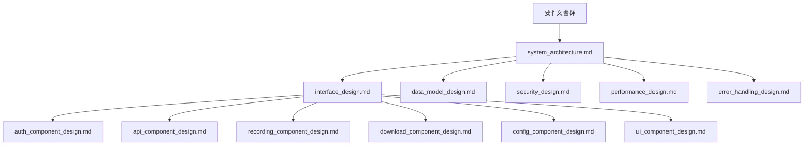

# 汎用設計方針 - Zoom Video Mover

## 設計の基本方針

### 設計原則・哲学
- **シンプルさ**: 複雑性を最小限に抑え、理解しやすい設計
- **モジュール性**: 疎結合・高凝集なコンポーネント設計
- **拡張性**: 将来の機能追加・変更に柔軟に対応
- **信頼性**: 堅牢なエラーハンドリングと自動回復機能
- **性能**: 非同期処理とリソース効率の最適化
- **保守性**: 明確な責任分離と文書化

### アーキテクチャスタイル
- **レイヤードアーキテクチャ**: UI・ビジネスロジック・インフラの分離
- **非同期メッセージング**: 疎結合な通信方式
- **イベント駆動**: 状態変更とUIの効率的な同期
- **依存性注入**: テスト容易性と柔軟性の向上

## システムアーキテクチャ設計

### 全体構成

#### レイヤー構造
```
┌─────────────────────────────────────────┐
│        Presentation Layer               │
│  ┌─────────────┐  ┌─────────────────┐   │
│  │   GUI       │  │   Platform      │   │
│  │ Interface   │  │ Support Layer   │   │
│  └─────────────┘  └─────────────────┘   │
├─────────────────────────────────────────┤
│        Application Layer                │
│  ┌─────────────────────────────────────┐ │
│  │     Core Business Logic             │ │
│  │        (Domain Logic)               │ │
│  └─────────────────────────────────────┘ │
├─────────────────────────────────────────┤
│        Infrastructure Layer            │
│  ┌─────────┐ ┌─────────┐ ┌─────────────┐ │
│  │  HTTP   │ │  Auth   │ │ File System │ │
│  │ Client  │ │ Client  │ │   Manager   │ │
│  └─────────┘ └─────────┘ └─────────────┘ │
└─────────────────────────────────────────┘
```

#### コンポーネント責任

**Presentation Layer**:
- GUI実装: ユーザーインターフェース
- プラットフォーム固有処理: OS依存機能
- **責任**: ユーザー入力の受付・画面表示・プラットフォーム固有処理

**Application Layer**:
- コアビジネスロジック: ドメインルール実装
- **責任**: ドメインルール・ワークフロー制御・状態管理

**Infrastructure Layer**:
- 外部システム連携: API通信・認証・ファイル操作
- **責任**: 外部リソースへのアクセス・技術的な詳細処理

### 汎用設計パターン

#### 1. Repository Pattern
```
// 抽象インターフェース
interface DataRepository {
    getData(criteria): Result<Data[]>
    saveData(data): Result<void>
}

// 具象実装
class ApiRepository implements DataRepository {
    client: HttpClient
    credentials: AuthCredentials
}
```

**目的**: データアクセス層の抽象化・テスト容易性向上

#### 2. Builder Pattern
```
// 複雑なオブジェクトの段階的構築
class ConfigBuilder {
    setCredentials()
    setEndpoints()
    setTimeouts()
    build(): Config
}
```

**目的**: 複雑なオブジェクト構築の簡素化・設定の柔軟性

#### 3. Observer Pattern
```
// 状態変更の通知システム
interface StateObserver {
    onStateChanged(newState): void
}

class StateManager {
    observers: StateObserver[]
    notifyObservers()
}
```

**目的**: 疎結合な状態通知・リアクティブなUI更新

#### 4. Command Pattern
```
// 操作の抽象化とキューイング
interface Command {
    execute(): Result<void>
    undo(): Result<void>
}

class CommandExecutor {
    executeQueue: Command[]
    execute(command: Command)
}
```

**目的**: 操作の抽象化・元に戻す機能・非同期実行

## 品質属性設計

### 性能設計原則
- **非同期処理**: ブロッキング操作の最小化
- **並列処理**: 独立タスクの並行実行
- **キャッシング**: 重複計算の削減
- **遅延読み込み**: 必要時のみのリソース取得

### セキュリティ設計原則
- **最小権限の原則**: 必要最小限のアクセス権
- **深層防御**: 多層のセキュリティ対策
- **入力検証**: すべての外部入力の検証
- **機密情報保護**: 適切な暗号化と保存

### 可用性設計原則
- **故障許容**: 単一障害点の排除
- **自動回復**: エラーからの自動復旧
- **デグラデーション**: 段階的な機能低下
- **監視**: 問題の早期検出

### 保守性設計原則
- **責任分離**: 単一責任の原則
- **疎結合**: 依存関係の最小化
- **高凝集**: 関連機能のグループ化
- **文書化**: コードの自己説明性

## エラー処理設計

### エラー分類
- **回復可能エラー**: 自動リトライ・代替手段
- **回復不可能エラー**: 適切なエラー情報の提供
- **予期可能エラー**: 事前検証・予防的処理
- **予期不可能エラー**: ログ記録・安全な停止

### エラー処理戦略
- **早期発見**: 入力時点での検証
- **適切な通知**: ユーザーフレンドリーなメッセージ
- **状態保全**: エラー時の一貫性維持
- **ログ記録**: トラブルシューティング情報

## V字モデル設計プロセス

### 設計プロセス概要

#### 基本設計フェーズ（System Design）
**V字モデル対応**: 要件定義 → 基本設計 ← システムテスト

##### 基本設計の目的
- システム全体アーキテクチャの定義
- コンポーネント分割・責任分離
- 非機能要件の技術方式決定
- 外部システム連携方式の決定

##### 基本設計プロセス
```
要件分析 → データフロー分析 → コンポーネント分割 → アーキテクチャ設計 → 非機能設計 → 外部I/F設計
```

#### 詳細設計フェーズ（Detailed Design）
**V字モデル対応**: 基本設計 → 詳細設計 ← 統合テスト

##### 詳細設計の目的
- コンポーネント内部設計の詳細化
- インターフェース仕様の明確化
- データ構造・アルゴリズムの設計
- 実装方針の具体化

##### 詳細設計プロセス
```
基本設計分析 → コンポーネント内部設計 → インターフェース詳細設計 → データ設計 → アルゴリズム設計 → 実装指針
```

### コンポーネントベース設計プロセス

#### Phase 1: 全体アーキテクチャ設計

##### 1.1 データフロー分析・コンポーネント分割
**入力**: システム要件、非機能要件、制約条件
**作業内容**:
- データフロー概念モデルの分析
- コンポーネント境界の特定（データフロー境界、責任分離、技術境界）
- コンポーネント責任の定義
- コンポーネント間関係の設計

**成果物**:
- コンポーネント分割図
- コンポーネント責任定義書
- コンポーネント間関係図
- データフロー図

##### 1.2 システムアーキテクチャ設計
**入力**: コンポーネント分割結果、非機能要件
**作業内容**:
- レイヤードアーキテクチャの適用
- 技術スタックの選定
- デプロイメントアーキテクチャの設計
- セキュリティアーキテクチャの設計

**成果物**:
- システムアーキテクチャ図
- 技術スタック選定書
- デプロイメント設計書
- セキュリティ設計書

##### 1.3 非機能アーキテクチャ設計
**入力**: 非機能要件、技術制約
**作業内容**:
- 性能アーキテクチャの設計（並列処理、非同期処理）
- 信頼性アーキテクチャの設計（エラー処理、自動回復）
- セキュリティアーキテクチャの設計（認証、暗号化）
- 運用アーキテクチャの設計（監視、ログ）

**成果物**:
- 性能設計書
- 信頼性設計書
- セキュリティ設計書
- 運用設計書

#### Phase 2: コンポーネント別基本設計

##### 2.1 認証コンポーネント基本設計
**設計範囲**: OAuth 2.0認証、トークン管理、セキュリティ
**成果物**:
- 認証アーキテクチャ設計書（ARCH-AUTH-001）
- トークンアーキテクチャ設計書（ARCH-TOKEN-001）
- セキュリティアーキテクチャ設計書（ARCH-SECURITY-001）

##### 2.2 API統合コンポーネント基本設計
**設計範囲**: Zoom API連携、レート制限、エラーハンドリング
**成果物**:
- APIアーキテクチャ設計書（ARCH-API-001）
- レート制限アーキテクチャ設計書（ARCH-RATELIMIT-001）
- 通信アーキテクチャ設計書（ARCH-HTTP-001）

##### 2.3 録画管理コンポーネント基本設計
**設計範囲**: 録画メタデータ管理、フィルタリング、AI統合
**成果物**:
- 録画管理アーキテクチャ設計書（ARCH-RECORDING-001）
- フィルタアーキテクチャ設計書（ARCH-FILTER-001）
- AI統合アーキテクチャ設計書（ARCH-AI-001）

##### 2.4 ダウンロード実行コンポーネント基本設計
**設計範囲**: 並列ダウンロード、ファイル管理、進捗監視
**成果物**:
- ダウンロードアーキテクチャ設計書（ARCH-DOWNLOAD-001）
- ファイルアーキテクチャ設計書（ARCH-FILE-001）
- 進捗管理アーキテクチャ設計書（ARCH-PROGRESS-001）

##### 2.5 設定管理コンポーネント基本設計
**設計範囲**: 設定永続化、バリデーション、設定管理
**成果物**:
- 設定アーキテクチャ設計書（ARCH-CONFIG-001）
- 永続化アーキテクチャ設計書（ARCH-PERSISTENCE-001）

##### 2.6 UI制御コンポーネント基本設計
**設計範囲**: ユーザーインターフェース、イベント処理、状態管理
**成果物**:
- GUIアーキテクチャ設計書（ARCH-GUI-001）
- イベントアーキテクチャ設計書（ARCH-EVENT-001）
- 状態管理アーキテクチャ設計書（ARCH-STATE-001）

#### Phase 3: コンポーネント別詳細設計

##### 3.1 コンポーネント内部詳細設計
**入力**: 基本設計書、実装要件
**作業内容**:
- 内部モジュール構造の詳細化
- データ構造の詳細定義
- アルゴリズムの詳細設計
- 例外処理の詳細設計

**成果物**:
- モジュール構造図
- データ構造定義書
- アルゴリズム設計書
- 例外処理設計書

##### 3.2 インターフェース詳細設計
**入力**: コンポーネント間関係図、基本設計書
**作業内容**:
- API仕様の詳細化
- データ交換形式の定義
- エラーハンドリング仕様の詳細化
- 非同期通信仕様の詳細化

**成果物**:
- APIインターフェース仕様書
- データ交換仕様書
- エラーハンドリング仕様書
- 非同期通信仕様書

##### 3.3 データベース・ストレージ詳細設計
**入力**: データ要件、性能要件
**作業内容**:
- ファイル構造の詳細設計
- 設定ファイル形式の詳細化
- キャッシュ戦略の詳細設計
- 一時ファイル管理の詳細設計

**成果物**:
- ファイル構造設計書
- 設定ファイル仕様書
- キャッシュ設計書
- 一時ファイル管理設計書

## 設計成果物とV字モデル対応

### 基本設計成果物（System Design Deliverables）

| 成果物カテゴリ | 成果物名 | 対応するシステムテスト | 作成者 | レビューア |
|---------------|----------|----------------------|--------|-----------|
| **システムアーキテクチャ** | システムアーキテクチャ図 | ST-ARCH-001: アーキテクチャ適合性テスト | システムアーキテクト | 技術リーダー |
| **コンポーネント設計** | コンポーネント分割図 | ST-COMP-001: コンポーネント統合テスト | システムアーキテクト | プロジェクトマネージャー |
| **技術設計** | 技術スタック選定書 | ST-TECH-001: 技術スタック検証テスト | 技術リーダー | システムアーキテクト |
| **非機能設計** | 性能設計書 | ST-PERF-001: 性能要件検証テスト | 性能エンジニア | 品質保証責任者 |
| **非機能設計** | セキュリティ設計書 | ST-SEC-001: セキュリティ要件検証テスト | セキュリティエンジニア | セキュリティ責任者 |
| **外部連携設計** | 外部API設計書 | ST-API-001: 外部API統合テスト | APIアーキテクト | システムアーキテクト |

### 詳細設計成果物（Detailed Design Deliverables）

| 成果物カテゴリ | 成果物名 | ファイル名 | 対応する統合テスト | 作成者 | レビューア |
|---------------|----------|-----------|-------------------|--------|-----------|
| **認証コンポーネント** | 認証コンポーネント詳細設計書 | auth_component_design.md | IT-AUTH-001: 認証統合テスト | 認証設計者 | セキュリティエンジニア |
| **API統合コンポーネント** | API統合コンポーネント詳細設計書 | api_component_design.md | IT-API-001: API統合テスト | API設計者 | システムアーキテクト |
| **録画管理コンポーネント** | 録画管理コンポーネント詳細設計書 | recording_component_design.md | IT-RECORDING-001: 録画管理統合テスト | ドメイン設計者 | 技術リーダー |
| **ダウンロードコンポーネント** | ダウンロードコンポーネント詳細設計書 | download_component_design.md | IT-DOWNLOAD-001: ダウンロード統合テスト | エンジン設計者 | 性能エンジニア |
| **設定管理コンポーネント** | 設定管理コンポーネント詳細設計書 | config_component_design.md | IT-CONFIG-001: 設定管理統合テスト | 設定設計者 | 技術リーダー |
| **UI制御コンポーネント** | UI制御コンポーネント詳細設計書 | ui_component_design.md | IT-GUI-001: GUI統合テスト | UI設計者 | UXデザイナー |

## UML統合ツール・技術基盤

### UMLツール選定・統合
1. **PlantUML**: テキストベースUML・版管理対応
2. **Mermaid**: Markdown統合・GitHub表示対応
3. **Rust向け**: structopt/clap for CLI・serde for serialization

### 版管理・CI/CD統合
```yaml
# .github/workflows/uml-validation.yml
name: UML Validation
on: [push, pull_request]
jobs:
  validate-uml:
    runs-on: ubuntu-latest
    steps:
    - uses: actions/checkout@v2
    - name: Generate UML diagrams
      run: |
        plantuml -checkonly docs/**/*.puml
        # UML図の整合性チェック
    - name: Validate model consistency
      run: |
        # クラス図とシーケンス図の整合性検証
        python scripts/validate_uml_consistency.py
```

### UMLモデル品質評価基準

#### モデル完全性（Completeness）
- [x] 全機能要件がUMLモデルで表現されている
- [x] 全非機能要件が適切なUML図で考慮されている  
- [x] 例外・エラー処理がモデルに含まれている
- [x] システム境界・インターフェースが明確

#### モデル整合性（Consistency）
- [x] UML図間の要素名・概念が一致している
- [x] クラス図とシーケンス図の操作が整合している
- [x] 状態遷移図とクラス図の状態属性が一致している
- [x] モデルと要件の追跡可能性が確保されている

#### モデル正確性（Correctness）
- [x] UML記法が標準に準拠している
- [x] ドメインルール・ビジネスロジックが正確
- [x] 技術制約・実装制約が適切に反映されている
- [x] 性能・セキュリティ要件が考慮されている

#### モデル実用性（Practicality）
- [x] 実装チームが理解・活用できる詳細度
- [x] 自動コード生成・検証に適している
- [x] 保守・変更時の更新が容易
- [x] ステークホルダー間のコミュニケーションに有効

### UMLモデル整合性自動検証
```python
# scripts/validate_uml_consistency.py
def validate_class_sequence_consistency():
    """クラス図とシーケンス図の整合性検証"""
    class_operations = extract_operations_from_class_diagrams()
    sequence_operations = extract_operations_from_sequence_diagrams()
    
    inconsistencies = []
    for op in sequence_operations:
        if op not in class_operations:
            inconsistencies.append(f"Missing operation in class diagram: {op}")
    
    return inconsistencies

def validate_state_class_consistency():
    """状態遷移図とクラス図の整合性検証"""
    # 状態属性の一致確認
    pass
```

### Rustコード自動生成
```rust
// scripts/generate_rust_from_uml.rs
use std::collections::HashMap;

pub struct UmlToRustGenerator {
    class_diagrams: HashMap<String, ClassDiagram>,
    sequence_diagrams: HashMap<String, SequenceDiagram>,
}

impl UmlToRustGenerator {
    pub fn generate_struct_definitions(&self) -> String {
        // クラス図からRust struct定義生成
    }
    
    pub fn generate_trait_definitions(&self) -> String {
        // インターフェースからRust trait定義生成
    }
    
    pub fn generate_test_skeletons(&self) -> String {
        // シーケンス図からテストコード骨格生成
    }
}
```

## 設計品質管理

### UML統合設計品質ゲート

#### Phase 1完了ゲート（コンセプチュアルモデリング）
**ゲート基準**:
- [ ] 概念クラス図・ユースケース図作成完了
- [ ] パッケージ図・配置図（概念）作成完了
- [ ] ドメイン用語集・ADR作成完了
- [ ] UMLモデル品質基準達成（完全性95%+）
- [ ] モデル間整合性検証完了
- [ ] 設計レビュー完了（レビュー指摘事項対応済み）

**合格基準**: 100%の基準達成
**責任者**: システムアーキテクト・UMLモデラー
**承認者**: 技術委員会

#### Phase 2完了ゲート（ロジカルモデリング）
**ゲート基準**:
- [ ] 詳細クラス図・オブジェクト図作成完了
- [ ] シーケンス図・状態遷移図・アクティビティ図作成完了
- [ ] 通信図・コンポーネント図作成完了
- [ ] UMLモデル整合性検証完了
- [ ] API仕様書（OpenAPI）作成完了
- [ ] 論理設計レビュー完了

**合格基準**: 100%の基準達成
**責任者**: 各コンポーネント設計者・UMLモデラー
**承認者**: システムアーキテクト

#### Phase 3完了ゲート（フィジカルモデリング）
**ゲート基準**:
- [ ] 実装クラス図・詳細配置図作成完了
- [ ] 詳細シーケンス図・実装状態遷移図作成完了
- [ ] 統合テストシーケンス図・システム配置図作成完了
- [ ] Rust実装ガイドライン作成完了
- [ ] UMLモデル統合整合性検証完了
- [ ] 自動コード生成検証完了
- [ ] 実装可能性の確認完了

**合格基準**: 100%の基準達成
**責任者**: 各コンポーネント設計者・実装リーダー
**承認者**: システムアーキテクト・技術委員会

### 設計品質メトリクス

#### 設計品質定量指標

| 指標カテゴリ | 指標名 | 目標値 | 測定方法 | 測定頻度 |
|-------------|--------|--------|----------|----------|
| **完全性** | UMLモデル作成完了率 | 100% | 作成済みUMLモデル数/計画UMLモデル数 | 週次 |
| **整合性** | UMLモデル間整合性 | 100% | 整合性チェック合格数/総チェック数 | UMLモデル更新時 |
| **追跡可能性** | 要件-UMLモデルトレーサビリティ | 100% | 追跡可能要件数/総要件数 | Phase完了時 |
| **品質** | UMLモデルレビュー指摘密度 | < 3件/UMLモデル | 指摘件数/レビュー対象UMLモデル数 | レビュー完了時 |
| **適時性** | UMLモデル更新適時性 | < 12時間 | 要件変更からUMLモデル反映までの時間 | 変更発生時 |
| **自動化** | コード生成成功率 | 95% | 成功したコード生成/総コード生成試行 | Phase 3完了時 |
| **実用性** | UMLモデル理解容易性 | 85% | レビュアー評価平均 | Phase完了時 |

#### 設計品質定性指標

| 指標カテゴリ | 評価観点 | 評価基準 | 評価方法 |
|-------------|----------|----------|----------|
| **可読性** | UMLモデルの理解しやすさ | 5段階評価（1:困難 - 5:容易） | UMLレビュー時評価 |
| **保守性** | UMLモデル変更の容易さ | 5段階評価（1:困難 - 5:容易） | UMLモデラー評価 |
| **拡張性** | 将来機能追加の容易さ | 5段階評価（1:困難 - 5:容易） | 技術委員会評価 |
| **実装可能性** | UMLからの実装実現可能性 | 5段階評価（1:困難 - 5:容易） | 実装チーム評価 |
| **自動化可能性** | コード生成の精度・効率性 | 5段階評価（1:困難 - 5:容易） | 自動化ツール評価 |
| **標準準拠性** | UML標準・記法への準拠度 | 5段階評価（1:不適合 - 5:完全準拠） | UML標準チェッカー評価 |

## 設計トレーサビリティ管理

### トレーサビリティ要件

#### 1. 設計プロセス内トレーサビリティ
**目的**: 設計文書間の関連性と整合性の維持
**対象範囲**: 
- システム設計文書間の依存関係
- コンポーネント設計文書間の関連性
- 横断的設計要素の影響関係

**必須管理要素**:
- **関連付けID**: 文書間関係の一意識別子
- **依存関係**: 上流・下流文書の依存性
- **影響度**: 変更時の影響レベル（Critical/High/Medium/Low）
- **相互依存性**: 双方向の依存関係

#### 2. 要件→設計間トレーサビリティ
**目的**: 要件と設計要素の完全な追跡可能性
**対象範囲**:
- 機能要件から設計要素への追跡
- 非機能要件から設計方針への追跡
- 制約条件から設計制約への追跡

**必須管理要素**:
- **要件ID**: 要件の一意識別子
- **設計要素**: 対応する設計文書・設計要素
- **実装方針**: 具体的な実装アプローチ
- **検証方法**: Property-basedテスト等の検証手段

#### 3. 設計→実装→テスト間トレーサビリティ
**目的**: 設計から実装・テストまでの完全な追跡
**対象範囲**:
- 設計要素から実装コードへの追跡
- 実装コードからテストケースへの追跡
- Property-basedテスト戦略との統合

**必須管理要素**:
- **設計要素ID**: 設計要素の一意識別子
- **実装コード**: 対応するRustコード
- **テストケース**: 単体・統合・Property-basedテスト
- **品質メトリクス**: カバレッジ・品質指標

### トレーサビリティマトリックス管理

#### 設計トレーサビリティマトリックス
**文書**: `docs/design/design_traceability_matrix.md`
**更新頻度**: 設計変更時即座更新
**管理責任**: システムアーキテクト・技術リーダー

**管理内容**:
1. **設計文書間関連性**: 依存関係・影響度・相互依存性
2. **要件→設計追跡**: 機能・非機能要件から設計要素への追跡
3. **設計→実装追跡**: 設計要素から実装・テストへの追跡
4. **変更影響分析**: 設計変更時の影響範囲特定

#### 依存関係図管理
**目的**: 設計文書間の依存関係の可視化
**更新**: 設計文書追加・変更時



### トレーサビリティ品質管理

#### 品質指標
| 指標名 | 目標値 | 測定方法 | 測定頻度 |
|--------|--------|----------|----------|
| **完全性**: 全設計要素の追跡可能率 | 100% | 追跡可能要素/総設計要素 | 設計完了時 |
| **正確性**: 関連付けの正確率 | 98% | 正確な関連付け/総関連付け | 週次レビュー |
| **最新性**: 24時間以内の更新率 | 95% | 24時間以内更新/総変更 | 変更発生時 |
| **可視性**: 依存関係図の理解容易性 | 85% | レビュー評価 | 月次評価 |

#### 品質向上プロセス
1. **週次レビュー**: トレーサビリティマトリックスの整合性確認
2. **月次改善**: プロセス・ツールの最適化
3. **四半期評価**: トレーサビリティROIの評価

### 設計変更管理プロセス

#### 設計変更フロー（トレーサビリティ統合版）
```
変更要求受付 → トレーサビリティ影響分析 → 変更計画策定 → 設計変更実施 → トレーサビリティ更新 → 整合性確認 → 変更承認 → 関係者通知
```

#### 変更影響分析（トレーサビリティベース）
**分析観点**:
- **直接依存影響**: トレーサビリティマトリックスによる直接影響範囲
- **間接依存影響**: 依存関係図による間接影響範囲
- **要件への逆流影響**: 設計変更が要件に与える影響
- **実装・テスト影響**: 下流プロセスへの波及影響
- **Property-basedテスト影響**: テスト戦略への影響

**分析ツール**:
- 設計トレーサビリティマトリックス
- 依存関係図
- 影響度分析アルゴリズム

**成果物**:
- トレーサビリティベース変更影響分析書
- 変更作業計画書（トレーサビリティ更新含む）
- リスク評価書

#### トレーサビリティ更新手順
1. **関連付け更新**: 新規・変更された関連付けの追加
2. **依存関係見直し**: 依存関係図の更新
3. **影響度再評価**: 変更後の影響度レベル見直し
4. **整合性検証**: 全体的な整合性の確認

### Property-basedテスト戦略との統合

#### 設計トレーサビリティ × Property-basedテスト
**目的**: 設計要素とProperty-basedテストの完全な関連付け

**統合要素**:
- **設計制約**: Property-basedテストでの不変条件検証
- **インターフェース仕様**: APIの契約をProperty-basedテストで検証
- **データ整合性**: ドメインルールをProperty-basedテストで検証
- **性能要件**: 性能特性をProperty-basedテストで検証

**統合プロセス**:
1. 設計要素にProperty-basedテストIDを関連付け
2. 設計変更時のProperty-basedテスト更新
3. テスト結果と設計要件の適合性検証

## 設計レビュー基準

### 設計品質チェックリスト

#### アーキテクチャ設計レビュー
- [ ] **単一責任**: 各コンポーネントが単一の責任を持つ
- [ ] **疎結合**: 依存関係が最小化されている
- [ ] **高凝集**: 関連機能が適切にグループ化されている
- [ ] **層分離**: レイヤー間の責任が明確に分離されている
- [ ] **拡張性**: 将来の機能追加に対応可能な設計
- [ ] **テスト容易性**: 単体テスト・統合テストが容易に実行可能

#### コンポーネント設計レビュー
- [ ] **インターフェース明確性**: API仕様が明確に定義されている
- [ ] **データ整合性**: データ構造が論理的に整合している
- [ ] **エラー処理**: 適切なエラー処理が設計されている
- [ ] **性能要件**: 性能要件を満たす設計になっている
- [ ] **セキュリティ**: セキュリティ要件を満たす設計になっている
- [ ] **運用考慮**: 運用・保守を考慮した設計になっている

#### 詳細設計レビュー
- [ ] **実装可能性**: 選択技術で実装可能な設計
- [ ] **アルゴリズム効率**: 効率的なアルゴリズムが選択されている
- [ ] **リソース効率**: メモリ・CPUを効率的に使用する設計
- [ ] **並行処理**: 並行処理の安全性が保証されている
- [ ] **例外安全性**: 例外発生時の安全性が保証されている
- [ ] **文書化**: 実装者が理解可能なレベルで文書化されている

---

**承認**:  
設計責任者: [ ] 承認  
技術リーダー: [ ] 承認  
**承認日**: ___________