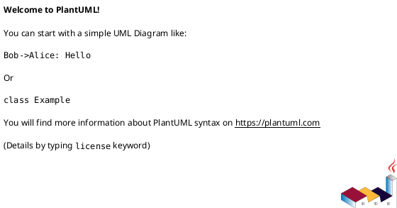
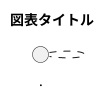

# PlantUML構文チェックポリシー - Zoom Video Mover

**適用範囲**: 全PlantUMLファイル（docs/uml/**/*.puml）  
**品質基準**: 構文エラー0件（必須）  
**更新日**: 2025-08-05

## 🎯 構文チェック環境

### 必須ツール
- **PlantUML**: `3rdparty/plantuml.jar`
- **Javaランタイム**: JRE/JDK 8以上
- **検証対象**: `docs/uml/`配下の全.pumlファイル

### 環境確認
```bash
# Java バージョン確認
java -version

# PlantUML バージョン確認
java -jar "C:\Users\toshi\Documents\project\zoom_video_mover\3rdparty\plantuml.jar" -version
```

## 📋 構文チェックコマンド

### 基本構文チェック
```bash
# 単一ファイルの構文チェック
java -jar "C:\Users\toshi\Documents\project\zoom_video_mover\3rdparty\plantuml.jar" -checkonly [ファイルパス]

# 複数ファイルの一括チェック
java -jar "C:\Users\toshi\Documents\project\zoom_video_mover\3rdparty\plantuml.jar" -checkonly "docs\uml\**\*.puml"

# 詳細エラー情報付きチェック
java -jar "C:\Users\toshi\Documents\project\zoom_video_mover\3rdparty\plantuml.jar" -checkonly -v [ファイルパス]
```

### 自動化スクリプト
```bash
# 全UMLファイル構文チェック
./scripts/check_plantuml_syntax.sh

# CI/CD統合用チェック
./scripts/ci_plantuml_validation.sh
```

## ⚠️ 一般的な構文エラーと対策

### 1. シーケンス図での`par`ブロック

#### ❌ 間違った記述
```plantuml
par
    A -> B: 処理1
and
    C -> D: 処理2  
end
```

#### ✅ 正しい記述
```plantuml
par
    A -> B: 処理1
else
    C -> D: 処理2  
end
```

**修正ポイント**: `par`ブロック内では`and`ではなく`else`を使用

### 2. Rustの`trait`表現

#### ❌ 間違った記述
```plantuml
trait AuthTrait {
    +authenticate()
}
```

#### ✅ 正しい記述
```plantuml
interface AuthTrait {
    +authenticate()
}
```

**修正ポイント**: Rustの`trait`は`interface`として定義

### 3. `rectangle`要素とノード

#### ❌ 間違った記述
```plantuml
rectangle "コンポーネント" {
    node [サーバー]
    node [データベース]
}
```

#### ✅ 正しい記述
```plantuml
rectangle "コンポーネント" as comp {
}
node [サーバー] as server
node [データベース] as db
comp --> server
comp --> db
```

**修正ポイント**: `rectangle`内部にノードを直接配置せず、関係で表現

### 4. 日本語エンコーディング

#### ❌ エラー原因
- ファイルがUTF-8以外でエンコードされている
- BOM付きUTF-8での問題

#### ✅ 正しい設定
```bash
# UTF-8（BOMなし）でファイル保存
# エディタ設定でエンコーディング確認
```

### 5. コメント記法

#### ❌ 間違った記述


#### ✅ 正しい記述


**修正ポイント**: PlantUMLでは`'`でコメント

## 🔍 エラー診断・対処手順

### Step 1: 基本構文チェック
```bash
java -jar "C:\Users\toshi\Documents\project\zoom_video_mover\3rdparty\plantuml.jar" -checkonly "問題のファイル.puml"
```

### Step 2: 詳細エラー情報取得
```bash
java -jar "C:\Users\toshi\Documents\project\zoom_video_mover\3rdparty\plantuml.jar" -checkonly -v "問題のファイル.puml"
```

### Step 3: エラーメッセージ解析
- **構文エラー**: 構文規則違反の修正
- **エンコーディングエラー**: UTF-8変換
- **未対応構文**: 代替記法への変更

### Step 4: 修正後の再チェック
```bash
# 修正後の構文チェック
java -jar "C:\Users\toshi\Documents\project\zoom_video_mover\3rdparty\plantuml.jar" -checkonly "修正済みファイル.puml"
```

## 📊 品質保証基準

### 必須達成基準
- **構文エラー**: 0件（例外なし）
- **エンコーディング**: UTF-8（BOMなし）統一
- **図表生成**: 正常な画像出力確認

### チェック頻度
- **ファイル作成時**: 即座に構文チェック実行
- **ファイル修正時**: 変更後に即座にチェック
- **CI/CD**: プッシュ時の自動チェック

### 品質監視
```bash
# 日次全体チェック
find docs/uml -name "*.puml" -exec java -jar "3rdparty/plantuml.jar" -checkonly {} \;

# 週次詳細レポート
./scripts/weekly_plantuml_report.sh
```

## 🚨 エラー対応プロセス

### 緊急度分類
- **🔴 緊急**: 構文エラーでCI/CDブロック
- **🟡 重要**: 図表生成失敗
- **🟢 通常**: 警告・最適化推奨

### 対応フロー
1. **エラー発見**: 構文チェックでの検出
2. **原因分析**: エラーメッセージの解析
3. **修正実施**: 上記対策に基づく修正
4. **再検証**: 修正後の構文チェック
5. **品質確認**: 図表生成の動作確認

## 🛠️ 開発支援ツール

### VSCode拡張
```json
{
  "plantuml.server": "http://localhost:8080",
  "plantuml.render": "PlantUMLServer",
  "plantuml.previewAutoUpdate": true
}
```

### エディタプラグイン
- **構文ハイライト**: PlantUML言語対応
- **リアルタイムプレビュー**: 編集中の図表確認
- **構文チェック**: 保存時の自動検証

### 自動フォーマット
```bash
# PlantUMLファイルの自動整形
java -jar "3rdparty/plantuml.jar" -syntax "入力ファイル.puml"
```

## 📋 PlantUMLファイル作成ガイドライン

### ファイル構造


### 命名規則
- **ファイル名**: `機能名_図表種類.puml`
- **例**: `auth_sequence.puml`, `system_component.puml`

### ディレクトリ構造
```
docs/uml/
├── architecture/     # アーキテクチャ図
├── sequence/        # シーケンス図
├── component/       # コンポーネント図
└── class/          # クラス図
```

## 🔄 継続的改善

### 改善項目
- **新規構文対応**: PlantUMLバージョンアップ対応
- **エラーパターン**: 頻出エラーの対策蓄積
- **自動化レベル**: チェック・修正の自動化

### 定期レビュー
- **月次**: エラーパターン分析・対策更新
- **四半期**: PlantUMLバージョン・ツール更新
- **年次**: 構文チェックポリシー見直し

---

**品質基準**: PlantUMLファイルは100%構文エラーなしを維持します。