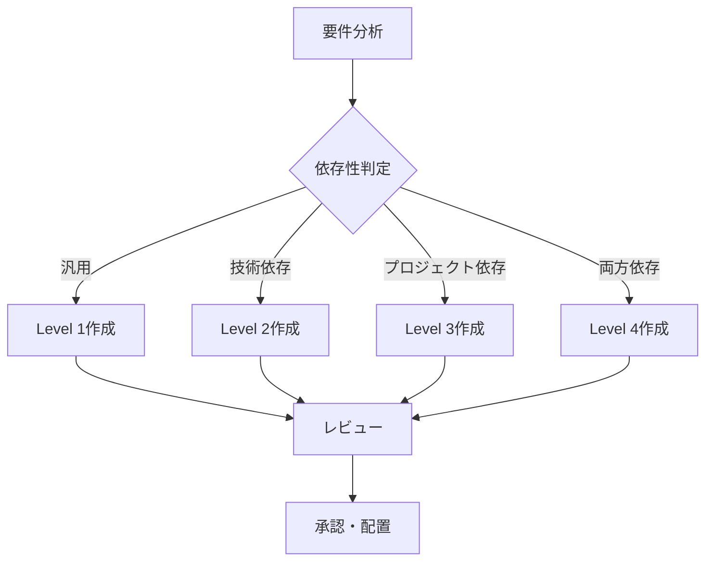

# ポリシー・ルール階層管理ガイドライン

## 1. 概要

本ガイドラインは、ソフトウェア開発プロジェクトにおけるポリシーとルールの階層的な管理方法を定義します。依存性レベルに基づく分類により、文書の再利用性を最大化し、保守性を向上させます。

## 2. 階層構造と依存性レベル

### 2.1 4段階の依存性レベル

```
┌────────────────────────────────────────────────────────┐
│  Level 1: 汎用                                         │
│  （プロジェクト非依存、技術要素非依存）                │
│  再利用性: ★★★★★                                    │
├────────────────────────────────────────────────────────┤
│  Level 2: 技術固有                                     │
│  （プロジェクト非依存、技術要素依存）                  │
│  再利用性: ★★★★☆                                    │
├────────────────────────────────────────────────────────┤
│  Level 3: プロジェクト汎用                             │
│  （プロジェクト依存、技術要素非依存）                  │
│  再利用性: ★★★☆☆                                    │
├────────────────────────────────────────────────────────┤
│  Level 4: プロジェクト固有                             │
│  （プロジェクト依存、技術要素依存）                    │
│  再利用性: ★★☆☆☆                                    │
└────────────────────────────────────────────────────────┘
```

## 3. Level 1: 汎用（Universal）

### 3.1 定義と特徴

**定義**: あらゆるプロジェクト、技術スタックで適用可能な普遍的なポリシー・ルール

**特徴**:
- 業界標準やベストプラクティスに基づく
- 抽象度が高く、実装詳細に依存しない
- 長期的に安定し、変更頻度が低い
- 組織全体で共有可能

### 3.2 ポリシー例

```markdown
# 品質管理ポリシー（汎用）

## 基本方針
- すべてのコードは peer review を受けなければならない
- 自動テストのカバレッジは80%以上を維持する
- セキュリティ脆弱性は最優先で対応する

## 文書化方針
- アーキテクチャ決定は ADR（Architecture Decision Record）で記録する
- APIは OpenAPI 仕様で文書化する
- 変更履歴は意味のあるコミットメッセージで記録する
```

### 3.3 ルール例

```markdown
# コードレビュールール（汎用）

## レビュー基準
1. 機能要件を満たしているか
2. 非機能要件（性能、セキュリティ）を考慮しているか
3. テストが適切に実装されているか
4. ドキュメントが更新されているか

## レビュープロセス
1. PR作成時に自動チェック実行
2. 最低1名のレビュアーによる承認
3. CI/CDパイプラインの成功
4. マージ前の最終確認
```

### 3.4 フォルダ構造

```
/docs/policies/universal/
├── quality_policy.md
├── security_policy.md
├── development_process_policy.md
└── documentation_policy.md

/docs/rules/universal/
├── code_review_rules.md
├── git_workflow_rules.md
├── testing_rules.md
└── documentation_rules.md
```

## 4. Level 2: 技術固有（Technology-Specific）

### 4.1 定義と特徴

**定義**: 特定の技術・言語・フレームワークに依存するが、プロジェクトには依存しないポリシー・ルール

**特徴**:
- 技術スタックごとに定義
- 同一技術を使用する複数プロジェクトで再利用可能
- 技術のバージョンアップに伴い更新が必要
- 技術コミュニティのベストプラクティスを反映

### 4.2 ポリシー例（Rust）

```markdown
# Rustコーディングポリシー（技術固有）

## メモリ安全性
- unsafe コードの使用は最小限に留める
- unsafe ブロックには必ず安全性の根拠をコメントする
- 所有権ルールを活用してメモリリークを防ぐ

## エラー処理
- Result<T, E> を使用して明示的なエラー処理を行う
- panic! は回復不可能なエラーのみに使用する
- カスタムエラー型は thiserror クレートで定義する
```

### 4.3 ルール例（React）

```markdown
# React コンポーネント設計ルール（技術固有）

## コンポーネント構造
1. 関数コンポーネントを優先使用
2. カスタムフックでロジックを分離
3. Props の型定義は必須（TypeScript）
4. メモ化は必要な場合のみ使用

## 状態管理
1. ローカル状態は useState/useReducer
2. グローバル状態は Context API または状態管理ライブラリ
3. 副作用は useEffect で管理
```

### 4.4 フォルダ構造

```
/docs/policies/technology-specific/
├── rust/
│   ├── memory_safety_policy.md
│   ├── error_handling_policy.md
│   └── async_policy.md
├── react/
│   ├── component_policy.md
│   └── state_management_policy.md
└── postgresql/
    ├── schema_design_policy.md
    └── query_optimization_policy.md

/docs/rules/technology-specific/
├── rust/
│   ├── naming_conventions.md
│   └── testing_rules.md
├── react/
│   └── component_rules.md
└── docker/
    └── containerization_rules.md
```

## 5. Level 3: プロジェクト汎用（Project-Generic）

### 5.1 定義と特徴

**定義**: 特定のプロジェクト・ドメインに依存するが、技術実装には依存しないポリシー・ルール

**特徴**:
- ビジネスロジックやドメイン知識を含む
- 技術スタックを変更しても有効
- 類似ドメインのプロジェクトで部分的に再利用可能
- ビジネス要件の変更に伴い更新される

### 5.2 ポリシー例（Zoom Video Mover）

```markdown
# 録画データ管理ポリシー（プロジェクト汎用）

## データ取得方針
- クラウド録画は所有者の明示的な許可のもとで取得する
- 一度に取得する録画数は制限し、サーバー負荷を考慮する
- 失敗した取得は自動リトライするが、上限を設ける

## データ保存方針
- 録画ファイルは日付とミーティング名で整理する
- メタデータは録画ファイルと同じディレクトリに保存する
- 重複ダウンロードを防ぐため、既存ファイルをチェックする
```

### 5.3 ルール例（E-Commerce）

```markdown
# 注文処理ビジネスルール（プロジェクト汎用）

## 在庫管理
1. 注文確定時に在庫を確保
2. 支払い失敗時は在庫を解放
3. 在庫不足時は代替商品を提案

## 価格計算
1. 基本価格 + 税金 + 送料
2. クーポン適用は税金計算前
3. ポイント使用は最終金額から減算
```

### 5.4 フォルダ構造

```
/docs/policies/project-generic/
├── zoom-video-mover/
│   ├── recording_management_policy.md
│   ├── authentication_policy.md
│   └── data_privacy_policy.md
└── e-commerce-platform/
    ├── order_processing_policy.md
    └── inventory_policy.md

/docs/rules/project-generic/
├── zoom-video-mover/
│   ├── file_naming_rules.md
│   └── api_usage_rules.md
└── e-commerce-platform/
    └── business_rules.md
```

## 6. Level 4: プロジェクト固有（Project-Specific）

### 6.1 定義と特徴

**定義**: 特定のプロジェクトかつ特定の技術スタックに完全に依存するポリシー・ルール

**特徴**:
- 最も具体的で詳細な実装指針
- 再利用性は低いが、実装に直結
- プロジェクト固有の要件や制約を反映
- 頻繁に更新される可能性がある

### 6.2 ポリシー例（Zoom Video Mover + Rust）

```markdown
# Zoom API統合実装ポリシー（プロジェクト固有）

## OAuth実装
- reqwest クレートを使用してHTTPリクエストを実行
- トークンは keyring クレートでOS資格情報ストアに保存
- リフレッシュトークンの更新は tokio::spawn で非同期実行

## エラー処理
- Zoom API エラーは thiserror でカスタムエラー型定義
- レート制限エラーは exponential backoff でリトライ
- ネットワークエラーは最大3回まで自動リトライ
```

### 6.3 ルール例（E-Commerce + Next.js）

```markdown
# Next.js実装ルール（プロジェクト固有）

## ページ構成
1. 商品一覧: /pages/products/index.tsx (ISR使用)
2. 商品詳細: /pages/products/[id].tsx (SSG + ISR)
3. カート: /pages/cart.tsx (CSR)
4. 決済: /pages/checkout/[step].tsx (SSR)

## API Routes
- /api/products/* - 商品関連API
- /api/cart/* - カート操作API
- /api/order/* - 注文処理API
- 認証は NextAuth.js のミドルウェアで実装
```

### 6.4 フォルダ構造

```
/docs/policies/project-specific/
├── zoom-video-mover-rust/
│   ├── zoom_api_integration.md
│   ├── egui_implementation.md
│   └── windows_specific.md
└── e-commerce-nextjs/
    ├── nextjs_architecture.md
    └── vercel_deployment.md

/docs/rules/project-specific/
├── zoom-video-mover-rust/
│   ├── api_error_handling.md
│   └── gui_state_management.md
└── e-commerce-nextjs/
    └── implementation_rules.md
```

## 7. 依存性管理

### 7.1 上位レベルへの依存

```
Level 4 は Level 3, 2, 1 に依存
    ↑
Level 3 は Level 1 に依存
    ↑
Level 2 は Level 1 に依存
    ↑
Level 1 は独立（依存なし）
```

### 7.2 継承と上書き

**原則**: 下位レベルは上位レベルのポリシー・ルールを継承し、必要に応じて詳細化・特殊化する

```yaml
# 継承の例
Level 1: "エラーは適切に処理する"
  ↓ 継承・詳細化
Level 2 (Rust): "Result<T,E> 型を使用する"
  ↓ 継承・詳細化
Level 4: "Zoom APIエラーは独自エラー型で処理"
```

### 7.3 矛盾の解決

下位レベルのルールが上位レベルと矛盾する場合：
1. 原則として上位レベルを尊重
2. 技術的制約により不可能な場合は、理由を文書化
3. 例外として管理し、定期的に見直し

## 8. 文書管理プロセス

### 8.1 新規作成フロー



### 8.2 更新管理

| レベル | 更新頻度 | 承認者 | 影響分析 |
|--------|----------|--------|----------|
| Level 1 | 年1-2回 | 組織CTO | 全プロジェクト |
| Level 2 | 四半期 | 技術リード | 同一技術プロジェクト |
| Level 3 | 月次 | PO/PM | 当該プロジェクト |
| Level 4 | 随時 | チームリード | 実装チーム |

### 8.3 廃止管理

1. 使用状況の定期確認（四半期）
2. 6ヶ月未使用の文書は廃止候補
3. 廃止前に影響分析実施
4. アーカイブフォルダへ移動

## 9. 実装例

### 9.1 新規プロジェクト開始時

1. **Level 1 文書の確認**
   - 組織標準ポリシーを確認
   - 適用するルールを選定

2. **Level 2 文書の選定**
   - 使用技術スタックを決定
   - 該当する技術固有文書を選定

3. **Level 3 文書の作成**
   - プロジェクト固有のビジネスルール定義
   - ドメイン用語集作成

4. **Level 4 文書の作成**
   - 実装詳細の文書化
   - プロジェクト固有の統合仕様

### 9.2 技術スタック変更時

```
現状: React (Level 2) + E-Commerce (Level 3)
変更: Vue.js (Level 2) + E-Commerce (Level 3)

対応:
1. Level 1, 3 は変更なし
2. Level 2 を React → Vue.js に変更
3. Level 4 を全面的に見直し
```

## 10. 品質チェックリスト

### 10.1 ポリシー品質基準

- [ ] 依存性レベルが適切に判定されている
- [ ] 上位レベルとの整合性が保たれている
- [ ] 測定可能な基準が含まれている
- [ ] 例外事項が明記されている

### 10.2 ルール品質基準

- [ ] 実行可能で具体的な内容
- [ ] 検証方法が明確
- [ ] ツールとの連携方法が記載
- [ ] サンプルコードや例が含まれる

### 10.3 配置確認

- [ ] 正しいレベルのフォルダに配置
- [ ] 命名規則に従っている
- [ ] 関連文書へのリンクが設定
- [ ] メタデータ（作成日、更新日、作成者）が記載

## 11. メリットと期待効果

### 11.1 再利用性の向上

- Level 1, 2 の文書は複数プロジェクトで活用
- 新規プロジェクトの立ち上げ時間短縮
- ベストプラクティスの組織的蓄積

### 11.2 保守性の向上

- 依存関係が明確で影響分析が容易
- 更新箇所の特定が簡単
- 技術変更時の対応範囲が明確

### 11.3 品質の向上

- 上位レベルの品質基準が自動的に適用
- 組織全体での品質の均一化
- レビュー基準の明確化

### 11.4 知識管理

- 暗黙知の形式知化
- 技術ノウハウの体系的管理
- オンボーディングの効率化

## まとめ

本ガイドラインに従ってポリシー・ルールを階層的に管理することで：

1. **体系的な文書管理**: 4段階のレベルによる明確な分類
2. **最適な再利用**: 依存性に応じた適切な抽象度
3. **効率的な保守**: 影響範囲の明確化と更新の局所化
4. **品質の担保**: 上位レベルからの品質基準の継承
5. **知識の蓄積**: 組織的なノウハウの体系化

これにより、プロジェクトの規模や技術スタックに関わらず、一貫性のある高品質な開発プロセスを実現できます。