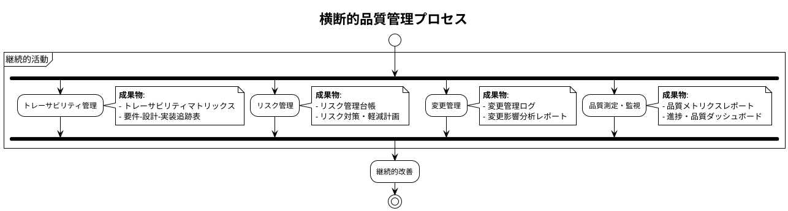
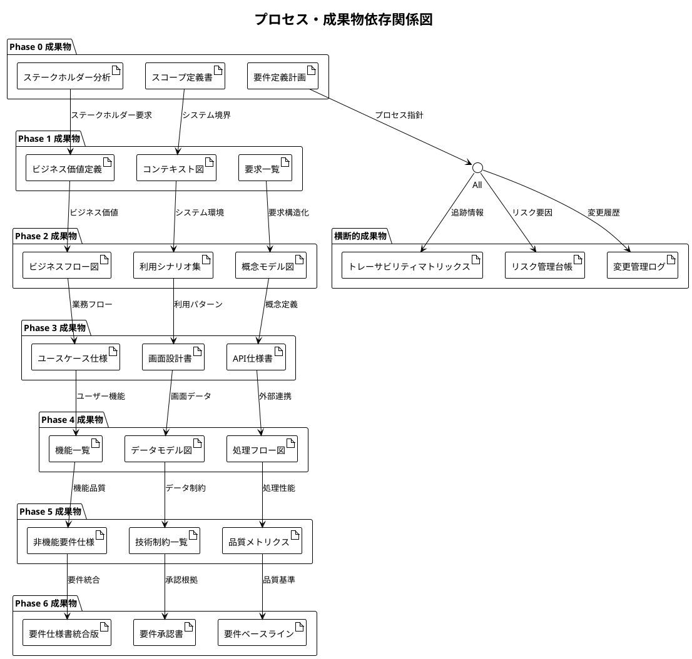
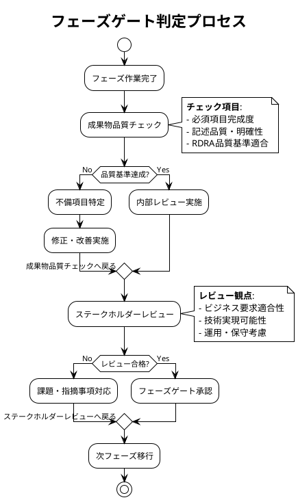
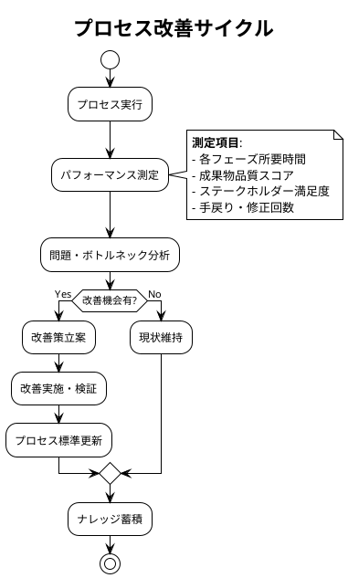
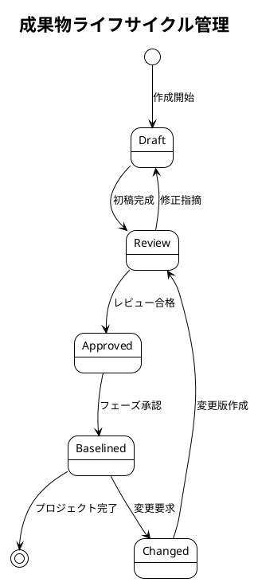

# 要件定義プロセスフロー図（PFD）

## 文書概要
**プロジェクト名**: Zoom Video Mover  
**作成日**: 2025-08-02  
**作成者**: プロセス設計チーム  
**文書種別**: プロセスフロー図（Process Flow Diagram）  

## 要件定義プロセス全体PFD

### メインプロセスフロー

```plantuml
@startuml
!theme plain
title 要件定義プロセスフロー図（PFD）

start

partition "Phase 0: プロジェクト準備段階" {
  :プロジェクト開始;
  
  :ステークホルダー特定・分析;
  note right
    **成果物**:
    - ステークホルダー分析シート
    - 影響力×関心度マトリックス
  end note
  
  :プロジェクトスコープ定義;
  note right
    **成果物**:
    - プロジェクトスコープ定義書
    - システム境界図
  end note
  
  :要件定義計画策定;
  note right
    **成果物**:
    - 要件定義計画書
    - スケジュール・役割分担
  end note
  
  :Phase 0 品質ゲート;
  if (品質基準達成?) then (No)
    :修正・改善;
    -> Phase 0活動へ戻る;
  else (Yes)
    :Phase 0 承認;
  endif
}

partition "Phase 1: システム価値分析（RDRA Layer 1）" {
  :ビジネス価値・目的明確化;
  note right
    **成果物**:
    - ビジネス価値定義書
    - ROI・効果分析
  end note
  
  :コンテキストモデル作成;
  note right
    **成果物**:
    - コンテキスト図
    - システム環境分析
  end note
  
  :要求モデル構築;
  note right
    **成果物**:
    - ステークホルダー要求一覧
    - 要求優先度マトリックス
  end note
  
  :Phase 1 品質ゲート;
  if (システム価値定量化完了?) then (No)
    :要求調整・分析;
    -> Phase 1活動へ戻る;
  else (Yes)
    :Phase 1 承認;
  endif
}

partition "Phase 2: 外部環境・利用状況分析（RDRA Layer 2）" {
  :ビジネスモデル分析;
  note right
    **成果物**:
    - ビジネスフロー図（As-Is/To-Be）
    - 業務改善ポイント
  end note
  
  :利用シナリオ作成;
  note right
    **成果物**:
    - 利用シナリオ集
    - ユーザージャーニー
  end note
  
  :概念モデル構築;
  note right
    **成果物**:
    - 概念モデル図
    - ドメイン用語集
  end note
  
  :Phase 2 品質ゲート;
  if (利用シナリオ網羅完了?) then (No)
    :シナリオ拡充・用語統一;
    -> Phase 2活動へ戻る;
  else (Yes)
    :Phase 2 承認;
  endif
}

partition "Phase 3: システム境界・相互作用定義（RDRA Layer 3）" {
  :ユースケース分析;
  note right
    **成果物**:
    - ユースケース図・仕様書
    - アクター・フロー定義
  end note
  
  :画面・入出力設計;
  note right
    **成果物**:
    - 画面設計書
    - UI/UXガイドライン
  end note
  
  :外部インターフェース定義;
  note right
    **成果物**:
    - API仕様書
    - プロトコル・通信仕様
  end note
  
  :Phase 3 品質ゲート;
  if (UI/UX要件具体化完了?) then (No)
    :インターフェース詳細化;
    -> Phase 3活動へ戻る;
  else (Yes)
    :Phase 3 承認;
  endif
}

partition "Phase 4: システム内部機能・データ設計（RDRA Layer 4）" {
  :機能分解・階層化;
  note right
    **成果物**:
    - 機能一覧・機能分解図
    - 機能依存関係
  end note
  
  :データモデル設計;
  note right
    **成果物**:
    - データモデル図・ER図
    - データ制約・関係
  end note
  
  :アルゴリズム・処理方式検討;
  note right
    **成果物**:
    - 処理フロー図
    - アルゴリズム仕様
  end note
  
  :Phase 4 品質ゲート;
  if (機能分解・データ設計完了?) then (No)
    :設計詳細化・最適化;
    -> Phase 4活動へ戻る;
  else (Yes)
    :Phase 4 承認;
  endif
}

partition "Phase 5: 非機能要件定義・制約整理" {
  :品質要件定義;
  note right
    **成果物**:
    - 非機能要件仕様書
    - 品質メトリクス定義
  end note
  
  :技術制約・環境制約整理;
  note right
    **成果物**:
    - 技術制約一覧
    - 環境要件仕様
  end note
  
  :コンプライアンス・標準適合;
  note right
    **成果物**:
    - コンプライアンス要件一覧
    - 標準適合チェックリスト
  end note
  
  :Phase 5 品質ゲート;
  if (非機能要件測定可能?) then (No)
    :要件具体化・基準設定;
    -> Phase 5活動へ戻る;
  else (Yes)
    :Phase 5 承認;
  endif
}

partition "Phase 6: 要件統合・検証・承認" {
  :要件統合・整合性確認;
  note right
    **成果物**:
    - 要件仕様書（統合版）
    - 整合性チェック結果
  end note
  
  :要件検証・妥当性確認;
  note right
    **成果物**:
    - 要件レビュー議事録
    - 妥当性確認レポート
  end note
  
  :要件承認・ベースライン化;
  note right
    **成果物**:
    - 要件承認書
    - 要件ベースライン
  end note
  
  :Phase 6 品質ゲート;
  if (全ステークホルダー承認完了?) then (No)
    :課題解決・合意形成;
    -> Phase 6活動へ戻る;
  else (Yes)
    :最終承認;
  endif
}

:要件定義完了;
:設計フェーズ移行;

stop

@enduml
```

## 横断的プロセス・成果物関係

### 継続的品質管理プロセス

### プロセス相互依存関係

## プロセス品質ゲート詳細

### フェーズゲート判定基準

### 成果物品質基準

| フェーズ | 品質基準 | 測定方法 | 合格基準 |
|----------|----------|----------|----------|
| **Phase 0** | ステークホルダー合意・スコープ確定 | チェックリスト確認 | 100%完成 |
| **Phase 1** | システム価値定量化・要求優先度 | ROI計算・優先度マトリックス | 定量化完了 |
| **Phase 2** | 利用シナリオ網羅・用語統一 | シナリオカバレッジ・用語整合性 | 95%以上 |
| **Phase 3** | ユースケース完成・UI要件具体化 | 機能カバレッジ・UI仕様完成度 | 100%定義 |
| **Phase 4** | 機能分解・データモデル・処理方式 | 機能網羅性・データ整合性 | 設計可能レベル |
| **Phase 5** | 非機能要件測定可能・制約確認 | 測定可能性・制約妥当性 | 100%測定可能 |
| **Phase 6** | 要件統合・承認・トレーサビリティ | 整合性・承認完了・追跡可能性 | 100%達成 |

## プロセス改善・最適化

### プロセス効率化ポイント

### 効率化施策

#### 1. 並行作業の促進
- **Phase 1-2**: ビジネス価値分析と利用シナリオ作成の部分並行
- **Phase 3-4**: UI設計と機能設計の協調作業
- **横断的**: リスク管理・変更管理の継続実施

#### 2. テンプレート・ツール活用
- **標準テンプレート**: 各成果物の品質・効率向上
- **自動化ツール**: トレーサビリティマトリックス自動生成
- **レビュー効率化**: チェックリスト・ガイドライン整備

#### 3. ステークホルダーエンゲージメント最適化
- **事前準備**: レビュー資料の事前配布・予習
- **集中レビュー**: 重要意思決定の集約実施
- **非同期確認**: 軽微な確認事項の非同期処理

## 成果物管理・トレーサビリティ

### 成果物ライフサイクル

### トレーサビリティ管理

| トレーサビリティタイプ | 追跡方向 | 管理方法 | 更新頻度 |
|----------------------|----------|----------|----------|
| **前方トレーサビリティ** | 要求→設計→実装→テスト | マトリックス表 | リアルタイム |
| **後方トレーサビリティ** | テスト←実装←設計←要求 | 影響分析表 | 変更時 |
| **横方向トレーサビリティ** | 要求↔要求、設計↔設計 | 関係図 | フェーズ完了時 |

---

**プロセス承認**:  
プロセス設計責任者: [ ] 承認  
品質管理責任者: [ ] 承認  
プロジェクトマネージャー: [ ] 承認  

**承認日**: ___________