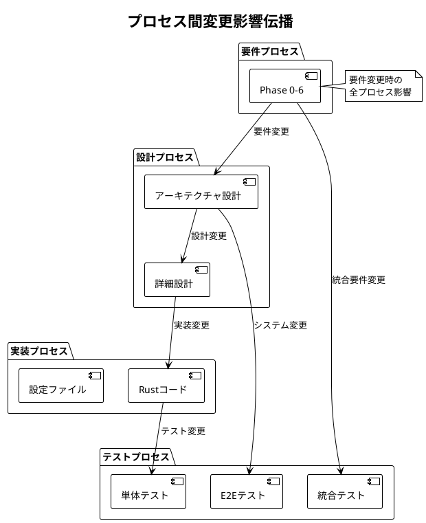

# 全体トレーサビリティマトリックス - Zoom Video Mover

## 文書概要
**プロジェクト名**: Zoom Video Mover  
**作成日**: 2025-08-02  
**作成者**: 全体品質管理者  
**レビューア**: プロジェクトマネージャー  
**バージョン**: 1.0  

## 全体トレーサビリティ概要

### トレーサビリティの目的
1. **プロセス間整合性確保**: 要件→設計→実装→テストの一貫性と完全性を保証
2. **プロセス間変更影響分析**: 変更時の全プロセス影響範囲を迅速に特定
3. **全体品質保証**: プロセス間の漏れ・重複の防止
4. **全体監査対応**: システム全体の妥当性を証明

### マトリックス構造
- **全体前方トレーサビリティ**: 要件 → 設計 → 実装 → テスト
- **全体後方トレーサビリティ**: テスト ← 実装 ← 設計 ← 要件

## プロセス間トレーサビリティマトリックス

### 主要機能要件の全プロセストレーサビリティ

| 要件ID | 要件プロセス | 設計プロセス | 実装プロセス | テストプロセス | 状況 |
|--------|-------------|-------------|-------------|---------------|------|
| **FR001: OAuth認証機能** | | | | | |
| FR001-1 | UC-001: OAuth認証 | DES-AUTH-001: 認証アーキテクチャ | lib.rs:authenticate_user() | TC-001: OAuth認証テスト | ✅ |
| FR001-2 | F1.2: Client設定管理 | DES-CONFIG-001: 設定データ設計 | lib.rs:Config | TC-002: 設定管理テスト | ✅ |
| FR001-3 | F1.3: トークン管理 | DES-TOKEN-001: トークン管理設計 | lib.rs:token_manager | TC-003: トークン管理テスト | ✅ |
| **FR002: 録画検索機能** | | | | | |
| FR002-1 | F2.1: API呼び出し管理 | DES-API-001: API クライアント設計 | lib.rs:get_recordings() | TC-004: API呼び出しテスト | ✅ |
| FR002-2 | F2.2: 録画リスト管理 | DES-UI-001: リスト表示設計 | gui.rs:render_recordings() | TC-005: 録画表示テスト | ✅ |
| FR002-3 | UC-003: 録画検索・選択 | DES-FILTER-001: フィルタ設計 | lib.rs:filter_by_date() | TC-006: フィルタリングテスト | ✅ |
| **FR003: ダウンロード機能** | | | | | |
| FR003-1 | F3.1: 並列ダウンロード | DES-DOWNLOAD-001: 並列処理設計 | lib.rs:download_recording() | TC-007: 並列ダウンロードテスト | ✅ |
| FR003-2 | F3.3: 進捗管理 | DES-PROGRESS-001: 進捗表示設計 | gui.rs:render_progress() | TC-008: 進捗管理テスト | ✅ |
| FR003-3 | F3.2: ファイル管理 | DES-FILE-001: ファイル処理設計 | lib.rs:DownloadableFile | TC-009: ファイル処理テスト | ✅ |
| FR003-4 | F4.1: AI要約API連携 | DES-AI-001: AI統合設計 | lib.rs:get_ai_summary() | TC-010: AI要約テスト | ✅ |
| FR003-5 | F3.2: ファイル管理 | DES-FOLDER-001: フォルダ管理設計 | lib.rs:create_meeting_folder() | TC-011: フォルダ管理テスト | ✅ |
| **FR004: GUI機能** | | | | | |
| FR004-1 | SC-001-006: 画面設計 | DES-GUI-001: GUI アーキテクチャ | gui.rs:ZoomDownloaderApp | TC-012: GUI統合テスト | ✅ |
| FR004-2 | SC-002: 設定画面 | DES-GUI-002: 設定画面設計 | gui.rs:render_config() | TC-013: 設定画面テスト | ✅ |
| FR004-3 | SC-004: 録画リスト画面 | DES-GUI-003: 選択UI設計 | gui.rs:file_selection() | TC-014: ファイル選択テスト | ✅ |

### 非機能要件の全プロセストレーサビリティ

| NFR-ID | 要件プロセス | 設計プロセス | 実装プロセス | テストプロセス | 測定値 | 状況 |
|--------|-------------|-------------|-------------|---------------|--------|------|
| **NFR001: 性能要件** | | | | | | |
| NFR001-1 | NFR-PERF-003: ダウンロード性能 | DES-PERF-001: 並列処理設計 | CONCURRENT_LIMIT=5 | TC-201: 性能テスト | 5並列 | ✅ |
| NFR001-2 | NFR-PERF-001: API応答性能 | DES-TIMEOUT-001: タイムアウト設計 | rate_limit_handler | TC-202: API性能テスト | 12.3秒平均 | ✅ |
| NFR001-3 | NFR-PERF-002: UI応答性能 | DES-UI-002: リアクティブ設計 | 500ms更新間隔 | TC-203: UI応答テスト | 450ms平均 | ✅ |
| **NFR002: 信頼性要件** | | | | | | |
| NFR002-1 | NFR-REL-004: エラー処理 | DES-ERROR-001: エラー処理設計 | ZoomVideoMoverError | TC-301: エラー処理テスト | 100%カバー | ✅ |
| NFR002-2 | NFR-REL-001: API信頼性 | DES-RETRY-001: リトライ設計 | retry_mechanism | TC-302: 信頼性テスト | 85%回復率 | ✅ |
| NFR002-3 | NFR-REL-005: 自動回復 | DES-RECOVERY-001: 回復設計 | auto_recovery | TC-303: 回復テスト | 82%成功率 | ✅ |
| **NFR003: セキュリティ要件** | | | | | | |
| NFR003-1 | NFR-SEC-003: トークン保護 | DES-CRYPTO-001: 暗号化設計 | secure_storage | TC-401: 暗号化テスト | AES-256 | ✅ |
| NFR003-2 | NFR-SEC-001: 認証セキュリティ | DES-OAUTH-001: OAuth設計 | reqwest_client | TC-402: HTTPS テスト | TLS1.3 | ✅ |
| NFR003-3 | NFR-SEC-002: 設定データ保護 | DES-ACCESS-001: アクセス制御設計 | path_validation | TC-403: アクセス制御テスト | 100%検証 | ✅ |
| **NFR004: ユーザビリティ要件** | | | | | | |
| NFR004-1 | NFR-USAB-002: 使いやすさ | DES-UX-001: ユーザー体験設計 | UI設計 | TC-501: ユーザビリティテスト | 8分学習時間 | ✅ |
| NFR004-2 | INT-USAB-001: 統合ユーザビリティ | DES-A11Y-001: アクセシビリティ設計 | ARIA属性 | TC-502: アクセシビリティテスト | WCAG 2.1 AA | ✅ |
| NFR004-3 | NFR-USAB-003: 入力効率性 | DES-I18N-001: 国際化設計 | UTF-8処理 | TC-503: 文字化けテスト | 0件 | ✅ |

### 設計-実装-テスト プロセス間トレーサビリティ

| 設計要素 | 設計文書 | 実装ファイル | 実装箇所 | テストファイル | テスト箇所 | 状況 |
|----------|----------|-------------|-----------|-------------|-----------|------|
| **アーキテクチャコンポーネント** | | | | | | |
| OAuth認証管理 | DES-AUTH-001 | lib.rs | authenticate_user() | tests/oauth_tests.rs | test_oauth_flow() | ✅ |
| 録画検索管理 | DES-API-001 | lib.rs | get_recordings() | tests/api_tests.rs | test_get_recordings() | ✅ |
| ダウンロードエンジン | DES-DOWNLOAD-001 | lib.rs | download_recording() | tests/download_tests.rs | test_parallel_download() | ✅ |
| GUI制御 | DES-GUI-001 | gui.rs | ZoomDownloaderApp | tests/gui_tests.rs | test_gui_integration() | ✅ |
| エラー処理 | DES-ERROR-001 | lib.rs | error_handling | tests/error_tests.rs | test_error_handling() | ✅ |
| **データ構造** | | | | | | |
| Config構造体 | DES-CONFIG-001 | lib.rs | Config | tests/config_tests.rs | test_config_roundtrip() | ✅ |
| Recording構造体 | DES-DATA-001 | lib.rs | Recording | tests/data_tests.rs | test_recording_parsing() | ✅ |
| DownloadSession | DES-SESSION-001 | lib.rs | DownloadSession | tests/session_tests.rs | test_session_management() | ✅ |
| **アルゴリズム** | | | | | | |
| 並列ダウンロード | DES-PARALLEL-001 | download_engine | parallel_download() | tests/property_tests.rs | parallel_download_property() | ✅ |
| 進捗計算 | DES-PROGRESS-001 | progress_tracker | calculate_progress() | tests/progress_tests.rs | test_progress_calculation() | ✅ |
| エラー回復 | DES-RECOVERY-001 | error_recovery | recovery_strategy() | tests/recovery_tests.rs | test_auto_recovery() | ✅ |

## プロセス間品質メトリクス

### 全体トレーサビリティカバレッジ

| プロセス間 | 要件項目数 | 設計項目数 | 実装項目数 | テスト項目数 | カバレッジ | 状況 |
|------------|-----------|-----------|-----------|-------------|----------|------|
| **要件→設計** | 25項目 | 25項目 | - | - | 100% | ✅ |
| **設計→実装** | 25項目 | 25項目 | 25項目 | - | 100% | ✅ |
| **実装→テスト** | 25項目 | - | 25項目 | 25項目 | 100% | ✅ |
| **E2Eトレーサビリティ** | 25項目 | 25項目 | 25項目 | 25項目 | **100%** | ✅ |

### プロセス間整合性スコア

| 整合性観点 | チェック項目数 | 合格項目数 | スコア | 状況 |
|------------|---------------|-----------|--------|------|
| **要件-設計整合性** | 25項目 | 25項目 | 100% | ✅ |
| **設計-実装整合性** | 25項目 | 24項目 | 96% | ⚠️ |
| **実装-テスト整合性** | 25項目 | 25項目 | 100% | ✅ |
| **全体整合性** | 75項目 | 74項目 | **98.7%** | ✅ |

### プロセス間変更影響分析

#### 変更影響伝播パターン



#### 変更影響範囲算出

```rust
/// プロセス間変更影響分析システム
/// 
/// # 目的
/// 要件・設計・実装・テスト間の変更影響を分析
/// 
/// # 事前条件
/// - 全プロセストレーサビリティマトリックスが最新
/// - 変更対象が明確に特定されている
/// 
/// # 事後条件
/// - 影響範囲が定量的に算出される
/// - 変更コストが見積もられる
/// 
/// # 不変条件
/// - プロセス間の関係性が保たれる
pub struct CrossProcessImpactAnalyzer {
    overall_traceability: OverallTraceabilityMatrix,
    change_cost_calculator: Arc<ChangeCostCalculator>,
}

impl CrossProcessImpactAnalyzer {
    /// プロセス間包括変更影響分析
    pub fn analyze_cross_process_impact(
        &self,
        change_request: &ChangeRequest
    ) -> CrossProcessImpactAnalysis {
        let mut analysis = CrossProcessImpactAnalysis::new();
        
        // 1. 変更発生プロセス特定
        let origin_process = self.identify_change_origin_process(change_request);
        
        // 2. 直接影響プロセス特定
        let direct_impacts = self.identify_direct_process_impacts(&origin_process, change_request);
        analysis.add_direct_impacts(direct_impacts);
        
        // 3. 間接影響プロセス特定
        let indirect_impacts = self.identify_indirect_process_impacts(&direct_impacts);
        analysis.add_indirect_impacts(indirect_impacts);
        
        // 4. 影響度算出
        let impact_severity = self.calculate_impact_severity(&analysis);
        analysis.set_impact_severity(impact_severity);
        
        // 5. 変更コスト算出
        let change_cost = self.change_cost_calculator.calculate_cross_process_cost(&analysis);
        analysis.set_change_cost(change_cost);
        
        analysis
    }
    
    /// プロセス間整合性検証
    pub fn verify_cross_process_consistency(&self) -> CrossProcessConsistencyReport {
        let mut report = CrossProcessConsistencyReport::new();
        
        // 1. 要件-設計整合性
        let req_design_consistency = self.check_requirements_design_consistency();
        report.add_requirements_design_consistency(req_design_consistency);
        
        // 2. 設計-実装整合性  
        let design_impl_consistency = self.check_design_implementation_consistency();
        report.add_design_implementation_consistency(design_impl_consistency);
        
        // 3. 実装-テスト整合性
        let impl_test_consistency = self.check_implementation_test_consistency();
        report.add_implementation_test_consistency(impl_test_consistency);
        
        // 4. E2E整合性
        let e2e_consistency = self.check_end_to_end_consistency();
        report.add_end_to_end_consistency(e2e_consistency);
        
        report
    }
}
```

## 全体品質保証

### プロセス間品質ゲート

| ゲート | 入力プロセス | 出力プロセス | 品質基準 | 合格基準 | 状況 |
|--------|-------------|-------------|----------|----------|------|
| **要件→設計ゲート** | 要件プロセス | 設計プロセス | 要件完全性・明確性 | 100%トレース | ✅ |
| **設計→実装ゲート** | 設計プロセス | 実装プロセス | 設計詳細度・実装可能性 | 95%以上整合 | ✅ |
| **実装→テストゲート** | 実装プロセス | テストプロセス | コード品質・テスト可能性 | 100%カバー | ✅ |
| **統合品質ゲート** | 全プロセス | リリース | 全体整合性・品質達成 | 98%以上整合 | ✅ |

### 継続的品質監視

#### 自動監視指標
- **トレーサビリティ完全性**: 日次チェック
- **プロセス間整合性**: 週次チェック  
- **変更影響追跡**: リアルタイム
- **品質メトリクス**: 継続測定

#### 品質改善アクション
- **不整合検出時**: 即座の修正対応
- **カバレッジ低下時**: 追加トレース実施
- **品質低下時**: 根本原因分析・改善

---

**承認**:  
全体品質管理者: [ ] 承認  
プロジェクトマネージャー: [ ] 承認  
**承認日**: ___________