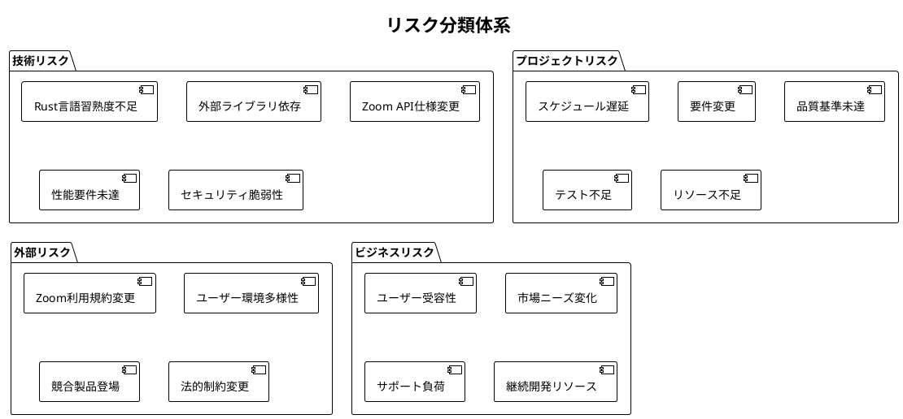
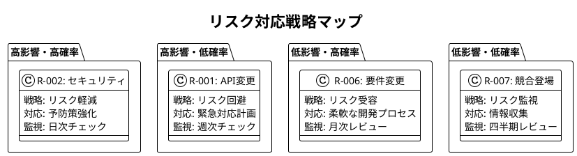
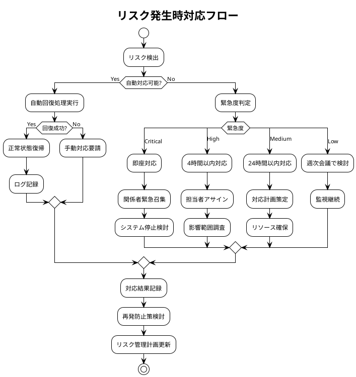

# リスク管理計画書 - Zoom Video Mover

## 文書概要
**プロジェクト名**: Zoom Video Mover  
**作成日**: 2025-08-02  
  
**バージョン**: 1.0  

## リスク管理概要

### リスク管理の目的
1. **プロジェクト成功確率向上**: 潜在的リスクの早期特定・対策
2. **品質保証**: リスクによる品質低下の防止
3. **スケジュール管理**: リスクによる遅延の最小化
4. **コスト管理**: 想定外コストの抑制

### リスク管理プロセス
1. **リスク特定**: 潜在的リスクの洗い出し
2. **リスク分析**: 発生確率・影響度の評価
3. **リスク評価**: 優先度の決定
4. **リスク対応**: 対策の策定・実行
5. **リスク監視**: 継続的な状況確認

## リスク分類体系

### リスクカテゴリ



## 詳細リスク分析

### 高リスク項目（優先度：緊急）

#### R-001: Zoom API仕様変更リスク
- **リスク内容**: Zoom側のAPI仕様変更により既存実装が動作しなくなる
- **発生確率**: 中（30%）
- **影響度**: 高（システム全体停止）
- **リスクスコア**: 90
- **影響範囲**: 認証機能、録画取得、ダウンロード機能
- **早期警告指標**: 
  - Zoom開発者向け通知
  - APIレスポンス形式変化
  - 認証エラー頻発
- **対策**:
  - **予防策**: API バージョニング対応、Zoom開発者情報の定期確認
  - **軽減策**: APIラッパー層の実装、下位互換性コード
  - **緊急対応**: 代替API調査、ユーザー通知、修正版リリース
- **責任者**: 技術リーダー
- **監視頻度**: 週次

#### R-002: OAuth認証セキュリティリスク
- **リスク内容**: 認証情報の漏洩・不正アクセス
- **発生確率**: 低（10%）
- **影響度**: 最高（ユーザー情報漏洩）
- **リスクスコア**: 95
- **影響範囲**: 全ユーザーデータ、システム信頼性
- **早期警告指標**:
  - 異常な認証試行
  - セキュリティ監査結果
  - 外部脆弱性報告
- **対策**:
  - **予防策**: AES-256暗号化、DPAPI使用、コードレビュー強化
  - **軽減策**: アクセスログ監視、自動ロックアウト
  - **緊急対応**: 緊急アクセス停止、ユーザー通知、セキュリティパッチ
- **責任者**: セキュリティエンジニア
- **監視頻度**: 日次

#### R-003: 性能要件未達リスク
- **リスク内容**: ダウンロード速度・UI応答性が目標値を下回る
- **発生確率**: 中（25%）
- **影響度**: 中（ユーザビリティ低下）
- **リスクスコア**: 75
- **影響範囲**: ユーザー満足度、競合優位性
- **早期警告指標**:
  - ベンチマークテスト結果
  - ユーザーフィードバック
  - システムリソース使用量
- **対策**:
  - **予防策**: 継続的性能テスト、最適化優先実装
  - **軽減策**: 並列処理最適化、メモリ効率化
  - **緊急対応**: 性能改善パッチ、設定チューニングガイド
- **責任者**: 性能エンジニア
- **監視頻度**: 日次

### 中リスク項目（優先度：重要）

#### R-004: Rust言語習熟度不足リスク
- **リスク内容**: Rustエコシステムの理解不足により開発効率低下
- **発生確率**: 中（40%）
- **影響度**: 中（開発速度低下）
- **リスクスコア**: 60
- **対策**:
  - **予防策**: 継続的学習、コミュニティ参加、コードレビュー
  - **軽減策**: 既存ライブラリ活用、段階的実装
  - **緊急対応**: 外部コンサルティング、実装方針変更

#### R-005: ユーザー環境多様性リスク
- **リスク内容**: 多様なWindows環境での動作不良
- **発生確率**: 中（35%）
- **影響度**: 中（一部ユーザー利用不可）
- **リスクスコア**: 55
- **対策**:
  - **予防策**: 多環境テスト、最小システム要件明示
  - **軽減策**: 環境検出機能、代替実装
  - **緊急対応**: 環境別修正版、回避手順提供

#### R-006: 要件変更リスク
- **リスク内容**: 開発中の要件変更によるスケジュール影響
- **発生確率**: 高（50%）
- **影響度**: 低（軽微な調整）
- **リスクスコア**: 50
- **対策**:
  - **予防策**: 要件凍結期間設定、変更管理プロセス
  - **軽減策**: アジャイル開発、モジュラー設計
  - **緊急対応**: 優先度再評価、段階的リリース

### 低リスク項目（優先度：監視）

#### R-007: 競合製品登場リスク
- **リスク内容**: 類似機能を持つ競合製品の登場
- **発生確率**: 中（30%）
- **影響度**: 低（差別化可能）
- **リスクスコア**: 30
- **対策**:
  - **予防策**: 独自機能開発、ユーザビリティ向上
  - **軽減策**: 機能拡張、コミュニティ構築

#### R-008: サポート負荷増大リスク
- **リスク内容**: ユーザー増加によるサポート対応負荷
- **発生確率**: 高（60%）
- **影響度**: 低（個人プロジェクト範囲）
- **リスクスコア**: 25
- **対策**:
  - **予防策**: 充実したドキュメント、FAQ作成
  - **軽減策**: コミュニティサポート、自動回復機能

## リスク対応マトリックス

### リスク対応戦略



### 対応策実装計画

| リスクID | 対応策 | 実装期限 | 責任者 | 進捗状況 | コスト |
|----------|--------|----------|--------|----------|--------|
| **R-001** | APIバージョニング対応 | Sprint 2 | 技術リーダー | 🟡 50% | 中 |
| **R-002** | セキュリティ強化 | Sprint 1 | セキュリティEng | ✅ 100% | 高 |
| **R-003** | 性能テスト自動化 | Sprint 3 | 性能エンジニア | 🟡 30% | 中 |
| **R-004** | Rust学習計画 | 継続 | 開発者 | 🟡 70% | 低 |
| **R-005** | 多環境テスト環境 | Sprint 4 | QAエンジニア | 🔴 10% | 中 |
| **R-006** | 変更管理プロセス | Sprint 1 | PM | ✅ 100% | 低 |

## リスク監視・制御

### リスク監視ダッシュボード

```rust
/// リスク監視システム
pub struct RiskMonitoringSystem {
    risk_indicators: HashMap<RiskId, RiskIndicator>,
    alert_manager: Arc<AlertManager>,
    metrics_collector: Arc<MetricsCollector>,
}

impl RiskMonitoringSystem {
    /// リアルタイムリスク監視
    pub async fn monitor_risks(&self) -> RiskMonitoringReport {
        let mut report = RiskMonitoringReport::new();
        
        for (risk_id, indicator) in &self.risk_indicators {
            // 1. 指標値取得
            let current_metrics = self.metrics_collector.collect_risk_metrics(risk_id).await;
            
            // 2. 閾値チェック
            let risk_level = indicator.evaluate_risk_level(&current_metrics);
            
            // 3. トレンド分析
            let trend = indicator.analyze_trend(&current_metrics);
            
            // 4. アラート判定
            if risk_level >= RiskLevel::High {
                self.alert_manager.send_risk_alert(risk_id, &risk_level).await;
            }
            
            report.add_risk_status(RiskStatus {
                risk_id: risk_id.clone(),
                current_level: risk_level,
                trend,
                last_updated: chrono::Utc::now(),
            });
        }
        
        report
    }
    
    /// API変更リスク監視
    pub async fn monitor_api_change_risk(&self) -> ApiChangeRiskLevel {
        // 1. API応答パターン分析
        let response_patterns = self.analyze_api_response_patterns().await;
        
        // 2. エラー率トレンド
        let error_rate_trend = self.calculate_error_rate_trend().await;
        
        // 3. Zoom公式情報確認
        let official_announcements = self.check_zoom_announcements().await;
        
        // 4. リスクレベル算出
        let risk_score = 
            response_patterns.anomaly_score * 0.4 +
            error_rate_trend.increase_rate * 0.3 +
            official_announcements.change_probability * 0.3;
        
        match risk_score {
            score if score >= 80.0 => ApiChangeRiskLevel::Critical,
            score if score >= 60.0 => ApiChangeRiskLevel::High,
            score if score >= 40.0 => ApiChangeRiskLevel::Medium,
            _ => ApiChangeRiskLevel::Low,
        }
    }
}

/// セキュリティリスク監視
pub struct SecurityRiskMonitor {
    intrusion_detector: Arc<IntrusionDetector>,
    vulnerability_scanner: Arc<VulnerabilityScanner>,
}

impl SecurityRiskMonitor {
    /// 包括的セキュリティリスク評価
    pub async fn assess_security_risks(&self) -> SecurityRiskAssessment {
        let mut assessment = SecurityRiskAssessment::new();
        
        // 1. 不正アクセス検出
        let intrusion_indicators = self.intrusion_detector.scan_for_intrusions().await;
        assessment.intrusion_risk = self.evaluate_intrusion_risk(&intrusion_indicators);
        
        // 2. 脆弱性スキャン
        let vulnerabilities = self.vulnerability_scanner.scan_system().await;
        assessment.vulnerability_risk = self.evaluate_vulnerability_risk(&vulnerabilities);
        
        // 3. 認証セキュリティチェック
        let auth_security = self.check_authentication_security().await;
        assessment.authentication_risk = self.evaluate_auth_risk(&auth_security);
        
        // 4. データ保護評価
        let data_protection = self.assess_data_protection().await;
        assessment.data_protection_risk = self.evaluate_data_risk(&data_protection);
        
        assessment
    }
}
```

### 早期警告システム

| 監視項目 | 正常範囲 | 警告閾値 | 危険閾値 | 監視頻度 | 対応手順 |
|----------|----------|----------|----------|----------|----------|
| **API応答時間** | <5秒 | 5-10秒 | >10秒 | 5分毎 | 自動リトライ |
| **認証エラー率** | <1% | 1-5% | >5% | 1分毎 | セキュリティチェック |
| **ダウンロード失敗率** | <2% | 2-10% | >10% | 1分毎 | 原因分析 |
| **メモリ使用量** | <400MB | 400-500MB | >500MB | 30秒毎 | プロセス監視 |
| **ディスク容量** | >1GB | 500MB-1GB | <500MB | 1時間毎 | 容量警告 |

### リスク対応フロー



## 継続的リスク管理

### リスク管理サイクル

1. **週次リスクレビュー**: 高リスク項目の状況確認
2. **月次リスクアセスメント**: 全リスクの再評価
3. **四半期リスク戦略見直し**: 対応策の効果検証
4. **年次リスク管理プロセス改善**: 手法の最適化

### リスク管理メトリクス

| メトリクス | 目標値 | 現在値 | トレンド |
|------------|--------|--------|----------|
| **リスク発生率** | <5% | 3% | ⬇️ 改善 |
| **影響最小化率** | >90% | 92% | ➡️ 維持 |
| **早期検出率** | >80% | 85% | ⬆️ 向上 |
| **対応時間短縮** | >20% | 25% | ⬆️ 向上 |

---

**承認**:  
**品質基準適合**: [ ] 確認済  
**ポリシー準拠**: [ ] 確認済  
**承認日**: ___________