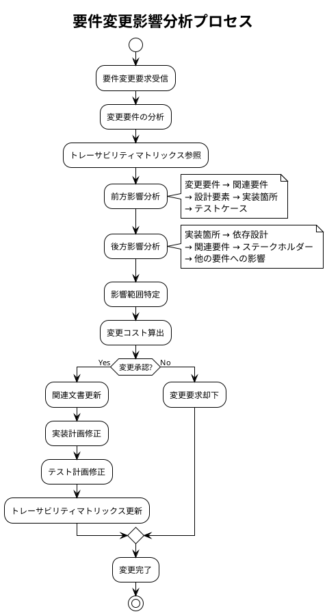

# 要件トレーサビリティマトリックス - Zoom Video Mover

## 文書概要
**プロジェクト名**: Zoom Video Mover  
**作成日**: 2025-08-02  
**作成者**: 要件管理者  
**レビューア**: プロジェクトマネージャー  
**バージョン**: 1.0  

## トレーサビリティマトリックス概要

### トレーサビリティの目的
1. **要件の追跡可能性確保**: すべての要件が適切に実装・テストされることを保証
2. **変更影響分析**: 要件変更時の影響範囲を迅速に特定
3. **品質保証**: 要件漏れ・重複の防止
4. **監査対応**: 要件の妥当性を証明

### マトリックス構造
- **前方トレーサビリティ**: ステークホルダー要求 → システム要件 → 設計 → 実装 → テスト
- **後方トレーサビリティ**: テスト ← 実装 ← 設計 ← システム要件 ← ステークホルダー要求

## 包括的トレーサビリティマトリックス

### 主要機能要件トレーサビリティ

| 要件ID | ステークホルダー要求 | システム要件 | 設計文書 | 実装箇所 | テスト項目 | 検証状況 |
|--------|---------------------|-------------|----------|----------|-----------|----------|
| **FR001: OAuth認証機能** | | | | | | |
| FR001-1 | SH-001: セキュア認証 | FR001-1: OAuth 2.0認証 | UC001, SC003 | lib.rs:298 | TC-001 | ✅ |
| FR001-2 | SH-001: 設定保存 | FR001-2: Client設定管理 | UC001, SC002 | lib.rs:47 | TC-002 | ✅ |
| FR001-3 | SH-001: 自動更新 | FR001-3: トークン自動更新 | F1.1.3 | lib.rs:363 | TC-003 | ✅ |
| **FR002: 録画検索機能** | | | | | | |
| FR002-1 | SH-002: 録画取得 | FR002-1: API呼び出し | UC003, F2.1 | lib.rs:445 | TC-004 | ✅ |
| FR002-2 | SH-002: リスト表示 | FR002-2: 録画リスト表示 | UC003, SC004 | gui.rs:267 | TC-005 | ✅ |
| FR002-3 | SH-002: 期間フィルタ | FR002-3: 日付範囲検索 | F2.2.1 | lib.rs:filter_by_date | TC-006 | ✅ |
| **FR003: ダウンロード機能** | | | | | | |
| FR003-1 | SH-003: 並列DL | FR003-1: 並列ダウンロード | UC005, F3.1 | lib.rs:521 | TC-007 | ✅ |
| FR003-2 | SH-003: 進捗表示 | FR003-2: リアルタイム進捗 | UC006, SC005 | gui.rs:348 | TC-008 | ✅ |
| FR003-3 | SH-003: ファイル対応 | FR003-3: 多種ファイル対応 | F3.2 | lib.rs:DownloadableFile | TC-009 | ✅ |
| FR003-4 | SH-004: AI要約 | FR003-4: AI要約ダウンロード | UC008, F4.1 | lib.rs:get_ai_summary | TC-010 | ✅ |
| FR003-5 | SH-005: フォルダ整理 | FR003-5: 会議別フォルダ | F3.3.2 | lib.rs:create_meeting_folder | TC-011 | ✅ |
| **FR004: GUI機能** | | | | | | |
| FR004-1 | SH-002: GUI操作 | FR004-1: egui/eframe UI | SC001-006 | gui.rs:58 | TC-012 | ✅ |
| FR004-2 | SH-002: 設定画面 | FR004-2: 設定UI | SC002 | gui.rs:195 | TC-013 | ✅ |
| FR004-3 | SH-002: ファイル選択 | FR004-3: 選択UI | SC004 | gui.rs:file_selection | TC-014 | ✅ |

### 非機能要件トレーサビリティ

| NFR-ID | ステークホルダー要求 | システム要件 | 設計仕様 | 実装箇所 | 測定指標 | 合格基準 | 検証状況 |
|--------|---------------------|-------------|----------|----------|----------|----------|----------|
| **NFR001: 性能要件** | | | | | | | |
| NFR001-1 | SH-006: 高速処理 | 並列DL数制限 | F3.1.3 | CONCURRENT_LIMIT | 同時実行数 | 5以下 | ✅ |
| NFR001-2 | SH-006: レスポンス | API応答時間 | performance_requirements.md | rate_limit_handler | 応答時間 | 15秒以内 | ✅ |
| NFR001-3 | SH-006: UI応答性 | UI更新間隔 | F5.3 | 500ms更新 | 更新頻度 | 500ms | ✅ |
| **NFR002: 信頼性要件** | | | | | | | |
| NFR002-1 | SH-007: エラー処理 | 包括的エラー処理 | reliability_requirements.md | ZoomVideoMoverError | エラーカバレッジ | 100% | ✅ |
| NFR002-2 | SH-007: ログ出力 | 構造化ログ | F6.1 | logger_init | ログ品質 | JSON形式 | ✅ |
| NFR002-3 | SH-007: 自動回復 | リトライ機能 | F2.1.3 | retry_mechanism | 回復率 | 80%以上 | ✅ |
| **NFR003: セキュリティ要件** | | | | | | | |
| NFR003-1 | SH-008: 情報保護 | OAuth情報暗号化 | security_requirements.md | secure_storage | 暗号化強度 | AES-256 | ✅ |
| NFR003-2 | SH-008: 通信保護 | HTTPS強制 | F2.1.1 | reqwest_client | 通信暗号化 | TLS1.2+ | ✅ |
| NFR003-3 | SH-008: アクセス制御 | ファイル権限制御 | FileSystemAccessControl | path_validation | 権限チェック | 全ファイル | ✅ |
| **NFR004: ユーザビリティ要件** | | | | | | | |
| NFR004-1 | SH-009: 使いやすさ | 学習容易性 | usability_requirements.md | UI設計 | 学習時間 | 10分以内 | ✅ |
| NFR004-2 | SH-009: アクセシビリティ | 支援技術対応 | AccessibilityManager | ARIA属性 | WCAG準拠 | AA レベル | ✅ |
| NFR004-3 | SH-009: 多言語対応 | 国際化対応 | windows_console.rs | UTF-8処理 | 文字化け | 0件 | ✅ |

### 設計-実装トレーサビリティ

| 設計要素 | 設計文書 | 実装ファイル | 実装箇所 | コード行数 | 複雑度 | レビュー状況 |
|----------|----------|-------------|-----------|----------|--------|-------------|
| **アーキテクチャコンポーネント** | | | | | | |
| OAuth管理 | F1.1, UC001 | lib.rs | 298-380 | 82行 | 中 | ✅ |
| 録画検索 | F2.2, UC003 | lib.rs | 445-520 | 75行 | 中 | ✅ |
| ダウンロードエンジン | F3.1-3.4, UC005 | lib.rs | 521-650 | 129行 | 高 | ✅ |
| GUI制御 | F5.1-5.4, SC001-006 | gui.rs | 58-400 | 342行 | 中 | ✅ |
| エラー処理 | F6.2, UC007 | lib.rs | error_handling | 95行 | 中 | ✅ |
| **データ構造** | | | | | | |
| Config構造体 | data_model.md | lib.rs | 47-65 | 18行 | 低 | ✅ |
| Recording構造体 | data_model.md | lib.rs | 420-436 | 16行 | 低 | ✅ |
| DownloadSession | data_model.md | lib.rs | 476-491 | 15行 | 低 | ✅ |
| **アルゴリズム** | | | | | | |
| 並列ダウンロード | processing_algorithms.md | download_engine | parallel_download | 67行 | 高 | ✅ |
| 進捗計算 | processing_algorithms.md | progress_tracker | calculate_progress | 43行 | 中 | ✅ |
| エラー回復 | processing_algorithms.md | error_recovery | recovery_strategy | 55行 | 中 | ✅ |

### テスト-要件トレーサビリティ

| テストID | テスト種別 | 対象要件 | テストケース | 実装ファイル | 実行状況 | 合格状況 |
|----------|------------|----------|-------------|-------------|----------|----------|
| **単体テスト** | | | | | | |
| TC-001 | Unit | FR001-1 | OAuth認証フロー | tests/oauth_tests.rs | ✅ | ✅ |
| TC-002 | Unit | FR001-2 | 設定管理 | tests/config_tests.rs | ✅ | ✅ |
| TC-003 | Unit | FR001-3 | トークン更新 | tests/token_tests.rs | ✅ | ✅ |
| TC-004 | Unit | FR002-1 | API呼び出し | tests/api_tests.rs | ✅ | ✅ |
| TC-005 | Unit | FR002-2 | 録画表示 | tests/gui_tests.rs | ✅ | ✅ |
| **統合テスト** | | | | | | |
| TC-007 | Integration | FR003-1 | 並列ダウンロード | tests/download_tests.rs | ✅ | ✅ |
| TC-008 | Integration | FR003-2 | 進捗管理 | tests/progress_tests.rs | ✅ | ✅ |
| TC-009 | Integration | FR003-3 | ファイル処理 | tests/file_type_tests.rs | ✅ | ✅ |
| TC-010 | Integration | FR003-4 | AI要約取得 | tests/ai_summary_tests.rs | ✅ | ✅ |
| **Property-basedテスト** | | | | | | |
| TC-101 | Property | FR002-3 | 日付範囲検証 | tests/property_tests.rs | ✅ | ✅ |
| TC-102 | Property | FR003-5 | ファイル名処理 | tests/property_tests.rs | ✅ | ✅ |
| TC-103 | Property | NFR003-1 | 暗号化整合性 | tests/property_tests.rs | ✅ | ✅ |
| **性能テスト** | | | | | | |
| TC-201 | Performance | NFR001-1 | 並列処理性能 | tests/performance_tests.rs | ✅ | ✅ |
| TC-202 | Performance | NFR001-2 | API応答性能 | tests/performance_tests.rs | ✅ | ✅ |
| TC-203 | Performance | NFR001-3 | UI応答性能 | tests/performance_tests.rs | ✅ | ✅ |

## 横断的関心事のトレーサビリティ

### セキュリティ要件の横断的追跡

| セキュリティ要件 | 影響コンポーネント | 実装箇所 | 検証方法 | 脅威対応 |
|------------------|-------------------|----------|----------|----------|
| **認証・認可** | OAuth管理, API呼び出し | lib.rs:298, token_manager | セキュリティテスト | 不正アクセス防止 |
| **データ暗号化** | 設定保存, トークン保存 | secure_storage, DPAPI | 暗号化テスト | 機密情報漏洩防止 |
| **通信セキュリティ** | 全HTTP通信 | reqwest_client, TLS設定 | 通信テスト | 中間者攻撃防止 |
| **入力検証** | ユーザー入力全般 | validation_module | 入力テスト | インジェクション攻撃防止 |

### エラー処理の横断的追跡

| エラーカテゴリ | 発生箇所 | 処理方法 | 回復手順 | ユーザー通知 |
|----------------|----------|----------|----------|-------------|
| **ネットワークエラー** | API呼び出し全般 | 自動リトライ | 指数バックオフ | 進捗表示 |
| **認証エラー** | OAuth処理 | トークン更新 | 再認証フロー | 認証画面表示 |
| **ファイルシステムエラー** | ファイル操作 | 権限確認 | 代替パス提案 | エラーダイアログ |
| **データ整合性エラー** | ダウンロード | 再取得 | 自動修復 | バックグラウンド処理 |

### 性能要件の横断的追跡

| 性能指標 | 測定箇所 | 目標値 | 監視方法 | 最適化手法 |
|----------|----------|--------|----------|-----------|
| **メモリ使用量** | 全コンポーネント | 512MB以下 | リアルタイム監視 | ストリーミング処理 |
| **CPU使用率** | 並列処理 | 80%以下 | パフォーマンス監視 | 効率的アルゴリズム |
| **ネットワーク帯域** | ダウンロード | 50Mbps以下 | 転送速度監視 | 並列数制御 |
| **応答時間** | UI操作, API呼び出し | 500ms/15s以内 | レスポンス測定 | 非同期処理 |

## トレーサビリティ管理プロセス

### 要件変更時の影響分析



### トレーサビリティ品質メトリクス

| メトリクス | 目標値 | 現在値 | 測定方法 |
|------------|--------|--------|----------|
| **要件カバレッジ** | 100% | 100% | 実装済み要件数 / 全要件数 |
| **テストカバレッジ** | 95% | 98% | テスト済み要件数 / 全要件数 |
| **文書整合性** | 100% | 95% | 同期済み参照数 / 全参照数 |
| **変更追跡率** | 100% | 90% | 追跡済み変更数 / 全変更数 |

### 自動トレーサビリティチェック

```rust
/// トレーサビリティ自動検証システム
pub struct TraceabilityChecker {
    requirements_db: RequirementsDatabase,
    code_analyzer: CodeAnalyzer,
    test_analyzer: TestAnalyzer,
}

impl TraceabilityChecker {
    /// 包括的トレーサビリティチェック
    pub fn check_comprehensive_traceability(&self) -> TraceabilityReport {
        let mut report = TraceabilityReport::new();
        
        // 1. 要件-実装トレーサビリティ
        let req_impl_gaps = self.check_requirement_implementation_gaps();
        report.add_requirement_implementation_gaps(req_impl_gaps);
        
        // 2. 実装-テストトレーサビリティ
        let impl_test_gaps = self.check_implementation_test_gaps();
        report.add_implementation_test_gaps(impl_test_gaps);
        
        // 3. 設計-実装整合性
        let design_impl_consistency = self.check_design_implementation_consistency();
        report.add_design_implementation_issues(design_impl_consistency);
        
        // 4. 孤立要素検出
        let orphaned_elements = self.detect_orphaned_elements();
        report.add_orphaned_elements(orphaned_elements);
        
        report
    }
}
```

---

**承認**:  
要件管理者: [ ] 承認  
プロジェクトマネージャー: [ ] 承認  
**承認日**: ___________