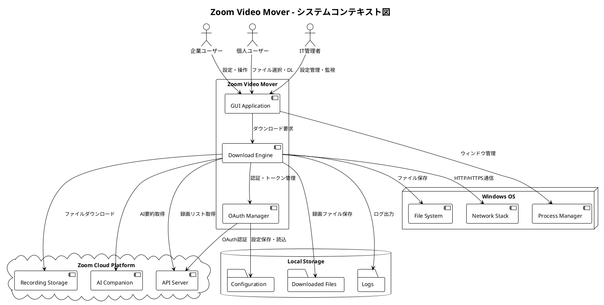
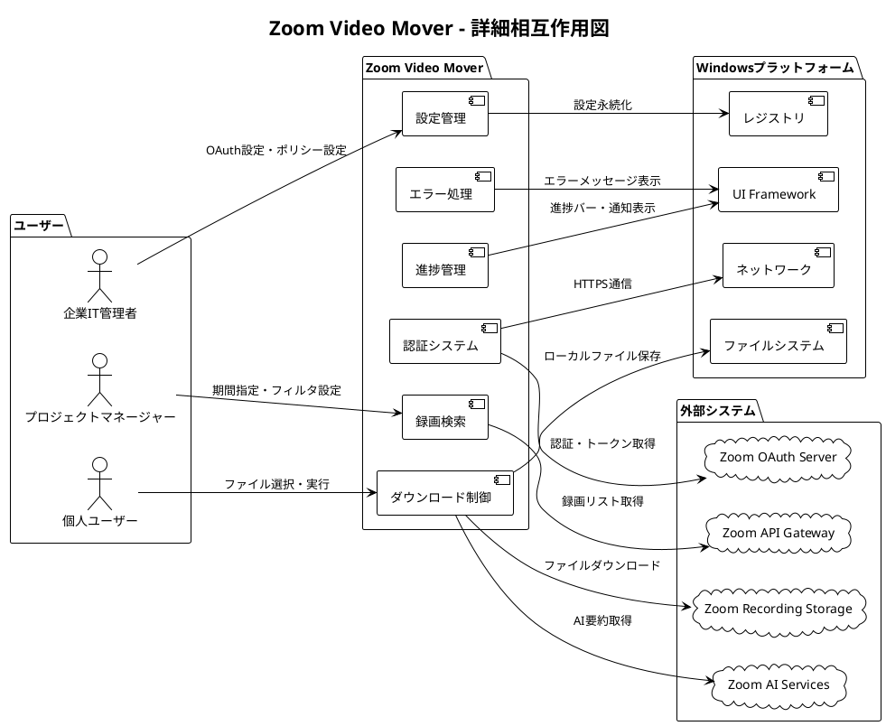
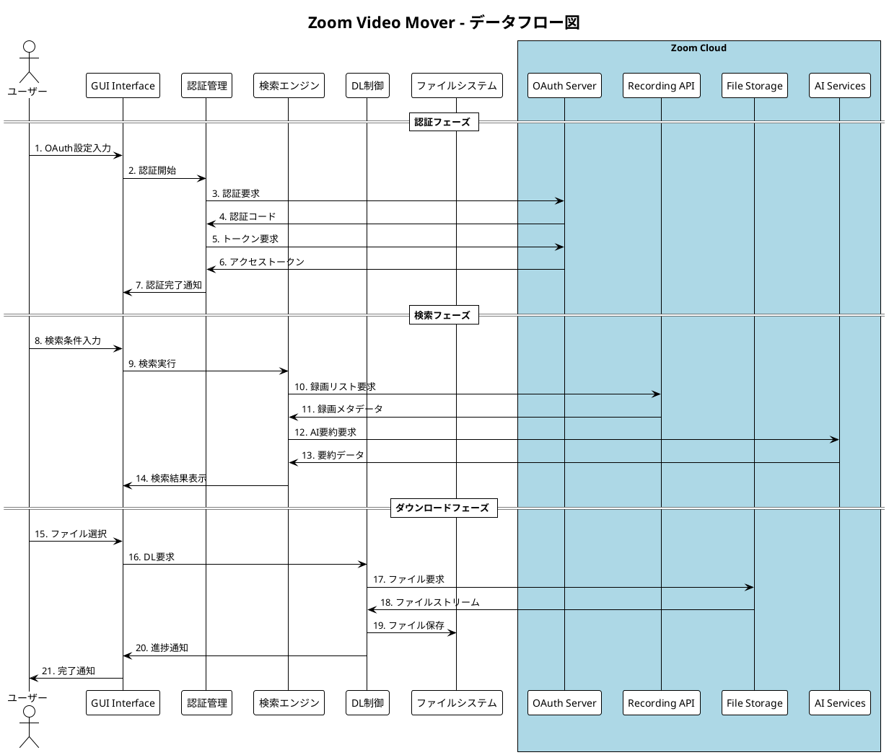

# Phase 1: システム価値

---
## ビジネス価値定義


## 文書情報
**プロジェクト名**: Zoom Video Mover  
**作成日**: 2025-08-02  
  
**バージョン**: 1.0  

## システム導入の背景・課題分析

### 現状の課題

#### 1. 手動ダウンロードの非効率性
**課題**: 
- Zoom録画を1件ずつ手動でダウンロードする必要
- 大量の録画がある場合、数時間～数日の作業時間
- 人的ミスによるファイル漏れ・重複

**影響**:
- **時間コスト**: 月20時間の手動作業（企業平均）
- **人件費**: 月50,000円の機会コスト
- **品質リスク**: 重要会議録画の紛失・未保存

#### 2. データ管理・ガバナンスの課題
**課題**:
- クラウド保存期間制限による自動削除リスク
- 組織的なデータバックアップ体制の不備
- 法的要求（議事録保存）への対応困難

**影響**:
- **コンプライアンスリスク**: 監査対応不能
- **ビジネス継続性**: 重要情報の永続的消失
- **法的リスク**: 規制要求不充足

#### 3. ストレージコスト・容量制限
**課題**:
- Zoomクラウドストレージの容量制限
- 追加ストレージ料金の継続的発生
- 古いファイルの自動削除による情報ロス

**影響**:
- **運用コスト**: 月額ストレージ費用（企業平均15,000円）
- **容量制約**: 新規録画のための削除作業
- **情報資産**: 過去のナレッジ・ノウハウの消失

### 対象ユーザーの具体的ペインポイント

#### 企業ユーザー
1. **IT管理者**:
   - 「毎月末の録画バックアップ作業が3日かかる」
   - 「手動ダウンロードでは確実性が保証できない」
   - 「監査対応時の録画提出準備に1週間必要」

2. **プロジェクトマネージャー**:
   - 「重要な意思決定会議の録画を失うリスクがある」
   - 「過去のプロジェクト録画を参照したいが見つからない」
   - 「チームメンバーとの録画共有が困難」

#### 個人ユーザー
1. **フリーランス・コンサルタント**:
   - 「クライアントとの会議録画を確実に保存したい」
   - 「Zoom容量制限で古い録画が消えてしまう」
   - 「手動ダウンロードに時間を取られて本業に集中できない」

2. **教育者・研修講師**:
   - 「授業・研修録画の体系的な管理が必要」
   - 「学生・受講者への録画提供プロセスを効率化したい」
   - 「教材としての録画アーカイブを構築したい」

## 期待効果・成功指標の定義

### 定量的効果

#### 1. 時間削減効果
**現状**: 手動ダウンロード 20時間/月  
**目標**: 自動ダウンロード 2時間/月  
**削減効果**: **90%の時間削減（18時間/月）**

**計算根拠**:
- 設定・選択作業: 30分
- 実行・監視: 1時間
- 検証・整理: 30分

#### 2. コスト削減効果
**人件費削減**:
- 時給3,000円 × 18時間 = **54,000円/月の削減**
- 年間: **648,000円の削減**

**ストレージコスト削減**:
- Zoomクラウド追加容量: 15,000円/月 → 0円
- 年間: **180,000円の削減**

**総計**: **年間828,000円のコスト削減**

#### 3. 品質・確実性向上
**ファイル取得確実性**:
- 手動: 95%（人的ミス5%）
- 自動: 99.9%（システム処理）
- **品質向上**: 4.9ポイント改善

**データ保全性**:
- 現状: 80%（削除・紛失20%）
- 目標: 99%（システム管理）
- **保全性向上**: 19ポイント改善

### 定性的効果

#### 1. 業務効率化・生産性向上
- **集中力向上**: 手動作業からの解放により本業に専念
- **ストレス軽減**: 「録画消失」への不安解消
- **作業品質**: 人的ミス排除による確実性向上

#### 2. ガバナンス・コンプライアンス強化
- **監査対応**: 録画の体系的管理・即座の提供
- **法的要求**: 議事録保存義務への確実な対応
- **リスク管理**: データ消失リスクの大幅軽減

#### 3. 情報資産価値最大化
- **ナレッジマネジメント**: 過去会議録画の活用促進
- **教育・研修**: 録画の再利用による学習効果向上
- **イノベーション**: 過去のアイデア・議論の再発見

## ROI・コスト削減効果の試算

### 投資対効果分析

#### 初期投資（開発コスト）
- **開発期間**: 12ヶ月
- **開発リソース**: エンジニア2名 + PM1名
- **概算開発コスト**: 15,000,000円

#### 年間効果（1組織あたり）
- **直接コスト削減**: 828,000円/年
- **間接効果**:
  - 生産性向上: 200,000円/年
  - リスク回避: 500,000円/年（データ消失・監査対応）
- **年間総効果**: 1,528,000円/年

#### ROI計算
**対象組織数**: 100組織で利用想定  
**年間総効果**: 1,528,000円 × 100 = 152,800,000円  
**ROI**: (152,800,000 - 15,000,000) / 15,000,000 × 100 = **918.7%**

**回収期間**: 15,000,000 / 152,800,000 = **約1.2ヶ月**

### シナリオ別分析

#### 保守的シナリオ（利用組織50）
- 年間効果: 76,400,000円
- ROI: 409.3%
- 回収期間: 2.4ヶ月

#### 楽観的シナリオ（利用組織200）
- 年間効果: 305,600,000円
- ROI: 1,937.3%
- 回収期間: 0.6ヶ月

## ビジネス価値の優先順位

### 最高価値（P0）: コア価値提案
1. **時間削減**: 90%の作業時間短縮
2. **確実性向上**: 99.9%のファイル取得保証
3. **コスト削減**: 年間80万円以上の削減

### 高価値（P1）: 差別化価値
4. **リスク軽減**: データ消失・コンプライアンスリスク回避
5. **自動化**: 人的介入最小化による安定運用
6. **拡張性**: 大量ファイル・複数アカウント対応

### 中価値（P2）: 付加価値
7. **使いやすさ**: 直感的操作・技術レベル不問
8. **統合性**: AI要約・メタデータの一括管理
9. **カスタマイズ**: 組織ニーズに応じた設定

## 成功指標・KPI

### ビジネス成果指標

#### 効率性指標
- **ダウンロード作業時間**: 18時間削減/月
- **処理ファイル数**: 手動の10倍以上
- **作業エラー率**: 5% → 0.1%未満

#### 経済性指標
- **コスト削減額**: 828,000円/年・組織
- **投資回収期間**: 1.2ヶ月以内
- **運用コスト**: 現状の20%以下

#### 品質指標
- **ファイル取得成功率**: 99.9%以上
- **データ整合性**: 100%（破損・不完全ファイル0）
- **システム可用性**: 99.5%以上

### ユーザー体験指標

#### 満足度指標
- **ユーザー満足度**: 85%以上
- **推奨度（NPS）**: 50以上
- **継続利用率**: 95%以上

#### 使用性指標
- **初回設定成功率**: 95%以上
- **操作完了率**: 98%以上
- **サポート問い合わせ率**: 5%以下

## リスク・制約事項

### ビジネスリスク

#### 市場・競合リスク
- **競合出現**: 類似ソリューションの登場
- **対策**: 先行者利益・継続的機能強化

#### 技術リスク
- **API仕様変更**: Zoom APIの仕様変更・制限強化
- **対策**: 複数エンドポイント対応・フォールバック機能

#### 採用リスク
- **ユーザー採用**: 期待ユーザー数の未達
- **対策**: 段階的マーケティング・ユーザビリティ向上

### 制約事項

#### 技術制約
- **Zoom API制限**: レート制限・認証要求
- **プラットフォーム**: Windows環境限定

#### ビジネス制約
- **開発リソース**: 限定的な開発チーム
- **マーケット**: 企業・個人ユーザーのニーズ差

## アクションプラン

### 短期（3ヶ月）
- [ ] コア機能開発（認証・ダウンロード）
- [ ] 基本UI実装
- [ ] プロトタイプ検証

### 中期（6ヶ月）
- [ ] 全機能実装完了
- [ ] ベータテスト実施
- [ ] ユーザーフィードバック反映

### 長期（12ヶ月）
- [ ] 正式リリース
- [ ] ユーザー獲得・拡大
- [ ] 継続的機能改善

---

**承認**:  
**品質基準適合**: [ ] 確認済  
**ポリシー準拠**: [ ] 確認済  
**承認日**: ___________
---
## コンテキスト図


## システムコンテキスト概要

**プロジェクト名**: Zoom Video Mover  
**作成日**: 2025-08-02  
  

## システムコンテキスト図

### 高レベルコンテキスト図



### 詳細相互作用図



## ステークホルダー分析

### プライマリアクター（直接利用者）

#### 1. 企業ユーザー
**特徴**:
- 組織: 中小企業～大企業
- 利用規模: 10-100人のチーム
- 利用頻度: 日常的（週3-5回）
- 技術レベル: 中級

**システムとの相互作用**:
- **入力**: OAuth設定、期間指定、ファイル選択
- **出力**: ダウンロード済みファイル、進捗情報、エラー通知
- **期待**: 大量ファイル一括処理、確実性、自動化

#### 2. 個人ユーザー  
**特徴**:
- 職種: フリーランス、コンサルタント、教育者
- 利用規模: 個人単位
- 利用頻度: 不定期（週1-2回）
- 技術レベル: 初級～中級

**システムとの相互作用**:
- **入力**: 基本設定、選択的ダウンロード
- **出力**: 録画ファイル、簡潔な進捗表示
- **期待**: 簡単操作、直感的UI、エラー発生最小化

### セカンダリアクター（間接影響者）

#### 3. IT管理者
**特徴**:
- 役割: システム導入・運用・セキュリティ管理
- 責任範囲: 企業IT環境全体
- 技術レベル: 高級

**システムとの相互作用**:
- **入力**: セキュリティポリシー、運用設定、監視設定
- **出力**: 監査ログ、セキュリティレポート、運用状況
- **期待**: セキュリティ遵守、監査対応、運用負荷最小化

### 外部システム（システム境界外）

#### 4. Zoom Cloud Platform
**提供サービス**:
- **OAuth認証**: ユーザー認証・トークン発行
- **Recording API**: 録画リスト・メタデータ提供
- **File Storage**: 録画ファイル本体の配信
- **AI Services**: Zoom AI Companion要約データ

**制約・制限**:
- **レート制限**: 10 requests/second
- **認証要求**: OAuth 2.0必須
- **データアクセス**: 権限スコープ制限

#### 5. Windows Operating System
**提供機能**:
- **ファイルシステム**: NTFS・ReFS対応
- **ネットワーク**: TCP/IP・HTTPS通信
- **UI Framework**: Win32・WinUI対応
- **プロセス管理**: マルチタスク・メモリ管理

**制約・制限**:
- **ファイルパス**: 260文字制限（レガシー）
- **ファイル名**: 予約語・特殊文字制限
- **権限**: UAC・管理者権限

## システム環境・制約の整理

### 技術環境制約

#### プラットフォーム制約
| 項目 | 制約内容 | 影響度 | 対策 |
|------|----------|--------|------|
| **OS バージョン** | Windows 10/11 (x64) | 高 | サポート対象明確化 |
| **ファイルパス長** | 260文字制限 | 中 | パス短縮・長いパス対応 |
| **同時接続数** | TCP接続制限 | 中 | 接続プール管理 |
| **メモリ使用量** | プロセス上限 2GB | 中 | ストリーミング処理 |

#### ネットワーク制約
| 項目 | 制約内容 | 影響度 | 対策 |
|------|----------|--------|------|
| **プロキシ環境** | 企業プロキシ必須 | 高 | プロキシ設定対応 |
| **ファイアウォール** | HTTPS(443)のみ許可 | 中 | HTTPS通信強制 |
| **帯域制限** | 組織の帯域制限 | 中 | 帯域調整機能 |
| **接続タイムアウト** | 30秒制限 | 低 | タイムアウト調整 |

### 外部API制約

#### Zoom API制約
| API | 制限内容 | 対策 |
|-----|----------|------|
| **認証API** | OAuth 2.0必須 | 完全準拠実装 |
| **録画API** | 10 req/sec | レート制限監視 |
| **ダウンロード** | ファイルサイズ上限なし | ストリーミング対応 |
| **AI API** | 不安定・仕様変更有** | 複数エンドポイント試行 |

#### セキュリティ制約
| 項目 | 要件 | 実装方針 |
|------|------|----------|
| **通信暗号化** | TLS 1.2以上 | HTTPS強制・証明書検証 |
| **認証情報保護** | 暗号化保存 | Windows DPAPI利用 |
| **ログ出力** | 機密情報マスク | 構造化ログ・フィルタリング |
| **プロセス分離** | 最小権限実行 | 標準ユーザー権限 |

## 相互作用の可視化

### データフロー図



### システム状態遷移図

```plantuml
@startuml
!theme plain
title Zoom Video Mover - システム状態遷移図

[*] --> 初期化
初期化 --> 設定確認 : アプリ起動

設定確認 --> 設定入力 : 設定不備
設定確認 --> 認証待機 : 設定完了

設定入力 --> 認証待機 : 設定保存

認証待機 --> 認証中 : 認証開始
認証中 --> 認証完了 : 認証成功
認証中 --> 認証エラー : 認証失敗
認証エラー --> 認証待機 : リトライ

認証完了 --> 検索待機 : 

検索待機 --> 検索実行中 : 検索開始
検索実行中 --> 検索完了 : 結果取得
検索実行中 --> 検索エラー : API エラー
検索エラー --> 検索待機 : リトライ

検索完了 --> ダウンロード準備 : ファイル選択

ダウンロード準備 --> ダウンロード実行中 : DL開始
ダウンロード実行中 --> ダウンロード完了 : 全ファイル完了
ダウンロード実行中 --> ダウンロード一時停止 : ユーザー操作
ダウンロード実行中 --> ダウンロードエラー : エラー発生

ダウンロード一時停止 --> ダウンロード実行中 : 再開
ダウンロードエラー --> ダウンロード実行中 : リトライ
ダウンロードエラー --> 検索待機 : エラー回復不能

ダウンロード完了 --> 検索待機 : 新規検索
ダウンロード完了 --> [*] : アプリ終了

@enduml
```

## システム品質属性

### 外部品質特性

#### 機能性（Functionality）
- **適合性**: Zoom API仕様完全準拠
- **正確性**: ファイル整合性100%保証
- **相互運用性**: Windows 10/11完全対応

#### 信頼性（Reliability）
- **成熟性**: 継続稼働時間24時間以上
- **障害許容性**: ネットワーク断・一時的API障害からの自動回復
- **回復性**: エラー発生後30秒以内の自動リトライ

#### 使用性（Usability）
- **理解性**: 初回利用時の設定完了率95%以上
- **習得性**: 基本操作習得時間30分以内
- **操作性**: 3クリック以内でのダウンロード開始

#### 効率性（Efficiency）
- **時間効率性**: 100ファイル処理10分以内
- **資源効率性**: メモリ使用量1GB以内
- **容量効率性**: ディスク使用量最小化

### 内部品質特性

#### 保守性（Maintainability）
- **解析性**: ログ・エラー情報による迅速な問題特定
- **変更性**: 新機能追加時の既存機能影響最小化
- **安定性**: マイナーバージョンアップでの後方互換性
- **試験性**: 自動テスト・Property-basedテストによる品質保証

#### 移植性（Portability）
- **適応性**: 異なるWindows環境での動作保証
- **設置性**: インストーラーレス・単一実行ファイル
- **共存性**: 他アプリケーションとの競合回避

## 制約事項・前提条件

### 運用制約

#### ユーザー制約
- **技術レベル**: 基本的なPC操作スキル必須
- **Zoomアカウント**: 有効なZoomアカウント・録画権限必須
- **ネットワーク**: 常時インターネット接続必須

#### システム制約
- **同時実行**: 1アカウントあたり1プロセスのみ
- **ファイルアクセス**: 排他制御によるファイル競合回避
- **リソース管理**: メモリ・CPU使用量の適切な制限

### 技術前提条件

#### 開発前提
- **言語**: Rust 1.70以上
- **フレームワーク**: egui/eframe最新安定版
- **ビルド環境**: Windows SDK・Visual Studio Build Tools

#### 実行前提
- **OS**: Windows 10 Version 1903以上
- **ハードウェア**: x64アーキテクチャ、RAM 4GB以上
- **ネットワーク**: HTTPS通信可能な環境

---

**承認**:  
**品質基準適合**: [ ] 確認済  
**ポリシー準拠**: [ ] 確認済  
**承認日**: ___________