# Phase 2: 外部環境

---
## ビジネスフロー図


## 文書概要
**プロジェクト名**: Zoom Video Mover  
**作成日**: 2025-08-02  
  
**バージョン**: 1.0  

## As-Is ビジネスフロー（現状）

### 現状の録画ダウンロードプロセス

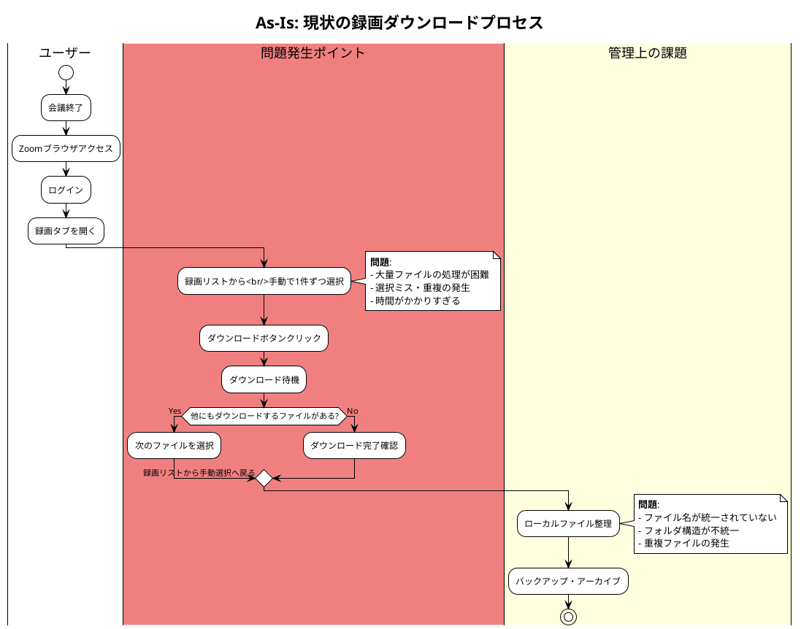

### 現状プロセスの問題分析

#### タイムライン分析
| フェーズ | 所要時間 | 問題点 | 影響度 |
|----------|----------|--------|--------|
| **ログイン・アクセス** | 2-3分 | 認証の手間 | 低 |
| **ファイル選択** | 10-30分 | 手動選択・確認作業 | 高 |
| **ダウンロード実行** | 30分-数時間 | 逐次処理・待機時間 | 高 |
| **ファイル整理** | 10-20分 | 手動整理・重複確認 | 中 |

#### ボトルネック特定
1. **最大ボトルネック**: ファイル選択プロセス（全体時間の40-50%）
2. **効率性問題**: 逐次ダウンロード（並列化可能）
3. **品質問題**: 人的ミスによる選択漏れ・重複

## To-Be ビジネスフロー（理想）

### 自動化された録画ダウンロードプロセス

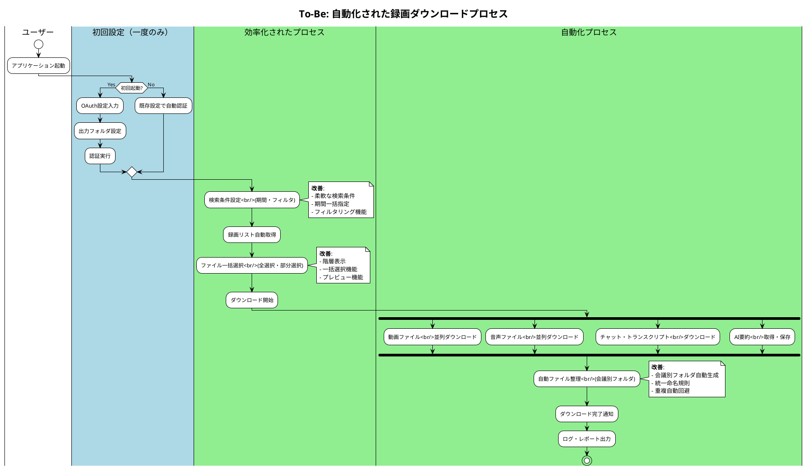

### 改善効果の定量分析

#### 時間短縮効果
| プロセス | As-Is | To-Be | 短縮時間 | 短縮率 |
|----------|-------|-------|----------|--------|
| **認証・アクセス** | 2-3分 | 30秒 | 1.5-2.5分 | 75-83% |
| **ファイル選択** | 10-30分 | 2-3分 | 8-27分 | 80-90% |
| **ダウンロード実行** | 30分-数時間 | 10-30分 | 20分-数時間 | 50-75% |
| **ファイル整理** | 10-20分 | 自動 | 10-20分 | 100% |
| **合計** | 52分-4時間 | 12.5-33.5分 | 39.5分-3.5時間 | **76-87%** |

## 業務改善ポイント

### 1. プロセス自動化
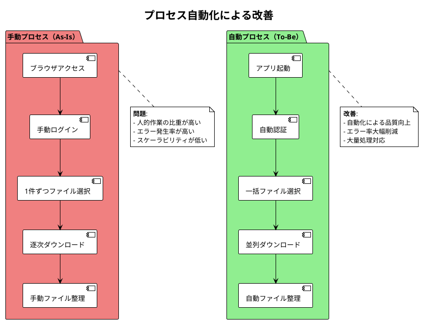

### 2. 並列処理による効率化
```plantuml
@startuml
!theme plain
title 並列処理による効率化

participant "User" as U
participant "App" as A
participant "Download Engine" as DE
participant "Zoom API" as API
participant "File System" as FS

U -> A: ダウンロード開始
A -> DE: 並列ダウンロード要求

par 動画ファイル処理
  DE -> API: 動画ファイル要求
  API -> DE: 動画ストリーム
  DE -> FS: 動画ファイル保存
and 音声ファイル処理
  DE -> API: 音声ファイル要求
  API -> DE: 音声ストリーム
  DE -> FS: 音声ファイル保存
and テキストファイル処理
  DE -> API: チャット・トランスクリプト要求
  API -> DE: テキストデータ
  DE -> FS: テキストファイル保存
and AI要約処理
  DE -> API: AI要約要求
  API -> DE: 要約データ
  DE -> FS: JSON形式保存
end

DE -> A: 全ファイル完了通知
A -> U: ダウンロード完了

@enduml
```

### 3. エラー処理・回復機能

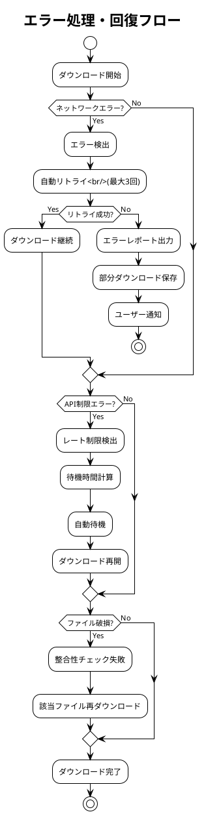

## ステークホルダー別業務影響

### 企業ユーザー
#### As-Is（現状）の課題
- **IT管理者**: 手動バックアップ作業（月末3日間）
- **プロジェクトマネージャー**: 重要会議録画の管理負荷
- **一般ユーザー**: 個別ダウンロードの手間

#### To-Be（改善後）の効果
- **IT管理者**: 自動バックアップ（30分で完了）
- **プロジェクトマネージャー**: 会議別整理による管理効率化
- **一般ユーザー**: ワンクリックダウンロード

### 個人ユーザー
#### As-Is（現状）の課題
- **フリーランス**: クライアント会議録画の手動管理
- **教育者**: 授業録画の個別ダウンロード

#### To-Be（改善後）の効果
- **フリーランス**: クライアント別自動整理
- **教育者**: 授業別フォルダでの体系的管理

## ROI・効果測定

### 定量効果
1. **時間削減**: 月20時間 → 月2時間（90%削減）
2. **人件費削減**: 月50,000円 → 月5,000円（45,000円削減）
3. **エラー率削減**: 5% → 0.1%（98%改善）

### 定性効果
1. **業務品質向上**: 手動ミスの排除
2. **従業員満足度**: 単純作業からの解放
3. **事業継続性**: 重要データの確実な保全

## 実装優先度

### Phase 1: 基本自動化（必須）
- OAuth認証自動化
- 基本ダウンロード機能
- 簡易ファイル整理

### Phase 2: 効率化機能（高優先度）
- 並列ダウンロード
- 進捗表示
- エラー回復機能

### Phase 3: 高度機能（中優先度）
- AI要約連携
- 会議別フォルダ管理
- レポート機能

---

**承認**:  
**品質基準適合**: [ ] 確認済  
**ポリシー準拠**: [ ] 確認済  
**承認日**: ___________
---
## 概念モデル


## 文書概要
**プロジェクト名**: Zoom Video Mover  
**作成日**: 2025-08-02  
  
**バージョン**: 1.0  

## ドメイン概念モデル

### 高レベル概念モデル

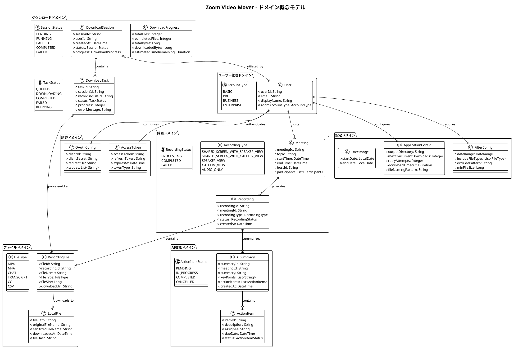

### データフロー概念モデル

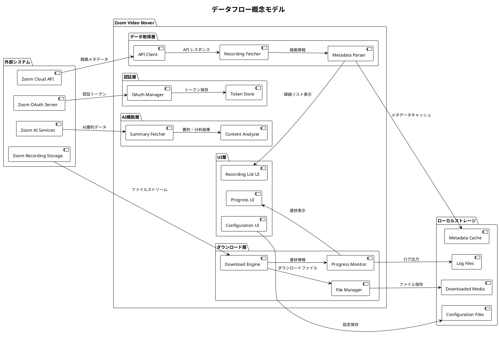

## ドメイン用語集

### A - C

#### AccessToken（アクセストークン）
**定義**: OAuth 2.0認証で取得される、Zoom APIアクセス用の認証情報  
**属性**: トークン文字列、有効期限、スコープ、リフレッシュトークン  
**関連概念**: OAuth認証、API認証、セキュリティ  
**ライフサイクル**: 取得 → 使用 → 期限切れ → 更新

#### AISummary（AI要約）
**定義**: Zoom AI Companionが生成する会議の自動要約情報  
**属性**: 要約テキスト、キーポイント、アクションアイテム、参加者情報  
**関連概念**: 会議録画、自然言語処理、要約生成  
**形式**: JSON構造化データ

#### ApplicationConfig（アプリケーション設定）
**定義**: Zoom Video Moverの動作を制御する設定情報  
**属性**: 出力ディレクトリ、同時ダウンロード数、リトライ回数、タイムアウト  
**保存形式**: TOML設定ファイル  
**管理方針**: ユーザー編集可能、バックアップ必須

### D - F

#### DownloadSession（ダウンロードセッション）
**定義**: 一連のダウンロード作業を管理する実行単位  
**属性**: セッションID、開始時刻、対象ファイル一覧、進捗状況  
**状態**: 待機中 → 実行中 → 一時停止 → 完了/失敗  
**管理**: 中断・再開、進捗追跡、エラー記録

#### DownloadTask（ダウンロードタスク）
**定義**: 個別ファイルのダウンロード処理を表現する最小実行単位  
**属性**: タスクID、対象ファイル、進捗率、エラー情報  
**実行モデル**: 非同期・並列処理  
**エラー処理**: 自動リトライ、エラー分類、ログ記録

#### FileType（ファイル種別）
**定義**: Zoom録画で生成される各種ファイルの分類  
**種別**:
- **MP4**: 動画ファイル（画面共有+音声）
- **M4A**: 音声ファイル（音声のみ）
- **CHAT**: チャット履歴（テキスト）
- **TRANSCRIPT**: 音声トランスクリプト（VTT形式）
- **CC**: クローズドキャプション
- **CSV**: 参加者・投票結果等のデータ

#### FilterConfig（フィルタ設定）
**定義**: 録画検索・取得時の絞り込み条件  
**条件**: 日付範囲、ファイル種別、会議名パターン、ファイルサイズ  
**用途**: 大量データからの効率的な対象抽出  
**保存**: ユーザー設定として永続化

### L - O

#### LocalFile（ローカルファイル）
**定義**: ダウンロード完了後のローカルストレージ上のファイル  
**属性**: ファイルパス、ファイル名、ダウンロード日時、ハッシュ値  
**命名規則**: `YYYY-MM-DD_HH-MM_会議名_ファイル種別.拡張子`  
**整合性**: SHA-256ハッシュによる完全性保証

#### Meeting（会議）
**定義**: Zoomで実施された会議の概念的表現  
**属性**: 会議ID、トピック、開始/終了時刻、ホスト、参加者一覧  
**関連**: 複数の録画、AI要約、チャット履歴と1:N関係  
**識別**: 会議IDによる一意識別

#### OAuthConfig（OAuth設定）
**定義**: Zoom API認証に必要なOAuth 2.0設定情報  
**必須項目**: Client ID、Client Secret、Redirect URI、スコープ  
**セキュリティ**: Client Secretの暗号化保存必須  
**管理**: 初回設定、更新、バックアップ機能

### P - R

#### Participant（参加者）
**定義**: 会議に参加したユーザーの情報  
**属性**: ユーザーID、表示名、参加時刻、退出時刻、ロール  
**ロール**: ホスト、共同ホスト、参加者、ゲスト  
**プライバシー**: 個人情報保護に配慮した取り扱い

#### ProgressMonitor（進捗監視）
**定義**: ダウンロード進捗をリアルタイムで追跡・表示する機能  
**監視項目**: ファイル数、データ量、転送速度、残り時間  
**更新頻度**: 500ms間隔  
**通知**: 完了・エラー・マイルストーン到達時

#### Recording（録画）
**定義**: 会議の録画データの論理的表現  
**属性**: 録画ID、会議ID、録画種別、ステータス、作成日時  
**種別**: 画面共有+発話者、ギャラリービュー、音声のみ等  
**ステータス**: 処理中、完了、失敗

#### RecordingFile（録画ファイル）
**定義**: 録画に含まれる個別ファイルの実体  
**属性**: ファイルID、ファイル名、サイズ、ダウンロードURL  
**有効期限**: Zoom側での自動削除タイミング  
**アクセス**: 認証済みユーザーのみダウンロード可能

### S - Z

#### SessionStatus（セッション状態）
**定義**: ダウンロードセッションの実行状態  
**状態遷移**:
- **PENDING**: 開始待機中
- **RUNNING**: 実行中
- **PAUSED**: ユーザーによる一時停止
- **COMPLETED**: 正常完了
- **FAILED**: エラーによる失敗

#### TaskStatus（タスク状態）
**定義**: 個別ダウンロードタスクの実行状態  
**状態遷移**:
- **QUEUED**: 実行待ちキューに登録
- **DOWNLOADING**: ダウンロード実行中
- **COMPLETED**: ダウンロード完了
- **FAILED**: 失敗（リトライ上限到達）
- **RETRYING**: 失敗後のリトライ中

#### User（ユーザー）
**定義**: Zoom Video Moverを利用するエンドユーザー  
**属性**: ユーザーID、メールアドレス、表示名、Zoomアカウント種別  
**認証**: Zoomアカウントでの認証必須  
**権限**: 自身の録画データのみアクセス可能

## 概念間の関係性

### 集約ルート・境界コンテキスト

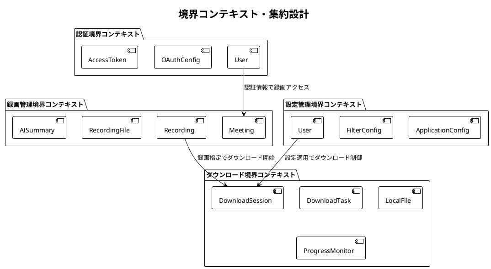

### ライフサイクル管理

#### 録画データのライフサイクル
1. **生成**: Zoom会議での録画作成
2. **処理**: Zoom側での録画処理完了
3. **公開**: ダウンロード可能状態
4. **取得**: Zoom Video Moverでの検出・一覧化
5. **ダウンロード**: ローカルへの保存
6. **管理**: ローカルでの整理・活用
7. **アーカイブ**: 長期保存・削除

#### 認証情報のライフサイクル
1. **設定**: OAuth設定の初期登録
2. **認証**: 初回OAuth認証実行
3. **取得**: アクセストークン取得
4. **利用**: API呼び出しでの使用
5. **更新**: リフレッシュトークンでの自動更新
6. **失効**: トークン無効化・再認証

## ドメインルール・制約

### ビジネスルール
1. **アクセス権限**: ユーザーは自身がアクセス権を持つ録画のみダウンロード可能
2. **同時ダウンロード**: API制限遵守のため同時実行数制限（デフォルト5）
3. **ファイル整合性**: ダウンロード後のハッシュ値チェック必須
4. **エラー処理**: 失敗時の自動リトライ（最大3回）

### 技術制約
1. **API制限**: Zoom API レート制限（10 requests/second）
2. **ファイルサイズ**: 単一ファイル最大容量制限なし（Zoom側制限に依存）
3. **同期処理**: UI応答性確保のため重い処理は非同期実行
4. **メモリ管理**: 大容量ファイル処理時のストリーミング必須

### データ制約
1. **文字エンコーディング**: UTF-8統一
2. **ファイル名**: Windows互換性確保（予約語・特殊文字対応）
3. **日付形式**: ISO 8601準拠（YYYY-MM-DDTHH:mm:ssZ）
4. **ログ保持**: 30日間のログ自動保持・ローテーション

---

**承認**:  
**品質基準適合**: [ ] 確認済  
**ポリシー準拠**: [ ] 確認済  
**承認日**: ___________
---
## 利用シナリオ


## 文書概要
**プロジェクト名**: Zoom Video Mover  
**作成日**: 2025-08-02  
  
**バージョン**: 1.0  

## シナリオ分類体系

### プライマリシナリオ（主要利用パターン）
1. **定期バックアップシナリオ**: 定期的な録画データのローカル保存
2. **プロジェクト完了アーカイブシナリオ**: プロジェクト完了時の録画一括整理
3. **重要会議保存シナリオ**: 重要な意思決定会議の確実な保存

### セカンダリシナリオ（付加価値パターン）
4. **研修・教育コンテンツ作成シナリオ**: 教育目的での録画活用
5. **法的証拠保全シナリオ**: コンプライアンス・監査対応
6. **オフライン視聴準備シナリオ**: ネットワーク制限環境での利用

### エクストリームシナリオ（例外・限界パターン）  
7. **大量データ移行シナリオ**: 組織移転・システム移行時の一括処理
8. **緊急データ回復シナリオ**: Zoom容量制限・削除前の緊急保存
9. **ネットワーク制限環境シナリオ**: 低帯域・不安定回線での利用

## プライマリシナリオ詳細

### シナリオ1: 定期バックアップシナリオ

#### ユーザープロファイル
- **ユーザー**: 田中太郎（IT管理者、35歳）
- **組織**: 中小IT企業（従業員50名）
- **技術レベル**: 中級
- **利用頻度**: 毎月1回（月末）

#### 利用コンテキスト
- **場所**: オフィス（Windows PC）
- **時間帯**: 平日夜間（業務時間後）
- **状況**: 月次バックアップ作業の一環
- **制約**: 翌日朝までに完了させる必要

#### シナリオフロー

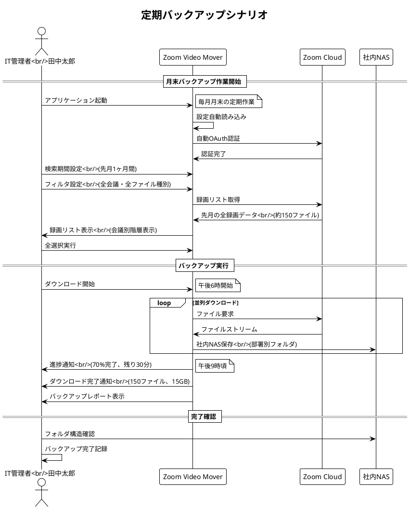

#### 期待する体験
- **効率性**: 手動作業時間の90%削減（3日 → 3時間）
- **信頼性**: ファイル取得率99.9%以上
- **利便性**: 設定保存により毎回同じ操作で実行可能
- **安心感**: 進捗表示とエラー通知による状況把握

#### 成功基準
- [ ] 150ファイル（15GB）を3時間以内でダウンロード完了
- [ ] ファイル整合性100%（破損・欠損なし）
- [ ] 会議別フォルダで適切に整理保存
- [ ] エラー発生時の自動回復・通知

### シナリオ2: プロジェクト完了アーカイブシナリオ

#### ユーザープロファイル
- **ユーザー**: 佐藤花子（プロジェクトマネージャー、42歳）
- **組織**: 大手製造業（従業員1000名）
- **技術レベル**: 初級〜中級
- **利用頻度**: プロジェクト完了時（年3-4回）

#### 利用コンテキスト
- **場所**: 自宅（リモートワーク）
- **時間帯**: 土日（個人時間）
- **状況**: 半年間のプロジェクト完了・引き継ぎ準備
- **制約**: プロジェクト関連録画のみを確実に保存

#### シナリオフロー

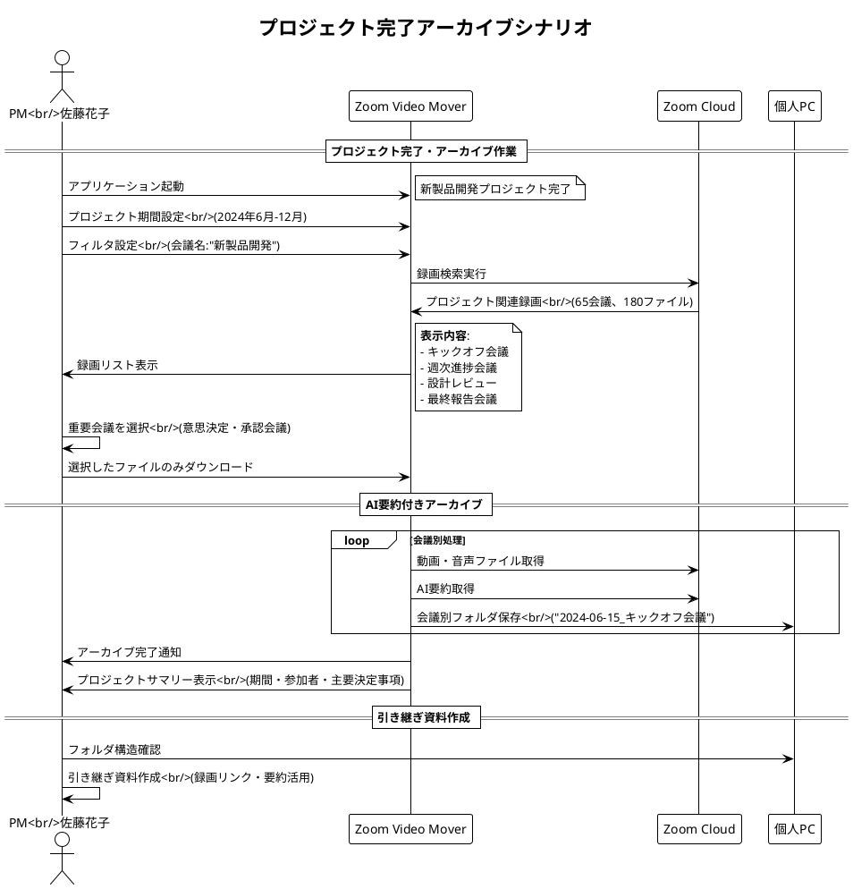

#### 期待する体験
- **選択性**: プロジェクト関連録画のみを正確に抽出
- **整理性**: 会議別・時系列での自動整理
- **理解性**: AI要約による会議内容の把握
- **引き継ぎ性**: 後任者への効率的な情報継承

#### 成功基準
- [ ] プロジェクト関連録画の100%特定・抽出
- [ ] 会議別フォルダでの時系列整理
- [ ] AI要約による会議サマリー取得
- [ ] 引き継ぎ資料作成時間の50%削減

### シナリオ3: 重要会議保存シナリオ

#### ユーザープロファイル
- **ユーザー**: 山田次郎（個人事業主・コンサルタント、48歳）
- **組織**: フリーランス
- **技術レベル**: 初級
- **利用頻度**: 重要クライアント会議後（月2-3回）

#### 利用コンテキスト
- **場所**: 自宅オフィス
- **時間帯**: 会議直後
- **状況**: クライアントとの契約・提案会議
- **制約**: 証拠保全・契約根拠として確実に保存

#### シナリオフロー

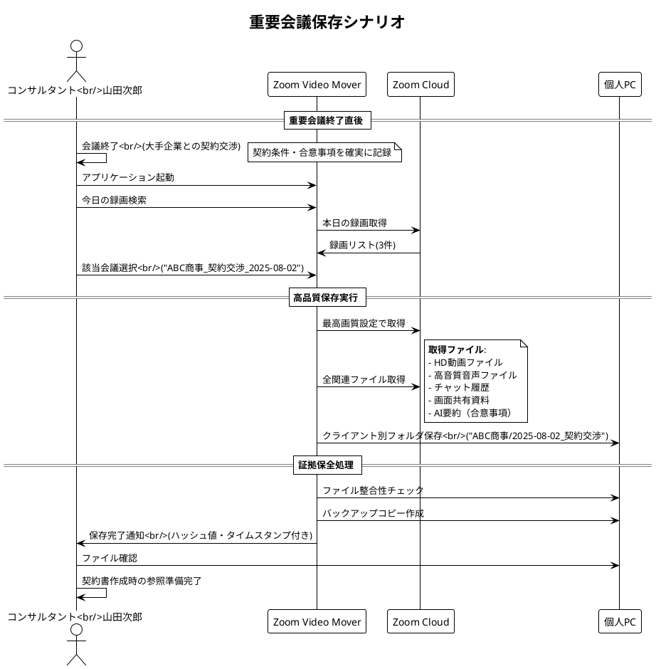

#### 期待する体験
- **即時性**: 会議終了後すぐに保存開始
- **完全性**: 全関連ファイルの確実な取得
- **証拠性**: 改ざん検出・タイムスタンプ機能
- **整理性**: クライアント別の体系的管理

#### 成功基準
- [ ] 会議終了から5分以内に保存開始
- [ ] 全関連ファイル（動画・音声・チャット・資料）の取得
- [ ] ファイル整合性の保証（ハッシュ値チェック）
- [ ] クライアント別フォルダでの適切な整理

## セカンダリシナリオ詳細

### シナリオ4: 研修・教育コンテンツ作成シナリオ

#### ユーザープロファイル
- **ユーザー**: 鈴木美穂（企業研修講師、38歳）
- **組織**: 研修会社
- **技術レベル**: 中級
- **利用頻度**: 研修実施後（月5-8回）

#### 利用コンテキスト
- **目的**: オンライン研修録画の教材化
- **対象**: 複数企業向けビジネススキル研修
- **要件**: 再利用可能な教材ライブラリ構築

#### シナリオフロー概要
1. **研修録画の一括取得**: 月次研修録画をテーマ別に分類
2. **教材用編集準備**: チャプター情報・資料との関連付け
3. **受講者配布準備**: アクセス制御・配布用フォーマット準備

#### 期待効果
- **効率化**: 教材作成時間の60%削減
- **品質向上**: 統一フォーマットでの教材管理
- **再利用性**: 過去研修の効率的な活用

### シナリオ5: 法的証拠保全シナリオ

#### ユーザープロファイル
- **ユーザー**: 法務部担当者
- **組織**: 上場企業
- **技術レベル**: 初級
- **利用頻度**: 法的問題発生時（年1-2回）

#### 利用コンテキスト
- **目的**: 取締役会・重要な意思決定会議の証拠保全
- **要件**: 改ざん防止・長期保存対応
- **制約**: 法的要件に準拠した保存形式

#### 特別要件
- **改ざん検出**: ハッシュ値・デジタルタイムスタンプ
- **長期保存**: 10年間の可読性保証
- **監査対応**: 外部監査人への提出対応

## エクストリームシナリオ詳細

### シナリオ7: 大量データ移行シナリオ

#### 利用コンテキスト
- **状況**: 会社統合・システム移行
- **データ量**: 5,000ファイル・500GB
- **時間制限**: 1週間以内
- **制約**: 業務継続しながらの実行

#### 技術的課題
- **スループット**: 大量データの効率的処理
- **安定性**: 長時間実行での安定動作
- **回復性**: 中断・再開機能

#### 成功基準
- [ ] 5,000ファイルの100%取得
- [ ] エラー率1%以下
- [ ] 自動再開・進捗保存機能

### シナリオ8: 緊急データ回復シナリオ

#### 利用コンテキスト
- **状況**: Zoom容量制限警告・自動削除直前
- **緊急度**: 48時間以内
- **重要度**: ビジネス継続に必須のデータ

#### 特別機能要件
- **優先度制御**: 重要ファイルの優先処理
- **高速化**: 最大並列数での実行
- **通知**: リアルタイム進捗・完了通知

## ユーザージャーニーマップ

### ユーザー体験の時系列分析

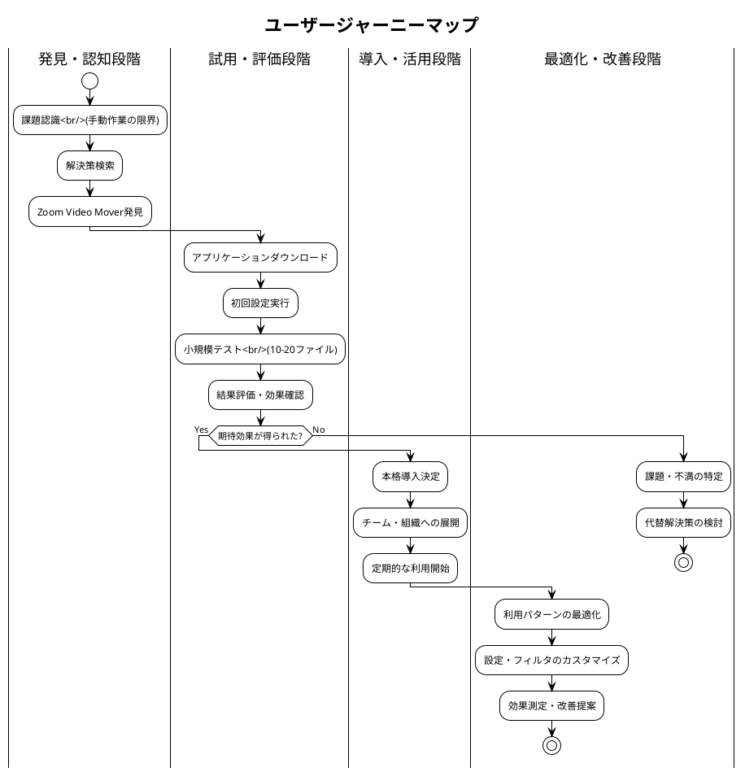

### タッチポイント別体験設計

| フェーズ | タッチポイント | ユーザー感情 | 改善ポイント |
|----------|----------------|-------------|-------------|
| **認知** | Webサイト・口コミ | 期待・懸念 | 明確な価値提案・実績提示 |
| **試用** | 初回設定・操作 | 不安・混乱 | 直感的UI・ガイド機能 |
| **評価** | 結果確認 | 驚き・満足 | 効果の可視化・比較表示 |
| **導入** | 本格運用 | 信頼・安心 | 安定性・サポート体制 |
| **活用** | 日常利用 | 習慣・依存 | 継続的な価値提供 |

## シナリオ検証・テスト計画

### 検証方法
1. **ユーザビリティテスト**: 実際のユーザーによるシナリオ実行
2. **A/Bテスト**: 異なるUI・フローの比較検証
3. **負荷テスト**: エクストリームシナリオでの性能検証

### 成功指標
- **完了率**: シナリオ完了率95%以上
- **効率性**: 従来比時間短縮80%以上
- **満足度**: ユーザー満足度85%以上
- **エラー率**: 操作エラー率5%以下

---

**承認**:  
**品質基準適合**: [ ] 確認済  
**ポリシー準拠**: [ ] 確認済  
**承認日**: ___________