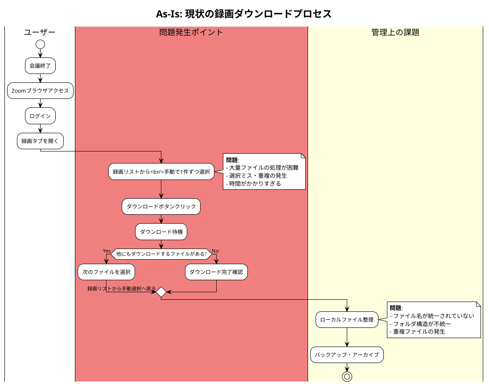
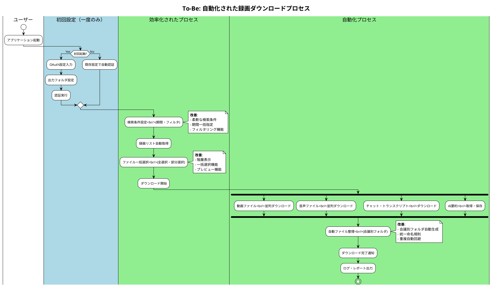
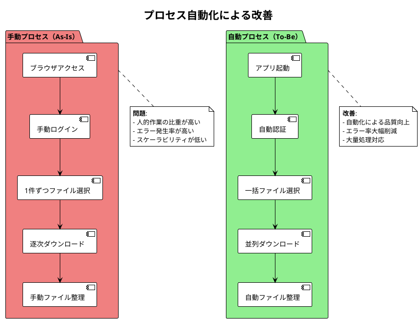
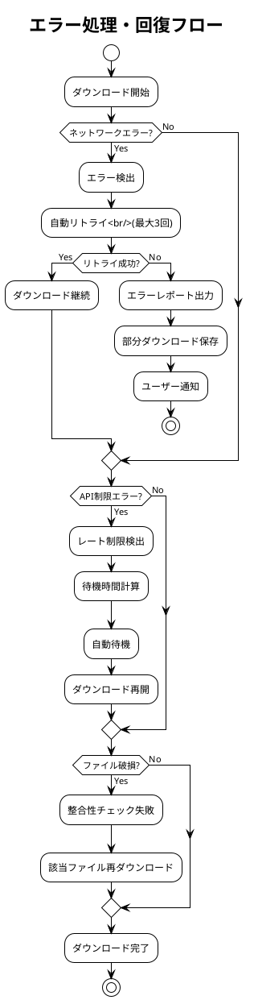

# ビジネスフロー図 - Zoom Video Mover

## 文書概要
**プロジェクト名**: Zoom Video Mover  
**作成日**: 2025-08-02  
**作成者**: ビジネスアナリスト  
**レビューア**: プロジェクトマネージャー  
**バージョン**: 1.0  

## As-Is ビジネスフロー（現状）

### 現状の録画ダウンロードプロセス



### 現状プロセスの問題分析

#### タイムライン分析
| フェーズ | 所要時間 | 問題点 | 影響度 |
|----------|----------|--------|--------|
| **ログイン・アクセス** | 2-3分 | 認証の手間 | 低 |
| **ファイル選択** | 10-30分 | 手動選択・確認作業 | 高 |
| **ダウンロード実行** | 30分-数時間 | 逐次処理・待機時間 | 高 |
| **ファイル整理** | 10-20分 | 手動整理・重複確認 | 中 |

#### ボトルネック特定
1. **最大ボトルネック**: ファイル選択プロセス（全体時間の40-50%）
2. **効率性問題**: 逐次ダウンロード（並列化可能）
3. **品質問題**: 人的ミスによる選択漏れ・重複

## To-Be ビジネスフロー（理想）

### 自動化された録画ダウンロードプロセス



### 改善効果の定量分析

#### 時間短縮効果
| プロセス | As-Is | To-Be | 短縮時間 | 短縮率 |
|----------|-------|-------|----------|--------|
| **認証・アクセス** | 2-3分 | 30秒 | 1.5-2.5分 | 75-83% |
| **ファイル選択** | 10-30分 | 2-3分 | 8-27分 | 80-90% |
| **ダウンロード実行** | 30分-数時間 | 10-30分 | 20分-数時間 | 50-75% |
| **ファイル整理** | 10-20分 | 自動 | 10-20分 | 100% |
| **合計** | 52分-4時間 | 12.5-33.5分 | 39.5分-3.5時間 | **76-87%** |

## 業務改善ポイント

### 1. プロセス自動化


### 2. 並列処理による効率化
```plantuml
@startuml
!theme plain
title 並列処理による効率化

participant "User" as U
participant "App" as A
participant "Download Engine" as DE
participant "Zoom API" as API
participant "File System" as FS

U -> A: ダウンロード開始
A -> DE: 並列ダウンロード要求

par 動画ファイル処理
  DE -> API: 動画ファイル要求
  API -> DE: 動画ストリーム
  DE -> FS: 動画ファイル保存
and 音声ファイル処理
  DE -> API: 音声ファイル要求
  API -> DE: 音声ストリーム
  DE -> FS: 音声ファイル保存
and テキストファイル処理
  DE -> API: チャット・トランスクリプト要求
  API -> DE: テキストデータ
  DE -> FS: テキストファイル保存
and AI要約処理
  DE -> API: AI要約要求
  API -> DE: 要約データ
  DE -> FS: JSON形式保存
end

DE -> A: 全ファイル完了通知
A -> U: ダウンロード完了

@enduml
```

### 3. エラー処理・回復機能



## ステークホルダー別業務影響

### 企業ユーザー
#### As-Is（現状）の課題
- **IT管理者**: 手動バックアップ作業（月末3日間）
- **プロジェクトマネージャー**: 重要会議録画の管理負荷
- **一般ユーザー**: 個別ダウンロードの手間

#### To-Be（改善後）の効果
- **IT管理者**: 自動バックアップ（30分で完了）
- **プロジェクトマネージャー**: 会議別整理による管理効率化
- **一般ユーザー**: ワンクリックダウンロード

### 個人ユーザー
#### As-Is（現状）の課題
- **フリーランス**: クライアント会議録画の手動管理
- **教育者**: 授業録画の個別ダウンロード

#### To-Be（改善後）の効果
- **フリーランス**: クライアント別自動整理
- **教育者**: 授業別フォルダでの体系的管理

## ROI・効果測定

### 定量効果
1. **時間削減**: 月20時間 → 月2時間（90%削減）
2. **人件費削減**: 月50,000円 → 月5,000円（45,000円削減）
3. **エラー率削減**: 5% → 0.1%（98%改善）

### 定性効果
1. **業務品質向上**: 手動ミスの排除
2. **従業員満足度**: 単純作業からの解放
3. **事業継続性**: 重要データの確実な保全

## 実装優先度

### Phase 1: 基本自動化（必須）
- OAuth認証自動化
- 基本ダウンロード機能
- 簡易ファイル整理

### Phase 2: 効率化機能（高優先度）
- 並列ダウンロード
- 進捗表示
- エラー回復機能

### Phase 3: 高度機能（中優先度）
- AI要約連携
- 会議別フォルダ管理
- レポート機能

---

**承認**:  
ビジネスアナリスト: [ ] 承認  
プロジェクトマネージャー: [ ] 承認  
**承認日**: ___________