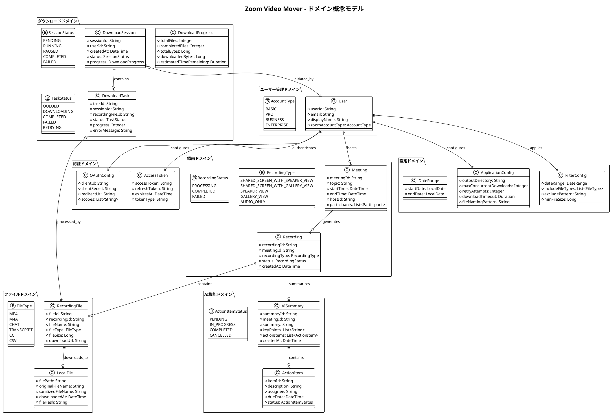
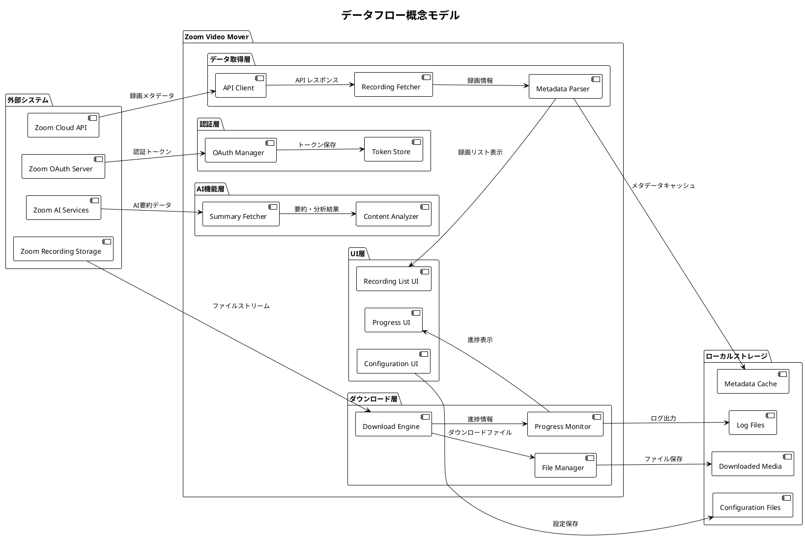
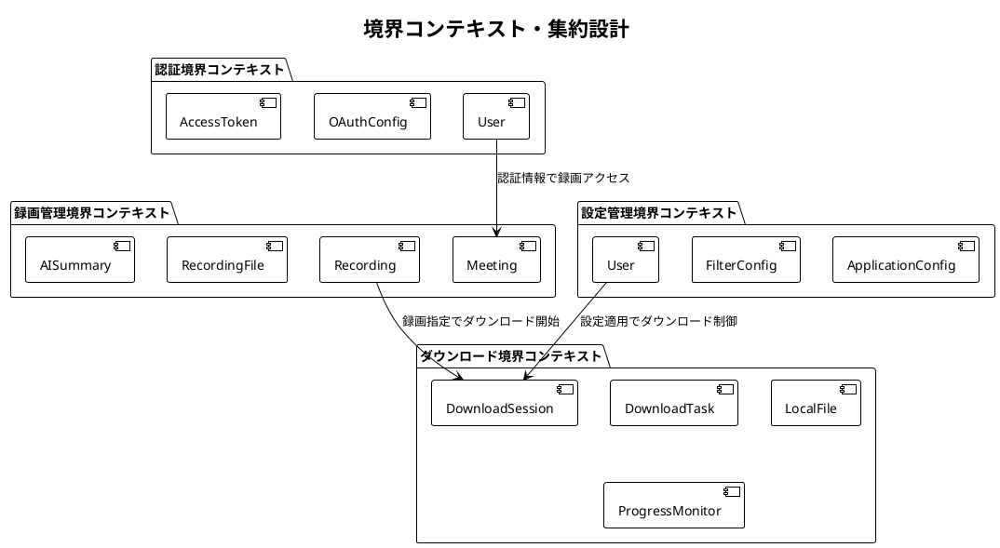

# 概念モデル図・用語集 - Zoom Video Mover

## 文書概要
**プロジェクト名**: Zoom Video Mover  
**作成日**: 2025-08-02  
**作成者**: ビジネスアナリスト  
**レビューア**: 技術アーキテクト  
**バージョン**: 1.0  

## ドメイン概念モデル

### 高レベル概念モデル

### データフロー概念モデル

## ドメイン用語集

### A - C

#### AccessToken（アクセストークン）
**定義**: OAuth 2.0認証で取得される、Zoom APIアクセス用の認証情報  
**属性**: トークン文字列、有効期限、スコープ、リフレッシュトークン  
**関連概念**: OAuth認証、API認証、セキュリティ  
**ライフサイクル**: 取得 → 使用 → 期限切れ → 更新

#### AISummary（AI要約）
**定義**: Zoom AI Companionが生成する会議の自動要約情報  
**属性**: 要約テキスト、キーポイント、アクションアイテム、参加者情報  
**関連概念**: 会議録画、自然言語処理、要約生成  
**形式**: JSON構造化データ

#### ApplicationConfig（アプリケーション設定）
**定義**: Zoom Video Moverの動作を制御する設定情報  
**属性**: 出力ディレクトリ、同時ダウンロード数、リトライ回数、タイムアウト  
**保存形式**: TOML設定ファイル  
**管理方針**: ユーザー編集可能、バックアップ必須

### D - F

#### DownloadSession（ダウンロードセッション）
**定義**: 一連のダウンロード作業を管理する実行単位  
**属性**: セッションID、開始時刻、対象ファイル一覧、進捗状況  
**状態**: 待機中 → 実行中 → 一時停止 → 完了/失敗  
**管理**: 中断・再開、進捗追跡、エラー記録

#### DownloadTask（ダウンロードタスク）
**定義**: 個別ファイルのダウンロード処理を表現する最小実行単位  
**属性**: タスクID、対象ファイル、進捗率、エラー情報  
**実行モデル**: 非同期・並列処理  
**エラー処理**: 自動リトライ、エラー分類、ログ記録

#### FileType（ファイル種別）
**定義**: Zoom録画で生成される各種ファイルの分類  
**種別**:
- **MP4**: 動画ファイル（画面共有+音声）
- **M4A**: 音声ファイル（音声のみ）
- **CHAT**: チャット履歴（テキスト）
- **TRANSCRIPT**: 音声トランスクリプト（VTT形式）
- **CC**: クローズドキャプション
- **CSV**: 参加者・投票結果等のデータ

#### FilterConfig（フィルタ設定）
**定義**: 録画検索・取得時の絞り込み条件  
**条件**: 日付範囲、ファイル種別、会議名パターン、ファイルサイズ  
**用途**: 大量データからの効率的な対象抽出  
**保存**: ユーザー設定として永続化

### L - O

#### LocalFile（ローカルファイル）
**定義**: ダウンロード完了後のローカルストレージ上のファイル  
**属性**: ファイルパス、ファイル名、ダウンロード日時、ハッシュ値  
**命名規則**: `YYYY-MM-DD_HH-MM_会議名_ファイル種別.拡張子`  
**整合性**: SHA-256ハッシュによる完全性保証

#### Meeting（会議）
**定義**: Zoomで実施された会議の概念的表現  
**属性**: 会議ID、トピック、開始/終了時刻、ホスト、参加者一覧  
**関連**: 複数の録画、AI要約、チャット履歴と1:N関係  
**識別**: 会議IDによる一意識別

#### OAuthConfig（OAuth設定）
**定義**: Zoom API認証に必要なOAuth 2.0設定情報  
**必須項目**: Client ID、Client Secret、Redirect URI、スコープ  
**セキュリティ**: Client Secretの暗号化保存必須  
**管理**: 初回設定、更新、バックアップ機能

### P - R

#### Participant（参加者）
**定義**: 会議に参加したユーザーの情報  
**属性**: ユーザーID、表示名、参加時刻、退出時刻、ロール  
**ロール**: ホスト、共同ホスト、参加者、ゲスト  
**プライバシー**: 個人情報保護に配慮した取り扱い

#### ProgressMonitor（進捗監視）
**定義**: ダウンロード進捗をリアルタイムで追跡・表示する機能  
**監視項目**: ファイル数、データ量、転送速度、残り時間  
**更新頻度**: 500ms間隔  
**通知**: 完了・エラー・マイルストーン到達時

#### Recording（録画）
**定義**: 会議の録画データの論理的表現  
**属性**: 録画ID、会議ID、録画種別、ステータス、作成日時  
**種別**: 画面共有+発話者、ギャラリービュー、音声のみ等  
**ステータス**: 処理中、完了、失敗

#### RecordingFile（録画ファイル）
**定義**: 録画に含まれる個別ファイルの実体  
**属性**: ファイルID、ファイル名、サイズ、ダウンロードURL  
**有効期限**: Zoom側での自動削除タイミング  
**アクセス**: 認証済みユーザーのみダウンロード可能

### S - Z

#### SessionStatus（セッション状態）
**定義**: ダウンロードセッションの実行状態  
**状態遷移**:
- **PENDING**: 開始待機中
- **RUNNING**: 実行中
- **PAUSED**: ユーザーによる一時停止
- **COMPLETED**: 正常完了
- **FAILED**: エラーによる失敗

#### TaskStatus（タスク状態）
**定義**: 個別ダウンロードタスクの実行状態  
**状態遷移**:
- **QUEUED**: 実行待ちキューに登録
- **DOWNLOADING**: ダウンロード実行中
- **COMPLETED**: ダウンロード完了
- **FAILED**: 失敗（リトライ上限到達）
- **RETRYING**: 失敗後のリトライ中

#### User（ユーザー）
**定義**: Zoom Video Moverを利用するエンドユーザー  
**属性**: ユーザーID、メールアドレス、表示名、Zoomアカウント種別  
**認証**: Zoomアカウントでの認証必須  
**権限**: 自身の録画データのみアクセス可能

## 概念間の関係性

### 集約ルート・境界コンテキスト

### ライフサイクル管理

#### 録画データのライフサイクル
1. **生成**: Zoom会議での録画作成
2. **処理**: Zoom側での録画処理完了
3. **公開**: ダウンロード可能状態
4. **取得**: Zoom Video Moverでの検出・一覧化
5. **ダウンロード**: ローカルへの保存
6. **管理**: ローカルでの整理・活用
7. **アーカイブ**: 長期保存・削除

#### 認証情報のライフサイクル
1. **設定**: OAuth設定の初期登録
2. **認証**: 初回OAuth認証実行
3. **取得**: アクセストークン取得
4. **利用**: API呼び出しでの使用
5. **更新**: リフレッシュトークンでの自動更新
6. **失効**: トークン無効化・再認証

## ドメインルール・制約

### ビジネスルール
1. **アクセス権限**: ユーザーは自身がアクセス権を持つ録画のみダウンロード可能
2. **同時ダウンロード**: API制限遵守のため同時実行数制限（デフォルト5）
3. **ファイル整合性**: ダウンロード後のハッシュ値チェック必須
4. **エラー処理**: 失敗時の自動リトライ（最大3回）

### 技術制約
1. **API制限**: Zoom API レート制限（10 requests/second）
2. **ファイルサイズ**: 単一ファイル最大容量制限なし（Zoom側制限に依存）
3. **同期処理**: UI応答性確保のため重い処理は非同期実行
4. **メモリ管理**: 大容量ファイル処理時のストリーミング必須

### データ制約
1. **文字エンコーディング**: UTF-8統一
2. **ファイル名**: Windows互換性確保（予約語・特殊文字対応）
3. **日付形式**: ISO 8601準拠（YYYY-MM-DDTHH:mm:ssZ）
4. **ログ保持**: 30日間のログ自動保持・ローテーション

---

**承認**:  
ビジネスアナリスト: [ ] 承認  
技術アーキテクト: [ ] 承認  
**承認日**: ___________