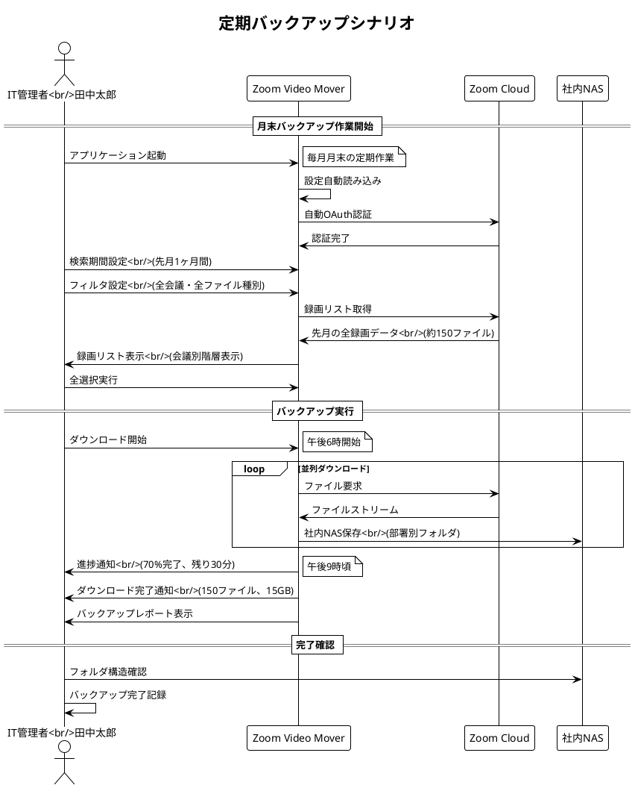
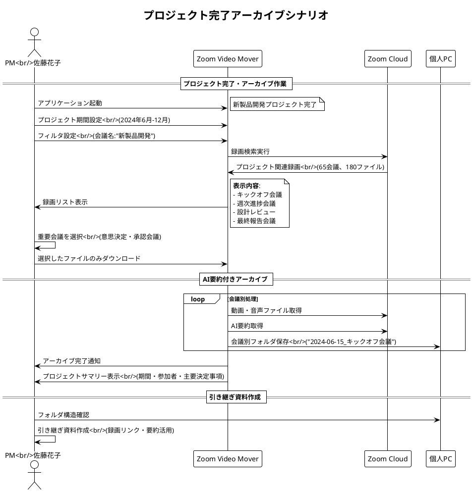
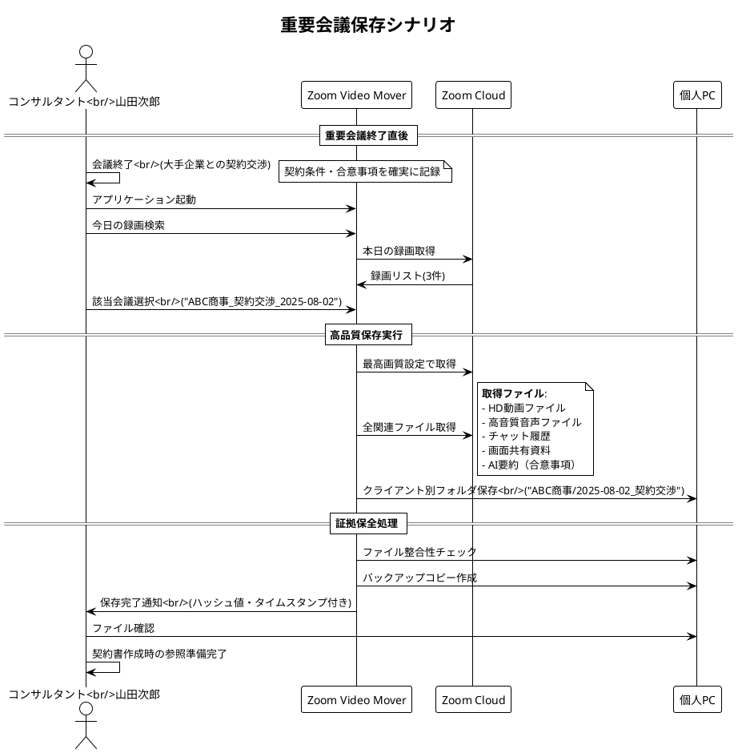
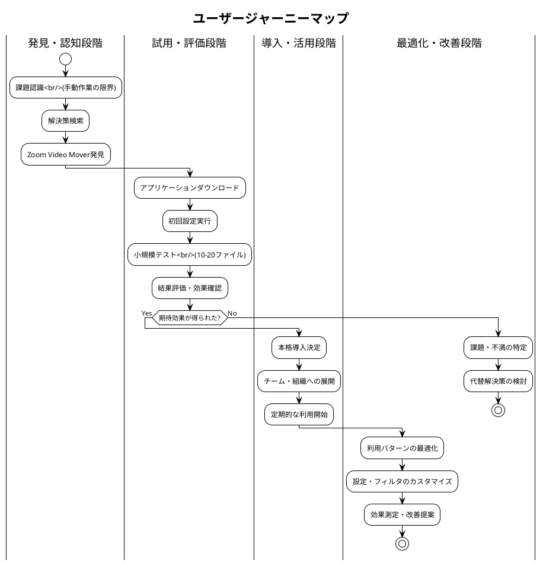

# 利用シナリオ集 - Zoom Video Mover

## 文書概要
**プロジェクト名**: Zoom Video Mover  
**作成日**: 2025-08-02  
  
**バージョン**: 1.0  

## シナリオ分類体系

### プライマリシナリオ（主要利用パターン）
1. **定期バックアップシナリオ**: 定期的な録画データのローカル保存
2. **プロジェクト完了アーカイブシナリオ**: プロジェクト完了時の録画一括整理
3. **重要会議保存シナリオ**: 重要な意思決定会議の確実な保存

### セカンダリシナリオ（付加価値パターン）
4. **研修・教育コンテンツ作成シナリオ**: 教育目的での録画活用
5. **法的証拠保全シナリオ**: コンプライアンス・監査対応
6. **オフライン視聴準備シナリオ**: ネットワーク制限環境での利用

### エクストリームシナリオ（例外・限界パターン）  
7. **大量データ移行シナリオ**: 組織移転・システム移行時の一括処理
8. **緊急データ回復シナリオ**: Zoom容量制限・削除前の緊急保存
9. **ネットワーク制限環境シナリオ**: 低帯域・不安定回線での利用

## プライマリシナリオ詳細

### シナリオ1: 定期バックアップシナリオ

#### ユーザープロファイル
- **ユーザー**: 田中太郎（IT管理者、35歳）
- **組織**: 中小IT企業（従業員50名）
- **技術レベル**: 中級
- **利用頻度**: 毎月1回（月末）

#### 利用コンテキスト
- **場所**: オフィス（Windows PC）
- **時間帯**: 平日夜間（業務時間後）
- **状況**: 月次バックアップ作業の一環
- **制約**: 翌日朝までに完了させる必要

#### シナリオフロー

#### 期待する体験
- **効率性**: 手動作業時間の90%削減（3日 → 3時間）
- **信頼性**: ファイル取得率99.9%以上
- **利便性**: 設定保存により毎回同じ操作で実行可能
- **安心感**: 進捗表示とエラー通知による状況把握

#### 成功基準
- [ ] 150ファイル（15GB）を3時間以内でダウンロード完了
- [ ] ファイル整合性100%（破損・欠損なし）
- [ ] 会議別フォルダで適切に整理保存
- [ ] エラー発生時の自動回復・通知

### シナリオ2: プロジェクト完了アーカイブシナリオ

#### ユーザープロファイル
- **ユーザー**: 佐藤花子（プロジェクトマネージャー、42歳）
- **組織**: 大手製造業（従業員1000名）
- **技術レベル**: 初級〜中級
- **利用頻度**: プロジェクト完了時（年3-4回）

#### 利用コンテキスト
- **場所**: 自宅（リモートワーク）
- **時間帯**: 土日（個人時間）
- **状況**: 半年間のプロジェクト完了・引き継ぎ準備
- **制約**: プロジェクト関連録画のみを確実に保存

#### シナリオフロー

#### 期待する体験
- **選択性**: プロジェクト関連録画のみを正確に抽出
- **整理性**: 会議別・時系列での自動整理
- **理解性**: AI要約による会議内容の把握
- **引き継ぎ性**: 後任者への効率的な情報継承

#### 成功基準
- [ ] プロジェクト関連録画の100%特定・抽出
- [ ] 会議別フォルダでの時系列整理
- [ ] AI要約による会議サマリー取得
- [ ] 引き継ぎ資料作成時間の50%削減

### シナリオ3: 重要会議保存シナリオ

#### ユーザープロファイル
- **ユーザー**: 山田次郎（個人事業主・コンサルタント、48歳）
- **組織**: フリーランス
- **技術レベル**: 初級
- **利用頻度**: 重要クライアント会議後（月2-3回）

#### 利用コンテキスト
- **場所**: 自宅オフィス
- **時間帯**: 会議直後
- **状況**: クライアントとの契約・提案会議
- **制約**: 証拠保全・契約根拠として確実に保存

#### シナリオフロー

#### 期待する体験
- **即時性**: 会議終了後すぐに保存開始
- **完全性**: 全関連ファイルの確実な取得
- **証拠性**: 改ざん検出・タイムスタンプ機能
- **整理性**: クライアント別の体系的管理

#### 成功基準
- [ ] 会議終了から5分以内に保存開始
- [ ] 全関連ファイル（動画・音声・チャット・資料）の取得
- [ ] ファイル整合性の保証（ハッシュ値チェック）
- [ ] クライアント別フォルダでの適切な整理

## セカンダリシナリオ詳細

### シナリオ4: 研修・教育コンテンツ作成シナリオ

#### ユーザープロファイル
- **ユーザー**: 鈴木美穂（企業研修講師、38歳）
- **組織**: 研修会社
- **技術レベル**: 中級
- **利用頻度**: 研修実施後（月5-8回）

#### 利用コンテキスト
- **目的**: オンライン研修録画の教材化
- **対象**: 複数企業向けビジネススキル研修
- **要件**: 再利用可能な教材ライブラリ構築

#### シナリオフロー概要
1. **研修録画の一括取得**: 月次研修録画をテーマ別に分類
2. **教材用編集準備**: チャプター情報・資料との関連付け
3. **受講者配布準備**: アクセス制御・配布用フォーマット準備

#### 期待効果
- **効率化**: 教材作成時間の60%削減
- **品質向上**: 統一フォーマットでの教材管理
- **再利用性**: 過去研修の効率的な活用

### シナリオ5: 法的証拠保全シナリオ

#### ユーザープロファイル
- **ユーザー**: 法務部担当者
- **組織**: 上場企業
- **技術レベル**: 初級
- **利用頻度**: 法的問題発生時（年1-2回）

#### 利用コンテキスト
- **目的**: 取締役会・重要な意思決定会議の証拠保全
- **要件**: 改ざん防止・長期保存対応
- **制約**: 法的要件に準拠した保存形式

#### 特別要件
- **改ざん検出**: ハッシュ値・デジタルタイムスタンプ
- **長期保存**: 10年間の可読性保証
- **監査対応**: 外部監査人への提出対応

## エクストリームシナリオ詳細

### シナリオ7: 大量データ移行シナリオ

#### 利用コンテキスト
- **状況**: 会社統合・システム移行
- **データ量**: 5,000ファイル・500GB
- **時間制限**: 1週間以内
- **制約**: 業務継続しながらの実行

#### 技術的課題
- **スループット**: 大量データの効率的処理
- **安定性**: 長時間実行での安定動作
- **回復性**: 中断・再開機能

#### 成功基準
- [ ] 5,000ファイルの100%取得
- [ ] エラー率1%以下
- [ ] 自動再開・進捗保存機能

### シナリオ8: 緊急データ回復シナリオ

#### 利用コンテキスト
- **状況**: Zoom容量制限警告・自動削除直前
- **緊急度**: 48時間以内
- **重要度**: ビジネス継続に必須のデータ

#### 特別機能要件
- **優先度制御**: 重要ファイルの優先処理
- **高速化**: 最大並列数での実行
- **通知**: リアルタイム進捗・完了通知

## ユーザージャーニーマップ

### ユーザー体験の時系列分析

### タッチポイント別体験設計

| フェーズ | タッチポイント | ユーザー感情 | 改善ポイント |
|----------|----------------|-------------|-------------|
| **認知** | Webサイト・口コミ | 期待・懸念 | 明確な価値提案・実績提示 |
| **試用** | 初回設定・操作 | 不安・混乱 | 直感的UI・ガイド機能 |
| **評価** | 結果確認 | 驚き・満足 | 効果の可視化・比較表示 |
| **導入** | 本格運用 | 信頼・安心 | 安定性・サポート体制 |
| **活用** | 日常利用 | 習慣・依存 | 継続的な価値提供 |

## シナリオ検証・テスト計画

### 検証方法
1. **ユーザビリティテスト**: 実際のユーザーによるシナリオ実行
2. **A/Bテスト**: 異なるUI・フローの比較検証
3. **負荷テスト**: エクストリームシナリオでの性能検証

### 成功指標
- **完了率**: シナリオ完了率95%以上
- **効率性**: 従来比時間短縮80%以上
- **満足度**: ユーザー満足度85%以上
- **エラー率**: 操作エラー率5%以下

---

**承認**:  
**品質基準適合**: [ ] 確認済  
**ポリシー準拠**: [ ] 確認済  
**承認日**: ___________