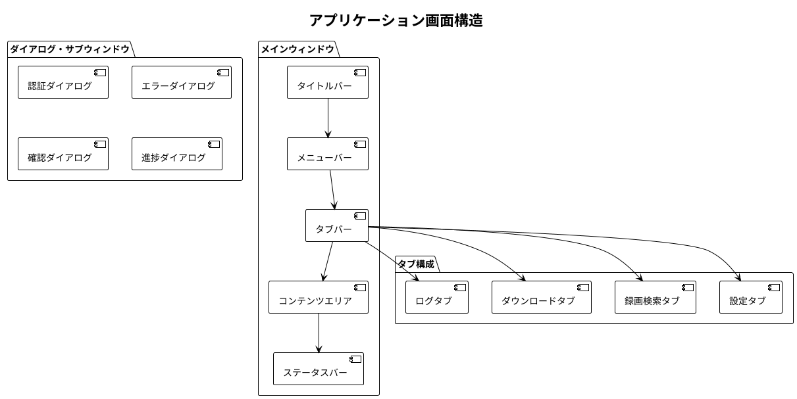
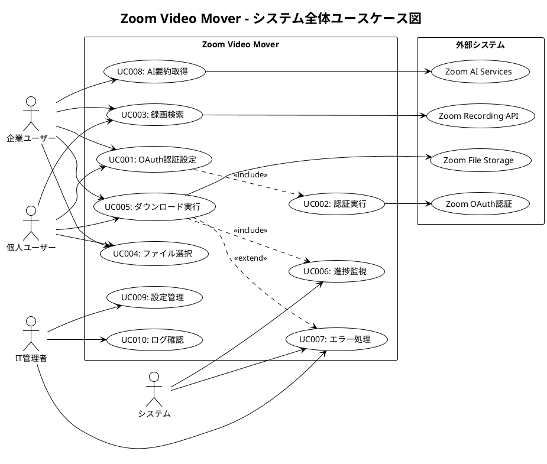
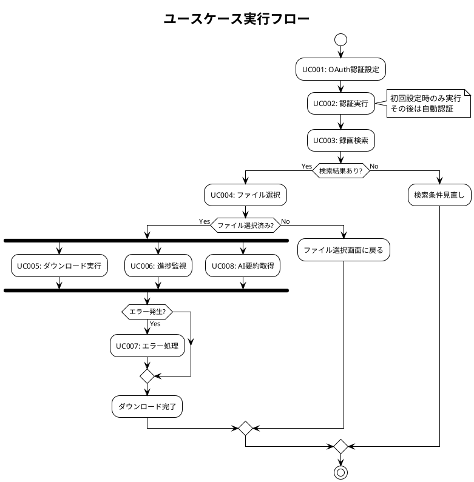

# Phase 3: システム境界

---
## API仕様


## 文書概要
**プロジェクト名**: Zoom Video Mover  
**作成日**: 2025-08-02  
  
**バージョン**: 1.0  

## 外部API連携仕様

### Zoom Cloud Recording API連携

#### API概要
- **ベースURL**: `https://api.zoom.us/v2`
- **認証方式**: OAuth 2.0 (Authorization Code Flow)
- **レート制限**: 10 requests/second
- **データ形式**: JSON
- **文字エンコーディング**: UTF-8

#### 認証フロー仕様

##### OAuth 2.0 設定
```json
{
  "auth_endpoint": "https://zoom.us/oauth/authorize",
  "token_endpoint": "https://api.zoom.us/oauth/token",
  "client_id": "CLIENT_ID",
  "client_secret": "CLIENT_SECRET",
  "redirect_uri": "http://localhost:8080/oauth/callback",
  "scope": "recording:read user:read meeting:read",
  "response_type": "code",
  "state": "RANDOM_STATE_STRING"
}
```

##### 認証URL生成
```http
GET /oauth/authorize HTTP/1.1
Host: zoom.us

Parameters:
  response_type=code
  client_id={CLIENT_ID}
  redirect_uri={REDIRECT_URI}
  scope=recording:read user:read meeting:read
  state={STATE}
```

##### アクセストークン取得
```http
POST /oauth/token HTTP/1.1
Host: api.zoom.us
Content-Type: application/x-www-form-urlencoded

grant_type=authorization_code
&code={AUTHORIZATION_CODE}
&redirect_uri={REDIRECT_URI}
&client_id={CLIENT_ID}
&client_secret={CLIENT_SECRET}
```

**レスポンス**:
```json
{
  "access_token": "ACCESS_TOKEN",
  "token_type": "bearer",
  "refresh_token": "REFRESH_TOKEN",
  "expires_in": 3600,
  "scope": "recording:read user:read meeting:read"
}
```

#### 録画一覧取得API

##### エンドポイント: `/users/{userId}/recordings`

**リクエスト**:
```http
GET /v2/users/me/recordings HTTP/1.1
Host: api.zoom.us
Authorization: Bearer {ACCESS_TOKEN}

Parameters:
  from={YYYY-MM-DD}           # 必須: 検索開始日
  to={YYYY-MM-DD}             # 必須: 検索終了日
  page_size={NUMBER}          # オプション: ページサイズ(1-300, デフォルト30)
  next_page_token={TOKEN}     # オプション: 次ページトークン
  mc={BOOLEAN}                # オプション: 音声のみ会議を含む
  trash={BOOLEAN}             # オプション: ゴミ箱の録画を含む
```

**レスポンス**:
```json
{
  "from": "2025-07-01",
  "to": "2025-08-01",
  "page_count": 3,
  "page_size": 30,
  "total_records": 85,
  "next_page_token": "NEXT_PAGE_TOKEN",
  "meetings": [
    {
      "uuid": "MEETING_UUID",
      "id": 123456789,
      "account_id": "ACCOUNT_ID",
      "host_id": "HOST_ID",
      "topic": "週次進捗会議",
      "type": 2,
      "start_time": "2025-08-01T09:00:00Z",
      "timezone": "Asia/Tokyo",
      "duration": 60,
      "total_size": 1288490188,
      "recording_count": 3,
      "share_url": "https://zoom.us/rec/share/...",
      "recording_files": [
        {
          "id": "FILE_ID_1",
          "meeting_id": "123456789",
          "recording_start": "2025-08-01T09:00:05Z",
          "recording_end": "2025-08-01T10:00:02Z",
          "file_type": "MP4",
          "file_extension": "MP4",
          "file_size": 1258291027,
          "play_url": "https://zoom.us/rec/play/...",
          "download_url": "https://zoom.us/rec/download/...",
          "status": "completed",
          "deleted_time": null,
          "recording_type": "shared_screen_with_speaker_view"
        },
        {
          "id": "FILE_ID_2", 
          "meeting_id": "123456789",
          "recording_start": "2025-08-01T09:00:05Z",
          "recording_end": "2025-08-01T10:00:02Z",
          "file_type": "M4A",
          "file_extension": "M4A", 
          "file_size": 89088123,
          "play_url": "https://zoom.us/rec/play/...",
          "download_url": "https://zoom.us/rec/download/...",
          "status": "completed",
          "deleted_time": null,
          "recording_type": "audio_only"
        },
        {
          "id": "FILE_ID_3",
          "meeting_id": "123456789", 
          "recording_start": "2025-08-01T09:00:05Z",
          "recording_end": "2025-08-01T10:00:02Z",
          "file_type": "CHAT",
          "file_extension": "TXT",
          "file_size": 2048,
          "play_url": "",
          "download_url": "https://zoom.us/rec/download/...",
          "status": "completed",
          "deleted_time": null,
          "recording_type": "chat_file"
        }
      ]
    }
  ]
}
```

#### ファイル種別・録画タイプ定義

##### ファイル種別 (file_type)
| 種別 | 説明 | 拡張子 | 典型的サイズ |
|------|------|--------|-------------|
| **MP4** | 動画ファイル | .mp4 | 100MB-5GB |
| **M4A** | 音声ファイル | .m4a | 10MB-500MB |
| **CHAT** | チャット履歴 | .txt | 1KB-100KB |
| **CC** | クローズドキャプション | .vtt | 5KB-500KB |
| **CSV** | 投票・Q&A結果 | .csv | 1KB-50KB |

##### 録画タイプ (recording_type)
| タイプ | 説明 | 主な用途 |
|--------|------|----------|
| **shared_screen_with_speaker_view** | 画面共有+発話者表示 | プレゼンテーション |
| **shared_screen_with_gallery_view** | 画面共有+ギャラリー表示 | 大人数会議 |
| **speaker_view** | 発話者中心表示 | 講演・研修 |
| **gallery_view** | 全参加者表示 | ディスカッション |
| **audio_only** | 音声のみ | 音声会議 |
| **chat_file** | チャットファイル | テキスト記録 |

#### ファイルダウンロードAPI

##### ダウンロードURL取得
```http
GET {download_url} HTTP/1.1
Authorization: Bearer {ACCESS_TOKEN}
Range: bytes=0-1048575  # オプション: 範囲指定
```

**レスポンス**:
```http
HTTP/1.1 200 OK
Content-Type: video/mp4
Content-Length: 1258291027
Content-Range: bytes 0-1048575/1258291027
Accept-Ranges: bytes

[バイナリデータ]
```

#### AI要約取得API（実験的）

##### エンドポイント: `/meetings/{meetingId}/summary`

**リクエスト**:
```http
GET /v2/meetings/{meetingId}/summary HTTP/1.1
Host: api.zoom.us
Authorization: Bearer {ACCESS_TOKEN}
```

**レスポンス**:
```json
{
  "meeting_id": "123456789",
  "meeting_uuid": "MEETING_UUID",
  "summary": {
    "overview": "週次進捗会議の要約です。プロジェクトの進捗状況と課題について議論しました。",
    "key_points": [
      "新機能の開発が予定より2日遅れている",
      "バグ修正のため追加テストが必要",
      "次回リリース日程を1週間延期することで合意"
    ],
    "action_items": [
      {
        "description": "バグ修正とテスト完了",
        "assignee": "開発チーム",
        "due_date": "2025-08-05"
      },
      {
        "description": "クライアントへのスケジュール変更連絡",
        "assignee": "プロジェクトマネージャー",
        "due_date": "2025-08-02"
      }
    ],
    "participants_summary": [
      {
        "name": "田中太郎",
        "join_time": "2025-08-01T09:00:00Z",
        "leave_time": "2025-08-01T10:00:00Z",
        "speaking_time": "15分30秒"
      }
    ],
    "created_at": "2025-08-01T10:05:00Z"
  }
}
```

## エラーハンドリング仕様

### HTTPステータスコード対応

#### 2xx: 成功レスポンス
| コード | 説明 | 対応 |
|--------|------|------|
| **200 OK** | 正常処理完了 | データ取得・表示 |
| **206 Partial Content** | 部分コンテンツ取得 | 範囲指定ダウンロード継続 |

#### 4xx: クライアントエラー  
| コード | 説明 | 自動対応 | ユーザー対応 |
|--------|------|----------|-------------|
| **400 Bad Request** | リクエスト形式エラー | ログ記録 | エラー詳細表示 |
| **401 Unauthorized** | 認証エラー | トークン更新試行 | 再認証促進 |
| **403 Forbidden** | アクセス権限なし | - | 権限確認促進 |
| **404 Not Found** | リソース不存在 | - | ファイル削除済み通知 |
| **429 Too Many Requests** | レート制限超過 | 自動待機・リトライ | 待機状況表示 |

#### 5xx: サーバーエラー
| コード | 説明 | 自動対応 | ユーザー対応 |
|--------|------|----------|-------------|
| **500 Internal Server Error** | サーバー内部エラー | リトライ(最大3回) | エラー報告促進 |
| **502 Bad Gateway** | ゲートウェイエラー | リトライ(最大3回) | 一時的エラー通知 |
| **503 Service Unavailable** | サービス利用不可 | 指数バックオフリトライ | メンテナンス情報表示 |

### エラーレスポンス形式

#### 標準エラーレスポンス
```json
{
  "code": 124,
  "message": "Invalid access token."
}
```

#### 詳細エラーレスポンス（4xx系）
```json
{
  "code": 400,
  "message": "Bad Request",
  "errors": [
    {
      "field": "from",
      "message": "Invalid date format. Expected YYYY-MM-DD."
    },
    {
      "field": "to", 
      "message": "End date must be after start date."
    }
  ]
}
```

### リトライ戦略

#### 指数バックオフアルゴリズム
```rust
fn calculate_retry_delay(attempt: u32, base_delay_ms: u64) -> Duration {
    let delay_ms = base_delay_ms * 2_u64.pow(attempt);
    let jitter = rand::random::<f64>() * 0.1; // 10%のジッター
    Duration::from_millis((delay_ms as f64 * (1.0 + jitter)) as u64)
}

// 使用例
// 1回目: 1秒 + ジッター
// 2回目: 2秒 + ジッター  
// 3回目: 4秒 + ジッター
```

#### リトライ条件
| エラー種別 | リトライ | 最大回数 | 間隔 |
|------------|----------|----------|------|
| **ネットワークタイムアウト** | Yes | 3回 | 指数バックオフ |
| **レート制限 (429)** | Yes | 無制限 | Retry-After ヘッダー準拠 |
| **サーバーエラー (5xx)** | Yes | 3回 | 指数バックオフ |
| **認証エラー (401)** | No | - | トークン更新後再実行 |
| **権限エラー (403)** | No | - | ユーザー対応必要 |
| **クライアントエラー (400,404)** | No | - | ユーザー対応必要 |

## 内部API設計

### アプリケーション内部モジュール間API

#### 認証モジュールAPI

##### OAuthManager Interface
```rust
pub trait OAuthManager {
    async fn authenticate(&self, config: &OAuthConfig) -> Result<AccessToken, AuthError>;
    async fn refresh_token(&self, refresh_token: &str) -> Result<AccessToken, AuthError>;
    fn is_token_valid(&self, token: &AccessToken) -> bool;
    async fn revoke_token(&self, token: &AccessToken) -> Result<(), AuthError>;
}

pub struct ZoomOAuthManager {
    client: reqwest::Client,
    config: OAuthConfig,
}

impl OAuthManager for ZoomOAuthManager {
    async fn authenticate(&self, config: &OAuthConfig) -> Result<AccessToken, AuthError> {
        // OAuth認証フロー実装
        let auth_url = self.build_auth_url(config)?;
        let auth_code = self.start_oauth_flow(&auth_url).await?;
        let token = self.exchange_code_for_token(&auth_code).await?;
        Ok(token)
    }
    
    async fn refresh_token(&self, refresh_token: &str) -> Result<AccessToken, AuthError> {
        // リフレッシュトークンでアクセストークン更新
        let request = TokenRefreshRequest {
            grant_type: "refresh_token".to_string(),
            refresh_token: refresh_token.to_string(),
            client_id: self.config.client_id.clone(),
            client_secret: self.config.client_secret.clone(),
        };
        
        let response = self.client
            .post("https://api.zoom.us/oauth/token")
            .form(&request)
            .send()
            .await?;
            
        let token_response: TokenResponse = response.json().await?;
        Ok(AccessToken::from(token_response))
    }
}
```

#### 録画管理モジュールAPI

##### RecordingManager Interface
```rust
pub trait RecordingManager {
    async fn get_recordings(&self, filter: &RecordingFilter) -> Result<Vec<Meeting>, ApiError>;
    async fn get_recording_files(&self, meeting_id: &str) -> Result<Vec<RecordingFile>, ApiError>;
    async fn download_file(&self, file: &RecordingFile, output_path: &Path) -> Result<LocalFile, DownloadError>;
}

pub struct ZoomRecordingManager {
    client: reqwest::Client,
    auth_manager: Arc<dyn OAuthManager>,
}

#[derive(Debug, Clone)]
pub struct RecordingFilter {
    pub from_date: chrono::Date<chrono::Utc>,
    pub to_date: chrono::Date<chrono::Utc>,
    pub file_types: Vec<FileType>,
    pub meeting_name_pattern: Option<String>,
    pub page_size: Option<u32>,
}

impl RecordingManager for ZoomRecordingManager {
    async fn get_recordings(&self, filter: &RecordingFilter) -> Result<Vec<Meeting>, ApiError> {
        let token = self.auth_manager.get_valid_token().await?;
        
        let mut all_meetings = Vec::new();
        let mut next_page_token: Option<String> = None;
        
        loop {
            let url = format!("https://api.zoom.us/v2/users/me/recordings");
            let mut request = self.client
                .get(&url)
                .bearer_auth(&token.access_token)
                .query(&[
                    ("from", filter.from_date.format("%Y-%m-%d").to_string()),
                    ("to", filter.to_date.format("%Y-%m-%d").to_string()),
                ]);
                
            if let Some(page_token) = &next_page_token {
                request = request.query(&[("next_page_token", page_token)]);
            }
            
            let response = request.send().await?;
            let recordings_response: RecordingsResponse = response.json().await?;
            
            all_meetings.extend(recordings_response.meetings);
            
            if recordings_response.next_page_token.is_none() {
                break;
            }
            next_page_token = recordings_response.next_page_token;
        }
        
        Ok(all_meetings)
    }
}
```

#### ダウンロードエンジンAPI

##### DownloadEngine Interface
```rust
pub trait DownloadEngine {
    async fn start_download_session(&self, files: Vec<RecordingFile>) -> Result<DownloadSession, DownloadError>;
    async fn pause_session(&self, session_id: &str) -> Result<(), DownloadError>;
    async fn resume_session(&self, session_id: &str) -> Result<(), DownloadError>;
    async fn cancel_session(&self, session_id: &str) -> Result<(), DownloadError>;
    fn get_session_progress(&self, session_id: &str) -> Option<DownloadProgress>;
}

pub struct ParallelDownloadEngine {
    max_concurrent: usize,
    client: reqwest::Client,
    recording_manager: Arc<dyn RecordingManager>,
    progress_reporter: Arc<dyn ProgressReporter>,
}

#[derive(Debug, Clone)]
pub struct DownloadSession {
    pub id: String,
    pub files: Vec<RecordingFile>,
    pub status: SessionStatus,
    pub created_at: chrono::DateTime<chrono::Utc>,
    pub output_directory: PathBuf,
}

#[derive(Debug, Clone)]
pub struct DownloadProgress {
    pub total_files: usize,
    pub completed_files: usize,
    pub failed_files: usize,
    pub total_bytes: u64,
    pub downloaded_bytes: u64,
    pub transfer_rate: f64, // bytes/sec
    pub estimated_time_remaining: Option<Duration>,
}

impl DownloadEngine for ParallelDownloadEngine {
    async fn start_download_session(&self, files: Vec<RecordingFile>) -> Result<DownloadSession, DownloadError> {
        let session = DownloadSession {
            id: uuid::Uuid::new_v4().to_string(),
            files: files.clone(),
            status: SessionStatus::Running,
            created_at: chrono::Utc::now(),
            output_directory: self.get_output_directory(),
        };
        
        // 並列ダウンロードタスク開始
        let semaphore = Arc::new(Semaphore::new(self.max_concurrent));
        let tasks: Vec<_> = files.into_iter().map(|file| {
            let semaphore = semaphore.clone();
            let engine = self.clone();
            let session_id = session.id.clone();
            
            tokio::spawn(async move {
                let _permit = semaphore.acquire().await.unwrap();
                engine.download_single_file(&session_id, file).await
            })
        }).collect();
        
        // タスク完了を監視
        tokio::spawn(async move {
            for task in tasks {
                if let Err(e) = task.await {
                    error!("Download task failed: {}", e);
                }
            }
        });
        
        Ok(session)
    }
}
```

## 通信プロトコル・セキュリティ仕様

### HTTPS通信設定

#### TLS設定
```rust
use reqwest::ClientBuilder;
use reqwest::tls;

fn create_secure_client() -> Result<reqwest::Client, reqwest::Error> {
    ClientBuilder::new()
        .min_tls_version(tls::Version::TLS_1_2)  // TLS 1.2以上を強制
        .https_only(true)                        // HTTPS通信を強制
        .timeout(Duration::from_secs(30))        // タイムアウト設定
        .connect_timeout(Duration::from_secs(10)) // 接続タイムアウト
        .user_agent("ZoomVideoMover/1.0")        // User-Agent設定
        .build()
}
```

#### 証明書検証
- **標準CA証明書**: システム標準の証明書ストアを使用
- **証明書ピンニング**: Zoom.us 証明書の事前検証（オプション）
- **証明書エラー**: 検証失敗時の接続拒否

### 認証情報保護

#### トークン暗号化保存
```rust
use ring::aead;
use ring::rand::{SecureRandom, SystemRandom};

struct SecureTokenStorage {
    key: aead::LessSafeKey,
    nonce_sequence: u64,
}

impl SecureTokenStorage {
    fn encrypt_token(&mut self, token: &AccessToken) -> Result<Vec<u8>, StorageError> {
        let nonce = self.generate_nonce()?;
        let plaintext = serde_json::to_vec(token)?;
        
        let mut ciphertext = Vec::new();
        ciphertext.extend_from_slice(&nonce.as_ref());
        ciphertext.extend_from_slice(&plaintext);
        
        self.key.seal_in_place_append_tag(nonce, aead::Aad::empty(), &mut ciphertext[12..])?;
        Ok(ciphertext)
    }
    
    fn decrypt_token(&self, encrypted_data: &[u8]) -> Result<AccessToken, StorageError> {
        let (nonce_bytes, ciphertext) = encrypted_data.split_at(12);
        let nonce = aead::Nonce::try_assume_unique_for_key(nonce_bytes)?;
        
        let mut decrypted = ciphertext.to_vec();
        let plaintext = self.key.open_in_place(nonce, aead::Aad::empty(), &mut decrypted)?;
        
        let token: AccessToken = serde_json::from_slice(plaintext)?;
        Ok(token)
    }
}
```

#### プロキシ対応
```rust
fn configure_proxy_client(proxy_url: Option<&str>) -> reqwest::Client {
    let mut builder = ClientBuilder::new();
    
    if let Some(proxy) = proxy_url {
        builder = builder.proxy(reqwest::Proxy::all(proxy).unwrap());
    }
    
    // システムプロキシ設定の自動検出
    builder = builder.proxy(reqwest::Proxy::system());
    
    builder.build().unwrap()
}
```

## API使用量制限・監視

### レート制限対応

#### レート制限監視
```rust
use std::sync::atomic::{AtomicU64, Ordering};
use tokio::time::{Duration, Instant};

pub struct RateLimiter {
    requests_per_second: u32,
    last_request_time: AtomicU64,
    request_count: AtomicU64,
}

impl RateLimiter {
    pub async fn acquire_permit(&self) -> Result<(), RateLimitError> {
        let now = Instant::now().elapsed().as_millis() as u64;
        let last_time = self.last_request_time.load(Ordering::Relaxed);
        
        // 1秒経過したらカウンタリセット
        if now - last_time >= 1000 {
            self.request_count.store(0, Ordering::Relaxed);
            self.last_request_time.store(now, Ordering::Relaxed);
        }
        
        let current_count = self.request_count.fetch_add(1, Ordering::Relaxed);
        
        if current_count >= self.requests_per_second as u64 {
            let wait_time = 1000 - (now - last_time);
            tokio::time::sleep(Duration::from_millis(wait_time)).await;
        }
        
        Ok(())
    }
}
```

#### Retry-After ヘッダー対応
```rust
async fn handle_rate_limit_response(response: &reqwest::Response) -> Result<Duration, ApiError> {
    if response.status() == 429 {
        if let Some(retry_after) = response.headers().get("Retry-After") {
            let retry_seconds: u64 = retry_after.to_str()?.parse()?;
            return Ok(Duration::from_secs(retry_seconds));
        }
    }
    Ok(Duration::from_secs(1)) // デフォルト待機時間
}
```

### API使用量監視

#### 使用量追跡
```rust
#[derive(Debug, Clone)]
pub struct ApiUsageMetrics {
    pub total_requests: u64,
    pub successful_requests: u64,
    pub failed_requests: u64,
    pub rate_limited_requests: u64,
    pub total_bytes_downloaded: u64,
    pub session_start_time: chrono::DateTime<chrono::Utc>,
}

impl ApiUsageMetrics {
    pub fn record_request(&mut self, success: bool, rate_limited: bool, bytes: u64) {
        self.total_requests += 1;
        
        if success {
            self.successful_requests += 1;
            self.total_bytes_downloaded += bytes;
        } else {
            self.failed_requests += 1;
        }
        
        if rate_limited {
            self.rate_limited_requests += 1;
        }
    }
    
    pub fn get_success_rate(&self) -> f64 {
        if self.total_requests == 0 {
            return 0.0;
        }
        self.successful_requests as f64 / self.total_requests as f64
    }
    
    pub fn get_average_transfer_rate(&self) -> f64 {
        let elapsed = chrono::Utc::now().signed_duration_since(self.session_start_time);
        let elapsed_seconds = elapsed.num_seconds() as f64;
        
        if elapsed_seconds > 0.0 {
            self.total_bytes_downloaded as f64 / elapsed_seconds
        } else {
            0.0
        }
    }
}
```

---

**承認**:  
**品質基準適合**: [ ] 確認済  
**ポリシー準拠**: [ ] 確認済  
**承認日**: ___________
---
## UI設計仕様


## 文書概要
**プロジェクト名**: Zoom Video Mover  
**作成日**: 2025-08-02  
  
**バージョン**: 1.0  

## UI/UX設計原則

### 基本設計方針

#### 1. シンプルさ（Simplicity）
- **最小限のステップ**: 3クリック以内でダウンロード開始
- **明確な視覚階層**: 重要な機能を強調、補助機能を背景化
- **認知負荷の軽減**: 一画面に表示する情報量を制限

#### 2. 効率性（Efficiency）
- **ワークフロー最適化**: タスク完了までの時間を最小化
- **一括操作**: 複数ファイルの同時処理をサポート
- **設定保存**: 繰り返し作業の効率化

#### 3. 信頼性（Reliability）
- **進捗の可視化**: 処理状況の透明性確保
- **エラー情報**: 明確で実行可能なエラーメッセージ
- **操作の可逆性**: 重要操作の確認・取り消し機能

#### 4. アクセシビリティ（Accessibility）
- **技術レベル対応**: 初級ユーザーから上級ユーザーまで
- **多言語対応**: 日本語・英語UI
- **キーボードナビゲーション**: マウス操作の代替手段

### 画面構成・ナビゲーション

#### アプリケーション構造



## 詳細画面設計

### SC001: メイン画面（アプリケーションフレーム）

#### 画面概要
- **目的**: アプリケーション全体の基盤UI
- **利用者**: 全ユーザー
- **表示タイミング**: アプリケーション起動時
- **画面サイズ**: 1024x768px（最小）、リサイズ対応

#### レイアウト設計

```
┌─────────────────────────────────────────────────────────────┐
│ Zoom Video Mover v1.0                              [_][□][×] │
├─────────────────────────────────────────────────────────────┤
│ ファイル(F) 編集(E) 表示(V) ツール(T) ヘルプ(H)                 │
├─────────────────────────────────────────────────────────────┤
│ [設定] [録画検索] [ダウンロード] [ログ]                          │
├─────────────────────────────────────────────────────────────┤
│                                                            │
│                    コンテンツエリア                          │
│                   （各タブの内容）                          │
│                                                            │
│                                                            │
│                                                            │
│                                                            │
├─────────────────────────────────────────────────────────────┤
│ 接続状態: ●接続中 | 最終更新: 2025-08-02 10:30 | メモリ: 245MB │
└─────────────────────────────────────────────────────────────┘
```

#### UI要素定義
| 要素 | 説明 | 動作 |
|------|------|------|
| **タイトルバー** | アプリ名・バージョン表示 | ウィンドウ移動・最小化・閉じる |
| **メニューバー** | 主要機能へのアクセス | ドロップダウンメニュー |
| **タブバー** | 機能画面の切り替え | クリックでタブ切り替え |
| **ステータスバー** | システム状態・統計情報 | リアルタイム更新 |

### SC002: 設定画面

#### 画面概要
- **目的**: OAuth認証・アプリケーション設定
- **利用者**: 初回設定時・設定変更時
- **前提条件**: アプリケーションが起動済み
- **完了条件**: 設定が保存され、認証が完了

#### レイアウト設計

```
┌─────────────────────────────────────────────────────────────┐
│                        設定                                 │
├─────────────────────────────────────────────────────────────┤
│ ┌─ OAuth認証設定 ──────────────────────────────────────────┐ │
│ │                                                        │ │
│ │ Client ID      [________________________________] [必須] │ │
│ │ Client Secret  [********************************] [必須] │ │
│ │ Redirect URI   [________________________________] [任意] │ │
│ │                                                        │ │
│ │ [認証テスト] [設定をリセット]                              │ │
│ └────────────────────────────────────────────────────────┘ │
│                                                            │
│ ┌─ ダウンロード設定 ──────────────────────────────────────┐ │
│ │                                                        │ │
│ │ 出力フォルダ   [C:\Downloads\ZoomRecordings____] [参照] │ │
│ │ 同時DL数      [5______] ファイル                       │ │
│ │ リトライ回数   [3______] 回                            │ │
│ │ タイムアウト   [30_____] 秒                            │ │
│ │                                                        │ │
│ │ ☑ 会議別フォルダを作成する                               │ │
│ │ ☑ ファイル名に日時を含める                               │ │
│ │ ☑ 重複ファイルを自動リネーム                             │ │
│ └────────────────────────────────────────────────────────┘ │
│                                                            │
│ ┌─ 表示・動作設定 ──────────────────────────────────────┐ │
│ │                                                        │ │
│ │ 言語          [日本語            ▼]                    │ │
│ │ テーマ        [ライト            ▼]                    │ │
│ │ 自動更新チェック [有効              ▼]                    │ │
│ │ ログレベル     [情報              ▼]                    │ │
│ └────────────────────────────────────────────────────────┘ │
│                                                            │
│                    [保存] [キャンセル] [適用]                │
└─────────────────────────────────────────────────────────────┘
```

#### 設定項目詳細

##### OAuth認証設定
| 項目 | 形式 | 検証ルール | デフォルト値 |
|------|------|-----------|-------------|
| **Client ID** | 文字列(20-50文字) | 英数字のみ、必須 | なし |
| **Client Secret** | 文字列(40-100文字) | 英数字記号、必須、マスク表示 | なし |
| **Redirect URI** | URL | http://localhost:8080 | http://localhost:8080 |

##### ダウンロード設定
| 項目 | 形式 | 範囲・制約 | デフォルト値 |
|------|------|----------|-------------|
| **出力フォルダ** | パス文字列 | 書き込み権限要、存在チェック | ユーザーのDownloadsフォルダ |
| **同時DL数** | 整数 | 1-10の範囲 | 5 |
| **リトライ回数** | 整数 | 0-10の範囲 | 3 |
| **タイムアウト** | 整数(秒) | 5-300の範囲 | 30 |

##### チェックボックス設定
- **会議別フォルダ作成**: 有効時、会議ごとにサブフォルダを作成
- **ファイル名に日時含める**: 有効時、ファイル名先頭に日時追加
- **重複ファイル自動リネーム**: 有効時、既存ファイルと重複時に連番追加

### SC003: 認証画面（ダイアログ）

#### 画面概要
- **目的**: OAuth認証フローの実行・進捗表示
- **表示タイミング**: 初回認証時・トークン期限切れ時
- **画面種別**: モーダルダイアログ
- **サイズ**: 400x300px（固定）

#### レイアウト設計

```
┌─────────────────────────────────────────┐
│            Zoom OAuth認証               │
├─────────────────────────────────────────┤
│                                        │
│    [Zoomロゴ]     ←→    [アプリロゴ]      │
│                                        │
│   Zoom Video Moverがあなたの           │
│   Zoomアカウントにアクセスする           │
│   ことを許可しますか？                   │
│                                        │
│   ┌─ アクセス権限 ──────────────────┐    │
│   │ ☑ 録画ファイルの読み取り           │    │
│   │ ☑ ユーザー情報の読み取り           │    │
│   │ ☑ 会議情報の読み取り              │    │
│   └─────────────────────────────┘    │
│                                        │
│   1. 下のボタンをクリック               │
│   2. ブラウザでZoomにログイン           │
│   3. アクセス許可を承認                │
│                                        │
│     [ブラウザで認証開始]                │
│                                        │
│   認証状況: 待機中                      │
│   [━━━━━━━━━━] 0%                      │
│                                        │
│              [キャンセル]               │
└─────────────────────────────────────────┘
```

#### 認証フロー表示

##### 状態別表示
| 状態 | 進捗率 | メッセージ | アクション |
|------|--------|-----------|----------|
| **待機中** | 0% | 認証を開始してください | ブラウザで認証開始ボタン |
| **認証中** | 25% | ブラウザでZoomにログイン中... | 待機 |
| **許可待ち** | 50% | アクセス許可の承認をお待ちください | 待機 |
| **トークン取得中** | 75% | アクセストークンを取得中... | 待機 |
| **完了** | 100% | 認証が完了しました | 自動的にダイアログ閉じる |
| **エラー** | - | 認証に失敗しました | リトライ・キャンセルボタン |

### SC004: 録画リスト画面

#### 画面概要
- **目的**: 録画検索・ファイル選択
- **利用者**: 全ユーザー
- **前提条件**: OAuth認証完了
- **完了条件**: ダウンロード対象ファイル選択完了

#### レイアウト設計

```
┌─────────────────────────────────────────────────────────────┐
│                      録画検索                               │
├─────────────────────────────────────────────────────────────┤
│ ┌─ 検索条件 ─────────────────────────────────────────────┐ │
│ │ 期間: [2025-07-01] ～ [2025-08-01]   [過去30日][今月] │ │
│ │ 種別: ☑動画 ☑音声 ☑チャット ☑トランスクリプト        │ │
│ │ 会議名: [___________________________] [検索] [クリア]  │ │
│ └─────────────────────────────────────────────────────┘ │
│                                                            │
│ 検索結果: 85件の録画 (245ファイル, 12.3GB)                   │
│ [全選択] [全解除] [展開] [折りたたみ]                        │
│                                                            │
│ ┌─ 録画リスト ─────────────────────────────────────────┐ │
│ │ ☑ □ 2025-08-01 週次会議                     3ファイル │ │
│ │ │   ☑ 🎥 meeting_video.mp4           (1.2GB) 09:00 │ │
│ │ │   ☑ 🎵 meeting_audio.m4a            (85MB) 09:00 │ │
│ │ │   ☑ 💬 meeting_chat.txt              (2KB) 09:00 │ │
│ │ ☑ □ 2025-07-31 プロジェクト報告会           4ファイル │ │
│ │ │   ☑ 🎥 project_review.mp4          (2.1GB) 14:30 │ │
│ │ │   ☑ 🎵 project_review.m4a           (120MB) 14:30 │ │
│ │ │   ☑ 📝 project_transcript.vtt        (45KB) 14:30 │ │
│ │ │   ☑ 🤖 project_ai_summary.json       (8KB) 14:30 │ │
│ │ ☐ □ 2025-07-30 技術打ち合わせ              2ファイル │ │
│ │ │   ☐ 🎥 tech_meeting.mp4             (850MB) 16:00 │ │
│ │ │   ☐ 💬 tech_chat.txt                  (1KB) 16:00 │ │
│ │ │                                    [さらに読み込み] │ │
│ └─────────────────────────────────────────────────────┘ │
│                                                            │
│ 選択済み: 7ファイル, 3.4GB, 推定時間: 28分                    │
│                                     [ダウンロード開始]      │
└─────────────────────────────────────────────────────────────┘
```

#### UI要素定義

##### 検索条件エリア
| 要素 | 機能 | UI仕様 |
|------|------|--------|
| **期間選択** | 検索対象期間指定 | 日付ピッカー、プリセットボタン |
| **ファイル種別** | 対象ファイル種別フィルタ | チェックボックス、アイコン付き |
| **会議名検索** | 会議名部分一致検索 | テキスト入力、リアルタイム検索 |

##### 録画リストエリア
| 要素 | 機能 | UI仕様 |
|------|------|--------|
| **階層チェックボックス** | 会議・ファイル選択 | 親子連動、三状態表示 |
| **ファイルアイコン** | ファイル種別視覚化 | 種別別アイコン・色分け |
| **サイズ・時刻表示** | ファイル情報表示 | 人間が読みやすい形式 |
| **展開・折りたたみ** | 表示制御 | ツリービュー操作 |

##### ファイル種別アイコン・色分け
- **🎥 動画ファイル**: 青色、MP4形式
- **🎵 音声ファイル**: 緑色、M4A形式  
- **💬 チャットファイル**: オレンジ色、TXT形式
- **📝 トランスクリプト**: 紫色、VTT形式
- **🤖 AI要約**: 赤色、JSON形式

### SC005: ダウンロード進捗画面

#### 画面概要
- **目的**: ダウンロード実行状況の監視・制御
- **表示タイミング**: ダウンロード開始時
- **前提条件**: ダウンロード対象ファイル選択完了
- **完了条件**: 全ファイルダウンロード完了または中止

#### レイアウト設計

```
┌─────────────────────────────────────────────────────────────┐
│                    ダウンロード進捗                          │
├─────────────────────────────────────────────────────────────┤
│ ┌─ 全体進捗 ─────────────────────────────────────────────┐ │
│ │ 進捗: 7ファイル中 4完了, 2実行中, 1待機中                  │ │
│ │ [████████████████░░░░░░░░] 67% (3.4GB中2.3GB完了)      │ │
│ │ 転送速度: 15.2MB/s  残り時間: 約4分30秒                   │ │
│ │ 開始時刻: 10:30:15  経過時間: 5分20秒                     │ │
│ └─────────────────────────────────────────────────────┘ │
│                                                            │
│ ┌─ ファイル別進捗 ──────────────────────────────────────┐ │
│ │ ✅ meeting_video.mp4      [完了] 1.2GB  5.2MB/s  2:30 │ │
│ │ ✅ meeting_audio.m4a      [完了]  85MB  8.1MB/s  0:12 │ │
│ │ ✅ meeting_chat.txt       [完了]   2KB  即座     0:00 │ │
│ │ ✅ project_review.mp4     [完了] 2.1GB  12.3MB/s 3:15 │ │
│ │ ⬇️ project_review.m4a     [████████░░] 80%  120MB     │ │
│ │ ⬇️ project_transcript.vtt [██░░░░░░░░] 20%   45KB     │ │
│ │ ⏳ project_ai_summary.json [待機中]         8KB        │ │
│ └─────────────────────────────────────────────────────┘ │
│                                                            │
│ ┌─ 統計・ログ ─────────────────────────────────────────┐ │
│ │ 成功: 4ファイル  実行中: 2ファイル  待機: 1ファイル       │ │
│ │ エラー: 0ファイル  リトライ: 0回                         │ │
│ │                                                        │ │
│ │ 10:30:15 ダウンロード開始                               │ │
│ │ 10:32:45 meeting_video.mp4 完了                        │ │
│ │ 10:32:57 meeting_audio.m4a 完了                        │ │
│ │ 10:32:57 meeting_chat.txt 完了                         │ │
│ │ 10:36:10 project_review.mp4 完了                       │ │
│ │ 10:36:11 project_review.m4a 開始                       │ │
│ └─────────────────────────────────────────────────────┘ │
│                                                            │
│            [一時停止] [キャンセル] [フォルダを開く]            │
└─────────────────────────────────────────────────────────────┘
```

#### 進捗表示詳細

##### 全体進捗バー
- **視覚要素**: プログレスバー、パーセント、データ量
- **更新頻度**: 500ms間隔
- **色分け**: 正常（青）、警告（オレンジ）、エラー（赤）

##### ファイル別ステータス
| ステータス | アイコン | 色 | 表示内容 |
|------------|----------|-------|----------|
| **待機中** | ⏳ | グレー | ファイル名、サイズ |
| **実行中** | ⬇️ | 青 | プログレスバー、転送速度 |
| **完了** | ✅ | 緑 | 完了時刻、平均速度 |
| **エラー** | ❌ | 赤 | エラー内容、リトライボタン |
| **一時停止** | ⏸️ | オレンジ | 一時停止状態 |

### SC006: エラー表示画面

#### 画面概要
- **目的**: エラー情報の表示・対処方法の提示
- **表示タイミング**: エラー発生時
- **画面種別**: モーダルダイアログまたはインライン表示
- **対象**: 回復可能・不可能なエラー

#### エラー分類別表示

##### 認証エラー
```
┌─────────────────────────────────────────┐
│               認証エラー                │
├─────────────────────────────────────────┤
│                                        │
│          [⚠️警告アイコン]                │
│                                        │
│    Zoomアカウントの認証に失敗しました    │
│                                        │
│  原因:                                 │
│  • アクセストークンの有効期限切れ        │
│  • Zoomアカウントの権限変更            │
│                                        │
│  対処方法:                             │
│  1. 設定画面でOAuth認証を再実行         │
│  2. Zoomアカウントの権限を確認         │
│                                        │
│          [再認証] [設定画面へ]          │
└─────────────────────────────────────────┘
```

##### ネットワークエラー
```
┌─────────────────────────────────────────┐
│            ネットワークエラー            │
├─────────────────────────────────────────┤
│                                        │
│          [🌐ネットワークアイコン]        │
│                                        │
│      インターネット接続を確認できません   │
│                                        │
│  詳細:                                 │
│  • 接続タイムアウト (30秒)              │
│  • zoom.us への接続に失敗              │
│                                        │
│  対処方法:                             │
│  1. インターネット接続を確認            │
│  2. ファイアウォール設定を確認          │
│  3. プロキシ設定を確認                 │
│                                        │
│    [リトライ] [接続テスト] [閉じる]      │
└─────────────────────────────────────────┘
```

##### ディスク容量不足エラー
```
┌─────────────────────────────────────────┐
│            ディスク容量不足              │
├─────────────────────────────────────────┤
│                                        │
│           [💾ディスクアイコン]           │
│                                        │
│    ダウンロード先の容量が不足しています   │
│                                        │
│  現在の状況:                           │
│  • 必要な容量: 1.2GB                   │
│  • 利用可能容量: 850MB                 │
│  • 不足容量: 350MB                     │
│                                        │
│  対処方法:                             │
│  1. 不要なファイルを削除                │
│  2. 別のドライブを選択                 │
│  3. 外部ストレージを使用               │
│                                        │
│      [フォルダ変更] [容量確認] [閉じる]   │
└─────────────────────────────────────────┘
```

## UI/UXガイドライン詳細

### カラーパレット

#### プライマリカラー
- **メインブルー**: #2B5CE6（Zoomブルー）
- **アクセントブルー**: #1E3D8F
- **ライトブルー**: #E8F2FF

#### セカンダリカラー
- **成功グリーン**: #10B981
- **警告オレンジ**: #F59E0B  
- **エラーレッド**: #EF4444
- **ニュートラルグレー**: #6B7280

#### 背景色
- **ライトテーマ**: #FFFFFF（メイン）、#F9FAFB（サブ）
- **ダークテーマ**: #1F2937（メイン）、#111827（サブ）

### タイポグラフィ

#### フォント設定
```css
/* 日本語環境 */
font-family: 
  "Noto Sans CJK JP",     /* Google Noto フォント */
  "Hiragino Kaku Gothic ProN",  /* macOS */
  "Yu Gothic UI",         /* Windows 10+ */
  "Meiryo UI",           /* Windows 7-8 */
  sans-serif;

/* 英語環境 */
font-family:
  "Segoe UI",            /* Windows */
  "Roboto",              /* Android/Web */
  "San Francisco",       /* macOS/iOS */
  sans-serif;
```

#### フォントサイズ体系
| 用途 | サイズ | 太さ | 用例 |
|------|--------|------|------|
| **大見出し** | 24px | Bold | ダイアログタイトル |
| **中見出し** | 18px | Semibold | セクション見出し |
| **小見出し** | 16px | Medium | グループラベル |
| **本文** | 14px | Regular | 一般テキスト |
| **補足** | 12px | Regular | ステータス、説明 |
| **キャプション** | 10px | Regular | ヒント、注釈 |

### スペーシング・レイアウト

#### グリッドシステム
- **基本単位**: 8px（8px grid system）
- **マージン**: 16px（要素間の標準間隔）
- **パディング**: 8px, 16px, 24px（内部余白）

#### レスポンシブ対応
| 画面サイズ | レイアウト | 対応 |
|------------|-----------|------|
| **1024px以上** | 標準レイアウト | デスクトップ標準 |
| **768-1023px** | 縮小レイアウト | 小画面対応 |
| **768px未満** | モバイルレイアウト | 将来拡張 |

### インタラクション設計

#### ボタン仕様
```css
/* プライマリボタン */
.btn-primary {
  background: #2B5CE6;
  color: white;
  padding: 8px 16px;
  border-radius: 6px;
  transition: all 200ms ease;
}

.btn-primary:hover {
  background: #1E3D8F;
  transform: translateY(-1px);
}

.btn-primary:active {
  transform: translateY(0);
}
```

#### アニメーション指針
- **遷移時間**: 200-300ms（標準）
- **イージング**: ease-out（自然な動き）
- **フェード**: opacity 0→1（200ms）
- **スライド**: transform translateY（300ms）

### アクセシビリティ対応

#### キーボードナビゲーション
| キー | 動作 | 対象画面 |
|------|------|----------|
| **Tab** | 次の要素へフォーカス | 全画面 |
| **Shift+Tab** | 前の要素へフォーカス | 全画面 |
| **Enter** | ボタン実行・選択確定 | 全画面 |
| **Space** | チェックボックス切り替え | 録画リスト |
| **Ctrl+A** | 全選択 | 録画リスト |
| **Esc** | ダイアログ閉じる | ダイアログ |

#### スクリーンリーダー対応
- **aria-label**: 視覚的でない要素の説明
- **role**: 要素の役割明示
- **alt**: 画像・アイコンの代替テキスト

---

**承認**:  
**品質基準適合**: [ ] 確認済  
**ポリシー準拠**: [ ] 確認済  
**承認日**: ___________
---
## ユースケース仕様


## 文書概要
**プロジェクト名**: Zoom Video Mover  
**作成日**: 2025-08-02  
  
**バージョン**: 1.0  

## ユースケース図

### システム全体ユースケース図



## 主要ユースケース詳細仕様

### UC001: OAuth認証設定

#### 基本情報
- **ユースケースID**: UC001
- **ユースケース名**: OAuth認証設定
- **主アクター**: 企業ユーザー、個人ユーザー
- **ステークホルダー**: システム管理者
- **事前条件**: アプリケーションが起動されている
- **成功条件**: OAuth設定が正常に保存される
- **失敗条件**: 設定が無効または保存に失敗する

#### 基本フロー
1. ユーザーがアプリケーションを初回起動する
2. システムが設定ファイルの存在を確認する
3. システムが設定画面を表示する
4. ユーザーがClient IDを入力する
5. ユーザーがClient Secretを入力する
6. ユーザーがRedirect URIを入力する（オプション）
7. ユーザーが「保存」ボタンをクリックする
8. システムが入力値を検証する
9. システムが設定をTOMLファイルに保存する
10. システムが保存成功メッセージを表示する

#### 代替フロー
**A1: 設定ファイルが既に存在する場合**
- 3a. システムが既存設定を読み込み、フィールドに表示する
- 3b. ユーザーが設定を修正する
- 3c. 基本フロー7に続く

**A2: 入力値が無効な場合**
- 8a. システムがエラーメッセージを表示する
- 8b. ユーザーが入力値を修正する
- 8c. 基本フロー7に戻る

#### 例外フロー
**E1: ファイル書き込み権限がない場合**
- 9a. システムが権限エラーを表示する
- 9b. ユーザーが管理者権限で実行する
- 9c. ユースケース終了

#### UI要件
- Client ID入力フィールド（必須、文字列検証）
- Client Secret入力フィールド（必須、マスク表示）
- Redirect URI入力フィールド（オプション、URL形式検証）
- 保存ボタン、キャンセルボタン
- エラーメッセージ表示エリア

### UC002: 認証実行

#### 基本情報
- **ユースケースID**: UC002
- **ユースケース名**: OAuth認証実行
- **主アクター**: システム（自動実行）
- **ステークホルダー**: エンドユーザー
- **事前条件**: OAuth設定が完了している
- **成功条件**: アクセストークンが取得・保存される
- **失敗条件**: 認証が失敗またはタイムアウトする

#### 基本フロー
1. システムが保存済みOAuth設定を読み込む
2. システムが認証URLを生成する
3. システムがデフォルトブラウザで認証URLを開く
4. ユーザーがブラウザでZoomにログインする
5. ユーザーがアプリケーション認可を許可する
6. Zoomが認証コードをRedirect URIに送信する
7. システムが認証コードを受信する
8. システムがアクセストークンを要求する
9. Zoomがアクセストークンとリフレッシュトークンを返却する
10. システムがトークンを暗号化して保存する
11. システムが認証完了を通知する

#### 代替フロー
**A1: 既存トークンが有効な場合**
- 1a. システムが既存トークンの有効性を確認する
- 1b. トークンが有効な場合、認証成功として処理終了

**A2: トークンが期限切れの場合**
- 1a. システムがリフレッシュトークンを使用して更新を試行する
- 1b. 更新成功時は基本フロー11に続く
- 1c. 更新失敗時は基本フロー2に続く

#### 例外フロー
**E1: ユーザーが認可を拒否した場合**
- 5a. Zoomが認可拒否エラーを返却する
- 5b. システムがエラーメッセージを表示する
- 5c. ユースケース終了

**E2: ネットワークエラーが発生した場合**
- 8a. システムがネットワークエラーを検出する
- 8b. システムがリトライを3回実行する
- 8c. 全て失敗した場合、エラー表示して終了

### UC003: 録画検索

#### 基本情報
- **ユースケースID**: UC003
- **ユースケース名**: 録画検索・一覧表示
- **主アクター**: 企業ユーザー、個人ユーザー
- **ステークホルダー**: IT管理者
- **事前条件**: OAuth認証が完了している
- **成功条件**: 録画リストが取得・表示される
- **失敗条件**: API呼び出しが失敗する

#### 基本フロー
1. ユーザーが「録画検索」タブを選択する
2. システムが検索条件入力フォームを表示する
3. ユーザーが検索期間（開始日・終了日）を設定する
4. ユーザーがファイル種別フィルタを設定する（オプション）
5. ユーザーが「検索実行」ボタンをクリックする
6. システムがZoom Recording APIを呼び出す
7. システムがAPI レスポンスを解析する
8. システムが録画データをページネーション処理する
9. システムが会議別の階層構造で録画リストを表示する
10. ユーザーが録画リスト内容を確認する

#### 代替フロー
**A1: 大量の録画が存在する場合**
- 8a. システムが段階的データ取得を実行する
- 8b. システムが「さらに読み込み」ボタンを表示する
- 8c. ユーザーがボタンクリックで追加データを取得

**A2: 検索結果が0件の場合**
- 9a. システムが「該当する録画が見つかりません」を表示する
- 9b. システムが検索条件の見直しを提案する

#### UI要件
- 日付範囲選択（カレンダーUI）
- ファイル種別チェックボックス（動画・音声・チャット・トランスクリプト）
- 会議名フィルタ（部分一致検索）
- 録画リスト表示（ツリー構造、チェックボックス付き）
- ページネーション制御

### UC004: ファイル選択

#### 基本情報
- **ユースケースID**: UC004
- **ユースケース名**: ダウンロード対象ファイル選択
- **主アクター**: 企業ユーザー、個人ユーザー
- **ステークホルダー**: なし
- **事前条件**: 録画リストが表示されている
- **成功条件**: ダウンロード対象ファイルが選択される
- **失敗条件**: 選択操作がエラーで中断される

#### 基本フロー
1. ユーザーが録画リストを確認する
2. ユーザーが会議単位のチェックボックスを操作する
3. システムが選択状態を子要素（ファイル）に反映する
4. システムが選択ファイルの統計情報を表示する
5. ユーザーが個別ファイルの選択状態を調整する
6. システムが親要素（会議）の選択状態を更新する
7. ユーザーが「ダウンロード開始」ボタンをクリックする
8. システムが選択されたファイル一覧を確認する

#### UI要件
- 階層チェックボックス（会議 > ファイル）
- 全選択・全解除ボタン
- 選択統計表示（ファイル数・総容量・推定時間）
- ファイル詳細情報（名前・サイズ・形式・作成日時）
- プレビュー機能（可能な場合）

### UC005: ダウンロード実行

#### 基本情報
- **ユースケースID**: UC005
- **ユースケース名**: 並列ダウンロード実行
- **主アクター**: システム（自動実行）
- **ステークホルダー**: エンドユーザー
- **事前条件**: ダウンロード対象ファイルが選択されている
- **成功条件**: 全ファイルが正常にダウンロードされる
- **失敗条件**: ダウンロードが中断またはファイル破損する

#### 基本フロー
1. システムがダウンロードセッションを作成する
2. システムが出力ディレクトリの存在・権限を確認する
3. システムが会議別フォルダを作成する
4. システムがダウンロードタスクを並列実行する
5. システムが各ファイルをストリーミングダウンロードする
6. システムがファイル整合性をチェックする
7. システムがファイル名をサニタイズして保存する
8. システムが進捗情報をリアルタイム更新する
9. システムが全タスク完了を確認する
10. システムがダウンロード完了を通知する

#### 代替フロー
**A1: ダウンロード中にエラーが発生した場合**
- 5a. システムがエラーを検出・分類する
- 5b. 一時的エラーの場合、自動リトライを実行する
- 5c. 恒久的エラーの場合、該当タスクを失敗扱いにして継続

**A2: ユーザーがダウンロードを一時停止した場合**
- 8a. システムが実行中タスクを安全に停止する
- 8b. システムが進捗状態を保存する
- 8c. ユーザーが再開時、中断点から継続する

### UC006: 進捗監視

#### 基本情報
- **ユースケースID**: UC006
- **ユースケース名**: ダウンロード進捗監視・制御
- **主アクター**: システム（自動実行）
- **ステークホルダー**: エンドユーザー
- **事前条件**: ダウンロードが実行されている
- **成功条件**: 正確な進捗情報が表示される
- **失敗条件**: 進捗表示が停止または不正確になる

#### 基本フロー
1. システムが進捗監視を開始する
2. システムが全体進捗を計算する（ファイル数・データ量）
3. システムが個別タスク進捗を収集する
4. システムが転送速度・残り時間を推定する
5. システムが進捗バーとテキスト情報を更新する
6. システムが完了・エラーファイルの統計を表示する
7. システムが500ms間隔で情報を更新する
8. ダウンロード完了時、最終レポートを表示する

#### UI要件
- 全体進捗バー（パーセント表示）
- ファイル別進捗リスト
- 転送速度・残り時間表示
- 完了・エラー・待機中の統計
- 一時停止・再開・キャンセルボタン

### UC007: エラー処理

#### 基本情報
- **ユースケースID**: UC007
- **ユースケース名**: エラー検出・分類・回復処理
- **主アクター**: システム（自動実行）
- **ステークホルダー**: IT管理者、エンドユーザー
- **事前条件**: システム実行中にエラーが発生
- **成功条件**: エラーが適切に処理され、ユーザーに通知される
- **失敗条件**: エラーが検出されずシステムが異常状態になる

#### エラー分類・対応
| エラー種別 | 検出方法 | 対応策 | ユーザー通知 |
|------------|----------|--------|-------------|
| **ネットワークエラー** | HTTP タイムアウト | 自動リトライ（最大3回） | 進捗バーでリトライ表示 |
| **認証エラー** | HTTP 401/403 | トークン更新→再認証促進 | 認証画面への誘導 |
| **API制限エラー** | HTTP 429 | 待機後自動再開 | 待機時間と理由の表示 |
| **ファイル破損** | ハッシュ値不一致 | 該当ファイル再ダウンロード | エラーファイル一覧表示 |
| **ディスク容量不足** | 書き込みエラー | ダウンロード一時停止 | 容量不足警告・対策提案 |
| **権限エラー** | ファイル作成失敗 | 出力先変更促進 | 権限エラー説明・解決方法 |

### UC008: AI要約取得

#### 基本情報
- **ユースケースID**: UC008
- **ユースケース名**: Zoom AI要約データ取得・構造化
- **主アクター**: 企業ユーザー
- **ステークホルダー**: 個人ユーザー
- **事前条件**: 会議にAI要約が生成されている
- **成功条件**: AI要約がJSON形式で保存される
- **失敗条件**: AI要約の取得または解析に失敗する

#### 基本フロー
1. システムが会議のAI要約対応状況を確認する
2. システムがZoom AI APIを呼び出す
3. システムがAI要約レスポンスを受信する
4. システムが要約データを構造化する
5. システムがキーポイント・アクションアイテムを抽出する
6. システムがJSON形式で保存する
7. システムが要約取得完了を通知する

#### データ構造
```json
{
  "meetingId": "会議ID",
  "topic": "会議名",
  "summary": "全体要約テキスト",
  "keyPoints": ["重要ポイント1", "重要ポイント2"],
  "actionItems": [
    {
      "description": "アクション内容",
      "assignee": "担当者",
      "dueDate": "期限"
    }
  ],
  "participants": ["参加者一覧"],
  "createdAt": "生成日時"
}
```

## ユースケース間の関係

### 実行順序・依存関係



### 拡張ポイント・包含関係

- **UC005（ダウンロード実行）** は **UC006（進捗監視）** を包含する
- **UC007（エラー処理）** は全ユースケースから拡張される
- **UC008（AI要約取得）** は **UC005（ダウンロード実行）** と並行実行

## 非機能要件とユースケースの関係

### 性能要件
- **UC005**: 同時ダウンロード数5ファイル以内
- **UC006**: 進捗更新間隔500ms
- **UC003**: API呼び出し レート制限遵守

### 信頼性要件  
- **UC007**: 自動リトライ機能（最大3回）
- **UC005**: ファイル整合性チェック必須
- **UC002**: トークン自動更新機能

### 使用性要件
- **UC001**: 初回設定は5分以内で完了
- **UC004**: ファイル選択は直感的な階層表示
- **UC006**: 進捗状況の明確な可視化

---

**承認**:  
**品質基準適合**: [ ] 確認済  
**ポリシー準拠**: [ ] 確認済  
**承認日**: ___________