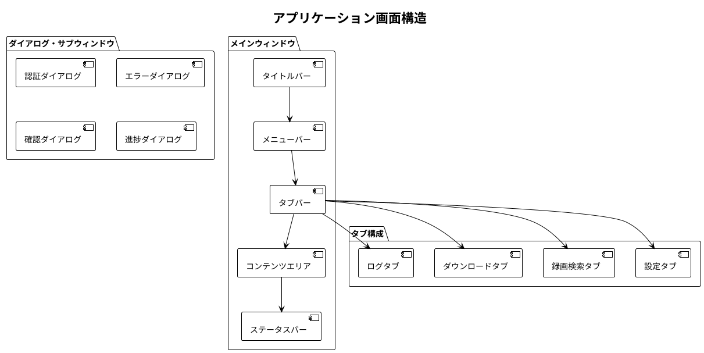

# 画面設計書・UI/UXガイドライン - Zoom Video Mover

## 文書概要
**プロジェクト名**: Zoom Video Mover  
**作成日**: 2025-08-02  
**作成者**: UXデザイナー  
**レビューア**: システムアナリスト  
**バージョン**: 1.0  

## UI/UX設計原則

### 基本設計方針

#### 1. シンプルさ（Simplicity）
- **最小限のステップ**: 3クリック以内でダウンロード開始
- **明確な視覚階層**: 重要な機能を強調、補助機能を背景化
- **認知負荷の軽減**: 一画面に表示する情報量を制限

#### 2. 効率性（Efficiency）
- **ワークフロー最適化**: タスク完了までの時間を最小化
- **一括操作**: 複数ファイルの同時処理をサポート
- **設定保存**: 繰り返し作業の効率化

#### 3. 信頼性（Reliability）
- **進捗の可視化**: 処理状況の透明性確保
- **エラー情報**: 明確で実行可能なエラーメッセージ
- **操作の可逆性**: 重要操作の確認・取り消し機能

#### 4. アクセシビリティ（Accessibility）
- **技術レベル対応**: 初級ユーザーから上級ユーザーまで
- **多言語対応**: 日本語・英語UI
- **キーボードナビゲーション**: マウス操作の代替手段

### 画面構成・ナビゲーション

#### アプリケーション構造



## 詳細画面設計

### SC001: メイン画面（アプリケーションフレーム）

#### 画面概要
- **目的**: アプリケーション全体の基盤UI
- **利用者**: 全ユーザー
- **表示タイミング**: アプリケーション起動時
- **画面サイズ**: 1024x768px（最小）、リサイズ対応

#### レイアウト設計

```
┌─────────────────────────────────────────────────────────────┐
│ Zoom Video Mover v1.0                              [_][□][×] │
├─────────────────────────────────────────────────────────────┤
│ ファイル(F) 編集(E) 表示(V) ツール(T) ヘルプ(H)                 │
├─────────────────────────────────────────────────────────────┤
│ [設定] [録画検索] [ダウンロード] [ログ]                          │
├─────────────────────────────────────────────────────────────┤
│                                                            │
│                    コンテンツエリア                          │
│                   （各タブの内容）                          │
│                                                            │
│                                                            │
│                                                            │
│                                                            │
├─────────────────────────────────────────────────────────────┤
│ 接続状態: ●接続中 | 最終更新: 2025-08-02 10:30 | メモリ: 245MB │
└─────────────────────────────────────────────────────────────┘
```

#### UI要素定義
| 要素 | 説明 | 動作 |
|------|------|------|
| **タイトルバー** | アプリ名・バージョン表示 | ウィンドウ移動・最小化・閉じる |
| **メニューバー** | 主要機能へのアクセス | ドロップダウンメニュー |
| **タブバー** | 機能画面の切り替え | クリックでタブ切り替え |
| **ステータスバー** | システム状態・統計情報 | リアルタイム更新 |

### SC002: 設定画面

#### 画面概要
- **目的**: OAuth認証・アプリケーション設定
- **利用者**: 初回設定時・設定変更時
- **前提条件**: アプリケーションが起動済み
- **完了条件**: 設定が保存され、認証が完了

#### レイアウト設計

```
┌─────────────────────────────────────────────────────────────┐
│                        設定                                 │
├─────────────────────────────────────────────────────────────┤
│ ┌─ OAuth認証設定 ──────────────────────────────────────────┐ │
│ │                                                        │ │
│ │ Client ID      [________________________________] [必須] │ │
│ │ Client Secret  [********************************] [必須] │ │
│ │ Redirect URI   [________________________________] [任意] │ │
│ │                                                        │ │
│ │ [認証テスト] [設定をリセット]                              │ │
│ └────────────────────────────────────────────────────────┘ │
│                                                            │
│ ┌─ ダウンロード設定 ──────────────────────────────────────┐ │
│ │                                                        │ │
│ │ 出力フォルダ   [C:\Downloads\ZoomRecordings____] [参照] │ │
│ │ 同時DL数      [5______] ファイル                       │ │
│ │ リトライ回数   [3______] 回                            │ │
│ │ タイムアウト   [30_____] 秒                            │ │
│ │                                                        │ │
│ │ ☑ 会議別フォルダを作成する                               │ │
│ │ ☑ ファイル名に日時を含める                               │ │
│ │ ☑ 重複ファイルを自動リネーム                             │ │
│ └────────────────────────────────────────────────────────┘ │
│                                                            │
│ ┌─ 表示・動作設定 ──────────────────────────────────────┐ │
│ │                                                        │ │
│ │ 言語          [日本語            ▼]                    │ │
│ │ テーマ        [ライト            ▼]                    │ │
│ │ 自動更新チェック [有効              ▼]                    │ │
│ │ ログレベル     [情報              ▼]                    │ │
│ └────────────────────────────────────────────────────────┘ │
│                                                            │
│                    [保存] [キャンセル] [適用]                │
└─────────────────────────────────────────────────────────────┘
```

#### 設定項目詳細

##### OAuth認証設定
| 項目 | 形式 | 検証ルール | デフォルト値 |
|------|------|-----------|-------------|
| **Client ID** | 文字列(20-50文字) | 英数字のみ、必須 | なし |
| **Client Secret** | 文字列(40-100文字) | 英数字記号、必須、マスク表示 | なし |
| **Redirect URI** | URL | http://localhost:8080 | http://localhost:8080 |

##### ダウンロード設定
| 項目 | 形式 | 範囲・制約 | デフォルト値 |
|------|------|----------|-------------|
| **出力フォルダ** | パス文字列 | 書き込み権限要、存在チェック | ユーザーのDownloadsフォルダ |
| **同時DL数** | 整数 | 1-10の範囲 | 5 |
| **リトライ回数** | 整数 | 0-10の範囲 | 3 |
| **タイムアウト** | 整数(秒) | 5-300の範囲 | 30 |

##### チェックボックス設定
- **会議別フォルダ作成**: 有効時、会議ごとにサブフォルダを作成
- **ファイル名に日時含める**: 有効時、ファイル名先頭に日時追加
- **重複ファイル自動リネーム**: 有効時、既存ファイルと重複時に連番追加

### SC003: 認証画面（ダイアログ）

#### 画面概要
- **目的**: OAuth認証フローの実行・進捗表示
- **表示タイミング**: 初回認証時・トークン期限切れ時
- **画面種別**: モーダルダイアログ
- **サイズ**: 400x300px（固定）

#### レイアウト設計

```
┌─────────────────────────────────────────┐
│            Zoom OAuth認証               │
├─────────────────────────────────────────┤
│                                        │
│    [Zoomロゴ]     ←→    [アプリロゴ]      │
│                                        │
│   Zoom Video Moverがあなたの           │
│   Zoomアカウントにアクセスする           │
│   ことを許可しますか？                   │
│                                        │
│   ┌─ アクセス権限 ──────────────────┐    │
│   │ ☑ 録画ファイルの読み取り           │    │
│   │ ☑ ユーザー情報の読み取り           │    │
│   │ ☑ 会議情報の読み取り              │    │
│   └─────────────────────────────┘    │
│                                        │
│   1. 下のボタンをクリック               │
│   2. ブラウザでZoomにログイン           │
│   3. アクセス許可を承認                │
│                                        │
│     [ブラウザで認証開始]                │
│                                        │
│   認証状況: 待機中                      │
│   [━━━━━━━━━━] 0%                      │
│                                        │
│              [キャンセル]               │
└─────────────────────────────────────────┘
```

#### 認証フロー表示

##### 状態別表示
| 状態 | 進捗率 | メッセージ | アクション |
|------|--------|-----------|----------|
| **待機中** | 0% | 認証を開始してください | ブラウザで認証開始ボタン |
| **認証中** | 25% | ブラウザでZoomにログイン中... | 待機 |
| **許可待ち** | 50% | アクセス許可の承認をお待ちください | 待機 |
| **トークン取得中** | 75% | アクセストークンを取得中... | 待機 |
| **完了** | 100% | 認証が完了しました | 自動的にダイアログ閉じる |
| **エラー** | - | 認証に失敗しました | リトライ・キャンセルボタン |

### SC004: 録画リスト画面

#### 画面概要
- **目的**: 録画検索・ファイル選択
- **利用者**: 全ユーザー
- **前提条件**: OAuth認証完了
- **完了条件**: ダウンロード対象ファイル選択完了

#### レイアウト設計

```
┌─────────────────────────────────────────────────────────────┐
│                      録画検索                               │
├─────────────────────────────────────────────────────────────┤
│ ┌─ 検索条件 ─────────────────────────────────────────────┐ │
│ │ 期間: [2025-07-01] ～ [2025-08-01]   [過去30日][今月] │ │
│ │ 種別: ☑動画 ☑音声 ☑チャット ☑トランスクリプト        │ │
│ │ 会議名: [___________________________] [検索] [クリア]  │ │
│ └─────────────────────────────────────────────────────┘ │
│                                                            │
│ 検索結果: 85件の録画 (245ファイル, 12.3GB)                   │
│ [全選択] [全解除] [展開] [折りたたみ]                        │
│                                                            │
│ ┌─ 録画リスト ─────────────────────────────────────────┐ │
│ │ ☑ □ 2025-08-01 週次会議                     3ファイル │ │
│ │ │   ☑ 🎥 meeting_video.mp4           (1.2GB) 09:00 │ │
│ │ │   ☑ 🎵 meeting_audio.m4a            (85MB) 09:00 │ │
│ │ │   ☑ 💬 meeting_chat.txt              (2KB) 09:00 │ │
│ │ ☑ □ 2025-07-31 プロジェクト報告会           4ファイル │ │
│ │ │   ☑ 🎥 project_review.mp4          (2.1GB) 14:30 │ │
│ │ │   ☑ 🎵 project_review.m4a           (120MB) 14:30 │ │
│ │ │   ☑ 📝 project_transcript.vtt        (45KB) 14:30 │ │
│ │ │   ☑ 🤖 project_ai_summary.json       (8KB) 14:30 │ │
│ │ ☐ □ 2025-07-30 技術打ち合わせ              2ファイル │ │
│ │ │   ☐ 🎥 tech_meeting.mp4             (850MB) 16:00 │ │
│ │ │   ☐ 💬 tech_chat.txt                  (1KB) 16:00 │ │
│ │ │                                    [さらに読み込み] │ │
│ └─────────────────────────────────────────────────────┘ │
│                                                            │
│ 選択済み: 7ファイル, 3.4GB, 推定時間: 28分                    │
│                                     [ダウンロード開始]      │
└─────────────────────────────────────────────────────────────┘
```

#### UI要素定義

##### 検索条件エリア
| 要素 | 機能 | UI仕様 |
|------|------|--------|
| **期間選択** | 検索対象期間指定 | 日付ピッカー、プリセットボタン |
| **ファイル種別** | 対象ファイル種別フィルタ | チェックボックス、アイコン付き |
| **会議名検索** | 会議名部分一致検索 | テキスト入力、リアルタイム検索 |

##### 録画リストエリア
| 要素 | 機能 | UI仕様 |
|------|------|--------|
| **階層チェックボックス** | 会議・ファイル選択 | 親子連動、三状態表示 |
| **ファイルアイコン** | ファイル種別視覚化 | 種別別アイコン・色分け |
| **サイズ・時刻表示** | ファイル情報表示 | 人間が読みやすい形式 |
| **展開・折りたたみ** | 表示制御 | ツリービュー操作 |

##### ファイル種別アイコン・色分け
- **🎥 動画ファイル**: 青色、MP4形式
- **🎵 音声ファイル**: 緑色、M4A形式  
- **💬 チャットファイル**: オレンジ色、TXT形式
- **📝 トランスクリプト**: 紫色、VTT形式
- **🤖 AI要約**: 赤色、JSON形式

### SC005: ダウンロード進捗画面

#### 画面概要
- **目的**: ダウンロード実行状況の監視・制御
- **表示タイミング**: ダウンロード開始時
- **前提条件**: ダウンロード対象ファイル選択完了
- **完了条件**: 全ファイルダウンロード完了または中止

#### レイアウト設計

```
┌─────────────────────────────────────────────────────────────┐
│                    ダウンロード進捗                          │
├─────────────────────────────────────────────────────────────┤
│ ┌─ 全体進捗 ─────────────────────────────────────────────┐ │
│ │ 進捗: 7ファイル中 4完了, 2実行中, 1待機中                  │ │
│ │ [████████████████░░░░░░░░] 67% (3.4GB中2.3GB完了)      │ │
│ │ 転送速度: 15.2MB/s  残り時間: 約4分30秒                   │ │
│ │ 開始時刻: 10:30:15  経過時間: 5分20秒                     │ │
│ └─────────────────────────────────────────────────────┘ │
│                                                            │
│ ┌─ ファイル別進捗 ──────────────────────────────────────┐ │
│ │ ✅ meeting_video.mp4      [完了] 1.2GB  5.2MB/s  2:30 │ │
│ │ ✅ meeting_audio.m4a      [完了]  85MB  8.1MB/s  0:12 │ │
│ │ ✅ meeting_chat.txt       [完了]   2KB  即座     0:00 │ │
│ │ ✅ project_review.mp4     [完了] 2.1GB  12.3MB/s 3:15 │ │
│ │ ⬇️ project_review.m4a     [████████░░] 80%  120MB     │ │
│ │ ⬇️ project_transcript.vtt [██░░░░░░░░] 20%   45KB     │ │
│ │ ⏳ project_ai_summary.json [待機中]         8KB        │ │
│ └─────────────────────────────────────────────────────┘ │
│                                                            │
│ ┌─ 統計・ログ ─────────────────────────────────────────┐ │
│ │ 成功: 4ファイル  実行中: 2ファイル  待機: 1ファイル       │ │
│ │ エラー: 0ファイル  リトライ: 0回                         │ │
│ │                                                        │ │
│ │ 10:30:15 ダウンロード開始                               │ │
│ │ 10:32:45 meeting_video.mp4 完了                        │ │
│ │ 10:32:57 meeting_audio.m4a 完了                        │ │
│ │ 10:32:57 meeting_chat.txt 完了                         │ │
│ │ 10:36:10 project_review.mp4 完了                       │ │
│ │ 10:36:11 project_review.m4a 開始                       │ │
│ └─────────────────────────────────────────────────────┘ │
│                                                            │
│            [一時停止] [キャンセル] [フォルダを開く]            │
└─────────────────────────────────────────────────────────────┘
```

#### 進捗表示詳細

##### 全体進捗バー
- **視覚要素**: プログレスバー、パーセント、データ量
- **更新頻度**: 500ms間隔
- **色分け**: 正常（青）、警告（オレンジ）、エラー（赤）

##### ファイル別ステータス
| ステータス | アイコン | 色 | 表示内容 |
|------------|----------|-------|----------|
| **待機中** | ⏳ | グレー | ファイル名、サイズ |
| **実行中** | ⬇️ | 青 | プログレスバー、転送速度 |
| **完了** | ✅ | 緑 | 完了時刻、平均速度 |
| **エラー** | ❌ | 赤 | エラー内容、リトライボタン |
| **一時停止** | ⏸️ | オレンジ | 一時停止状態 |

### SC006: エラー表示画面

#### 画面概要
- **目的**: エラー情報の表示・対処方法の提示
- **表示タイミング**: エラー発生時
- **画面種別**: モーダルダイアログまたはインライン表示
- **対象**: 回復可能・不可能なエラー

#### エラー分類別表示

##### 認証エラー
```
┌─────────────────────────────────────────┐
│               認証エラー                │
├─────────────────────────────────────────┤
│                                        │
│          [⚠️警告アイコン]                │
│                                        │
│    Zoomアカウントの認証に失敗しました    │
│                                        │
│  原因:                                 │
│  • アクセストークンの有効期限切れ        │
│  • Zoomアカウントの権限変更            │
│                                        │
│  対処方法:                             │
│  1. 設定画面でOAuth認証を再実行         │
│  2. Zoomアカウントの権限を確認         │
│                                        │
│          [再認証] [設定画面へ]          │
└─────────────────────────────────────────┘
```

##### ネットワークエラー
```
┌─────────────────────────────────────────┐
│            ネットワークエラー            │
├─────────────────────────────────────────┤
│                                        │
│          [🌐ネットワークアイコン]        │
│                                        │
│      インターネット接続を確認できません   │
│                                        │
│  詳細:                                 │
│  • 接続タイムアウト (30秒)              │
│  • zoom.us への接続に失敗              │
│                                        │
│  対処方法:                             │
│  1. インターネット接続を確認            │
│  2. ファイアウォール設定を確認          │
│  3. プロキシ設定を確認                 │
│                                        │
│    [リトライ] [接続テスト] [閉じる]      │
└─────────────────────────────────────────┘
```

##### ディスク容量不足エラー
```
┌─────────────────────────────────────────┐
│            ディスク容量不足              │
├─────────────────────────────────────────┤
│                                        │
│           [💾ディスクアイコン]           │
│                                        │
│    ダウンロード先の容量が不足しています   │
│                                        │
│  現在の状況:                           │
│  • 必要な容量: 1.2GB                   │
│  • 利用可能容量: 850MB                 │
│  • 不足容量: 350MB                     │
│                                        │
│  対処方法:                             │
│  1. 不要なファイルを削除                │
│  2. 別のドライブを選択                 │
│  3. 外部ストレージを使用               │
│                                        │
│      [フォルダ変更] [容量確認] [閉じる]   │
└─────────────────────────────────────────┘
```

## UI/UXガイドライン詳細

### カラーパレット

#### プライマリカラー
- **メインブルー**: #2B5CE6（Zoomブルー）
- **アクセントブルー**: #1E3D8F
- **ライトブルー**: #E8F2FF

#### セカンダリカラー
- **成功グリーン**: #10B981
- **警告オレンジ**: #F59E0B  
- **エラーレッド**: #EF4444
- **ニュートラルグレー**: #6B7280

#### 背景色
- **ライトテーマ**: #FFFFFF（メイン）、#F9FAFB（サブ）
- **ダークテーマ**: #1F2937（メイン）、#111827（サブ）

### タイポグラフィ

#### フォント設定
```css
/* 日本語環境 */
font-family: 
  "Noto Sans CJK JP",     /* Google Noto フォント */
  "Hiragino Kaku Gothic ProN",  /* macOS */
  "Yu Gothic UI",         /* Windows 10+ */
  "Meiryo UI",           /* Windows 7-8 */
  sans-serif;

/* 英語環境 */
font-family:
  "Segoe UI",            /* Windows */
  "Roboto",              /* Android/Web */
  "San Francisco",       /* macOS/iOS */
  sans-serif;
```

#### フォントサイズ体系
| 用途 | サイズ | 太さ | 用例 |
|------|--------|------|------|
| **大見出し** | 24px | Bold | ダイアログタイトル |
| **中見出し** | 18px | Semibold | セクション見出し |
| **小見出し** | 16px | Medium | グループラベル |
| **本文** | 14px | Regular | 一般テキスト |
| **補足** | 12px | Regular | ステータス、説明 |
| **キャプション** | 10px | Regular | ヒント、注釈 |

### スペーシング・レイアウト

#### グリッドシステム
- **基本単位**: 8px（8px grid system）
- **マージン**: 16px（要素間の標準間隔）
- **パディング**: 8px, 16px, 24px（内部余白）

#### レスポンシブ対応
| 画面サイズ | レイアウト | 対応 |
|------------|-----------|------|
| **1024px以上** | 標準レイアウト | デスクトップ標準 |
| **768-1023px** | 縮小レイアウト | 小画面対応 |
| **768px未満** | モバイルレイアウト | 将来拡張 |

### インタラクション設計

#### ボタン仕様
```css
/* プライマリボタン */
.btn-primary {
  background: #2B5CE6;
  color: white;
  padding: 8px 16px;
  border-radius: 6px;
  transition: all 200ms ease;
}

.btn-primary:hover {
  background: #1E3D8F;
  transform: translateY(-1px);
}

.btn-primary:active {
  transform: translateY(0);
}
```

#### アニメーション指針
- **遷移時間**: 200-300ms（標準）
- **イージング**: ease-out（自然な動き）
- **フェード**: opacity 0→1（200ms）
- **スライド**: transform translateY（300ms）

### アクセシビリティ対応

#### キーボードナビゲーション
| キー | 動作 | 対象画面 |
|------|------|----------|
| **Tab** | 次の要素へフォーカス | 全画面 |
| **Shift+Tab** | 前の要素へフォーカス | 全画面 |
| **Enter** | ボタン実行・選択確定 | 全画面 |
| **Space** | チェックボックス切り替え | 録画リスト |
| **Ctrl+A** | 全選択 | 録画リスト |
| **Esc** | ダイアログ閉じる | ダイアログ |

#### スクリーンリーダー対応
- **aria-label**: 視覚的でない要素の説明
- **role**: 要素の役割明示
- **alt**: 画像・アイコンの代替テキスト

---

**承認**:  
UXデザイナー: [ ] 承認  
システムアナリスト: [ ] 承認  
**承認日**: ___________