# Phase 4: システム内部

---
## データモデル


## 文書概要
**プロジェクト名**: Zoom Video Mover  
**作成日**: 2025-08-02  
  
**バージョン**: 1.0  

## 論理データモデル

### 核心エンティティ関係図

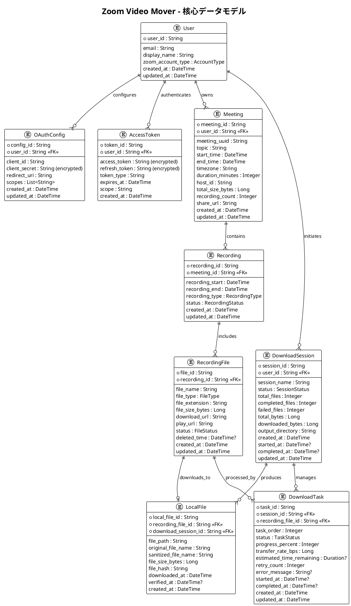

### AI機能データモデル

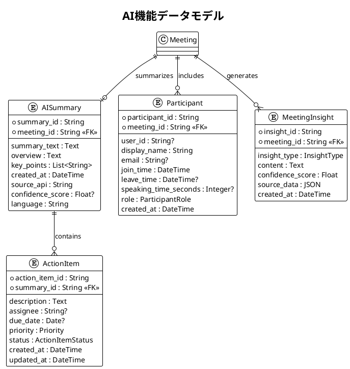

### 設定・構成データモデル

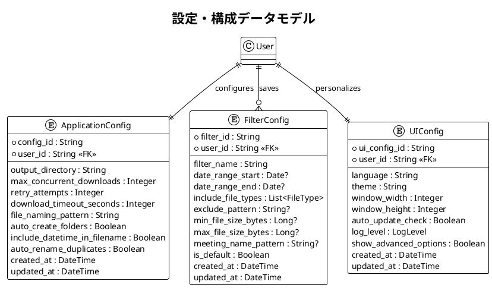

### ログ・監視データモデル

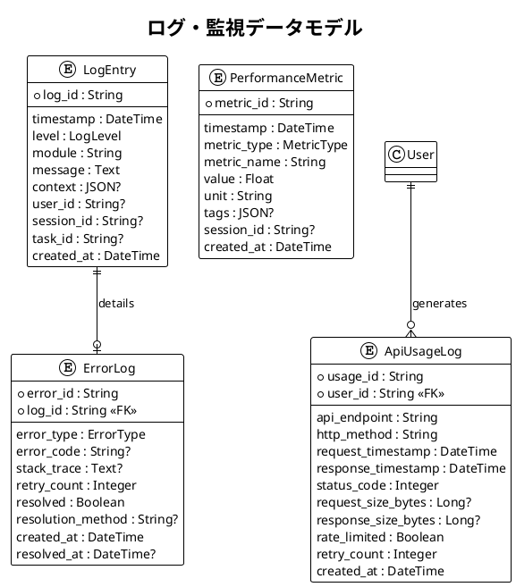

## 物理データモデル（実装）

### Rustデータ構造定義

#### 核心エンティティ
```rust
// User関連
#[derive(Debug, Clone, Serialize, Deserialize)]
pub struct User {
    pub user_id: String,
    pub email: String,
    pub display_name: String,
    pub zoom_account_type: AccountType,
    pub created_at: chrono::DateTime<chrono::Utc>,
    pub updated_at: chrono::DateTime<chrono::Utc>,
}

#[derive(Debug, Clone, Serialize, Deserialize)]
pub enum AccountType {
    Basic,
    Pro,
    Business,
    Enterprise,
}

// OAuth認証関連
#[derive(Debug, Clone, Serialize, Deserialize)]
pub struct OAuthConfig {
    pub config_id: String,
    pub user_id: String,
    pub client_id: String,
    pub client_secret: String, // 暗号化して保存
    pub redirect_uri: String,
    pub scopes: Vec<String>,
    pub created_at: chrono::DateTime<chrono::Utc>,
    pub updated_at: chrono::DateTime<chrono::Utc>,
}

#[derive(Debug, Clone, Serialize, Deserialize)]
pub struct AccessToken {
    pub token_id: String,
    pub user_id: String,
    pub access_token: String, // 暗号化して保存
    pub refresh_token: String, // 暗号化して保存
    pub token_type: String,
    pub expires_at: chrono::DateTime<chrono::Utc>,
    pub scope: String,
    pub created_at: chrono::DateTime<chrono::Utc>,
}

// 録画関連
#[derive(Debug, Clone, Serialize, Deserialize)]
pub struct Meeting {
    pub meeting_id: String,
    pub user_id: String,
    pub meeting_uuid: String,
    pub topic: String,
    pub start_time: chrono::DateTime<chrono::Utc>,
    pub end_time: chrono::DateTime<chrono::Utc>,
    pub timezone: String,
    pub duration_minutes: i32,
    pub host_id: String,
    pub total_size_bytes: i64,
    pub recording_count: i32,
    pub share_url: Option<String>,
    pub created_at: chrono::DateTime<chrono::Utc>,
    pub updated_at: chrono::DateTime<chrono::Utc>,
}

#[derive(Debug, Clone, Serialize, Deserialize)]
pub struct RecordingFile {
    pub file_id: String,
    pub recording_id: String,
    pub file_name: String,
    pub file_type: FileType,
    pub file_extension: String,
    pub file_size_bytes: i64,
    pub download_url: String,
    pub play_url: Option<String>,
    pub status: FileStatus,
    pub deleted_time: Option<chrono::DateTime<chrono::Utc>>,
    pub created_at: chrono::DateTime<chrono::Utc>,
    pub updated_at: chrono::DateTime<chrono::Utc>,
}

#[derive(Debug, Clone, Serialize, Deserialize)]
pub enum FileType {
    MP4,
    M4A,
    CHAT,
    TRANSCRIPT,
    CC,
    CSV,
}

#[derive(Debug, Clone, Serialize, Deserialize)]
pub enum FileStatus {
    Available,
    Processing,
    Deleted,
    Expired,
}
```

#### ダウンロード関連
```rust
#[derive(Debug, Clone, Serialize, Deserialize)]
pub struct DownloadSession {
    pub session_id: String,
    pub user_id: String,
    pub session_name: String,
    pub status: SessionStatus,
    pub total_files: i32,
    pub completed_files: i32,
    pub failed_files: i32,
    pub total_bytes: i64,
    pub downloaded_bytes: i64,
    pub output_directory: PathBuf,
    pub created_at: chrono::DateTime<chrono::Utc>,
    pub started_at: Option<chrono::DateTime<chrono::Utc>>,
    pub completed_at: Option<chrono::DateTime<chrono::Utc>>,
    pub updated_at: chrono::DateTime<chrono::Utc>,
}

#[derive(Debug, Clone, Serialize, Deserialize)]
pub enum SessionStatus {
    Pending,
    Running,
    Paused,
    Completed,
    Failed,
    Cancelled,
}

#[derive(Debug, Clone, Serialize, Deserialize)]
pub struct DownloadTask {
    pub task_id: String,
    pub session_id: String,
    pub recording_file_id: String,
    pub task_order: i32,
    pub status: TaskStatus,
    pub progress_percent: i32,
    pub transfer_rate_bps: i64,
    pub estimated_time_remaining: Option<chrono::Duration>,
    pub retry_count: i32,
    pub error_message: Option<String>,
    pub started_at: Option<chrono::DateTime<chrono::Utc>>,
    pub completed_at: Option<chrono::DateTime<chrono::Utc>>,
    pub created_at: chrono::DateTime<chrono::Utc>,
    pub updated_at: chrono::DateTime<chrono::Utc>,
}

#[derive(Debug, Clone, Serialize, Deserialize)]
pub enum TaskStatus {
    Queued,
    Downloading,
    Completed,
    Failed,
    Retrying,
    Cancelled,
}
```

#### AI機能関連
```rust
#[derive(Debug, Clone, Serialize, Deserialize)]
pub struct AISummary {
    pub summary_id: String,
    pub meeting_id: String,
    pub summary_text: String,
    pub overview: String,
    pub key_points: Vec<String>,
    pub created_at: chrono::DateTime<chrono::Utc>,
    pub source_api: String,
    pub confidence_score: Option<f32>,
    pub language: String,
}

#[derive(Debug, Clone, Serialize, Deserialize)]
pub struct ActionItem {
    pub action_item_id: String,
    pub summary_id: String,
    pub description: String,
    pub assignee: Option<String>,
    pub due_date: Option<chrono::NaiveDate>,
    pub priority: Priority,
    pub status: ActionItemStatus,
    pub created_at: chrono::DateTime<chrono::Utc>,
    pub updated_at: chrono::DateTime<chrono::Utc>,
}

#[derive(Debug, Clone, Serialize, Deserialize)]
pub enum Priority {
    Low,
    Medium,
    High,
    Critical,
}

#[derive(Debug, Clone, Serialize, Deserialize)]
pub enum ActionItemStatus {
    Pending,
    InProgress,
    Completed,
    Cancelled,
}
```

## データ制約・整合性ルール

### 主キー制約
| テーブル | 主キー | 生成方法 |
|----------|--------|----------|
| **User** | user_id | UUID v4 |
| **Meeting** | meeting_id | Zoom API提供ID |
| **RecordingFile** | file_id | Zoom API提供ID |
| **DownloadSession** | session_id | UUID v4 |
| **DownloadTask** | task_id | UUID v4 |

### 外部キー制約
| 子テーブル | 外部キー | 参照テーブル | 参照キー | カスケード |
|------------|----------|-------------|----------|------------|
| **OAuthConfig** | user_id | User | user_id | CASCADE |
| **AccessToken** | user_id | User | user_id | CASCADE |
| **Meeting** | user_id | User | user_id | CASCADE |
| **Recording** | meeting_id | Meeting | meeting_id | CASCADE |
| **RecordingFile** | recording_id | Recording | recording_id | CASCADE |
| **DownloadTask** | session_id | DownloadSession | session_id | CASCADE |
| **DownloadTask** | recording_file_id | RecordingFile | file_id | RESTRICT |

### ユニーク制約
| テーブル | カラム組み合わせ | 説明 |
|----------|------------------|------|
| **User** | email | 一意なユーザー識別 |
| **OAuthConfig** | user_id | ユーザーあたり1つの設定 |
| **AccessToken** | user_id | ユーザーあたり1つのトークン |
| **DownloadTask** | session_id, recording_file_id | セッション内でファイル重複禁止 |

### チェック制約
```sql
-- ファイルサイズは正の値
ALTER TABLE RecordingFile ADD CONSTRAINT chk_file_size_positive 
CHECK (file_size_bytes >= 0);

-- 進捗率は0-100の範囲
ALTER TABLE DownloadTask ADD CONSTRAINT chk_progress_range 
CHECK (progress_percent >= 0 AND progress_percent <= 100);

-- 日時の論理整合性
ALTER TABLE Meeting ADD CONSTRAINT chk_meeting_time_order 
CHECK (end_time > start_time);

-- リトライ回数の上限
ALTER TABLE DownloadTask ADD CONSTRAINT chk_retry_limit 
CHECK (retry_count >= 0 AND retry_count <= 10);
```

## データ暗号化・セキュリティ

### 暗号化対象データ
| テーブル | カラム | 暗号化方式 | 理由 |
|----------|--------|------------|------|
| **OAuthConfig** | client_secret | AES-256-GCM | OAuth認証情報保護 |
| **AccessToken** | access_token | AES-256-GCM | API認証情報保護 |
| **AccessToken** | refresh_token | AES-256-GCM | API認証情報保護 |

### 暗号化実装
```rust
use aes_gcm::{Aes256Gcm, Key, Nonce};
use aes_gcm::aead::{Aead, NewAead};

pub struct SecureStorage {
    cipher: Aes256Gcm,
}

impl SecureStorage {
    pub fn new(key: &[u8; 32]) -> Self {
        let key = Key::from_slice(key);
        let cipher = Aes256Gcm::new(key);
        Self { cipher }
    }
    
    pub fn encrypt(&self, plaintext: &str) -> Result<Vec<u8>, CryptoError> {
        let nonce = Nonce::from_slice(&self.generate_nonce()?);
        let ciphertext = self.cipher.encrypt(nonce, plaintext.as_bytes())?;
        
        let mut result = Vec::new();
        result.extend_from_slice(nonce);
        result.extend_from_slice(&ciphertext);
        Ok(result)
    }
    
    pub fn decrypt(&self, encrypted_data: &[u8]) -> Result<String, CryptoError> {
        let (nonce_bytes, ciphertext) = encrypted_data.split_at(12);
        let nonce = Nonce::from_slice(nonce_bytes);
        
        let plaintext = self.cipher.decrypt(nonce, ciphertext)?;
        Ok(String::from_utf8(plaintext)?)
    }
}
```

## データ永続化・保存方式

### ファイルベース保存
```rust
use serde::{Serialize, Deserialize};
use std::path::Path;

// TOML形式での設定保存
pub fn save_config<T: Serialize>(config: &T, file_path: &Path) -> Result<(), ConfigError> {
    let toml_string = toml::to_string_pretty(config)?;
    std::fs::write(file_path, toml_string)?;
    Ok(())
}

pub fn load_config<T: for<'de> Deserialize<'de>>(file_path: &Path) -> Result<T, ConfigError> {
    let content = std::fs::read_to_string(file_path)?;
    let config: T = toml::from_str(&content)?;
    Ok(config)
}

// JSON形式でのセッションデータ保存
pub fn save_session_data<T: Serialize>(data: &T, file_path: &Path) -> Result<(), DataError> {
    let json_string = serde_json::to_string_pretty(data)?;
    std::fs::write(file_path, json_string)?;
    Ok(())
}
```

### データディレクトリ構造
```
%APPDATA%/ZoomVideoMover/
├── config/
│   ├── oauth.toml          # OAuth設定（暗号化）
│   ├── application.toml    # アプリケーション設定
│   ├── ui.toml            # UI設定
│   └── filters/           # 保存済みフィルタ設定
│       ├── default.toml
│       └── monthly_backup.toml
├── data/
│   ├── sessions/          # ダウンロードセッション履歴
│   │   ├── 2025-08-01_session.json
│   │   └── 2025-08-02_session.json
│   ├── cache/             # APIレスポンスキャッシュ
│   │   └── recordings_cache.json
│   └── ai_summaries/      # AI要約データ
│       ├── meeting_123456789.json
│       └── meeting_987654321.json
└── logs/
    ├── application.log
    ├── api.log
    └── error.log
```

---

**承認**:  
**品質基準適合**: [ ] 確認済  
**ポリシー準拠**: [ ] 確認済  
**承認日**: ___________
---
## 機能一覧


## 文書概要
**プロジェクト名**: Zoom Video Mover  
**作成日**: 2025-08-02  
  
**バージョン**: 1.0  

## システム機能階層構造

### レベル0: システム全体機能

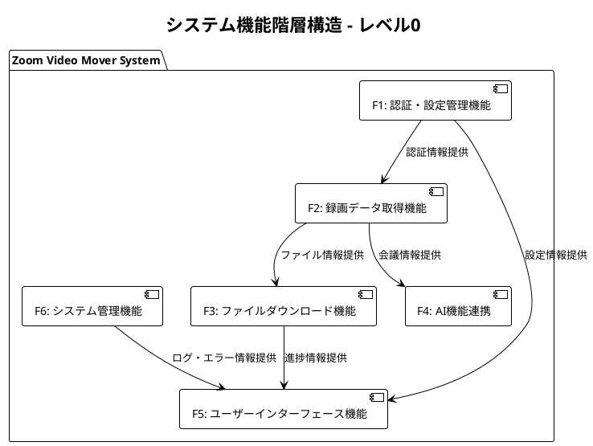

## 詳細機能分解

### F1: 認証・設定管理機能

#### レベル1分解
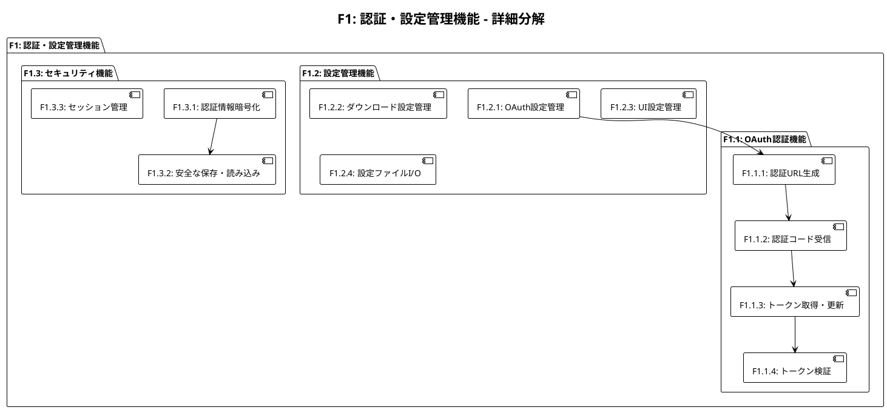

#### 機能詳細仕様

##### F1.1.1: 認証URL生成
- **目的**: OAuth 2.0認証フロー開始用URL生成
- **入力**: OAuth設定(Client ID, Redirect URI, Scope)
- **処理**: URL組み立て、stateパラメータ生成、CSRF対策
- **出力**: 認証URL文字列
- **例外**: 設定値不正、URL生成失敗

##### F1.1.2: 認証コード受信
- **目的**: OAuth認証後の認証コード受信
- **入力**: HTTPリクエスト(認証コード、state)
- **処理**: ローカルサーバー起動、コード抽出、state検証
- **出力**: 認証コード文字列
- **例外**: コード受信タイムアウト、state不一致

##### F1.1.3: トークン取得・更新
- **目的**: アクセストークン・リフレッシュトークン管理
- **入力**: 認証コードまたはリフレッシュトークン
- **処理**: API呼び出し、レスポンス解析、期限管理
- **出力**: アクセストークン構造体
- **例外**: API呼び出し失敗、トークン形式不正

##### F1.2.1: OAuth設定管理
- **目的**: OAuth認証に必要な設定情報管理
- **入力**: ユーザー入力設定値
- **処理**: 設定値検証、デフォルト値設定、永続化
- **出力**: OAuth設定構造体
- **例外**: 設定値検証エラー、保存失敗

### F2: 録画データ取得機能

#### レベル1分解
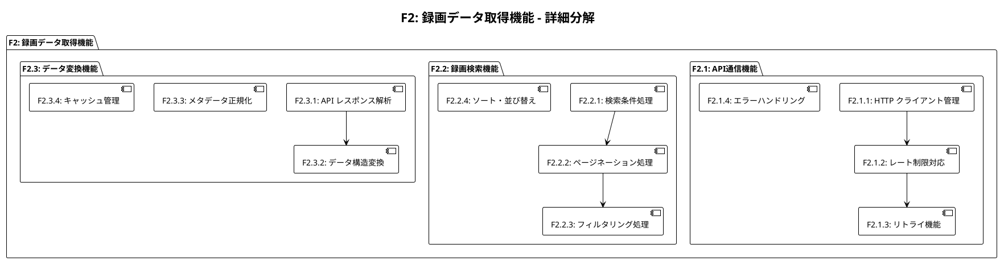

### F3: ファイルダウンロード機能

#### レベル1分解
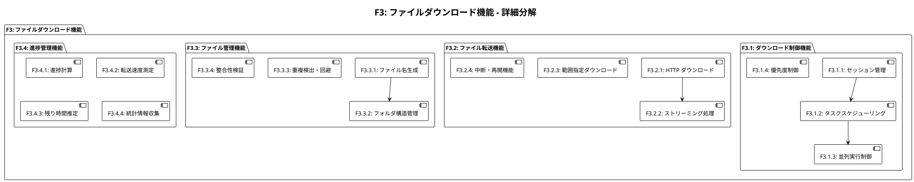

### F4: AI機能連携

#### レベル1分解
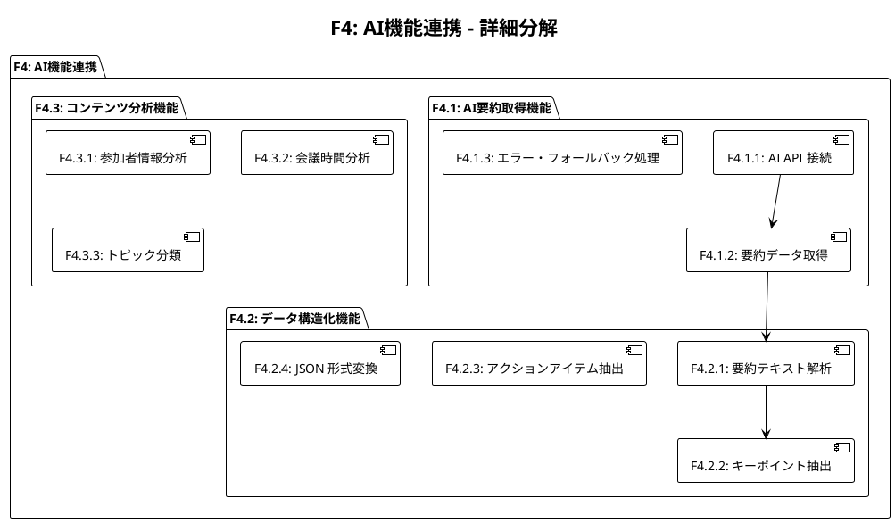

### F5: ユーザーインターフェース機能

#### レベル1分解
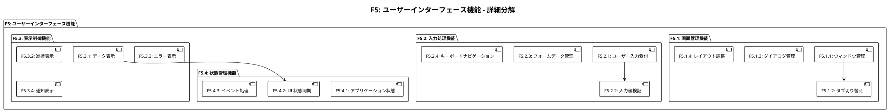

### F6: システム管理機能

#### レベル1分解
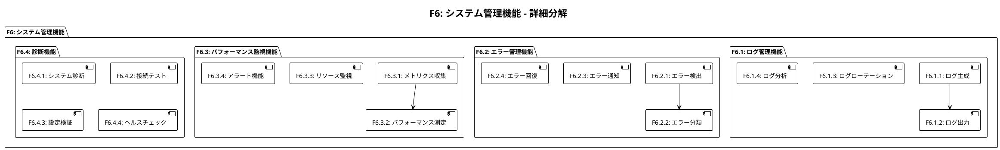

## 機能間依存関係マトリックス

### 機能依存関係表

| 提供機能 | 依存機能 | 依存内容 | 結合度 |
|----------|----------|----------|--------|
| **F2.2: 録画検索機能** | F1.1: OAuth認証機能 | アクセストークン | 強 |
| **F3.2: ファイル転送機能** | F1.1: OAuth認証機能 | アクセストークン | 強 |
| **F4.1: AI要約取得機能** | F1.1: OAuth認証機能 | アクセストークン | 強 |
| **F3.1: ダウンロード制御機能** | F2.2: 録画検索機能 | ファイル情報 | 中 |
| **F4.1: AI要約取得機能** | F2.2: 録画検索機能 | 会議情報 | 中 |
| **F5.3: 表示制御機能** | F3.4: 進捗管理機能 | 進捗情報 | 中 |
| **F5.3: 表示制御機能** | F6.2: エラー管理機能 | エラー情報 | 中 |
| **F6.1: ログ管理機能** | 全機能 | ログデータ | 弱 |

### 結合度分類
- **強結合**: 機能の実行に必須の依存関係
- **中結合**: データの受け渡しが必要な依存関係  
- **弱結合**: 情報提供・監視目的の依存関係

## 機能実装優先度

### 優先度レベル定義

#### P0: 必須・基盤機能（MVP）
1. **F1.1: OAuth認証機能** - 全ての外部API呼び出しの前提
2. **F1.2: 設定管理機能** - 基本的なアプリケーション動作の前提
3. **F2.1: API通信機能** - 録画データ取得の基盤
4. **F2.2: 録画検索機能** - コア機能の実現
5. **F3.2: ファイル転送機能** - 主要価値の提供
6. **F5.1: 画面管理機能** - ユーザーインターフェースの基盤

#### P1: 重要・差別化機能
7. **F3.1: ダウンロード制御機能** - 並列処理による効率化
8. **F3.4: 進捗管理機能** - ユーザビリティ向上
9. **F5.2: 入力処理機能** - 操作性向上
10. **F5.3: 表示制御機能** - 情報提示の改善
11. **F6.2: エラー管理機能** - 信頼性確保

#### P2: 高価値・付加機能
12. **F4.1: AI要約取得機能** - 付加価値の提供
13. **F4.2: データ構造化機能** - AI機能の活用
14. **F3.3: ファイル管理機能** - 利便性向上
15. **F6.1: ログ管理機能** - 運用・保守性向上

#### P3: 運用・保守機能
16. **F6.3: パフォーマンス監視機能** - 運用品質向上
17. **F6.4: 診断機能** - トラブルシューティング支援
18. **F1.3: セキュリティ機能** - セキュリティ強化

### 実装スケジュール

#### Sprint 1-2 (4週間): 基盤機能
- F1.1, F1.2: 認証・設定の基本実装
- F2.1: HTTP通信基盤
- F5.1: 基本GUI構造

#### Sprint 3-4 (4週間): コア機能
- F2.2: 録画検索・表示
- F3.2: 基本ダウンロード機能
- F5.2, F5.3: 基本UI操作・表示

#### Sprint 5-6 (4週間): 効率化機能
- F3.1: 並列ダウンロード
- F3.4: 進捗表示
- F6.2: エラー処理強化

#### Sprint 7-8 (4週間): 付加価値機能
- F4.1, F4.2: AI要約機能
- F3.3: ファイル管理向上
- F6.1: ログ機能

## 品質属性と機能の関係

### 性能要件との関係
| 機能 | 性能要件 | 実装方針 |
|------|----------|----------|
| **F2.1: API通信機能** | レート制限遵守 | 10req/sec制限の実装 |
| **F3.1: ダウンロード制御機能** | 並列数制限 | 最大5同時ダウンロード |
| **F3.2: ファイル転送機能** | メモリ効率 | ストリーミング処理 |
| **F5.3: 表示制御機能** | UI応答性 | 500ms更新間隔 |

### 信頼性要件との関係
| 機能 | 信頼性要件 | 実装方針 |
|------|------------|----------|
| **F2.1: API通信機能** | 自動リトライ | 指数バックオフ |
| **F3.2: ファイル転送機能** | 中断・再開 | 範囲指定ダウンロード |
| **F3.3: ファイル管理機能** | 整合性保証 | ハッシュ値検証 |
| **F6.2: エラー管理機能** | 障害回復 | 適切なエラー分類・通知 |

### セキュリティ要件との関係
| 機能 | セキュリティ要件 | 実装方針 |
|------|-----------------|----------|
| **F1.1: OAuth認証機能** | 認証情報保護 | HTTPS通信・トークン暗号化 |
| **F1.3: セキュリティ機能** | 機密データ保護 | Windows DPAPI利用 |
| **F2.1: API通信機能** | 通信暗号化 | TLS 1.2以上強制 |

---

**承認**:  
**品質基準適合**: [ ] 確認済  
**ポリシー準拠**: [ ] 確認済  
**承認日**: ___________
---
## 処理アルゴリズム


## 文書概要
**プロジェクト名**: Zoom Video Mover  
**作成日**: 2025-08-02  
  
**バージョン**: 1.0  

## 主要処理フロー図

### オーバーオール処理フロー

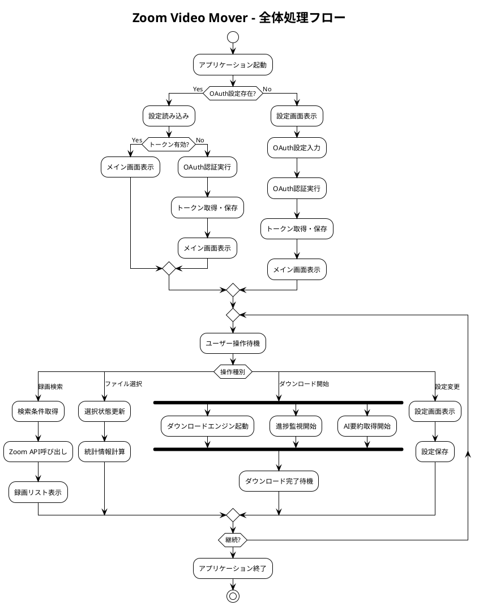

### OAuth認証処理フロー

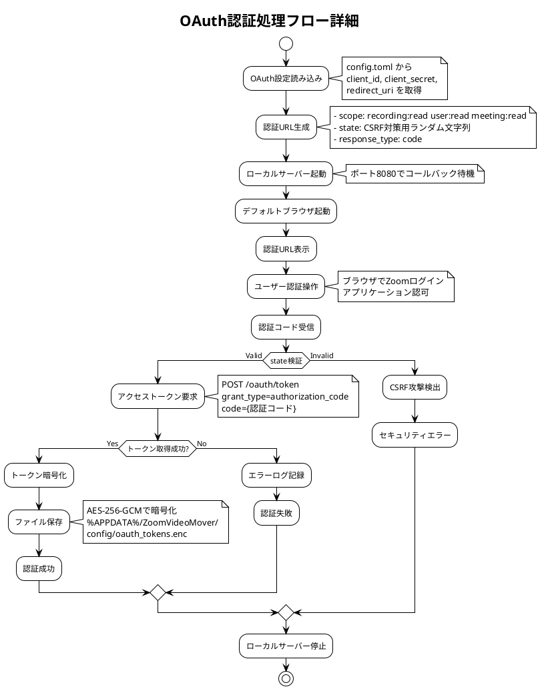

### 録画検索処理アルゴリズム

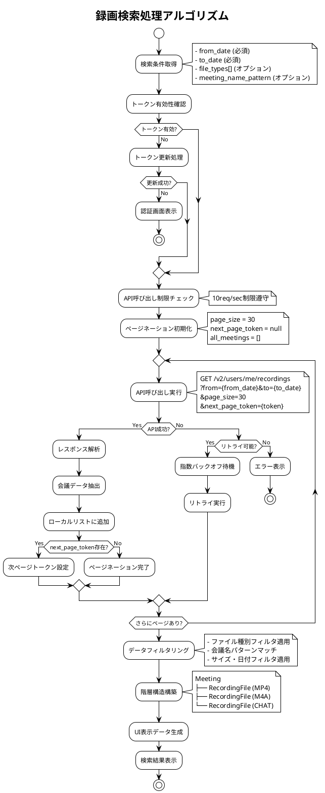

## 並列ダウンロードアルゴリズム

### 並列制御アルゴリズム

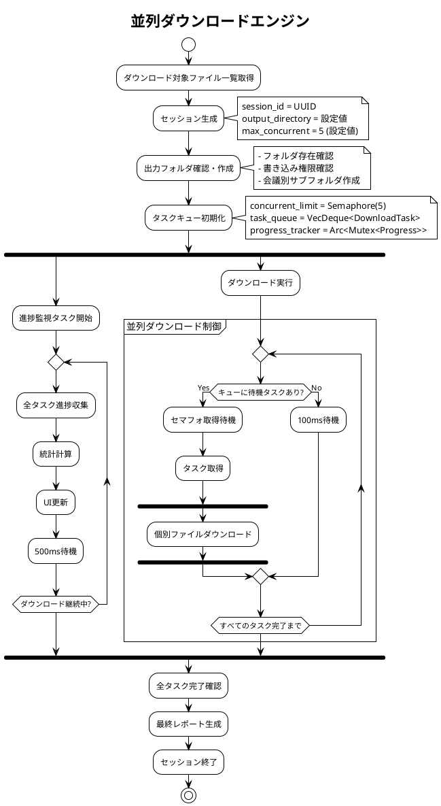

### 個別ファイルダウンロードアルゴリズム

```rust
/// 個別ファイルダウンロードのアルゴリズム実装
async fn download_single_file(
    file: &RecordingFile,
    output_path: &Path,
    progress_reporter: Arc<dyn ProgressReporter>
) -> Result<LocalFile, DownloadError> {
    // 事前条件: ファイル情報が有効であること
    assert!(!file.download_url.is_empty(), "Download URL must not be empty");
    assert!(file.file_size_bytes > 0, "File size must be positive");
    
    let client = create_http_client()?;
    let mut retry_count = 0;
    const MAX_RETRIES: u32 = 3;
    
    loop {
        match attempt_download(&client, file, output_path, &progress_reporter).await {
            Ok(local_file) => {
                // 事後条件: ファイルが正常にダウンロードされたことを確認
                debug_assert!(output_path.exists(), "Downloaded file must exist");
                debug_assert!(
                    std::fs::metadata(output_path)?.len() == file.file_size_bytes as u64,
                    "Downloaded file size must match expected size"
                );
                return Ok(local_file);
            },
            Err(e) if is_retryable_error(&e) && retry_count < MAX_RETRIES => {
                retry_count += 1;
                let delay = calculate_exponential_backoff(retry_count);
                
                warn!("Download failed, retrying in {:?}: {}", delay, e);
                progress_reporter.report_retry(file.file_id.clone(), retry_count).await;
                
                tokio::time::sleep(delay).await;
            },
            Err(e) => {
                error!("Download failed permanently: {}", e);
                return Err(e);
            }
        }
    }
}

/// 指数バックオフ計算
/// 
/// # 事前条件
/// - attempt は 0 より大きい値
/// 
/// # 事後条件  
/// - 返される Duration は 1秒以上 60秒以下
/// 
/// # 不変条件
/// - 計算中に attempt の値が変更されない
fn calculate_exponential_backoff(attempt: u32) -> Duration {
    debug_assert!(attempt > 0, "Attempt count must be positive");
    
    let base_delay_ms = 1000; // 1秒
    let max_delay_ms = 60000;  // 60秒
    
    let delay_ms = std::cmp::min(
        base_delay_ms * 2_u64.pow(attempt - 1),
        max_delay_ms
    );
    
    // ジッター追加（10%の変動）
    let jitter = rand::random::<f64>() * 0.1;
    let final_delay_ms = (delay_ms as f64 * (1.0 + jitter)) as u64;
    
    let result = Duration::from_millis(final_delay_ms);
    
    // 事後条件チェック
    debug_assert!(
        result >= Duration::from_secs(1) && result <= Duration::from_secs(60),
        "Backoff delay must be between 1 and 60 seconds"
    );
    
    result
}
```

### ストリーミングダウンロード実装

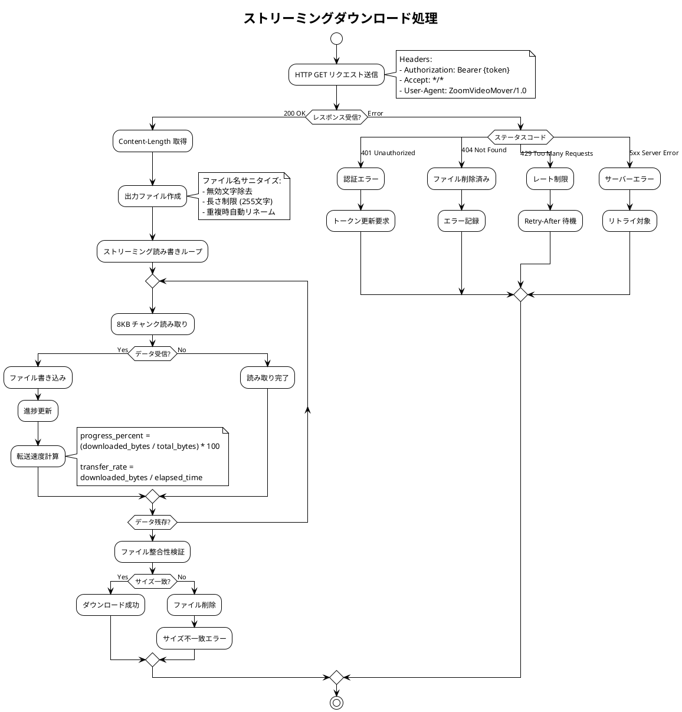

## データ処理アルゴリズム

### ファイル名サニタイズアルゴリズム

```rust
/// ファイル名をWindows/Linux両対応でサニタイズ
/// 
/// # 事前条件
/// - original_name は空でない文字列
/// 
/// # 事後条件
/// - 戻り値は有効なファイル名文字のみ含む
/// - 戻り値の長さは255文字以下
/// 
/// # 不変条件
/// - 元の意味を可能な限り保持する
fn sanitize_filename(original_name: &str) -> String {
    assert!(!original_name.is_empty(), "Original filename must not be empty");
    
    // Windows/Unix両方で無効な文字を除去
    let invalid_chars = ['<', '>', ':', '"', '/', '\\', '|', '?', '*'];
    let control_chars = (0..32).map(|i| char::from(i)).collect::<Vec<_>>();
    
    let mut sanitized = original_name
        .chars()
        .map(|c| {
            if invalid_chars.contains(&c) || control_chars.contains(&c) {
                '_'  // 無効文字を '_' に置換
            } else {
                c
            }
        })
        .collect::<String>();
    
    // 予約名の回避（Windows）
    let reserved_names = [
        "CON", "PRN", "AUX", "NUL",
        "COM1", "COM2", "COM3", "COM4", "COM5", "COM6", "COM7", "COM8", "COM9",
        "LPT1", "LPT2", "LPT3", "LPT4", "LPT5", "LPT6", "LPT7", "LPT8", "LPT9"
    ];
    
    if reserved_names.contains(&sanitized.to_uppercase().as_str()) {
        sanitized = format!("_{}", sanitized);
    }
    
    // 長さ制限（拡張子込み255文字）
    if sanitized.len() > 255 {
        let extension = Path::new(&sanitized)
            .extension()
            .and_then(|ext| ext.to_str())
            .unwrap_or("");
        
        let max_base_len = 255 - extension.len() - 1; // ドット分を引く
        let base_name = &sanitized[..max_base_len.min(sanitized.len())];
        sanitized = format!("{}.{}", base_name, extension);
    }
    
    // 末尾の空白・ピリオド除去（Windows制限）
    sanitized = sanitized.trim_end_matches([' ', '.']).to_string();
    
    // 空文字列になった場合のフォールバック
    if sanitized.is_empty() {
        sanitized = "untitled".to_string();
    }
    
    // 事後条件確認
    debug_assert!(!sanitized.is_empty(), "Sanitized filename must not be empty");
    debug_assert!(sanitized.len() <= 255, "Sanitized filename must not exceed 255 characters");
    debug_assert!(
        !sanitized.chars().any(|c| invalid_chars.contains(&c)),
        "Sanitized filename must not contain invalid characters"
    );
    
    sanitized
}
```

### 重複ファイル処理アルゴリズム

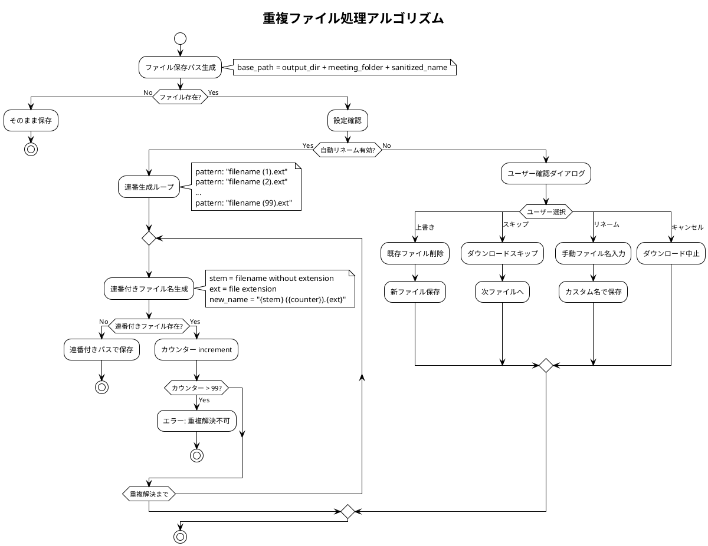

## 進捗計算アルゴリズム

### リアルタイム進捗監視

```rust
/// 進捗監視とメトリクス計算
/// 
/// # 副作用
/// - UI要素の更新
/// - ログファイルへの書き込み
/// 
/// # 事前条件
/// - download_tasks が空でない
/// - progress_reporter が初期化済み
/// 
/// # 事後条件
/// - 全タスクの進捗が正確に反映される
/// - 推定時間が合理的な範囲内
/// 
/// # 不変条件
/// - 全体進捗は個別タスク進捗の加重平均と一致
async fn monitor_download_progress(
    download_tasks: Arc<Mutex<Vec<DownloadTask>>>,
    progress_reporter: Arc<dyn ProgressReporter>
) -> Result<(), ProgressError> {
    assert!(!download_tasks.lock().unwrap().is_empty(), "Download tasks must not be empty");
    
    let start_time = Instant::now();
    let mut last_update_time = start_time;
    let mut last_total_bytes = 0u64;
    
    loop {
        tokio::time::sleep(Duration::from_millis(500)).await;
        
        let tasks = download_tasks.lock().unwrap();
        
        // 全体統計計算
        let total_files = tasks.len();
        let completed_files = tasks.iter().filter(|t| t.status == TaskStatus::Completed).count();
        let failed_files = tasks.iter().filter(|t| t.status == TaskStatus::Failed).count();
        let running_files = tasks.iter().filter(|t| t.status == TaskStatus::Downloading).count();
        
        // データ量統計
        let total_bytes: u64 = tasks.iter().map(|t| t.total_bytes).sum();
        let downloaded_bytes: u64 = tasks.iter().map(|t| t.downloaded_bytes).sum();
        
        // 進捗率計算
        let progress_percent = if total_bytes > 0 {
            (downloaded_bytes as f64 / total_bytes as f64 * 100.0) as u32
        } else {
            0
        };
        
        // 転送速度計算（直近の測定値を使用）
        let current_time = Instant::now();
        let time_delta = current_time.duration_since(last_update_time).as_secs_f64();
        let bytes_delta = downloaded_bytes.saturating_sub(last_total_bytes);
        
        let transfer_rate = if time_delta > 0.0 {
            bytes_delta as f64 / time_delta
        } else {
            0.0
        };
        
        // 残り時間推定
        let remaining_bytes = total_bytes.saturating_sub(downloaded_bytes);
        let estimated_time_remaining = if transfer_rate > 0.0 && remaining_bytes > 0 {
            Some(Duration::from_secs_f64(remaining_bytes as f64 / transfer_rate))
        } else {
            None
        };
        
        // 進捗情報構築
        let progress = DownloadProgress {
            total_files,
            completed_files,
            failed_files,
            running_files,
            total_bytes,
            downloaded_bytes,
            progress_percent,
            transfer_rate,
            estimated_time_remaining,
            elapsed_time: current_time.duration_since(start_time),
        };
        
        // 事後条件確認
        debug_assert!(
            progress_percent <= 100,
            "Progress percentage must not exceed 100%"
        );
        debug_assert!(
            downloaded_bytes <= total_bytes,
            "Downloaded bytes must not exceed total bytes"
        );
        debug_assert!(
            completed_files + failed_files + running_files <= total_files,
            "Sum of file statuses must not exceed total files"
        );
        
        // UI更新
        progress_reporter.update_progress(progress).await?;
        
        // 完了判定
        if completed_files + failed_files == total_files {
            break;
        }
        
        // 次回計算用の値を保存
        last_update_time = current_time;
        last_total_bytes = downloaded_bytes;
    }
    
    Ok(())
}
```

## AI要約処理アルゴリズム

### AI要約データ処理フロー

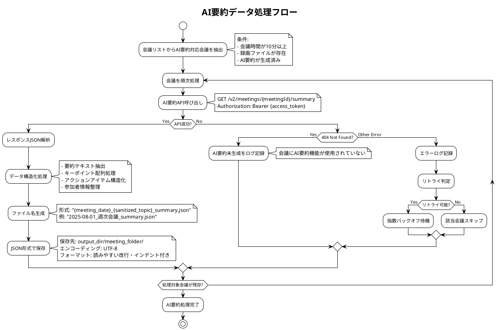

### JSON構造化アルゴリズム

```rust
/// AI要約レスポンスの構造化処理
/// 
/// # 事前条件
/// - raw_response は有効なJSON文字列
/// - meeting_info は会議基本情報を含む
/// 
/// # 事後条件
/// - 構造化されたAISummaryオブジェクトが返される
/// - 必須フィールドがすべて存在する
/// 
/// # 不変条件
/// - 元のデータの意味的内容が保持される
fn structure_ai_summary(
    raw_response: &str,
    meeting_info: &Meeting
) -> Result<AISummary, ParseError> {
    assert!(!raw_response.is_empty(), "Raw response must not be empty");
    
    let response_json: serde_json::Value = serde_json::from_str(raw_response)?;
    
    // 必須フィールドの存在確認
    let summary_obj = response_json.get("summary")
        .ok_or(ParseError::MissingField("summary"))?;
    
    // 要約テキスト抽出
    let overview = summary_obj.get("overview")
        .and_then(|v| v.as_str())
        .unwrap_or("要約情報なし")
        .to_string();
    
    // キーポイント配列処理
    let key_points = summary_obj.get("key_points")
        .and_then(|v| v.as_array())
        .map(|arr| {
            arr.iter()
                .filter_map(|item| item.as_str())
                .map(|s| s.to_string())
                .collect::<Vec<String>>()
        })
        .unwrap_or_default();
    
    // アクションアイテム構造化
    let action_items = summary_obj.get("action_items")
        .and_then(|v| v.as_array())
        .map(|arr| {
            arr.iter()
                .filter_map(|item| parse_action_item(item))
                .collect::<Vec<ActionItem>>()
        })
        .unwrap_or_default();
    
    // 参加者情報処理
    let participants = summary_obj.get("participants_summary")
        .and_then(|v| v.as_array())
        .map(|arr| {
            arr.iter()
                .filter_map(|item| parse_participant(item, &meeting_info.meeting_id))
                .collect::<Vec<Participant>>()
        })
        .unwrap_or_default();
    
    // 構造化オブジェクト生成
    let ai_summary = AISummary {
        summary_id: uuid::Uuid::new_v4().to_string(),
        meeting_id: meeting_info.meeting_id.clone(),
        summary_text: overview.clone(),
        overview,
        key_points,
        created_at: chrono::Utc::now(),
        source_api: "zoom_ai_companion".to_string(),
        confidence_score: extract_confidence_score(&response_json),
        language: detect_language(&overview),
    };
    
    // 事後条件確認
    debug_assert!(!ai_summary.summary_id.is_empty(), "Summary ID must not be empty");
    debug_assert!(!ai_summary.meeting_id.is_empty(), "Meeting ID must not be empty");
    debug_assert!(
        ai_summary.confidence_score.map_or(true, |score| score >= 0.0 && score <= 1.0),
        "Confidence score must be between 0.0 and 1.0"
    );
    
    Ok(ai_summary)
}

/// アクションアイテムのパース処理
fn parse_action_item(item_json: &serde_json::Value) -> Option<ActionItem> {
    let description = item_json.get("description")?.as_str()?.to_string();
    let assignee = item_json.get("assignee").and_then(|v| v.as_str()).map(|s| s.to_string());
    let due_date = item_json.get("due_date")
        .and_then(|v| v.as_str())
        .and_then(|s| chrono::NaiveDate::parse_from_str(s, "%Y-%m-%d").ok());
    
    Some(ActionItem {
        action_item_id: uuid::Uuid::new_v4().to_string(),
        summary_id: String::new(), // 後で設定される
        description,
        assignee,
        due_date,
        priority: Priority::Medium, // デフォルト値
        status: ActionItemStatus::Pending,
        created_at: chrono::Utc::now(),
        updated_at: chrono::Utc::now(),
    })
}
```

## エラー処理・回復アルゴリズム

### 包括的エラー分類処理

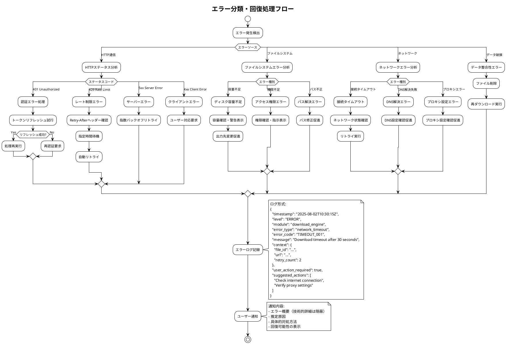

---

**承認**:  
**品質基準適合**: [ ] 確認済  
**ポリシー準拠**: [ ] 確認済  
**承認日**: ___________