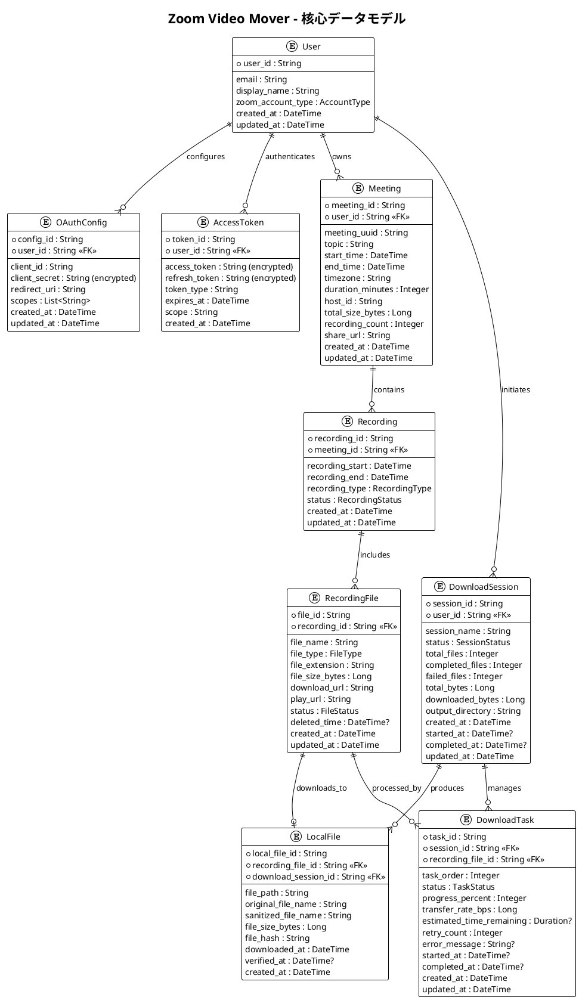
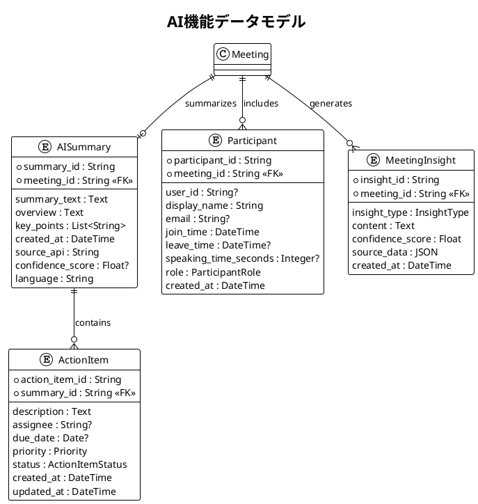
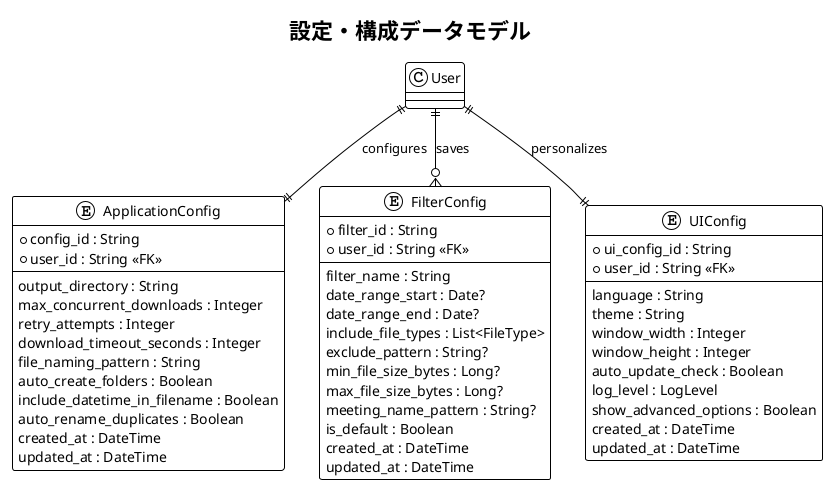
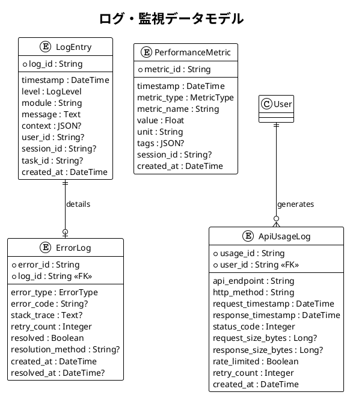

# データモデル図・ER図 - Zoom Video Mover

## 文書概要
**プロジェクト名**: Zoom Video Mover  
**作成日**: 2025-08-02  
  
**バージョン**: 1.0  

## 論理データモデル

### 核心エンティティ関係図



### AI機能データモデル



### 設定・構成データモデル



### ログ・監視データモデル



## 物理データモデル（実装）

### Rustデータ構造定義

#### 核心エンティティ
```rust
// User関連
#[derive(Debug, Clone, Serialize, Deserialize)]
pub struct User {
    pub user_id: String,
    pub email: String,
    pub display_name: String,
    pub zoom_account_type: AccountType,
    pub created_at: chrono::DateTime<chrono::Utc>,
    pub updated_at: chrono::DateTime<chrono::Utc>,
}

#[derive(Debug, Clone, Serialize, Deserialize)]
pub enum AccountType {
    Basic,
    Pro,
    Business,
    Enterprise,
}

// OAuth認証関連
#[derive(Debug, Clone, Serialize, Deserialize)]
pub struct OAuthConfig {
    pub config_id: String,
    pub user_id: String,
    pub client_id: String,
    pub client_secret: String, // 暗号化して保存
    pub redirect_uri: String,
    pub scopes: Vec<String>,
    pub created_at: chrono::DateTime<chrono::Utc>,
    pub updated_at: chrono::DateTime<chrono::Utc>,
}

#[derive(Debug, Clone, Serialize, Deserialize)]
pub struct AccessToken {
    pub token_id: String,
    pub user_id: String,
    pub access_token: String, // 暗号化して保存
    pub refresh_token: String, // 暗号化して保存
    pub token_type: String,
    pub expires_at: chrono::DateTime<chrono::Utc>,
    pub scope: String,
    pub created_at: chrono::DateTime<chrono::Utc>,
}

// 録画関連
#[derive(Debug, Clone, Serialize, Deserialize)]
pub struct Meeting {
    pub meeting_id: String,
    pub user_id: String,
    pub meeting_uuid: String,
    pub topic: String,
    pub start_time: chrono::DateTime<chrono::Utc>,
    pub end_time: chrono::DateTime<chrono::Utc>,
    pub timezone: String,
    pub duration_minutes: i32,
    pub host_id: String,
    pub total_size_bytes: i64,
    pub recording_count: i32,
    pub share_url: Option<String>,
    pub created_at: chrono::DateTime<chrono::Utc>,
    pub updated_at: chrono::DateTime<chrono::Utc>,
}

#[derive(Debug, Clone, Serialize, Deserialize)]
pub struct RecordingFile {
    pub file_id: String,
    pub recording_id: String,
    pub file_name: String,
    pub file_type: FileType,
    pub file_extension: String,
    pub file_size_bytes: i64,
    pub download_url: String,
    pub play_url: Option<String>,
    pub status: FileStatus,
    pub deleted_time: Option<chrono::DateTime<chrono::Utc>>,
    pub created_at: chrono::DateTime<chrono::Utc>,
    pub updated_at: chrono::DateTime<chrono::Utc>,
}

#[derive(Debug, Clone, Serialize, Deserialize)]
pub enum FileType {
    MP4,
    M4A,
    CHAT,
    TRANSCRIPT,
    CC,
    CSV,
}

#[derive(Debug, Clone, Serialize, Deserialize)]
pub enum FileStatus {
    Available,
    Processing,
    Deleted,
    Expired,
}
```

#### ダウンロード関連
```rust
#[derive(Debug, Clone, Serialize, Deserialize)]
pub struct DownloadSession {
    pub session_id: String,
    pub user_id: String,
    pub session_name: String,
    pub status: SessionStatus,
    pub total_files: i32,
    pub completed_files: i32,
    pub failed_files: i32,
    pub total_bytes: i64,
    pub downloaded_bytes: i64,
    pub output_directory: PathBuf,
    pub created_at: chrono::DateTime<chrono::Utc>,
    pub started_at: Option<chrono::DateTime<chrono::Utc>>,
    pub completed_at: Option<chrono::DateTime<chrono::Utc>>,
    pub updated_at: chrono::DateTime<chrono::Utc>,
}

#[derive(Debug, Clone, Serialize, Deserialize)]
pub enum SessionStatus {
    Pending,
    Running,
    Paused,
    Completed,
    Failed,
    Cancelled,
}

#[derive(Debug, Clone, Serialize, Deserialize)]
pub struct DownloadTask {
    pub task_id: String,
    pub session_id: String,
    pub recording_file_id: String,
    pub task_order: i32,
    pub status: TaskStatus,
    pub progress_percent: i32,
    pub transfer_rate_bps: i64,
    pub estimated_time_remaining: Option<chrono::Duration>,
    pub retry_count: i32,
    pub error_message: Option<String>,
    pub started_at: Option<chrono::DateTime<chrono::Utc>>,
    pub completed_at: Option<chrono::DateTime<chrono::Utc>>,
    pub created_at: chrono::DateTime<chrono::Utc>,
    pub updated_at: chrono::DateTime<chrono::Utc>,
}

#[derive(Debug, Clone, Serialize, Deserialize)]
pub enum TaskStatus {
    Queued,
    Downloading,
    Completed,
    Failed,
    Retrying,
    Cancelled,
}
```

#### AI機能関連
```rust
#[derive(Debug, Clone, Serialize, Deserialize)]
pub struct AISummary {
    pub summary_id: String,
    pub meeting_id: String,
    pub summary_text: String,
    pub overview: String,
    pub key_points: Vec<String>,
    pub created_at: chrono::DateTime<chrono::Utc>,
    pub source_api: String,
    pub confidence_score: Option<f32>,
    pub language: String,
}

#[derive(Debug, Clone, Serialize, Deserialize)]
pub struct ActionItem {
    pub action_item_id: String,
    pub summary_id: String,
    pub description: String,
    pub assignee: Option<String>,
    pub due_date: Option<chrono::NaiveDate>,
    pub priority: Priority,
    pub status: ActionItemStatus,
    pub created_at: chrono::DateTime<chrono::Utc>,
    pub updated_at: chrono::DateTime<chrono::Utc>,
}

#[derive(Debug, Clone, Serialize, Deserialize)]
pub enum Priority {
    Low,
    Medium,
    High,
    Critical,
}

#[derive(Debug, Clone, Serialize, Deserialize)]
pub enum ActionItemStatus {
    Pending,
    InProgress,
    Completed,
    Cancelled,
}
```

## データ制約・整合性ルール

### 主キー制約
| テーブル | 主キー | 生成方法 |
|----------|--------|----------|
| **User** | user_id | UUID v4 |
| **Meeting** | meeting_id | Zoom API提供ID |
| **RecordingFile** | file_id | Zoom API提供ID |
| **DownloadSession** | session_id | UUID v4 |
| **DownloadTask** | task_id | UUID v4 |

### 外部キー制約
| 子テーブル | 外部キー | 参照テーブル | 参照キー | カスケード |
|------------|----------|-------------|----------|------------|
| **OAuthConfig** | user_id | User | user_id | CASCADE |
| **AccessToken** | user_id | User | user_id | CASCADE |
| **Meeting** | user_id | User | user_id | CASCADE |
| **Recording** | meeting_id | Meeting | meeting_id | CASCADE |
| **RecordingFile** | recording_id | Recording | recording_id | CASCADE |
| **DownloadTask** | session_id | DownloadSession | session_id | CASCADE |
| **DownloadTask** | recording_file_id | RecordingFile | file_id | RESTRICT |

### ユニーク制約
| テーブル | カラム組み合わせ | 説明 |
|----------|------------------|------|
| **User** | email | 一意なユーザー識別 |
| **OAuthConfig** | user_id | ユーザーあたり1つの設定 |
| **AccessToken** | user_id | ユーザーあたり1つのトークン |
| **DownloadTask** | session_id, recording_file_id | セッション内でファイル重複禁止 |

### チェック制約
```sql
-- ファイルサイズは正の値
ALTER TABLE RecordingFile ADD CONSTRAINT chk_file_size_positive 
CHECK (file_size_bytes >= 0);

-- 進捗率は0-100の範囲
ALTER TABLE DownloadTask ADD CONSTRAINT chk_progress_range 
CHECK (progress_percent >= 0 AND progress_percent <= 100);

-- 日時の論理整合性
ALTER TABLE Meeting ADD CONSTRAINT chk_meeting_time_order 
CHECK (end_time > start_time);

-- リトライ回数の上限
ALTER TABLE DownloadTask ADD CONSTRAINT chk_retry_limit 
CHECK (retry_count >= 0 AND retry_count <= 10);
```

## データ暗号化・セキュリティ

### 暗号化対象データ
| テーブル | カラム | 暗号化方式 | 理由 |
|----------|--------|------------|------|
| **OAuthConfig** | client_secret | AES-256-GCM | OAuth認証情報保護 |
| **AccessToken** | access_token | AES-256-GCM | API認証情報保護 |
| **AccessToken** | refresh_token | AES-256-GCM | API認証情報保護 |

### 暗号化実装
```rust
use aes_gcm::{Aes256Gcm, Key, Nonce};
use aes_gcm::aead::{Aead, NewAead};

pub struct SecureStorage {
    cipher: Aes256Gcm,
}

impl SecureStorage {
    pub fn new(key: &[u8; 32]) -> Self {
        let key = Key::from_slice(key);
        let cipher = Aes256Gcm::new(key);
        Self { cipher }
    }
    
    pub fn encrypt(&self, plaintext: &str) -> Result<Vec<u8>, CryptoError> {
        let nonce = Nonce::from_slice(&self.generate_nonce()?);
        let ciphertext = self.cipher.encrypt(nonce, plaintext.as_bytes())?;
        
        let mut result = Vec::new();
        result.extend_from_slice(nonce);
        result.extend_from_slice(&ciphertext);
        Ok(result)
    }
    
    pub fn decrypt(&self, encrypted_data: &[u8]) -> Result<String, CryptoError> {
        let (nonce_bytes, ciphertext) = encrypted_data.split_at(12);
        let nonce = Nonce::from_slice(nonce_bytes);
        
        let plaintext = self.cipher.decrypt(nonce, ciphertext)?;
        Ok(String::from_utf8(plaintext)?)
    }
}
```

## データ永続化・保存方式

### ファイルベース保存
```rust
use serde::{Serialize, Deserialize};
use std::path::Path;

// TOML形式での設定保存
pub fn save_config<T: Serialize>(config: &T, file_path: &Path) -> Result<(), ConfigError> {
    let toml_string = toml::to_string_pretty(config)?;
    std::fs::write(file_path, toml_string)?;
    Ok(())
}

pub fn load_config<T: for<'de> Deserialize<'de>>(file_path: &Path) -> Result<T, ConfigError> {
    let content = std::fs::read_to_string(file_path)?;
    let config: T = toml::from_str(&content)?;
    Ok(config)
}

// JSON形式でのセッションデータ保存
pub fn save_session_data<T: Serialize>(data: &T, file_path: &Path) -> Result<(), DataError> {
    let json_string = serde_json::to_string_pretty(data)?;
    std::fs::write(file_path, json_string)?;
    Ok(())
}
```

### データディレクトリ構造
```
%APPDATA%/ZoomVideoMover/
├── config/
│   ├── oauth.toml          # OAuth設定（暗号化）
│   ├── application.toml    # アプリケーション設定
│   ├── ui.toml            # UI設定
│   └── filters/           # 保存済みフィルタ設定
│       ├── default.toml
│       └── monthly_backup.toml
├── data/
│   ├── sessions/          # ダウンロードセッション履歴
│   │   ├── 2025-08-01_session.json
│   │   └── 2025-08-02_session.json
│   ├── cache/             # APIレスポンスキャッシュ
│   │   └── recordings_cache.json
│   └── ai_summaries/      # AI要約データ
│       ├── meeting_123456789.json
│       └── meeting_987654321.json
└── logs/
    ├── application.log
    ├── api.log
    └── error.log
```

---

**承認**:  
**品質基準適合**: [ ] 確認済  
**ポリシー準拠**: [ ] 確認済  
**承認日**: ___________