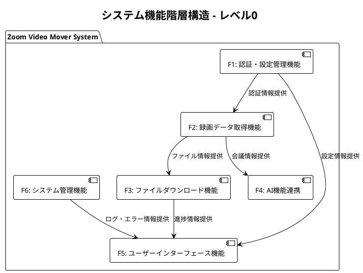
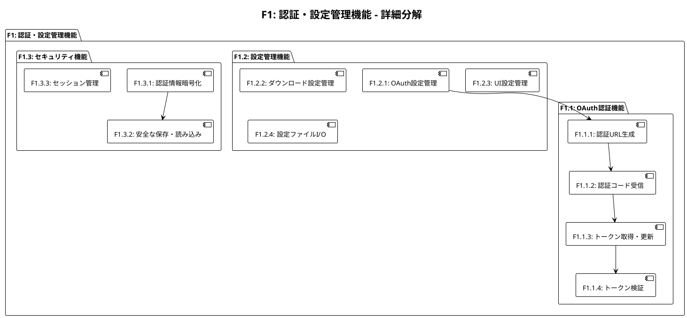
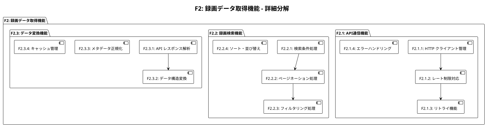
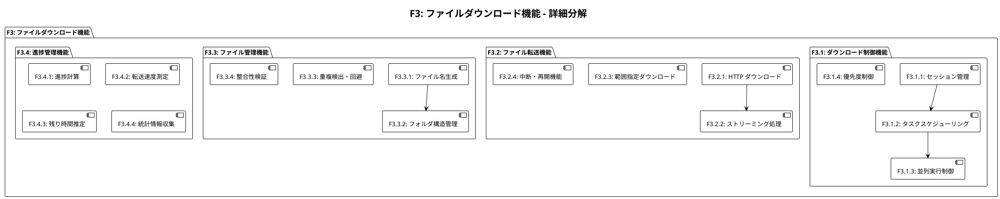
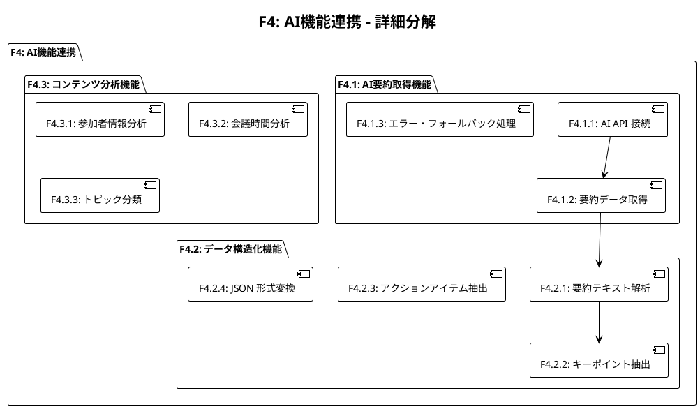
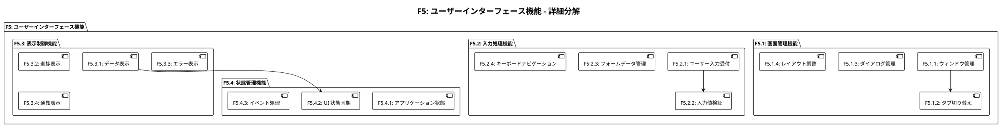
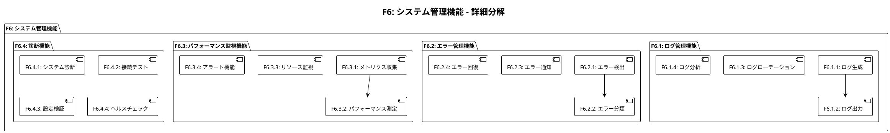

# 機能一覧・機能分解図 - Zoom Video Mover

## 文書概要
**プロジェクト名**: Zoom Video Mover  
**作成日**: 2025-08-02  
  
**バージョン**: 1.0  

## システム機能階層構造

### レベル0: システム全体機能

## 詳細機能分解

### F1: 認証・設定管理機能

#### レベル1分解

#### 機能詳細仕様

##### F1.1.1: 認証URL生成
- **目的**: OAuth 2.0認証フロー開始用URL生成
- **入力**: OAuth設定(Client ID, Redirect URI, Scope)
- **処理**: URL組み立て、stateパラメータ生成、CSRF対策
- **出力**: 認証URL文字列
- **例外**: 設定値不正、URL生成失敗

##### F1.1.2: 認証コード受信
- **目的**: OAuth認証後の認証コード受信
- **入力**: HTTPリクエスト(認証コード、state)
- **処理**: ローカルサーバー起動、コード抽出、state検証
- **出力**: 認証コード文字列
- **例外**: コード受信タイムアウト、state不一致

##### F1.1.3: トークン取得・更新
- **目的**: アクセストークン・リフレッシュトークン管理
- **入力**: 認証コードまたはリフレッシュトークン
- **処理**: API呼び出し、レスポンス解析、期限管理
- **出力**: アクセストークン構造体
- **例外**: API呼び出し失敗、トークン形式不正

##### F1.2.1: OAuth設定管理
- **目的**: OAuth認証に必要な設定情報管理
- **入力**: ユーザー入力設定値
- **処理**: 設定値検証、デフォルト値設定、永続化
- **出力**: OAuth設定構造体
- **例外**: 設定値検証エラー、保存失敗

### F2: 録画データ取得機能

#### レベル1分解

### F3: ファイルダウンロード機能

#### レベル1分解

### F4: AI機能連携

#### レベル1分解

### F5: ユーザーインターフェース機能

#### レベル1分解

### F6: システム管理機能

#### レベル1分解

## 機能間依存関係マトリックス

### 機能依存関係表

| 提供機能 | 依存機能 | 依存内容 | 結合度 |
|----------|----------|----------|--------|
| **F2.2: 録画検索機能** | F1.1: OAuth認証機能 | アクセストークン | 強 |
| **F3.2: ファイル転送機能** | F1.1: OAuth認証機能 | アクセストークン | 強 |
| **F4.1: AI要約取得機能** | F1.1: OAuth認証機能 | アクセストークン | 強 |
| **F3.1: ダウンロード制御機能** | F2.2: 録画検索機能 | ファイル情報 | 中 |
| **F4.1: AI要約取得機能** | F2.2: 録画検索機能 | 会議情報 | 中 |
| **F5.3: 表示制御機能** | F3.4: 進捗管理機能 | 進捗情報 | 中 |
| **F5.3: 表示制御機能** | F6.2: エラー管理機能 | エラー情報 | 中 |
| **F6.1: ログ管理機能** | 全機能 | ログデータ | 弱 |

### 結合度分類
- **強結合**: 機能の実行に必須の依存関係
- **中結合**: データの受け渡しが必要な依存関係  
- **弱結合**: 情報提供・監視目的の依存関係

## 機能実装優先度

### 優先度レベル定義

#### P0: 必須・基盤機能（MVP）
1. **F1.1: OAuth認証機能** - 全ての外部API呼び出しの前提
2. **F1.2: 設定管理機能** - 基本的なアプリケーション動作の前提
3. **F2.1: API通信機能** - 録画データ取得の基盤
4. **F2.2: 録画検索機能** - コア機能の実現
5. **F3.2: ファイル転送機能** - 主要価値の提供
6. **F5.1: 画面管理機能** - ユーザーインターフェースの基盤

#### P1: 重要・差別化機能
7. **F3.1: ダウンロード制御機能** - 並列処理による効率化
8. **F3.4: 進捗管理機能** - ユーザビリティ向上
9. **F5.2: 入力処理機能** - 操作性向上
10. **F5.3: 表示制御機能** - 情報提示の改善
11. **F6.2: エラー管理機能** - 信頼性確保

#### P2: 高価値・付加機能
12. **F4.1: AI要約取得機能** - 付加価値の提供
13. **F4.2: データ構造化機能** - AI機能の活用
14. **F3.3: ファイル管理機能** - 利便性向上
15. **F6.1: ログ管理機能** - 運用・保守性向上

#### P3: 運用・保守機能
16. **F6.3: パフォーマンス監視機能** - 運用品質向上
17. **F6.4: 診断機能** - トラブルシューティング支援
18. **F1.3: セキュリティ機能** - セキュリティ強化

### 実装スケジュール

#### Sprint 1-2 (4週間): 基盤機能
- F1.1, F1.2: 認証・設定の基本実装
- F2.1: HTTP通信基盤
- F5.1: 基本GUI構造

#### Sprint 3-4 (4週間): コア機能
- F2.2: 録画検索・表示
- F3.2: 基本ダウンロード機能
- F5.2, F5.3: 基本UI操作・表示

#### Sprint 5-6 (4週間): 効率化機能
- F3.1: 並列ダウンロード
- F3.4: 進捗表示
- F6.2: エラー処理強化

#### Sprint 7-8 (4週間): 付加価値機能
- F4.1, F4.2: AI要約機能
- F3.3: ファイル管理向上
- F6.1: ログ機能

## 品質属性と機能の関係

### 性能要件との関係
| 機能 | 性能要件 | 実装方針 |
|------|----------|----------|
| **F2.1: API通信機能** | レート制限遵守 | 10req/sec制限の実装 |
| **F3.1: ダウンロード制御機能** | 並列数制限 | 最大5同時ダウンロード |
| **F3.2: ファイル転送機能** | メモリ効率 | ストリーミング処理 |
| **F5.3: 表示制御機能** | UI応答性 | 500ms更新間隔 |

### 信頼性要件との関係
| 機能 | 信頼性要件 | 実装方針 |
|------|------------|----------|
| **F2.1: API通信機能** | 自動リトライ | 指数バックオフ |
| **F3.2: ファイル転送機能** | 中断・再開 | 範囲指定ダウンロード |
| **F3.3: ファイル管理機能** | 整合性保証 | ハッシュ値検証 |
| **F6.2: エラー管理機能** | 障害回復 | 適切なエラー分類・通知 |

### セキュリティ要件との関係
| 機能 | セキュリティ要件 | 実装方針 |
|------|-----------------|----------|
| **F1.1: OAuth認証機能** | 認証情報保護 | HTTPS通信・トークン暗号化 |
| **F1.3: セキュリティ機能** | 機密データ保護 | Windows DPAPI利用 |
| **F2.1: API通信機能** | 通信暗号化 | TLS 1.2以上強制 |

---

**承認**:  
**品質基準適合**: [ ] 確認済  
**ポリシー準拠**: [ ] 確認済  
**承認日**: ___________