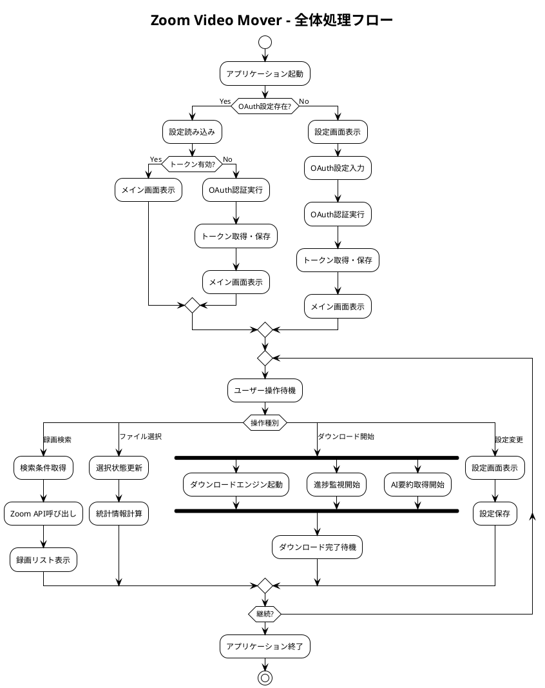
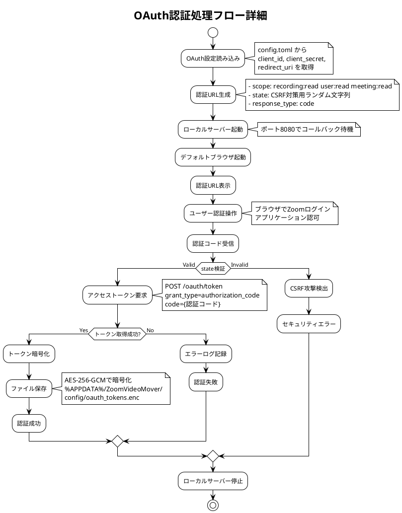
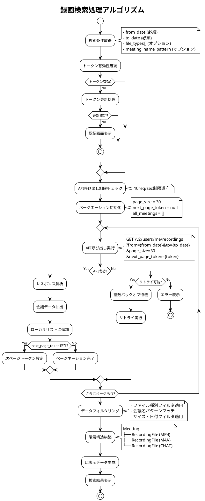
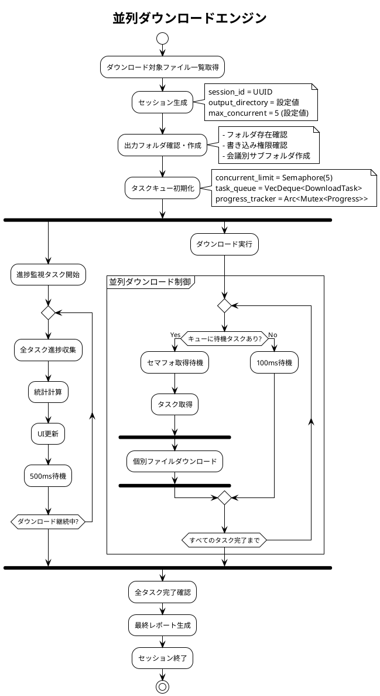
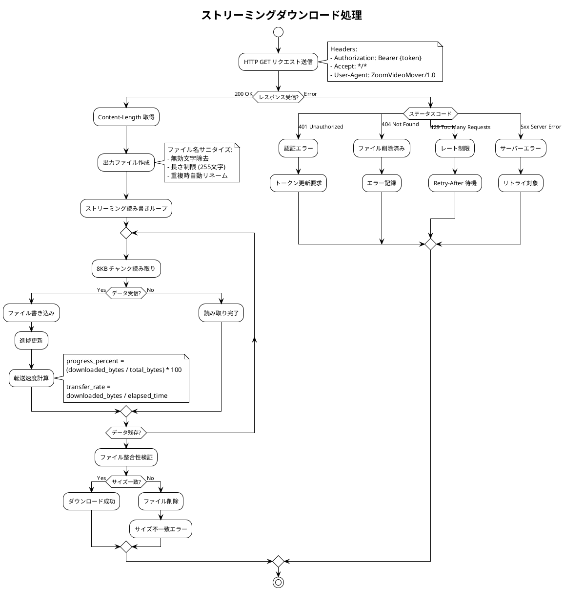
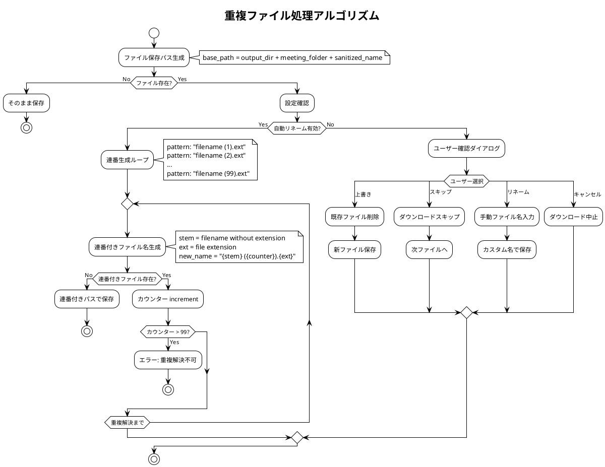
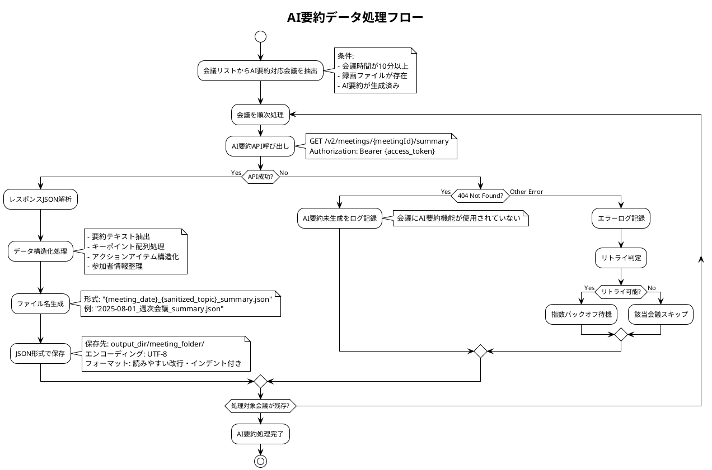
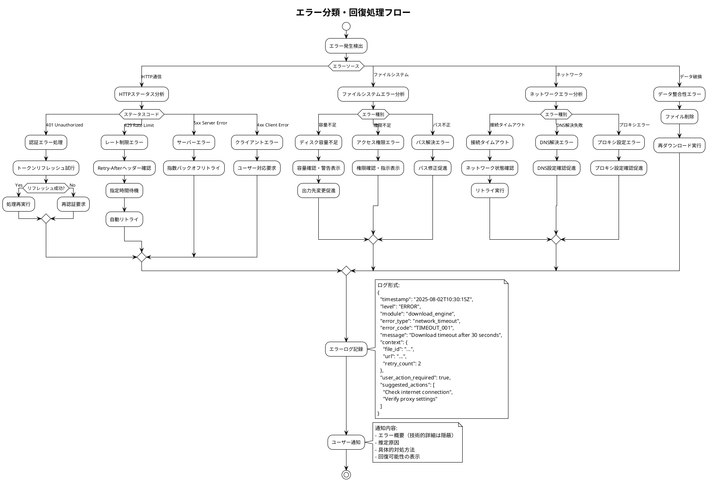

# 処理フロー図・アルゴリズム仕様書 - Zoom Video Mover

## 文書概要
**プロジェクト名**: Zoom Video Mover  
**作成日**: 2025-08-02  
  
**バージョン**: 1.0  

## 主要処理フロー図

### オーバーオール処理フロー



### OAuth認証処理フロー



### 録画検索処理アルゴリズム



## 並列ダウンロードアルゴリズム

### 並列制御アルゴリズム



### 個別ファイルダウンロードアルゴリズム

```rust
/// 個別ファイルダウンロードのアルゴリズム実装
async fn download_single_file(
    file: &RecordingFile,
    output_path: &Path,
    progress_reporter: Arc<dyn ProgressReporter>
) -> Result<LocalFile, DownloadError> {
    // 事前条件: ファイル情報が有効であること
    assert!(!file.download_url.is_empty(), "Download URL must not be empty");
    assert!(file.file_size_bytes > 0, "File size must be positive");
    
    let client = create_http_client()?;
    let mut retry_count = 0;
    const MAX_RETRIES: u32 = 3;
    
    loop {
        match attempt_download(&client, file, output_path, &progress_reporter).await {
            Ok(local_file) => {
                // 事後条件: ファイルが正常にダウンロードされたことを確認
                debug_assert!(output_path.exists(), "Downloaded file must exist");
                debug_assert!(
                    std::fs::metadata(output_path)?.len() == file.file_size_bytes as u64,
                    "Downloaded file size must match expected size"
                );
                return Ok(local_file);
            },
            Err(e) if is_retryable_error(&e) && retry_count < MAX_RETRIES => {
                retry_count += 1;
                let delay = calculate_exponential_backoff(retry_count);
                
                warn!("Download failed, retrying in {:?}: {}", delay, e);
                progress_reporter.report_retry(file.file_id.clone(), retry_count).await;
                
                tokio::time::sleep(delay).await;
            },
            Err(e) => {
                error!("Download failed permanently: {}", e);
                return Err(e);
            }
        }
    }
}

/// 指数バックオフ計算
/// 
/// # 事前条件
/// - attempt は 0 より大きい値
/// 
/// # 事後条件  
/// - 返される Duration は 1秒以上 60秒以下
/// 
/// # 不変条件
/// - 計算中に attempt の値が変更されない
fn calculate_exponential_backoff(attempt: u32) -> Duration {
    debug_assert!(attempt > 0, "Attempt count must be positive");
    
    let base_delay_ms = 1000; // 1秒
    let max_delay_ms = 60000;  // 60秒
    
    let delay_ms = std::cmp::min(
        base_delay_ms * 2_u64.pow(attempt - 1),
        max_delay_ms
    );
    
    // ジッター追加（10%の変動）
    let jitter = rand::random::<f64>() * 0.1;
    let final_delay_ms = (delay_ms as f64 * (1.0 + jitter)) as u64;
    
    let result = Duration::from_millis(final_delay_ms);
    
    // 事後条件チェック
    debug_assert!(
        result >= Duration::from_secs(1) && result <= Duration::from_secs(60),
        "Backoff delay must be between 1 and 60 seconds"
    );
    
    result
}
```

### ストリーミングダウンロード実装



## データ処理アルゴリズム

### ファイル名サニタイズアルゴリズム

```rust
/// ファイル名をWindows/Linux両対応でサニタイズ
/// 
/// # 事前条件
/// - original_name は空でない文字列
/// 
/// # 事後条件
/// - 戻り値は有効なファイル名文字のみ含む
/// - 戻り値の長さは255文字以下
/// 
/// # 不変条件
/// - 元の意味を可能な限り保持する
fn sanitize_filename(original_name: &str) -> String {
    assert!(!original_name.is_empty(), "Original filename must not be empty");
    
    // Windows/Unix両方で無効な文字を除去
    let invalid_chars = ['<', '>', ':', '"', '/', '\\', '|', '?', '*'];
    let control_chars = (0..32).map(|i| char::from(i)).collect::<Vec<_>>();
    
    let mut sanitized = original_name
        .chars()
        .map(|c| {
            if invalid_chars.contains(&c) || control_chars.contains(&c) {
                '_'  // 無効文字を '_' に置換
            } else {
                c
            }
        })
        .collect::<String>();
    
    // 予約名の回避（Windows）
    let reserved_names = [
        "CON", "PRN", "AUX", "NUL",
        "COM1", "COM2", "COM3", "COM4", "COM5", "COM6", "COM7", "COM8", "COM9",
        "LPT1", "LPT2", "LPT3", "LPT4", "LPT5", "LPT6", "LPT7", "LPT8", "LPT9"
    ];
    
    if reserved_names.contains(&sanitized.to_uppercase().as_str()) {
        sanitized = format!("_{}", sanitized);
    }
    
    // 長さ制限（拡張子込み255文字）
    if sanitized.len() > 255 {
        let extension = Path::new(&sanitized)
            .extension()
            .and_then(|ext| ext.to_str())
            .unwrap_or("");
        
        let max_base_len = 255 - extension.len() - 1; // ドット分を引く
        let base_name = &sanitized[..max_base_len.min(sanitized.len())];
        sanitized = format!("{}.{}", base_name, extension);
    }
    
    // 末尾の空白・ピリオド除去（Windows制限）
    sanitized = sanitized.trim_end_matches([' ', '.']).to_string();
    
    // 空文字列になった場合のフォールバック
    if sanitized.is_empty() {
        sanitized = "untitled".to_string();
    }
    
    // 事後条件確認
    debug_assert!(!sanitized.is_empty(), "Sanitized filename must not be empty");
    debug_assert!(sanitized.len() <= 255, "Sanitized filename must not exceed 255 characters");
    debug_assert!(
        !sanitized.chars().any(|c| invalid_chars.contains(&c)),
        "Sanitized filename must not contain invalid characters"
    );
    
    sanitized
}
```

### 重複ファイル処理アルゴリズム



## 進捗計算アルゴリズム

### リアルタイム進捗監視

```rust
/// 進捗監視とメトリクス計算
/// 
/// # 副作用
/// - UI要素の更新
/// - ログファイルへの書き込み
/// 
/// # 事前条件
/// - download_tasks が空でない
/// - progress_reporter が初期化済み
/// 
/// # 事後条件
/// - 全タスクの進捗が正確に反映される
/// - 推定時間が合理的な範囲内
/// 
/// # 不変条件
/// - 全体進捗は個別タスク進捗の加重平均と一致
async fn monitor_download_progress(
    download_tasks: Arc<Mutex<Vec<DownloadTask>>>,
    progress_reporter: Arc<dyn ProgressReporter>
) -> Result<(), ProgressError> {
    assert!(!download_tasks.lock().unwrap().is_empty(), "Download tasks must not be empty");
    
    let start_time = Instant::now();
    let mut last_update_time = start_time;
    let mut last_total_bytes = 0u64;
    
    loop {
        tokio::time::sleep(Duration::from_millis(500)).await;
        
        let tasks = download_tasks.lock().unwrap();
        
        // 全体統計計算
        let total_files = tasks.len();
        let completed_files = tasks.iter().filter(|t| t.status == TaskStatus::Completed).count();
        let failed_files = tasks.iter().filter(|t| t.status == TaskStatus::Failed).count();
        let running_files = tasks.iter().filter(|t| t.status == TaskStatus::Downloading).count();
        
        // データ量統計
        let total_bytes: u64 = tasks.iter().map(|t| t.total_bytes).sum();
        let downloaded_bytes: u64 = tasks.iter().map(|t| t.downloaded_bytes).sum();
        
        // 進捗率計算
        let progress_percent = if total_bytes > 0 {
            (downloaded_bytes as f64 / total_bytes as f64 * 100.0) as u32
        } else {
            0
        };
        
        // 転送速度計算（直近の測定値を使用）
        let current_time = Instant::now();
        let time_delta = current_time.duration_since(last_update_time).as_secs_f64();
        let bytes_delta = downloaded_bytes.saturating_sub(last_total_bytes);
        
        let transfer_rate = if time_delta > 0.0 {
            bytes_delta as f64 / time_delta
        } else {
            0.0
        };
        
        // 残り時間推定
        let remaining_bytes = total_bytes.saturating_sub(downloaded_bytes);
        let estimated_time_remaining = if transfer_rate > 0.0 && remaining_bytes > 0 {
            Some(Duration::from_secs_f64(remaining_bytes as f64 / transfer_rate))
        } else {
            None
        };
        
        // 進捗情報構築
        let progress = DownloadProgress {
            total_files,
            completed_files,
            failed_files,
            running_files,
            total_bytes,
            downloaded_bytes,
            progress_percent,
            transfer_rate,
            estimated_time_remaining,
            elapsed_time: current_time.duration_since(start_time),
        };
        
        // 事後条件確認
        debug_assert!(
            progress_percent <= 100,
            "Progress percentage must not exceed 100%"
        );
        debug_assert!(
            downloaded_bytes <= total_bytes,
            "Downloaded bytes must not exceed total bytes"
        );
        debug_assert!(
            completed_files + failed_files + running_files <= total_files,
            "Sum of file statuses must not exceed total files"
        );
        
        // UI更新
        progress_reporter.update_progress(progress).await?;
        
        // 完了判定
        if completed_files + failed_files == total_files {
            break;
        }
        
        // 次回計算用の値を保存
        last_update_time = current_time;
        last_total_bytes = downloaded_bytes;
    }
    
    Ok(())
}
```

## AI要約処理アルゴリズム

### AI要約データ処理フロー



### JSON構造化アルゴリズム

```rust
/// AI要約レスポンスの構造化処理
/// 
/// # 事前条件
/// - raw_response は有効なJSON文字列
/// - meeting_info は会議基本情報を含む
/// 
/// # 事後条件
/// - 構造化されたAISummaryオブジェクトが返される
/// - 必須フィールドがすべて存在する
/// 
/// # 不変条件
/// - 元のデータの意味的内容が保持される
fn structure_ai_summary(
    raw_response: &str,
    meeting_info: &Meeting
) -> Result<AISummary, ParseError> {
    assert!(!raw_response.is_empty(), "Raw response must not be empty");
    
    let response_json: serde_json::Value = serde_json::from_str(raw_response)?;
    
    // 必須フィールドの存在確認
    let summary_obj = response_json.get("summary")
        .ok_or(ParseError::MissingField("summary"))?;
    
    // 要約テキスト抽出
    let overview = summary_obj.get("overview")
        .and_then(|v| v.as_str())
        .unwrap_or("要約情報なし")
        .to_string();
    
    // キーポイント配列処理
    let key_points = summary_obj.get("key_points")
        .and_then(|v| v.as_array())
        .map(|arr| {
            arr.iter()
                .filter_map(|item| item.as_str())
                .map(|s| s.to_string())
                .collect::<Vec<String>>()
        })
        .unwrap_or_default();
    
    // アクションアイテム構造化
    let action_items = summary_obj.get("action_items")
        .and_then(|v| v.as_array())
        .map(|arr| {
            arr.iter()
                .filter_map(|item| parse_action_item(item))
                .collect::<Vec<ActionItem>>()
        })
        .unwrap_or_default();
    
    // 参加者情報処理
    let participants = summary_obj.get("participants_summary")
        .and_then(|v| v.as_array())
        .map(|arr| {
            arr.iter()
                .filter_map(|item| parse_participant(item, &meeting_info.meeting_id))
                .collect::<Vec<Participant>>()
        })
        .unwrap_or_default();
    
    // 構造化オブジェクト生成
    let ai_summary = AISummary {
        summary_id: uuid::Uuid::new_v4().to_string(),
        meeting_id: meeting_info.meeting_id.clone(),
        summary_text: overview.clone(),
        overview,
        key_points,
        created_at: chrono::Utc::now(),
        source_api: "zoom_ai_companion".to_string(),
        confidence_score: extract_confidence_score(&response_json),
        language: detect_language(&overview),
    };
    
    // 事後条件確認
    debug_assert!(!ai_summary.summary_id.is_empty(), "Summary ID must not be empty");
    debug_assert!(!ai_summary.meeting_id.is_empty(), "Meeting ID must not be empty");
    debug_assert!(
        ai_summary.confidence_score.map_or(true, |score| score >= 0.0 && score <= 1.0),
        "Confidence score must be between 0.0 and 1.0"
    );
    
    Ok(ai_summary)
}

/// アクションアイテムのパース処理
fn parse_action_item(item_json: &serde_json::Value) -> Option<ActionItem> {
    let description = item_json.get("description")?.as_str()?.to_string();
    let assignee = item_json.get("assignee").and_then(|v| v.as_str()).map(|s| s.to_string());
    let due_date = item_json.get("due_date")
        .and_then(|v| v.as_str())
        .and_then(|s| chrono::NaiveDate::parse_from_str(s, "%Y-%m-%d").ok());
    
    Some(ActionItem {
        action_item_id: uuid::Uuid::new_v4().to_string(),
        summary_id: String::new(), // 後で設定される
        description,
        assignee,
        due_date,
        priority: Priority::Medium, // デフォルト値
        status: ActionItemStatus::Pending,
        created_at: chrono::Utc::now(),
        updated_at: chrono::Utc::now(),
    })
}
```

## エラー処理・回復アルゴリズム

### 包括的エラー分類処理



---

**承認**:  
**品質基準適合**: [ ] 確認済  
**ポリシー準拠**: [ ] 確認済  
**承認日**: ___________