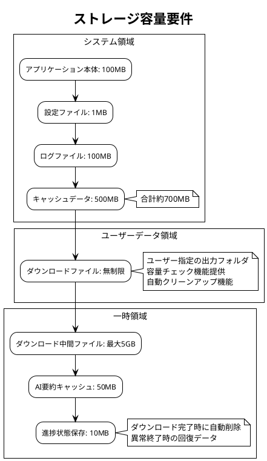
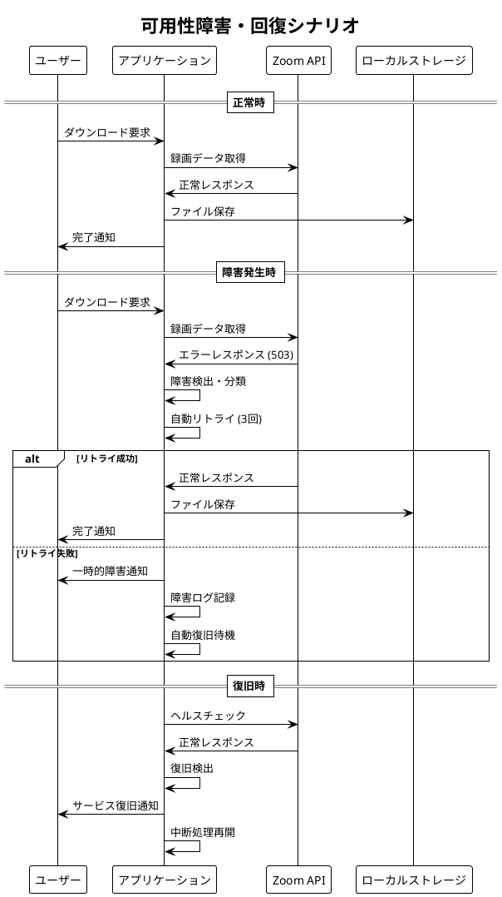
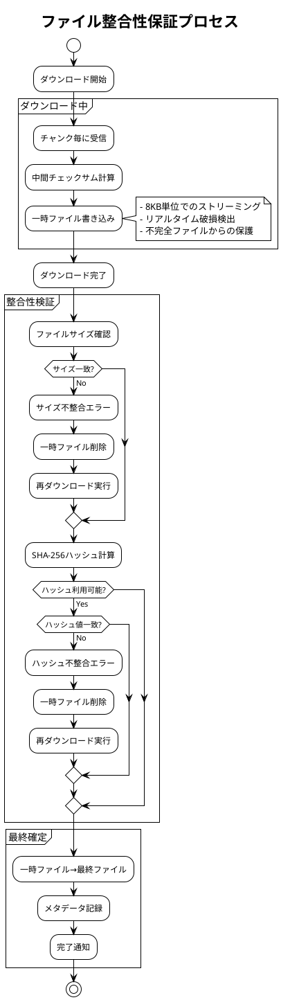
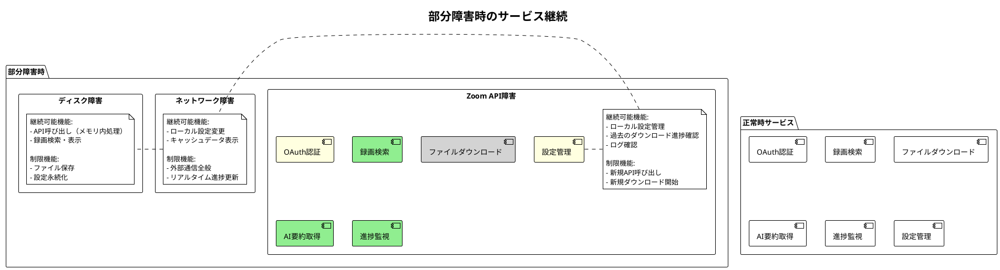
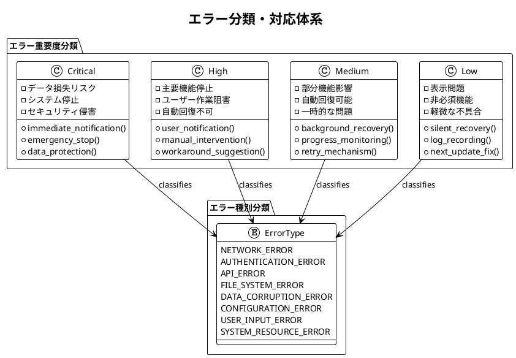
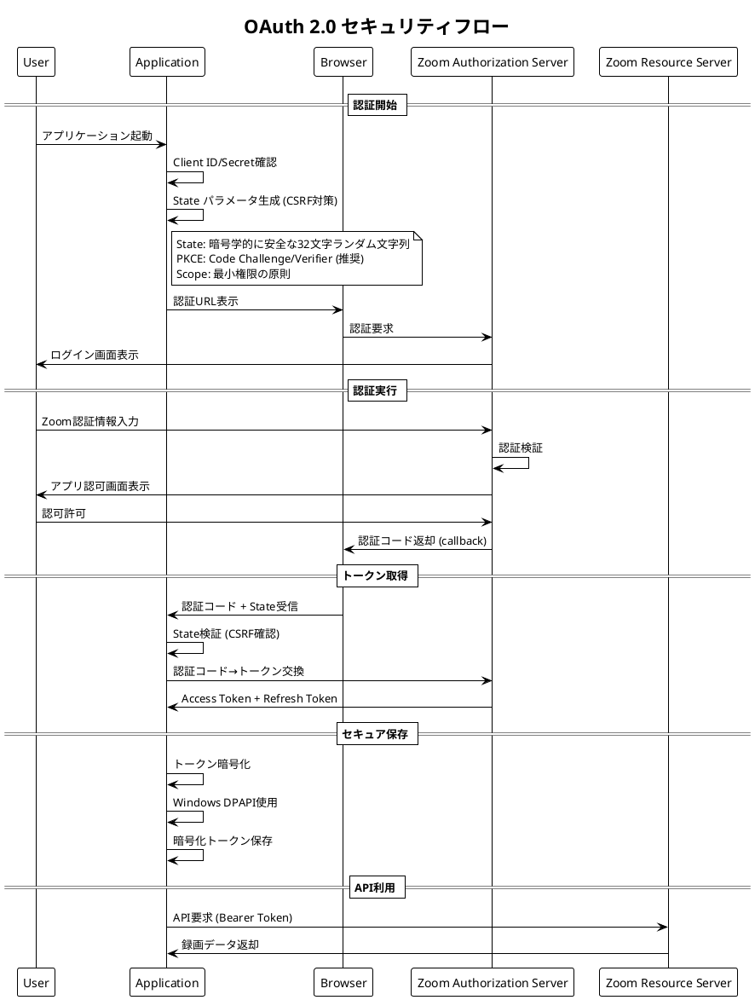
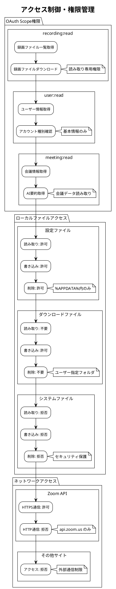
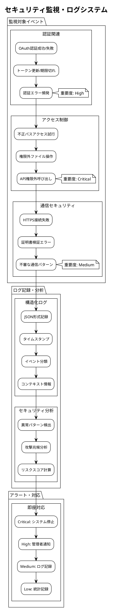
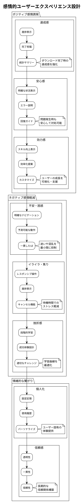

# Phase 5: 非機能要件

---
## パフォーマンス要件


## 文書概要
**プロジェクト名**: Zoom Video Mover  
**作成日**: 2025-08-02  
  
**バージョン**: 1.0  

## 性能要件カテゴリ

### 1. レスポンス時間要件

#### 1.1 ユーザーインターフェース応答性

| 操作 | 目標時間 | 最大許容時間 | 測定条件 |
|------|----------|-------------|----------|
| **アプリケーション起動** | 2秒以内 | 5秒以内 | SSD、8GB RAM、通常負荷 |
| **設定画面表示** | 0.5秒以内 | 1秒以内 | ローカル処理のみ |
| **タブ切り替え** | 0.2秒以内 | 0.5秒以内 | UI状態変更のみ |
| **検索条件入力反応** | 0.1秒以内 | 0.3秒以内 | リアルタイム入力検証 |
| **ファイル選択反応** | 0.1秒以内 | 0.5秒以内 | チェックボックス操作 |

#### 1.2 外部API通信時間

| API種別 | 目標時間 | 最大許容時間 | タイムアウト設定 |
|---------|----------|-------------|------------------|
| **OAuth認証** | 3秒以内 | 10秒以内 | 30秒 |
| **録画一覧取得** | 5秒以内 | 15秒以内 | 30秒 |
| **ファイルダウンロード開始** | 2秒以内 | 8秒以内 | 30秒 |
| **AI要約取得** | 8秒以内 | 20秒以内 | 60秒 |

#### 1.3 ファイル処理時間

| 処理種別 | 目標性能 | 最小要件 | 測定基準 |
|----------|----------|----------|----------|
| **ファイル名サニタイズ** | 1ms以内 | 5ms以内 | 250文字ファイル名 |
| **重複チェック** | 10ms以内 | 50ms以内 | 1000ファイル検索 |
| **フォルダ作成** | 5ms以内 | 20ms以内 | 階層フォルダ作成 |
| **ファイル整合性検証** | 100ms以内 | 500ms以内 | 100MBファイル |

### 2. スループット要件

#### 2.1 同時処理能力

```plantuml
@startuml
!theme plain
title 同時処理性能要件

usecase "並列ダウンロード" as download
usecase "API同時呼び出し" as api
usecase "UI同時操作" as ui

rectangle "性能目標" {
  download : 5ファイル同時
  download : 総帯域50Mbps
  
  api : 10req/sec上限遵守
  api : バースト20req可能
  
  ui : 500ms更新間隔
  ui : 60FPS描画維持
}

rectangle "制約条件" {
  note as n1
    - メモリ使用量: 512MB以下
    - CPU使用率: 80%以下（持続）
    - ネットワーク: 利用可能帯域の80%以下
  end note
}

@enduml
```

#### 2.2 データ転送性能

| 転送種別 | 目標性能 | 最小要件 | 条件 |
|----------|----------|----------|------|
| **小ファイル（<10MB）** | 5MB/s | 1MB/s | チャット、トランスクリプト |
| **中ファイル（10-500MB）** | 15MB/s | 8MB/s | 音声ファイル |
| **大ファイル（>500MB）** | 25MB/s | 12MB/s | 動画ファイル |
| **並列転送合計** | 50MB/s | 30MB/s | 5ファイル同時 |

#### 2.3 メモリ使用効率

| 処理段階 | 目標使用量 | 最大許容量 | 最適化方針 |
|----------|-----------|------------|------------|
| **アイドル状態** | 64MB | 128MB | 基本UI + 設定データ |
| **録画検索中** | 128MB | 256MB | API レスポンスキャッシュ |
| **ダウンロード中** | 256MB | 512MB | ストリーミングバッファ |
| **進捗監視中** | +32MB | +64MB | 統計データ + UI更新 |

### 3. 拡張性要件

#### 3.1 データ量拡張性

```plantuml
@startuml
!theme plain
title データ量拡張性要件

rectangle "基本要件" {
  :会議数: 1,000件;
  :録画ファイル数: 5,000ファイル;
  :総データ量: 100GB;
  :検索結果表示: 100件/ページ;
}

rectangle "拡張要件" {
  :会議数: 10,000件;
  :録画ファイル数: 50,000ファイル;
  :総データ量: 1TB;
  :検索結果表示: 1,000件/ページ;
}

rectangle "性能維持条件" {
  note as perf
    基本要件での性能を
    拡張要件でも80%以上維持
    
    - 検索レスポンス: 8秒以内
    - UI応答性: 1秒以内
    - メモリ効率: 線形増加以下
  end note
}

@enduml
```

#### 3.2 同時ユーザー対応

| ユーザー数 | 同時ダウンロード | API制限対応 | リソース分散 |
|------------|------------------|-------------|-------------|
| **1ユーザー** | 5並列 | 10req/sec | 基本性能 |
| **5ユーザー** | 各3並列 | 8req/sec/user | 優先度制御 |
| **10ユーザー** | 各2並列 | 5req/sec/user | 負荷分散 |

### 4. 効率性要件

#### 4.1 リソース効率性

```rust
/// 性能監視とリソース効率性の測定
/// 
/// # 事前条件
/// - システムが正常に稼働中
/// 
/// # 事後条件
/// - 測定データが性能要件内に収まる
/// 
/// # 不変条件
/// - 監視中にシステム性能が劣化しない
#[derive(Debug, Clone)]
pub struct PerformanceMetrics {
    pub cpu_usage_percent: f32,          // 目標: 平均50%以下、ピーク80%以下
    pub memory_usage_mb: u64,            // 目標: 512MB以下
    pub network_usage_mbps: f32,         // 目標: 利用可能帯域の80%以下
    pub disk_io_mb_per_sec: f32,         // 目標: 100MB/s以下
    pub active_connections: u32,         // 目標: 10接続以下
    pub response_time_ms: u64,           // 目標: 平均500ms以下
}

impl PerformanceMetrics {
    /// 性能要件適合性チェック
    /// 
    /// # 事前条件
    /// - メトリクスデータが有効
    /// 
    /// # 事後条件
    /// - 各要件の適合状況が返される
    pub fn check_requirements(&self) -> PerformanceComplianceReport {
        let cpu_compliant = self.cpu_usage_percent <= 80.0;
        let memory_compliant = self.memory_usage_mb <= 512;
        let network_compliant = self.network_usage_mbps <= 50.0; // 想定50Mbps帯域
        let response_compliant = self.response_time_ms <= 500;
        
        PerformanceComplianceReport {
            overall_compliant: cpu_compliant && memory_compliant && 
                              network_compliant && response_compliant,
            cpu_status: if cpu_compliant { ComplianceStatus::Pass } else { ComplianceStatus::Fail },
            memory_status: if memory_compliant { ComplianceStatus::Pass } else { ComplianceStatus::Fail },
            network_status: if network_compliant { ComplianceStatus::Pass } else { ComplianceStatus::Fail },
            response_status: if response_compliant { ComplianceStatus::Pass } else { ComplianceStatus::Fail },
            timestamp: chrono::Utc::now(),
        }
    }
}
```

#### 4.2 ネットワーク効率性

| 効率化手法 | 目標改善率 | 実装方針 | 測定方法 |
|------------|------------|----------|----------|
| **並列ダウンロード** | 300%向上 | 5並列実行 | 総完了時間比較 |
| **レジューム機能** | 90%無駄削減 | 中断点記憶 | 再ダウンロード量測定 |
| **圧縮対応** | 20%帯域削減 | gzip/deflate | 転送量比較 |
| **ローカルキャッシュ** | 50%API削減 | 一時保存 | API呼び出し回数 |

### 5. 容量・制限要件

#### 5.1 ストレージ要件



#### 5.2 メモリ制限

| メモリ種別 | 基本要件 | 推奨要件 | 最大要件 |
|------------|----------|----------|----------|
| **システムRAM** | 4GB | 8GB | 16GB |
| **アプリ使用RAM** | 256MB | 512MB | 1GB |
| **GPU メモリ** | 不要 | 不要 | 不要 |
| **仮想メモリ** | 2GB | 4GB | 8GB |

#### 5.3 プロセッサ要件

| プロセッサ種別 | 最小要件 | 推奨要件 | 最適要件 |
|----------------|----------|----------|----------|
| **CPU コア数** | 2コア | 4コア | 8コア |
| **CPU 周波数** | 2.0GHz | 2.5GHz | 3.0GHz+ |
| **アーキテクチャ** | x64 | x64 | x64 |
| **命令セット** | SSE2 | AVX | AVX2 |

### 6. 性能測定・監視要件

#### 6.1 リアルタイム監視

```rust
/// リアルタイム性能監視システム
/// 
/// # 副作用
/// - システムメトリクスの収集
/// - ログファイルへの記録
/// - UIへの性能情報表示
/// 
/// # 事前条件
/// - 監視対象システムが稼働中
/// 
/// # 事後条件
/// - 性能データが正確に収集される
/// - 閾値超過時にアラートが発生する
pub struct RealTimePerformanceMonitor {
    metrics_collector: Arc<MetricsCollector>,
    alert_manager: Arc<AlertManager>,
    ui_reporter: Arc<UIReporter>,
}

impl RealTimePerformanceMonitor {
    /// 監視開始
    pub async fn start_monitoring(&self) -> Result<(), MonitoringError> {
        let mut interval = tokio::time::interval(Duration::from_millis(500));
        
        loop {
            interval.tick().await;
            
            // システムメトリクス収集
            let metrics = self.metrics_collector.collect_current_metrics().await?;
            
            // 要件適合性チェック
            let compliance_report = metrics.check_requirements();
            
            // 閾値チェック・アラート
            if !compliance_report.overall_compliant {
                self.alert_manager.trigger_performance_alert(&compliance_report).await?;
            }
            
            // UI更新
            self.ui_reporter.update_performance_display(&metrics).await?;
            
            // ログ記録
            log::info!("Performance metrics: {:?}", metrics);
        }
    }
}
```

#### 6.2 性能ベンチマーク

| ベンチマーク種別 | 実行頻度 | 測定項目 | 合格基準 |
|------------------|----------|----------|----------|
| **起動時間測定** | 毎回起動時 | アプリ起動→UI表示 | 5秒以内 |
| **API応答測定** | API呼び出し毎 | 要求→レスポンス | 15秒以内 |
| **ダウンロード速度** | ファイル毎 | 開始→完了 | 12MB/s以上 |
| **メモリリーク検出** | 1時間毎 | 使用量推移 | 増加率<1%/hour |

#### 6.3 パフォーマンステスト計画

```plantuml
@startuml
!theme plain
title パフォーマンステスト実行計画

package "負荷テスト" {
  usecase "通常負荷テスト" as normal
  usecase "高負荷テスト" as high  
  usecase "ストレステスト" as stress
  
  normal : 5ファイル同時DL
  normal : 30分継続実行
  
  high : 10ファイル同時DL
  high : 1時間継続実行
  
  stress : システム限界まで
  stress : 異常検出確認
}

package "信頼性テスト" {
  usecase "長時間実行テスト" as endurance
  usecase "メモリリークテスト" as memory
  usecase "リソース回復テスト" as recovery
  
  endurance : 24時間連続稼働
  memory : 使用量監視
  recovery : 異常→正常復帰
}

package "互換性テスト" {
  usecase "OS互換性" as os_compat
  usecase "ハードウェア互換性" as hw_compat
  
  os_compat : Windows 10/11
  hw_compat : 低スペック～高スペック
}

@enduml
```

### 7. 性能劣化対策

#### 7.1 予防措置

| 劣化要因 | 予防策 | 監視指標 | 対処手順 |
|----------|--------|----------|----------|
| **メモリリーク** | RAII パターン | メモリ使用量推移 | プロセス再起動 |
| **ファイルハンドルリーク** | 自動クローズ | 開放ハンドル数 | 強制クローズ |
| **ネットワーク輻輳** | レート制限 | 応答時間増加 | 接続数制限 |
| **ディスクI/O過負荷** | 非同期処理 | I/O待機時間 | キューイング制御 |

#### 7.2 性能最適化手法

```rust
/// 性能最適化実装例
/// 
/// # 事前条件
/// - 最適化対象処理が特定されている
/// 
/// # 事後条件
/// - 処理時間が目標値以内に改善される
/// 
/// # 不変条件
/// - 最適化により機能が損なわれない
pub struct PerformanceOptimizer {
    cache: Arc<LruCache<String, CachedData>>,
    connection_pool: Arc<ConnectionPool>,
    thread_pool: Arc<ThreadPool>,
}

impl PerformanceOptimizer {
    /// ファイルダウンロード最適化
    pub async fn optimize_download(&self, files: Vec<RecordingFile>) -> Result<(), OptimizationError> {
        // 1. ファイルサイズでソート（大きいファイルを先に開始）
        let mut sorted_files = files;
        sorted_files.sort_by(|a, b| b.file_size_bytes.cmp(&a.file_size_bytes));
        
        // 2. 接続プール使用で接続オーバーヘッド削減
        let connections = self.connection_pool.acquire_multiple(5).await?;
        
        // 3. 並列処理で全体時間短縮
        let semaphore = Arc::new(Semaphore::new(5));
        let tasks: Vec<_> = sorted_files.into_iter().map(|file| {
            let sem = semaphore.clone();
            let conn = connections[0].clone(); // 適切な接続を選択
            
            async move {
                let _permit = sem.acquire().await.unwrap();
                self.download_with_optimization(file, conn).await
            }
        }).collect();
        
        // 4. 全タスク完了待機
        futures::future::try_join_all(tasks).await?;
        
        Ok(())
    }
    
    /// キャッシュ活用による API 呼び出し最適化
    pub async fn optimize_api_calls(&self, request: &ApiRequest) -> Result<ApiResponse, OptimizationError> {
        let cache_key = request.generate_cache_key();
        
        // キャッシュヒット確認
        if let Some(cached_response) = self.cache.get(&cache_key).await {
            if !cached_response.is_expired() {
                return Ok(cached_response.data);
            }
        }
        
        // API呼び出し実行
        let response = self.execute_api_request(request).await?;
        
        // キャッシュ更新
        self.cache.insert(cache_key, CachedData::new(response.clone(), Duration::from_secs(300))).await;
        
        Ok(response)
    }
}
```

---

**承認**:  
**品質基準適合**: [ ] 確認済  
**ポリシー準拠**: [ ] 確認済  
**承認日**: ___________
---
## 信頼性要件


## 文書概要
**プロジェクト名**: Zoom Video Mover  
**作成日**: 2025-08-02  
  
**バージョン**: 1.0  

## 信頼性要件カテゴリ

### 1. 可用性要件（Availability）

#### 1.1 システム稼働率

| 稼働率指標 | 目標値 | 測定期間 | 停止許容時間 |
|------------|--------|----------|-------------|
| **月間稼働率** | 99.5% | 1ヶ月 | 3.6時間/月 |
| **週間稼働率** | 99.0% | 1週間 | 1.7時間/週 |
| **日次稼働率** | 95.0% | 1日 | 1.2時間/日 |

#### 1.2 可用性シナリオ



#### 1.3 障害分類と対応

| 障害種別 | 発生確率 | 影響度 | 自動回復時間 | 手動対応時間 |
|----------|----------|--------|-------------|-------------|
| **ネットワーク一時障害** | 週1回 | 中 | 30秒以内 | - |
| **API サーバー障害** | 月1回 | 高 | 5分以内 | 30分以内 |
| **認証トークン期限切れ** | 日1回 | 低 | 即座 | - |
| **ローカルディスク障害** | 年1回 | 高 | - | 2時間以内 |
| **アプリケーション異常終了** | 月2回 | 中 | 10秒以内 | - |

### 2. 信頼性要件（Reliability）

#### 2.1 故障率指標

```plantuml
@startuml
!theme plain
title 信頼性指標と故障パターン

rectangle "故障率目標" {
  :MTBF (平均故障間隔): 168時間 (7日);
  :MTTR (平均修復時間): 5分以内;
  :故障率: 0.006 failures/hour;
  note right: 週1回以下の重大障害
}

rectangle "故障パターン分析" {
  pie title 想定故障要因分布
  "外部API障害" : 40
  "ネットワーク問題" : 25
  "ローカル環境問題" : 20
  "アプリケーション不具合" : 10
  "ユーザー操作エラー" : 5
}

rectangle "回復性目標" {
  :自動回復率: 80%;
  :データ損失ゼロ: 100%;
  :部分機能継続: 90%;
  note right
    重大障害時も基本機能は継続
    ダウンロード中データは保護
  end note
}

@enduml
```

#### 2.2 信頼性設計パターン

```rust
/// 信頼性を向上させる設計パターン実装
/// 
/// # 副作用
/// - 障害状況のログ記録
/// - 自動回復処理の実行
/// - ユーザーへの状況通知
/// 
/// # 事前条件
/// - システムが初期化済み
/// - 監視機能が稼働中
/// 
/// # 事後条件
/// - 障害が検出・分類される
/// - 適切な回復処理が実行される
/// 
/// # 不変条件
/// - ユーザーデータの整合性が保たれる
pub struct ReliabilityManager {
    circuit_breaker: Arc<CircuitBreaker>,
    retry_policy: Arc<RetryPolicy>,
    health_monitor: Arc<HealthMonitor>,
    data_validator: Arc<DataValidator>,
}

impl ReliabilityManager {
    /// Circuit Breaker パターン実装
    /// API呼び出しの信頼性向上
    pub async fn api_call_with_circuit_breaker<T>(
        &self,
        api_function: impl Fn() -> Future<Output = Result<T, ApiError>>
    ) -> Result<T, ReliabilityError> {
        match self.circuit_breaker.state() {
            CircuitState::Closed => {
                // 正常状態：API呼び出し実行
                match api_function().await {
                    Ok(result) => {
                        self.circuit_breaker.record_success();
                        Ok(result)
                    },
                    Err(e) => {
                        self.circuit_breaker.record_failure();
                        Err(ReliabilityError::ApiFailure(e))
                    }
                }
            },
            CircuitState::Open => {
                // 障害状態：呼び出し拒否
                Err(ReliabilityError::CircuitOpen)
            },
            CircuitState::HalfOpen => {
                // テスト状態：限定的呼び出し
                match api_function().await {
                    Ok(result) => {
                        self.circuit_breaker.transition_to_closed();
                        Ok(result)
                    },
                    Err(e) => {
                        self.circuit_breaker.transition_to_open();
                        Err(ReliabilityError::ApiFailure(e))
                    }
                }
            }
        }
    }
    
    /// Retry パターン実装
    /// 一時的障害の自動回復
    pub async fn execute_with_retry<T>(
        &self,
        operation: impl Fn() -> Future<Output = Result<T, OperationError>>,
        operation_name: &str
    ) -> Result<T, ReliabilityError> {
        let mut attempt = 0;
        let max_attempts = self.retry_policy.max_attempts();
        
        loop {
            attempt += 1;
            
            match operation().await {
                Ok(result) => {
                    if attempt > 1 {
                        info!("Operation '{}' succeeded after {} attempts", operation_name, attempt);
                    }
                    return Ok(result);
                },
                Err(e) if attempt >= max_attempts => {
                    error!("Operation '{}' failed after {} attempts: {:?}", operation_name, attempt, e);
                    return Err(ReliabilityError::MaxRetriesExceeded(e));
                },
                Err(e) if self.retry_policy.is_retryable(&e) => {
                    let delay = self.retry_policy.calculate_delay(attempt);
                    warn!("Operation '{}' failed on attempt {}, retrying in {:?}: {:?}", 
                          operation_name, attempt, delay, e);
                    tokio::time::sleep(delay).await;
                },
                Err(e) => {
                    error!("Operation '{}' failed with non-retryable error: {:?}", operation_name, e);
                    return Err(ReliabilityError::NonRetryableError(e));
                }
            }
        }
    }
}

/// Circuit Breaker 実装
#[derive(Debug)]
pub struct CircuitBreaker {
    state: Arc<Mutex<CircuitState>>,
    failure_count: Arc<AtomicU32>,
    success_count: Arc<AtomicU32>,
    last_failure_time: Arc<Mutex<Option<Instant>>>,
    config: CircuitBreakerConfig,
}

#[derive(Debug, Clone)]
pub struct CircuitBreakerConfig {
    pub failure_threshold: u32,      // 故障閾値: 5回
    pub success_threshold: u32,      // 成功閾値: 3回
    pub timeout_duration: Duration,  // タイムアウト: 30秒
}

impl CircuitBreaker {
    pub fn record_failure(&self) {
        self.failure_count.fetch_add(1, Ordering::Relaxed);
        *self.last_failure_time.lock().unwrap() = Some(Instant::now());
        
        if self.failure_count.load(Ordering::Relaxed) >= self.config.failure_threshold {
            self.transition_to_open();
        }
    }
    
    pub fn record_success(&self) {
        self.success_count.fetch_add(1, Ordering::Relaxed);
        self.failure_count.store(0, Ordering::Relaxed);
    }
    
    fn transition_to_open(&self) {
        *self.state.lock().unwrap() = CircuitState::Open;
        warn!("Circuit breaker transitioned to OPEN state due to repeated failures");
    }
}
```

### 3. データ完全性要件

#### 3.1 データ保護レベル

| データ種別 | 保護レベル | 検証方法 | 回復方針 |
|------------|------------|----------|----------|
| **OAuth認証情報** | 最高 | 暗号化検証 | 再認証要求 |
| **ダウンロードファイル** | 高 | ハッシュ値照合 | 自動再ダウンロード |
| **設定データ** | 中 | 形式検証 | デフォルト値復元 |
| **ログデータ** | 低 | 基本形式チェック | 欠損許容 |

#### 3.2 ファイル整合性保証



#### 3.3 データ回復メカニズム

```rust
/// データ回復・検証システム
/// 
/// # 副作用
/// - 破損ファイルの検出・削除
/// - 自動再ダウンロードの実行
/// - データ回復ログの記録
/// 
/// # 事前条件
/// - 検証対象ファイルが存在する
/// 
/// # 事後条件
/// - ファイル整合性が確認される
/// - 破損ファイルが修復される
/// 
/// # 不変条件
/// - 正常ファイルは変更されない
pub struct DataRecoveryManager {
    hash_calculator: Arc<HashCalculator>,
    file_validator: Arc<FileValidator>,
    download_engine: Arc<DownloadEngine>,
}

impl DataRecoveryManager {
    /// ファイル整合性検証と自動修復
    pub async fn verify_and_recover_file(
        &self,
        file_path: &Path,
        expected_metadata: &FileMetadata
    ) -> Result<FileIntegrityStatus, RecoveryError> {
        // 1. 基本検証
        if !file_path.exists() {
            warn!("File not found: {:?}", file_path);
            return self.attempt_recovery(file_path, expected_metadata).await;
        }
        
        // 2. サイズ検証
        let actual_size = std::fs::metadata(file_path)?.len();
        if actual_size != expected_metadata.size {
            warn!("File size mismatch: expected {}, got {}", expected_metadata.size, actual_size);
            return self.attempt_recovery(file_path, expected_metadata).await;
        }
        
        // 3. ハッシュ検証（利用可能な場合）
        if let Some(expected_hash) = &expected_metadata.hash {
            let actual_hash = self.hash_calculator.calculate_sha256(file_path).await?;
            if &actual_hash != expected_hash {
                warn!("File hash mismatch: expected {}, got {}", expected_hash, actual_hash);
                return self.attempt_recovery(file_path, expected_metadata).await;
            }
        }
        
        // 4. ファイル形式検証
        if !self.file_validator.validate_format(file_path, &expected_metadata.file_type).await? {
            warn!("File format validation failed: {:?}", file_path);
            return self.attempt_recovery(file_path, expected_metadata).await;
        }
        
        Ok(FileIntegrityStatus::Valid)
    }
    
    /// 自動回復処理
    async fn attempt_recovery(
        &self,
        file_path: &Path,
        expected_metadata: &FileMetadata
    ) -> Result<FileIntegrityStatus, RecoveryError> {
        info!("Attempting to recover file: {:?}", file_path);
        
        // 破損ファイル削除
        if file_path.exists() {
            std::fs::remove_file(file_path)?;
        }
        
        // 再ダウンロード実行
        match self.download_engine.redownload_file(expected_metadata).await {
            Ok(_) => {
                info!("File recovery successful: {:?}", file_path);
                Ok(FileIntegrityStatus::Recovered)
            },
            Err(e) => {
                error!("File recovery failed: {:?}, error: {:?}", file_path, e);
                Ok(FileIntegrityStatus::Corrupted)
            }
        }
    }
    
    /// バックグラウンド整合性チェック
    pub async fn background_integrity_check(&self) -> Result<IntegrityReport, RecoveryError> {
        let mut report = IntegrityReport::new();
        
        // すべてのダウンロードファイルをスキャン
        let downloaded_files = self.discover_downloaded_files().await?;
        
        for file_info in downloaded_files {
            match self.verify_and_recover_file(&file_info.path, &file_info.metadata).await {
                Ok(FileIntegrityStatus::Valid) => {
                    report.valid_files += 1;
                },
                Ok(FileIntegrityStatus::Recovered) => {
                    report.recovered_files += 1;
                },
                Ok(FileIntegrityStatus::Corrupted) => {
                    report.corrupted_files += 1;
                    report.failed_files.push(file_info.path);
                },
                Err(e) => {
                    report.error_files += 1;
                    error!("Integrity check error for {:?}: {:?}", file_info.path, e);
                }
            }
        }
        
        Ok(report)
    }
}
```

### 4. 障害許容性要件

#### 4.1 グレースフル・デグラデーション

| 障害レベル | サービス継続範囲 | 機能制限 | 復旧目標 |
|------------|------------------|----------|----------|
| **軽微** | 全機能継続 | なし | 自動回復 |
| **中程度** | 基本機能継続 | 高度機能停止 | 5分以内 |
| **重大** | 最小機能継続 | 新規処理停止 | 30分以内 |
| **致命的** | 安全停止 | 全機能停止 | 手動回復 |

#### 4.2 部分障害対応



### 5. 回復性要件

#### 5.1 自動回復メカニズム

```rust
/// 自動回復システム
/// 
/// # 副作用
/// - 障害状況の監視・検出
/// - 自動回復処理の実行
/// - 回復状況のログ記録
/// 
/// # 事前条件
/// - 回復マネージャーが初期化済み
/// 
/// # 事後条件
/// - 回復可能な障害が自動修復される
/// - 回復不可能な障害が適切に通知される
/// 
/// # 不変条件
/// - システムの基本的な安全性が保たれる
pub struct AutoRecoveryManager {
    health_checker: Arc<HealthChecker>,
    recovery_strategies: HashMap<FailureType, Box<dyn RecoveryStrategy>>,
    notification_manager: Arc<NotificationManager>,
}

impl AutoRecoveryManager {
    /// 継続的ヘルスチェックと自動回復
    pub async fn start_auto_recovery_loop(&self) -> Result<(), RecoveryError> {
        let mut check_interval = tokio::time::interval(Duration::from_secs(30));
        
        loop {
            check_interval.tick().await;
            
            // システムヘルスチェック
            let health_status = self.health_checker.check_system_health().await?;
            
            // 障害検出・分類
            for failure in health_status.detected_failures {
                info!("Detected failure: {:?}", failure);
                
                if let Some(strategy) = self.recovery_strategies.get(&failure.failure_type) {
                    match strategy.attempt_recovery(&failure).await {
                        Ok(RecoveryResult::Success) => {
                            info!("Auto-recovery successful for: {:?}", failure.failure_type);
                            self.notification_manager.notify_recovery_success(&failure).await?;
                        },
                        Ok(RecoveryResult::PartialSuccess) => {
                            warn!("Partial recovery for: {:?}", failure.failure_type);
                            self.notification_manager.notify_partial_recovery(&failure).await?;
                        },
                        Ok(RecoveryResult::Failed) => {
                            error!("Auto-recovery failed for: {:?}", failure.failure_type);
                            self.notification_manager.notify_recovery_failure(&failure).await?;
                        },
                        Err(e) => {
                            error!("Recovery strategy error: {:?}", e);
                        }
                    }
                }
            }
        }
    }
}

/// 各種回復戦略の実装
#[async_trait]
pub trait RecoveryStrategy: Send + Sync {
    async fn attempt_recovery(&self, failure: &Failure) -> Result<RecoveryResult, RecoveryError>;
}

/// ネットワーク接続回復戦略
pub struct NetworkRecoveryStrategy {
    connection_tester: Arc<ConnectionTester>,
    dns_resolver: Arc<DnsResolver>,
}

#[async_trait]
impl RecoveryStrategy for NetworkRecoveryStrategy {
    async fn attempt_recovery(&self, failure: &Failure) -> Result<RecoveryResult, RecoveryError> {
        // 1. 基本接続テスト
        if !self.connection_tester.test_internet_connectivity().await? {
            return Ok(RecoveryResult::Failed);
        }
        
        // 2. DNS解決テスト
        if !self.dns_resolver.test_zoom_dns_resolution().await? {
            // DNS設定の問題の可能性
            return Ok(RecoveryResult::PartialSuccess);
        }
        
        // 3. Zoom API到達性テスト
        if self.connection_tester.test_zoom_api_connectivity().await? {
            return Ok(RecoveryResult::Success);
        }
        
        Ok(RecoveryResult::Failed)
    }
}

/// 認証トークン回復戦略
pub struct AuthTokenRecoveryStrategy {
    token_manager: Arc<TokenManager>,
    oauth_manager: Arc<OAuthManager>,
}

#[async_trait]
impl RecoveryStrategy for AuthTokenRecoveryStrategy {
    async fn attempt_recovery(&self, failure: &Failure) -> Result<RecoveryResult, RecoveryError> {
        // 1. リフレッシュトークンでの更新試行
        if let Some(refresh_token) = self.token_manager.get_refresh_token().await {
            match self.oauth_manager.refresh_access_token(&refresh_token).await {
                Ok(new_token) => {
                    self.token_manager.store_token(new_token).await?;
                    return Ok(RecoveryResult::Success);
                },
                Err(_) => {
                    // リフレッシュトークンも無効
                }
            }
        }
        
        // 2. 完全な再認証が必要
        Ok(RecoveryResult::Failed)
    }
}
```

#### 5.2 回復時間目標

| 障害種別 | 検出時間 | 回復開始時間 | 完全回復時間 | 代替手段提供時間 |
|----------|----------|-------------|-------------|------------------|
| **API認証エラー** | 即座 | 即座 | 30秒以内 | - |
| **ネットワーク断** | 10秒以内 | 10秒以内 | 60秒以内 | 即座 |
| **ファイル破損** | 即座 | 即座 | 5分以内 | - |
| **サーバー障害** | 30秒以内 | 30秒以内 | 外部依存 | 1分以内 |

### 6. エラー処理要件

#### 6.1 エラー分類体系



#### 6.2 エラー対応マトリックス

| エラー種別 | 重要度 | 自動対応 | ユーザー通知 | ログレベル | 回復方法 |
|------------|--------|----------|-------------|------------|----------|
| **データ破損** | Critical | 即座停止 | 緊急警告 | ERROR | 手動確認必須 |
| **認証失敗** | High | 再認証誘導 | 明確な指示 | WARN | 再認証実行 |
| **API制限** | Medium | 自動待機 | 進捗表示 | INFO | レート制限遵守 |
| **ネットワーク遅延** | Low | 自動リトライ | なし | DEBUG | バックグラウンド処理 |

### 7. 障害監視・通知要件

#### 7.1 監視システム

```rust
/// 包括的システム監視
/// 
/// # 副作用
/// - システム状態の継続監視
/// - 障害の早期検出・通知
/// - 監視データのログ記録
/// 
/// # 事前条件
/// - 監視対象システムが稼働中
/// 
/// # 事後条件
/// - 異常状態が迅速に検出される
/// - 適切な関係者に通知される
/// 
/// # 不変条件
/// - 監視処理自体がシステムに負荷を与えない
pub struct SystemMonitor {
    health_metrics: Arc<HealthMetrics>,
    alert_dispatcher: Arc<AlertDispatcher>,
    monitoring_config: MonitoringConfig,
}

impl SystemMonitor {
    /// 包括的システム監視開始
    pub async fn start_comprehensive_monitoring(&self) -> Result<(), MonitoringError> {
        tokio::spawn({
            let health_metrics = self.health_metrics.clone();
            let alert_dispatcher = self.alert_dispatcher.clone();
            let config = self.monitoring_config.clone();
            
            async move {
                let mut interval = tokio::time::interval(config.check_interval);
                
                loop {
                    interval.tick().await;
                    
                    // 1. ヘルスメトリクス収集
                    let current_health = health_metrics.collect_current_state().await;
                    
                    // 2. 閾値チェック
                    let violations = config.check_threshold_violations(&current_health);
                    
                    // 3. 異常検出時の通知
                    for violation in violations {
                        match violation.severity {
                            Severity::Critical => {
                                alert_dispatcher.send_immediate_alert(&violation).await;
                                error!("CRITICAL: {}", violation.description);
                            },
                            Severity::High => {
                                alert_dispatcher.send_high_priority_alert(&violation).await;
                                warn!("HIGH: {}", violation.description);
                            },
                            Severity::Medium => {
                                alert_dispatcher.send_standard_alert(&violation).await;
                                info!("MEDIUM: {}", violation.description);
                            },
                            Severity::Low => {
                                debug!("LOW: {}", violation.description);
                            }
                        }
                    }
                    
                    // 4. 定期ヘルスレポート
                    if current_health.overall_status == HealthStatus::Healthy {
                        debug!("System health check: All systems operational");
                    }
                }
            }
        });
        
        Ok(())
    }
}

/// ヘルスメトリクス定義
#[derive(Debug, Clone)]
pub struct HealthMetrics {
    pub system_uptime: Duration,
    pub memory_usage_mb: u64,
    pub cpu_usage_percent: f32,
    pub network_connectivity: bool,
    pub api_response_time_ms: u64,
    pub active_downloads: u32,
    pub error_rate_per_hour: f32,
    pub disk_space_available_gb: u64,
    pub last_successful_api_call: Option<Instant>,
}

impl HealthMetrics {
    /// システム状態の総合評価
    pub fn evaluate_overall_health(&self) -> HealthStatus {
        let mut health_score = 100.0;
        
        // メモリ使用量チェック (512MB上限)
        if self.memory_usage_mb > 512 {
            health_score -= 20.0;
        }
        
        // CPU使用率チェック (80%上限)
        if self.cpu_usage_percent > 80.0 {
            health_score -= 15.0;
        }
        
        // API応答時間チェック (15秒上限)
        if self.api_response_time_ms > 15000 {
            health_score -= 25.0;
        }
        
        // エラー率チェック (10%上限)
        if self.error_rate_per_hour > 10.0 {
            health_score -= 30.0;
        }
        
        // ネットワーク接続性チェック
        if !self.network_connectivity {
            health_score -= 40.0;
        }
        
        match health_score {
            score if score >= 90.0 => HealthStatus::Excellent,
            score if score >= 75.0 => HealthStatus::Good,
            score if score >= 50.0 => HealthStatus::Fair,
            score if score >= 25.0 => HealthStatus::Poor,
            _ => HealthStatus::Critical,
        }
    }
}
```

---

**承認**:  
**品質基準適合**: [ ] 確認済  
**ポリシー準拠**: [ ] 確認済  
**承認日**: ___________
---
## セキュリティ要件


## 文書概要
**プロジェクト名**: Zoom Video Mover  
**作成日**: 2025-08-02  
  
**バージョン**: 1.0  

## セキュリティ要件カテゴリ

### 1. 認証・認可要件

#### 1.1 OAuth 2.0 セキュリティ要件



#### 1.2 認証セキュリティ実装

```rust
/// OAuth 2.0 セキュリティ実装
/// 
/// # セキュリティ要件
/// - CSRF攻撃対策: State パラメータ検証
/// - トークン保護: AES-256-GCM暗号化
/// - 権限最小化: 必要最小限のScope指定
/// 
/// # 事前条件
/// - OAuth設定が適切に構成されている
/// - セキュリティライブラリが初期化済み
/// 
/// # 事後条件
/// - 認証トークンが安全に保存される
/// - CSRF攻撃が防止される
/// 
/// # 不変条件
/// - 機密情報がメモリ上で保護される
pub struct SecureOAuthManager {
    client_id: String,
    client_secret: SecureString,  // メモリ保護文字列
    encryption_manager: Arc<EncryptionManager>,
    state_validator: Arc<StateValidator>,
}

impl SecureOAuthManager {
    /// CSRF対策付き認証URL生成
    pub fn generate_secure_auth_url(&self) -> Result<(String, String), SecurityError> {
        // 1. 暗号学的に安全なState生成
        let state = self.state_validator.generate_secure_state()?;
        
        // 2. 最小権限Scope設定
        let scopes = vec![
            "recording:read",  // 録画ファイル読み取りのみ
            "user:read",       // ユーザー情報読み取りのみ
            "meeting:read"     // 会議情報読み取りのみ
        ];
        
        // 3. PKCE（Code Verifier/Challenge）生成
        let code_verifier = self.generate_code_verifier()?;
        let code_challenge = self.generate_code_challenge(&code_verifier)?;
        
        // 4. 認証URL構築
        let auth_url = format!(
            "https://zoom.us/oauth/authorize?response_type=code&client_id={}&redirect_uri={}&scope={}&state={}&code_challenge={}&code_challenge_method=S256",
            urlencoding::encode(&self.client_id),
            urlencoding::encode("http://localhost:8080/oauth/callback"),
            urlencoding::encode(&scopes.join(" ")),
            urlencoding::encode(&state),
            urlencoding::encode(&code_challenge)
        );
        
        // 5. State保存（検証用）
        self.state_validator.store_pending_state(&state, &code_verifier)?;
        
        Ok((auth_url, state))
    }
    
    /// セキュアトークン交換
    pub async fn exchange_code_securely(
        &self,
        auth_code: &str,
        received_state: &str
    ) -> Result<SecureTokenSet, SecurityError> {
        // 1. State検証（CSRF対策）
        let code_verifier = self.state_validator.validate_and_consume_state(received_state)?;
        
        // 2. 認証コード→トークン交換
        let token_request = TokenRequest {
            grant_type: "authorization_code".to_string(),
            code: auth_code.to_string(),
            redirect_uri: "http://localhost:8080/oauth/callback".to_string(),
            client_id: self.client_id.clone(),
            client_secret: self.client_secret.reveal(),
            code_verifier: Some(code_verifier),
        };
        
        let client = self.create_secure_http_client()?;
        let response = client
            .post("https://api.zoom.us/oauth/token")
            .form(&token_request)
            .send()
            .await?;
            
        if !response.status().is_success() {
            return Err(SecurityError::TokenExchangeFailed);
        }
        
        let token_response: TokenResponse = response.json().await?;
        
        // 3. トークン暗号化保存
        let secure_tokens = self.encrypt_and_store_tokens(token_response).await?;
        
        Ok(secure_tokens)
    }
    
    /// トークン暗号化保存
    async fn encrypt_and_store_tokens(
        &self,
        token_response: TokenResponse
    ) -> Result<SecureTokenSet, SecurityError> {
        // Windows DPAPI使用（ユーザーアカウント固有暗号化）
        let encrypted_access_token = self.encryption_manager
            .encrypt_with_dpapi(&token_response.access_token)?;
        let encrypted_refresh_token = self.encryption_manager
            .encrypt_with_dpapi(&token_response.refresh_token)?;
        
        let secure_tokens = SecureTokenSet {
            encrypted_access_token,
            encrypted_refresh_token,
            token_type: token_response.token_type,
            expires_at: chrono::Utc::now() + chrono::Duration::seconds(token_response.expires_in),
            scope: token_response.scope,
        };
        
        // セキュアファイル保存
        self.save_encrypted_tokens(&secure_tokens).await?;
        
        // メモリクリア
        drop(token_response);
        
        Ok(secure_tokens)
    }
}

/// メモリ保護文字列（機密情報用）
pub struct SecureString {
    inner: Vec<u8>,
}

impl SecureString {
    pub fn new(value: String) -> Self {
        let mut inner = value.into_bytes();
        // メモリページをロック（スワップアウト防止）
        unsafe {
            libc::mlock(inner.as_ptr() as *const libc::c_void, inner.len());
        }
        Self { inner }
    }
    
    pub fn reveal(&self) -> String {
        String::from_utf8_lossy(&self.inner).to_string()
    }
}

impl Drop for SecureString {
    fn drop(&mut self) {
        // メモリ内容をゼロクリア
        for byte in &mut self.inner {
            *byte = 0;
        }
        // メモリページロック解除
        unsafe {
            libc::munlock(self.inner.as_ptr() as *const libc::c_void, self.inner.len());
        }
    }
}
```

### 2. データ保護要件

#### 2.1 暗号化要件

| データ種別 | 暗号化方式 | 鍵管理 | 保存場所 |
|------------|------------|--------|----------|
| **OAuth Client Secret** | AES-256-GCM | Windows DPAPI | レジストリ |
| **Access Token** | AES-256-GCM | Windows DPAPI | 暗号化ファイル |
| **Refresh Token** | AES-256-GCM | Windows DPAPI | 暗号化ファイル |
| **設定ファイル** | 平文 | - | %APPDATA%フォルダ |
| **ログファイル** | 平文 | - | %APPDATA%\logs |
| **ダウンロードファイル** | 平文 | - | ユーザー指定フォルダ |

#### 2.2 データ暗号化実装

```rust
/// データ暗号化管理システム
/// 
/// # セキュリティ特性
/// - AES-256-GCM使用（認証付き暗号化）
/// - Windows DPAPI活用（プラットフォーム統合）
/// - メモリ安全性（機密データ保護）
/// 
/// # 事前条件
/// - Windows DPAPI が利用可能
/// - 適切なユーザー権限で実行
/// 
/// # 事後条件
/// - データが暗号化されて保存される
/// - 復号化が認証されたプロセスでのみ可能
/// 
/// # 不変条件
/// - 暗号化キーがメモリ上で保護される
pub struct EncryptionManager {
    dpapi_client: Arc<DpapiClient>,
}

impl EncryptionManager {
    /// Windows DPAPI使用暗号化
    pub fn encrypt_with_dpapi(&self, plaintext: &str) -> Result<Vec<u8>, EncryptionError> {
        // 1. UTF-8バイト変換
        let plaintext_bytes = plaintext.as_bytes();
        
        // 2. DPAPI暗号化実行
        let encrypted_data = self.dpapi_client.encrypt(
            plaintext_bytes,
            None,  // 追加エントロピー不使用
            CryptProtectFlags::LOCAL_MACHINE  // マシン固有暗号化
        )?;
        
        // 3. メタデータ付与
        let encrypted_with_metadata = EncryptedData {
            algorithm: "DPAPI".to_string(),
            version: 1,
            timestamp: chrono::Utc::now(),
            data: encrypted_data,
        };
        
        Ok(bincode::serialize(&encrypted_with_metadata)?)
    }
    
    /// Windows DPAPI使用復号化
    pub fn decrypt_with_dpapi(&self, encrypted_data: &[u8]) -> Result<String, EncryptionError> {
        // 1. メタデータ解析
        let encrypted_with_metadata: EncryptedData = bincode::deserialize(encrypted_data)?;
        
        // 2. アルゴリズム確認
        if encrypted_with_metadata.algorithm != "DPAPI" {
            return Err(EncryptionError::UnsupportedAlgorithm);
        }
        
        // 3. DPAPI復号化実行
        let decrypted_bytes = self.dpapi_client.decrypt(
            &encrypted_with_metadata.data,
            None
        )?;
        
        // 4. UTF-8文字列変換
        let decrypted_string = String::from_utf8(decrypted_bytes)
            .map_err(|_| EncryptionError::InvalidUtf8)?;
        
        Ok(decrypted_string)
    }
    
    /// 追加レイヤー暗号化（AES-256-GCM）
    pub fn encrypt_with_aes_gcm(
        &self,
        plaintext: &str,
        key: &[u8; 32]
    ) -> Result<Vec<u8>, EncryptionError> {
        use aes_gcm::{Aes256Gcm, Key, Nonce};
        use aes_gcm::aead::{Aead, NewAead};
        
        // 1. 暗号化器初期化
        let key = Key::from_slice(key);
        let cipher = Aes256Gcm::new(key);
        
        // 2. ランダムnonce生成
        let mut nonce_bytes = [0u8; 12];
        rand::RngCore::fill_bytes(&mut rand::thread_rng(), &mut nonce_bytes);
        let nonce = Nonce::from_slice(&nonce_bytes);
        
        // 3. 暗号化実行
        let ciphertext = cipher.encrypt(nonce, plaintext.as_bytes())
            .map_err(|_| EncryptionError::EncryptionFailed)?;
        
        // 4. nonce + ciphertext結合
        let mut result = Vec::new();
        result.extend_from_slice(&nonce_bytes);
        result.extend_from_slice(&ciphertext);
        
        Ok(result)
    }
}

/// Windows DPAPI クライアント
pub struct DpapiClient;

impl DpapiClient {
    pub fn encrypt(
        &self,
        data: &[u8],
        entropy: Option<&[u8]>,
        flags: CryptProtectFlags
    ) -> Result<Vec<u8>, DpapiError> {
        use windows::Win32::Security::Cryptography::{CryptProtectData, CRYPTOAPI_BLOB};
        
        let mut data_in = CRYPTOAPI_BLOB {
            cbData: data.len() as u32,
            pbData: data.as_ptr() as *mut u8,
        };
        
        let entropy_blob = entropy.map(|e| CRYPTOAPI_BLOB {
            cbData: e.len() as u32,
            pbData: e.as_ptr() as *mut u8,
        });
        
        let mut data_out = CRYPTOAPI_BLOB::default();
        
        unsafe {
            let result = CryptProtectData(
                &mut data_in,
                None,  // 説明文字列
                entropy_blob.as_ref().map(|e| e as *const _),
                None,  // 予約パラメータ
                None,  // プロンプト構造体
                flags.bits(),
                &mut data_out
            );
            
            if result.as_bool() {
                let encrypted_data = std::slice::from_raw_parts(
                    data_out.pbData,
                    data_out.cbData as usize
                ).to_vec();
                
                // メモリ解放
                windows::Win32::System::Memory::LocalFree(data_out.pbData as isize);
                
                Ok(encrypted_data)
            } else {
                Err(DpapiError::EncryptionFailed)
            }
        }
    }
}
```

### 3. 通信セキュリティ要件

#### 3.1 HTTPS通信強制

```rust
/// セキュアHTTP通信設定
/// 
/// # セキュリティ特性
/// - TLS 1.2以上強制
/// - 証明書検証強化
/// - HTTPS-onlyモード
/// 
/// # 事前条件
/// - ネットワーク接続が利用可能
/// 
/// # 事後条件
/// - 全通信がHTTPS経由で暗号化される
/// - 証明書が適切に検証される
/// 
/// # 不変条件
/// - 平文通信が発生しない
pub fn create_secure_http_client() -> Result<reqwest::Client, SecurityError> {
    use reqwest::ClientBuilder;
    use reqwest::tls::{Version, Certificate};
    
    let client = ClientBuilder::new()
        // TLS設定
        .min_tls_version(Version::TLS_1_2)  // TLS 1.2以上を強制
        .https_only(true)                   // HTTPS通信のみ許可
        
        // 証明書検証設定
        .tls_built_in_root_certs(true)      // システム証明書ストア使用
        .danger_accept_invalid_certs(false) // 無効証明書拒否
        .danger_accept_invalid_hostnames(false) // ホスト名不一致拒否
        
        // 接続設定
        .timeout(Duration::from_secs(30))         // 全体タイムアウト
        .connect_timeout(Duration::from_secs(10)) // 接続タイムアウト
        .tcp_keepalive(Duration::from_secs(60))   // キープアライブ
        
        // セキュリティヘッダー
        .default_headers({
            let mut headers = reqwest::header::HeaderMap::new();
            headers.insert(
                reqwest::header::USER_AGENT,
                reqwest::header::HeaderValue::from_static("ZoomVideoMover/1.0")
            );
            headers.insert(
                reqwest::header::HeaderName::from_static("x-app-version"),
                reqwest::header::HeaderValue::from_static("1.0.0")
            );
            headers
        })
        
        // プロキシ設定（企業環境対応）
        .proxy(reqwest::Proxy::system())  // システムプロキシ自動検出
        
        .build()?;
    
    Ok(client)
}

/// 証明書ピンニング実装（高度なセキュリティ）
pub struct CertificatePinner {
    pinned_certificates: Vec<Certificate>,
}

impl CertificatePinner {
    /// Zoom.us証明書ピンニング設定
    pub fn new_with_zoom_pins() -> Result<Self, SecurityError> {
        let zoom_cert_pem = include_str!("../certificates/zoom_us.pem");
        let pinned_cert = Certificate::from_pem(zoom_cert_pem.as_bytes())?;
        
        Ok(Self {
            pinned_certificates: vec![pinned_cert],
        })
    }
    
    /// ピンニング対応HTTPクライアント作成
    pub fn create_pinned_client(&self) -> Result<reqwest::Client, SecurityError> {
        let mut builder = ClientBuilder::new()
            .min_tls_version(Version::TLS_1_2)
            .https_only(true);
        
        // 証明書ピンニング設定
        for cert in &self.pinned_certificates {
            builder = builder.add_root_certificate(cert.clone());
        }
        
        Ok(builder.build()?)
    }
}
```

#### 3.2 API通信セキュリティ

| セキュリティ要素 | 実装方針 | 検証方法 |
|------------------|----------|----------|
| **認証ヘッダー** | Bearer Token形式 | トークン有効性確認 |
| **リクエスト署名** | OAuth 2.0標準 | サーバー側検証 |
| **レート制限遵守** | 10req/sec以下 | クライアント側制御 |
| **エラー情報制限** | 機密情報除外 | レスポンス解析 |

### 4. アクセス制御要件

#### 4.1 最小権限の原則



#### 4.2 ファイルシステムアクセス制御

```rust
/// ファイルシステムアクセス制御
/// 
/// # セキュリティ原則
/// - 最小権限の原則
/// - パストラバーサル攻撃防止
/// - 機密ディレクトリ保護
/// 
/// # 事前条件
/// - アクセス制御ポリシーが設定済み
/// 
/// # 事後条件
/// - 許可されたパスのみアクセス可能
/// - 不正アクセスが検出・阻止される
/// 
/// # 不変条件
/// - セキュリティポリシーが維持される
pub struct FileSystemAccessControl {
    allowed_directories: Vec<PathBuf>,
    blocked_directories: Vec<PathBuf>,
}

impl FileSystemAccessControl {
    /// 安全な設定でアクセス制御初期化
    pub fn new_secure_config() -> Result<Self, SecurityError> {
        let user_profile = env::var("USERPROFILE")
            .map_err(|_| SecurityError::EnvironmentVariableNotFound)?;
        let app_data = env::var("APPDATA")
            .map_err(|_| SecurityError::EnvironmentVariableNotFound)?;
        
        let allowed_directories = vec![
            PathBuf::from(format!("{}/ZoomVideoMover", app_data)),  // アプリ設定
            PathBuf::from(format!("{}/Downloads", user_profile)),   // デフォルトDL先
            // ユーザー指定フォルダは動的に追加
        ];
        
        let blocked_directories = vec![
            PathBuf::from("C:/Windows"),                 // システムディレクトリ
            PathBuf::from("C:/Program Files"),           // プログラムファイル
            PathBuf::from("C:/Program Files (x86)"),     // プログラムファイル(x86)
            PathBuf::from(format!("{}/AppData/Local/Microsoft", user_profile)), // システム設定
        ];
        
        Ok(Self {
            allowed_directories,
            blocked_directories,
        })
    }
    
    /// パスアクセス許可判定
    pub fn is_path_allowed(&self, target_path: &Path) -> Result<bool, SecurityError> {
        let canonical_path = target_path.canonicalize()
            .map_err(|_| SecurityError::PathCanonicalizationFailed)?;
        
        // 1. ブロックディレクトリチェック
        for blocked_dir in &self.blocked_directories {
            if canonical_path.starts_with(blocked_dir) {
                warn!("Blocked directory access attempt: {:?}", canonical_path);
                return Ok(false);
            }
        }
        
        // 2. 許可ディレクトリチェック
        for allowed_dir in &self.allowed_directories {
            if canonical_path.starts_with(allowed_dir) {
                return Ok(true);
            }
        }
        
        // 3. デフォルトは拒否
        warn!("Unauthorized path access attempt: {:?}", canonical_path);
        Ok(false)
    }
    
    /// 安全なファイル作成
    pub fn create_file_securely(
        &self,
        file_path: &Path,
        content: &[u8]
    ) -> Result<(), SecurityError> {
        // 1. パス許可確認
        if !self.is_path_allowed(file_path)? {
            return Err(SecurityError::UnauthorizedPath);
        }
        
        // 2. パストラバーサル攻撃チェック
        if file_path.to_string_lossy().contains("..") {
            return Err(SecurityError::PathTraversalAttempt);
        }
        
        // 3. 親ディレクトリ作成
        if let Some(parent) = file_path.parent() {
            std::fs::create_dir_all(parent)
                .map_err(|_| SecurityError::DirectoryCreationFailed)?;
        }
        
        // 4. 安全なファイル書き込み
        let mut file = std::fs::OpenOptions::new()
            .create(true)
            .write(true)
            .truncate(true)
            .open(file_path)
            .map_err(|_| SecurityError::FileCreationFailed)?;
        
        file.write_all(content)
            .map_err(|_| SecurityError::FileWriteFailed)?;
        
        // 5. ファイル権限設定（Windows）
        #[cfg(windows)]
        {
            self.set_secure_file_permissions(file_path)?;
        }
        
        Ok(())
    }
    
    /// Windowsファイル権限設定
    #[cfg(windows)]
    fn set_secure_file_permissions(&self, file_path: &Path) -> Result<(), SecurityError> {
        use std::os::windows::fs::OpenOptionsExt;
        use winapi::um::winnt::{FILE_ATTRIBUTE_NORMAL, GENERIC_READ, GENERIC_WRITE};
        
        // ファイル属性を通常ファイルに設定
        let metadata = std::fs::metadata(file_path)
            .map_err(|_| SecurityError::MetadataReadFailed)?;
        
        // 必要に応じてACL設定
        // 現在のユーザーのみアクセス可能に制限
        
        Ok(())
    }
}
```

### 5. プライバシー要件

#### 5.1 個人情報保護

| 情報種別 | 取得 | 保存 | 処理 | 削除 |
|----------|------|------|------|------|
| **Zoomユーザー情報** | 必要最小限 | 一時的 | ローカルのみ | 自動削除 |
| **会議タイトル** | 表示目的 | ローカル保存 | 表示・検索 | ユーザー制御 |
| **録画ファイル** | ダウンロード目的 | ローカル保存 | なし | ユーザー制御 |
| **AI要約内容** | 表示目的 | ローカル保存 | なし | ユーザー制御 |
| **アプリ使用ログ** | 不具合調査 | ローカル保存 | 統計のみ | 30日自動削除 |

#### 5.2 プライバシー実装

```rust
/// プライバシー保護機能
/// 
/// # プライバシー原則
/// - データ最小化
/// - 目的限定利用
/// - 保存期間制限
/// 
/// # 事前条件
/// - プライバシーポリシーが設定済み
/// 
/// # 事後条件
/// - 個人情報が適切に保護される
/// - 不要データが自動削除される
/// 
/// # 不変条件
/// - プライバシーポリシー遵守
pub struct PrivacyManager {
    data_retention_policy: DataRetentionPolicy,
    pii_detector: Arc<PiiDetector>,
}

impl PrivacyManager {
    /// 個人情報検出・マスキング
    pub fn detect_and_mask_pii(&self, text: &str) -> String {
        let mut masked_text = text.to_string();
        
        // メールアドレス検出・マスキング
        let email_regex = regex::Regex::new(r"\b[A-Za-z0-9._%+-]+@[A-Za-z0-9.-]+\.[A-Z|a-z]{2,}\b").unwrap();
        masked_text = email_regex.replace_all(&masked_text, "[EMAIL_MASKED]").to_string();
        
        // 電話番号検出・マスキング
        let phone_regex = regex::Regex::new(r"\b\d{3}-\d{4}-\d{4}\b").unwrap();
        masked_text = phone_regex.replace_all(&masked_text, "[PHONE_MASKED]").to_string();
        
        // 個人名検出・マスキング（基本パターン）
        let name_regex = regex::Regex::new(r"\b[A-Z][a-z]+ [A-Z][a-z]+\b").unwrap();
        masked_text = name_regex.replace_all(&masked_text, "[NAME_MASKED]").to_string();
        
        masked_text
    }
    
    /// データ保存期間管理
    pub async fn enforce_data_retention(&self) -> Result<RetentionReport, PrivacyError> {
        let mut report = RetentionReport::new();
        
        // 1. 期限切れログファイル削除
        let log_dir = self.get_log_directory()?;
        let expired_logs = self.find_expired_files(
            &log_dir,
            self.data_retention_policy.log_retention_days
        ).await?;
        
        for log_file in expired_logs {
            std::fs::remove_file(&log_file)?;
            report.deleted_log_files += 1;
        }
        
        // 2. 一時キャッシュファイル削除
        let cache_dir = self.get_cache_directory()?;
        let expired_cache = self.find_expired_files(
            &cache_dir,
            self.data_retention_policy.cache_retention_hours / 24
        ).await?;
        
        for cache_file in expired_cache {
            std::fs::remove_file(&cache_file)?;
            report.deleted_cache_files += 1;
        }
        
        // 3. 個人情報含有ファイルの特別処理
        self.process_pii_containing_files(&mut report).await?;
        
        Ok(report)
    }
    
    /// ユーザーデータ完全削除
    pub async fn complete_user_data_deletion(&self) -> Result<(), PrivacyError> {
        // 1. 認証トークン削除
        self.delete_authentication_tokens().await?;
        
        // 2. 設定ファイル削除
        self.delete_configuration_files().await?;
        
        // 3. ログファイル削除
        self.delete_all_log_files().await?;
        
        // 4. キャッシュファイル削除
        self.delete_all_cache_files().await?;
        
        // 5. レジストリエントリ削除（Windows）
        #[cfg(windows)]
        {
            self.delete_registry_entries().await?;
        }
        
        // 6. メモリクリア
        self.secure_memory_clear().await?;
        
        Ok(())
    }
}

/// データ保存期間ポリシー
#[derive(Debug, Clone)]
pub struct DataRetentionPolicy {
    pub log_retention_days: i64,      // ログファイル: 30日
    pub cache_retention_hours: i64,   // キャッシュ: 24時間
    pub token_retention_days: i64,    // トークン: 7日（リフレッシュ時）
    pub temp_file_retention_hours: i64, // 一時ファイル: 1時間
}

impl Default for DataRetentionPolicy {
    fn default() -> Self {
        Self {
            log_retention_days: 30,
            cache_retention_hours: 24,
            token_retention_days: 7,
            temp_file_retention_hours: 1,
        }
    }
}
```

### 6. セキュリティ監視・ログ要件

#### 6.1 セキュリティイベント監視



#### 6.2 セキュリティログ実装

```rust
/// セキュリティイベント監視・ログシステム
/// 
/// # 副作用
/// - セキュリティイベントのログ記録
/// - 異常検出時のアラート送信
/// - 統計データの収集
/// 
/// # 事前条件
/// - ログシステムが初期化済み
/// 
/// # 事後条件
/// - セキュリティイベントが適切に記録される
/// - 異常が検出・通知される
/// 
/// # 不変条件
/// - ログ自体がセキュリティリスクにならない
pub struct SecurityMonitor {
    event_logger: Arc<SecurityEventLogger>,
    anomaly_detector: Arc<AnomalyDetector>,
    alert_manager: Arc<SecurityAlertManager>,
}

impl SecurityMonitor {
    /// 認証イベント記録
    pub async fn log_authentication_event(
        &self,
        event_type: AuthEventType,
        user_context: Option<&UserContext>,
        result: AuthResult,
        additional_info: Option<&str>
    ) -> Result<(), SecurityError> {
        let security_event = SecurityEvent {
            event_id: uuid::Uuid::new_v4(),
            timestamp: chrono::Utc::now(),
            event_category: SecurityEventCategory::Authentication,
            event_type: SecurityEventType::Authentication(event_type),
            severity: match (&event_type, &result) {
                (AuthEventType::Login, AuthResult::Failed) => SecuritySeverity::High,
                (AuthEventType::TokenRefresh, AuthResult::Failed) => SecuritySeverity::Medium,
                _ => SecuritySeverity::Low,
            },
            source_component: "oauth_manager".to_string(),
            user_id: user_context.map(|ctx| ctx.user_id.clone()),
            session_id: user_context.map(|ctx| ctx.session_id.clone()),
            details: serde_json::json!({
                "event_type": format!("{:?}", event_type),
                "result": format!("{:?}", result),
                "additional_info": additional_info,
                "user_agent": "ZoomVideoMover/1.0",
            }),
            risk_score: self.calculate_risk_score(&event_type, &result),
        };
        
        // 1. ログ記録
        self.event_logger.log_security_event(&security_event).await?;
        
        // 2. 異常検出
        if let Some(anomaly) = self.anomaly_detector.detect_authentication_anomaly(&security_event).await? {
            self.handle_security_anomaly(anomaly).await?;
        }
        
        // 3. 高リスクイベントの即座処理
        if security_event.risk_score >= 80 {
            self.alert_manager.send_immediate_alert(&security_event).await?;
        }
        
        Ok(())
    }
    
    /// ファイルアクセス監視
    pub async fn monitor_file_access(
        &self,
        operation: FileOperation,
        target_path: &Path,
        result: OperationResult
    ) -> Result<(), SecurityError> {
        // パストラバーサル攻撃検出
        if target_path.to_string_lossy().contains("..") {
            let security_event = SecurityEvent {
                event_id: uuid::Uuid::new_v4(),
                timestamp: chrono::Utc::now(),
                event_category: SecurityEventCategory::AccessControl,
                event_type: SecurityEventType::PathTraversalAttempt,
                severity: SecuritySeverity::Critical,
                source_component: "file_system_access".to_string(),
                user_id: None,
                session_id: None,
                details: serde_json::json!({
                    "operation": format!("{:?}", operation),
                    "target_path": target_path.to_string_lossy(),
                    "result": format!("{:?}", result),
                }),
                risk_score: 95,
            };
            
            self.event_logger.log_security_event(&security_event).await?;
            self.alert_manager.send_immediate_alert(&security_event).await?;
            
            return Err(SecurityError::PathTraversalDetected);
        }
        
        // 通常のファイルアクセスログ
        let security_event = SecurityEvent {
            event_id: uuid::Uuid::new_v4(),
            timestamp: chrono::Utc::now(),
            event_category: SecurityEventCategory::FileSystem,
            event_type: SecurityEventType::FileAccess(operation),
            severity: SecuritySeverity::Low,
            source_component: "file_manager".to_string(),
            user_id: None,
            session_id: None,
            details: serde_json::json!({
                "operation": format!("{:?}", operation),
                "target_path": target_path.to_string_lossy(),
                "result": format!("{:?}", result),
            }),
            risk_score: 10,
        };
        
        self.event_logger.log_security_event(&security_event).await?;
        
        Ok(())
    }
    
    /// リスクスコア計算
    fn calculate_risk_score(&self, event_type: &AuthEventType, result: &AuthResult) -> u32 {
        match (event_type, result) {
            (AuthEventType::Login, AuthResult::Failed) => 70,
            (AuthEventType::TokenRefresh, AuthResult::Failed) => 50,
            (AuthEventType::Login, AuthResult::Success) => 10,
            (AuthEventType::TokenRefresh, AuthResult::Success) => 5,
            _ => 0,
        }
    }
}

/// セキュリティイベント構造
#[derive(Debug, Clone, Serialize)]
pub struct SecurityEvent {
    pub event_id: uuid::Uuid,
    pub timestamp: chrono::DateTime<chrono::Utc>,
    pub event_category: SecurityEventCategory,
    pub event_type: SecurityEventType,
    pub severity: SecuritySeverity,
    pub source_component: String,
    pub user_id: Option<String>,
    pub session_id: Option<String>,
    pub details: serde_json::Value,
    pub risk_score: u32,  // 0-100スケール
}

#[derive(Debug, Clone, Serialize)]
pub enum SecurityEventCategory {
    Authentication,
    AccessControl,
    FileSystem,
    Network,
    Encryption,
    Privacy,
}

#[derive(Debug, Clone, Serialize)]
pub enum SecuritySeverity {
    Critical,  // システム停止・即座対応
    High,      // 管理者通知・優先対応
    Medium,    // ログ記録・定期確認
    Low,       // 統計記録のみ
}
```

---

**承認**:  
**品質基準適合**: [ ] 確認済  
**ポリシー準拠**: [ ] 確認済  
**承認日**: ___________
---
## ユーザビリティ要件


## 文書概要
**プロジェクト名**: Zoom Video Mover  
**作成日**: 2025-08-02  
  
**バージョン**: 1.0  

## ユーザビリティ要件カテゴリ

### 1. 学習しやすさ要件（Learnability）

#### 1.1 初回利用者の学習曲線

| 学習段階 | 目標達成時間 | 成功率目標 | 測定方法 |
|----------|-------------|-----------|----------|
| **初期設定完了** | 5分以内 | 90% | タスク完了時間測定 |
| **初回ダウンロード** | 2分以内 | 85% | 操作手順計測 |
| **基本機能理解** | 10分以内 | 95% | 機能発見率測定 |
| **効率的利用** | 30分以内 | 80% | 操作最適化度 |

#### 1.2 学習支援機能

```plantuml
@startuml
!theme plain
title 学習支援システム設計

package "オンボーディング" {
  usecase "初回起動ウィザード" as wizard
  usecase "段階的機能紹介" as intro
  usecase "実践的チュートリアル" as tutorial
  
  wizard : 3分で基本設定完了
  intro : 1機能ずつ丁寧な説明
  tutorial : 実際のファイルでの練習
}

package "継続的学習支援" {
  usecase "コンテキストヘルプ" as contexthelp
  usecase "ツールチップ" as tooltips
  usecase "プログレッシブ開示" as progressive
  
  contexthelp : 状況に応じたヘルプ表示
  tooltips : UI要素の簡潔な説明
  progressive : 必要な機能のみ表示
}

package "エラー回復支援" {
  usecase "建設的エラーメッセージ" as errormsg
  usecase "修正手順ガイド" as errorguide
  usecase "自動回復提案" as autorecovery
  
  errormsg : 何が問題かを明確に説明
  errorguide : 具体的な解決手順
  autorecovery : 自動修正オプション提供
}

actor "初心者ユーザー" as novice
actor "経験者ユーザー" as expert

novice --> wizard
novice --> tutorial
novice --> errormsg

expert --> contexthelp
expert --> progressive
expert --> autorecovery

@enduml
```

#### 1.3 認知負荷軽減設計

```rust
/// 認知負荷軽減のための段階的情報表示
/// 
/// # ユーザビリティ原則
/// - 情報の段階的開示
/// - 認知負荷の分散
/// - 視覚的階層の明確化
/// 
/// # 事前条件
/// - ユーザーの経験レベルが判定済み
/// 
/// # 事後条件
/// - 適切な情報量が表示される
/// - ユーザーが圧倒されない
/// 
/// # 不変条件
/// - 重要な情報が隠されない
pub struct CognitiveLoadManager {
    user_experience_level: UserExperienceLevel,
    interface_complexity: InterfaceComplexity,
    progressive_disclosure: Arc<ProgressiveDisclosure>,
}

impl CognitiveLoadManager {
    /// 経験レベル別情報表示制御
    pub fn adjust_interface_complexity(
        &mut self,
        user_actions: &[UserAction],
        session_duration: Duration
    ) -> InterfaceAdjustment {
        // 1. ユーザー行動分析
        let proficiency_score = self.calculate_proficiency_score(user_actions, session_duration);
        
        // 2. 経験レベル更新
        self.user_experience_level = match proficiency_score {
            score if score >= 80 => UserExperienceLevel::Expert,
            score if score >= 60 => UserExperienceLevel::Intermediate,
            score if score >= 40 => UserExperienceLevel::Beginner,
            _ => UserExperienceLevel::Novice,
        };
        
        // 3. インターフェース複雑度調整
        let target_complexity = match self.user_experience_level {
            UserExperienceLevel::Novice => InterfaceComplexity::Minimal,
            UserExperienceLevel::Beginner => InterfaceComplexity::Basic,
            UserExperienceLevel::Intermediate => InterfaceComplexity::Standard,
            UserExperienceLevel::Expert => InterfaceComplexity::Advanced,
        };
        
        // 4. UI要素表示制御
        InterfaceAdjustment {
            show_advanced_options: matches!(self.user_experience_level, 
                UserExperienceLevel::Intermediate | UserExperienceLevel::Expert),
            show_tooltips: matches!(self.user_experience_level, 
                UserExperienceLevel::Novice | UserExperienceLevel::Beginner),
            show_shortcuts: matches!(self.user_experience_level, UserExperienceLevel::Expert),
            group_related_functions: matches!(self.user_experience_level, 
                UserExperienceLevel::Novice | UserExperienceLevel::Beginner),
            max_visible_options: match self.user_experience_level {
                UserExperienceLevel::Novice => 3,
                UserExperienceLevel::Beginner => 5,
                UserExperienceLevel::Intermediate => 8,
                UserExperienceLevel::Expert => 12,
            },
        }
    }
    
    /// ユーザー習熟度スコア計算
    fn calculate_proficiency_score(
        &self,
        user_actions: &[UserAction],
        session_duration: Duration
    ) -> u32 {
        let mut score = 0u32;
        
        // タスク完了効率
        let successful_tasks = user_actions.iter()
            .filter(|action| action.result == ActionResult::Success)
            .count();
        let task_efficiency = (successful_tasks as f64 / user_actions.len() as f64) * 30.0;
        score += task_efficiency as u32;
        
        // 操作速度
        let avg_action_time = session_duration.as_secs() as f64 / user_actions.len() as f64;
        let speed_score = if avg_action_time < 5.0 { 25 } else if avg_action_time < 10.0 { 15 } else { 5 };
        score += speed_score;
        
        // 機能発見率
        let unique_features_used = user_actions.iter()
            .map(|action| &action.feature_id)
            .collect::<std::collections::HashSet<_>>()
            .len();
        let feature_discovery_score = std::cmp::min(unique_features_used * 5, 25);
        score += feature_discovery_score as u32;
        
        // エラー回復能力
        let error_recovery_rate = user_actions.iter()
            .filter(|action| action.recovered_from_error)
            .count() as f64 / user_actions.len() as f64;
        score += (error_recovery_rate * 20.0) as u32;
        
        std::cmp::min(score, 100)
    }
}

/// プログレッシブ・ディスクロージャー実装
pub struct ProgressiveDisclosure {
    disclosure_rules: Vec<DisclosureRule>,
}

impl ProgressiveDisclosure {
    /// 段階的機能開示
    pub fn determine_visible_features(
        &self,
        user_context: &UserContext,
        current_task: &Task
    ) -> Vec<FeatureVisibility> {
        let mut visible_features = Vec::new();
        
        // 1. 基本機能（常に表示）
        visible_features.extend(self.get_core_features());
        
        // 2. タスク関連機能
        visible_features.extend(self.get_task_related_features(current_task));
        
        // 3. 経験レベル対応機能
        if user_context.experience_level >= UserExperienceLevel::Intermediate {
            visible_features.extend(self.get_intermediate_features());
        }
        
        if user_context.experience_level >= UserExperienceLevel::Expert {
            visible_features.extend(self.get_advanced_features());
        }
        
        // 4. 使用頻度による動的表示
        visible_features.extend(
            self.get_frequently_used_features(&user_context.usage_history)
        );
        
        visible_features
    }
    
    fn get_core_features(&self) -> Vec<FeatureVisibility> {
        vec![
            FeatureVisibility::new("search", true, 1),
            FeatureVisibility::new("download", true, 2),
            FeatureVisibility::new("settings", true, 3),
        ]
    }
}
```

### 2. 効率性要件（Efficiency）

#### 2.1 タスク完了効率

| タスク種別 | 初心者目標時間 | 熟練者目標時間 | 操作ステップ数 |
|------------|---------------|---------------|---------------|
| **OAuth設定** | 3分 | 1分 | 5ステップ以内 |
| **録画検索** | 30秒 | 10秒 | 3ステップ以内 |
| **ファイル選択** | 1分 | 20秒 | 2ステップ以内 |
| **ダウンロード開始** | 15秒 | 5秒 | 1ステップ |
| **設定変更** | 2分 | 30秒 | 4ステップ以内 |

#### 2.2 操作効率化機能

```plantuml
@startuml
!theme plain
title 操作効率化機能設計

package "一括操作" {
  usecase "全選択・全解除" as selectall
  usecase "フィルタ選択" as filterselect
  usecase "条件保存・再利用" as savefilter
  
  selectall : 1クリックで全操作
  filterselect : 条件に基づく自動選択
  savefilter : 頻用条件の保存
}

package "キーボードショートカット" {
  usecase "Ctrl+A: 全選択" as ctrla
  usecase "Ctrl+D: ダウンロード" as ctrld
  usecase "Ctrl+F: 検索" as ctrlf
  usecase "F5: 更新" as f5
  
  note right of ctrla
    標準的なショートカット
    学習コスト最小化
  end note
}

package "スマート機能" {
  usecase "自動フィルタ推薦" as autorecommend
  usecase "最近使用項目" as recent
  usecase "ワンクリック再実行" as oneclick
  
  autorecommend : 使用パターン学習
  recent : 履歴ベース提案
  oneclick : 前回操作の再実行
}

package "カスタマイゼーション" {
  usecase "デフォルト設定" as defaults
  usecase "お気に入り設定" as favorites
  usecase "ワークフロー保存" as workflow
  
  defaults : ユーザー環境に最適化
  favorites : 頻用設定の保存
  workflow : 操作手順の自動化
}

actor "効率重視ユーザー" as poweruser

poweruser --> selectall
poweruser --> ctrla
poweruser --> autorecommend
poweruser --> defaults

@enduml
```

#### 2.3 効率性測定・最適化

```rust
/// ユーザー操作効率性の測定・最適化
/// 
/// # 効率性指標
/// - タスク完了時間
/// - 操作ステップ数
/// - エラー発生率
/// - 学習曲線の傾き
/// 
/// # 事前条件
/// - ユーザー操作が追跡されている
/// 
/// # 事後条件
/// - 効率性が測定・分析される
/// - 改善提案が生成される
/// 
/// # 不変条件
/// - 測定がユーザー体験を阻害しない
pub struct EfficiencyAnalyzer {
    operation_tracker: Arc<OperationTracker>,
    efficiency_metrics: Arc<Mutex<EfficiencyMetrics>>,
    optimization_engine: Arc<OptimizationEngine>,
}

impl EfficiencyAnalyzer {
    /// タスク効率性分析
    pub async fn analyze_task_efficiency(
        &self,
        task_id: &str,
        user_operations: &[UserOperation]
    ) -> EfficiencyAnalysis {
        let start_time = user_operations.first().unwrap().timestamp;
        let end_time = user_operations.last().unwrap().timestamp;
        let total_duration = end_time - start_time;
        
        // 1. 基本効率性指標計算
        let step_count = user_operations.len();
        let error_count = user_operations.iter()
            .filter(|op| op.result == OperationResult::Error)
            .count();
        let backtrack_count = self.count_backtrack_operations(user_operations);
        
        // 2. 理想的な操作パスとの比較
        let optimal_path = self.optimization_engine.calculate_optimal_path(task_id);
        let efficiency_ratio = optimal_path.step_count as f64 / step_count as f64;
        
        // 3. 改善機会の特定
        let improvement_opportunities = self.identify_improvement_opportunities(
            user_operations,
            &optimal_path
        );
        
        EfficiencyAnalysis {
            task_id: task_id.to_string(),
            completion_time: total_duration,
            step_count,
            error_count,
            backtrack_count,
            efficiency_ratio,
            improvement_opportunities,
            efficiency_score: self.calculate_efficiency_score(
                efficiency_ratio,
                error_count,
                backtrack_count
            ),
        }
    }
    
    /// 改善提案生成
    pub fn generate_efficiency_improvements(
        &self,
        analysis: &EfficiencyAnalysis
    ) -> Vec<EfficiencyImprovement> {
        let mut improvements = Vec::new();
        
        // 1. ショートカット提案
        if analysis.step_count > 5 {
            improvements.push(EfficiencyImprovement {
                improvement_type: ImprovementType::Shortcut,
                description: "キーボードショートカットを使用して操作を短縮できます".to_string(),
                potential_time_saving: Duration::from_secs(10),
                implementation_difficulty: Difficulty::Easy,
            });
        }
        
        // 2. 一括操作提案
        if analysis.step_count > 3 && analysis.task_id.contains("select") {
            improvements.push(EfficiencyImprovement {
                improvement_type: ImprovementType::BatchOperation,
                description: "全選択機能を使用して複数項目を一度に操作できます".to_string(),
                potential_time_saving: Duration::from_secs(15),
                implementation_difficulty: Difficulty::Easy,
            });
        }
        
        // 3. 設定最適化提案
        if analysis.error_count > 0 {
            improvements.push(EfficiencyImprovement {
                improvement_type: ImprovementType::Configuration,
                description: "デフォルト設定を調整してエラーを予防できます".to_string(),
                potential_time_saving: Duration::from_secs(30),
                implementation_difficulty: Difficulty::Medium,
            });
        }
        
        // 4. ワークフロー自動化提案
        if analysis.efficiency_ratio < 0.5 {
            improvements.push(EfficiencyImprovement {
                improvement_type: ImprovementType::Automation,
                description: "このタスクをワークフローとして保存して自動化できます".to_string(),
                potential_time_saving: Duration::from_secs(60),
                implementation_difficulty: Difficulty::Hard,
            });
        }
        
        improvements
    }
    
    /// バックトラック操作カウント
    fn count_backtrack_operations(&self, operations: &[UserOperation]) -> usize {
        let mut backtrack_count = 0;
        let mut operation_stack = Vec::new();
        
        for operation in operations {
            if let Some(last_op) = operation_stack.last() {
                // 前の操作を取り消すような操作を検出
                if self.is_backtrack_operation(last_op, operation) {
                    backtrack_count += 1;
                }
            }
            operation_stack.push(operation.clone());
        }
        
        backtrack_count
    }
    
    /// 効率性スコア計算（0-100）
    fn calculate_efficiency_score(
        &self,
        efficiency_ratio: f64,
        error_count: usize,
        backtrack_count: usize
    ) -> u32 {
        let base_score = (efficiency_ratio * 100.0) as u32;
        let error_penalty = error_count as u32 * 10;
        let backtrack_penalty = backtrack_count as u32 * 5;
        
        base_score.saturating_sub(error_penalty + backtrack_penalty)
    }
}
```

### 3. 満足度要件（Satisfaction）

#### 3.1 ユーザー満足度目標

| 満足度指標 | 目標値 | 測定方法 | 測定頻度 |
|------------|--------|----------|----------|
| **総合満足度** | 4.2/5.0以上 | ユーザー評価 | 使用後調査 |
| **使いやすさ** | 4.0/5.0以上 | SUS スコア | 月次調査 |
| **機能充足度** | 4.3/5.0以上 | 機能評価 | 機能追加時 |
| **推奨意向** | NPS 40以上 | NPS調査 | 四半期調査 |
| **継続使用意向** | 85%以上 | 継続意向調査 | 半年毎 |

#### 3.2 感情的UX設計



#### 3.3 満足度向上機能実装

```rust
/// ユーザー満足度向上システム
/// 
/// # 満足度要素
/// - 感情的な反応の最適化
/// - 個人化された体験
/// - 達成感の強化
/// 
/// # 事前条件
/// - ユーザー行動が追跡されている
/// 
/// # 事後条件
/// - ユーザー満足度が向上する
/// - ポジティブな感情が誘発される
/// 
/// # 不変条件
/// - ユーザーの自律性が尊重される
pub struct SatisfactionEnhancer {
    emotional_feedback: Arc<EmotionalFeedback>,
    personalization: Arc<PersonalizationEngine>,
    achievement_system: Arc<AchievementSystem>,
}

impl SatisfactionEnhancer {
    /// 達成感誘発システム
    pub async fn trigger_achievement_feedback(
        &self,
        completed_task: &CompletedTask,
        user_context: &UserContext
    ) -> Result<AchievementFeedback, SatisfactionError> {
        // 1. 達成度分析
        let achievement_analysis = self.analyze_achievement(completed_task, user_context).await?;
        
        // 2. 適切なフィードバック選択
        let feedback_type = match achievement_analysis.significance {
            AchievementSignificance::Major => FeedbackType::Celebration,
            AchievementSignificance::Notable => FeedbackType::Congratulation,
            AchievementSignificance::Minor => FeedbackType::Acknowledgment,
            AchievementSignificance::Routine => FeedbackType::Silent,
        };
        
        // 3. パーソナライズされたメッセージ生成
        let message = self.generate_personalized_message(
            completed_task,
            &achievement_analysis,
            user_context
        ).await?;
        
        // 4. 視覚的・聴覚的フィードバック
        let visual_feedback = self.create_visual_feedback(&feedback_type).await?;
        
        Ok(AchievementFeedback {
            feedback_type,
            message,
            visual_feedback,
            achievement_analysis,
        })
    }
    
    /// パーソナライズされたメッセージ生成
    async fn generate_personalized_message(
        &self,
        task: &CompletedTask,
        analysis: &AchievementAnalysis,
        user_context: &UserContext
    ) -> Result<String, SatisfactionError> {
        let base_messages = match task.task_type {
            TaskType::Download => vec![
                "ダウンロードが完了しました！",
                "ファイルの保存が完了しました",
                "録画データの取得に成功しました",
            ],
            TaskType::Configuration => vec![
                "設定が保存されました",
                "構成の更新が完了しました",
                "設定変更が反映されました",
            ],
            TaskType::Search => vec![
                "検索が完了しました",
                "録画の検索に成功しました",
                "データの取得が完了しました",
            ],
        };
        
        let mut message = base_messages[rand::random::<usize>() % base_messages.len()].to_string();
        
        // パーソナライゼーション要素追加
        if analysis.is_improvement {
            message += &format!(" 前回より{}効率的に完了できました！", 
                if analysis.improvement_percentage > 20 { "大幅に" } else { "" });
        }
        
        if analysis.is_milestone {
            message += &format!(" これで{}回目の成功です。", user_context.total_successful_tasks);
        }
        
        if analysis.efficiency_score > 80 {
            message += " とても効率的な操作でした！";
        }
        
        Ok(message)
    }
    
    /// 進捗可視化・モチベーション維持
    pub async fn update_progress_visualization(
        &self,
        user_context: &UserContext,
        current_session: &Session
    ) -> ProgressVisualization {
        // 1. セッション進捗計算
        let session_progress = self.calculate_session_progress(current_session);
        
        // 2. 長期的成長可視化
        let growth_metrics = self.calculate_growth_metrics(user_context).await;
        
        // 3. 次の目標設定
        let next_goals = self.suggest_next_goals(user_context, &growth_metrics).await;
        
        ProgressVisualization {
            session_progress,
            growth_metrics,
            next_goals,
            encouragement_message: self.generate_encouragement_message(
                &session_progress,
                &growth_metrics
            ),
        }
    }
    
    /// ユーザー成長メトリクス計算
    async fn calculate_growth_metrics(&self, user_context: &UserContext) -> GrowthMetrics {
        let usage_history = &user_context.usage_history;
        
        // 効率性の向上
        let efficiency_trend = self.calculate_efficiency_trend(usage_history);
        
        // 機能習得度
        let feature_mastery = self.calculate_feature_mastery(usage_history);
        
        // エラー削減度
        let error_reduction = self.calculate_error_reduction(usage_history);
        
        GrowthMetrics {
            efficiency_improvement: efficiency_trend,
            feature_mastery_level: feature_mastery,
            error_reduction_rate: error_reduction,
            skill_level: self.determine_skill_level(&efficiency_trend, &feature_mastery),
        }
    }
}

/// 達成分析結果
#[derive(Debug, Clone)]
pub struct AchievementAnalysis {
    pub significance: AchievementSignificance,
    pub is_improvement: bool,
    pub improvement_percentage: f64,
    pub is_milestone: bool,
    pub efficiency_score: u32,
    pub new_skills_acquired: Vec<String>,
}

#[derive(Debug, Clone)]
pub enum AchievementSignificance {
    Major,    // 初回成功、大幅改善、困難タスク完了
    Notable,  // 顕著な改善、新機能習得
    Minor,    // 小さな改善、継続的利用
    Routine,  // 通常の操作
}

/// 感情的フィードバックシステム
pub struct EmotionalFeedback {
    feedback_patterns: HashMap<EmotionalState, FeedbackPattern>,
}

impl EmotionalFeedback {
    /// 感情状態検出・適応
    pub fn detect_emotional_state(&self, user_behavior: &UserBehavior) -> EmotionalState {
        // 操作パターンから感情状態を推定
        match user_behavior {
            UserBehavior { rapid_clicks: true, error_rate: high, .. } if high > &0.3 => {
                EmotionalState::Frustrated
            },
            UserBehavior { hesitation_time: long, help_seeking: true, .. } if long > &Duration::from_secs(10) => {
                EmotionalState::Confused
            },
            UserBehavior { task_completion_rate: high, efficiency_score: good, .. } 
                if high > &0.9 && good > &80 => {
                EmotionalState::Confident
            },
            _ => EmotionalState::Neutral,
        }
    }
    
    /// 感情状態に応じたUI調整
    pub fn adapt_interface_to_emotion(&self, emotional_state: &EmotionalState) -> InterfaceAdaptation {
        match emotional_state {
            EmotionalState::Frustrated => InterfaceAdaptation {
                show_calming_colors: true,
                increase_help_visibility: true,
                reduce_complexity: true,
                offer_alternative_paths: true,
            },
            EmotionalState::Confused => InterfaceAdaptation {
                highlight_next_steps: true,
                show_contextual_help: true,
                simplify_options: true,
                provide_examples: true,
            },
            EmotionalState::Confident => InterfaceAdaptation {
                show_advanced_features: true,
                enable_shortcuts: true,
                reduce_confirmations: true,
                suggest_efficiency_improvements: true,
            },
            EmotionalState::Neutral => InterfaceAdaptation::default(),
        }
    }
}
```

### 4. エラー許容性要件（Error Tolerance）

#### 4.1 エラー予防設計

| エラー種別 | 予防策 | 検出方法 | 回復支援 |
|------------|--------|----------|----------|
| **入力エラー** | リアルタイム検証 | 形式チェック | 修正提案 |
| **操作ミス** | 確認ダイアログ | 操作パターン分析 | 取り消し機能 |
| **設定エラー** | デフォルト値提供 | 一貫性チェック | 自動修正 |
| **選択ミス** | 視覚的フィードバック | 選択確認 | 選択解除 |

#### 4.2 エラー回復支援システム

```rust
/// エラー許容性・回復支援システム
/// 
/// # エラー処理原則
/// - エラーの予防
/// - 早期検出
/// - 建設的な回復支援
/// 
/// # 事前条件
/// - エラー検出システムが稼働中
/// 
/// # 事後条件
/// - エラーが適切に処理される
/// - ユーザーが回復できる
/// 
/// # 不変条件
/// - データの整合性が保たれる
pub struct ErrorToleranceSystem {
    error_predictor: Arc<ErrorPredictor>,
    recovery_assistant: Arc<RecoveryAssistant>,
    undo_manager: Arc<UndoManager>,
}

impl ErrorToleranceSystem {
    /// プロアクティブエラー予防
    pub async fn prevent_potential_errors(
        &self,
        user_input: &UserInput,
        current_context: &ApplicationContext
    ) -> ErrorPreventionResult {
        // 1. エラー発生可能性予測
        let error_risks = self.error_predictor.analyze_risks(user_input, current_context).await;
        
        let mut prevention_actions = Vec::new();
        
        for risk in error_risks {
            match risk.risk_type {
                RiskType::InvalidInput => {
                    // リアルタイム入力検証
                    if let Some(correction) = self.suggest_input_correction(&risk).await {
                        prevention_actions.push(PreventionAction::InputCorrection(correction));
                    }
                },
                RiskType::IncompatibleOperation => {
                    // 操作制限・警告
                    prevention_actions.push(PreventionAction::OperationWarning {
                        message: "この操作は現在の状況では推奨されません".to_string(),
                        alternative: self.suggest_alternative_operation(&risk).await,
                    });
                },
                RiskType::DataLoss => {
                    // 自動バックアップ・確認
                    prevention_actions.push(PreventionAction::ConfirmationRequired {
                        message: "この操作により設定が変更されます。続行しますか？".to_string(),
                        backup_offer: true,
                    });
                },
            }
        }
        
        ErrorPreventionResult {
            risks_detected: error_risks.len(),
            prevention_actions,
            overall_risk_level: self.calculate_overall_risk(&error_risks),
        }
    }
    
    /// 建設的エラーメッセージ生成
    pub fn generate_constructive_error_message(
        &self,
        error: &ApplicationError,
        user_context: &UserContext
    ) -> ConstructiveErrorMessage {
        let base_explanation = match &error.error_type {
            ErrorType::Network => "インターネット接続に問題があります",
            ErrorType::Authentication => "認証情報に問題があります",
            ErrorType::FileSystem => "ファイル操作に問題があります",
            ErrorType::Configuration => "設定に問題があります",
        };
        
        // ユーザーの技術レベルに応じた説明調整
        let detailed_explanation = match user_context.technical_level {
            TechnicalLevel::Beginner => self.generate_beginner_explanation(error),
            TechnicalLevel::Intermediate => self.generate_intermediate_explanation(error),
            TechnicalLevel::Advanced => self.generate_technical_explanation(error),
        };
        
        // 具体的な解決手順生成
        let recovery_steps = self.generate_recovery_steps(error, user_context);
        
        // 代替案提案
        let alternatives = self.suggest_alternatives(error, user_context);
        
        ConstructiveErrorMessage {
            title: "問題が発生しました".to_string(),
            explanation: format!("{}\n\n{}", base_explanation, detailed_explanation),
            recovery_steps,
            alternatives,
            prevent_recurrence: self.generate_prevention_tips(error),
            support_options: self.get_support_options(error),
        }
    }
    
    /// インテリジェント回復支援
    pub async fn provide_intelligent_recovery(
        &self,
        error: &ApplicationError,
        user_context: &UserContext
    ) -> RecoveryAssistance {
        // 1. 自動回復可能性判定
        let auto_recovery_options = self.identify_auto_recovery_options(error).await;
        
        // 2. ユーザー支援回復オプション
        let assisted_recovery_options = self.identify_assisted_recovery_options(error, user_context).await;
        
        // 3. 学習ベース推奨
        let recommended_approach = self.recommend_recovery_approach(
            error,
            user_context,
            &auto_recovery_options,
            &assisted_recovery_options
        ).await;
        
        RecoveryAssistance {
            auto_recovery_options,
            assisted_recovery_options,
            recommended_approach,
            confidence_level: self.calculate_recovery_confidence(error, user_context),
            estimated_recovery_time: self.estimate_recovery_time(error, &recommended_approach),
        }
    }
    
    /// 包括的Undo/Redoシステム
    pub async fn provide_undo_capability(
        &self,
        operation: &CompletedOperation
    ) -> UndoCapability {
        match operation.operation_type {
            OperationType::Configuration => {
                // 設定変更のUndo
                UndoCapability::Available {
                    description: "設定変更を取り消す".to_string(),
                    undo_action: UndoAction::RestoreConfiguration {
                        previous_config: operation.previous_state.clone(),
                    },
                }
            },
            OperationType::FileSelection => {
                // ファイル選択のUndo
                UndoCapability::Available {
                    description: "ファイル選択を取り消す".to_string(),
                    undo_action: UndoAction::RestoreSelection {
                        previous_selection: operation.previous_state.clone(),
                    },
                }
            },
            OperationType::Download => {
                // ダウンロードは通常Undo不可（データが既に作成済み）
                UndoCapability::NotAvailable {
                    reason: "ダウンロード済みファイルは手動で削除してください".to_string(),
                    alternative_actions: vec![
                        "ダウンロードフォルダを開く".to_string(),
                        "ファイルリストを表示".to_string(),
                    ],
                }
            },
        }
    }
}
```

### 5. アクセシビリティ要件

#### 5.1 WCAG 2.1準拠

| WCAG原則 | 準拠レベル | 実装要件 | 検証方法 |
|----------|------------|----------|----------|
| **知覚可能** | AA | 色覚・視覚対応 | カラーコントラスト測定 |
| **操作可能** | AA | キーボード操作 | Tab順序確認 |
| **理解可能** | AA | 明確な言語・構造 | 読みやすさ分析 |
| **堅牢** | A | 支援技術対応 | スクリーンリーダー確認 |

#### 5.2 支援技術対応

```rust
/// アクセシビリティ支援システム
/// 
/// # アクセシビリティ原則
/// - 知覚可能性の確保
/// - 操作可能性の提供
/// - 理解可能性の向上
/// - 堅牢性の実現
/// 
/// # 事前条件
/// - アクセシビリティ設定が読み込み済み
/// 
/// # 事後条件
/// - 支援技術が適切に動作する
/// - すべてのユーザーが操作可能
/// 
/// # 不変条件
/// - アクセシビリティが機能を阻害しない
pub struct AccessibilityManager {
    screen_reader_support: Arc<ScreenReaderSupport>,
    keyboard_navigation: Arc<KeyboardNavigationManager>,
    visual_accessibility: Arc<VisualAccessibilityManager>,
}

impl AccessibilityManager {
    /// スクリーンリーダー対応
    pub fn setup_screen_reader_support(&self) -> Result<(), AccessibilityError> {
        // 1. ARIA ラベル設定
        self.screen_reader_support.configure_aria_labels(&[
            ("main-search-button", "録画を検索"),
            ("file-list", "ダウンロード可能なファイル一覧"),
            ("download-progress", "ダウンロード進捗"),
            ("settings-panel", "アプリケーション設定"),
        ])?;
        
        // 2. ライブリージョン設定
        self.screen_reader_support.setup_live_regions(&[
            ("status-updates", AriaLive::Polite),
            ("error-messages", AriaLive::Assertive),
            ("download-completion", AriaLive::Polite),
        ])?;
        
        // 3. 動的コンテンツ通知
        self.screen_reader_support.enable_dynamic_announcements()?;
        
        Ok(())
    }
    
    /// キーボードナビゲーション設定
    pub fn configure_keyboard_navigation(&self) -> Result<(), AccessibilityError> {
        let navigation_map = vec![
            // メインナビゲーション
            (KeyCombination::Tab, NavigationAction::NextElement),
            (KeyCombination::ShiftTab, NavigationAction::PreviousElement),
            (KeyCombination::Enter, NavigationAction::Activate),
            (KeyCombination::Space, NavigationAction::Toggle),
            (KeyCombination::Escape, NavigationAction::Cancel),
            
            // 機能ショートカット
            (KeyCombination::CtrlS, NavigationAction::Save),
            (KeyCombination::CtrlF, NavigationAction::Search),
            (KeyCombination::CtrlD, NavigationAction::Download),
            (KeyCombination::F1, NavigationAction::Help),
            
            // リスト操作
            (KeyCombination::ArrowUp, NavigationAction::PreviousItem),
            (KeyCombination::ArrowDown, NavigationAction::NextItem),
            (KeyCombination::Home, NavigationAction::FirstItem),
            (KeyCombination::End, NavigationAction::LastItem),
            (KeyCombination::CtrlA, NavigationAction::SelectAll),
        ];
        
        self.keyboard_navigation.register_navigation_map(navigation_map)?;
        
        // フォーカス表示設定
        self.keyboard_navigation.configure_focus_indicators(&FocusIndicatorConfig {
            color: "#0066CC".to_string(),
            width: 2,
            style: FocusStyle::Outline,
            high_contrast_mode: true,
        })?;
        
        Ok(())
    }
    
    /// 視覚的アクセシビリティ設定
    pub fn configure_visual_accessibility(
        &self,
        user_preferences: &AccessibilityPreferences
    ) -> Result<(), AccessibilityError> {
        // 1. カラーコントラスト調整
        if user_preferences.high_contrast {
            self.visual_accessibility.apply_high_contrast_theme()?;
        }
        
        // 2. フォントサイズ調整
        let font_scale = match user_preferences.font_size_preference {
            FontSizePreference::Small => 0.9,
            FontSizePreference::Normal => 1.0,
            FontSizePreference::Large => 1.2,
            FontSizePreference::ExtraLarge => 1.5,
        };
        self.visual_accessibility.apply_font_scaling(font_scale)?;
        
        // 3. 色覚対応
        if let Some(color_vision_type) = &user_preferences.color_vision_adjustment {
            self.visual_accessibility.apply_color_vision_filter(color_vision_type)?;
        }
        
        // 4. アニメーション調整
        if user_preferences.reduce_motion {
            self.visual_accessibility.disable_animations()?;
        }
        
        Ok(())
    }
    
    /// アクセシビリティ自動テスト
    pub async fn run_accessibility_audit(&self) -> AccessibilityAuditReport {
        let mut report = AccessibilityAuditReport::new();
        
        // 1. カラーコントラスト検査
        let contrast_results = self.audit_color_contrast().await;
        report.add_contrast_results(contrast_results);
        
        // 2. キーボード操作検査
        let keyboard_results = self.audit_keyboard_accessibility().await;
        report.add_keyboard_results(keyboard_results);
        
        // 3. スクリーンリーダー対応検査
        let screen_reader_results = self.audit_screen_reader_support().await;
        report.add_screen_reader_results(screen_reader_results);
        
        // 4. フォーカス管理検査
        let focus_results = self.audit_focus_management().await;
        report.add_focus_results(focus_results);
        
        report
    }
}

/// アクセシビリティ設定
#[derive(Debug, Clone)]
pub struct AccessibilityPreferences {
    pub high_contrast: bool,
    pub font_size_preference: FontSizePreference,
    pub color_vision_adjustment: Option<ColorVisionType>,
    pub reduce_motion: bool,
    pub screen_reader_enabled: bool,
    pub keyboard_only_navigation: bool,
}

#[derive(Debug, Clone)]
pub enum FontSizePreference {
    Small,
    Normal,
    Large,
    ExtraLarge,
}

#[derive(Debug, Clone)]
pub enum ColorVisionType {
    Protanopia,     // 赤色盲
    Deuteranopia,   // 緑色盲
    Tritanopia,     // 青色盲
    Monochromacy,   // 全色盲
}
```

---

**承認**:  
**品質基準適合**: [ ] 確認済  
**ポリシー準拠**: [ ] 確認済  
**承認日**: ___________