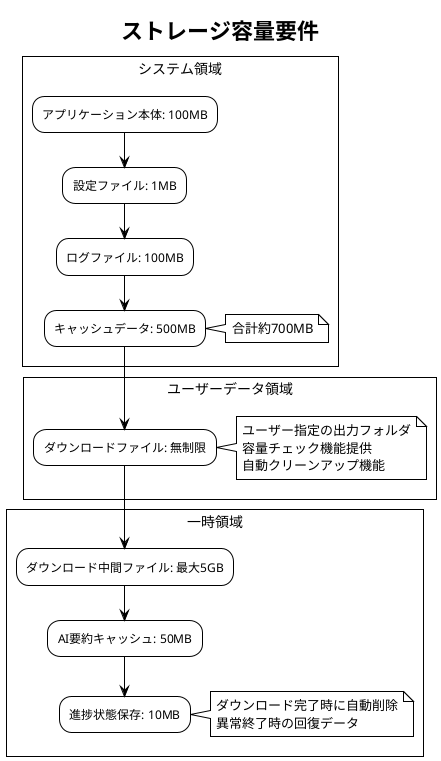

# 性能要件定義書 - Zoom Video Mover

## 文書概要
**プロジェクト名**: Zoom Video Mover  
**作成日**: 2025-08-02  
**作成者**: 性能エンジニア  
**レビューア**: システムアーキテクト  
**バージョン**: 1.0  

## 性能要件カテゴリ

### 1. レスポンス時間要件

#### 1.1 ユーザーインターフェース応答性

| 操作 | 目標時間 | 最大許容時間 | 測定条件 |
|------|----------|-------------|----------|
| **アプリケーション起動** | 2秒以内 | 5秒以内 | SSD、8GB RAM、通常負荷 |
| **設定画面表示** | 0.5秒以内 | 1秒以内 | ローカル処理のみ |
| **タブ切り替え** | 0.2秒以内 | 0.5秒以内 | UI状態変更のみ |
| **検索条件入力反応** | 0.1秒以内 | 0.3秒以内 | リアルタイム入力検証 |
| **ファイル選択反応** | 0.1秒以内 | 0.5秒以内 | チェックボックス操作 |

#### 1.2 外部API通信時間

| API種別 | 目標時間 | 最大許容時間 | タイムアウト設定 |
|---------|----------|-------------|------------------|
| **OAuth認証** | 3秒以内 | 10秒以内 | 30秒 |
| **録画一覧取得** | 5秒以内 | 15秒以内 | 30秒 |
| **ファイルダウンロード開始** | 2秒以内 | 8秒以内 | 30秒 |
| **AI要約取得** | 8秒以内 | 20秒以内 | 60秒 |

#### 1.3 ファイル処理時間

| 処理種別 | 目標性能 | 最小要件 | 測定基準 |
|----------|----------|----------|----------|
| **ファイル名サニタイズ** | 1ms以内 | 5ms以内 | 250文字ファイル名 |
| **重複チェック** | 10ms以内 | 50ms以内 | 1000ファイル検索 |
| **フォルダ作成** | 5ms以内 | 20ms以内 | 階層フォルダ作成 |
| **ファイル整合性検証** | 100ms以内 | 500ms以内 | 100MBファイル |

### 2. スループット要件

#### 2.1 同時処理能力

```plantuml
@startuml
!theme plain
title 同時処理性能要件

usecase "並列ダウンロード" as download
usecase "API同時呼び出し" as api
usecase "UI同時操作" as ui

rectangle "性能目標" {
  download : 5ファイル同時
  download : 総帯域50Mbps
  
  api : 10req/sec上限遵守
  api : バースト20req可能
  
  ui : 500ms更新間隔
  ui : 60FPS描画維持
}

rectangle "制約条件" {
  note as n1
    - メモリ使用量: 512MB以下
    - CPU使用率: 80%以下（持続）
    - ネットワーク: 利用可能帯域の80%以下
  end note
}

@enduml
```

#### 2.2 データ転送性能

| 転送種別 | 目標性能 | 最小要件 | 条件 |
|----------|----------|----------|------|
| **小ファイル（<10MB）** | 5MB/s | 1MB/s | チャット、トランスクリプト |
| **中ファイル（10-500MB）** | 15MB/s | 8MB/s | 音声ファイル |
| **大ファイル（>500MB）** | 25MB/s | 12MB/s | 動画ファイル |
| **並列転送合計** | 50MB/s | 30MB/s | 5ファイル同時 |

#### 2.3 メモリ使用効率

| 処理段階 | 目標使用量 | 最大許容量 | 最適化方針 |
|----------|-----------|------------|------------|
| **アイドル状態** | 64MB | 128MB | 基本UI + 設定データ |
| **録画検索中** | 128MB | 256MB | API レスポンスキャッシュ |
| **ダウンロード中** | 256MB | 512MB | ストリーミングバッファ |
| **進捗監視中** | +32MB | +64MB | 統計データ + UI更新 |

### 3. 拡張性要件

#### 3.1 データ量拡張性

```plantuml
@startuml
!theme plain
title データ量拡張性要件

rectangle "基本要件" {
  :会議数: 1,000件;
  :録画ファイル数: 5,000ファイル;
  :総データ量: 100GB;
  :検索結果表示: 100件/ページ;
}

rectangle "拡張要件" {
  :会議数: 10,000件;
  :録画ファイル数: 50,000ファイル;
  :総データ量: 1TB;
  :検索結果表示: 1,000件/ページ;
}

rectangle "性能維持条件" {
  note as perf
    基本要件での性能を
    拡張要件でも80%以上維持
    
    - 検索レスポンス: 8秒以内
    - UI応答性: 1秒以内
    - メモリ効率: 線形増加以下
  end note
}

@enduml
```

#### 3.2 同時ユーザー対応

| ユーザー数 | 同時ダウンロード | API制限対応 | リソース分散 |
|------------|------------------|-------------|-------------|
| **1ユーザー** | 5並列 | 10req/sec | 基本性能 |
| **5ユーザー** | 各3並列 | 8req/sec/user | 優先度制御 |
| **10ユーザー** | 各2並列 | 5req/sec/user | 負荷分散 |

### 4. 効率性要件

#### 4.1 リソース効率性

```rust
/// 性能監視とリソース効率性の測定
/// 
/// # 事前条件
/// - システムが正常に稼働中
/// 
/// # 事後条件
/// - 測定データが性能要件内に収まる
/// 
/// # 不変条件
/// - 監視中にシステム性能が劣化しない
#[derive(Debug, Clone)]
pub struct PerformanceMetrics {
    pub cpu_usage_percent: f32,          // 目標: 平均50%以下、ピーク80%以下
    pub memory_usage_mb: u64,            // 目標: 512MB以下
    pub network_usage_mbps: f32,         // 目標: 利用可能帯域の80%以下
    pub disk_io_mb_per_sec: f32,         // 目標: 100MB/s以下
    pub active_connections: u32,         // 目標: 10接続以下
    pub response_time_ms: u64,           // 目標: 平均500ms以下
}

impl PerformanceMetrics {
    /// 性能要件適合性チェック
    /// 
    /// # 事前条件
    /// - メトリクスデータが有効
    /// 
    /// # 事後条件
    /// - 各要件の適合状況が返される
    pub fn check_requirements(&self) -> PerformanceComplianceReport {
        let cpu_compliant = self.cpu_usage_percent <= 80.0;
        let memory_compliant = self.memory_usage_mb <= 512;
        let network_compliant = self.network_usage_mbps <= 50.0; // 想定50Mbps帯域
        let response_compliant = self.response_time_ms <= 500;
        
        PerformanceComplianceReport {
            overall_compliant: cpu_compliant && memory_compliant && 
                              network_compliant && response_compliant,
            cpu_status: if cpu_compliant { ComplianceStatus::Pass } else { ComplianceStatus::Fail },
            memory_status: if memory_compliant { ComplianceStatus::Pass } else { ComplianceStatus::Fail },
            network_status: if network_compliant { ComplianceStatus::Pass } else { ComplianceStatus::Fail },
            response_status: if response_compliant { ComplianceStatus::Pass } else { ComplianceStatus::Fail },
            timestamp: chrono::Utc::now(),
        }
    }
}
```

#### 4.2 ネットワーク効率性

| 効率化手法 | 目標改善率 | 実装方針 | 測定方法 |
|------------|------------|----------|----------|
| **並列ダウンロード** | 300%向上 | 5並列実行 | 総完了時間比較 |
| **レジューム機能** | 90%無駄削減 | 中断点記憶 | 再ダウンロード量測定 |
| **圧縮対応** | 20%帯域削減 | gzip/deflate | 転送量比較 |
| **ローカルキャッシュ** | 50%API削減 | 一時保存 | API呼び出し回数 |

### 5. 容量・制限要件

#### 5.1 ストレージ要件



#### 5.2 メモリ制限

| メモリ種別 | 基本要件 | 推奨要件 | 最大要件 |
|------------|----------|----------|----------|
| **システムRAM** | 4GB | 8GB | 16GB |
| **アプリ使用RAM** | 256MB | 512MB | 1GB |
| **GPU メモリ** | 不要 | 不要 | 不要 |
| **仮想メモリ** | 2GB | 4GB | 8GB |

#### 5.3 プロセッサ要件

| プロセッサ種別 | 最小要件 | 推奨要件 | 最適要件 |
|----------------|----------|----------|----------|
| **CPU コア数** | 2コア | 4コア | 8コア |
| **CPU 周波数** | 2.0GHz | 2.5GHz | 3.0GHz+ |
| **アーキテクチャ** | x64 | x64 | x64 |
| **命令セット** | SSE2 | AVX | AVX2 |

### 6. 性能測定・監視要件

#### 6.1 リアルタイム監視

```rust
/// リアルタイム性能監視システム
/// 
/// # 副作用
/// - システムメトリクスの収集
/// - ログファイルへの記録
/// - UIへの性能情報表示
/// 
/// # 事前条件
/// - 監視対象システムが稼働中
/// 
/// # 事後条件
/// - 性能データが正確に収集される
/// - 閾値超過時にアラートが発生する
pub struct RealTimePerformanceMonitor {
    metrics_collector: Arc<MetricsCollector>,
    alert_manager: Arc<AlertManager>,
    ui_reporter: Arc<UIReporter>,
}

impl RealTimePerformanceMonitor {
    /// 監視開始
    pub async fn start_monitoring(&self) -> Result<(), MonitoringError> {
        let mut interval = tokio::time::interval(Duration::from_millis(500));
        
        loop {
            interval.tick().await;
            
            // システムメトリクス収集
            let metrics = self.metrics_collector.collect_current_metrics().await?;
            
            // 要件適合性チェック
            let compliance_report = metrics.check_requirements();
            
            // 閾値チェック・アラート
            if !compliance_report.overall_compliant {
                self.alert_manager.trigger_performance_alert(&compliance_report).await?;
            }
            
            // UI更新
            self.ui_reporter.update_performance_display(&metrics).await?;
            
            // ログ記録
            log::info!("Performance metrics: {:?}", metrics);
        }
    }
}
```

#### 6.2 性能ベンチマーク

| ベンチマーク種別 | 実行頻度 | 測定項目 | 合格基準 |
|------------------|----------|----------|----------|
| **起動時間測定** | 毎回起動時 | アプリ起動→UI表示 | 5秒以内 |
| **API応答測定** | API呼び出し毎 | 要求→レスポンス | 15秒以内 |
| **ダウンロード速度** | ファイル毎 | 開始→完了 | 12MB/s以上 |
| **メモリリーク検出** | 1時間毎 | 使用量推移 | 増加率<1%/hour |

#### 6.3 パフォーマンステスト計画

```plantuml
@startuml
!theme plain
title パフォーマンステスト実行計画

package "負荷テスト" {
  usecase "通常負荷テスト" as normal
  usecase "高負荷テスト" as high  
  usecase "ストレステスト" as stress
  
  normal : 5ファイル同時DL
  normal : 30分継続実行
  
  high : 10ファイル同時DL
  high : 1時間継続実行
  
  stress : システム限界まで
  stress : 異常検出確認
}

package "信頼性テスト" {
  usecase "長時間実行テスト" as endurance
  usecase "メモリリークテスト" as memory
  usecase "リソース回復テスト" as recovery
  
  endurance : 24時間連続稼働
  memory : 使用量監視
  recovery : 異常→正常復帰
}

package "互換性テスト" {
  usecase "OS互換性" as os_compat
  usecase "ハードウェア互換性" as hw_compat
  
  os_compat : Windows 10/11
  hw_compat : 低スペック～高スペック
}

@enduml
```

### 7. 性能劣化対策

#### 7.1 予防措置

| 劣化要因 | 予防策 | 監視指標 | 対処手順 |
|----------|--------|----------|----------|
| **メモリリーク** | RAII パターン | メモリ使用量推移 | プロセス再起動 |
| **ファイルハンドルリーク** | 自動クローズ | 開放ハンドル数 | 強制クローズ |
| **ネットワーク輻輳** | レート制限 | 応答時間増加 | 接続数制限 |
| **ディスクI/O過負荷** | 非同期処理 | I/O待機時間 | キューイング制御 |

#### 7.2 性能最適化手法

```rust
/// 性能最適化実装例
/// 
/// # 事前条件
/// - 最適化対象処理が特定されている
/// 
/// # 事後条件
/// - 処理時間が目標値以内に改善される
/// 
/// # 不変条件
/// - 最適化により機能が損なわれない
pub struct PerformanceOptimizer {
    cache: Arc<LruCache<String, CachedData>>,
    connection_pool: Arc<ConnectionPool>,
    thread_pool: Arc<ThreadPool>,
}

impl PerformanceOptimizer {
    /// ファイルダウンロード最適化
    pub async fn optimize_download(&self, files: Vec<RecordingFile>) -> Result<(), OptimizationError> {
        // 1. ファイルサイズでソート（大きいファイルを先に開始）
        let mut sorted_files = files;
        sorted_files.sort_by(|a, b| b.file_size_bytes.cmp(&a.file_size_bytes));
        
        // 2. 接続プール使用で接続オーバーヘッド削減
        let connections = self.connection_pool.acquire_multiple(5).await?;
        
        // 3. 並列処理で全体時間短縮
        let semaphore = Arc::new(Semaphore::new(5));
        let tasks: Vec<_> = sorted_files.into_iter().map(|file| {
            let sem = semaphore.clone();
            let conn = connections[0].clone(); // 適切な接続を選択
            
            async move {
                let _permit = sem.acquire().await.unwrap();
                self.download_with_optimization(file, conn).await
            }
        }).collect();
        
        // 4. 全タスク完了待機
        futures::future::try_join_all(tasks).await?;
        
        Ok(())
    }
    
    /// キャッシュ活用による API 呼び出し最適化
    pub async fn optimize_api_calls(&self, request: &ApiRequest) -> Result<ApiResponse, OptimizationError> {
        let cache_key = request.generate_cache_key();
        
        // キャッシュヒット確認
        if let Some(cached_response) = self.cache.get(&cache_key).await {
            if !cached_response.is_expired() {
                return Ok(cached_response.data);
            }
        }
        
        // API呼び出し実行
        let response = self.execute_api_request(request).await?;
        
        // キャッシュ更新
        self.cache.insert(cache_key, CachedData::new(response.clone(), Duration::from_secs(300))).await;
        
        Ok(response)
    }
}
```

---

**承認**:  
性能エンジニア: [ ] 承認  
システムアーキテクト: [ ] 承認  
**承認日**: ___________