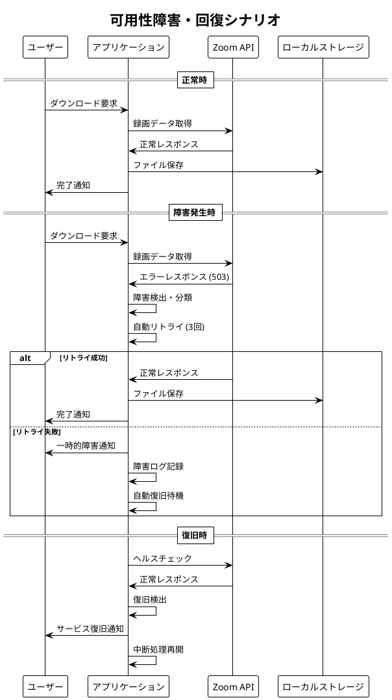
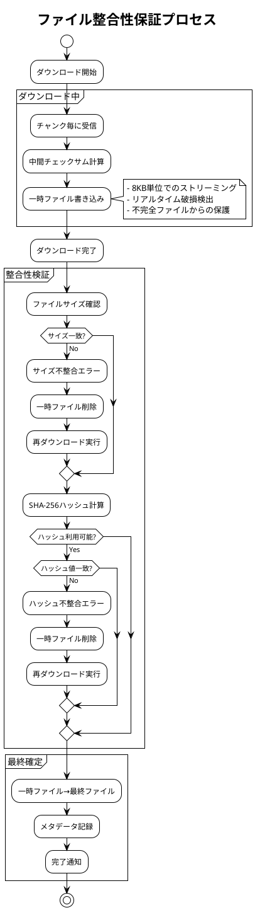
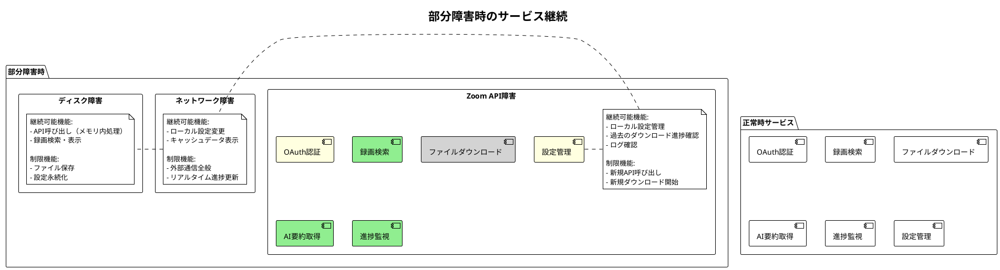
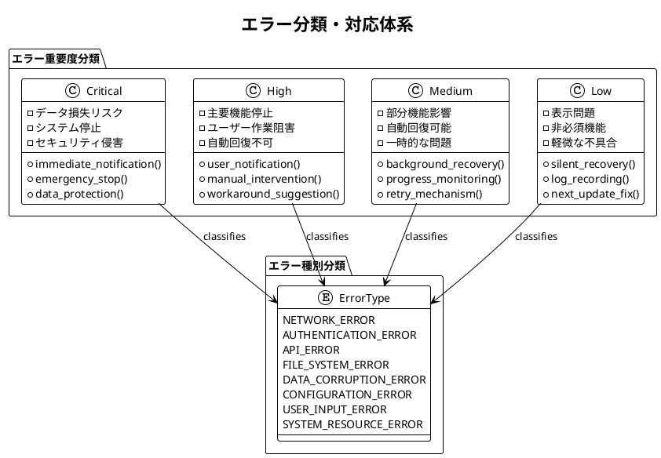

# 信頼性要件定義書 - Zoom Video Mover

## 文書概要
**プロジェクト名**: Zoom Video Mover  
**作成日**: 2025-08-02  
**作成者**: 信頼性エンジニア  
**レビューア**: 品質保証マネージャー  
**バージョン**: 1.0  

## 信頼性要件カテゴリ

### 1. 可用性要件（Availability）

#### 1.1 システム稼働率

| 稼働率指標 | 目標値 | 測定期間 | 停止許容時間 |
|------------|--------|----------|-------------|
| **月間稼働率** | 99.5% | 1ヶ月 | 3.6時間/月 |
| **週間稼働率** | 99.0% | 1週間 | 1.7時間/週 |
| **日次稼働率** | 95.0% | 1日 | 1.2時間/日 |

#### 1.2 可用性シナリオ



#### 1.3 障害分類と対応

| 障害種別 | 発生確率 | 影響度 | 自動回復時間 | 手動対応時間 |
|----------|----------|--------|-------------|-------------|
| **ネットワーク一時障害** | 週1回 | 中 | 30秒以内 | - |
| **API サーバー障害** | 月1回 | 高 | 5分以内 | 30分以内 |
| **認証トークン期限切れ** | 日1回 | 低 | 即座 | - |
| **ローカルディスク障害** | 年1回 | 高 | - | 2時間以内 |
| **アプリケーション異常終了** | 月2回 | 中 | 10秒以内 | - |

### 2. 信頼性要件（Reliability）

#### 2.1 故障率指標

```plantuml
@startuml
!theme plain
title 信頼性指標と故障パターン

rectangle "故障率目標" {
  :MTBF (平均故障間隔): 168時間 (7日);
  :MTTR (平均修復時間): 5分以内;
  :故障率: 0.006 failures/hour;
  note right: 週1回以下の重大障害
}

rectangle "故障パターン分析" {
  pie title 想定故障要因分布
  "外部API障害" : 40
  "ネットワーク問題" : 25
  "ローカル環境問題" : 20
  "アプリケーション不具合" : 10
  "ユーザー操作エラー" : 5
}

rectangle "回復性目標" {
  :自動回復率: 80%;
  :データ損失ゼロ: 100%;
  :部分機能継続: 90%;
  note right
    重大障害時も基本機能は継続
    ダウンロード中データは保護
  end note
}

@enduml
```

#### 2.2 信頼性設計パターン

```rust
/// 信頼性を向上させる設計パターン実装
/// 
/// # 副作用
/// - 障害状況のログ記録
/// - 自動回復処理の実行
/// - ユーザーへの状況通知
/// 
/// # 事前条件
/// - システムが初期化済み
/// - 監視機能が稼働中
/// 
/// # 事後条件
/// - 障害が検出・分類される
/// - 適切な回復処理が実行される
/// 
/// # 不変条件
/// - ユーザーデータの整合性が保たれる
pub struct ReliabilityManager {
    circuit_breaker: Arc<CircuitBreaker>,
    retry_policy: Arc<RetryPolicy>,
    health_monitor: Arc<HealthMonitor>,
    data_validator: Arc<DataValidator>,
}

impl ReliabilityManager {
    /// Circuit Breaker パターン実装
    /// API呼び出しの信頼性向上
    pub async fn api_call_with_circuit_breaker<T>(
        &self,
        api_function: impl Fn() -> Future<Output = Result<T, ApiError>>
    ) -> Result<T, ReliabilityError> {
        match self.circuit_breaker.state() {
            CircuitState::Closed => {
                // 正常状態：API呼び出し実行
                match api_function().await {
                    Ok(result) => {
                        self.circuit_breaker.record_success();
                        Ok(result)
                    },
                    Err(e) => {
                        self.circuit_breaker.record_failure();
                        Err(ReliabilityError::ApiFailure(e))
                    }
                }
            },
            CircuitState::Open => {
                // 障害状態：呼び出し拒否
                Err(ReliabilityError::CircuitOpen)
            },
            CircuitState::HalfOpen => {
                // テスト状態：限定的呼び出し
                match api_function().await {
                    Ok(result) => {
                        self.circuit_breaker.transition_to_closed();
                        Ok(result)
                    },
                    Err(e) => {
                        self.circuit_breaker.transition_to_open();
                        Err(ReliabilityError::ApiFailure(e))
                    }
                }
            }
        }
    }
    
    /// Retry パターン実装
    /// 一時的障害の自動回復
    pub async fn execute_with_retry<T>(
        &self,
        operation: impl Fn() -> Future<Output = Result<T, OperationError>>,
        operation_name: &str
    ) -> Result<T, ReliabilityError> {
        let mut attempt = 0;
        let max_attempts = self.retry_policy.max_attempts();
        
        loop {
            attempt += 1;
            
            match operation().await {
                Ok(result) => {
                    if attempt > 1 {
                        info!("Operation '{}' succeeded after {} attempts", operation_name, attempt);
                    }
                    return Ok(result);
                },
                Err(e) if attempt >= max_attempts => {
                    error!("Operation '{}' failed after {} attempts: {:?}", operation_name, attempt, e);
                    return Err(ReliabilityError::MaxRetriesExceeded(e));
                },
                Err(e) if self.retry_policy.is_retryable(&e) => {
                    let delay = self.retry_policy.calculate_delay(attempt);
                    warn!("Operation '{}' failed on attempt {}, retrying in {:?}: {:?}", 
                          operation_name, attempt, delay, e);
                    tokio::time::sleep(delay).await;
                },
                Err(e) => {
                    error!("Operation '{}' failed with non-retryable error: {:?}", operation_name, e);
                    return Err(ReliabilityError::NonRetryableError(e));
                }
            }
        }
    }
}

/// Circuit Breaker 実装
#[derive(Debug)]
pub struct CircuitBreaker {
    state: Arc<Mutex<CircuitState>>,
    failure_count: Arc<AtomicU32>,
    success_count: Arc<AtomicU32>,
    last_failure_time: Arc<Mutex<Option<Instant>>>,
    config: CircuitBreakerConfig,
}

#[derive(Debug, Clone)]
pub struct CircuitBreakerConfig {
    pub failure_threshold: u32,      // 故障閾値: 5回
    pub success_threshold: u32,      // 成功閾値: 3回
    pub timeout_duration: Duration,  // タイムアウト: 30秒
}

impl CircuitBreaker {
    pub fn record_failure(&self) {
        self.failure_count.fetch_add(1, Ordering::Relaxed);
        *self.last_failure_time.lock().unwrap() = Some(Instant::now());
        
        if self.failure_count.load(Ordering::Relaxed) >= self.config.failure_threshold {
            self.transition_to_open();
        }
    }
    
    pub fn record_success(&self) {
        self.success_count.fetch_add(1, Ordering::Relaxed);
        self.failure_count.store(0, Ordering::Relaxed);
    }
    
    fn transition_to_open(&self) {
        *self.state.lock().unwrap() = CircuitState::Open;
        warn!("Circuit breaker transitioned to OPEN state due to repeated failures");
    }
}
```

### 3. データ完全性要件

#### 3.1 データ保護レベル

| データ種別 | 保護レベル | 検証方法 | 回復方針 |
|------------|------------|----------|----------|
| **OAuth認証情報** | 最高 | 暗号化検証 | 再認証要求 |
| **ダウンロードファイル** | 高 | ハッシュ値照合 | 自動再ダウンロード |
| **設定データ** | 中 | 形式検証 | デフォルト値復元 |
| **ログデータ** | 低 | 基本形式チェック | 欠損許容 |

#### 3.2 ファイル整合性保証



#### 3.3 データ回復メカニズム

```rust
/// データ回復・検証システム
/// 
/// # 副作用
/// - 破損ファイルの検出・削除
/// - 自動再ダウンロードの実行
/// - データ回復ログの記録
/// 
/// # 事前条件
/// - 検証対象ファイルが存在する
/// 
/// # 事後条件
/// - ファイル整合性が確認される
/// - 破損ファイルが修復される
/// 
/// # 不変条件
/// - 正常ファイルは変更されない
pub struct DataRecoveryManager {
    hash_calculator: Arc<HashCalculator>,
    file_validator: Arc<FileValidator>,
    download_engine: Arc<DownloadEngine>,
}

impl DataRecoveryManager {
    /// ファイル整合性検証と自動修復
    pub async fn verify_and_recover_file(
        &self,
        file_path: &Path,
        expected_metadata: &FileMetadata
    ) -> Result<FileIntegrityStatus, RecoveryError> {
        // 1. 基本検証
        if !file_path.exists() {
            warn!("File not found: {:?}", file_path);
            return self.attempt_recovery(file_path, expected_metadata).await;
        }
        
        // 2. サイズ検証
        let actual_size = std::fs::metadata(file_path)?.len();
        if actual_size != expected_metadata.size {
            warn!("File size mismatch: expected {}, got {}", expected_metadata.size, actual_size);
            return self.attempt_recovery(file_path, expected_metadata).await;
        }
        
        // 3. ハッシュ検証（利用可能な場合）
        if let Some(expected_hash) = &expected_metadata.hash {
            let actual_hash = self.hash_calculator.calculate_sha256(file_path).await?;
            if &actual_hash != expected_hash {
                warn!("File hash mismatch: expected {}, got {}", expected_hash, actual_hash);
                return self.attempt_recovery(file_path, expected_metadata).await;
            }
        }
        
        // 4. ファイル形式検証
        if !self.file_validator.validate_format(file_path, &expected_metadata.file_type).await? {
            warn!("File format validation failed: {:?}", file_path);
            return self.attempt_recovery(file_path, expected_metadata).await;
        }
        
        Ok(FileIntegrityStatus::Valid)
    }
    
    /// 自動回復処理
    async fn attempt_recovery(
        &self,
        file_path: &Path,
        expected_metadata: &FileMetadata
    ) -> Result<FileIntegrityStatus, RecoveryError> {
        info!("Attempting to recover file: {:?}", file_path);
        
        // 破損ファイル削除
        if file_path.exists() {
            std::fs::remove_file(file_path)?;
        }
        
        // 再ダウンロード実行
        match self.download_engine.redownload_file(expected_metadata).await {
            Ok(_) => {
                info!("File recovery successful: {:?}", file_path);
                Ok(FileIntegrityStatus::Recovered)
            },
            Err(e) => {
                error!("File recovery failed: {:?}, error: {:?}", file_path, e);
                Ok(FileIntegrityStatus::Corrupted)
            }
        }
    }
    
    /// バックグラウンド整合性チェック
    pub async fn background_integrity_check(&self) -> Result<IntegrityReport, RecoveryError> {
        let mut report = IntegrityReport::new();
        
        // すべてのダウンロードファイルをスキャン
        let downloaded_files = self.discover_downloaded_files().await?;
        
        for file_info in downloaded_files {
            match self.verify_and_recover_file(&file_info.path, &file_info.metadata).await {
                Ok(FileIntegrityStatus::Valid) => {
                    report.valid_files += 1;
                },
                Ok(FileIntegrityStatus::Recovered) => {
                    report.recovered_files += 1;
                },
                Ok(FileIntegrityStatus::Corrupted) => {
                    report.corrupted_files += 1;
                    report.failed_files.push(file_info.path);
                },
                Err(e) => {
                    report.error_files += 1;
                    error!("Integrity check error for {:?}: {:?}", file_info.path, e);
                }
            }
        }
        
        Ok(report)
    }
}
```

### 4. 障害許容性要件

#### 4.1 グレースフル・デグラデーション

| 障害レベル | サービス継続範囲 | 機能制限 | 復旧目標 |
|------------|------------------|----------|----------|
| **軽微** | 全機能継続 | なし | 自動回復 |
| **中程度** | 基本機能継続 | 高度機能停止 | 5分以内 |
| **重大** | 最小機能継続 | 新規処理停止 | 30分以内 |
| **致命的** | 安全停止 | 全機能停止 | 手動回復 |

#### 4.2 部分障害対応



### 5. 回復性要件

#### 5.1 自動回復メカニズム

```rust
/// 自動回復システム
/// 
/// # 副作用
/// - 障害状況の監視・検出
/// - 自動回復処理の実行
/// - 回復状況のログ記録
/// 
/// # 事前条件
/// - 回復マネージャーが初期化済み
/// 
/// # 事後条件
/// - 回復可能な障害が自動修復される
/// - 回復不可能な障害が適切に通知される
/// 
/// # 不変条件
/// - システムの基本的な安全性が保たれる
pub struct AutoRecoveryManager {
    health_checker: Arc<HealthChecker>,
    recovery_strategies: HashMap<FailureType, Box<dyn RecoveryStrategy>>,
    notification_manager: Arc<NotificationManager>,
}

impl AutoRecoveryManager {
    /// 継続的ヘルスチェックと自動回復
    pub async fn start_auto_recovery_loop(&self) -> Result<(), RecoveryError> {
        let mut check_interval = tokio::time::interval(Duration::from_secs(30));
        
        loop {
            check_interval.tick().await;
            
            // システムヘルスチェック
            let health_status = self.health_checker.check_system_health().await?;
            
            // 障害検出・分類
            for failure in health_status.detected_failures {
                info!("Detected failure: {:?}", failure);
                
                if let Some(strategy) = self.recovery_strategies.get(&failure.failure_type) {
                    match strategy.attempt_recovery(&failure).await {
                        Ok(RecoveryResult::Success) => {
                            info!("Auto-recovery successful for: {:?}", failure.failure_type);
                            self.notification_manager.notify_recovery_success(&failure).await?;
                        },
                        Ok(RecoveryResult::PartialSuccess) => {
                            warn!("Partial recovery for: {:?}", failure.failure_type);
                            self.notification_manager.notify_partial_recovery(&failure).await?;
                        },
                        Ok(RecoveryResult::Failed) => {
                            error!("Auto-recovery failed for: {:?}", failure.failure_type);
                            self.notification_manager.notify_recovery_failure(&failure).await?;
                        },
                        Err(e) => {
                            error!("Recovery strategy error: {:?}", e);
                        }
                    }
                }
            }
        }
    }
}

/// 各種回復戦略の実装
#[async_trait]
pub trait RecoveryStrategy: Send + Sync {
    async fn attempt_recovery(&self, failure: &Failure) -> Result<RecoveryResult, RecoveryError>;
}

/// ネットワーク接続回復戦略
pub struct NetworkRecoveryStrategy {
    connection_tester: Arc<ConnectionTester>,
    dns_resolver: Arc<DnsResolver>,
}

#[async_trait]
impl RecoveryStrategy for NetworkRecoveryStrategy {
    async fn attempt_recovery(&self, failure: &Failure) -> Result<RecoveryResult, RecoveryError> {
        // 1. 基本接続テスト
        if !self.connection_tester.test_internet_connectivity().await? {
            return Ok(RecoveryResult::Failed);
        }
        
        // 2. DNS解決テスト
        if !self.dns_resolver.test_zoom_dns_resolution().await? {
            // DNS設定の問題の可能性
            return Ok(RecoveryResult::PartialSuccess);
        }
        
        // 3. Zoom API到達性テスト
        if self.connection_tester.test_zoom_api_connectivity().await? {
            return Ok(RecoveryResult::Success);
        }
        
        Ok(RecoveryResult::Failed)
    }
}

/// 認証トークン回復戦略
pub struct AuthTokenRecoveryStrategy {
    token_manager: Arc<TokenManager>,
    oauth_manager: Arc<OAuthManager>,
}

#[async_trait]
impl RecoveryStrategy for AuthTokenRecoveryStrategy {
    async fn attempt_recovery(&self, failure: &Failure) -> Result<RecoveryResult, RecoveryError> {
        // 1. リフレッシュトークンでの更新試行
        if let Some(refresh_token) = self.token_manager.get_refresh_token().await {
            match self.oauth_manager.refresh_access_token(&refresh_token).await {
                Ok(new_token) => {
                    self.token_manager.store_token(new_token).await?;
                    return Ok(RecoveryResult::Success);
                },
                Err(_) => {
                    // リフレッシュトークンも無効
                }
            }
        }
        
        // 2. 完全な再認証が必要
        Ok(RecoveryResult::Failed)
    }
}
```

#### 5.2 回復時間目標

| 障害種別 | 検出時間 | 回復開始時間 | 完全回復時間 | 代替手段提供時間 |
|----------|----------|-------------|-------------|------------------|
| **API認証エラー** | 即座 | 即座 | 30秒以内 | - |
| **ネットワーク断** | 10秒以内 | 10秒以内 | 60秒以内 | 即座 |
| **ファイル破損** | 即座 | 即座 | 5分以内 | - |
| **サーバー障害** | 30秒以内 | 30秒以内 | 外部依存 | 1分以内 |

### 6. エラー処理要件

#### 6.1 エラー分類体系



#### 6.2 エラー対応マトリックス

| エラー種別 | 重要度 | 自動対応 | ユーザー通知 | ログレベル | 回復方法 |
|------------|--------|----------|-------------|------------|----------|
| **データ破損** | Critical | 即座停止 | 緊急警告 | ERROR | 手動確認必須 |
| **認証失敗** | High | 再認証誘導 | 明確な指示 | WARN | 再認証実行 |
| **API制限** | Medium | 自動待機 | 進捗表示 | INFO | レート制限遵守 |
| **ネットワーク遅延** | Low | 自動リトライ | なし | DEBUG | バックグラウンド処理 |

### 7. 障害監視・通知要件

#### 7.1 監視システム

```rust
/// 包括的システム監視
/// 
/// # 副作用
/// - システム状態の継続監視
/// - 障害の早期検出・通知
/// - 監視データのログ記録
/// 
/// # 事前条件
/// - 監視対象システムが稼働中
/// 
/// # 事後条件
/// - 異常状態が迅速に検出される
/// - 適切な関係者に通知される
/// 
/// # 不変条件
/// - 監視処理自体がシステムに負荷を与えない
pub struct SystemMonitor {
    health_metrics: Arc<HealthMetrics>,
    alert_dispatcher: Arc<AlertDispatcher>,
    monitoring_config: MonitoringConfig,
}

impl SystemMonitor {
    /// 包括的システム監視開始
    pub async fn start_comprehensive_monitoring(&self) -> Result<(), MonitoringError> {
        tokio::spawn({
            let health_metrics = self.health_metrics.clone();
            let alert_dispatcher = self.alert_dispatcher.clone();
            let config = self.monitoring_config.clone();
            
            async move {
                let mut interval = tokio::time::interval(config.check_interval);
                
                loop {
                    interval.tick().await;
                    
                    // 1. ヘルスメトリクス収集
                    let current_health = health_metrics.collect_current_state().await;
                    
                    // 2. 閾値チェック
                    let violations = config.check_threshold_violations(&current_health);
                    
                    // 3. 異常検出時の通知
                    for violation in violations {
                        match violation.severity {
                            Severity::Critical => {
                                alert_dispatcher.send_immediate_alert(&violation).await;
                                error!("CRITICAL: {}", violation.description);
                            },
                            Severity::High => {
                                alert_dispatcher.send_high_priority_alert(&violation).await;
                                warn!("HIGH: {}", violation.description);
                            },
                            Severity::Medium => {
                                alert_dispatcher.send_standard_alert(&violation).await;
                                info!("MEDIUM: {}", violation.description);
                            },
                            Severity::Low => {
                                debug!("LOW: {}", violation.description);
                            }
                        }
                    }
                    
                    // 4. 定期ヘルスレポート
                    if current_health.overall_status == HealthStatus::Healthy {
                        debug!("System health check: All systems operational");
                    }
                }
            }
        });
        
        Ok(())
    }
}

/// ヘルスメトリクス定義
#[derive(Debug, Clone)]
pub struct HealthMetrics {
    pub system_uptime: Duration,
    pub memory_usage_mb: u64,
    pub cpu_usage_percent: f32,
    pub network_connectivity: bool,
    pub api_response_time_ms: u64,
    pub active_downloads: u32,
    pub error_rate_per_hour: f32,
    pub disk_space_available_gb: u64,
    pub last_successful_api_call: Option<Instant>,
}

impl HealthMetrics {
    /// システム状態の総合評価
    pub fn evaluate_overall_health(&self) -> HealthStatus {
        let mut health_score = 100.0;
        
        // メモリ使用量チェック (512MB上限)
        if self.memory_usage_mb > 512 {
            health_score -= 20.0;
        }
        
        // CPU使用率チェック (80%上限)
        if self.cpu_usage_percent > 80.0 {
            health_score -= 15.0;
        }
        
        // API応答時間チェック (15秒上限)
        if self.api_response_time_ms > 15000 {
            health_score -= 25.0;
        }
        
        // エラー率チェック (10%上限)
        if self.error_rate_per_hour > 10.0 {
            health_score -= 30.0;
        }
        
        // ネットワーク接続性チェック
        if !self.network_connectivity {
            health_score -= 40.0;
        }
        
        match health_score {
            score if score >= 90.0 => HealthStatus::Excellent,
            score if score >= 75.0 => HealthStatus::Good,
            score if score >= 50.0 => HealthStatus::Fair,
            score if score >= 25.0 => HealthStatus::Poor,
            _ => HealthStatus::Critical,
        }
    }
}
```

---

**承認**:  
信頼性エンジニア: [ ] 承認  
品質保証マネージャー: [ ] 承認  
**承認日**: ___________