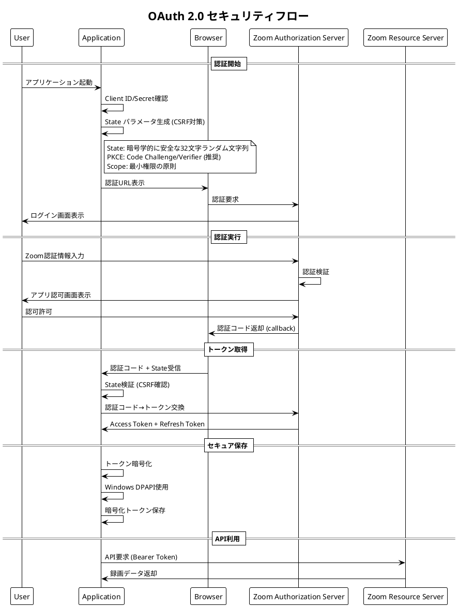
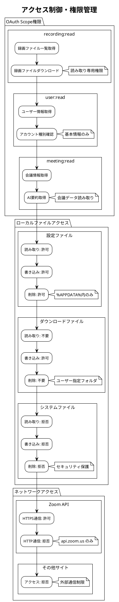
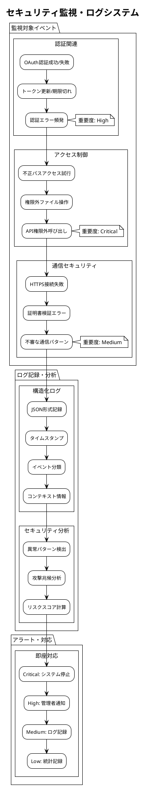

# セキュリティ要件定義書 - Zoom Video Mover

## 文書概要
**プロジェクト名**: Zoom Video Mover  
**作成日**: 2025-08-02  
**作成者**: セキュリティエンジニア  
**レビューア**: セキュリティアーキテクト  
**バージョン**: 1.0  

## セキュリティ要件カテゴリ

### 1. 認証・認可要件

#### 1.1 OAuth 2.0 セキュリティ要件



#### 1.2 認証セキュリティ実装

```rust
/// OAuth 2.0 セキュリティ実装
/// 
/// # セキュリティ要件
/// - CSRF攻撃対策: State パラメータ検証
/// - トークン保護: AES-256-GCM暗号化
/// - 権限最小化: 必要最小限のScope指定
/// 
/// # 事前条件
/// - OAuth設定が適切に構成されている
/// - セキュリティライブラリが初期化済み
/// 
/// # 事後条件
/// - 認証トークンが安全に保存される
/// - CSRF攻撃が防止される
/// 
/// # 不変条件
/// - 機密情報がメモリ上で保護される
pub struct SecureOAuthManager {
    client_id: String,
    client_secret: SecureString,  // メモリ保護文字列
    encryption_manager: Arc<EncryptionManager>,
    state_validator: Arc<StateValidator>,
}

impl SecureOAuthManager {
    /// CSRF対策付き認証URL生成
    pub fn generate_secure_auth_url(&self) -> Result<(String, String), SecurityError> {
        // 1. 暗号学的に安全なState生成
        let state = self.state_validator.generate_secure_state()?;
        
        // 2. 最小権限Scope設定
        let scopes = vec![
            "recording:read",  // 録画ファイル読み取りのみ
            "user:read",       // ユーザー情報読み取りのみ
            "meeting:read"     // 会議情報読み取りのみ
        ];
        
        // 3. PKCE（Code Verifier/Challenge）生成
        let code_verifier = self.generate_code_verifier()?;
        let code_challenge = self.generate_code_challenge(&code_verifier)?;
        
        // 4. 認証URL構築
        let auth_url = format!(
            "https://zoom.us/oauth/authorize?response_type=code&client_id={}&redirect_uri={}&scope={}&state={}&code_challenge={}&code_challenge_method=S256",
            urlencoding::encode(&self.client_id),
            urlencoding::encode("http://localhost:8080/oauth/callback"),
            urlencoding::encode(&scopes.join(" ")),
            urlencoding::encode(&state),
            urlencoding::encode(&code_challenge)
        );
        
        // 5. State保存（検証用）
        self.state_validator.store_pending_state(&state, &code_verifier)?;
        
        Ok((auth_url, state))
    }
    
    /// セキュアトークン交換
    pub async fn exchange_code_securely(
        &self,
        auth_code: &str,
        received_state: &str
    ) -> Result<SecureTokenSet, SecurityError> {
        // 1. State検証（CSRF対策）
        let code_verifier = self.state_validator.validate_and_consume_state(received_state)?;
        
        // 2. 認証コード→トークン交換
        let token_request = TokenRequest {
            grant_type: "authorization_code".to_string(),
            code: auth_code.to_string(),
            redirect_uri: "http://localhost:8080/oauth/callback".to_string(),
            client_id: self.client_id.clone(),
            client_secret: self.client_secret.reveal(),
            code_verifier: Some(code_verifier),
        };
        
        let client = self.create_secure_http_client()?;
        let response = client
            .post("https://api.zoom.us/oauth/token")
            .form(&token_request)
            .send()
            .await?;
            
        if !response.status().is_success() {
            return Err(SecurityError::TokenExchangeFailed);
        }
        
        let token_response: TokenResponse = response.json().await?;
        
        // 3. トークン暗号化保存
        let secure_tokens = self.encrypt_and_store_tokens(token_response).await?;
        
        Ok(secure_tokens)
    }
    
    /// トークン暗号化保存
    async fn encrypt_and_store_tokens(
        &self,
        token_response: TokenResponse
    ) -> Result<SecureTokenSet, SecurityError> {
        // Windows DPAPI使用（ユーザーアカウント固有暗号化）
        let encrypted_access_token = self.encryption_manager
            .encrypt_with_dpapi(&token_response.access_token)?;
        let encrypted_refresh_token = self.encryption_manager
            .encrypt_with_dpapi(&token_response.refresh_token)?;
        
        let secure_tokens = SecureTokenSet {
            encrypted_access_token,
            encrypted_refresh_token,
            token_type: token_response.token_type,
            expires_at: chrono::Utc::now() + chrono::Duration::seconds(token_response.expires_in),
            scope: token_response.scope,
        };
        
        // セキュアファイル保存
        self.save_encrypted_tokens(&secure_tokens).await?;
        
        // メモリクリア
        drop(token_response);
        
        Ok(secure_tokens)
    }
}

/// メモリ保護文字列（機密情報用）
pub struct SecureString {
    inner: Vec<u8>,
}

impl SecureString {
    pub fn new(value: String) -> Self {
        let mut inner = value.into_bytes();
        // メモリページをロック（スワップアウト防止）
        unsafe {
            libc::mlock(inner.as_ptr() as *const libc::c_void, inner.len());
        }
        Self { inner }
    }
    
    pub fn reveal(&self) -> String {
        String::from_utf8_lossy(&self.inner).to_string()
    }
}

impl Drop for SecureString {
    fn drop(&mut self) {
        // メモリ内容をゼロクリア
        for byte in &mut self.inner {
            *byte = 0;
        }
        // メモリページロック解除
        unsafe {
            libc::munlock(self.inner.as_ptr() as *const libc::c_void, self.inner.len());
        }
    }
}
```

### 2. データ保護要件

#### 2.1 暗号化要件

| データ種別 | 暗号化方式 | 鍵管理 | 保存場所 |
|------------|------------|--------|----------|
| **OAuth Client Secret** | AES-256-GCM | Windows DPAPI | レジストリ |
| **Access Token** | AES-256-GCM | Windows DPAPI | 暗号化ファイル |
| **Refresh Token** | AES-256-GCM | Windows DPAPI | 暗号化ファイル |
| **設定ファイル** | 平文 | - | %APPDATA%フォルダ |
| **ログファイル** | 平文 | - | %APPDATA%\logs |
| **ダウンロードファイル** | 平文 | - | ユーザー指定フォルダ |

#### 2.2 データ暗号化実装

```rust
/// データ暗号化管理システム
/// 
/// # セキュリティ特性
/// - AES-256-GCM使用（認証付き暗号化）
/// - Windows DPAPI活用（プラットフォーム統合）
/// - メモリ安全性（機密データ保護）
/// 
/// # 事前条件
/// - Windows DPAPI が利用可能
/// - 適切なユーザー権限で実行
/// 
/// # 事後条件
/// - データが暗号化されて保存される
/// - 復号化が認証されたプロセスでのみ可能
/// 
/// # 不変条件
/// - 暗号化キーがメモリ上で保護される
pub struct EncryptionManager {
    dpapi_client: Arc<DpapiClient>,
}

impl EncryptionManager {
    /// Windows DPAPI使用暗号化
    pub fn encrypt_with_dpapi(&self, plaintext: &str) -> Result<Vec<u8>, EncryptionError> {
        // 1. UTF-8バイト変換
        let plaintext_bytes = plaintext.as_bytes();
        
        // 2. DPAPI暗号化実行
        let encrypted_data = self.dpapi_client.encrypt(
            plaintext_bytes,
            None,  // 追加エントロピー不使用
            CryptProtectFlags::LOCAL_MACHINE  // マシン固有暗号化
        )?;
        
        // 3. メタデータ付与
        let encrypted_with_metadata = EncryptedData {
            algorithm: "DPAPI".to_string(),
            version: 1,
            timestamp: chrono::Utc::now(),
            data: encrypted_data,
        };
        
        Ok(bincode::serialize(&encrypted_with_metadata)?)
    }
    
    /// Windows DPAPI使用復号化
    pub fn decrypt_with_dpapi(&self, encrypted_data: &[u8]) -> Result<String, EncryptionError> {
        // 1. メタデータ解析
        let encrypted_with_metadata: EncryptedData = bincode::deserialize(encrypted_data)?;
        
        // 2. アルゴリズム確認
        if encrypted_with_metadata.algorithm != "DPAPI" {
            return Err(EncryptionError::UnsupportedAlgorithm);
        }
        
        // 3. DPAPI復号化実行
        let decrypted_bytes = self.dpapi_client.decrypt(
            &encrypted_with_metadata.data,
            None
        )?;
        
        // 4. UTF-8文字列変換
        let decrypted_string = String::from_utf8(decrypted_bytes)
            .map_err(|_| EncryptionError::InvalidUtf8)?;
        
        Ok(decrypted_string)
    }
    
    /// 追加レイヤー暗号化（AES-256-GCM）
    pub fn encrypt_with_aes_gcm(
        &self,
        plaintext: &str,
        key: &[u8; 32]
    ) -> Result<Vec<u8>, EncryptionError> {
        use aes_gcm::{Aes256Gcm, Key, Nonce};
        use aes_gcm::aead::{Aead, NewAead};
        
        // 1. 暗号化器初期化
        let key = Key::from_slice(key);
        let cipher = Aes256Gcm::new(key);
        
        // 2. ランダムnonce生成
        let mut nonce_bytes = [0u8; 12];
        rand::RngCore::fill_bytes(&mut rand::thread_rng(), &mut nonce_bytes);
        let nonce = Nonce::from_slice(&nonce_bytes);
        
        // 3. 暗号化実行
        let ciphertext = cipher.encrypt(nonce, plaintext.as_bytes())
            .map_err(|_| EncryptionError::EncryptionFailed)?;
        
        // 4. nonce + ciphertext結合
        let mut result = Vec::new();
        result.extend_from_slice(&nonce_bytes);
        result.extend_from_slice(&ciphertext);
        
        Ok(result)
    }
}

/// Windows DPAPI クライアント
pub struct DpapiClient;

impl DpapiClient {
    pub fn encrypt(
        &self,
        data: &[u8],
        entropy: Option<&[u8]>,
        flags: CryptProtectFlags
    ) -> Result<Vec<u8>, DpapiError> {
        use windows::Win32::Security::Cryptography::{CryptProtectData, CRYPTOAPI_BLOB};
        
        let mut data_in = CRYPTOAPI_BLOB {
            cbData: data.len() as u32,
            pbData: data.as_ptr() as *mut u8,
        };
        
        let entropy_blob = entropy.map(|e| CRYPTOAPI_BLOB {
            cbData: e.len() as u32,
            pbData: e.as_ptr() as *mut u8,
        });
        
        let mut data_out = CRYPTOAPI_BLOB::default();
        
        unsafe {
            let result = CryptProtectData(
                &mut data_in,
                None,  // 説明文字列
                entropy_blob.as_ref().map(|e| e as *const _),
                None,  // 予約パラメータ
                None,  // プロンプト構造体
                flags.bits(),
                &mut data_out
            );
            
            if result.as_bool() {
                let encrypted_data = std::slice::from_raw_parts(
                    data_out.pbData,
                    data_out.cbData as usize
                ).to_vec();
                
                // メモリ解放
                windows::Win32::System::Memory::LocalFree(data_out.pbData as isize);
                
                Ok(encrypted_data)
            } else {
                Err(DpapiError::EncryptionFailed)
            }
        }
    }
}
```

### 3. 通信セキュリティ要件

#### 3.1 HTTPS通信強制

```rust
/// セキュアHTTP通信設定
/// 
/// # セキュリティ特性
/// - TLS 1.2以上強制
/// - 証明書検証強化
/// - HTTPS-onlyモード
/// 
/// # 事前条件
/// - ネットワーク接続が利用可能
/// 
/// # 事後条件
/// - 全通信がHTTPS経由で暗号化される
/// - 証明書が適切に検証される
/// 
/// # 不変条件
/// - 平文通信が発生しない
pub fn create_secure_http_client() -> Result<reqwest::Client, SecurityError> {
    use reqwest::ClientBuilder;
    use reqwest::tls::{Version, Certificate};
    
    let client = ClientBuilder::new()
        // TLS設定
        .min_tls_version(Version::TLS_1_2)  // TLS 1.2以上を強制
        .https_only(true)                   // HTTPS通信のみ許可
        
        // 証明書検証設定
        .tls_built_in_root_certs(true)      // システム証明書ストア使用
        .danger_accept_invalid_certs(false) // 無効証明書拒否
        .danger_accept_invalid_hostnames(false) // ホスト名不一致拒否
        
        // 接続設定
        .timeout(Duration::from_secs(30))         // 全体タイムアウト
        .connect_timeout(Duration::from_secs(10)) // 接続タイムアウト
        .tcp_keepalive(Duration::from_secs(60))   // キープアライブ
        
        // セキュリティヘッダー
        .default_headers({
            let mut headers = reqwest::header::HeaderMap::new();
            headers.insert(
                reqwest::header::USER_AGENT,
                reqwest::header::HeaderValue::from_static("ZoomVideoMover/1.0")
            );
            headers.insert(
                reqwest::header::HeaderName::from_static("x-app-version"),
                reqwest::header::HeaderValue::from_static("1.0.0")
            );
            headers
        })
        
        // プロキシ設定（企業環境対応）
        .proxy(reqwest::Proxy::system())  // システムプロキシ自動検出
        
        .build()?;
    
    Ok(client)
}

/// 証明書ピンニング実装（高度なセキュリティ）
pub struct CertificatePinner {
    pinned_certificates: Vec<Certificate>,
}

impl CertificatePinner {
    /// Zoom.us証明書ピンニング設定
    pub fn new_with_zoom_pins() -> Result<Self, SecurityError> {
        let zoom_cert_pem = include_str!("../certificates/zoom_us.pem");
        let pinned_cert = Certificate::from_pem(zoom_cert_pem.as_bytes())?;
        
        Ok(Self {
            pinned_certificates: vec![pinned_cert],
        })
    }
    
    /// ピンニング対応HTTPクライアント作成
    pub fn create_pinned_client(&self) -> Result<reqwest::Client, SecurityError> {
        let mut builder = ClientBuilder::new()
            .min_tls_version(Version::TLS_1_2)
            .https_only(true);
        
        // 証明書ピンニング設定
        for cert in &self.pinned_certificates {
            builder = builder.add_root_certificate(cert.clone());
        }
        
        Ok(builder.build()?)
    }
}
```

#### 3.2 API通信セキュリティ

| セキュリティ要素 | 実装方針 | 検証方法 |
|------------------|----------|----------|
| **認証ヘッダー** | Bearer Token形式 | トークン有効性確認 |
| **リクエスト署名** | OAuth 2.0標準 | サーバー側検証 |
| **レート制限遵守** | 10req/sec以下 | クライアント側制御 |
| **エラー情報制限** | 機密情報除外 | レスポンス解析 |

### 4. アクセス制御要件

#### 4.1 最小権限の原則



#### 4.2 ファイルシステムアクセス制御

```rust
/// ファイルシステムアクセス制御
/// 
/// # セキュリティ原則
/// - 最小権限の原則
/// - パストラバーサル攻撃防止
/// - 機密ディレクトリ保護
/// 
/// # 事前条件
/// - アクセス制御ポリシーが設定済み
/// 
/// # 事後条件
/// - 許可されたパスのみアクセス可能
/// - 不正アクセスが検出・阻止される
/// 
/// # 不変条件
/// - セキュリティポリシーが維持される
pub struct FileSystemAccessControl {
    allowed_directories: Vec<PathBuf>,
    blocked_directories: Vec<PathBuf>,
}

impl FileSystemAccessControl {
    /// 安全な設定でアクセス制御初期化
    pub fn new_secure_config() -> Result<Self, SecurityError> {
        let user_profile = env::var("USERPROFILE")
            .map_err(|_| SecurityError::EnvironmentVariableNotFound)?;
        let app_data = env::var("APPDATA")
            .map_err(|_| SecurityError::EnvironmentVariableNotFound)?;
        
        let allowed_directories = vec![
            PathBuf::from(format!("{}/ZoomVideoMover", app_data)),  // アプリ設定
            PathBuf::from(format!("{}/Downloads", user_profile)),   // デフォルトDL先
            // ユーザー指定フォルダは動的に追加
        ];
        
        let blocked_directories = vec![
            PathBuf::from("C:/Windows"),                 // システムディレクトリ
            PathBuf::from("C:/Program Files"),           // プログラムファイル
            PathBuf::from("C:/Program Files (x86)"),     // プログラムファイル(x86)
            PathBuf::from(format!("{}/AppData/Local/Microsoft", user_profile)), // システム設定
        ];
        
        Ok(Self {
            allowed_directories,
            blocked_directories,
        })
    }
    
    /// パスアクセス許可判定
    pub fn is_path_allowed(&self, target_path: &Path) -> Result<bool, SecurityError> {
        let canonical_path = target_path.canonicalize()
            .map_err(|_| SecurityError::PathCanonicalizationFailed)?;
        
        // 1. ブロックディレクトリチェック
        for blocked_dir in &self.blocked_directories {
            if canonical_path.starts_with(blocked_dir) {
                warn!("Blocked directory access attempt: {:?}", canonical_path);
                return Ok(false);
            }
        }
        
        // 2. 許可ディレクトリチェック
        for allowed_dir in &self.allowed_directories {
            if canonical_path.starts_with(allowed_dir) {
                return Ok(true);
            }
        }
        
        // 3. デフォルトは拒否
        warn!("Unauthorized path access attempt: {:?}", canonical_path);
        Ok(false)
    }
    
    /// 安全なファイル作成
    pub fn create_file_securely(
        &self,
        file_path: &Path,
        content: &[u8]
    ) -> Result<(), SecurityError> {
        // 1. パス許可確認
        if !self.is_path_allowed(file_path)? {
            return Err(SecurityError::UnauthorizedPath);
        }
        
        // 2. パストラバーサル攻撃チェック
        if file_path.to_string_lossy().contains("..") {
            return Err(SecurityError::PathTraversalAttempt);
        }
        
        // 3. 親ディレクトリ作成
        if let Some(parent) = file_path.parent() {
            std::fs::create_dir_all(parent)
                .map_err(|_| SecurityError::DirectoryCreationFailed)?;
        }
        
        // 4. 安全なファイル書き込み
        let mut file = std::fs::OpenOptions::new()
            .create(true)
            .write(true)
            .truncate(true)
            .open(file_path)
            .map_err(|_| SecurityError::FileCreationFailed)?;
        
        file.write_all(content)
            .map_err(|_| SecurityError::FileWriteFailed)?;
        
        // 5. ファイル権限設定（Windows）
        #[cfg(windows)]
        {
            self.set_secure_file_permissions(file_path)?;
        }
        
        Ok(())
    }
    
    /// Windowsファイル権限設定
    #[cfg(windows)]
    fn set_secure_file_permissions(&self, file_path: &Path) -> Result<(), SecurityError> {
        use std::os::windows::fs::OpenOptionsExt;
        use winapi::um::winnt::{FILE_ATTRIBUTE_NORMAL, GENERIC_READ, GENERIC_WRITE};
        
        // ファイル属性を通常ファイルに設定
        let metadata = std::fs::metadata(file_path)
            .map_err(|_| SecurityError::MetadataReadFailed)?;
        
        // 必要に応じてACL設定
        // 現在のユーザーのみアクセス可能に制限
        
        Ok(())
    }
}
```

### 5. プライバシー要件

#### 5.1 個人情報保護

| 情報種別 | 取得 | 保存 | 処理 | 削除 |
|----------|------|------|------|------|
| **Zoomユーザー情報** | 必要最小限 | 一時的 | ローカルのみ | 自動削除 |
| **会議タイトル** | 表示目的 | ローカル保存 | 表示・検索 | ユーザー制御 |
| **録画ファイル** | ダウンロード目的 | ローカル保存 | なし | ユーザー制御 |
| **AI要約内容** | 表示目的 | ローカル保存 | なし | ユーザー制御 |
| **アプリ使用ログ** | 不具合調査 | ローカル保存 | 統計のみ | 30日自動削除 |

#### 5.2 プライバシー実装

```rust
/// プライバシー保護機能
/// 
/// # プライバシー原則
/// - データ最小化
/// - 目的限定利用
/// - 保存期間制限
/// 
/// # 事前条件
/// - プライバシーポリシーが設定済み
/// 
/// # 事後条件
/// - 個人情報が適切に保護される
/// - 不要データが自動削除される
/// 
/// # 不変条件
/// - プライバシーポリシー遵守
pub struct PrivacyManager {
    data_retention_policy: DataRetentionPolicy,
    pii_detector: Arc<PiiDetector>,
}

impl PrivacyManager {
    /// 個人情報検出・マスキング
    pub fn detect_and_mask_pii(&self, text: &str) -> String {
        let mut masked_text = text.to_string();
        
        // メールアドレス検出・マスキング
        let email_regex = regex::Regex::new(r"\b[A-Za-z0-9._%+-]+@[A-Za-z0-9.-]+\.[A-Z|a-z]{2,}\b").unwrap();
        masked_text = email_regex.replace_all(&masked_text, "[EMAIL_MASKED]").to_string();
        
        // 電話番号検出・マスキング
        let phone_regex = regex::Regex::new(r"\b\d{3}-\d{4}-\d{4}\b").unwrap();
        masked_text = phone_regex.replace_all(&masked_text, "[PHONE_MASKED]").to_string();
        
        // 個人名検出・マスキング（基本パターン）
        let name_regex = regex::Regex::new(r"\b[A-Z][a-z]+ [A-Z][a-z]+\b").unwrap();
        masked_text = name_regex.replace_all(&masked_text, "[NAME_MASKED]").to_string();
        
        masked_text
    }
    
    /// データ保存期間管理
    pub async fn enforce_data_retention(&self) -> Result<RetentionReport, PrivacyError> {
        let mut report = RetentionReport::new();
        
        // 1. 期限切れログファイル削除
        let log_dir = self.get_log_directory()?;
        let expired_logs = self.find_expired_files(
            &log_dir,
            self.data_retention_policy.log_retention_days
        ).await?;
        
        for log_file in expired_logs {
            std::fs::remove_file(&log_file)?;
            report.deleted_log_files += 1;
        }
        
        // 2. 一時キャッシュファイル削除
        let cache_dir = self.get_cache_directory()?;
        let expired_cache = self.find_expired_files(
            &cache_dir,
            self.data_retention_policy.cache_retention_hours / 24
        ).await?;
        
        for cache_file in expired_cache {
            std::fs::remove_file(&cache_file)?;
            report.deleted_cache_files += 1;
        }
        
        // 3. 個人情報含有ファイルの特別処理
        self.process_pii_containing_files(&mut report).await?;
        
        Ok(report)
    }
    
    /// ユーザーデータ完全削除
    pub async fn complete_user_data_deletion(&self) -> Result<(), PrivacyError> {
        // 1. 認証トークン削除
        self.delete_authentication_tokens().await?;
        
        // 2. 設定ファイル削除
        self.delete_configuration_files().await?;
        
        // 3. ログファイル削除
        self.delete_all_log_files().await?;
        
        // 4. キャッシュファイル削除
        self.delete_all_cache_files().await?;
        
        // 5. レジストリエントリ削除（Windows）
        #[cfg(windows)]
        {
            self.delete_registry_entries().await?;
        }
        
        // 6. メモリクリア
        self.secure_memory_clear().await?;
        
        Ok(())
    }
}

/// データ保存期間ポリシー
#[derive(Debug, Clone)]
pub struct DataRetentionPolicy {
    pub log_retention_days: i64,      // ログファイル: 30日
    pub cache_retention_hours: i64,   // キャッシュ: 24時間
    pub token_retention_days: i64,    // トークン: 7日（リフレッシュ時）
    pub temp_file_retention_hours: i64, // 一時ファイル: 1時間
}

impl Default for DataRetentionPolicy {
    fn default() -> Self {
        Self {
            log_retention_days: 30,
            cache_retention_hours: 24,
            token_retention_days: 7,
            temp_file_retention_hours: 1,
        }
    }
}
```

### 6. セキュリティ監視・ログ要件

#### 6.1 セキュリティイベント監視



#### 6.2 セキュリティログ実装

```rust
/// セキュリティイベント監視・ログシステム
/// 
/// # 副作用
/// - セキュリティイベントのログ記録
/// - 異常検出時のアラート送信
/// - 統計データの収集
/// 
/// # 事前条件
/// - ログシステムが初期化済み
/// 
/// # 事後条件
/// - セキュリティイベントが適切に記録される
/// - 異常が検出・通知される
/// 
/// # 不変条件
/// - ログ自体がセキュリティリスクにならない
pub struct SecurityMonitor {
    event_logger: Arc<SecurityEventLogger>,
    anomaly_detector: Arc<AnomalyDetector>,
    alert_manager: Arc<SecurityAlertManager>,
}

impl SecurityMonitor {
    /// 認証イベント記録
    pub async fn log_authentication_event(
        &self,
        event_type: AuthEventType,
        user_context: Option<&UserContext>,
        result: AuthResult,
        additional_info: Option<&str>
    ) -> Result<(), SecurityError> {
        let security_event = SecurityEvent {
            event_id: uuid::Uuid::new_v4(),
            timestamp: chrono::Utc::now(),
            event_category: SecurityEventCategory::Authentication,
            event_type: SecurityEventType::Authentication(event_type),
            severity: match (&event_type, &result) {
                (AuthEventType::Login, AuthResult::Failed) => SecuritySeverity::High,
                (AuthEventType::TokenRefresh, AuthResult::Failed) => SecuritySeverity::Medium,
                _ => SecuritySeverity::Low,
            },
            source_component: "oauth_manager".to_string(),
            user_id: user_context.map(|ctx| ctx.user_id.clone()),
            session_id: user_context.map(|ctx| ctx.session_id.clone()),
            details: serde_json::json!({
                "event_type": format!("{:?}", event_type),
                "result": format!("{:?}", result),
                "additional_info": additional_info,
                "user_agent": "ZoomVideoMover/1.0",
            }),
            risk_score: self.calculate_risk_score(&event_type, &result),
        };
        
        // 1. ログ記録
        self.event_logger.log_security_event(&security_event).await?;
        
        // 2. 異常検出
        if let Some(anomaly) = self.anomaly_detector.detect_authentication_anomaly(&security_event).await? {
            self.handle_security_anomaly(anomaly).await?;
        }
        
        // 3. 高リスクイベントの即座処理
        if security_event.risk_score >= 80 {
            self.alert_manager.send_immediate_alert(&security_event).await?;
        }
        
        Ok(())
    }
    
    /// ファイルアクセス監視
    pub async fn monitor_file_access(
        &self,
        operation: FileOperation,
        target_path: &Path,
        result: OperationResult
    ) -> Result<(), SecurityError> {
        // パストラバーサル攻撃検出
        if target_path.to_string_lossy().contains("..") {
            let security_event = SecurityEvent {
                event_id: uuid::Uuid::new_v4(),
                timestamp: chrono::Utc::now(),
                event_category: SecurityEventCategory::AccessControl,
                event_type: SecurityEventType::PathTraversalAttempt,
                severity: SecuritySeverity::Critical,
                source_component: "file_system_access".to_string(),
                user_id: None,
                session_id: None,
                details: serde_json::json!({
                    "operation": format!("{:?}", operation),
                    "target_path": target_path.to_string_lossy(),
                    "result": format!("{:?}", result),
                }),
                risk_score: 95,
            };
            
            self.event_logger.log_security_event(&security_event).await?;
            self.alert_manager.send_immediate_alert(&security_event).await?;
            
            return Err(SecurityError::PathTraversalDetected);
        }
        
        // 通常のファイルアクセスログ
        let security_event = SecurityEvent {
            event_id: uuid::Uuid::new_v4(),
            timestamp: chrono::Utc::now(),
            event_category: SecurityEventCategory::FileSystem,
            event_type: SecurityEventType::FileAccess(operation),
            severity: SecuritySeverity::Low,
            source_component: "file_manager".to_string(),
            user_id: None,
            session_id: None,
            details: serde_json::json!({
                "operation": format!("{:?}", operation),
                "target_path": target_path.to_string_lossy(),
                "result": format!("{:?}", result),
            }),
            risk_score: 10,
        };
        
        self.event_logger.log_security_event(&security_event).await?;
        
        Ok(())
    }
    
    /// リスクスコア計算
    fn calculate_risk_score(&self, event_type: &AuthEventType, result: &AuthResult) -> u32 {
        match (event_type, result) {
            (AuthEventType::Login, AuthResult::Failed) => 70,
            (AuthEventType::TokenRefresh, AuthResult::Failed) => 50,
            (AuthEventType::Login, AuthResult::Success) => 10,
            (AuthEventType::TokenRefresh, AuthResult::Success) => 5,
            _ => 0,
        }
    }
}

/// セキュリティイベント構造
#[derive(Debug, Clone, Serialize)]
pub struct SecurityEvent {
    pub event_id: uuid::Uuid,
    pub timestamp: chrono::DateTime<chrono::Utc>,
    pub event_category: SecurityEventCategory,
    pub event_type: SecurityEventType,
    pub severity: SecuritySeverity,
    pub source_component: String,
    pub user_id: Option<String>,
    pub session_id: Option<String>,
    pub details: serde_json::Value,
    pub risk_score: u32,  // 0-100スケール
}

#[derive(Debug, Clone, Serialize)]
pub enum SecurityEventCategory {
    Authentication,
    AccessControl,
    FileSystem,
    Network,
    Encryption,
    Privacy,
}

#[derive(Debug, Clone, Serialize)]
pub enum SecuritySeverity {
    Critical,  // システム停止・即座対応
    High,      // 管理者通知・優先対応
    Medium,    // ログ記録・定期確認
    Low,       // 統計記録のみ
}
```

---

**承認**:  
セキュリティエンジニア: [ ] 承認  
セキュリティアーキテクト: [ ] 承認  
**承認日**: ___________