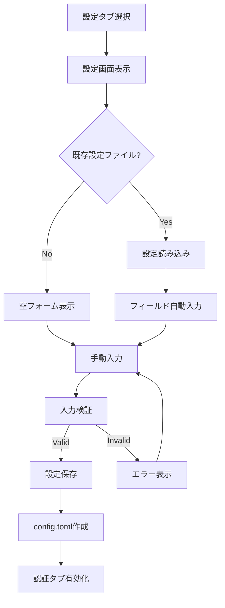
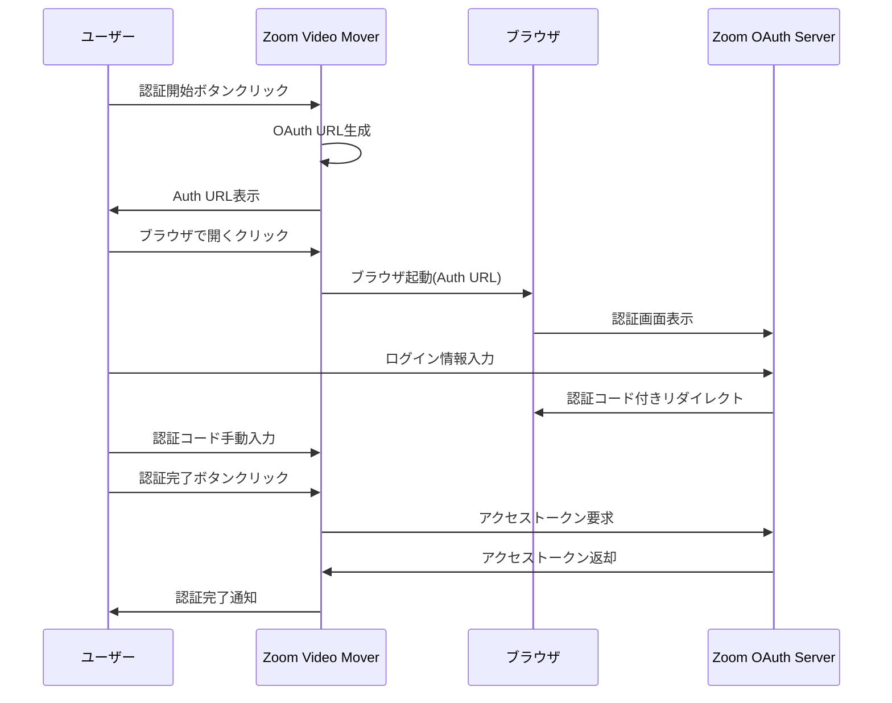
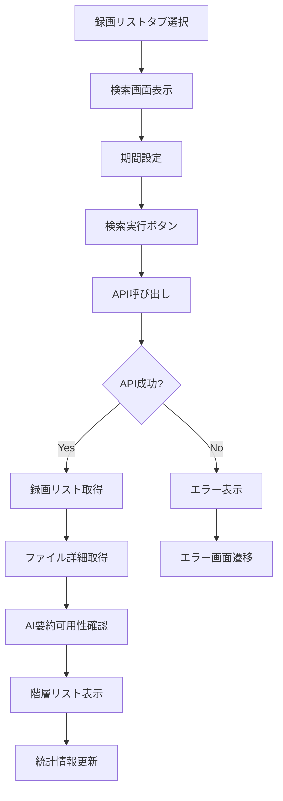
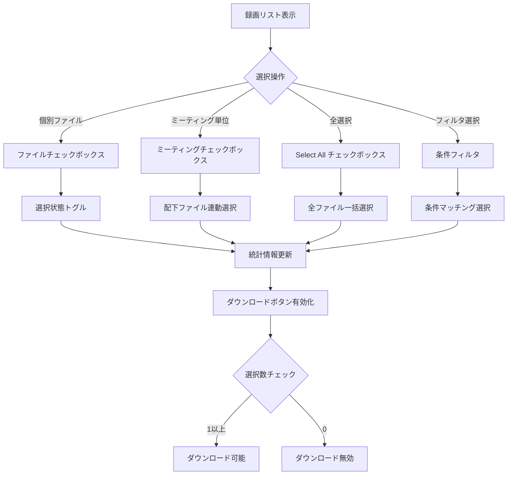
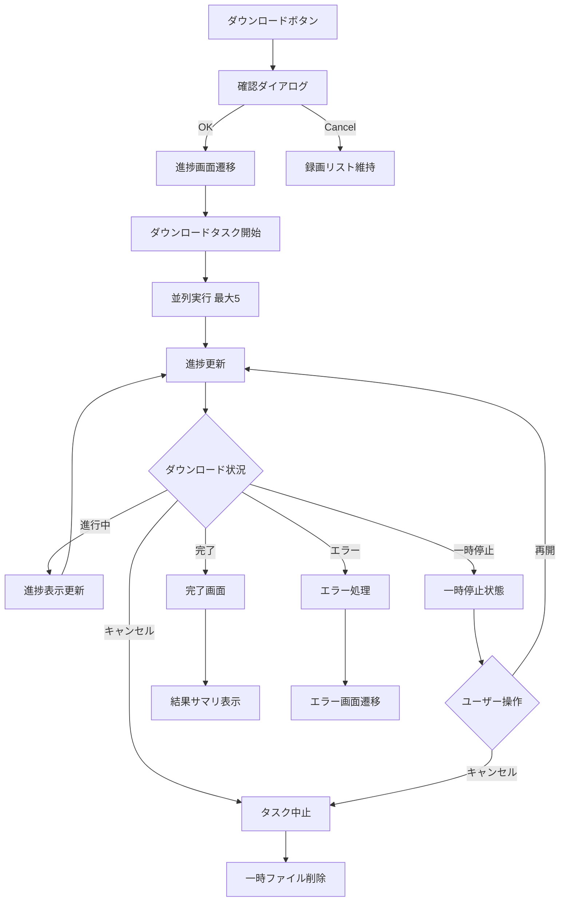
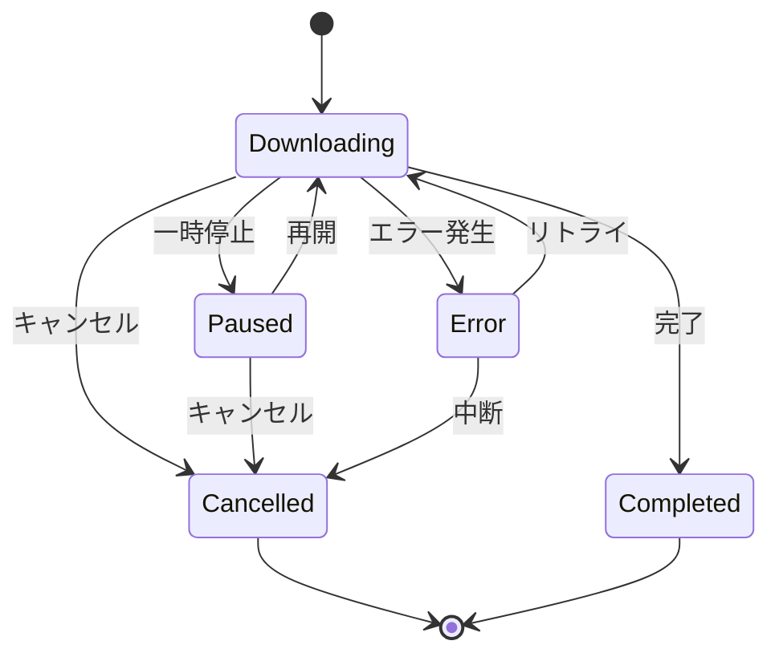

# 操作仕様書 - Zoom Video Mover

## 操作仕様概要

本文書は、Zoom Video Moverの操作手順、ユーザーインタラクション、および操作フローを詳細に定義します。GUIとCLI両方の操作仕様を含みます。

## 操作一覧

| 操作ID | 操作名 | 対象画面 | 実装箇所 | 対応要件 | 優先度 |
|--------|--------|----------|----------|----------|--------|
| **OP001** | アプリケーション起動 | - | main_gui.rs | FR004-1 | 高 |
| **OP002** | 設定入力・保存 | SC002 | gui.rs:render_config | FR001-2 | 高 |
| **OP003** | OAuth認証実行 | SC003 | gui.rs:render_auth | FR001-1 | 高 |
| **OP004** | 録画検索・一覧表示 | SC004 | gui.rs:render_recordings | FR002-1 | 高 |
| **OP005** | ファイル選択 | SC004 | gui.rs:render_recordings | FR004-3 | 高 |
| **OP006** | ダウンロード実行 | SC005 | gui.rs:render_progress | FR003-1 | 高 |
| **OP007** | 進捗監視・制御 | SC005 | gui.rs:render_progress | FR003-2 | 中 |
| **OP008** | エラー処理・回復 | SC006 | gui.rs:render_error | NFR002-1 | 高 |
| **OP009** | CLI実行 | - | main.rs | FR005 | 中 |

---

## OP001: アプリケーション起動

### 操作概要
- **目的**: Zoom Video Mover GUIアプリケーションの起動
- **前提条件**: Windows環境、実行権限
- **実装**: `main_gui.rs:main()`

### 操作手順

#### GUI起動
```bash
# 開発環境
cargo run --bin zoom_video_mover_gui

# リリース版
zoom_video_mover_gui.exe
```

#### 起動シーケンス
1. **アプリケーション初期化**
   - `ZoomDownloaderApp::default()` 実行
   - チャンネル（sender/receiver）作成
   - 初期状態設定

2. **設定ファイル確認**
   - `config.toml` 存在確認
   - 存在する場合: 自動読み込み → 認証タブ有効化
   - 存在しない場合: 設定タブ表示

3. **UI表示**
   - メインウィンドウ表示
   - 適切なタブを初期選択

### 操作結果
- **成功**: メインウィンドウが表示され、操作可能状態
- **失敗**: エラーメッセージ表示、アプリケーション終了

### エラーハンドリング
| エラー種別 | 原因 | 対処法 |
|------------|------|--------|
| 起動失敗 | eframe初期化エラー | システム要件確認 |
| 設定読み込みエラー | config.toml破損 | 設定ファイル再作成 |
| 権限エラー | 実行権限不足 | 管理者権限で実行 |

---

## OP002: 設定入力・保存

### 操作概要
- **目的**: Zoom OAuth設定の入力・永続化
- **対象画面**: SC002（設定画面）
- **実装**: `gui.rs:render_config()`

### 操作手順

#### 2.1 設定初期入力
1. **設定タブ選択**
   - メイン画面で「設定」タブをクリック
   - 設定画面（SC002）が表示される

2. **必須項目入力**
   ```
   Client ID: [Zoom Developer App Client ID]
   Client Secret: [Zoom Developer App Client Secret] (マスク表示)
   Output Directory: [C:\Users\...\Downloads\ZoomRecordings]
   ```

3. **入力検証**
   - Client ID: 空文字チェック、英数字形式
   - Client Secret: 空文字チェック、最小長度
   - Output Directory: パス存在確認、書き込み権限

4. **設定保存**
   - 「設定を保存」ボタンクリック
   - `Config::save_to_file("config.toml")` 実行
   - TOML形式でファイル保存

#### 2.2 設定読み込み
1. **設定読み込み実行**
   - 「設定を読込」ボタンクリック
   - `Config::load_from_file("config.toml")` 実行

2. **フィールド自動入力**
   - 読み込み成功時: 各フィールドに値設定
   - 読み込み失敗時: エラーメッセージ表示

### 操作フロー



### 入力制約・検証

| フィールド | 制約 | 検証ルール | エラーパターン |
|------------|------|------------|---------------|
| **Client ID** | 必須、英数字 | `/^[a-zA-Z0-9_-]+$/` | 空文字、無効文字 |
| **Client Secret** | 必須、最小20文字 | `length >= 20` | 空文字、短すぎる |
| **Output Directory** | 有効パス | ディレクトリ存在・書き込み可能 | 無効パス、権限なし |

### 操作結果
- **成功**: `config.toml`ファイル作成、認証タブアクティブ化
- **失敗**: エラーメッセージ表示、入力状態維持

---

## OP003: OAuth認証実行

### 操作概要
- **目的**: Zoom APIアクセス用のOAuth認証
- **対象画面**: SC003（認証画面）
- **実装**: `gui.rs:render_auth()`, `lib.rs:authenticate_user()`

### 操作手順

#### 3.1 認証URL生成
1. **認証タブ選択**
   - メイン画面で「認証」タブをクリック
   - 認証画面（SC003）表示

2. **認証開始**
   - 「認証開始」ボタンクリック
   - OAuth URL生成処理開始
   - `ZoomRecordingDownloader::generate_auth_url()` 実行

3. **認証URL表示**
   - 生成されたURLを画面表示
   - クリップボードコピー機能
   - ブラウザ起動ボタン有効化

#### 3.2 ブラウザ認証
1. **ブラウザ起動**
   - 「ブラウザで開く」ボタンクリック
   - デフォルトブラウザで認証URL開く
   - `std::process::Command::new("cmd").args(["/c", "start", url])` (Windows)

2. **Zoom認証画面**
   - Zoomログイン画面表示
   - ユーザー認証情報入力
   - アプリケーション許可確認

3. **リダイレクト処理**
   - 認証成功時: `http://localhost:8080/callback?code=...`
   - 認証失敗時: エラーページ表示

#### 3.3 認証コード入力
1. **認証コード取得**
   - ブラウザのリダイレクトURLから`code`パラメータ取得
   - 手動でコピー・ペースト

2. **認証コード入力**
   - 「Authorization Code」フィールドに貼り付け
   - 「認証完了」ボタンクリック

3. **アクセストークン取得**
   - `oauth2::exchange_code()` 実行
   - アクセストークン・リフレッシュトークン取得
   - 認証状態を`auth_complete`に更新

### 操作フロー



### エラーハンドリング

| エラー種別 | 原因 | 表示メッセージ | 回復操作 |
|------------|------|---------------|----------|
| **URL生成失敗** | 設定不正 | "Invalid OAuth configuration" | 設定確認 |
| **ネットワークエラー** | 接続失敗 | "Network connection failed" | 接続確認 |
| **認証拒否** | ユーザー拒否 | "Authentication was denied" | 再認証 |
| **無効コード** | 期限切れ・不正 | "Invalid authorization code" | 再取得 |
| **APIエラー** | Zoom API問題 | "Zoom API error: {message}" | リトライ |

---

## OP004: 録画検索・一覧表示

### 操作概要
- **目的**: Zoom録画の検索・一覧表示
- **対象画面**: SC004（録画リスト画面）
- **実装**: `gui.rs:render_recordings()`, `lib.rs:get_recordings()`

### 操作手順

#### 4.1 検索条件設定
1. **録画リストタブ選択**
   - 認証完了後、「録画リスト」タブが有効化
   - タブクリックで録画リスト画面表示

2. **検索期間設定**
   ```
   From: [2024-01-01] (DatePicker)
   To:   [2024-01-31] (DatePicker)
   ```
   - デフォルト: 過去30日間
   - 制約: `from_date <= to_date`
   - 最大期間: 1年間

3. **検索実行**
   - 「検索実行」ボタンクリック
   - Zoom API呼び出し開始: `GET /users/me/recordings`
   - ローディング状態表示

#### 4.2 検索結果表示
1. **API応答処理**
   - 録画リスト取得: `meetings[]`
   - 各録画の詳細ファイル情報取得
   - AI要約の可用性確認

2. **階層リスト表示**
   ```
   ☑ Meeting 1 - 2024-01-15 10:00
     ├─ ☑ Video (MP4) - 1.2GB
     ├─ ☑ Audio (MP3) - 45MB  
     ├─ ☑ Chat (TXT) - 2KB
     ├─ ☑ AI Summary (JSON) - 5KB
     └─ ☑ Transcript (VTT) - 12KB
   ```

3. **統計情報表示**
   - 総ファイル数: `Total: 25 files`
   - 総サイズ: `Total Size: 5.2GB`
   - 選択状況: `Selected: 3.8GB (18 files)`

### 操作フロー



### API呼び出し仕様

| API | エンドポイント | パラメータ | 応答 |
|-----|---------------|------------|------|
| **録画リスト取得** | `GET /users/me/recordings` | `from`, `to`, `page_size` | `meetings[]` |
| **録画詳細取得** | `GET /meetings/{meetingId}/recordings` | `meetingId` | `recording_files[]` |
| **AI要約取得** | `GET /meetings/{meetingId}/ai_companion` | `meetingId` | `summary_details` |

### データ表示項目

| 項目 | データソース | 表示形式 | 備考 |
|------|-------------|----------|------|
| **ミーティング名** | `meetings[].topic` | 文字列 | 最大50文字 |
| **開催日時** | `meetings[].start_time` | `YYYY-MM-DD HH:mm` | タイムゾーン変換 |
| **ファイル種別** | `recording_files[].file_type` | アイコン+拡張子 | MP4/MP3/TXT/JSON/VTT |
| **ファイルサイズ** | `recording_files[].file_size` | `1.2GB`, `45MB` | 単位自動調整 |
| **AI要約状況** | API可用性 | `Available` / `N/A` | 機能有効性に依存 |

---

## OP005: ファイル選択

### 操作概要
- **目的**: ダウンロード対象ファイルの選択
- **対象画面**: SC004（録画リスト画面）
- **実装**: `gui.rs:render_recordings()` - チェックボックス処理

### 操作手順

#### 5.1 個別選択
1. **ファイル単位選択**
   - 各ファイル横のチェックボックスをクリック
   - 選択状態トグル（ON/OFF）
   - 統計情報リアルタイム更新

2. **ミーティング単位選択**
   - ミーティング名横のチェックボックスをクリック
   - 配下全ファイルの選択状態連動
   - 一部選択時は「中間状態」表示

#### 5.2 一括選択
1. **全選択**
   - 「Select All」チェックボックスをクリック
   - 全ミーティング・全ファイル選択
   - 統計情報更新: `Selected: [Total Size] ([Total Count] files)`

2. **全解除**
   - 「Select All」チェックボックス再クリック
   - 全選択解除
   - 統計情報更新: `Selected: 0MB (0 files)`

#### 5.3 条件付き選択
1. **ファイル種別フィルタ**
   - 「Video Only」「Audio Only」等のフィルタボタン
   - 指定種別のファイルのみ選択
   - 他の種別は選択解除

2. **サイズ制限選択**
   - 「Under 100MB」等のサイズフィルタ
   - 条件に合致するファイルのみ選択

### 選択状態管理

#### データ構造
```rust
struct FileSelection {
    meeting_id: String,
    file_id: String,
    file_type: String,
    file_size: u64,
    is_selected: bool,
}

struct SelectionState {
    selections: HashMap<String, FileSelection>,
    total_selected_size: u64,
    total_selected_count: usize,
}
```

#### 選択ロジック
```rust
// 個別ファイル選択
fn toggle_file_selection(&mut self, file_id: &str) {
    if let Some(selection) = self.selections.get_mut(file_id) {
        selection.is_selected = !selection.is_selected;
        self.update_statistics();
        self.update_parent_meeting_state();
    }
}

// ミーティング一括選択
fn toggle_meeting_selection(&mut self, meeting_id: &str) {
    let new_state = !self.is_meeting_fully_selected(meeting_id);
    for (_, selection) in self.selections.iter_mut() {
        if selection.meeting_id == meeting_id {
            selection.is_selected = new_state;
        }
    }
    self.update_statistics();
}
```

### 操作フロー



### 選択制約・検証

| 制約項目 | 制約内容 | 検証タイミング | エラー処理 |
|----------|----------|---------------|------------|
| **最大選択数** | 50ファイル以内 | 選択時 | 警告表示、選択拒否 |
| **最大サイズ** | 10GB以内 | 選択時 | 警告表示、選択拒否 |
| **必須選択** | 1ファイル以上 | ダウンロード開始時 | エラーメッセージ |
| **ファイル存在** | API上で有効 | 選択時 | 無効ファイル除外 |

---

## OP006: ダウンロード実行

### 操作概要
- **目的**: 選択したファイルのローカルダウンロード
- **対象画面**: SC005（ダウンロード進捗画面）
- **実装**: `gui.rs:render_progress()`, `lib.rs:download_recording()`

### 操作手順

#### 6.1 ダウンロード開始
1. **ダウンロード開始**
   - 録画リスト画面で「ダウンロード」ボタンクリック
   - 選択ファイル確認ダイアログ表示
   - 確認後、ダウンロード進捗画面遷移

2. **ダウンロード設定確認**
   ```
   選択ファイル: 15 files
   合計サイズ: 3.2GB
   保存先: C:\Users\...\Downloads\ZoomRecordings
   ```

3. **並列ダウンロード開始**
   - 最大5並列でダウンロード実行
   - セマフォで同時実行数制御
   - 各ファイルで独立したダウンロードタスク

#### 6.2 進捗監視
1. **全体進捗表示**
   - 全体進捗バー: `[████████████░░░░] 75%`
   - 完了ファイル数: `Completed: 12/15`
   - 残り時間推定: `Estimated: 2min 30sec`

2. **個別ファイル進捗**
   - 現在DL中ファイル名表示
   - 個別進捗バー: `[██████████░░] 60% (720MB/1.2GB)`
   - 転送速度: `Speed: 5.2MB/s`

3. **ログ出力**
   ```
   [10:30:15] Started downloading Meeting_2024-01-15_video.mp4
   [10:30:45] Downloaded 25% (300MB/1.2GB) - Speed: 4.8MB/s
   [10:31:15] Downloaded 50% (600MB/1.2GB) - Speed: 5.1MB/s
   [10:31:45] Completed Meeting_2024-01-15_video.mp4
   ```

#### 6.3 ダウンロード制御
1. **一時停止**
   - 「一時停止」ボタンクリック
   - 全ダウンロードタスク一時停止
   - ボタン表示変更: 「再開」

2. **キャンセル**
   - 「キャンセル」ボタンクリック
   - 確認ダイアログ表示: "Are you sure you want to cancel all downloads?"
   - 確認後、全タスクキャンセル、一時ファイル削除

### 操作フロー



### ダウンロード実装詳細

#### 並列制御
```rust
use tokio::sync::Semaphore;

const MAX_CONCURRENT_DOWNLOADS: usize = 5;

async fn download_files(&self, files: Vec<FileInfo>) -> Result<(), Error> {
    let semaphore = Arc::new(Semaphore::new(MAX_CONCURRENT_DOWNLOADS));
    let mut tasks = Vec::new();
    
    for file in files {
        let permit = semaphore.clone().acquire_owned().await?;
        let task = tokio::spawn(async move {
            let _permit = permit; // Keep permit until task completes
            download_single_file(file).await
        });
        tasks.push(task);
    }
    
    // Wait for all downloads to complete
    for task in tasks {
        task.await??;
    }
    
    Ok(())
}
```

#### 進捗通知
```rust
struct DownloadProgress {
    file_name: String,
    bytes_downloaded: u64,
    total_bytes: u64,
    speed_bps: u64,
    eta_seconds: u64,
}

fn send_progress_update(&self, progress: DownloadProgress) {
    let message = AppMessage::DownloadProgress(format!(
        "[{}] {} - {}% ({}/{}) - Speed: {}/s",
        chrono::Local::now().format("%H:%M:%S"),
        progress.file_name,
        (progress.bytes_downloaded * 100 / progress.total_bytes),
        format_bytes(progress.bytes_downloaded),
        format_bytes(progress.total_bytes),
        format_bytes(progress.speed_bps)
    ));
    
    self.sender.send(message).unwrap();
}
```

### エラーハンドリング

| エラー種別 | 検出タイミング | 回復処理 | ユーザー操作 |
|------------|---------------|----------|--------------|
| **ネットワークエラー** | ダウンロード中 | 3回自動リトライ | 手動リトライ |
| **ディスク容量不足** | 書き込み時 | ダウンロード中断 | 容量確保後再開 |
| **権限エラー** | ファイル作成時 | 権限確認要求 | 管理者権限で再実行 |
| **API制限エラー** | API呼び出し時 | レート制限待機 | 自動待機、進捗表示 |
| **ファイル破損** | 検証時 | 該当ファイル再DL | 手動再試行 |

---

## OP007: 進捗監視・制御

### 操作概要
- **目的**: ダウンロード進捗のリアルタイム監視と制御
- **対象画面**: SC005（ダウンロード進捗画面）
- **実装**: `gui.rs:render_progress()` - 進捗表示・制御

### 操作手順

#### 7.1 進捗表示監視
1. **リアルタイム更新**
   - 1秒間隔で進捗情報更新
   - UI要素の動的更新:
     - 全体進捗バー
     - 現在ファイル進捗バー
     - 統計情報（完了数/総数、サイズ、残り時間）

2. **ログ監視**
   - ダウンロードログのリアルタイム追加
   - 自動スクロール（最新ログを表示）
   - ログレベル: INFO, WARN, ERROR

3. **転送速度計算**
   - 移動平均による速度算出（過去10秒間）
   - 帯域使用率表示
   - 残り時間のETAアップデート

#### 7.2 ダウンロード制御操作
1. **一時停止・再開**
   ```
   一時停止時の操作:
   - [一時停止] → [再開] ボタン表示変更
   - 全ダウンロードタスクのsuspend
   - 進捗維持（部分ダウンロード状態保持）
   
   再開時の操作:
   - [再開] → [一時停止] ボタン表示変更  
   - 中断位置からのresume
   - 進捗カウンタ継続
   ```

2. **個別ファイルスキップ**
   - 現在DL中ファイルのスキップボタン
   - 該当ファイルをスキップリストに追加
   - 次ファイルへの自動移行

3. **全体キャンセル**
   - 確認ダイアログ表示
   - 全タスクの安全な中断
   - 一時ファイルのクリーンアップ

### 操作フロー



### 進捗データ更新

#### 更新頻度・タイミング
| 更新項目 | 更新頻度 | 更新契機 |
|----------|----------|----------|
| **全体進捗バー** | 1秒毎 | タイマーイベント |
| **現在ファイル進捗** | 1秒毎 | ダウンロード進捗通知 |
| **転送速度** | 1秒毎 | バイト数差分計算 |
| **ログ出力** | リアルタイム | ログイベント発生時 |
| **統計情報** | 1秒毎 | 進捗変更時 |

#### パフォーマンス考慮
- GUI更新の最小化（変更差分のみ更新）
- ログ表示の制限（最新1000行まで）
- バックグラウンドタスクとのメッセージング最適化

---

## OP008: エラー処理・回復

### 操作概要
- **目的**: エラー発生時の適切な処理と回復操作
- **対象画面**: SC006（エラー表示画面）
- **実装**: `gui.rs:render_error()`

### 操作手順

#### 8.1 エラー検出・表示
1. **エラー検出**
   - 各操作でのResult型エラー検出
   - 非同期タスクからのエラー通知
   - タイムアウト・例外の捕捉

2. **エラー分類・表示**
   ```
   エラー種別の分類:
   - 認証エラー (AUTH_xxx)
   - ネットワークエラー (NET_xxx)  
   - APIエラー (API_xxx)
   - ファイルシステムエラー (FILE_xxx)
   ```

3. **エラー詳細情報**
   - エラーコード・メッセージ
   - 発生タイムスタンプ
   - スタックトレース（デバッグ時）
   - 推奨アクション

#### 8.2 回復操作
1. **自動回復**
   ```rust
   // ネットワークエラーの自動リトライ
   for attempt in 1..=3 {
       match download_file(&url).await {
           Ok(data) => return Ok(data),
           Err(e) if attempt < 3 => {
               tokio::time::sleep(Duration::from_secs(2_u64.pow(attempt))).await;
               continue;
           }
           Err(e) => return Err(e),
       }
   }
   ```

2. **手動回復操作**
   - **リトライボタン**: 同一操作の再実行
   - **設定に戻るボタン**: 設定見直し画面へ遷移
   - **ログ出力ボタン**: エラーログのファイル出力

### エラー分類・処理方針

| エラー分類 | 自動回復 | 手動回復 | 画面遷移 |
|------------|----------|----------|----------|
| **AUTH_001** (認証失敗) | なし | 設定確認・再認証 | 設定画面 |
| **NET_001** (接続タイムアウト) | 3回リトライ | 接続確認・手動リトライ | 元画面 |
| **API_001** (レート制限) | 待機後自動リトライ | 待機表示 | 進捗画面 |
| **FILE_001** (権限エラー) | なし | 権限確認・パス変更 | 設定画面 |

---

## OP009: CLI実行

### 操作概要
- **目的**: コマンドライン環境での Zoom Video Mover実行
- **実装**: `main.rs` (非推奨・将来削除予定)
- **対応要件**: FR005（CLI操作）

### 基本実行コマンド
```bash
# 基本実行
cargo run

# リリース版実行  
zoom_video_mover.exe

# パラメータ指定実行
zoom_video_mover.exe --config config.toml --from 2024-01-01 --to 2024-01-31
```

### コマンドライン引数

| 引数 | 短縮形 | 説明 | デフォルト値 | 例 |
|------|--------|------|-------------|-----|
| `--config` | `-c` | 設定ファイルパス | `config.toml` | `-c my_config.toml` |
| `--from` | `-f` | 検索開始日 | 30日前 | `-f 2024-01-01` |
| `--to` | `-t` | 検索終了日 | 今日 | `-t 2024-01-31` |
| `--output` | `-o` | 出力ディレクトリ | `./downloads` | `-o /path/to/downloads` |
| `--verbose` | `-v` | 詳細ログ出力 | false | `-v` |
| `--help` | `-h` | ヘルプ表示 | - | `-h` |

### CLI操作フロー
```bash
# 1. 設定ファイル確認
./zoom_video_mover --config check

# 2. OAuth認証（ブラウザ起動）
./zoom_video_mover --auth

# 3. 録画リスト表示
./zoom_video_mover --list --from 2024-01-01 --to 2024-01-31

# 4. 全録画ダウンロード
./zoom_video_mover --download-all --from 2024-01-01 --to 2024-01-31

# 5. 特定録画ダウンロード
./zoom_video_mover --download --meeting-id 123456789
```

---

## 操作性・ユーザビリティ要件

### キーボードショートカット

| ショートカット | 機能 | 対象画面 |
|---------------|------|----------|
| `Ctrl+S` | 設定保存 | 設定画面 |
| `F5` | 録画リスト更新 | 録画リスト画面 |
| `Ctrl+A` | 全選択 | 録画リスト画面 |
| `Space` | 一時停止/再開 | 進捗画面 |
| `Esc` | キャンセル/戻る | 全画面 |
| `Ctrl+C` | URLコピー | 認証画面 |

### アクセシビリティ対応

| 項目 | 要件 | 実装方針 |
|------|------|----------|
| **Tab順序** | 論理的なフォーカス移動 | tabindex適切設定 |
| **スクリーンリーダー** | 読み上げ対応 | aria-label設定 |
| **キーボード操作** | マウス不要操作 | 全機能キーボード対応 |
| **高コントラスト** | 視認性向上 | テーマ切り替え対応 |

### 操作効率化

| 機能 | 目的 | 実装 |  
|------|------|------|
| **操作履歴** | 繰り返し操作の効率化 | 最近使用した設定の保存 |
| **一括操作** | 複数ファイルの効率処理 | 全選択・フィルタ選択 |
| **進捗保存** | 中断・再開対応 | 部分ダウンロード状態保持 |
| **設定テンプレート** | 複数環境対応 | 設定プリセット機能 |