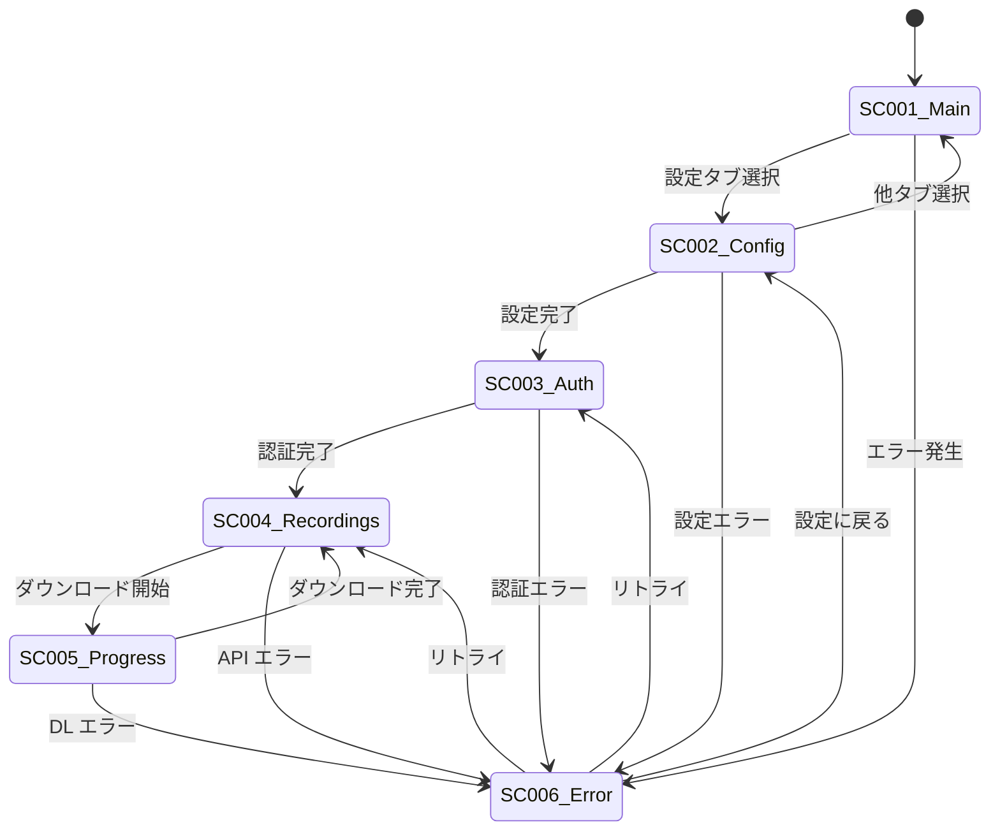

# 画面仕様書 - Zoom Video Mover

## 画面仕様概要

本文書は、Zoom Video MoverのGUIアプリケーション（`main_gui.rs` + `gui.rs`）における画面仕様を詳細に定義します。

## 画面一覧

| 画面ID | 画面名 | 実装ファイル | 対応要件 | 備考 |
|--------|--------|-------------|----------|------|
| **SC001** | メイン画面 | gui.rs:ZoomDownloaderApp | FR004-1 | アプリケーションのメイン画面 |
| **SC002** | 設定画面 | gui.rs:render_config | FR004-2 | OAuth設定入力 |
| **SC003** | 認証画面 | gui.rs:render_auth | FR001-1 | OAuth認証フロー |
| **SC004** | 録画リスト画面 | gui.rs:render_recordings | FR002-2 | 録画ファイル一覧表示 |
| **SC005** | ダウンロード進捗画面 | gui.rs:render_progress | FR003-2 | ダウンロード状況表示 |
| **SC006** | エラー表示画面 | gui.rs:render_error | NFR002-1 | エラーメッセージ表示 |

---

## SC001: メイン画面

### 画面概要
- **目的**: アプリケーションの統合制御画面
- **実装**: `gui.rs:ZoomDownloaderApp::update()`
- **状態管理**: `ZoomDownloaderApp` struct
- **対応要件**: FR004-1（egui/eframe UI）

### レイアウト構成

```
┌─────────────────────────────────────────────────────────────────┐
│                    Zoom Video Mover                             │
├─────────────────────────────────────────────────────────────────┤
│ [設定タブ] [認証タブ] [録画リストタブ] [ダウンロードタブ]        │
├─────────────────────────────────────────────────────────────────┤
│                                                                 │
│              [現在のタブコンテンツ表示エリア]                     │
│                                                                 │
│                     (動的に変更される)                           │
│                                                                 │
├─────────────────────────────────────────────────────────────────┤
│ Status: [Ready / Authenticating / Downloading / Error]          │
└─────────────────────────────────────────────────────────────────┘
```

### UI要素詳細

| 要素ID | 要素名 | 型 | 表示条件 | 機能 |
|--------|--------|-----|----------|------|
| **MC001** | ウィンドウタイトル | Static Text | 常時 | "Zoom Video Mover" |
| **MC002** | タブコンテナ | TabItem | 常時 | 画面切り替え |
| **MC003** | ステータスバー | Label | 常時 | アプリケーション状態表示 |
| **MC004** | 設定タブ | TabItem | 常時 | 設定画面へ遷移 |
| **MC005** | 認証タブ | TabItem | config_loaded = true | 認証画面へ遷移 |
| **MC006** | 録画リストタブ | TabItem | access_token != None | 録画リスト画面へ遷移 |
| **MC007** | ダウンロードタブ | TabItem | is_downloading = true | 進捗画面へ遷移 |

### 状態変数

| 変数名 | 型 | 初期値 | 説明 |
|--------|-----|--------|------|
| `config_loaded` | bool | false | 設定ファイル読み込み完了フラグ |
| `auth_url` | Option<String> | None | OAuth認証URL |
| `is_authenticating` | bool | false | 認証処理中フラグ |
| `is_downloading` | bool | false | ダウンロード処理中フラグ |
| `access_token` | Option<String> | None | OAuth アクセストークン |
| `status_message` | String | "Ready" | ステータスメッセージ |

---

## SC002: 設定画面

### 画面概要
- **目的**: OAuth設定の入力・保存
- **実装**: `gui.rs:render_config()`
- **対応要件**: FR004-2（設定画面）、FR001-2（Client ID/Secret設定）

### レイアウト構成

```
┌─────────────────────────────────────────────────────────────────┐
│                         設定                                     │
├─────────────────────────────────────────────────────────────────┤
│ Client ID:                                                      │
│ ┌─────────────────────────────────────────────────────────────┐ │
│ │ [client_id入力フィールド]                                     │ │
│ └─────────────────────────────────────────────────────────────┘ │
│                                                                 │
│ Client Secret:                                                  │
│ ┌─────────────────────────────────────────────────────────────┐ │
│ │ [client_secret入力フィールド（パスワード形式）]                 │ │
│ └─────────────────────────────────────────────────────────────┘ │
│                                                                 │
│ Output Directory:                                               │
│ ┌─────────────────────────────────────────────────────────────┐ │
│ │ [output_dir入力フィールド]                                    │ │
│ └─────────────────────────────────────────────────────────────┘ │
│                                                                 │
│ ┌─────────────┐  ┌─────────────┐                               │
│ │ [設定を保存]  │  │ [設定を読込] │                               │
│ └─────────────┘  └─────────────┘                               │
└─────────────────────────────────────────────────────────────────┘
```

### UI要素詳細

| 要素ID | 要素名 | 型 | バリデーション | 機能 |
|--------|--------|-----|---------------|------|
| **CF001** | Client ID入力 | TextEdit | 必須、1文字以上 | Zoom OAuth Client ID入力 |
| **CF002** | Client Secret入力 | TextEdit(Password) | 必須、1文字以上 | Zoom OAuth Client Secret入力 |
| **CF003** | 出力ディレクトリ入力 | TextEdit | パス形式 | ダウンロード先フォルダ指定 |
| **CF004** | 設定保存ボタン | Button | - | 設定をconfig.tomlに保存 |
| **CF005** | 設定読込ボタン | Button | - | config.tomlから設定を読込 |

### 入力検証ルール

| フィールド | 検証ルール | エラーメッセージ |
|------------|------------|------------------|
| Client ID | 空文字禁止 | "Client ID is required" |
| Client Secret | 空文字禁止 | "Client Secret is required" |
| Output Directory | ディレクトリ存在確認 | "Invalid directory path" |

---

## SC003: 認証画面

### 画面概要
- **目的**: OAuth認証フローの実行
- **実装**: `gui.rs:render_auth()`
- **対応要件**: FR001-1（OAuth 2.0認証フロー）

### レイアウト構成

```
┌─────────────────────────────────────────────────────────────────┐
│                         認証                                     │
├─────────────────────────────────────────────────────────────────┤
│ Status: [Ready / Generating Auth URL / Waiting for Code]        │
│                                                                 │
│ ┌─────────────────┐                                             │
│ │ [認証開始]       │  ← config_loaded = true時のみ有効            │
│ └─────────────────┘                                             │
│                                                                 │
│ Auth URL: [生成されたURL] 📋 [コピー]                             │
│                                                                 │
│ ┌─────────────────┐                                             │
│ │ [ブラウザで開く] │  ← auth_url生成後に有効                       │
│ └─────────────────┘                                             │
│                                                                 │
│ Authorization Code:                                             │
│ ┌─────────────────────────────────────────────────────────────┐ │
│ │ [auth_code入力フィールド]                                     │ │
│ └─────────────────────────────────────────────────────────────┘ │
│                                                                 │
│ ┌─────────────────┐                                             │
│ │ [認証完了]       │  ← auth_code入力後に有効                     │
│ └─────────────────┘                                             │
└─────────────────────────────────────────────────────────────────┘
```

### UI要素詳細

| 要素ID | 要素名 | 型 | 有効条件 | 機能 |
|--------|--------|-----|----------|------|
| **AU001** | 認証開始ボタン | Button | config_loaded = true | OAuth認証URL生成 |
| **AU002** | Auth URL表示 | Label | auth_url != None | 生成されたOAuth URL表示 |
| **AU003** | URLコピーボタン | Button | auth_url != None | URLをクリップボードにコピー |
| **AU004** | ブラウザ起動ボタン | Button | auth_url != None | デフォルトブラウザでURL開く |
| **AU005** | 認証コード入力 | TextEdit | auth_url != None | OAuth認証コード手動入力 |
| **AU006** | 認証完了ボタン | Button | !auth_code.is_empty() | 認証コードでトークン取得 |

### 状態遷移

```
Ready → [認証開始] → Generating Auth URL → Auth URL Generated → 
[ブラウザで開く] → User Authentication → [認証コード入力] → 
[認証完了] → Token Retrieved → Auth Complete
```

---

## SC004: 録画リスト画面

### 画面概要
- **目的**: Zoom録画ファイルの一覧表示と選択
- **実装**: `gui.rs:render_recordings()`
- **対応要件**: FR002-2（録画リスト表示）、FR004-3（ファイル選択）

### レイアウト構成

```
┌─────────────────────────────────────────────────────────────────┐
│                       録画リスト                                 │
├─────────────────────────────────────────────────────────────────┤
│ 検索期間:                                                        │
│ From: [YYYY-MM-DD] To: [YYYY-MM-DD] ┌─────────────┐              │
│                                     │ [検索実行]  │              │
│                                     └─────────────┘              │
├─────────────────────────────────────────────────────────────────┤
│ ☑ Select All                                                   │
├─────────────────────────────────────────────────────────────────┤
│ ☑ Meeting 1 - 2024-01-15 10:00                                 │
│   │ ☑ Video (MP4) - 1.2GB                                      │
│   │ ☑ Audio (MP3) - 45MB                                       │
│   │ ☑ Chat (TXT) - 2KB                                         │
│   │ ☑ AI Summary (JSON) - 5KB                                  │
│   └ ☑ Transcript (VTT) - 12KB                                  │
│                                                                 │
│ ☑ Meeting 2 - 2024-01-16 14:30                                 │
│   │ ☑ Video (MP4) - 980MB                                      │
│   │ ☑ Audio (MP3) - 38MB                                       │
│   │ ☑ Chat (TXT) - 1KB                                         │
│   └ ☐ AI Summary (JSON) - N/A                                  │
│                                                                 │
├─────────────────────────────────────────────────────────────────┤
│ Total Size: 2.3GB  Selected: 1.8GB                             │
│                                     ┌─────────────┐              │
│                                     │ [ダウンロード] │              │
│                                     └─────────────┘              │
└─────────────────────────────────────────────────────────────────┘
```

### UI要素詳細

| 要素ID | 要素名 | 型 | 機能 | 備考 |
|--------|--------|-----|------|------|
| **RL001** | From日付入力 | DatePicker | 検索開始日指定 | YYYY-MM-DD形式 |
| **RL002** | To日付入力 | DatePicker | 検索終了日指定 | from_date <= to_date |
| **RL003** | 検索実行ボタン | Button | 録画リスト取得 | API呼び出し実行 |
| **RL004** | 全選択チェックボックス | Checkbox | 全ファイル一括選択 | 階層選択対応 |
| **RL005** | ミーティング選択 | Checkbox | ミーティング単位選択 | 子ファイル連動 |
| **RL006** | ファイル選択 | Checkbox | 個別ファイル選択 | ファイル種別別 |
| **RL007** | ダウンロード開始ボタン | Button | 選択ファイルDL開始 | 選択数1以上で有効 |

### データ表示項目

| 項目 | 内容 | データソース |
|------|------|-------------|
| Meeting Title | 会議名 | Zoom API: topic |
| Meeting Date | 開催日時 | Zoom API: start_time |
| File Type | ファイル種別 | MP4/MP3/TXT/JSON/VTT |
| File Size | ファイルサイズ | Zoom API: file_size |
| AI Summary | AI要約有無 | 可用性に応じて表示 |

---

## SC005: ダウンロード進捗画面

### 画面概要
- **目的**: ダウンロード進捗のリアルタイム表示
- **実装**: `gui.rs:render_progress()`
- **対応要件**: FR003-2（進捗表示）

### レイアウト構成

```
┌─────────────────────────────────────────────────────────────────┐
│                     ダウンロード進捗                             │
├─────────────────────────────────────────────────────────────────┤
│ Overall Progress: [████████████████████████░░░░░░░░] 80%        │
│                                                                 │
│ Current: Meeting_2024-01-15_video.mp4                          │
│ Progress: [██████████████████░░░░░░░░░░░░] 60% (720MB/1.2GB)   │
│                                                                 │
│ ┌─────────────┐  ┌─────────────┐                               │
│ │ [一時停止]    │  │ [キャンセル]  │                               │
│ └─────────────┘  └─────────────┘                               │
│                                                                 │
├─────────────────────────────────────────────────────────────────┤
│ Download Log:                                                   │
│ ┌─────────────────────────────────────────────────────────────┐ │
│ │ [10:30:15] Started downloading Meeting_2024-01-15_video.mp4 │ │
│ │ [10:30:45] Downloaded 25% (300MB/1.2GB)                    │ │
│ │ [10:31:15] Downloaded 50% (600MB/1.2GB)                    │ │
│ │ [10:31:30] Downloaded 60% (720MB/1.2GB)                    │ │
│ │ [10:31:45] ...                                              │ │
│ └─────────────────────────────────────────────────────────────┘ │
│                                                                 │
│ Completed Files: 3/7                                           │
│ Total Downloaded: 890MB / 2.3GB                                │
│ Estimated Time: 5min 30sec remaining                           │
└─────────────────────────────────────────────────────────────────┘
```

### UI要素詳細

| 要素ID | 要素名 | 型 | 機能 | 更新頻度 |
|--------|--------|-----|------|----------|
| **PR001** | 全体進捗バー | ProgressBar | 全ファイルの進捗表示 | 1秒毎 |
| **PR002** | 現在ファイル名 | Label | 現在DL中ファイル表示 | ファイル切替時 |
| **PR003** | ファイル進捗バー | ProgressBar | 現在ファイルの進捗 | 1秒毎 |
| **PR004** | 一時停止ボタン | Button | DL一時停止/再開 | トグル動作 |
| **PR005** | キャンセルボタン | Button | DL処理中止 | 確認ダイアログ表示 |
| **PR006** | ログ表示エリア | ScrollArea | DL履歴表示 | リアルタイム追加 |
| **PR007** | 統計情報 | Label | 完了数/総数/残り時間 | 1秒毎 |

### 進捗データ構造

```rust
struct DownloadProgress {
    total_files: usize,
    completed_files: usize,
    current_file: String,
    current_progress: f32,       // 0.0-1.0
    total_bytes: u64,
    downloaded_bytes: u64,
    estimated_remaining: Duration,
    log_messages: Vec<String>,
}
```

---

## SC006: エラー表示画面

### 画面概要
- **目的**: エラーメッセージとリカバリ操作の提供
- **実装**: `gui.rs:render_error()`
- **対応要件**: NFR002-1（エラーハンドリング）

### レイアウト構成

```
┌─────────────────────────────────────────────────────────────────┐
│                         ⚠ エラー                                │
├─────────────────────────────────────────────────────────────────┤
│ エラー種別: [認証エラー / ネットワークエラー / ファイルエラー]     │
│                                                                 │
│ エラーメッセージ:                                                │
│ ┌─────────────────────────────────────────────────────────────┐ │
│ │ OAuth authentication failed: Invalid client credentials    │ │
│ │ Please check your Client ID and Client Secret in settings. │ │
│ └─────────────────────────────────────────────────────────────┘ │
│                                                                 │
│ 詳細情報:                                                        │
│ ┌─────────────────────────────────────────────────────────────┐ │
│ │ Error Code: 401                                             │ │
│ │ Timestamp: 2024-01-15 10:30:15                             │ │
│ │ Request URL: https://zoom.us/oauth/token                    │ │
│ │ Stack Trace: [展開可能]                                      │ │
│ └─────────────────────────────────────────────────────────────┘ │
│                                                                 │
│ 推奨アクション:                                                  │
│ • 設定画面でClient IDとClient Secretを確認してください            │
│ • インターネット接続を確認してください                            │
│ • Zoom Developer Appの設定を確認してください                    │
│                                                                 │
│ ┌─────────────┐  ┌─────────────┐  ┌─────────────┐              │
│ │ [リトライ]    │  │ [設定に戻る] │  │ [ログ出力]  │              │
│ └─────────────┘  └─────────────┘  └─────────────┘              │
└─────────────────────────────────────────────────────────────────┘
```

### エラー分類と表示内容

| エラー分類 | エラーコード | 表示メッセージ | 推奨アクション |
|------------|-------------|---------------|---------------|
| **認証エラー** | AUTH_001 | Invalid client credentials | 設定確認 |
| **認証エラー** | AUTH_002 | Token expired | 再認証実行 |
| **ネットワークエラー** | NET_001 | Connection timeout | 接続確認 |
| **ネットワークエラー** | NET_002 | DNS resolution failed | DNS設定確認 |
| **APIエラー** | API_001 | Rate limit exceeded | 待機後リトライ |
| **APIエラー** | API_002 | Recording not found | 録画存在確認 |
| **ファイルエラー** | FILE_001 | Permission denied | 権限確認 |
| **ファイルエラー** | FILE_002 | Disk space insufficient | 容量確認 |

## 画面間遷移図



## 画面サイズ・解像度要件

| 項目 | 要件 | 備考 |
|------|------|------|
| **最小ウィンドウサイズ** | 800x600 | Windows標準 |
| **推奨ウィンドウサイズ** | 1024x768 | 快適操作サイズ |
| **最大ウィンドウサイズ** | 制限なし | 画面解像度依存 |
| **DPI対応** | 100%-200% | Windows拡大表示対応 |
| **フォントサイズ** | 12-16pt | 可読性重視 |

## アクセシビリティ要件

| 項目 | 要件 | 実装方法 |
|------|------|----------|
| **キーボード操作** | Tab/Enter/Space対応 | egui標準機能 |
| **フォーカス表示** | 視覚的フォーカス表示 | 枠線・背景色変更 |
| **コントラスト** | 4.5:1以上 | ダーク/ライトテーマ |
| **エラー通知** | 視覚・音声通知 | システム通知使用 |
| **多言語対応** | 日本語・英語 | 将来拡張予定 |